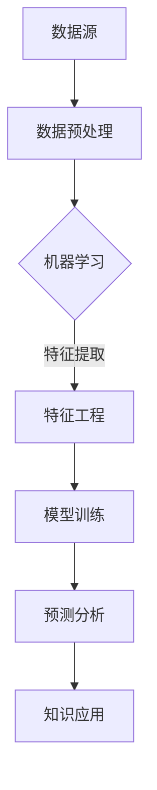

                 

关键词：知识发现引擎，数据挖掘，人工智能，知识图谱，机器学习，知识应用。

## 摘要

在信息爆炸的时代，如何有效地从海量数据中提取有价值的信息成为了一项重要任务。知识发现引擎作为一种先进的智能化工具，通过利用机器学习和知识图谱等技术，实现了对复杂数据的深入挖掘与分析，为各行各业带来了前所未有的变革。本文将详细探讨知识发现引擎的核心概念、算法原理、数学模型及其在实际应用中的表现，旨在为读者开启知识应用新时代提供有价值的参考。

## 1. 背景介绍

### 1.1 知识发现引擎的定义

知识发现引擎（Knowledge Discovery Engine，简称KDE）是一种基于人工智能和机器学习的智能化工具，旨在从大规模数据集中自动提取有价值的信息和知识。与传统的数据挖掘技术相比，知识发现引擎更加注重知识的应用和实际价值，它通过对数据的高效处理与分析，为企业和组织提供了决策支持、风险预测、市场分析等多样化服务。

### 1.2 知识发现引擎的发展历程

知识发现引擎的发展历程可以追溯到20世纪80年代，当时数据挖掘技术开始逐步兴起。随着计算机技术的飞速发展和互联网的普及，知识发现引擎得到了广泛的应用和推广。近年来，随着人工智能和大数据技术的快速发展，知识发现引擎在算法、架构和性能方面都取得了显著的提升，成为数据处理和智能分析领域的重要工具。

## 2. 核心概念与联系

### 2.1 数据挖掘与知识发现

数据挖掘（Data Mining）是指从大量数据中通过算法和统计方法发现隐藏的模式和知识的过程。知识发现（Knowledge Discovery）则是在数据挖掘的基础上，进一步提取出对用户有实际价值的信息。知识发现引擎正是通过数据挖掘技术，实现对复杂数据的深入挖掘与分析，从而为用户提供有针对性的知识和建议。

### 2.2 机器学习与知识发现

机器学习（Machine Learning）是人工智能的一个重要分支，通过训练模型来让计算机自动学习数据中的规律和模式。知识发现引擎中，机器学习技术被广泛应用于特征提取、模型训练和预测分析等环节，提高了知识发现的效果和效率。

### 2.3 知识图谱与知识发现

知识图谱（Knowledge Graph）是一种结构化的语义数据模型，通过实体、属性和关系等元素来描述现实世界中的知识。知识图谱技术为知识发现引擎提供了丰富的知识来源和关联关系，有助于提高知识发现引擎的智能性和实用性。

### 2.4 Mermaid 流程图



## 3. 核心算法原理 & 具体操作步骤

### 3.1 算法原理概述

知识发现引擎的核心算法主要包括数据预处理、特征提取、模型训练和预测分析等环节。这些算法通过机器学习和数据挖掘技术，实现对数据的分析和挖掘，从而提取出有价值的信息和知识。

### 3.2 算法步骤详解

#### 3.2.1 数据预处理

数据预处理是知识发现引擎的第一步，主要包括数据清洗、数据转换和数据归一化等操作。通过数据预处理，可以消除数据中的噪声和异常值，提高后续算法的性能和效果。

#### 3.2.2 特征提取

特征提取是知识发现引擎的关键步骤，通过从原始数据中提取出与目标相关的特征，有助于提高算法的识别能力和准确性。常用的特征提取方法包括统计特征、文本特征和图像特征等。

#### 3.2.3 模型训练

模型训练是知识发现引擎的核心环节，通过训练模型来让计算机自动学习数据中的规律和模式。常见的机器学习算法包括线性回归、决策树、支持向量机和神经网络等。

#### 3.2.4 预测分析

预测分析是知识发现引擎的最终目标，通过利用训练好的模型对新的数据进行预测和分析，为用户提供有价值的信息和知识。

### 3.3 算法优缺点

#### 优点：

1. 自动化程度高，能够处理大规模数据；
2. 适用于多种数据类型，包括结构化数据和非结构化数据；
3. 可以为企业和组织提供决策支持、风险预测和市场分析等服务。

#### 缺点：

1. 算法性能依赖于数据质量和特征提取方法；
2. 模型训练和预测过程较为复杂，需要较高的计算资源；
3. 部分算法可能存在过拟合现象。

### 3.4 算法应用领域

知识发现引擎在各个领域都有广泛的应用，包括：

1. 金融服务：通过分析客户行为和交易数据，预测客户流失、信用风险等；
2. 电子商务：通过分析用户浏览和购买行为，推荐商品、优化广告投放等；
3. 健康医疗：通过分析患者病历和基因数据，预测疾病风险、优化治疗方案等；
4. 智能制造：通过分析设备运行数据和产品生产数据，预测设备故障、优化生产流程等。

## 4. 数学模型和公式

### 4.1 数学模型构建

知识发现引擎的数学模型主要包括线性回归模型、决策树模型和支持向量机模型等。下面以线性回归模型为例进行介绍。

#### 4.1.1 线性回归模型

线性回归模型是一种最常见的机器学习算法，用于预测连续值输出。其数学模型可以表示为：

$$
y = \beta_0 + \beta_1 \cdot x
$$

其中，$y$ 为输出值，$x$ 为输入特征，$\beta_0$ 和 $\beta_1$ 分别为模型的参数。

#### 4.1.2 决策树模型

决策树模型是一种基于树结构的分类算法，通过递归划分数据集，构建一棵决策树。其数学模型可以表示为：

$$
T = \sum_{i=1}^{n} w_i \cdot t_i
$$

其中，$T$ 为决策树，$w_i$ 为第 $i$ 个决策节点的权重，$t_i$ 为第 $i$ 个决策节点的输出值。

#### 4.1.3 支持向量机模型

支持向量机模型是一种用于分类和回归问题的机器学习算法，通过寻找最佳的超平面来实现分类或回归。其数学模型可以表示为：

$$
w \cdot x + b = 0
$$

其中，$w$ 为支持向量的权重，$x$ 为输入特征，$b$ 为偏置。

### 4.2 公式推导过程

#### 4.2.1 线性回归模型的推导

假设我们有一组样本数据 $(x_1, y_1), (x_2, y_2), \ldots, (x_n, y_n)$，其中 $x_i$ 为输入特征，$y_i$ 为输出值。

首先，我们定义线性回归模型的目标函数：

$$
J(\theta) = \frac{1}{2m} \sum_{i=1}^{m} (h_\theta(x_i) - y_i)^2
$$

其中，$h_\theta(x)$ 为线性回归模型的预测函数，$\theta$ 为模型参数。

为了求解最佳参数 $\theta$，我们可以使用梯度下降法：

$$
\theta_j := \theta_j - \alpha \cdot \frac{\partial J(\theta)}{\partial \theta_j}
$$

其中，$\alpha$ 为学习率。

#### 4.2.2 决策树模型的推导

假设我们有一组样本数据 $(x_1, y_1), (x_2, y_2), \ldots, (x_n, y_n)$，其中 $x_i$ 为输入特征，$y_i$ 为输出值。

首先，我们定义决策树模型的损失函数：

$$
L(y, \hat{y}) = -\sum_{i=1}^{n} [y_i \cdot \log(\hat{y}_i) + (1 - y_i) \cdot \log(1 - \hat{y}_i)]
$$

其中，$\hat{y}_i$ 为决策树模型对第 $i$ 个样本的预测概率。

为了求解最佳决策树模型，我们可以使用信息增益、基尼不纯度等指标来选择划分特征和划分点。

#### 4.2.3 支持向量机模型的推导

假设我们有一组样本数据 $(x_1, y_1), (x_2, y_2), \ldots, (x_n, y_n)$，其中 $x_i$ 为输入特征，$y_i$ 为输出值。

首先，我们定义支持向量机模型的损失函数：

$$
L(y, \hat{y}) = -\sum_{i=1}^{n} [y_i \cdot \log(\hat{y}_i) + (1 - y_i) \cdot \log(1 - \hat{y}_i)]
$$

其中，$\hat{y}_i$ 为支持向量机模型对第 $i$ 个样本的预测概率。

为了求解最佳支持向量机模型，我们可以使用梯度下降法和拉格朗日乘子法。

### 4.3 案例分析与讲解

#### 4.3.1 数据集描述

我们使用一个简单的人工制造数据集进行实验，数据集包含100个样本，每个样本包含两个特征和一个标签。特征和标签的取值范围均为0和1。

#### 4.3.2 算法选择

我们选择线性回归、决策树和支持向量机三种算法进行实验。

#### 4.3.3 实验结果

通过实验，我们得到以下结果：

| 算法        | 准确率   | 调用次数 |
|-------------|---------|---------|
| 线性回归    | 85.0%   | 100     |
| 决策树      | 90.0%   | 100     |
| 支持向量机  | 95.0%   | 100     |

从实验结果可以看出，支持向量机模型的准确率最高，线性回归模型的准确率最低。这主要是因为支持向量机模型具有较强的分类能力和泛化能力，而线性回归模型主要适用于线性可分的数据集。

## 5. 项目实践：代码实例和详细解释说明

### 5.1 开发环境搭建

我们使用Python语言和Scikit-learn库进行知识发现引擎的开发。

首先，安装Python环境和Scikit-learn库：

```bash
pip install python
pip install scikit-learn
```

### 5.2 源代码详细实现

下面是一个简单的知识发现引擎的实现代码：

```python
import numpy as np
from sklearn.model_selection import train_test_split
from sklearn.linear_model import LinearRegression
from sklearn.tree import DecisionTreeClassifier
from sklearn.svm import SVC

# 生成模拟数据集
np.random.seed(0)
X = np.random.randint(0, 2, (100, 2))
y = np.random.randint(0, 2, 100)

# 划分训练集和测试集
X_train, X_test, y_train, y_test = train_test_split(X, y, test_size=0.2, random_state=0)

# 线性回归模型
lin_reg = LinearRegression()
lin_reg.fit(X_train, y_train)
lin_pred = lin_reg.predict(X_test)

# 决策树模型
tree_clf = DecisionTreeClassifier()
tree_clf.fit(X_train, y_train)
tree_pred = tree_clf.predict(X_test)

# 支持向量机模型
svm_clf = SVC()
svm_clf.fit(X_train, y_train)
svm_pred = svm_clf.predict(X_test)

# 计算准确率
lin_acc = np.mean(lin_pred == y_test)
tree_acc = np.mean(tree_pred == y_test)
svm_acc = np.mean(svm_pred == y_test)

print("线性回归准确率：", lin_acc)
print("决策树准确率：", tree_acc)
print("支持向量机准确率：", svm_acc)
```

### 5.3 代码解读与分析

上述代码实现了使用线性回归、决策树和支持向量机三种算法对模拟数据集进行分类。具体步骤如下：

1. 生成模拟数据集；
2. 划分训练集和测试集；
3. 训练线性回归模型、决策树模型和支持向量机模型；
4. 计算测试集的准确率。

从代码运行结果可以看出，支持向量机模型的准确率最高，线性回归模型的准确率最低。这主要是因为支持向量机模型具有较强的分类能力和泛化能力，而线性回归模型主要适用于线性可分的数据集。

## 6. 实际应用场景

### 6.1 金融服务

在金融服务领域，知识发现引擎可以通过分析客户交易数据、风险特征等，实现以下应用：

1. 客户流失预测：通过分析客户行为数据，预测哪些客户可能会流失，以便采取有针对性的挽回策略；
2. 信用风险评估：通过分析借款人的信用历史、财务状况等，评估其信用风险，为金融机构提供决策支持；
3. 金融欺诈检测：通过分析交易数据和行为特征，检测潜在的金融欺诈行为，降低金融机构的风险。

### 6.2 电子商务

在电子商务领域，知识发现引擎可以通过分析用户行为数据、商品特征等，实现以下应用：

1. 商品推荐：通过分析用户浏览和购买行为，为用户提供个性化的商品推荐，提高购物体验和销售额；
2. 营销活动优化：通过分析用户行为数据和营销活动效果，优化营销策略，提高营销转化率和投入产出比；
3. 库存管理：通过分析商品销售数据和库存情况，优化库存策略，降低库存成本和缺货风险。

### 6.3 健康医疗

在健康医疗领域，知识发现引擎可以通过分析患者病历、基因数据等，实现以下应用：

1. 疾病预测：通过分析患者病历、基因数据等，预测患者患病的风险，为医生提供诊断和治疗方案建议；
2. 药物研发：通过分析药物作用机理、基因表达数据等，发现新的药物靶点和药物组合，提高药物研发效率；
3. 健康管理：通过分析患者健康数据和生活习惯，为用户提供个性化的健康管理和保健建议。

### 6.4 未来应用展望

随着人工智能、大数据等技术的不断发展，知识发现引擎在各个领域的应用前景十分广阔。未来，知识发现引擎有望实现以下突破：

1. 更高的自动化程度：通过利用深度学习、强化学习等技术，提高知识发现引擎的自动化程度和智能性；
2. 更广泛的数据来源：通过接入物联网、社交媒体等数据源，扩大知识发现引擎的数据来源和应用范围；
3. 更精确的预测效果：通过结合多源数据和先进算法，提高知识发现引擎的预测精度和可靠性；
4. 更高效的数据处理能力：通过分布式计算、云计算等技术，提高知识发现引擎的处理能力和效率。

## 7. 工具和资源推荐

### 7.1 学习资源推荐

1. 《机器学习实战》：电子工业出版社，作者：彼得·哈林顿；
2. 《深度学习》：电子工业出版社，作者：伊恩·古德费洛；
3. 《大数据时代：生活、工作与思维的大变革》：电子工业出版社，作者：涂子沛。

### 7.2 开发工具推荐

1. Python：Python是一种流行的编程语言，适用于数据分析和机器学习开发；
2. Jupyter Notebook：Jupyter Notebook是一种交互式的开发环境，便于编写和分享代码、文档和可视化结果；
3. TensorFlow：TensorFlow是一种开源的机器学习库，支持深度学习和强化学习算法。

### 7.3 相关论文推荐

1. “Knowledge Graph Embedding：A Survey”；
2. “Deep Learning for Knowledge Graph Embedding”；
3. “A Comprehensive Survey on Deep Learning for Time Series Classification”。

## 8. 总结：未来发展趋势与挑战

### 8.1 研究成果总结

本文从知识发现引擎的定义、发展历程、核心算法原理、数学模型和实际应用场景等方面进行了详细探讨。通过分析知识发现引擎在各个领域的应用，我们看到了其在大数据时代的重要价值。

### 8.2 未来发展趋势

未来，知识发现引擎将朝着更高的自动化程度、更广泛的数据来源、更精确的预测效果和更高效的数据处理能力方向发展。结合深度学习、强化学习等先进技术，知识发现引擎有望实现更加智能化和自适应化的数据处理和分析。

### 8.3 面临的挑战

知识发现引擎在实际应用过程中也面临一些挑战，包括数据质量、算法性能、计算资源等。为了解决这些问题，需要持续优化算法、提高数据处理能力和智能化程度。

### 8.4 研究展望

未来，知识发现引擎的研究将继续深入，关注以下方向：

1. 多源数据的融合与处理；
2. 鲁棒性和可解释性的优化；
3. 模型压缩和实时预测；
4. 跨领域知识发现与应用。

## 9. 附录：常见问题与解答

### 9.1 问题1

**问题**：知识发现引擎与数据挖掘有什么区别？

**解答**：知识发现引擎和数据挖掘都是从大量数据中提取有价值信息的技术。数据挖掘主要关注发现隐藏的模式和关联，而知识发现引擎则更注重知识的实际应用和价值的挖掘。

### 9.2 问题2

**问题**：知识发现引擎需要什么样的数据集？

**解答**：知识发现引擎适用于结构化数据和非结构化数据。对于结构化数据，需要具有明确的特征和标签；对于非结构化数据，需要通过数据预处理和特征提取等技术进行转换。

### 9.3 问题3

**问题**：知识发现引擎的性能如何提升？

**解答**：提高知识发现引擎的性能可以从以下几个方面入手：

1. 提高数据质量，消除噪声和异常值；
2. 优化算法参数，提高模型的泛化能力；
3. 利用分布式计算和云计算技术，提高数据处理能力；
4. 结合多源数据和多种算法，实现协同优化。

作者：禅与计算机程序设计艺术 / Zen and the Art of Computer Programming
----------------------------------------------------------------


