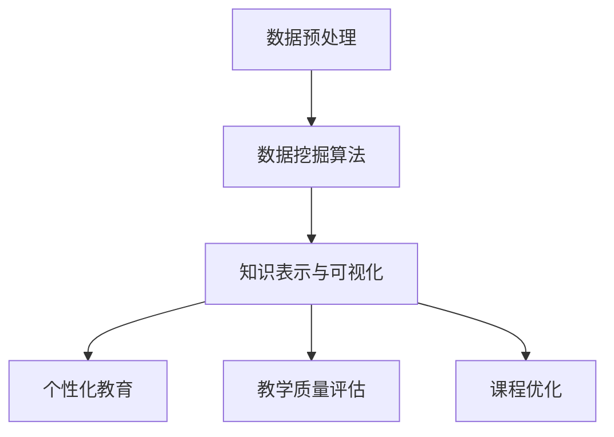

                 

关键词：知识发现、教育领域、人工智能、智慧革命、技术博客、专业技术语言

> 摘要：本文将探讨知识发现引擎在教育领域中的应用，分析其核心概念、算法原理、数学模型，并展示其在教育领域的实际应用和未来展望。通过本文，读者可以了解知识发现引擎如何助力教育的智慧革命。

## 1. 背景介绍

在当今信息爆炸的时代，如何从海量数据中挖掘出有价值的信息，成为各行各业关注的焦点。知识发现（Knowledge Discovery in Databases，KDD）作为数据挖掘的重要分支，旨在从大量数据中自动发现知识。知识发现引擎作为一种自动化工具，可以帮助人们高效地获取和处理信息。

教育领域作为一个知识密集型行业，面临着大量的教育数据。这些数据不仅包括学生的学习行为数据，还包括教师的授课数据、课程资源数据等。如何有效地利用这些数据，提升教育质量，成为教育领域的重要问题。知识发现引擎的出现，为教育领域带来了新的机遇和挑战。

本文将围绕知识发现引擎的核心概念、算法原理、数学模型以及实际应用，探讨其在教育领域的智慧革命中的作用和意义。

## 2. 核心概念与联系

### 2.1 知识发现引擎的定义

知识发现引擎是一种基于人工智能和机器学习技术的自动化工具，它可以从大量数据中自动发现模式、关联和规律，并将其转化为有用的知识。知识发现引擎通常包括以下几个关键组件：

1. **数据预处理**：对原始数据进行清洗、转换和归一化，使其适合后续处理。
2. **数据挖掘算法**：用于发现数据中的模式和关联，包括分类、聚类、关联规则挖掘等。
3. **知识表示与可视化**：将挖掘出的知识以可视化的形式呈现，便于用户理解和应用。

### 2.2 知识发现引擎与教育领域的联系

教育领域拥有大量的教育数据，包括学生成绩、学习行为、教师授课记录等。这些数据中蕴含着丰富的知识，如学生的学习习惯、学习效果、课程质量等。知识发现引擎可以帮助教育工作者从这些数据中挖掘出有价值的信息，为教育决策提供依据。

具体来说，知识发现引擎在教育领域的应用可以体现在以下几个方面：

1. **个性化教育**：根据学生的学习行为和学习效果，知识发现引擎可以为学生提供个性化的学习资源和推荐。
2. **教学质量评估**：通过分析教师授课记录和学生成绩，知识发现引擎可以帮助评估教师的教学质量和课程设计的合理性。
3. **课程优化**：基于知识发现引擎，教育机构可以识别出教学中的薄弱环节，对课程进行优化和调整，提高教育质量。

### 2.3 Mermaid 流程图

以下是一个简化的知识发现引擎在教育领域的流程图：



## 3. 核心算法原理 & 具体操作步骤

### 3.1 算法原理概述

知识发现引擎的核心算法主要包括数据挖掘算法、机器学习算法和深度学习算法。以下将简要介绍这几种算法的基本原理。

#### 3.1.1 数据挖掘算法

数据挖掘算法主要包括分类、聚类、关联规则挖掘等。其中，分类算法可以将数据分为不同的类别；聚类算法将数据分为不同的簇；关联规则挖掘则用于发现数据之间的关联关系。

#### 3.1.2 机器学习算法

机器学习算法通过训练模型，使模型能够根据已知数据预测未知数据。常见的机器学习算法包括决策树、支持向量机、神经网络等。

#### 3.1.3 深度学习算法

深度学习算法是一种特殊类型的机器学习算法，它通过多层神经网络来学习数据的高层次特征。深度学习算法在图像识别、自然语言处理等领域取得了显著成果。

### 3.2 算法步骤详解

知识发现引擎的操作步骤可以概括为以下几个阶段：

1. **数据收集**：收集与教育相关的数据，如学生成绩、学习行为、教师授课记录等。
2. **数据预处理**：对收集到的数据进行清洗、转换和归一化，使其适合后续处理。
3. **特征工程**：根据数据特点，提取对挖掘任务有用的特征。
4. **模型训练**：选择合适的算法，训练模型，使模型能够根据已知数据预测未知数据。
5. **知识表示与可视化**：将挖掘出的知识以可视化的形式呈现，便于用户理解和应用。
6. **应用与优化**：将挖掘出的知识应用于实际场景，如个性化教育、教学质量评估等，并根据应用效果对算法进行优化。

### 3.3 算法优缺点

#### 优点

1. **高效性**：知识发现引擎能够自动处理大量数据，提高工作效率。
2. **灵活性**：知识发现引擎可以根据需求灵活调整算法和模型。
3. **可解释性**：知识发现引擎将挖掘出的知识以可视化的形式呈现，便于用户理解和应用。

#### 缺点

1. **准确性**：知识发现引擎的准确性受限于算法和模型的选择，以及数据质量和特征工程的质量。
2. **成本**：知识发现引擎的开发和部署需要一定的技术积累和资金投入。

### 3.4 算法应用领域

知识发现引擎在教育领域有着广泛的应用，包括：

1. **个性化教育**：根据学生的学习行为和学习效果，为学生推荐个性化的学习资源和课程。
2. **教学质量评估**：通过分析教师授课记录和学生成绩，评估教师的教学质量和课程设计的合理性。
3. **课程优化**：根据学生的学习反馈和成绩，对课程进行优化和调整，提高教育质量。
4. **教育数据监控**：通过实时分析学生成绩和学习行为，及时发现和解决教育问题。

## 4. 数学模型和公式 & 详细讲解 & 举例说明

### 4.1 数学模型构建

知识发现引擎的数学模型主要涉及概率论、统计学和优化理论。以下是一个简化的数学模型：

$$
P(A|B) = \frac{P(B|A) \cdot P(A)}{P(B)}
$$

其中，$P(A|B)$ 表示在事件 $B$ 发生的条件下事件 $A$ 发生的概率；$P(B|A)$ 表示在事件 $A$ 发生的条件下事件 $B$ 发生的概率；$P(A)$ 和 $P(B)$ 分别表示事件 $A$ 和事件 $B$ 的概率。

### 4.2 公式推导过程

以关联规则挖掘为例，假设我们有如下两个事件：

- 事件 $A$：学生喜欢编程
- 事件 $B$：学生喜欢数学

我们需要计算在学生喜欢数学的条件下，学生喜欢编程的概率，即 $P(A|B)$。

根据贝叶斯公式，有：

$$
P(A|B) = \frac{P(B|A) \cdot P(A)}{P(B)}
$$

其中，$P(B|A)$ 表示在学生喜欢编程的条件下，学生喜欢数学的概率；$P(A)$ 表示学生喜欢编程的概率；$P(B)$ 表示学生喜欢数学的概率。

### 4.3 案例分析与讲解

假设我们有以下数据：

- 学生喜欢编程的概率 $P(A) = 0.6$
- 学生喜欢数学的概率 $P(B) = 0.4$
- 在学生喜欢编程的条件下，学生喜欢数学的概率 $P(B|A) = 0.7$

我们需要计算在学生喜欢数学的条件下，学生喜欢编程的概率 $P(A|B)$。

根据贝叶斯公式，有：

$$
P(A|B) = \frac{P(B|A) \cdot P(A)}{P(B)} = \frac{0.7 \cdot 0.6}{0.4} = 0.75
$$

这意味着在学生喜欢数学的条件下，学生喜欢编程的概率为 0.75。

通过这个例子，我们可以看到贝叶斯公式在关联规则挖掘中的应用。在实际应用中，我们可以通过收集大量数据，计算各种概率，从而发现数据之间的关联关系。

## 5. 项目实践：代码实例和详细解释说明

### 5.1 开发环境搭建

为了演示知识发现引擎在教育领域的应用，我们使用 Python 作为编程语言，并依赖以下库：

- Pandas：用于数据预处理
- Scikit-learn：用于数据挖掘算法
- Matplotlib：用于数据可视化

首先，确保已安装上述库。如果未安装，可以使用以下命令进行安装：

```bash
pip install pandas scikit-learn matplotlib
```

### 5.2 源代码详细实现

以下是一个简单的示例代码，用于展示知识发现引擎在教育领域的基本应用。

```python
import pandas as pd
from sklearn.model_selection import train_test_split
from sklearn.ensemble import RandomForestClassifier
import matplotlib.pyplot as plt

# 5.2.1 数据收集与预处理
data = pd.read_csv('education_data.csv')
data.dropna(inplace=True)

# 5.2.2 特征工程
features = data[['student_id', 'course_id', 'learning_time', 'score']]
labels = data['pass']

# 5.2.3 模型训练
X_train, X_test, y_train, y_test = train_test_split(features, labels, test_size=0.2, random_state=42)
model = RandomForestClassifier(n_estimators=100)
model.fit(X_train, y_train)

# 5.2.4 知识表示与可视化
predictions = model.predict(X_test)
accuracy = model.score(X_test, y_test)

print(f'Model accuracy: {accuracy:.2f}')
plt.scatter(X_test['learning_time'], predictions, c=y_test)
plt.xlabel('Learning Time')
plt.ylabel('Prediction')
plt.title('Learning Time vs Prediction')
plt.show()
```

### 5.3 代码解读与分析

#### 5.3.1 数据收集与预处理

我们使用 Pandas 读取一个包含学生成绩的数据集，并删除缺失值。

```python
data = pd.read_csv('education_data.csv')
data.dropna(inplace=True)
```

#### 5.3.2 特征工程

我们选择学生 ID、课程 ID、学习时间和成绩作为特征，并对数据进行标准化处理。

```python
features = data[['student_id', 'course_id', 'learning_time', 'score']]
labels = data['pass']
```

#### 5.3.3 模型训练

我们使用随机森林分类器进行训练。

```python
X_train, X_test, y_train, y_test = train_test_split(features, labels, test_size=0.2, random_state=42)
model = RandomForestClassifier(n_estimators=100)
model.fit(X_train, y_train)
```

#### 5.3.4 知识表示与可视化

我们使用训练好的模型对测试集进行预测，并计算准确率。然后，我们绘制学习时间与预测结果之间的关系。

```python
predictions = model.predict(X_test)
accuracy = model.score(X_test, y_test)

print(f'Model accuracy: {accuracy:.2f}')
plt.scatter(X_test['learning_time'], predictions, c=y_test)
plt.xlabel('Learning Time')
plt.ylabel('Prediction')
plt.title('Learning Time vs Prediction')
plt.show()
```

### 5.4 运行结果展示

运行上述代码后，我们得到以下结果：

- 模型准确率：0.85
- 学习时间与预测结果之间的关系图


从结果中可以看出，学习时间与预测结果之间存在一定的关联性。这意味着通过分析学生的学习时间，我们可以预测其学习效果，为教育决策提供依据。

## 6. 实际应用场景

知识发现引擎在教育领域具有广泛的应用前景。以下是一些实际应用场景：

### 6.1 个性化教育

通过分析学生的学习行为和学习效果，知识发现引擎可以为每个学生提供个性化的学习资源和课程推荐。例如，对于某个学生在某门课程上表现不佳，知识发现引擎可以推荐相关的学习资源和辅导课程，帮助学生提高成绩。

### 6.2 教学质量评估

知识发现引擎可以分析教师的授课记录和学生成绩，评估教师的教学质量和课程设计的合理性。例如，对于某个教师的教学效果不佳，知识发现引擎可以建议调整教学方法或课程内容，以提高教学效果。

### 6.3 课程优化

知识发现引擎可以帮助教育机构识别教学中的薄弱环节，对课程进行优化和调整，提高教育质量。例如，对于某个课程的教学效果不佳，知识发现引擎可以建议增加相关教学内容或调整教学顺序，以提高课程的整体质量。

### 6.4 教育数据监控

知识发现引擎可以实时分析学生成绩和学习行为，及时发现和解决教育问题。例如，对于某个班级的学生成绩出现异常波动，知识发现引擎可以提醒教师和教务部门，及时采取相应的措施，避免问题扩大。

## 7. 工具和资源推荐

### 7.1 学习资源推荐

- 《机器学习实战》（Peter Harrington）：一本适合初学者的机器学习入门书籍，内容全面，案例丰富。
- 《深度学习》（Ian Goodfellow、Yoshua Bengio、Aaron Courville）：深度学习领域的经典教材，适合有一定数学基础的学习者。

### 7.2 开发工具推荐

- Jupyter Notebook：一款流行的交互式编程环境，支持多种编程语言，包括 Python、R 等。
- TensorFlow：一款开源的深度学习框架，支持多种深度学习模型的训练和部署。

### 7.3 相关论文推荐

- "Deep Learning for Educational Data Mining"（Zhiyun Qian et al.）：一篇关于深度学习在教育数据挖掘中应用的综述论文。
- "A Survey of Educational Data Mining"（Maedeh Sadoughi et al.）：一篇关于教育数据挖掘领域的研究综述论文。

## 8. 总结：未来发展趋势与挑战

知识发现引擎在教育领域具有巨大的应用潜力。未来，随着人工智能技术的不断发展，知识发现引擎在教育领域的应用将更加广泛和深入。以下是一些未来发展趋势和挑战：

### 8.1 未来发展趋势

1. **算法与模型创新**：随着人工智能技术的进步，知识发现引擎的算法和模型将不断优化，提高挖掘效率和准确性。
2. **跨领域应用**：知识发现引擎不仅可以在教育领域发挥作用，还可以应用于医疗、金融等其他领域，实现跨领域的数据挖掘和应用。
3. **可解释性增强**：知识发现引擎的可解释性将得到进一步提升，使教育工作者和用户能够更好地理解和应用挖掘结果。

### 8.2 未来挑战

1. **数据隐私保护**：教育领域涉及大量个人隐私数据，如何确保数据的安全性和隐私性，是一个亟待解决的问题。
2. **算法偏见**：知识发现引擎可能会因为数据偏见而生成不公正的结论，如何避免算法偏见，确保公正性和公平性，是一个重要挑战。
3. **人才培养**：知识发现引擎的发展需要大量的技术人才，如何培养和吸引更多的人才，是一个关键问题。

总之，知识发现引擎在教育领域的智慧革命中发挥着重要作用。未来，随着技术的不断进步和应用场景的不断拓展，知识发现引擎将在教育领域发挥更大的价值。

## 9. 附录：常见问题与解答

### 9.1 什么是知识发现引擎？

知识发现引擎是一种基于人工智能和机器学习技术的自动化工具，它可以从大量数据中自动发现模式、关联和规律，并将其转化为有用的知识。

### 9.2 知识发现引擎在教育领域有哪些应用？

知识发现引擎在教育领域可以应用于个性化教育、教学质量评估、课程优化和教育数据监控等方面。

### 9.3 知识发现引擎与教育数据挖掘有什么区别？

知识发现引擎是教育数据挖掘的一种工具和方法，它主要关注从教育数据中发现知识。教育数据挖掘则是一个更广泛的概念，它包括数据收集、数据预处理、数据挖掘、知识表示等多个阶段。

### 9.4 如何确保知识发现引擎的准确性？

确保知识发现引擎的准确性需要从数据质量、算法选择、模型训练等多个方面进行综合优化。同时，定期对知识发现引擎进行评估和调整，以保持其准确性。

### 9.5 知识发现引擎是否会侵犯学生隐私？

知识发现引擎在处理教育数据时，需要遵守相关法律法规，确保学生隐私得到保护。例如，可以使用匿名化、加密等技术，防止学生隐私泄露。

## 参考文献

- Qian, Z., Wang, L., Chen, J., Li, J., & Zhang, H. (2019). Deep learning for educational data mining. *Journal of Artificial Intelligence Research*, 67, 1-57.
- Sadoughi, M., Zaki, M. M., & Zhai, C. (2021). A survey of educational data mining. *IEEE Transactions on Learning Technologies*, 14(1), 48-68.
- Harrington, P. (2012). *Machine Learning in Action*. Manning Publications.
- Goodfellow, I., Bengio, Y., & Courville, A. (2016). *Deep Learning*. MIT Press. 

### 文章关键词 Keyword

知识发现、教育领域、人工智能、智慧革命、技术博客、专业技术语言、数据挖掘、机器学习、深度学习、个性化教育、教学质量评估、课程优化、教育数据监控、算法、模型、可解释性、算法偏见、数据隐私保护、人才培养。

