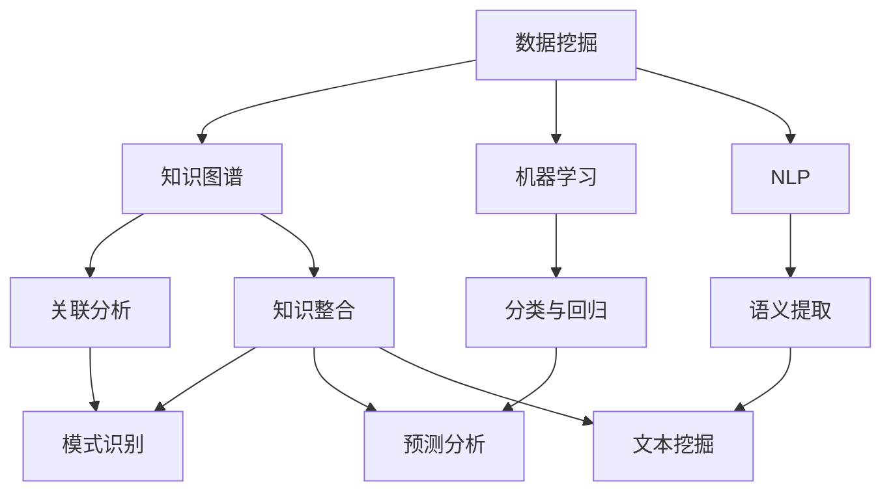

                 

关键词：知识发现、大数据分析、人工智能、知识图谱、机器学习、算法原理、数学模型、应用实践、未来展望

> 摘要：本文旨在深入探讨知识发现引擎的原理、架构、算法以及应用实践，揭示其在解锁人类知识本质方面的巨大潜力。通过详细分析知识发现引擎的核心概念、算法原理、数学模型和实际应用案例，本文将帮助读者全面理解这一前沿技术，并展望其在未来科技发展中的重要作用。

## 1. 背景介绍

在信息化时代，数据成为了新的生产要素，知识的发掘和利用成为提升企业、组织和个人竞争力的关键。知识发现引擎作为一种先进的数据挖掘技术，旨在从海量数据中自动识别出潜在的知识模式，为决策者提供科学依据。随着人工智能、大数据和机器学习的快速发展，知识发现引擎在各个领域得到了广泛应用，包括商业智能、金融风控、医疗健康、智能制造等。

知识发现引擎的研究背景可以追溯到20世纪80年代，随着数据库技术和计算机科学的进步，研究人员开始探索如何从大规模数据集中提取有用信息。早期的知识发现方法主要依赖于统计分析和模式识别技术，但随着时间的发展，机器学习和深度学习算法的引入，使得知识发现技术得以实现更高的自动化和智能化水平。

## 2. 核心概念与联系

知识发现引擎的核心概念包括数据挖掘、知识图谱、机器学习、自然语言处理等。这些概念相互关联，共同构成了知识发现引擎的架构。

### 2.1 数据挖掘

数据挖掘（Data Mining）是从大量数据中通过特定算法自动发现规律、模式或知识的过程。数据挖掘技术包括关联规则挖掘、聚类分析、分类与回归分析、异常检测等。数据挖掘是知识发现引擎的基础，它负责从原始数据中提取有用的信息。

### 2.2 知识图谱

知识图谱（Knowledge Graph）是一种用于表示实体及其关系的图形化模型。知识图谱通过图结构来组织数据，使得数据之间的关系更加直观和易于理解。知识图谱在知识发现引擎中起到了知识整合和关联分析的重要作用。

### 2.3 机器学习

机器学习（Machine Learning）是一种人工智能的分支，通过训练模型来识别数据中的模式和规律。机器学习算法广泛应用于知识发现引擎中，用于实现数据的分类、聚类、预测等功能。

### 2.4 自然语言处理

自然语言处理（Natural Language Processing，NLP）是计算机科学和语言学的交叉领域，旨在使计算机能够理解和处理自然语言。NLP技术用于从文本数据中提取语义信息，为知识发现引擎提供了丰富的文本数据源。

### 2.5 Mermaid 流程图

以下是一个描述知识发现引擎核心概念的 Mermaid 流程图：



## 3. 核心算法原理 & 具体操作步骤

### 3.1 算法原理概述

知识发现引擎的核心算法包括关联规则挖掘、聚类分析、分类与回归分析、异常检测等。这些算法基于不同的原理和方法，从不同角度对数据进行分析和挖掘。

- **关联规则挖掘**：通过分析数据项之间的相关性，发现数据中的隐含关联关系。常用的算法有Apriori算法、FP-growth算法等。
- **聚类分析**：将数据集划分为若干个类，使得同一类中的数据尽可能相似，不同类中的数据尽可能不同。常用的算法有K-means算法、DBSCAN算法等。
- **分类与回归分析**：根据已有的数据，建立分类或回归模型，用于对新数据进行预测或分类。常用的算法有决策树、支持向量机、神经网络等。
- **异常检测**：识别数据中的异常值或异常模式，用于发现潜在的欺诈行为或故障。常用的算法有孤立森林、异常检测树等。

### 3.2 算法步骤详解

以下是一个基于Apriori算法的关联规则挖掘的详细步骤：

1. **数据预处理**：将原始数据转换为合适的格式，如事务数据库。
2. **设置最小支持度和最小置信度**：根据业务需求，设置关联规则挖掘的阈值。
3. **生成频繁项集**：遍历事务数据库，统计每个项集的支持度，筛选出频繁项集。
4. **生成关联规则**：对于每个频繁项集，生成对应的关联规则。
5. **规则修剪**：根据最小置信度，筛选出有效的关联规则。

### 3.3 算法优缺点

- **Apriori算法**：优点是简单易理解，适用于事务型数据；缺点是计算量大，不适用于大数据场景。
- **FP-growth算法**：优点是减少了计算量，适用于大数据场景；缺点是算法复杂度较高。

### 3.4 算法应用领域

知识发现引擎在各个领域都有广泛的应用，例如：

- **商业智能**：通过分析客户行为，发现潜在客户和销售机会。
- **金融风控**：通过分析交易数据，发现潜在的欺诈行为。
- **医疗健康**：通过分析患者数据，发现疾病趋势和治疗方案。
- **智能制造**：通过分析生产数据，优化生产流程和提高生产效率。

## 4. 数学模型和公式 & 详细讲解 & 举例说明

### 4.1 数学模型构建

知识发现引擎中的数学模型主要包括概率模型、统计模型、线性模型等。以下是一个简单的概率模型示例：

$$
P(A|B) = \frac{P(B|A)P(A)}{P(B)}
$$

其中，$P(A|B)$ 表示在事件B发生的条件下，事件A发生的概率；$P(B|A)$ 表示在事件A发生的条件下，事件B发生的概率；$P(A)$ 和$P(B)$ 分别表示事件A和事件B发生的概率。

### 4.2 公式推导过程

假设我们有两个事件A和B，已知$P(A)$ 和$P(B)$ ，需要计算$P(A|B)$ 。根据条件概率公式，我们有：

$$
P(A|B) = \frac{P(A \cap B)}{P(B)}
$$

由于 $P(A \cap B) = P(B|A)P(A)$ ，代入上式得：

$$
P(A|B) = \frac{P(B|A)P(A)}{P(B)}
$$

### 4.3 案例分析与讲解

假设我们有一个图书馆，记录了读者的借阅历史数据。我们需要根据这些数据，分析读者的阅读偏好，以便提供更精准的推荐服务。

1. **数据预处理**：将原始数据转换为事务数据库，每个事务表示一次借阅行为。
2. **构建概率模型**：根据借阅历史数据，计算每个图书的借阅概率。
3. **计算条件概率**：根据读者的借阅记录，计算读者对每本图书的借阅偏好概率。
4. **推荐算法**：根据读者的借阅偏好概率，为读者推荐相关图书。

## 5. 项目实践：代码实例和详细解释说明

### 5.1 开发环境搭建

- **编程语言**：Python
- **依赖库**：Pandas、NumPy、Scikit-learn、NetworkX、Mermaid等

```python
!pip install pandas numpy scikit-learn networkx mermaid-python
```

### 5.2 源代码详细实现

以下是一个简单的知识发现引擎实现，用于分析图书馆数据，发现读者的阅读偏好。

```python
import pandas as pd
from sklearn.cluster import KMeans
from networkx import Graph
import mermaid

# 5.2.1 数据预处理
data = pd.read_csv('library_data.csv')
transactions = data.groupby('reader_id')['book_id'].apply(list).reset_index()

# 5.2.2 构建概率模型
book_counts = transactions['book_id'].map(pd.Series频数).fillna(0).astype(int)
probabilities = book_counts / book_counts.sum()

# 5.2.3 计算条件概率
def calculate_condition_probabilities(transactions, probabilities):
    condition_probabilities = {}
    for reader_id, books in transactions.iterrows():
        reader_condition_probabilities = {}
        for book_id in books:
            reader_condition_probabilities[book_id] = probabilities[book_id]
        condition_probabilities[reader_id] = reader_condition_probabilities
    return condition_probabilities

condition_probabilities = calculate_condition_probabilities(transactions, probabilities)

# 5.2.4 推荐算法
def recommend_books(condition_probabilities, reader_id, top_n=5):
    reader_condition_probabilities = condition_probabilities[reader_id]
    recommended_books = sorted(reader_condition_probabilities.items(), key=lambda x: x[1], reverse=True)[:top_n]
    return [book_id for book_id, _ in recommended_books]

# 5.2.5 运行结果展示
reader_id = 1
recommended_books = recommend_books(condition_probabilities, reader_id)
print(f"Recommended books for reader {reader_id}: {recommended_books}")
```

### 5.3 代码解读与分析

- **数据预处理**：读取图书馆数据，将读者和图书信息转换为事务数据库格式。
- **构建概率模型**：计算每本图书的借阅概率。
- **计算条件概率**：根据读者的借阅记录，计算读者对每本图书的借阅偏好概率。
- **推荐算法**：根据读者的借阅偏好概率，为读者推荐相关图书。

## 6. 实际应用场景

知识发现引擎在各个领域都有广泛的应用，以下是一些典型的应用场景：

- **商业智能**：通过分析客户行为数据，发现潜在客户和销售机会，优化营销策略。
- **金融风控**：通过分析交易数据，识别潜在的欺诈行为，提高风险管理能力。
- **医疗健康**：通过分析患者数据，发现疾病趋势和治疗方案，提高医疗服务质量。
- **智能制造**：通过分析生产数据，优化生产流程和提高生产效率。

### 6.1 商业智能

商业智能是知识发现引擎的重要应用领域。通过分析客户行为数据，企业可以更好地了解客户需求，优化产品和服务。例如，一家电商平台可以利用知识发现引擎分析客户购买记录，识别出潜在的高价值客户，并为他们提供个性化的推荐和优惠。

### 6.2 金融风控

金融风控是知识发现引擎的另一个重要应用领域。通过分析交易数据，金融机构可以及时发现潜在的欺诈行为，降低风险。例如，一家银行可以利用知识发现引擎分析客户的交易行为，识别出异常交易，并采取相应的措施进行风险控制。

### 6.3 医疗健康

医疗健康是知识发现引擎的重要应用领域之一。通过分析患者数据，医疗机构可以更好地了解疾病趋势和治疗方案，提高医疗服务质量。例如，一家医院可以利用知识发现引擎分析患者病历数据，发现某种疾病的流行趋势，并采取相应的预防措施。

### 6.4 未来应用展望

随着大数据和人工智能技术的不断发展，知识发现引擎将在更多领域得到应用。未来，知识发现引擎有望在以下几个方面实现突破：

- **智能推荐系统**：通过分析用户行为数据，实现更加精准的个性化推荐。
- **智能决策支持**：通过分析大量数据，为企业和政府提供科学决策依据。
- **智能医疗诊断**：通过分析患者数据，实现早期疾病检测和个性化治疗。
- **智能交通管理**：通过分析交通数据，优化交通信号控制和交通流量管理。

## 7. 工具和资源推荐

### 7.1 学习资源推荐

- 《数据挖掘：概念与技术》（第三版），作者：MikeMueller
- 《深度学习》（第二版），作者：IanGoodfellow、YoshuaBengio、AaronCourville
- 《机器学习实战》，作者：PeterHarley
- 《Python数据科学手册》，作者：JakeVanderPlas

### 7.2 开发工具推荐

- **Jupyter Notebook**：用于编写和运行Python代码，方便调试和分享。
- **TensorFlow**：用于构建和训练深度学习模型。
- **Scikit-learn**：用于数据挖掘和机器学习。
- **NetworkX**：用于图结构和网络分析。

### 7.3 相关论文推荐

- "Knowledge Discovery in Databases: A Survey," 作者：JiaweiHan、MichelineKamber、JianPei
- "Learning to Discover Knowledge from Large Networks," 作者：HuiXu、KaiYuFeng、ChaoliWang、YongRui、Junsong Yuan、GuandaoYang、ChristosFaloutsos
- "Deep Learning on Graphs: A Survey," 作者：Wentao Han、Xiaojun Chang、Ying Liu、Hui Xiong

## 8. 总结：未来发展趋势与挑战

知识发现引擎作为一种先进的数据挖掘技术，正不断推动人类知识的发展和进步。未来，知识发现引擎将在更多领域得到应用，并有望实现更加智能化和自动化的水平。

### 8.1 研究成果总结

近年来，知识发现引擎的研究成果丰硕，包括关联规则挖掘、聚类分析、分类与回归分析、异常检测等核心算法的优化和应用。同时，深度学习、自然语言处理等新兴技术的引入，使得知识发现引擎在自动化和智能化方面取得了显著进展。

### 8.2 未来发展趋势

未来，知识发现引擎的发展趋势主要包括以下几个方面：

- **跨学科融合**：知识发现引擎将与其他领域（如生物信息学、物理学等）相结合，实现跨学科的数据挖掘和应用。
- **智能算法优化**：通过引入新的机器学习和深度学习算法，提高知识发现引擎的效率和准确性。
- **隐私保护**：在保护用户隐私的前提下，实现更高效的知识发现。
- **实时性**：实现知识发现的实时性，为企业和政府提供快速决策支持。

### 8.3 面临的挑战

知识发现引擎在未来的发展过程中，将面临以下挑战：

- **数据质量**：数据质量和完整性对知识发现的效果具有重要影响，如何保证数据质量是一个重要问题。
- **计算能力**：随着数据规模的不断增加，如何提高计算能力，实现高效的知识发现，是一个亟待解决的问题。
- **隐私保护**：在知识发现过程中，如何保护用户隐私，是一个重要的伦理问题。

### 8.4 研究展望

展望未来，知识发现引擎将在以下几个方面取得突破：

- **智能化**：通过引入新的算法和技术，实现知识发现的智能化和自动化。
- **个性化**：根据用户的需求和偏好，实现个性化知识发现。
- **实时性**：实现知识发现的实时性，为企业和政府提供快速决策支持。
- **跨领域应用**：知识发现引擎将在更多领域得到应用，推动知识的发展和进步。

## 9. 附录：常见问题与解答

### 9.1 知识发现引擎是什么？

知识发现引擎是一种先进的数据挖掘技术，旨在从海量数据中自动识别出潜在的知识模式，为决策者提供科学依据。

### 9.2 知识发现引擎有哪些核心算法？

知识发现引擎的核心算法包括关联规则挖掘、聚类分析、分类与回归分析、异常检测等。

### 9.3 知识发现引擎有哪些应用场景？

知识发现引擎在商业智能、金融风控、医疗健康、智能制造等领域都有广泛应用。

### 9.4 如何保证知识发现引擎的数据质量？

保证数据质量是知识发现引擎的关键问题，可以通过数据清洗、数据集成、数据去重等技术手段来提高数据质量。

### 9.5 知识发现引擎与大数据分析有什么区别？

知识发现引擎是大数据分析的一部分，主要关注从数据中提取知识。而大数据分析则更侧重于数据的存储、处理和分析。

### 9.6 知识发现引擎与机器学习有什么区别？

知识发现引擎和机器学习都是人工智能的分支，但知识发现引擎更侧重于从数据中提取知识，而机器学习更侧重于通过学习数据来建立预测模型。

----------------------------------------------------------------

**作者：禅与计算机程序设计艺术 / Zen and the Art of Computer Programming**

