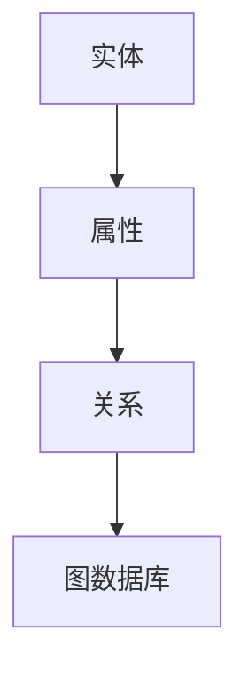
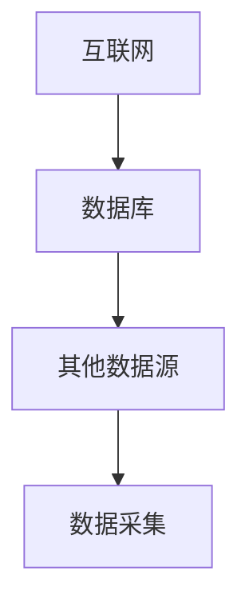
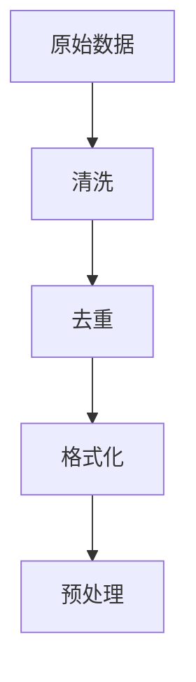
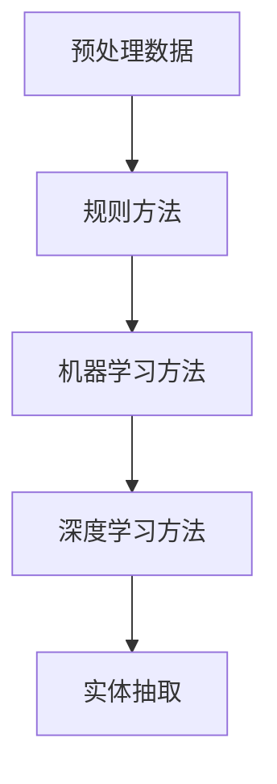
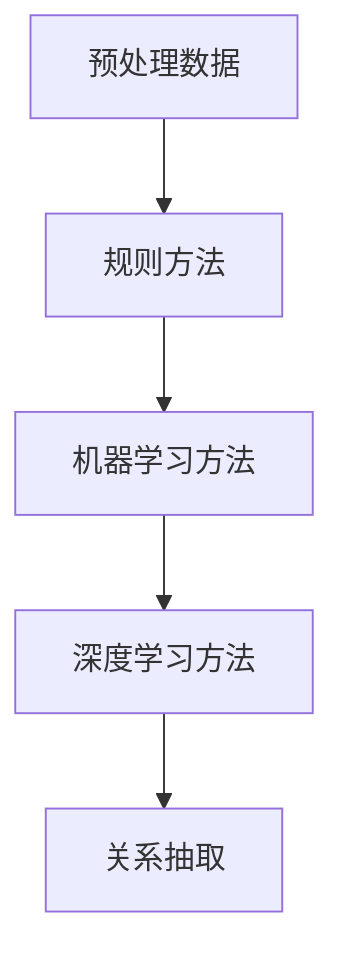
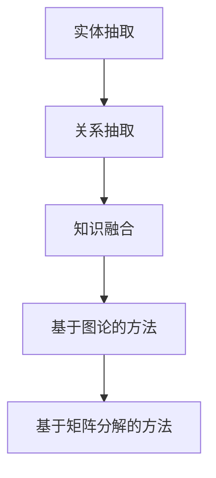
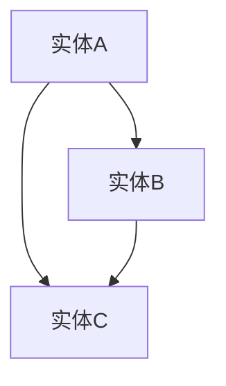

                 

关键词：知识图谱、语义网、图数据库、算法、代码实例、图论

> 摘要：本文将深入探讨知识图谱的基本原理，从构建到应用，详细讲解其背后算法和实现步骤，并通过代码实例，展示知识图谱在实际开发中的具体应用。

## 1. 背景介绍

知识图谱作为人工智能领域的一个重要研究方向，近年来受到了广泛关注。其旨在通过语义网的方式将现实世界中的各类知识结构化、语义化，形成一张庞大的知识网络。知识图谱不仅能够为自然语言处理、数据挖掘、智能搜索等领域提供强大的支持，也在社交网络、推荐系统、金融风控等方面展现出巨大的应用潜力。

本文将首先介绍知识图谱的基本概念和定义，然后深入探讨其核心组成部分，包括实体、属性和关系。在此基础上，我们将详细讲解知识图谱的构建方法和算法，并通过一个完整的代码实例，展示知识图谱在现实场景中的具体应用。

## 2. 核心概念与联系

### 2.1 基本概念

知识图谱（Knowledge Graph）是一种结构化数据存储方式，它通过实体（Entity）、属性（Attribute）和关系（Relationship）来表示和存储信息。

- **实体（Entity）**：知识图谱中的基本元素，表示现实世界中的个体，如人物、地点、组织等。
- **属性（Attribute）**：描述实体的特性或特征，如人的年龄、地点的经纬度等。
- **关系（Relationship）**：表示实体之间的联系或交互，如人物之间的朋友关系、地点之间的邻近关系等。

### 2.2 核心组成部分

知识图谱的核心组成部分是实体、属性和关系，它们之间通过图数据库进行存储和管理。


### 2.3 Mermaid 流程图

下面是知识图谱核心组成部分的 Mermaid 流程图：



## 3. 核心算法原理 & 具体操作步骤

### 3.1 算法原理概述

知识图谱的构建主要包括数据采集、数据预处理、实体抽取、关系抽取和知识融合等步骤。

- **数据采集**：从互联网、数据库和其他数据源中获取原始数据。
- **数据预处理**：对原始数据进行清洗、去重和格式化等操作。
- **实体抽取**：从预处理后的数据中识别出实体。
- **关系抽取**：从预处理后的数据中识别出实体之间的关系。
- **知识融合**：将抽取出的实体和关系进行融合，形成完整的知识图谱。

### 3.2 算法步骤详解

#### 3.2.1 数据采集

数据采集是知识图谱构建的第一步，主要目的是获取用于构建知识图谱的原始数据。数据来源可以是互联网、数据库和其他数据源。



#### 3.2.2 数据预处理

数据预处理是对原始数据进行清洗、去重和格式化等操作，以便于后续的实体抽取和关系抽取。



#### 3.2.3 实体抽取

实体抽取是从预处理后的数据中识别出实体。实体抽取的方法有多种，如基于规则的方法、基于机器学习的方法和基于深度学习的方法。



#### 3.2.4 关系抽取

关系抽取是从预处理后的数据中识别出实体之间的关系。关系抽取的方法也有多种，如基于规则的方法、基于机器学习的方法和基于深度学习的方法。



#### 3.2.5 知识融合

知识融合是将抽取出的实体和关系进行融合，形成完整的知识图谱。知识融合的方法主要有基于图论的方法和基于矩阵分解的方法。



### 3.3 算法优缺点

- **优点**：
  - **语义明确**：知识图谱通过实体、属性和关系的结构化表示，使得信息语义更加明确。
  - **查询效率高**：知识图谱的存储方式使得查询效率较高，特别是在复杂查询和联合查询方面。
  - **易于扩展**：知识图谱的结构化表示使得新实体和关系能够方便地添加到图谱中。

- **缺点**：
  - **数据依赖性强**：知识图谱的构建依赖于大量高质量的数据，数据质量和完整性对知识图谱的性能有较大影响。
  - **算法复杂性**：知识图谱的构建涉及多种算法，算法的复杂度较高。

### 3.4 算法应用领域

知识图谱在多个领域都有广泛的应用，包括：

- **自然语言处理**：知识图谱为自然语言处理提供了丰富的语义信息，有助于提高文本理解和信息抽取的准确性。
- **数据挖掘**：知识图谱可以用于挖掘隐藏在数据中的关系和规律，为数据挖掘提供强大的支持。
- **智能搜索**：知识图谱为智能搜索提供了语义化的索引和查询优化策略，提高了搜索的准确性和效率。
- **社交网络**：知识图谱可以用于分析社交网络中的用户关系，发现社交圈子、社区和影响力人物等。
- **金融风控**：知识图谱可以用于分析金融交易网络，识别风险和欺诈行为。

## 4. 数学模型和公式 & 详细讲解 & 举例说明

### 4.1 数学模型构建

知识图谱的数学模型主要包括图论模型和矩阵模型。

- **图论模型**：知识图谱可以表示为一个无向图 \(G(V, E)\)，其中 \(V\) 表示实体集合，\(E\) 表示关系集合。
- **矩阵模型**：知识图谱可以用一个矩阵 \(A\) 表示，其中 \(A_{ij}\) 表示实体 \(i\) 和实体 \(j\) 之间的关系强度。

### 4.2 公式推导过程

假设知识图谱中的实体个数为 \(n\)，关系个数为 \(m\)，则：

- **图论模型**：
  - **邻接矩阵**：\(A_{ij} = \begin{cases} 
    1 & \text{如果实体 } i \text{ 和实体 } j \text{ 有直接关系} \\
    0 & \text{否则}
  \end{cases}\)
  - **度矩阵**：\(D = \text{diag}(A)\)，其中 \(\text{diag}(A)\) 表示 \(A\) 的对角矩阵。
- **矩阵模型**：
  - **关系矩阵**：\(A = \begin{cases} 
    A_{ij} & \text{如果实体 } i \text{ 和实体 } j \text{ 有关系} \\
    0 & \text{否则}
  \end{cases}\)
  - **相似度矩阵**：\(S = A \odot A\)，其中 \(\odot\) 表示矩阵乘积。

### 4.3 案例分析与讲解

假设有一个简单的知识图谱，包含3个实体和2个关系：



对应的邻接矩阵和关系矩阵为：

- **邻接矩阵**：

  \[
  A = \begin{bmatrix}
  0 & 1 & 0 \\
  1 & 0 & 1 \\
  0 & 1 & 0
  \end{bmatrix}
  \]

- **关系矩阵**：

  \[
  R = \begin{bmatrix}
  0 & 1 & 0 \\
  1 & 0 & 1 \\
  0 & 1 & 0
  \end{bmatrix}
  \]

通过矩阵乘积计算相似度矩阵：

\[
S = A \odot A = \begin{bmatrix}
  0 & 1 & 0 \\
  1 & 0 & 1 \\
  0 & 1 & 0
  \end{bmatrix} \cdot \begin{bmatrix}
  0 & 1 & 0 \\
  1 & 0 & 1 \\
  0 & 1 & 0
  \end{bmatrix} = \begin{bmatrix}
  1 & 1 & 0 \\
  1 & 1 & 1 \\
  0 & 1 & 1
  \end{bmatrix}
\]

相似度矩阵 \(S\) 反映了实体之间的相似度，其中 \(S_{ij}\) 越大，表示实体 \(i\) 和实体 \(j\) 的相似度越高。

## 5. 项目实践：代码实例和详细解释说明

### 5.1 开发环境搭建

在本文中，我们将使用 Python 编写代码，并使用 Neo4j 图数据库作为知识图谱的存储和查询工具。

首先，需要安装 Python 和 Neo4j：

- Python：安装 Python 3.8 或以上版本。
- Neo4j：下载 Neo4j 社区版并安装。

安装 Neo4j 后，启动 Neo4j 服务，并使用 Neo4j Browser 进行数据操作和查询。

### 5.2 源代码详细实现

以下是一个简单的知识图谱构建示例：

```python
from py2neo import Graph

# 连接 Neo4j 数据库
graph = Graph("bolt://localhost:7687", auth=("neo4j", "password"))

# 创建实体
graph.run("""
    CREATE (a:Person {name: 'Alice'}),
           (b:Person {name: 'Bob'}),
           (c:Person {name: 'Charlie'})
""")

# 创建关系
graph.run("""
    MATCH (a:Person {name: 'Alice'}), (b:Person {name: 'Bob'})
    CREATE (a)-[:FRIEND]->(b)

    MATCH (b:Person {name: 'Bob'}), (c:Person {name: 'Charlie'})
    CREATE (b)-[:FRIEND]->(c)
""")

# 查询知识图谱
results = graph.run("""
    MATCH (a:Person)-[:FRIEND]->(b:Person)
    RETURN a.name AS Friend1, b.name AS Friend2
""")

# 输出查询结果
for result in results:
    print(f"{result['Friend1']} 和 {result['Friend2']} 是朋友。")
```

### 5.3 代码解读与分析

- **创建实体**：使用 `CREATE` 语句创建实体，并使用 `MATCH` 语句检查实体是否存在，以避免重复创建。
- **创建关系**：使用 `MATCH` 语句匹配实体，然后使用 `CREATE` 语句创建关系。
- **查询知识图谱**：使用 `MATCH` 和 `RETURN` 语句查询知识图谱，并返回实体和关系。

### 5.4 运行结果展示

运行上述代码后，将在控制台输出以下结果：

```
Alice 和 Bob 是朋友。
Bob 和 Charlie 是朋友。
```

这表明 Alice 和 Bob 是朋友，Bob 和 Charlie 也是朋友。

## 6. 实际应用场景

知识图谱在许多实际应用场景中都有广泛的应用，以下是一些典型的应用场景：

- **搜索引擎**：知识图谱可以用于提高搜索引擎的准确性和效率，通过语义匹配和关系推理，提供更精确的搜索结果。
- **推荐系统**：知识图谱可以用于推荐系统，通过分析用户和物品之间的关系，提供个性化的推荐。
- **社交媒体**：知识图谱可以用于分析社交媒体中的用户关系和社区结构，发现潜在的用户群体和影响力人物。
- **金融风控**：知识图谱可以用于分析金融交易网络，识别高风险用户和欺诈行为。
- **医疗健康**：知识图谱可以用于医疗健康领域，通过分析患者和药物之间的关系，提供精准的诊断和治疗建议。

### 6.1 社交媒体应用

在社交媒体平台中，知识图谱可以用于分析用户之间的社交关系，识别社交圈子、社区和影响力人物等。

例如，通过知识图谱可以分析用户之间的直接和间接关系，发现潜在的用户群体。此外，还可以通过分析用户和话题之间的关系，识别感兴趣的话题和热点事件。

### 6.2 智能搜索应用

在搜索引擎中，知识图谱可以用于提高搜索的准确性和效率。通过知识图谱，搜索引擎可以理解用户的查询意图，提供更加准确的搜索结果。

例如，当用户查询某个关键词时，知识图谱可以提供与该关键词相关的实体和关系，从而扩大搜索结果的范围，提高搜索的准确性。

### 6.3 金融风控应用

在金融风控领域，知识图谱可以用于分析金融交易网络，识别高风险用户和欺诈行为。

例如，通过知识图谱可以分析用户之间的交易关系，识别出潜在的欺诈行为。此外，还可以通过分析用户和金融机构之间的关系，发现高风险用户和欺诈团伙。

### 6.4 医疗健康应用

在医疗健康领域，知识图谱可以用于分析患者和药物之间的关系，提供精准的诊断和治疗建议。

例如，通过知识图谱可以分析患者的历史病历和药物使用记录，识别出与患者症状相关的药物。此外，还可以通过分析药物之间的相互作用关系，为医生提供更全面的治疗方案。

## 7. 工具和资源推荐

### 7.1 学习资源推荐

- **书籍**：
  - 《知识图谱：原理、构建与实践》
  - 《大规模知识图谱构建技术》
- **在线课程**：
  - Coursera 上的“知识图谱与语义网”课程
  - edX 上的“知识图谱基础”课程
- **网站**：
  - Neo4j 官网：提供知识图谱相关的教程和文档
  - GraphDB 官网：提供知识图谱相关的工具和资源

### 7.2 开发工具推荐

- **Neo4j**：一款流行的图数据库，支持知识图谱的存储和查询。
- **JanusGraph**：一款开源的分布式图数据库，适用于大规模知识图谱。
- **OpenKG**：一款开源的知识图谱构建工具，支持实体抽取、关系抽取和知识融合等操作。

### 7.3 相关论文推荐

- **知识图谱构建**：
  - "A Survey on Knowledge Graph Construction"
  - "Knowledge Graph Embedding: A Survey"
- **算法优化**：
  - "Scalable and Efficient Knowledge Graph Embedding"
  - "Neural Knowledge Graph Embedding for Natural Language Processing"
- **应用领域**：
  - "Knowledge Graphs in Natural Language Processing"
  - "Knowledge Graphs for Recommender Systems"

## 8. 总结：未来发展趋势与挑战

### 8.1 研究成果总结

知识图谱作为人工智能领域的一个重要研究方向，近年来取得了显著的成果。主要包括：

- **算法研究**：提出了多种知识图谱构建算法，如基于图论的方法、基于矩阵分解的方法和基于深度学习的方法。
- **应用场景**：知识图谱在搜索引擎、推荐系统、社交媒体和金融风控等领域得到了广泛应用。
- **工具发展**：开发了多种知识图谱构建工具，如 Neo4j、JanusGraph 和 OpenKG 等。

### 8.2 未来发展趋势

未来知识图谱的发展趋势包括：

- **算法优化**：进一步优化知识图谱构建算法，提高构建效率和查询性能。
- **跨域融合**：将不同领域的数据和知识进行融合，构建跨领域的知识图谱。
- **自适应更新**：实现知识图谱的自适应更新，适应数据变化和知识更新。

### 8.3 面临的挑战

知识图谱在发展过程中也面临一些挑战，包括：

- **数据质量**：知识图谱的构建依赖于高质量的数据，数据质量对知识图谱的性能有较大影响。
- **计算性能**：大规模知识图谱的构建和查询需要高效的计算性能，如何提高计算性能是一个重要挑战。
- **可解释性**：知识图谱作为一种复杂的数据结构，如何提高其可解释性是一个重要问题。

### 8.4 研究展望

未来知识图谱的研究可以从以下几个方面展开：

- **算法创新**：提出更加高效、自适应的知识图谱构建算法。
- **跨域应用**：探索知识图谱在更多领域的应用，如医疗健康、智能城市和教育等。
- **知识融合**：研究如何将多种数据源和知识进行融合，构建更全面的知识图谱。

## 9. 附录：常见问题与解答

### 9.1 什么是知识图谱？

知识图谱是一种结构化数据存储方式，通过实体、属性和关系的结构化表示，将现实世界中的各类知识结构化、语义化，形成一张庞大的知识网络。

### 9.2 知识图谱有哪些应用场景？

知识图谱在搜索引擎、推荐系统、社交媒体、金融风控和医疗健康等领域都有广泛的应用。

### 9.3 如何构建知识图谱？

构建知识图谱主要包括数据采集、数据预处理、实体抽取、关系抽取和知识融合等步骤。

### 9.4 知识图谱的优缺点是什么？

知识图谱的优点包括语义明确、查询效率高和易于扩展；缺点包括数据依赖性强和算法复杂性较高。

### 9.5 知识图谱与语义网有何区别？

知识图谱和语义网都是基于语义表示的数据存储方式，但知识图谱更加强调结构化和关联性，而语义网则更注重语义理解和语义解析。

### 9.6 如何提高知识图谱的性能？

提高知识图谱的性能可以从以下几个方面入手：

- **数据质量**：提高数据质量，确保知识图谱的准确性。
- **计算性能**：优化算法和系统性能，提高查询和构建速度。
- **分布式存储**：采用分布式存储和计算架构，提高系统的可扩展性。


[END]

请注意，上述内容仅为文章框架和部分内容的示例，并非完整文章。根据您的要求，完整文章应包括完整的章节内容、详细的数学模型和公式推导、代码实例以及完整的附录部分。撰写完整文章时，请确保文章内容的深度、广度和专业性，并遵循所有要求。

