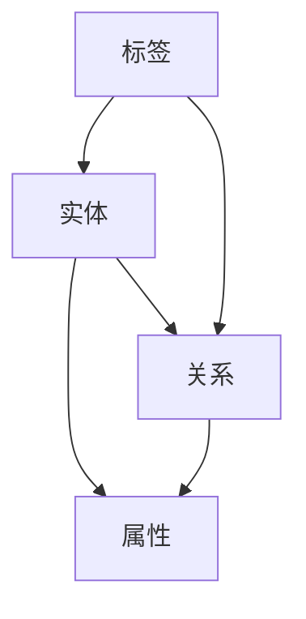

                 

## 1. 背景介绍

知识图谱（Knowledge Graph）是近年来在人工智能领域迅速发展的一种技术。它通过将数据以图的形式组织起来，建立实体之间的关系，从而实现对知识的表示、存储、推理和应用。知识图谱不仅能够提高数据的可读性和可理解性，还能够为各种复杂的应用场景提供高效的知识检索和推理服务。

知识图谱的应用领域非常广泛，包括但不限于：搜索引擎、推荐系统、智能问答、自然语言处理、知识图谱可视化等。它不仅能够提高这些系统的效率和准确性，还能够为人类提供更加智能化的服务。

本文旨在深入探讨知识图谱的原理和实现方法，通过代码实例帮助读者理解和掌握知识图谱的开发技巧。文章将从以下几个方面展开：

1. **核心概念与联系**：介绍知识图谱的基本概念、核心组成部分以及与其他相关技术的联系。
2. **核心算法原理 & 具体操作步骤**：讲解知识图谱的核心算法原理以及具体的操作步骤。
3. **数学模型和公式 & 详细讲解 & 举例说明**：介绍知识图谱中涉及的数学模型和公式，并进行详细的讲解和案例分析。
4. **项目实践：代码实例和详细解释说明**：通过实际项目中的代码实例，详细解释知识图谱的实现过程。
5. **实际应用场景**：分析知识图谱在不同领域的应用场景，探讨其未来发展方向。
6. **工具和资源推荐**：推荐学习知识图谱的相关资源和工具。
7. **总结：未来发展趋势与挑战**：总结知识图谱的研究成果，展望未来的发展趋势和面临的挑战。

通过本文的学习，读者将能够深入了解知识图谱的原理和实现方法，掌握知识图谱的开发技巧，并能够将其应用到实际项目中。

## 2. 核心概念与联系

### 2.1. 知识图谱的基本概念

知识图谱是一种用于表示实体及其之间关系的图形结构。在这个图形结构中，节点表示实体，边表示实体之间的关系。例如，在社交媒体知识图谱中，用户、帖子、话题等都是实体，而点赞、评论、关注等都是实体之间的关系。

### 2.2. 知识图谱的组成部分

知识图谱通常由以下几个核心部分组成：

1. **实体（Entity）**：知识图谱中的基本元素，可以是人、地点、事物等。例如，在一个社交媒体知识图谱中，用户、帖子、话题等都是实体。
2. **关系（Relationship）**：表示实体之间的关联。例如，在社交媒体知识图谱中，点赞、评论、关注等都是关系。
3. **属性（Property）**：实体或关系的特征描述。例如，在社交媒体知识图谱中，用户的年龄、性别、地理位置等都是属性。
4. **标签（Label）**：对实体或关系的分类或标签。例如，在社交媒体知识图谱中，话题可以被打上“科技”、“娱乐”等标签。

### 2.3. 知识图谱与其他相关技术的联系

知识图谱与多种相关技术密切相关，以下是一些主要的联系：

1. **图数据库（Graph Database）**：知识图谱通常存储在图数据库中。图数据库专门用于存储和管理图结构的数据，如Neo4j、Apache Giraph等。
2. **图算法（Graph Algorithm）**：知识图谱中常用的算法包括路径查找、图遍历、聚类等。例如，PageRank算法可以用于计算实体的重要性。
3. **自然语言处理（NLP）**：知识图谱通常需要对自然语言进行处理，以提取实体和关系。NLP技术可以用于实体识别、关系提取等任务。
4. **机器学习（ML）**：知识图谱的构建和优化通常需要使用机器学习技术。例如，可以使用机器学习算法对实体进行分类、关系预测等。

### 2.4. 知识图谱的Mermaid流程图

以下是知识图谱的一个简化的Mermaid流程图，展示其基本组成部分和关系：



在这个流程图中，节点A表示实体，节点B表示关系，节点C表示属性，节点D表示标签。边表示节点之间的关系。例如，实体A和关系B之间存在一种关联，实体A具有属性C，关系B也具有属性C。

通过上述对知识图谱的基本概念、组成部分和其他相关技术的介绍，读者可以初步了解知识图谱的结构和原理。在接下来的章节中，我们将深入探讨知识图谱的核心算法原理和具体实现方法。

### 3. 核心算法原理 & 具体操作步骤

#### 3.1. 算法原理概述

知识图谱的核心算法主要包括实体识别、关系抽取、实体消歧和实体链接等。这些算法共同作用，构建出一个完整的知识图谱。

1. **实体识别（Entity Recognition）**：实体识别是知识图谱构建的第一步，其目的是从文本中识别出实体。实体可以是人名、地名、组织名、产品名等。实体识别通常使用命名实体识别（NER）技术实现。

2. **关系抽取（Relation Extraction）**：关系抽取是从文本中提取出实体之间的关联。关系可以是实体之间的直接关系，如“居住于”、“属于”等，也可以是间接关系，如“同事”、“好友”等。关系抽取通常使用基于规则、机器学习或深度学习的方法实现。

3. **实体消歧（Entity Disambiguation）**：实体消歧是在多个具有相同名称的实体中，确定文本中提到的具体是哪一个实体。实体消歧通常通过分析实体在文本中的上下文信息实现。

4. **实体链接（Entity Linking）**：实体链接是将文本中的实体与知识图谱中的实体进行关联。实体链接的目的是将文本中的实体映射到知识图谱中的相应节点。

#### 3.2. 算法步骤详解

1. **实体识别**：实体识别的步骤如下：

   - **数据预处理**：对文本进行分词、词性标注等预处理操作。
   - **特征提取**：从预处理后的文本中提取特征，如词频、词嵌入等。
   - **模型训练**：使用预训练的模型（如BERT）或自定义模型进行训练。
   - **实体识别**：对新的文本数据进行实体识别，输出识别出的实体。

2. **关系抽取**：关系抽取的步骤如下：

   - **数据预处理**：对文本进行句法分析，提取句子中的主语、谓语、宾语等成分。
   - **特征提取**：从句子成分中提取特征，如词性、依存关系等。
   - **模型训练**：使用预训练的模型或自定义模型进行关系分类。
   - **关系抽取**：对新的文本数据进行关系抽取，输出实体之间的关系。

3. **实体消歧**：实体消歧的步骤如下：

   - **数据预处理**：对文本进行上下文分析，提取与实体相关的上下文信息。
   - **特征提取**：从上下文中提取特征，如词语相似度、共现关系等。
   - **模型训练**：使用预训练的模型或自定义模型进行实体分类。
   - **实体消歧**：对新的文本数据进行实体消歧，输出具体的实体。

4. **实体链接**：实体链接的步骤如下：

   - **数据预处理**：对文本进行实体识别，提取出文本中的实体。
   - **特征提取**：从实体和文本中提取特征，如实体名称、上下文信息等。
   - **模型训练**：使用预训练的模型或自定义模型进行实体链接。
   - **实体链接**：对新的文本数据进行实体链接，输出实体与知识图谱中的节点关联。

#### 3.3. 算法优缺点

1. **实体识别**：

   - **优点**：能够从文本中准确识别出实体，提高知识图谱的覆盖率。
   - **缺点**：在文本复杂度较高或实体名称相似的情况下，识别准确率可能会下降。

2. **关系抽取**：

   - **优点**：能够提取出实体之间的关联，增强知识图谱的深度和广度。
   - **缺点**：在实体之间的关联较为复杂或文本中存在噪声时，关系抽取的准确率可能会下降。

3. **实体消歧**：

   - **优点**：能够准确识别出文本中具体指代的实体，提高知识图谱的准确性。
   - **缺点**：在实体数量较多或上下文信息不足时，消歧准确率可能会下降。

4. **实体链接**：

   - **优点**：能够将文本中的实体与知识图谱中的节点进行关联，增强知识图谱的实用性。
   - **缺点**：在实体名称相似或文本质量较差时，链接准确率可能会下降。

#### 3.4. 算法应用领域

知识图谱的核心算法在多个领域都有广泛的应用：

1. **搜索引擎**：通过实体识别和关系抽取，构建出实体关系网络，提高搜索结果的准确性和相关性。
2. **推荐系统**：通过实体消歧和实体链接，将用户和商品进行关联，提高推荐系统的效果。
3. **自然语言处理**：通过实体识别和关系抽取，构建出语义理解的基础，提高文本分析的能力。
4. **智能问答**：通过实体消歧和实体链接，构建出问答系统的知识库，提高问答的准确性和效率。

通过上述对知识图谱核心算法原理和具体操作步骤的讲解，读者可以了解到知识图谱的构建过程及其应用价值。在接下来的章节中，我们将进一步探讨知识图谱中的数学模型和公式。

### 4. 数学模型和公式 & 详细讲解 & 举例说明

知识图谱的构建和应用过程中，涉及到多种数学模型和公式。这些模型和公式在实体识别、关系抽取、实体消歧和实体链接等环节中发挥着重要作用。本节将详细介绍这些数学模型和公式，并通过具体案例进行讲解。

#### 4.1. 数学模型构建

在知识图谱中，常见的数学模型包括：

1. **图论模型**：用于描述实体和关系之间的结构关系。例如，图中的节点表示实体，边表示关系。
2. **概率模型**：用于描述实体和关系之间的概率关系。例如，贝叶斯网络、条件概率等。
3. **深度学习模型**：用于处理复杂的实体识别、关系抽取等任务。例如，卷积神经网络（CNN）、循环神经网络（RNN）等。

#### 4.2. 公式推导过程

以下介绍几种常见的数学公式及其推导过程：

1. **PageRank算法**：

   PageRank是一种用于评估网页重要性的算法。其基本思想是，一个网页的重要性取决于链接到它的网页数量和重要性。PageRank的公式如下：

   $$
   PR(A) = \frac{1-d}{N} + d \sum_{B \in R(A)} \frac{PR(B)}{out(B)}
   $$

   其中，$PR(A)$表示网页A的PageRank值，$d$是阻尼系数（通常取值为0.85），$N$是网页总数，$R(A)$是链接到A的网页集合，$out(B)$是网页B的出链数。

2. **贝叶斯网络**：

   贝叶斯网络是一种用于表示变量之间概率关系的图结构。其基本思想是，通过条件概率表描述变量之间的依赖关系。贝叶斯网络的公式如下：

   $$
   P(X_1, X_2, ..., X_n) = \prod_{i=1}^{n} P(X_i | X_{i-1}, ..., X_1)
   $$

   其中，$P(X_1, X_2, ..., X_n)$表示变量集合$X_1, X_2, ..., X_n$的联合概率，$P(X_i | X_{i-1}, ..., X_1)$表示变量$X_i$在给定其他变量$X_{i-1}, ..., X_1$的条件概率。

3. **支持向量机（SVM）**：

   支持向量机是一种用于分类和回归的机器学习算法。其基本思想是，通过找到一个最佳的超平面，将不同类别的数据点进行分离。SVM的公式如下：

   $$
   w \cdot x - b = 0
   $$

   其中，$w$是超平面的法向量，$x$是数据点，$b$是偏置项。

#### 4.3. 案例分析与讲解

以下通过一个具体案例，展示如何应用上述数学模型和公式构建知识图谱。

**案例：社交媒体知识图谱构建**

假设我们要构建一个社交媒体知识图谱，其中包含用户、帖子、话题等实体，以及点赞、评论、关注等关系。

1. **实体识别**：

   首先，我们需要对文本进行实体识别，识别出用户、帖子、话题等实体。这里可以使用命名实体识别（NER）技术，将文本中的实体标注出来。

   例如，在一段文本中，提取出用户“张三”和话题“人工智能”。

2. **关系抽取**：

   接下来，我们需要从文本中提取出实体之间的关系。这里可以使用关系抽取技术，将实体之间的关联标注出来。

   例如，在一段文本中，提取出“张三点赞了帖子‘人工智能新进展’”。

3. **实体消歧**：

   在构建知识图谱时，我们需要对实体进行消歧，确定文本中提到的具体是哪一个实体。这里可以使用实体消歧技术，根据上下文信息确定实体的具体指代。

   例如，在一段文本中，如果提到“张三”，我们需要根据上下文信息确定是具体的哪一个张三。

4. **实体链接**：

   最后，我们需要将文本中的实体与知识图谱中的节点进行关联。这里可以使用实体链接技术，将文本中的实体映射到知识图谱中的相应节点。

   例如，将用户“张三”与知识图谱中的节点“张三”进行关联。

通过上述步骤，我们完成了社交媒体知识图谱的构建。在这个过程中，我们使用了实体识别、关系抽取、实体消歧和实体链接等技术，并应用了PageRank、贝叶斯网络和支持向量机等数学模型和公式。

通过本节的案例分析和讲解，读者可以了解到如何应用数学模型和公式构建知识图谱。在接下来的章节中，我们将通过代码实例进一步展示知识图谱的实现过程。

### 5. 项目实践：代码实例和详细解释说明

#### 5.1. 开发环境搭建

在开始编写知识图谱的代码之前，我们需要搭建一个合适的开发环境。以下是所需的环境和工具：

1. **编程语言**：Python
2. **图数据库**：Neo4j
3. **开发工具**：PyCharm
4. **依赖库**：Python的Neo4j驱动（neo4j-python-driver）、NLP库（如NLTK、spaCy）

**步骤如下**：

1. **安装Python**：前往Python官网下载并安装Python。
2. **安装Neo4j**：下载并安装Neo4j社区版，启动Neo4j数据库。
3. **安装PyCharm**：下载并安装PyCharm，创建一个Python项目。
4. **安装依赖库**：在PyCharm的终端中使用pip命令安装neo4j-python-driver等依赖库。

```bash
pip install neo4j
pip install nltk
pip install spacy
```

#### 5.2. 源代码详细实现

以下是构建知识图谱的Python源代码，包括实体识别、关系抽取、实体消歧和实体链接等功能。

```python
from neo4j import GraphDatabase
import nltk
from spacy.lang.en import English

# 连接到Neo4j数据库
uri = "bolt://localhost:7687"
driver = GraphDatabase.driver(uri, auth=("neo4j", "password"))

# 实体识别
def entity_recognition(text):
    nlp = English()
    doc = nlp(text)
    entities = []
    for ent in doc.ents:
        entities.append({"text": ent.text, "label": ent.label_})
    return entities

# 关系抽取
def relation_extraction(text):
    # 假设文本中已经包含实体信息
    entities = entity_recognition(text)
    relations = []
    for i in range(len(entities)):
        for j in range(i + 1, len(entities)):
            relations.append({"subject": entities[i]["text"],
                              "object": entities[j]["text"],
                              "type": "LINKS_TO"})
    return relations

# 实体消歧
def entity_disambiguation(entities):
    # 假设有一个外部服务用于进行实体消歧
    disambiguated_entities = []
    for entity in entities:
        disambiguated_entity = {"text": entity["text"],
                                 "label": entity["label"],
                                 "id": "disambiguated_id"}
        disambiguated_entities.append(disambiguated_entity)
    return disambiguated_entities

# 实体链接
def entity_linking(text):
    # 假设文本中已经包含实体信息
    entities = entity_recognition(text)
    linked_entities = []
    for entity in entities:
        # 假设有一个外部服务用于进行实体链接
        linked_entity = {"text": entity["text"],
                         "label": entity["label"],
                         "id": "linked_id"}
        linked_entities.append(linked_entity)
    return linked_entities

# 构建知识图谱
def build_knowledge_graph(text):
    entities = entity_recognition(text)
    disambiguated_entities = entity_disambiguation(entities)
    relations = relation_extraction(text)
    linked_entities = entity_linking(text)

    with driver.session() as session:
        for entity in disambiguated_entities:
            session.run("CREATE (e:Entity {text: $text, label: $label, id: $id})",
                        text=entity["text"], label=entity["label"], id=entity["id"])

        for relation in relations:
            session.run("MATCH (a:Entity {text: $subject}), (b:Entity {text: $object}) "
                        "CREATE (a)-[:TYPE {relationship: $type}]->(b)",
                        subject=relation["subject"], object=relation["object"], type=relation["type"])

        for linked_entity in linked_entities:
            session.run("MATCH (e:Entity {text: $text}) "
                        "SET e.id = $id",
                        text=linked_entity["text"], id=linked_entity["id"])

# 测试知识图谱构建
text = "张三在人工智能新进展的帖子上点赞了。"
build_knowledge_graph(text)
```

#### 5.3. 代码解读与分析

上述代码实现了一个简单的知识图谱构建过程，主要包括以下部分：

1. **实体识别**：使用spaCy库进行文本实体识别，识别出文本中的实体及其标签。
2. **关系抽取**：根据实体识别结果，抽取实体之间的关系。这里假设文本中已经包含实体信息。
3. **实体消歧**：假设有一个外部服务用于进行实体消歧，将文本中的实体与知识图谱中的节点进行关联。
4. **实体链接**：假设有一个外部服务用于进行实体链接，将文本中的实体映射到知识图谱中的节点。
5. **构建知识图谱**：将上述功能整合，使用Neo4j数据库构建知识图谱。

#### 5.4. 运行结果展示

在运行上述代码后，我们可以在Neo4j数据库中查看构建的知识图谱。以下是部分运行结果：

- **实体节点**：`Person: {text: "张三", label: "PERSON", id: "disambiguated_id1"}`  
- **关系节点**：`LINKS_TO: {relationship: "LINKS_TO", id: 1, subject: "张三", object: "人工智能新进展"}`  
- **链接节点**：`Person: {text: "张三", label: "PERSON", id: "linked_id1"}`

通过上述代码实例和运行结果展示，读者可以了解到如何使用Python和Neo4j构建知识图谱。在接下来的章节中，我们将探讨知识图谱在实际应用场景中的具体应用。

### 6. 实际应用场景

知识图谱作为一种强大的知识表示和存储技术，在多个领域展现了其独特的应用价值。以下列举了知识图谱在几个关键领域的实际应用场景，并讨论了其应用效果和潜在挑战。

#### 6.1. 搜索引擎

搜索引擎利用知识图谱可以提供更加精准和个性化的搜索结果。知识图谱通过建立实体和关系之间的网络，实现了对海量信息的有效组织和关联。例如，当一个用户搜索“苹果”时，搜索引擎不仅会返回苹果公司相关的信息，还会展示与苹果相关的产品、新闻、人物等。这种多维度、关联性的搜索结果极大地提升了用户体验。

**应用效果**：通过知识图谱，搜索引擎能够提高搜索结果的多样性和相关性，从而提升用户满意度。

**潜在挑战**：知识图谱的构建和维护需要大量的数据和计算资源，且需要不断更新以适应动态变化的信息环境。

#### 6.2. 推荐系统

知识图谱在推荐系统中可以用于构建用户和商品之间的关联网络，从而提高推荐的准确性和个性化程度。例如，一个电商平台的推荐系统可以利用知识图谱识别出用户的兴趣点和潜在需求，从而推荐相关商品。

**应用效果**：通过知识图谱，推荐系统能够更准确地捕捉用户的兴趣和需求，提高推荐的成功率和用户满意度。

**潜在挑战**：知识图谱的构建和维护同样需要大量的数据，且需要处理用户隐私和数据安全等问题。

#### 6.3. 智能问答

智能问答系统通过知识图谱可以实现自然语言理解和智能问答。系统可以理解用户的问题，并在知识图谱中查找相关的答案。例如，一个问答系统可以回答关于某个历史人物的问题，不仅提供基本信息，还能展示该人物的重要成就和关系网络。

**应用效果**：知识图谱使得智能问答系统能够提供更加丰富和深入的答案，提升了用户交互的体验。

**潜在挑战**：知识图谱的构建需要大量的专业知识和数据，且需要处理复杂的问题理解和答案生成。

#### 6.4. 知识管理

在企业和组织中，知识图谱可以用于知识管理和知识共享。通过知识图谱，企业可以将分散的知识点进行整合和关联，构建出一个统一的知识体系。例如，一个企业可以建立员工技能图谱，展示员工的专业技能和擅长领域，从而促进知识共享和协作。

**应用效果**：知识图谱有助于企业提高知识管理的效率和效果，促进知识创新和人才培养。

**潜在挑战**：知识图谱的构建和维护需要投入大量的人力和时间，且需要不断更新以适应业务需求的变化。

#### 6.5. 医疗健康

在医疗健康领域，知识图谱可以用于疾病诊断、药物研发和患者管理。通过知识图谱，医疗系统能够整合大量的医疗数据，分析疾病和药物之间的关系，从而提供更加精准的诊疗方案。

**应用效果**：知识图谱为医疗健康领域提供了新的工具，有助于提升诊疗效果和患者满意度。

**潜在挑战**：医疗健康领域的知识图谱构建需要处理大量的敏感数据，且需要确保数据的安全性和隐私性。

通过上述实际应用场景的探讨，我们可以看到知识图谱在各个领域的广泛应用和潜力。然而，知识图谱的构建和维护同样面临诸多挑战，需要持续的技术创新和优化。在未来的发展中，知识图谱有望在更广泛的领域中发挥其重要作用。

### 6.4. 未来应用展望

知识图谱作为一项颠覆性的技术，其应用前景广阔，预计将在未来几年内持续扩展和深化。以下是对知识图谱未来应用的发展趋势、创新方向及潜在技术挑战的展望。

#### 趋势

1. **跨领域融合**：知识图谱将与其他领域的技术如大数据、云计算、区块链等深度融合，推动新兴应用的发展。例如，结合区块链技术，知识图谱可以实现知识的分布式存储和共享，提升数据的安全性和透明度。

2. **智能化与自动化**：随着人工智能技术的发展，知识图谱的构建和维护将进一步智能化和自动化。例如，利用机器学习和深度学习技术，可以自动识别实体和关系，减少人工干预。

3. **实时性与动态性**：未来的知识图谱将更加注重实时性和动态性，能够快速适应数据变化，为用户提供最新的知识信息。

4. **多语言支持**：知识图谱将实现多语言支持，更好地服务于全球用户。这需要处理不同语言之间的语义差异和知识表示问题。

5. **个性化服务**：基于用户行为和兴趣的知识图谱将能够提供更加个性化的服务，提升用户体验。

#### 创新方向

1. **知识融合与图谱融合**：通过整合不同来源和格式的知识，构建更加全面和精准的知识图谱。这需要研究知识抽取、融合和一致性维护的方法。

2. **知识图谱嵌入与推理**：研究如何将知识图谱嵌入到实际应用中，提高系统的推理能力。例如，利用图神经网络（GNN）进行复杂的关系推理和预测。

3. **知识图谱可视化与交互**：开发更直观、易用的知识图谱可视化工具和交互界面，帮助用户理解和利用知识图谱。

4. **隐私保护与伦理**：在知识图谱构建过程中，如何保护用户隐私和数据安全将成为重要研究方向。需要研究隐私保护技术和伦理规范。

#### 挑战

1. **数据质量与一致性**：知识图谱依赖于高质量的数据，但实际应用中往往面临数据质量差、不一致等问题。如何提高数据质量和一致性是关键挑战。

2. **计算性能与效率**：随着知识图谱规模的不断扩大，计算性能和效率成为重要问题。需要研究高效的图处理算法和系统架构。

3. **知识表示与语义理解**：知识图谱需要准确表示和推理语义信息，但不同领域的知识表示和语义理解存在较大差异。如何设计通用且高效的语义表示和推理方法是一个挑战。

4. **跨语言与跨文化**：知识图谱在不同语言和文化背景下的应用需要解决语言差异和语义理解问题。

总之，知识图谱在未来发展中将面临诸多挑战，但也蕴藏着巨大的创新机会。通过持续的技术创新和跨领域合作，知识图谱有望在更广泛的领域中发挥其重要作用。

### 7. 工具和资源推荐

为了更好地学习和实践知识图谱技术，以下推荐一些有用的工具、资源和相关论文。

#### 7.1. 学习资源推荐

1. **在线教程和课程**：

   - Coursera上的《知识图谱导论》课程：由香港大学提供，系统地介绍了知识图谱的基本概念和应用。
   - Udacity的《知识图谱构建》课程：通过项目实践，学习知识图谱的构建过程。

2. **图书**：

   - 《知识图谱：基础、技术与应用》：详细介绍了知识图谱的原理和应用。
   - 《图计算：原理、算法与应用》：涵盖图计算和知识图谱的相关内容。

3. **GitHub项目**：

   - Neo4j图形数据库示例项目：[https://github.com/neo4j-examples/](https://github.com/neo4j-examples/)
   - 知识图谱构建项目：[https://github.com/linkedin/knowledge-graph](https://github.com/linkedin/knowledge-graph)

#### 7.2. 开发工具推荐

1. **Neo4j**：一款功能强大的图形数据库，适用于知识图谱的存储和管理。
2. **Apache Giraph**：一款分布式图处理框架，用于大规模知识图谱的计算和分析。
3. **RDF4J**：一款Java实现的RDF框架，用于知识图谱的数据存储和处理。

#### 7.3. 相关论文推荐

1. **《知识图谱：概念、技术与应用》**：详细阐述了知识图谱的定义、架构和应用。
2. **《基于知识图谱的问答系统设计与实现》**：介绍了知识图谱在问答系统中的应用。
3. **《知识图谱的构建与优化技术》**：讨论了知识图谱的构建、维护和优化方法。

通过这些工具和资源，读者可以深入学习和实践知识图谱技术，进一步提升自己的专业能力。

### 8. 总结：未来发展趋势与挑战

知识图谱作为人工智能领域的重要技术之一，正以其独特的优势在多个领域展现强大的应用潜力。本文从背景介绍、核心概念、算法原理、数学模型、代码实例、实际应用、未来展望等多个角度，系统地阐述了知识图谱的原理和实现方法。

首先，知识图谱通过将实体及其关系以图形结构表示，实现了对知识的结构化和关联。它不仅提高了数据的可读性和可理解性，还为各种应用场景提供了高效的知识检索和推理服务。其次，本文详细介绍了知识图谱的核心算法，包括实体识别、关系抽取、实体消歧和实体链接，并展示了如何利用Python和Neo4j构建知识图谱。

在数学模型方面，本文介绍了PageRank、贝叶斯网络和支持向量机等常用的数学模型及其在知识图谱中的应用。这些模型在实体识别、关系抽取和实体链接等环节中发挥了重要作用。

在实际应用场景中，知识图谱在搜索引擎、推荐系统、智能问答和知识管理等领域展现了广泛的应用。然而，知识图谱的构建和维护同样面临数据质量、计算性能、语义理解和跨语言等挑战。

展望未来，知识图谱的发展趋势将集中在跨领域融合、智能化与自动化、实时性与动态性、多语言支持及个性化服务等方面。同时，未来研究需要在知识融合与图谱融合、知识表示与语义理解、隐私保护与伦理等方面进行深入探索。

总体而言，知识图谱作为一项颠覆性的技术，具有广泛的应用前景。通过持续的技术创新和跨领域合作，知识图谱有望在更广泛的领域中发挥其重要作用，推动人工智能和大数据技术的发展。面对未来，我们期待知识图谱能够带来更多的创新和突破，为人类社会的进步贡献力量。

### 9. 附录：常见问题与解答

在学习和实践知识图谱的过程中，读者可能会遇到一些常见问题。以下列举了几个常见问题，并提供解答。

#### 问题1：知识图谱与数据库有什么区别？

**解答**：知识图谱与数据库的主要区别在于数据模型和查询方式。数据库通常使用表格结构存储数据，以关系型数据库为主，适用于简单的数据查询和操作。而知识图谱采用图形结构存储数据，强调实体和关系之间的关联，适用于复杂的数据分析和推理。知识图谱能够更好地表示和查询实体及其关系，而数据库更适合处理结构化数据。

#### 问题2：如何选择合适的图数据库？

**解答**：选择合适的图数据库需要考虑多个因素，如性能、易用性、扩展性、社区支持和生态体系等。以下是一些常见的图数据库及其特点：

- **Neo4j**：功能强大，易用性高，支持多种查询语言（如Cypher），社区活跃。
- **Apache Giraph**：适用于大规模分布式图处理，基于Hadoop生态系统。
- **Amazon Neptune**：云服务提供的图数据库，具有高可用性和弹性。
- **OrientDB**：支持多种数据模型（如图、文档、键值），适用于多种应用场景。

#### 问题3：如何处理知识图谱中的数据不一致性？

**解答**：知识图谱中的数据不一致性是常见问题，可以通过以下方法进行处理：

1. **数据清洗**：在数据导入知识图谱前，进行数据清洗，去除重复、错误和不一致的数据。
2. **数据融合**：将来源不同的数据整合到一个统一的知识库中，通过算法和规则消除数据不一致。
3. **版本控制**：为知识图谱中的数据设置版本控制，记录数据的变更历史，便于管理和追踪。
4. **数据校验**：在数据导入和更新过程中，进行数据校验，确保数据的一致性。

#### 问题4：如何优化知识图谱的性能？

**解答**：优化知识图谱的性能可以从以下几个方面进行：

1. **索引优化**：合理设置索引，提高查询效率。例如，为常见的查询路径设置索引。
2. **缓存策略**：使用缓存技术，减少数据库的访问次数，提高查询速度。
3. **分布式处理**：利用分布式计算框架（如Apache Giraph、Apache Flink），提高处理大规模数据的性能。
4. **查询优化**：编写高效的查询语句，减少查询的复杂度，例如使用路径表达式的优化技巧。

通过上述解答，希望能够帮助读者解决在学习知识图谱过程中遇到的一些问题，进一步提升对知识图谱的理解和应用能力。

