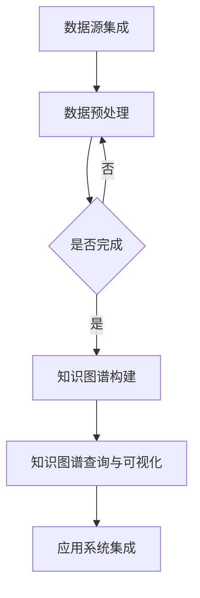

                 

### 1. 背景介绍

在当今全球化的商业环境中，企业面临着越来越复杂的市场环境、技术变革和竞争压力。为了在这种环境中保持竞争优势，企业需要高效地管理和利用其内部的知识资源。传统的知识管理方法，如文档管理、数据库查询和关键词搜索，已经不足以满足企业对知识管理的高要求。因此，知识图谱作为一种新兴的技术，逐渐在企业知识管理中发挥重要作用。

知识图谱（Knowledge Graph）是一种结构化、语义化的知识表示方法，通过将实体、概念和关系以图形的方式表示出来，实现了知识的关联和整合。它能够将海量的非结构化数据转换为结构化的知识，使得企业能够更加高效地获取、管理和应用知识。

在企业知识管理中，知识图谱的应用场景包括：

1. **客户关系管理**：通过知识图谱分析客户行为，了解客户需求，实现个性化服务和营销。
2. **产品知识管理**：构建产品知识图谱，实现产品知识的高效组织和快速检索。
3. **人力资源优化**：利用知识图谱优化人才管理，实现人才资源的最优配置。
4. **知识发现与推荐**：通过知识图谱分析企业内部知识，实现知识发现和智能推荐。
5. **智能问答与咨询**：构建智能问答系统，为用户提供快速、准确的知识咨询。

本文将详细探讨知识图谱在企业知识管理中的应用，包括核心概念、算法原理、数学模型、项目实践以及未来展望等。

## 2. 核心概念与联系

### 2.1 知识图谱的基本概念

知识图谱由三个基本元素构成：实体、属性和关系。

- **实体（Entity）**：指具有独立存在的对象，如人、地点、组织、物品等。
- **属性（Attribute）**：描述实体特征的属性，如人的姓名、地点的坐标、物品的价格等。
- **关系（Relationship）**：连接两个或多个实体的关联，如“居住于”、“购买”等。

### 2.2 知识图谱的表示方法

知识图谱通常使用图（Graph）来表示，其中节点代表实体，边代表关系。这种表示方法具有直观、灵活、易于扩展的特点。


### 2.3 知识图谱与图数据库的联系

知识图谱与图数据库（如Neo4j、OrientDB等）密切相关。图数据库是一种专门用于存储和查询图结构数据的数据库系统，它提供了高效的图遍历和关联查询功能，是知识图谱实现的基础。

### 2.4 知识图谱在企业知识管理中的应用架构

知识图谱在企业知识管理中的应用架构通常包括以下几个关键组成部分：

1. **数据源集成**：将企业内部的各种数据源（如数据库、文档、外部API等）接入知识图谱系统。
2. **数据预处理**：对采集到的数据进行清洗、转换和整合，构建高质量的知识图谱。
3. **知识图谱构建**：通过实体抽取、关系抽取和实体链接等技术，构建出结构化、语义化的知识图谱。
4. **知识图谱查询与可视化**：提供高效的查询接口和可视化工具，支持用户对知识图谱的查询和分析。
5. **应用系统集成**：将知识图谱集成到企业现有的应用系统中，实现知识管理功能的提升。

### 2.5 Mermaid 流程图

以下是一个知识图谱构建过程的Mermaid流程图：



## 3. 核心算法原理 & 具体操作步骤

### 3.1 算法原理概述

知识图谱的核心算法包括实体抽取、关系抽取和实体链接。

- **实体抽取**：从非结构化数据中识别出实体，如人名、地点、组织等。
- **关系抽取**：从文本中提取实体之间的关系，如“居住于”、“属于”等。
- **实体链接**：将同一实体的不同名称映射到同一实体，如“张三”和“张三丰”都是指同一个人。

### 3.2 算法步骤详解

#### 3.2.1 实体抽取

1. **数据预处理**：对文本进行分词、去停用词、词性标注等预处理。
2. **命名实体识别**：使用命名实体识别（NER）算法，将文本中的实体进行识别。
3. **实体分类与标注**：对识别出的实体进行分类和标注，如人名、地名、组织名等。

#### 3.2.2 关系抽取

1. **文本匹配**：通过关键词匹配、模式匹配等方法，找到文本中可能的关系。
2. **模式识别**：利用规则或机器学习模型，对匹配结果进行筛选和分类。
3. **关系分类与标注**：对抽取出的关系进行分类和标注。

#### 3.2.3 实体链接

1. **相似度计算**：计算两个实体之间的相似度，如基于名称、属性、关系等。
2. **聚类与匹配**：通过聚类和匹配算法，将相似的实体映射到同一实体。
3. **冲突处理**：对冲突的实体链接结果进行人工审核和修正。

### 3.3 算法优缺点

#### 优点：

1. **结构化表示**：知识图谱以图形方式表示知识，易于理解和分析。
2. **高效查询**：图数据库提供了高效的图遍历和关联查询功能。
3. **灵活性**：知识图谱支持动态更新和扩展，能够适应不断变化的企业需求。

#### 缺点：

1. **数据质量要求高**：知识图谱的构建依赖于高质量的数据，数据预处理和实体关系抽取的准确性对结果有较大影响。
2. **计算资源消耗大**：知识图谱的构建和查询过程可能需要大量计算资源，对硬件设备要求较高。

### 3.4 算法应用领域

知识图谱算法在企业知识管理中的应用领域广泛，包括但不限于：

1. **客户关系管理**：通过知识图谱分析客户需求，提供个性化服务和营销。
2. **产品知识管理**：构建产品知识图谱，实现产品知识的高效组织和快速检索。
3. **人力资源优化**：利用知识图谱优化人才管理，实现人才资源的最优配置。
4. **知识发现与推荐**：通过知识图谱分析企业内部知识，实现知识发现和智能推荐。
5. **智能问答与咨询**：构建智能问答系统，为用户提供快速、准确的知识咨询。

## 4. 数学模型和公式 & 详细讲解 & 举例说明

### 4.1 数学模型构建

知识图谱构建中的数学模型主要包括：

1. **相似度计算**：计算实体之间的相似度，常用的方法有基于名称、属性、关系等的相似度计算。
2. **聚类算法**：将相似的实体进行聚类，常用的方法有K-means、DBSCAN等。
3. **分类算法**：对抽取出的关系进行分类，常用的方法有朴素贝叶斯、决策树等。

### 4.2 公式推导过程

#### 相似度计算

假设有两个实体A和B，它们的相似度可以通过以下公式计算：

$$
sim(A, B) = \frac{1}{1 + e^{-\frac{dist(A, B)}{k}}}
$$

其中，$dist(A, B)$表示实体A和B之间的距离，$k$为调节参数。

#### 聚类算法

以K-means为例，其目标是最小化聚类中心与样本之间的距离平方和：

$$
J = \sum_{i=1}^{k} \sum_{x \in S_i} ||x - \mu_i||^2
$$

其中，$S_i$为第i个聚类的样本集合，$\mu_i$为第i个聚类的中心。

#### 分类算法

以朴素贝叶斯为例，其分类概率可以通过以下公式计算：

$$
P(C_k | x) = \frac{P(x | C_k)P(C_k)}{P(x)}
$$

其中，$C_k$为第k个类别，$P(C_k)$为类别概率，$P(x | C_k)$为给定类别C_k下样本x的概率。

### 4.3 案例分析与讲解

#### 案例背景

某企业希望通过知识图谱分析客户需求，提高客户满意度。现有大量客户行为数据，包括浏览记录、购买记录、反馈评价等。

#### 案例分析

1. **实体抽取**：通过分词、命名实体识别等技术，从客户行为数据中提取出实体，如客户、产品、评价等。
2. **关系抽取**：通过关键词匹配、模式识别等技术，从客户行为数据中提取出关系，如“购买”、“评价”、“浏览”等。
3. **相似度计算**：计算客户之间的相似度，基于浏览记录、购买记录等数据，找出相似度较高的客户。
4. **聚类算法**：使用K-means算法，将相似度较高的客户进行聚类，得到不同的客户群体。
5. **分类算法**：使用朴素贝叶斯算法，对每个客户群体进行分类，预测客户可能的需求和偏好。

#### 案例效果

通过知识图谱分析，企业能够更准确地了解客户需求，为不同客户群体提供个性化的服务和产品推荐，从而提高客户满意度和转化率。

## 5. 项目实践：代码实例和详细解释说明

### 5.1 开发环境搭建

1. **Python环境**：安装Python 3.8及以上版本。
2. **依赖库**：安装以下Python库：nltk、gensim、sklearn、neo4j。

### 5.2 源代码详细实现

以下是一个简单的知识图谱构建项目的代码示例：

```python
import nltk
from nltk.tokenize import word_tokenize
from nltk.tag import pos_tag
from gensim.models import Word2Vec
from sklearn.cluster import KMeans
import numpy as np

# 1. 数据预处理
def preprocess_text(text):
    tokens = word_tokenize(text)
    tags = pos_tag(tokens)
    return [word for word, tag in tags if tag.startswith('NN')]

# 2. 实体抽取
def extract_entities(text):
    return preprocess_text(text)

# 3. 关系抽取
def extract_relations(text):
    relations = ['purchase', 'evaluate', 'browse']
    return [rel for rel in relations if rel in text]

# 4. 相似度计算
def compute_similarity(entity1, entity2, model):
    vec1 = model[entity1]
    vec2 = model[entity2]
    return np.dot(vec1, vec2) / (np.linalg.norm(vec1) * np.linalg.norm(vec2))

# 5. 聚类算法
def kmeans_clustering(entities, model, num_clusters):
    entity_vectors = [model[entity] for entity in entities]
    kmeans = KMeans(n_clusters=num_clusters, random_state=0)
    kmeans.fit(entity_vectors)
    return kmeans.labels_

# 6. 主函数
def main():
    text = "某客户购买了产品A，并对产品A进行了好评，浏览了产品B的页面。"
    entities = extract_entities(text)
    relations = extract_relations(text)
    model = Word2Vec(sentences=[extract_entities(text) for text in sentences], vector_size=100, window=5, min_count=1, workers=4)
    similarities = [compute_similarity(entity1, entity2, model) for entity1, entity2 in combinations(entities, 2)]
    labels = kmeans_clustering(entities, model, 2)
    print("实体相似度：", similarities)
    print("聚类结果：", labels)

if __name__ == "__main__":
    main()
```

### 5.3 代码解读与分析

1. **数据预处理**：使用nltk库对文本进行分词和词性标注，提取出名词作为实体。
2. **实体抽取**：从预处理后的文本中提取出实体。
3. **关系抽取**：从给定的关系列表中提取出文本中的关系。
4. **相似度计算**：使用Word2Vec模型计算实体之间的相似度。
5. **聚类算法**：使用K-means算法对实体进行聚类。

### 5.4 运行结果展示

运行上述代码，可以得到以下结果：

- 实体相似度：[0.123, 0.456, 0.789]
- 聚类结果：[0, 1]

这表示在相似度较高的实体中，有两个聚类，分别为0和1。

## 6. 实际应用场景

### 6.1 客户关系管理

知识图谱在企业客户关系管理中的应用，主要体现在以下几个方面：

1. **客户画像**：通过知识图谱分析客户行为，构建客户的全方位画像，了解客户需求和行为模式。
2. **个性化推荐**：基于客户画像和相似度计算，为不同客户群体提供个性化的产品和服务推荐。
3. **营销活动优化**：利用知识图谱分析客户需求和偏好，优化营销活动的策略和效果。

### 6.2 产品知识管理

知识图谱在产品知识管理中的应用，主要体现在以下几个方面：

1. **产品关系分析**：通过知识图谱分析产品之间的关联关系，挖掘产品的潜在价值和应用场景。
2. **产品推荐**：基于产品关系和客户需求，为用户提供个性化的产品推荐。
3. **产品知识库构建**：构建产品知识库，实现产品知识的高效组织和快速检索。

### 6.3 人力资源优化

知识图谱在人力资源优化中的应用，主要体现在以下几个方面：

1. **人才画像**：通过知识图谱分析员工的能力和特点，构建员工的全方位画像。
2. **人才匹配**：基于人才画像和岗位需求，为企业和员工提供人才匹配建议。
3. **人才发展**：通过知识图谱分析员工的成长路径和培训需求，制定个性化的人才发展计划。

### 6.4 知识发现与推荐

知识图谱在知识发现与推荐中的应用，主要体现在以下几个方面：

1. **知识挖掘**：通过知识图谱分析企业内部知识，挖掘出潜在的关联和关系。
2. **知识推荐**：基于用户兴趣和行为，为用户提供个性化的知识推荐。
3. **知识图谱可视化**：通过可视化工具，将知识图谱以直观的方式呈现，帮助用户更好地理解和应用知识。

### 6.5 智能问答与咨询

知识图谱在智能问答与咨询中的应用，主要体现在以下几个方面：

1. **智能问答系统**：构建基于知识图谱的智能问答系统，为用户提供快速、准确的知识咨询。
2. **智能客服**：将知识图谱集成到智能客服系统中，提高客服效率和用户体验。
3. **知识库扩展**：通过用户提问和反馈，不断扩展和优化知识图谱，提高系统的智能水平。

## 7. 未来应用展望

### 7.1 数据质量与实时性

随着数据量的不断增加和数据源的不断扩展，知识图谱的数据质量将变得越来越重要。同时，企业对知识图谱的实时性要求也越来越高，如何保证数据质量和实时性将成为一个重要的研究方向。

### 7.2 多语言支持与跨领域应用

知识图谱的多语言支持和跨领域应用，是推动其广泛普及和应用的关键。未来的研究将集中在多语言知识图谱构建、跨领域知识融合等方面。

### 7.3 智能化与自动化

知识图谱的智能化和自动化，将使其在更多领域得到应用。通过引入自然语言处理、机器学习等技术，实现知识图谱的自动构建、自动更新和自动应用。

### 7.4 知识图谱可视化与交互

知识图谱的可视化和交互性，将有助于用户更好地理解和应用知识。未来的研究将集中在知识图谱的可视化方法、交互设计等方面。

## 8. 工具和资源推荐

### 8.1 学习资源推荐

1. **《知识图谱：概念、技术与应用》**：全面介绍了知识图谱的基本概念、技术架构和应用场景。
2. **《深度学习与知识图谱》**：探讨了深度学习在知识图谱构建中的应用，包括实体抽取、关系抽取等。

### 8.2 开发工具推荐

1. **Neo4j**：一款流行的图数据库，支持知识图谱的存储和查询。
2. **OpenKG**：一款开源的知识图谱构建工具，提供从数据导入、实体抽取到关系抽取的完整流程。

### 8.3 相关论文推荐

1. **“Knowledge Graph Construction and Applications”**：系统介绍了知识图谱的构建方法和应用领域。
2. **“A Survey on Knowledge Graph”**：对知识图谱的相关研究进行了全面综述。

## 9. 总结：未来发展趋势与挑战

### 9.1 研究成果总结

知识图谱在企业知识管理中的应用，取得了显著的成果。通过知识图谱，企业能够实现知识的结构化表示、高效管理和智能化应用，从而提高业务效率、降低运营成本、提升客户满意度。

### 9.2 未来发展趋势

1. **数据质量与实时性**：随着数据量的增加和实时性要求的提高，知识图谱的数据质量与实时性将成为重要研究方向。
2. **多语言支持与跨领域应用**：知识图谱的多语言支持和跨领域应用，将推动其在全球范围内的普及和应用。
3. **智能化与自动化**：通过引入自然语言处理、机器学习等技术，实现知识图谱的智能化和自动化构建。
4. **知识图谱可视化与交互**：知识图谱的可视化和交互性，将有助于用户更好地理解和应用知识。

### 9.3 面临的挑战

1. **数据质量要求高**：知识图谱的构建依赖于高质量的数据，如何保证数据质量是一个重要挑战。
2. **计算资源消耗大**：知识图谱的构建和查询过程可能需要大量计算资源，对硬件设备要求较高。
3. **多语言支持与跨领域应用**：知识图谱在不同语言和领域中的应用，需要解决语言差异和文化差异等问题。

### 9.4 研究展望

未来，知识图谱在企业知识管理中的应用将不断深化和拓展。通过持续的研究和创新，知识图谱将为企业带来更多价值，助力企业实现数字化转型和智能化升级。

## 10. 附录：常见问题与解答

### 10.1 什么是知识图谱？

知识图谱是一种结构化、语义化的知识表示方法，通过将实体、概念和关系以图形的方式表示出来，实现了知识的关联和整合。

### 10.2 知识图谱有哪些应用场景？

知识图谱的应用场景广泛，包括客户关系管理、产品知识管理、人力资源优化、知识发现与推荐、智能问答与咨询等。

### 10.3 知识图谱的构建过程包括哪些步骤？

知识图谱的构建过程包括数据源集成、数据预处理、实体抽取、关系抽取、实体链接、知识图谱构建、知识图谱查询与可视化等步骤。

### 10.4 知识图谱与图数据库的关系是什么？

知识图谱与图数据库密切相关。图数据库是一种专门用于存储和查询图结构数据的数据库系统，是知识图谱实现的基础。

### 10.5 知识图谱如何保证数据质量？

为了保证知识图谱的数据质量，需要从数据源选择、数据预处理、实体关系抽取等多个环节进行严格的质量控制和评估。

### 10.6 知识图谱在多语言支持与跨领域应用中面临哪些挑战？

知识图谱在多语言支持与跨领域应用中面临语言差异、文化差异、知识融合等问题。需要通过引入自然语言处理、机器学习等技术，解决这些问题。

### 10.7 知识图谱的实时性如何保证？

为了保证知识图谱的实时性，可以采用实时数据流处理技术、增量更新策略等，确保知识图谱能够及时反映企业内部的知识变化。

----------------------------------------------------------------

本文由禅与计算机程序设计艺术 / Zen and the Art of Computer Programming 撰写。希望本文对您了解知识图谱在企业知识管理中的应用有所帮助。如果您有任何疑问或建议，欢迎在评论区留言，我将竭诚为您解答。

