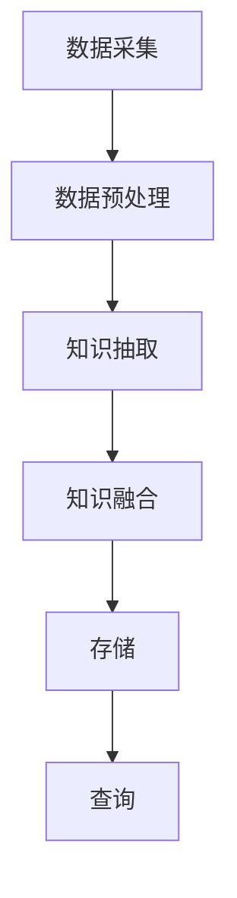
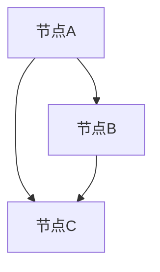
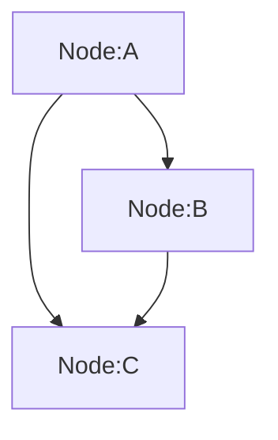

                 

关键词：知识图谱、程序员、知识管理、数据建模、人工智能、计算机科学

> 摘要：本文探讨了知识图谱在程序员知识管理中的应用，从核心概念、算法原理到实际案例，全面阐述了知识图谱在提升程序员工作效率、增强代码可维护性和促进团队协作方面的优势。通过介绍知识图谱构建和应用的流程，本文旨在为程序员提供实用的知识管理工具和方法。

## 1. 背景介绍

在信息技术飞速发展的今天，程序员的工作环境和任务复杂性不断升级。编程语言层出不穷，框架和技术栈不断演变，程序员需要不断学习新的知识和技能来跟上技术的步伐。与此同时，程序员面临的知识量也在爆炸性增长，如何高效地管理和利用这些知识成为了一个亟待解决的问题。

知识管理作为现代企业信息化的重要组成部分，旨在通过有效的知识获取、共享和应用，提高组织的整体竞争力。对于程序员而言，知识管理不仅涉及到个人技能的提升，还包括团队协作、项目经验积累和最佳实践推广等方面。

知识图谱作为一种结构化、语义化的知识表示方法，近年来在计算机科学、人工智能和知识管理领域得到了广泛关注。知识图谱通过节点和边的关联，能够表示复杂的关系网络，从而提供一种直观、高效的知识组织和检索方式。将知识图谱应用于程序员知识管理，有望解决知识获取和利用的难题，提升程序员的工作效率和团队协作能力。

## 2. 核心概念与联系

### 2.1 知识图谱的概念

知识图谱（Knowledge Graph）是一种基于语义网络的知识表示方法，它通过节点和边的结构化关系，将实体、概念、属性以及它们之间的关联以图形化的形式表示出来。知识图谱中的节点通常表示实体或概念，边表示实体之间的关系。

### 2.2 知识图谱的组成部分

- **实体（Entity）**：知识图谱中的基本单元，如人、地点、组织、物品等。
- **属性（Property）**：实体的属性描述，如姓名、年龄、地址等。
- **关系（Relationship）**：实体之间的关联，如“属于”、“位于”、“创造”等。
- **边（Edge）**：连接两个节点的线，表示实体之间的关系。
- **标签（Label）**：边的属性，用于描述关系的类型。

### 2.3 知识图谱的架构

知识图谱的架构通常包括数据采集、数据预处理、知识抽取、知识融合、存储和查询等模块。

- **数据采集**：从各种数据源（如数据库、文件、网络等）中获取原始数据。
- **数据预处理**：清洗、转换和规范化数据，使其适合进行知识抽取。
- **知识抽取**：通过实体识别、关系抽取、属性抽取等技术，从原始数据中提取知识。
- **知识融合**：将来自不同源的知识进行整合，消除冲突和冗余。
- **存储**：将知识图谱存储在图数据库或其他结构化存储系统中。
- **查询**：提供高效的图谱查询接口，支持多种查询方式。

### 2.4 知识图谱的应用场景

知识图谱在多个领域都有广泛应用，包括自然语言处理、智能搜索、推荐系统、数据挖掘等。在程序员知识管理中，知识图谱可以应用于：

- **知识库建设**：构建程序员技能、经验和最佳实践的知识库。
- **智能问答**：提供针对编程问题的实时回答和解决方案。
- **代码推荐**：根据程序员的历史代码行为和项目需求，推荐相关代码段和模块。
- **知识发现**：挖掘程序员之间的隐性知识和经验，促进知识共享和团队协作。

### 2.5 Mermaid 流程图



## 3. 核心算法原理 & 具体操作步骤

### 3.1 算法原理概述

知识图谱的构建通常涉及以下核心算法：

- **实体识别**：识别文本中的实体，如人名、地点、组织等。
- **关系抽取**：从文本中提取实体之间的语义关系，如“属于”、“位于”等。
- **属性抽取**：提取实体的属性信息，如姓名、年龄、地址等。
- **实体链接**：将不同来源的实体进行匹配和链接，形成统一的知识表示。
- **知识融合**：将来自多个源的知识进行整合，消除冲突和冗余。

### 3.2 算法步骤详解

#### 3.2.1 数据采集

数据采集是知识图谱构建的基础，主要包括以下步骤：

- **数据源识别**：确定数据来源，如公开数据集、企业内部数据等。
- **数据下载**：从数据源下载原始数据，包括文本、表格、图像等。
- **数据存储**：将下载的数据存储在分布式文件系统或数据库中。

#### 3.2.2 数据预处理

数据预处理包括以下步骤：

- **数据清洗**：去除数据中的噪声和异常值，如缺失值、重复值、错误值等。
- **数据转换**：将不同格式的数据转换为统一的格式，如JSON、CSV等。
- **数据规范化**：对数据进行规范化处理，如统一命名规范、数据类型转换等。

#### 3.2.3 知识抽取

知识抽取是知识图谱构建的核心步骤，包括以下技术：

- **实体识别**：使用命名实体识别（NER）技术，识别文本中的实体。
- **关系抽取**：使用文本挖掘技术，提取实体之间的语义关系。
- **属性抽取**：使用信息抽取（IE）技术，提取实体的属性信息。

#### 3.2.4 实体链接

实体链接是将不同来源的实体进行匹配和链接的过程，包括以下步骤：

- **实体对齐**：将不同数据源的实体进行匹配，如将两个数据源中的人名进行匹配。
- **实体融合**：将匹配成功的实体进行融合，形成统一的知识表示。
- **实体消歧**：解决实体指代不清的问题，如同一实体在不同文本中具有不同的表示。

#### 3.2.5 知识融合

知识融合是将来自多个源的知识进行整合的过程，包括以下步骤：

- **冲突检测**：检测知识库中的冲突和冗余，如同一实体的不同属性值。
- **冲突解决**：根据一定的策略解决冲突，如选择最新的属性值。
- **知识整合**：将整合后的知识存储在知识图谱中，形成统一的知识表示。

### 3.3 算法优缺点

#### 优点

- **高效率**：知识图谱通过节点和边的关联，提供了一种高效的知识组织和检索方式。
- **灵活性**：知识图谱支持多种查询方式和知识表示，适应不同的应用需求。
- **可扩展性**：知识图谱可以方便地扩展和更新，适应知识库的动态变化。

#### 缺点

- **复杂性**：知识图谱的构建涉及多种算法和数据处理技术，实现较为复杂。
- **数据质量**：知识图谱的质量依赖于原始数据的质量，如实体识别和关系抽取的准确性。
- **计算成本**：知识图谱的构建和查询需要较高的计算资源，特别是大规模知识图谱。

### 3.4 算法应用领域

知识图谱在多个领域都有广泛应用，包括：

- **自然语言处理**：用于文本挖掘、智能问答、机器翻译等。
- **智能搜索**：用于搜索引擎的优化，提供更准确和个性化的搜索结果。
- **推荐系统**：用于商品推荐、内容推荐等，提高推荐系统的准确性。
- **数据挖掘**：用于发现数据中的模式和关联关系，支持数据驱动的决策。

## 4. 数学模型和公式 & 详细讲解 & 举例说明

### 4.1 数学模型构建

知识图谱的数学模型主要包括以下部分：

- **节点表示**：使用向量空间模型（如词向量）表示节点，如TF-IDF、Word2Vec等。
- **边表示**：使用权重矩阵表示边，如邻接矩阵、加权矩阵等。
- **图谱表示**：使用图神经网络（如GCN、GAT等）表示知识图谱，进行图嵌入和推理。

### 4.2 公式推导过程

假设知识图谱中有n个节点，每个节点用向量表示，记为\( \mathbf{v}_i \)。知识图谱的权重矩阵为\( \mathbf{W} \)，则节点的图嵌入表示为：

$$
\mathbf{z}_i = \mathbf{v}_i + \sum_{j=1}^{n} \mathbf{W}_{ij} \mathbf{v}_j
$$

其中，\( \mathbf{W}_{ij} \)表示节点i和节点j之间的权重。

### 4.3 案例分析与讲解

假设有一个简单的知识图谱，包含3个节点和3条边，如下图所示：



根据上述公式，我们可以计算每个节点的图嵌入表示：

- **节点A的图嵌入表示**：

$$
\mathbf{z}_A = \mathbf{v}_A + \mathbf{W}_{AB} \mathbf{v}_B + \mathbf{W}_{AC} \mathbf{v}_C
$$

- **节点B的图嵌入表示**：

$$
\mathbf{z}_B = \mathbf{v}_B + \mathbf{W}_{BA} \mathbf{v}_A + \mathbf{W}_{BC} \mathbf{v}_C
$$

- **节点C的图嵌入表示**：

$$
\mathbf{z}_C = \mathbf{v}_C + \mathbf{W}_{CA} \mathbf{v}_A + \mathbf{W}_{CB} \mathbf{v}_B
$$

在实际应用中，我们可以使用图神经网络（如GCN）对知识图谱进行训练，从而得到更准确的图嵌入表示。

## 5. 项目实践：代码实例和详细解释说明

### 5.1 开发环境搭建

在开始实践之前，我们需要搭建一个适合知识图谱构建和应用的开发环境。以下是所需的工具和库：

- **Python**：编程语言，用于实现知识图谱的构建和应用。
- **PyTorch**：深度学习框架，用于训练图神经网络。
- **NetworkX**：图处理库，用于构建和操作知识图谱。
- **Neo4j**：图数据库，用于存储和查询知识图谱。

### 5.2 源代码详细实现

以下是使用Python和Neo4j实现一个简单的知识图谱的代码示例：

```python
import networkx as nx
import neo4j

# 创建一个图数据库连接
driver = neo4j.GraphDatabase.driver("bolt://localhost:7687", auth=("neo4j", "password"))

# 创建一个图
G = nx.Graph()

# 添加节点和边
G.add_nodes_from(["A", "B", "C"])
G.add_edges_from([("A", "B"), ("A", "C"), ("B", "C")])

# 将图存储到Neo4j数据库
with driver.session() as session:
    for node in G.nodes:
        session.run("CREATE (n:Node {name: $name})", name=node)
    for edge in G.edges:
        session.run("MATCH (a:Node), (b:Node) WHERE a.name = $source AND b.name = $target CREATE (a)-[:RELATION]->(b)", source=edge[0], target=edge[1])

# 关闭图数据库连接
driver.close()
```

### 5.3 代码解读与分析

上述代码首先导入了所需的库和模块，然后创建了一个图数据库连接，接着使用NetworkX库创建了一个简单的知识图谱，包含3个节点和3条边。最后，将图存储到Neo4j数据库中。

在Neo4j数据库中，每个节点和边都被表示为一个图元素，如下所示：



通过这个示例，我们可以看到如何使用Python和Neo4j实现一个简单的知识图谱构建过程。在实际应用中，我们可以扩展这个示例，添加更多节点和边，以及实现更复杂的图神经网络训练和查询。

### 5.4 运行结果展示

在运行上述代码后，我们可以在Neo4j数据库中看到存储的知识图谱。使用Neo4j的Cypher查询语言，我们可以查询图谱中的节点和边，如下所示：

```cypher
MATCH (n:Node)
RETURN n.name
```

这将返回知识图谱中的所有节点名称：

```
+----------------+------------------+
| n.name         |                 |
+----------------+------------------+
| Node:A         |                  |
| Node:B         |                  |
| Node:C         |                  |
+----------------+------------------+
```

## 6. 实际应用场景

知识图谱在程序员知识管理中具有广泛的应用场景，以下是一些典型的实际应用：

### 6.1 程序员技能评估

通过构建程序员的技能图谱，可以对程序员的技能水平进行评估。图谱中的节点表示不同的技能，边表示技能之间的关系。例如，Web开发、数据库管理和前端开发是相关的技能。通过分析图谱中的节点和边，可以评估程序员在特定领域的技能水平，为团队配备提供依据。

### 6.2 最佳实践推广

知识图谱可以帮助团队推广最佳实践。在图谱中，节点表示最佳实践，边表示最佳实践之间的关联。例如，常见的代码规范、设计模式和开发流程。通过分析图谱，可以发现最佳实践之间的关联和依赖关系，从而更好地推广和应用最佳实践。

### 6.3 团队协作优化

知识图谱可以用于优化团队协作。图谱中的节点表示团队成员，边表示团队成员之间的协作关系。例如，项目成员之间的沟通频率、合作项目等。通过分析图谱，可以发现团队协作中的瓶颈和改进点，从而优化团队协作流程。

### 6.4 知识共享平台

知识图谱可以构建一个知识共享平台，帮助程序员高效地获取和利用知识。平台中的节点表示知识，边表示知识之间的关系。例如，教程、文档、代码片段等。通过图谱查询，程序员可以快速找到所需的知识，提高工作效率。

## 7. 未来应用展望

知识图谱在程序员知识管理中的应用前景广阔，未来将呈现以下发展趋势：

### 7.1 多模态知识融合

知识图谱将逐步融合多种数据模态，如文本、图像、音频等。这将使知识图谱能够表示更丰富的知识和信息，提高知识管理的准确性和全面性。

### 7.2 智能知识推理

知识图谱将结合人工智能技术，实现智能知识推理。通过图神经网络和深度学习，知识图谱可以自动发现知识之间的隐含关系，为程序员提供更智能的知识推荐和服务。

### 7.3 知识服务定制化

知识图谱将提供更加定制化的知识服务。根据程序员的个人需求和团队特点，知识图谱可以自动调整知识组织和查询策略，为程序员提供个性化的知识支持。

### 7.4 分布式知识管理

知识图谱将支持分布式知识管理，实现跨组织和跨领域的知识共享。通过区块链和分布式账本技术，知识图谱可以确保知识的完整性和安全性。

## 8. 工具和资源推荐

### 8.1 学习资源推荐

- **《图计算：原理、算法与应用》**：详细介绍了图计算的基本概念、算法和应用场景，适合入门者阅读。
- **《知识图谱：基础、架构与实践》**：全面阐述了知识图谱的构建和应用，包括数据采集、知识抽取、知识融合等环节。

### 8.2 开发工具推荐

- **Neo4j**：一款强大的图数据库，支持知识图谱的存储和查询，适用于大规模知识图谱构建。
- **PyTorch**：一款流行的深度学习框架，支持图神经网络的训练和推理，适用于知识图谱的应用开发。

### 8.3 相关论文推荐

- **《知识图谱的构建与应用》**：介绍知识图谱的基本概念、构建方法和应用场景，包括实体识别、关系抽取、属性抽取等技术。
- **《图神经网络：原理、算法与应用》**：详细介绍图神经网络的基本原理、算法和应用，包括GCN、GAT等模型。

## 9. 总结：未来发展趋势与挑战

### 9.1 研究成果总结

知识图谱在程序员知识管理中的应用取得了显著成果。通过构建程序员技能图谱、最佳实践图谱和团队协作图谱，知识图谱为程序员提供了高效的知识获取、共享和利用工具。此外，知识图谱在智能问答、代码推荐和知识发现等方面也展示了强大的应用潜力。

### 9.2 未来发展趋势

未来，知识图谱在程序员知识管理中将继续发展，呈现出以下趋势：

- **多模态知识融合**：融合多种数据模态，提高知识管理的全面性和准确性。
- **智能知识推理**：结合人工智能技术，实现智能化的知识推荐和服务。
- **知识服务定制化**：提供个性化的知识服务，满足程序员的多样化需求。
- **分布式知识管理**：支持跨组织和跨领域的知识共享，实现更大范围的知识协作。

### 9.3 面临的挑战

在知识图谱在程序员知识管理中应用过程中，仍面临以下挑战：

- **数据质量**：知识图谱的质量依赖于原始数据的质量，如实体识别和关系抽取的准确性。
- **计算成本**：知识图谱的构建和查询需要较高的计算资源，特别是大规模知识图谱。
- **隐私保护**：在知识共享过程中，如何保护程序员的隐私是一个重要问题。

### 9.4 研究展望

为了应对上述挑战，未来研究可以从以下方向展开：

- **数据质量提升**：开发高效的数据预处理和清洗方法，提高知识图谱的数据质量。
- **计算效率优化**：研究和开发更加高效的图计算算法和框架，降低计算成本。
- **隐私保护技术**：研究隐私保护技术，确保知识共享过程中的数据安全和隐私。

## 附录：常见问题与解答

### Q：什么是知识图谱？

A：知识图谱是一种基于语义网络的知识表示方法，通过节点和边的关联，将实体、概念、属性以及它们之间的关联以图形化的形式表示出来。

### Q：知识图谱在程序员知识管理中有哪些应用？

A：知识图谱在程序员知识管理中的应用包括知识库建设、智能问答、代码推荐、知识发现等方面，有助于提升程序员的工作效率和团队协作能力。

### Q：如何构建知识图谱？

A：构建知识图谱通常涉及数据采集、数据预处理、知识抽取、知识融合、存储和查询等步骤。具体方法包括实体识别、关系抽取、属性抽取等技术。

### Q：知识图谱的数据质量如何保证？

A：保证知识图谱的数据质量可以从数据预处理、知识抽取和知识融合等环节入手。例如，通过数据清洗、去重、一致性检查等方法提高数据质量。

### Q：知识图谱的查询效率如何优化？

A：优化知识图谱的查询效率可以从算法优化、存储优化和硬件优化等方面入手。例如，使用索引、缓存和并行计算等技术提高查询效率。

### Q：知识图谱与知识管理有什么区别？

A：知识图谱是知识管理的一种实现方式，它通过图形化的形式表示知识和关系。知识管理则是一个更广泛的概念，包括知识获取、共享、应用和优化等方面。

### Q：知识图谱在程序员知识管理中是否有替代方案？

A：知识图谱在程序员知识管理中提供了独特的优势，如高效的知识组织和检索。然而，其他知识管理方法，如文档库、数据库等，也可以在特定场景下发挥作用。知识图谱并非唯一的选择，应根据具体需求进行选择。|

