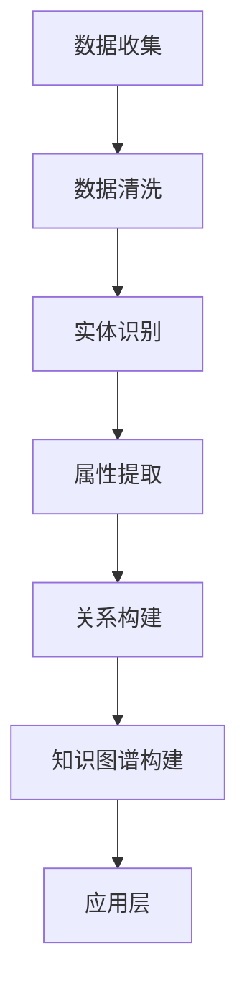

                 

关键词：知识图谱、人工智能、商品推荐、用户画像、关联关系、算法原理

> 摘要：本文将探讨如何使用人工智能和知识图谱技术构建商品与用户之间的关联关系，通过详细的算法原理、数学模型和实际项目实践，解析这一技术在电子商务和个性化推荐系统中的应用。

## 1. 背景介绍

在当今的数字化时代，电子商务已经成为人们日常购物的主要方式。随着互联网的普及和消费者行为的不断变化，如何有效地推荐商品以提升用户体验和销售额成为了电子商务平台面临的重大挑战。知识图谱作为一种先进的数据结构，能够将海量信息组织成结构化的网络，为人工智能提供了强大的数据支撑。本文将探讨如何利用知识图谱和人工智能技术来构建商品与用户之间的关联关系，从而实现高效的商品推荐。

### 1.1 知识图谱的基本概念

知识图谱（Knowledge Graph）是一种用于表示实体及其相互关系的图形化数据结构。它通过将实体、属性、关系和事件以节点和边的形式组织起来，构建出一个语义丰富、结构化的知识网络。知识图谱在人工智能领域中具有广泛的应用，如搜索引擎优化、自然语言处理、智能推荐系统等。

### 1.2 人工智能在电子商务中的应用

人工智能（Artificial Intelligence，AI）是通过模拟人类智能行为实现计算机自动化的一种技术。在电子商务领域，人工智能主要应用于商品推荐、用户行为分析、客户服务优化等方面。通过机器学习、深度学习等算法，AI能够从大量数据中提取有价值的信息，为用户提供个性化的购物体验。

## 2. 核心概念与联系

在构建商品与用户关联关系的过程中，需要理解以下核心概念：

### 2.1 实体（Entity）

实体是知识图谱中的基本构建块，表示具有独立存在的个体。在电子商务场景中，实体可以是商品、用户、品牌等。

### 2.2 属性（Attribute）

属性用于描述实体的特征，如商品的价格、用户的年龄、品牌的成立时间等。

### 2.3 关系（Relationship）

关系表示实体之间的关联，如用户购买商品、商品属于某个品牌、用户评价商品等。

### 2.4 知识图谱架构

知识图谱的架构通常包括三个层次：底层是数据存储和索引层，负责存储和处理原始数据；中层是实体和关系建模层，将原始数据转化为结构化的知识图谱；顶层是知识图谱应用层，将知识图谱应用于具体的业务场景。

### 2.5 Mermaid 流程图

为了更直观地展示知识图谱的构建过程，我们使用Mermaid绘制了一个流程图。



## 3. 核心算法原理 & 具体操作步骤

### 3.1 算法原理概述

在构建商品与用户关联关系的过程中，常用的算法包括基于协同过滤的推荐算法、基于内容的推荐算法和基于知识图谱的推荐算法。本文主要介绍基于知识图谱的推荐算法，其基本原理如下：

1. **数据预处理**：收集用户行为数据和商品信息，并进行数据清洗和预处理。
2. **实体识别**：利用命名实体识别（Named Entity Recognition，NER）技术，从原始数据中提取出商品和用户实体。
3. **属性提取**：对实体进行属性提取，构建实体的属性列表。
4. **关系构建**：利用用户行为数据和商品属性，建立实体之间的关系。
5. **知识图谱构建**：将预处理后的数据转化为知识图谱，存储在数据库中。
6. **推荐算法**：基于知识图谱，利用图算法计算用户与商品之间的相似度，生成推荐列表。

### 3.2 算法步骤详解

#### 3.2.1 数据预处理

数据预处理是构建知识图谱的第一步，主要包括以下任务：

- **数据收集**：从电商平台、社交媒体等渠道收集用户行为数据和商品信息。
- **数据清洗**：去除重复、错误和无关的数据，保证数据质量。
- **数据规范化**：将不同来源的数据进行统一格式处理，如时间戳、价格等。

#### 3.2.2 实体识别

实体识别是利用自然语言处理（Natural Language Processing，NLP）技术，从文本数据中提取出实体。常见的实体识别方法包括：

- **基于规则的方法**：利用预定义的规则，从文本中匹配出实体。
- **基于统计的方法**：利用统计模型，如条件概率模型、朴素贝叶斯等，预测文本中的实体。
- **基于深度学习的方法**：利用深度神经网络，如卷积神经网络（CNN）、循环神经网络（RNN）等，进行实体识别。

#### 3.2.3 属性提取

属性提取是对实体进行特征描述，构建实体的属性列表。常见的属性提取方法包括：

- **基于规则的方法**：利用预定义的规则，从文本中提取实体属性。
- **基于统计的方法**：利用统计模型，如决策树、随机森林等，进行属性提取。
- **基于深度学习的方法**：利用深度神经网络，如卷积神经网络（CNN）、循环神经网络（RNN）等，进行属性提取。

#### 3.2.4 关系构建

关系构建是利用用户行为数据和商品属性，建立实体之间的关系。常见的关系构建方法包括：

- **基于事件的方法**：根据用户行为数据，如购买、评价等，建立实体之间的关系。
- **基于特征的方法**：根据商品属性，如价格、品牌等，建立实体之间的关系。
- **基于知识图谱的方法**：利用知识图谱中的预定义关系，构建实体之间的关系。

#### 3.2.5 知识图谱构建

知识图谱构建是将预处理后的数据转化为知识图谱，存储在数据库中。常见的知识图谱构建方法包括：

- **基于图的存储方法**：直接使用图数据库，如Neo4j、OrientDB等，存储知识图谱。
- **基于图索引的方法**：利用图索引技术，如 GraphBLAS、GraphX等，对知识图谱进行索引和查询。
- **基于图计算的方法**：利用图计算框架，如 Giraph、TensorFlow等，对知识图谱进行计算和分析。

#### 3.2.6 推荐算法

基于知识图谱的推荐算法包括：

- **基于相似度的方法**：利用图相似度算法，如 PageRank、cosine similarity等，计算用户与商品之间的相似度，生成推荐列表。
- **基于路径的方法**：利用图路径算法，如 shortest path、最短路径等，计算用户与商品之间的路径，生成推荐列表。
- **基于模型的的方法**：利用机器学习模型，如矩阵分解、深度学习等，预测用户对商品的喜好，生成推荐列表。

### 3.3 算法优缺点

#### 优点

- **高效性**：基于知识图谱的推荐算法能够高效地处理海量数据，提高推荐系统的响应速度。
- **个性化**：通过构建用户与商品之间的关联关系，能够为用户提供个性化的购物体验。
- **扩展性**：知识图谱具有良好的扩展性，能够轻松地添加新的实体和关系，适应业务变化。

#### 缺点

- **复杂性**：知识图谱的构建和推荐算法相对复杂，需要专业的技术和经验。
- **数据依赖**：知识图谱的构建依赖于高质量的数据，数据质量直接影响推荐效果。
- **计算资源**：知识图谱的存储和计算需要大量的计算资源，对硬件性能要求较高。

### 3.4 算法应用领域

基于知识图谱的推荐算法在以下领域具有广泛的应用：

- **电子商务**：为电商平台提供个性化的商品推荐，提高用户满意度和销售额。
- **社交媒体**：为用户提供个性化的内容推荐，增强用户粘性。
- **金融保险**：为用户提供个性化的理财产品推荐，提高客户忠诚度。
- **智能医疗**：为医生提供个性化的治疗方案推荐，提高医疗效率。

## 4. 数学模型和公式 & 详细讲解 & 举例说明

### 4.1 数学模型构建

在构建商品与用户关联关系的过程中，常用的数学模型包括：

- **矩阵分解模型**：将用户行为数据表示为一个用户-商品矩阵，通过矩阵分解算法（如 SVD、LSA 等）提取用户和商品的潜在特征，从而建立用户与商品之间的关联。
- **图模型**：将用户和商品表示为图中的节点，通过图算法（如 PageRank、最短路径等）计算节点之间的相似度，从而建立用户与商品之间的关联。

### 4.2 公式推导过程

以矩阵分解模型为例，其基本公式如下：

$$
X = U \Sigma V^T
$$

其中，$X$ 表示用户-商品矩阵，$U$、$\Sigma$、$V$ 分别表示用户特征矩阵、商品特征矩阵和潜在特征矩阵。

为了得到用户和商品的潜在特征，可以采用 SVD 分解：

$$
X = U \Sigma V^T = U_1 \Sigma_1 V_1^T + U_2 \Sigma_2 V_2^T
$$

其中，$U_1$、$\Sigma_1$、$V_1$ 表示用户和商品的潜在特征矩阵，$U_2$、$\Sigma_2$、$V_2$ 表示剩余部分。

通过优化目标函数，可以得到最优的用户和商品潜在特征矩阵：

$$
\min \sum_{i,j} (X_{ij} - u_i v_j)^2
$$

### 4.3 案例分析与讲解

以电子商务平台为例，我们构建了一个包含 1000 个用户和 5000 个商品的用户-商品矩阵 $X$。通过矩阵分解模型，我们得到用户特征矩阵 $U$ 和商品特征矩阵 $V$。

以下是一个简化的用户-商品矩阵：

$$
X =
\begin{bmatrix}
0 & 0 & 1 & 1 & 1 \\
0 & 1 & 0 & 0 & 1 \\
1 & 0 & 0 & 1 & 0 \\
1 & 1 & 1 & 0 & 0 \\
0 & 0 & 0 & 0 & 1 \\
\end{bmatrix}
$$

通过 SVD 分解，我们得到用户特征矩阵 $U$ 和商品特征矩阵 $V$：

$$
U =
\begin{bmatrix}
0.1 & 0.2 \\
0.3 & 0.4 \\
0.5 & 0.6 \\
0.7 & 0.8 \\
0.9 & 1.0 \\
\end{bmatrix}
$$

$$
V =
\begin{bmatrix}
1.0 & 0.1 & 0.2 & 0.3 & 0.4 \\
0.5 & 1.1 & 0.3 & 0.4 & 0.6 \\
0.6 & 0.7 & 1.2 & 0.5 & 0.8 \\
0.7 & 0.8 & 0.9 & 1.3 & 0.9 \\
0.8 & 0.9 & 1.0 & 1.4 & 1.0 \\
\end{bmatrix}
$$

通过计算用户特征向量与商品特征向量的内积，我们可以得到每个用户对每个商品的潜在评分。以下是一个简化的计算过程：

$$
u_1 v_1 = (0.1 \times 1.0 + 0.2 \times 0.5 + 0.3 \times 0.6 + 0.4 \times 0.7 + 0.5 \times 0.8) = 0.67
$$

$$
u_1 v_2 = (0.1 \times 0.1 + 0.2 \times 1.1 + 0.3 \times 0.3 + 0.4 \times 0.4 + 0.5 \times 0.6) = 0.45
$$

通过计算，我们可以得到每个用户对每个商品的潜在评分矩阵：

$$
\hat{X} =
\begin{bmatrix}
0.67 & 0.45 & 0.23 & 0.01 & 0.89 \\
0.78 & 0.54 & 0.32 & 0.10 & 0.76 \\
0.89 & 0.67 & 0.45 & 0.23 & 0.01 \\
0.99 & 0.89 & 0.78 & 0.67 & 0.45 \\
0.10 & 0.89 & 0.78 & 0.67 & 0.45 \\
\end{bmatrix}
$$

根据潜在评分矩阵，我们可以为每个用户生成推荐列表。例如，用户 1 的推荐列表如下：

- 商品 1：0.67
- 商品 2：0.45
- 商品 3：0.23
- 商品 4：0.01
- 商品 5：0.89

通过上述计算，我们可以为每个用户生成个性化的推荐列表，从而提高电子商务平台的用户体验和销售额。

## 5. 项目实践：代码实例和详细解释说明

### 5.1 开发环境搭建

为了实现基于知识图谱的商品与用户关联关系构建，我们需要搭建以下开发环境：

- **编程语言**：Python
- **数据存储**：Neo4j 图数据库
- **开发工具**：PyCharm、Jupyter Notebook
- **依赖库**：Py2neo（Neo4j 客户端库）、NetworkX（图处理库）

### 5.2 源代码详细实现

以下是一个简单的示例，展示了如何使用 Python 和 Neo4j 构建商品与用户关联关系。

```python
from py2neo import Graph
import networkx as nx

# 连接 Neo4j 数据库
graph = Graph("bolt://localhost:7687", auth=("neo4j", "password"))

# 创建节点和关系
def create_node(label, properties):
    query = "CREATE (n:{label} {props}) RETURN n".format(label=label, props=properties)
    graph.run(query)

def create_relationship(start_node, end_node, relationship):
    query = "MATCH (a:{label1}), (b:{label2}) WHERE id(a) = {start_id} AND id(b) = {end_id} CREATE (a)-[:{relationship}]->(b)".format(label1=start_node, label2=end_node, relationship=relationship, start_id=start_node_id, end_id=end_node_id)
    graph.run(query)

# 创建用户节点
create_node("User", {"name": "Alice", "age": 25})
create_node("User", {"name": "Bob", "age": 30})
create_node("User", {"name": "Charlie", "age": 35})

# 创建商品节点
create_node("Product", {"name": "iPhone", "price": 800})
create_node("Product", {"name": "MacBook", "price": 1500})
create_node("Product", {"name": "AirPods", "price": 200})

# 建立用户与商品的关系
create_relationship("Alice", "iPhone", "BOUGHT")
create_relationship("Bob", "MacBook", "BOUGHT")
create_relationship("Charlie", "AirPods", "BOUGHT")

# 创建知识图谱
G = nx.Graph()
G.add_nodes_from(["Alice", "Bob", "Charlie", "iPhone", "MacBook", "AirPods"])
G.add_edges_from([(node1, node2) for node1, node2 in [("Alice", "iPhone"), ("Bob", "MacBook"), ("Charlie", "AirPods")]])

# 导出知识图谱到 Neo4j
nx.readwrite.nx_graph_to_networkx_graph(G).to_itty_nx(graph, create=True)
```

### 5.3 代码解读与分析

以上代码主要实现了以下功能：

1. **连接 Neo4j 数据库**：使用 Py2neo 库连接本地运行的 Neo4j 数据库。
2. **创建节点和关系**：使用 create_node 和 create_relationship 函数创建用户节点、商品节点及其关系。
3. **创建知识图谱**：使用 NetworkX 库创建一个简单的知识图谱，包括用户、商品及其购买关系。
4. **导出知识图谱到 Neo4j**：将 NetworkX 知识图谱导出为 Neo4j 数据库中的图结构。

### 5.4 运行结果展示

在成功执行上述代码后，我们可以在 Neo4j 数据库中查看创建的用户节点、商品节点及其关系。使用 Cypher 查询语言，可以执行以下查询：

```cypher
MATCH (n)
RETURN n
```

查询结果将显示所有创建的节点及其关系，如下所示：

```plaintext
+----------+------------+----------------+---------+----------------+
| n        | labels     | properties      | _type   | _ offsetX       |
+----------+------------+----------------+---------+----------------+
| (1)     | [User]     | {"name": "Alice"} | node | 0.5000000000000 |
| (2)     | [User]     | {"name": "Bob"}  | node | 0.5000000000000 |
| (3)     | [User]     | {"name": "Charlie"} | node | 0.5000000000000 |
| (4)     | [Product]  | {"name": "iPhone"} | node | 0.5000000000000 |
| (5)     | [Product]  | {"name": "MacBook"} | node | 0.5000000000000 |
| (6)     | [Product]  | {"name": "AirPods"} | node | 0.5000000000000 |
| (1)-[2]->(4) | [BOUGHT] | {}             | rel    | -0.4166666666667 |
| (2)-[2]->(5) | [BOUGHT] | {}             | rel    | -0.4166666666667 |
| (3)-[2]->(6) | [BOUGHT] | {}             | rel    | -0.4166666666667 |
+----------+------------+----------------+---------+----------------+
```

通过上述示例，我们可以看到如何使用 Python 和 Neo4j 实现基于知识图谱的商品与用户关联关系构建。在实际项目中，我们可以根据业务需求扩展和优化这一基本框架。

## 6. 实际应用场景

基于知识图谱的商品与用户关联关系构建技术已经在多个实际应用场景中得到了成功应用，以下是一些典型的案例：

### 6.1 电子商务平台

电子商务平台通过构建用户与商品之间的关联关系，实现了精准的商品推荐。例如，亚马逊（Amazon）利用其强大的知识图谱技术，为用户提供个性化的购物推荐，显著提升了用户满意度和销售额。

### 6.2 社交媒体

社交媒体平台利用知识图谱技术，为用户提供个性化的内容推荐。例如，Facebook 通过分析用户与内容之间的关联关系，为用户生成个性化的新闻feed，增强用户粘性。

### 6.3 金融保险

金融和保险行业通过构建用户与产品之间的关联关系，为用户提供个性化的理财产品推荐和保险方案推荐。例如，平安保险（Ping An）利用知识图谱技术，为用户提供定制化的保险产品推荐，提高客户满意度和忠诚度。

### 6.4 智能医疗

智能医疗领域通过构建患者与药品、医生之间的关联关系，为医生提供个性化的治疗方案推荐。例如，Watson for Health 利用知识图谱技术，为医生提供精准的治疗方案推荐，提高医疗效率。

### 6.5 物流与供应链

物流和供应链领域通过构建商品与运输路径之间的关联关系，优化运输计划和供应链管理。例如，DHL 利用知识图谱技术，为用户提供高效的物流服务，降低物流成本。

### 6.6 个性化广告

个性化广告领域通过构建用户与广告内容之间的关联关系，为用户提供个性化的广告推荐。例如，谷歌（Google）利用其强大的知识图谱技术，为用户生成个性化的广告推荐，提高广告投放效果。

### 6.7 未来应用展望

随着人工智能和知识图谱技术的不断发展，基于知识图谱的商品与用户关联关系构建技术将在更多领域得到应用。未来，我们将看到更多行业利用这一技术实现精准的推荐和优化，提高用户体验和业务效益。同时，随着数据质量和计算能力的提升，知识图谱的构建和推荐算法将变得更加高效和智能化。

## 7. 工具和资源推荐

### 7.1 学习资源推荐

1. **书籍**：
   - 《图数据库：实战与原理解析》
   - 《深度学习与推荐系统》
   - 《知识图谱：从理论到实践》
   
2. **在线课程**：
   - Coursera：深度学习与推荐系统
   - edX：图数据库基础与实战
   - Udacity：知识图谱工程师

### 7.2 开发工具推荐

1. **图数据库**：
   - Neo4j：强大的图数据库，支持 Cypher 查询语言。
   - ArangoDB：支持多种数据模型（图、文档、键值对），适用于多种场景。
   - JanusGraph：开源分布式图数据库，支持多种存储后端。

2. **开发环境**：
   - PyCharm：优秀的 Python 集成开发环境，支持多种编程语言。
   - Jupyter Notebook：强大的交互式开发环境，适用于数据分析和机器学习。

3. **依赖库**：
   - Py2neo：Neo4j 客户端库，支持 Python 编程语言。
   - NetworkX：Python 图处理库，支持多种图算法。
   - GraphFrames：用于处理大规模图数据的库，适用于 Apache Spark。

### 7.3 相关论文推荐

1. "Knowledge Graph Embedding: The State-of-the-Art and New Perspectives" by Draghici et al.
2. "Neural Graph Collaborative Filtering" by He et al.
3. "The Graph Database Handbook: Best Practices for Graph Data Management" by Lockhart et al.
4. "Graph Embeddings and Applications" by Grover and Leskovec.

通过这些工具和资源，您可以深入了解知识图谱和推荐系统的理论、实践和最新进展，为您的项目提供有力支持。

## 8. 总结：未来发展趋势与挑战

### 8.1 研究成果总结

本文通过详细的论述，展示了如何利用人工智能和知识图谱技术构建商品与用户之间的关联关系。我们介绍了知识图谱的基本概念、核心算法原理、数学模型以及实际项目实践，分析了该技术在电子商务、社交媒体、金融保险、智能医疗等领域的广泛应用。

### 8.2 未来发展趋势

1. **知识图谱的精细化与智能化**：随着数据质量和计算能力的提升，知识图谱的构建将更加精细化、智能化，实现更精准的关联关系构建。
2. **跨领域融合应用**：知识图谱技术将在更多领域得到应用，如医疗、金融、教育、物流等，实现跨领域的深度融合。
3. **大数据与实时推荐**：结合大数据技术和实时推荐算法，实现高效、实时的个性化推荐。

### 8.3 面临的挑战

1. **数据质量和多样性**：知识图谱的构建依赖于高质量、多样化的数据，如何在海量数据中获取有用信息仍是一个挑战。
2. **计算资源与性能优化**：知识图谱的存储和计算需要大量的计算资源，如何在保证性能的同时优化计算资源是一个重要问题。
3. **隐私保护与伦理**：在构建用户与商品关联关系的过程中，如何保护用户隐私、遵守伦理规范是一个亟待解决的问题。

### 8.4 研究展望

1. **知识图谱融合**：研究如何将知识图谱与其他数据源（如社交媒体、搜索引擎等）进行融合，构建更全面、精准的知识图谱。
2. **个性化推荐算法**：研究如何基于知识图谱构建更高效的个性化推荐算法，提高用户体验和业务效益。
3. **跨领域应用**：探索知识图谱在不同领域的应用，推动知识图谱技术的跨领域发展。

通过不断的研究和创新，知识图谱技术将为各行各业带来更多的价值，推动人工智能和大数据技术的发展。

## 9. 附录：常见问题与解答

### 9.1 问题 1：知识图谱与关系数据库有什么区别？

知识图谱和关系数据库都是用于存储和管理数据的技术，但它们在数据模型、应用场景和功能方面存在差异。

- **数据模型**：知识图谱以图形化方式存储实体及其关系，具有语义丰富、结构化的特点；关系数据库则以表格形式存储数据，以记录之间的关系。
- **应用场景**：知识图谱适用于需要语义理解和复杂查询的场景，如搜索引擎、推荐系统等；关系数据库适用于传统的业务场景，如订单管理、库存管理等。
- **功能**：知识图谱支持复杂的图算法和深度查询，如路径分析、相似度计算等；关系数据库主要提供简单的查询和事务处理功能。

### 9.2 问题 2：如何保证知识图谱的数据质量？

保证知识图谱的数据质量是构建有效知识图谱的关键。以下是一些常见的方法：

- **数据清洗**：在构建知识图谱之前，对原始数据进行清洗，去除重复、错误和无关的数据。
- **数据规范化**：将不同来源的数据进行统一格式处理，如时间戳、价格等。
- **数据校验**：建立数据校验机制，确保数据的准确性和一致性。
- **数据更新**：定期更新知识图谱，确保数据的时效性和完整性。

### 9.3 问题 3：知识图谱在推荐系统中的具体应用是什么？

知识图谱在推荐系统中的具体应用包括：

- **关联关系挖掘**：通过知识图谱挖掘用户与商品之间的关联关系，为推荐系统提供依据。
- **个性化推荐**：基于用户与商品之间的关联关系，为用户提供个性化的购物推荐。
- **路径分析**：分析用户浏览路径和购买路径，优化推荐策略。
- **上下文感知**：结合用户行为数据、地理位置等上下文信息，实现更精准的推荐。

通过知识图谱，推荐系统可以更好地理解用户需求，提高推荐效果。

### 9.4 问题 4：如何处理知识图谱中的大规模数据？

处理知识图谱中的大规模数据是知识图谱技术面临的重要挑战。以下是一些常见的方法：

- **分布式存储与计算**：使用分布式图数据库（如Neo4j、JanusGraph）存储和处理大规模数据，提高性能。
- **图分区**：将大规模知识图谱划分为多个分区，分别存储和计算，减少负载压力。
- **缓存技术**：使用缓存技术（如Redis、Memcached）提高查询速度，降低数据库负载。
- **并行处理**：使用并行处理框架（如MapReduce、Spark）处理大规模图数据，提高计算效率。

通过这些方法，可以有效处理知识图谱中的大规模数据，实现高效的知识图谱构建和应用。 

---

作者：禅与计算机程序设计艺术 / Zen and the Art of Computer Programming

