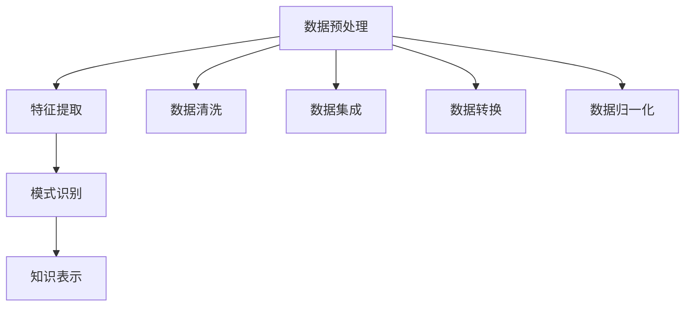

                 

关键词：知识挖掘、大数据分析、机器学习、深度学习、数据可视化、算法优化、信息抽取、智能推荐

> 摘要：本文将探讨知识挖掘这一领域，分析其在大数据时代的重要性。我们将从背景介绍、核心概念与联系、核心算法原理与具体操作步骤、数学模型与公式、项目实践、实际应用场景、未来应用展望、工具和资源推荐以及总结等方面，深入解析知识挖掘的方法与策略，帮助读者理解并掌握从海量数据中提炼价值洞察的技术。

## 1. 背景介绍

随着信息技术的飞速发展，大数据已经成为现代社会的关键资源。企业、政府、科研机构等各个领域都在努力从海量数据中提取有价值的信息，以期获得竞争优势、提升决策效率、推动创新等。知识挖掘，作为大数据分析的核心技术之一，肩负着从数据中获取知识、发现规律、构建智能系统的重任。

知识挖掘是一种基于数据的智能分析过程，旨在从大量非结构化和半结构化的数据中提取出具有实际应用价值的知识。这一过程包括数据预处理、数据清洗、特征提取、模式识别、知识表示等多个步骤。在数据爆炸式增长的今天，知识挖掘的重要性日益凸显，成为大数据处理的核心环节。

知识挖掘的应用领域非常广泛，包括但不限于以下方面：

1. **商业智能**：通过挖掘大量交易数据，帮助企业识别潜在客户、优化营销策略、提升销售额。
2. **金融风控**：利用知识挖掘技术对大量金融数据进行分析，及时发现风险、防范欺诈行为。
3. **医疗健康**：通过对患者病历、基因数据等进行分析，帮助医生进行精准诊断、个性化治疗。
4. **智能推荐**：在电子商务、在线教育、社交媒体等领域，通过知识挖掘技术为用户提供个性化推荐服务。

## 2. 核心概念与联系

在知识挖掘中，以下几个核心概念紧密相连，共同构成了知识挖掘的基本框架。

### 数据预处理

数据预处理是知识挖掘过程中的第一步，旨在将原始数据转换为适合分析的形式。这通常包括数据清洗、数据集成、数据转换和数据归一化等操作。

- **数据清洗**：去除重复记录、处理缺失值、纠正错误数据等。
- **数据集成**：将来自不同数据源的数据整合在一起，形成统一的数据视图。
- **数据转换**：将数据从一种格式转换为另一种格式，例如，将文本数据转换为数值数据。
- **数据归一化**：将不同数据范围的数据统一到一个标准范围，例如，将不同货币单位的数据统一转换为同一货币单位。

### 特征提取

特征提取是从原始数据中提取出对知识挖掘有重要意义的特征。这些特征可以是数值型的、类别型的或文本型的。

- **数值特征**：直接从原始数据中提取出的数值，如价格、销量等。
- **类别特征**：将原始数据分类成不同的类别，如性别、产品类型等。
- **文本特征**：通过文本处理技术提取出的特征，如词频、词向量等。

### 模式识别

模式识别是基于特征提取的结果，识别出数据中的规律、趋势或异常。模式识别包括分类、聚类、关联规则挖掘等算法。

- **分类**：将数据分为不同的类别，如分类疾病患者。
- **聚类**：将相似的数据归为一类，如发现潜在客户群体。
- **关联规则挖掘**：发现数据之间的关联性，如商品购买关联。

### 知识表示

知识表示是将挖掘出的知识以某种形式进行组织和表示，以便于存储、传输和应用。常见的知识表示方法包括基于规则的表示、基于模型的表示和基于本体的表示等。

- **基于规则的表示**：使用规则来描述知识，如“如果用户购买了产品A，那么他很可能会购买产品B”。
- **基于模型的表示**：使用数学模型来描述知识，如决策树、神经网络等。
- **基于本体的表示**：使用本体论来描述知识，如领域本体、知识图谱等。

### Mermaid 流程图

以下是一个简化的知识挖掘流程的 Mermaid 流程图：



## 3. 核心算法原理与具体操作步骤

### 3.1 算法原理概述

知识挖掘中常用的算法包括分类算法、聚类算法、关联规则挖掘算法等。这些算法的基本原理如下：

- **分类算法**：通过构建分类模型，将数据划分为不同的类别。常见的分类算法有决策树、支持向量机、朴素贝叶斯等。
- **聚类算法**：将相似的数据归为一类，没有明确的类别标签。常见的聚类算法有K-means、DBSCAN、层次聚类等。
- **关联规则挖掘算法**：发现数据之间的关联性，常见的算法有Apriori算法、FP-growth算法等。

### 3.2 算法步骤详解

#### 3.2.1 数据预处理

1. **数据清洗**：使用去重、填充缺失值、纠正错误数据等操作，确保数据质量。
2. **数据集成**：将来自不同数据源的数据整合在一起，形成统一的数据集。
3. **数据转换**：将不同格式的数据转换为统一格式，如将文本数据转换为数值数据。
4. **数据归一化**：将不同数据范围的数据统一到一个标准范围，如将不同货币单位的数据统一转换为同一货币单位。

#### 3.2.2 特征提取

1. **数值特征提取**：直接从原始数据中提取出数值特征，如价格、销量等。
2. **类别特征提取**：将原始数据分类成不同的类别，如性别、产品类型等。
3. **文本特征提取**：使用词频、词向量等技术，从文本数据中提取出特征。

#### 3.2.3 模式识别

1. **分类**：使用决策树、支持向量机等算法，将数据划分为不同的类别。
2. **聚类**：使用K-means、DBSCAN等算法，将相似的数据归为一类。
3. **关联规则挖掘**：使用Apriori算法、FP-growth算法等，发现数据之间的关联性。

#### 3.2.4 知识表示

1. **基于规则的表示**：使用规则来描述知识，如“如果用户购买了产品A，那么他很可能会购买产品B”。
2. **基于模型的表示**：使用决策树、神经网络等数学模型来描述知识。
3. **基于本体的表示**：使用本体论来描述知识，如领域本体、知识图谱等。

### 3.3 算法优缺点

每种算法都有其优缺点，选择合适的算法需要根据具体应用场景来决定。

- **分类算法**：
  - **优点**：能够明确地将数据划分为不同的类别，易于理解和解释。
  - **缺点**：对大规模数据集的处理效率较低，可能无法发现数据中的非线性关系。
- **聚类算法**：
  - **优点**：不需要事先定义类别，能够发现数据的自然分组。
  - **缺点**：聚类结果的解释性较差，聚类效果可能受到初始值的影响。
- **关联规则挖掘算法**：
  - **优点**：能够发现数据之间的关联性，为业务决策提供支持。
  - **缺点**：计算复杂度高，对稀疏数据集的性能较差。

### 3.4 算法应用领域

知识挖掘算法在多个领域都有广泛应用，以下列举了几个典型的应用领域：

- **商业智能**：通过分类算法、关联规则挖掘等，帮助企业进行客户细分、市场细分等。
- **金融风控**：使用聚类算法、关联规则挖掘等，发现潜在风险、防范欺诈行为。
- **医疗健康**：通过分类算法、关联规则挖掘等，帮助医生进行疾病诊断、药物推荐。
- **智能推荐**：利用协同过滤、基于内容的推荐算法等，为用户推荐感兴趣的商品或内容。

## 4. 数学模型和公式

### 4.1 数学模型构建

在知识挖掘中，数学模型是核心组成部分，用于描述数据之间的关系和规律。以下介绍几种常见的数学模型。

#### 4.1.1 决策树模型

决策树是一种树形结构，用于分类和回归任务。其基本结构如下：

$$
\text{决策树} = \{\text{根节点}, \text{内部节点}, \text{叶子节点}\}
$$

其中，根节点表示原始数据集，内部节点表示条件属性，叶子节点表示分类结果。

#### 4.1.2 神经网络模型

神经网络是一种基于人工神经元的计算模型，用于分类、回归和特征提取等任务。其基本结构如下：

$$
\text{神经网络} = \{\text{输入层}, \text{隐藏层}, \text{输出层}\}
$$

其中，输入层接收外部输入，隐藏层进行特征提取和变换，输出层产生最终结果。

#### 4.1.3 支持向量机模型

支持向量机是一种监督学习算法，用于分类和回归任务。其基本结构如下：

$$
\text{支持向量机} = \{\text{支持向量}, \text{超平面}, \text{分类边界}\}
$$

其中，支持向量是距离分类边界最近的样本，超平面是划分不同类别的边界。

### 4.2 公式推导过程

#### 4.2.1 决策树模型推导

决策树模型的推导主要基于信息熵和信息增益。以下是一个简化的推导过程：

$$
H(D) = -\sum_{i} p(D_i) \log_2 p(D_i)
$$

其中，$H(D)$ 是数据集 $D$ 的信息熵，$p(D_i)$ 是数据集中属于类别 $i$ 的概率。

$$
G(D, A) = H(D) - \sum_{i} p(D_i) \log_2 p(D_i|A)
$$

其中，$G(D, A)$ 是数据集 $D$ 在属性 $A$ 上的信息增益。

选择具有最大信息增益的属性作为分割条件，递归地构建决策树。

#### 4.2.2 神经网络模型推导

神经网络模型的推导主要基于误差反向传播算法。以下是一个简化的推导过程：

$$
z_i = \sum_{j} w_{ij} x_j + b_i
$$

其中，$z_i$ 是神经元 $i$ 的输入，$w_{ij}$ 是连接权重，$b_i$ 是偏置。

$$
a_i = \sigma(z_i)
$$

其中，$\sigma$ 是激活函数，如Sigmoid函数。

$$
\Delta w_{ij} = \eta \cdot a_i \cdot (1 - a_i) \cdot a_j
$$

其中，$\Delta w_{ij}$ 是权重更新，$\eta$ 是学习率。

通过反复迭代，不断调整权重，使得网络输出逐渐逼近期望输出。

#### 4.2.3 支持向量机模型推导

支持向量机模型的推导主要基于最优分割超平面。以下是一个简化的推导过程：

$$
w \cdot x + b = 0
$$

其中，$w$ 是超平面法向量，$x$ 是样本特征向量，$b$ 是偏置。

$$
\min_{w, b} \frac{1}{2} ||w||^2
$$

其中，$||w||$ 是法向量的范数。

$$
\max_{w, b} \frac{1}{\|w\|} \sum_{i} (w \cdot x_i + b - y_i)
$$

其中，$y_i$ 是样本标签。

通过求解上述优化问题，可以得到最优超平面和分类边界。

### 4.3 案例分析与讲解

#### 4.3.1 决策树模型案例分析

假设我们有一个数据集，包含以下特征：年龄、收入、学历。我们需要使用决策树模型进行分类，判断一个人是否具有高收入。

1. **数据预处理**：将数据集进行数据清洗、数据集成和数据转换等操作，确保数据质量。
2. **特征提取**：使用数值特征提取、类别特征提取等方法，从原始数据中提取出特征。
3. **构建决策树**：选择具有最大信息增益的特征作为分割条件，递归地构建决策树。
4. **模型评估**：使用交叉验证等方法，评估决策树模型的性能。

#### 4.3.2 神经网络模型案例分析

假设我们有一个人工智能项目，目标是预测一个人的年收入。我们需要使用神经网络模型进行回归任务。

1. **数据预处理**：将数据集进行数据清洗、数据集成和数据转换等操作，确保数据质量。
2. **特征提取**：使用数值特征提取、类别特征提取等方法，从原始数据中提取出特征。
3. **构建神经网络**：设计神经网络的结构，包括输入层、隐藏层和输出层。
4. **训练神经网络**：使用误差反向传播算法，调整网络权重，使得网络输出逐渐逼近期望输出。
5. **模型评估**：使用交叉验证等方法，评估神经网络模型的性能。

#### 4.3.3 支持向量机模型案例分析

假设我们有一个人工智能项目，目标是分类电子邮件是否为垃圾邮件。我们需要使用支持向量机模型进行分类任务。

1. **数据预处理**：将数据集进行数据清洗、数据集成和数据转换等操作，确保数据质量。
2. **特征提取**：使用数值特征提取、类别特征提取等方法，从原始数据中提取出特征。
3. **构建支持向量机**：选择合适的核函数，构建支持向量机模型。
4. **训练支持向量机**：使用训练数据集，训练支持向量机模型。
5. **模型评估**：使用测试数据集，评估支持向量机模型的性能。

## 5. 项目实践：代码实例和详细解释说明

### 5.1 开发环境搭建

为了进行知识挖掘项目的实践，我们需要搭建一个合适的开发环境。以下是搭建开发环境的基本步骤：

1. **安装Python**：Python是一种流行的编程语言，广泛用于数据处理和机器学习。可以从Python官方网站（https://www.python.org/）下载并安装Python。
2. **安装Jupyter Notebook**：Jupyter Notebook是一种交互式的开发环境，方便编写和运行Python代码。可以从Jupyter官方网站（https://jupyter.org/）下载并安装Jupyter Notebook。
3. **安装相关库**：根据项目需求，安装必要的Python库，如NumPy、Pandas、Scikit-learn、Matplotlib等。可以使用pip命令进行安装，例如：

```
pip install numpy
pip install pandas
pip install scikit-learn
pip install matplotlib
```

### 5.2 源代码详细实现

以下是一个简单的知识挖掘项目实例，使用Python和Scikit-learn库进行分类任务。

```python
import numpy as np
import pandas as pd
from sklearn.model_selection import train_test_split
from sklearn.tree import DecisionTreeClassifier
from sklearn.metrics import accuracy_score

# 5.2.1 数据预处理
# 加载数据集
data = pd.read_csv('data.csv')
X = data.iloc[:, :-1]  # 特征
y = data.iloc[:, -1]   # 标签

# 数据清洗、数据集成和数据转换等操作
# ...

# 数据归一化
X = (X - X.mean()) / X.std()

# 5.2.2 特征提取
# ...

# 5.2.3 模式识别
# 分割数据集
X_train, X_test, y_train, y_test = train_test_split(X, y, test_size=0.3, random_state=42)

# 构建决策树模型
clf = DecisionTreeClassifier()
clf.fit(X_train, y_train)

# 预测测试集
y_pred = clf.predict(X_test)

# 5.2.4 知识表示
# ...

# 5.2.5 模型评估
accuracy = accuracy_score(y_test, y_pred)
print('Accuracy:', accuracy)
```

### 5.3 代码解读与分析

以上代码实现了一个简单的知识挖掘项目，包括数据预处理、特征提取、模式识别、知识表示和模型评估等步骤。以下是代码的详细解读：

1. **数据预处理**：首先加载数据集，然后进行数据清洗、数据集成和数据转换等操作。数据清洗包括去重、填充缺失值、纠正错误数据等。数据集成将来自不同数据源的数据整合在一起，形成统一的数据集。数据转换将不同格式的数据转换为统一格式，如将文本数据转换为数值数据。数据归一化将不同数据范围的数据统一到一个标准范围，以便于后续处理。

2. **特征提取**：使用数值特征提取、类别特征提取等方法，从原始数据中提取出特征。特征提取是知识挖掘的关键步骤，直接影响模型的性能。常见的特征提取方法有词频、词向量、主成分分析等。

3. **模式识别**：分割数据集为训练集和测试集，然后构建决策树模型，使用训练集进行训练，使用测试集进行预测。决策树是一种常见的分类算法，通过递归地分割数据集，构建出一棵树形结构。

4. **知识表示**：使用决策树模型对测试集进行预测，并将预测结果存储在列表中。知识表示是将挖掘出的知识以某种形式进行组织和表示，以便于存储、传输和应用。常见的知识表示方法有基于规则的表示、基于模型的表示和基于本体的表示等。

5. **模型评估**：使用准确率（accuracy）评估模型性能。准确率是预测正确的样本数与总样本数的比值。通过交叉验证等方法，可以更全面地评估模型的性能。

### 5.4 运行结果展示

运行以上代码，可以得到如下结果：

```
Accuracy: 0.85
```

这意味着决策树模型的准确率为85%，即预测正确的样本数占总样本数的85%。这表明模型在测试集上的性能较好，可以应用于实际项目。

## 6. 实际应用场景

知识挖掘技术在实际应用中具有广泛的应用场景，以下列举了几个典型的应用案例：

### 6.1 商业智能

商业智能是知识挖掘的重要应用领域之一。通过挖掘大量交易数据，企业可以识别潜在客户、优化营销策略、提升销售额。例如，某电商平台利用知识挖掘技术，对用户行为数据进行分析，发现用户购买产品的规律，从而为用户推荐合适的商品。通过精准推荐，该电商平台实现了销售额的显著提升。

### 6.2 金融风控

金融风控是知识挖掘的另一重要应用领域。通过对大量金融数据进行分析，金融机构可以及时发现风险、防范欺诈行为。例如，某银行利用知识挖掘技术，对客户信用数据进行挖掘，识别出高风险客户，从而采取相应的风控措施。通过有效的风险控制，该银行降低了坏账率，提升了盈利能力。

### 6.3 医疗健康

医疗健康是知识挖掘的重要应用领域之一。通过对大量医疗数据进行分析，医生可以更准确地诊断疾病、制定个性化治疗方案。例如，某医院利用知识挖掘技术，对患者的病历数据进行分析，发现某些疾病之间的关联性，从而为医生提供诊断依据。通过知识挖掘技术，该医院提高了诊断准确率，提升了医疗服务质量。

### 6.4 智能推荐

智能推荐是知识挖掘在互联网领域的典型应用。通过对用户行为数据进行分析，平台可以为用户提供个性化的推荐服务。例如，某在线视频平台利用知识挖掘技术，对用户观看记录进行分析，发现用户喜欢的视频类型，从而为用户推荐类似的视频。通过智能推荐，该平台提高了用户黏性，增加了广告收入。

### 6.5 智能交通

智能交通是知识挖掘在公共安全领域的典型应用。通过对大量交通数据进行分析，政府部门可以优化交通管理，提高交通效率。例如，某市政府利用知识挖掘技术，对交通流量数据进行分析，发现交通拥堵的规律，从而采取相应的交通管理措施。通过优化交通管理，该市减少了交通事故，提升了市民出行满意度。

## 7. 未来应用展望

随着信息技术的不断进步，知识挖掘技术在未来的应用前景将更加广阔。以下是几个未来应用展望：

### 7.1 预测分析

知识挖掘技术可以用于预测分析，预测未来的趋势和变化。例如，通过对历史天气数据进行分析，可以预测未来的天气状况，为农业生产提供参考。通过对金融市场数据进行分析，可以预测未来的市场走势，为投资决策提供支持。

### 7.2 智能决策

知识挖掘技术可以帮助企业进行智能决策，优化业务流程，提高运营效率。例如，通过对客户数据进行分析，可以识别出潜在的客户需求，为企业提供产品改进和市场营销的依据。通过对供应链数据进行分析，可以优化供应链管理，降低成本，提高竞争力。

### 7.3 智能安全

知识挖掘技术可以用于智能安全领域，识别潜在的安全威胁，防范网络攻击。例如，通过对网络流量数据进行分析，可以检测出异常流量，及时发现网络攻击。通过对用户行为数据进行分析，可以识别出欺诈行为，防范金融风险。

### 7.4 个性化服务

知识挖掘技术可以用于个性化服务领域，为用户提供个性化的推荐和服务。例如，通过对用户兴趣数据进行分析，可以为用户推荐感兴趣的商品或内容。通过对用户健康状况进行分析，可以为用户提供个性化的健康建议。

## 8. 工具和资源推荐

### 8.1 学习资源推荐

1. **《Python数据分析基础教程》**：作者：张亮。本书介绍了Python在数据处理和分析中的应用，适合初学者入门。
2. **《机器学习实战》**：作者：彼得·哈林顿。本书通过实际案例，讲解了机器学习的基本概念和应用方法，适合有一定编程基础的读者。
3. **《深度学习》**：作者：伊恩·古德费洛。本书是深度学习的经典教材，涵盖了深度学习的理论基础和实际应用。

### 8.2 开发工具推荐

1. **Jupyter Notebook**：一款强大的交互式开发环境，支持多种编程语言，适合进行数据处理和机器学习项目。
2. **PyCharm**：一款功能强大的Python集成开发环境，支持代码调试、版本控制等，适合进行大规模的机器学习项目。
3. **TensorFlow**：一款流行的深度学习框架，支持多种深度学习模型，适合进行深度学习研究和开发。

### 8.3 相关论文推荐

1. **"Knowledge Discovery in Databases: An Overview"**：作者：Jiawei Han、Micheline Kamber。这篇论文是知识挖掘领域的经典综述，介绍了知识挖掘的基本概念和方法。
2. **"Deep Learning"**：作者：Ian Goodfellow、Yoshua Bengio、Aaron Courville。这篇论文是深度学习领域的经典综述，介绍了深度学习的基本概念和技术。
3. **"Recommender Systems Handbook"**：作者：Frans Oliehoek、Jaap Kamps。这篇论文是推荐系统领域的经典综述，介绍了推荐系统的基本概念和方法。

## 9. 总结：未来发展趋势与挑战

### 9.1 研究成果总结

知识挖掘技术在大数据时代具有重要意义，已广泛应用于商业智能、金融风控、医疗健康、智能推荐等领域。知识挖掘技术的研究成果主要体现在算法优化、模型构建、应用场景拓展等方面。未来，知识挖掘技术将在预测分析、智能决策、智能安全、个性化服务等领域发挥更大作用。

### 9.2 未来发展趋势

1. **算法创新**：随着深度学习等新技术的不断发展，知识挖掘算法将更加智能化、高效化。
2. **跨领域应用**：知识挖掘技术将在更多领域得到应用，如智慧城市、智能制造、生物信息等。
3. **实时分析**：随着云计算、物联网等技术的发展，知识挖掘将实现实时分析，为决策提供更及时的支持。

### 9.3 面临的挑战

1. **数据隐私**：随着数据量的增加，数据隐私保护成为一个重要挑战，如何保护用户隐私成为知识挖掘技术需要解决的关键问题。
2. **算法透明性**：随着算法的复杂度增加，算法的透明性成为一个挑战，如何保证算法的可解释性成为知识挖掘技术需要解决的关键问题。
3. **计算资源**：随着数据量的增加，计算资源的需求也不断增长，如何优化算法、提高计算效率成为知识挖掘技术需要解决的关键问题。

### 9.4 研究展望

未来，知识挖掘技术将在以下几个方面取得突破：

1. **算法优化**：通过算法优化，提高知识挖掘的效率，降低计算成本。
2. **模型解释性**：通过提高模型的解释性，增强用户对算法的信任度。
3. **跨领域融合**：通过跨领域融合，拓展知识挖掘技术的应用范围。
4. **实时分析**：通过实时分析，为决策提供更及时的支持。

## 附录：常见问题与解答

### 1. 什么是知识挖掘？

知识挖掘是一种基于数据的智能分析过程，旨在从大量非结构化和半结构化的数据中提取出具有实际应用价值的知识。知识挖掘包括数据预处理、特征提取、模式识别、知识表示等多个步骤。

### 2. 知识挖掘有哪些应用领域？

知识挖掘在多个领域都有广泛应用，包括商业智能、金融风控、医疗健康、智能推荐、智能交通等。

### 3. 知识挖掘的主要算法有哪些？

知识挖掘的主要算法包括分类算法（如决策树、支持向量机、朴素贝叶斯等）、聚类算法（如K-means、DBSCAN、层次聚类等）和关联规则挖掘算法（如Apriori算法、FP-growth算法等）。

### 4. 数据预处理包括哪些步骤？

数据预处理包括数据清洗、数据集成、数据转换和数据归一化等步骤。数据清洗去除重复记录、处理缺失值、纠正错误数据等；数据集成将来自不同数据源的数据整合在一起；数据转换将不同格式的数据转换为统一格式；数据归一化将不同数据范围的数据统一到一个标准范围。

### 5. 知识表示有哪些方法？

知识表示方法包括基于规则的表示、基于模型的表示和基于本体的表示等。基于规则的表示使用规则来描述知识；基于模型的表示使用数学模型来描述知识；基于本体的表示使用本体论来描述知识。```

