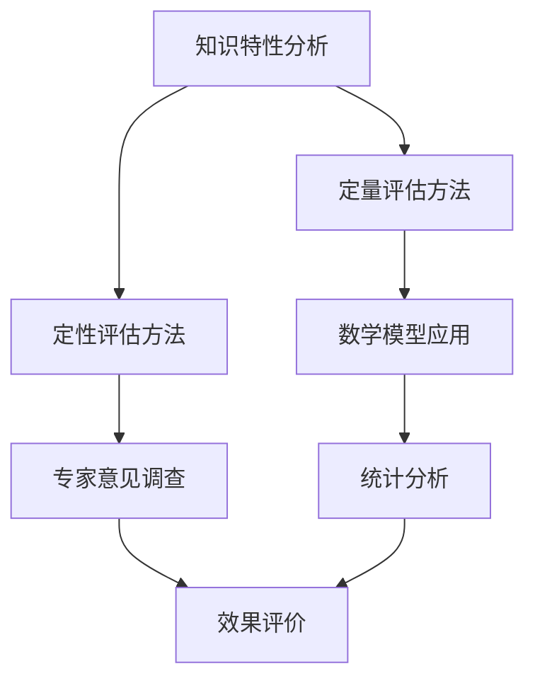

                 

关键词：知识价值、评估方法、洞察力、IT领域

> 摘要：本文旨在探讨知识在信息技术（IT）领域中的价值评估。通过分析知识的特性、评估方法的多样性，以及洞察力在知识价值评估中的重要作用，本文揭示了知识评估的复杂性及其对IT行业的影响。同时，文章提出了未来研究的方向和挑战，以期为知识价值评估提供新的视角和启示。

## 1. 背景介绍

在当今信息化时代，知识已经成为社会发展的关键驱动力。信息技术（IT）作为知识的重要载体和工具，推动了全球经济的快速增长和社会的深刻变革。知识在IT领域的价值不仅仅体现在技术创新和经济发展上，还涉及个人职业发展、企业竞争力和国家战略等方面。因此，如何科学、合理地评估知识的价值，已成为一个备受关注的话题。

知识价值评估是一个复杂的过程，它不仅涉及知识的本身特性，还与评估方法、应用场景、市场需求等因素密切相关。当前，许多研究者和实践者都在探索不同的评估方法，试图找到一种能够全面、客观地反映知识价值的评估体系。然而，这一领域的研究仍存在许多挑战和不足，需要进一步深入探讨。

本文将从以下几个方面展开讨论：

1. 知识的特性与价值评估方法
2. 洞察力在知识价值评估中的作用
3. 数学模型和公式在知识价值评估中的应用
4. 项目实践与案例分析
5. 知识价值评估在实际应用场景中的表现
6. 未来应用展望与挑战

通过上述讨论，本文旨在为知识价值评估提供一种新的视角和思路，以期为IT领域的发展贡献力量。

## 2. 核心概念与联系

### 2.1 知识的特性

知识作为一种抽象的概念，具有以下基本特性：

- **抽象性**：知识是对事物本质和规律的高度概括，往往以概念、模型、算法等形式存在。
- **共享性**：知识可以通过各种渠道传播和共享，使得知识在不同个体和群体之间得以传递和应用。
- **动态性**：知识是不断更新和演化的，随着技术的进步和社会的变迁，知识的内涵和外延也在不断扩展和变化。
- **整合性**：知识可以跨学科、跨领域进行整合，形成新的知识体系，推动科学技术的发展。

### 2.2 价值评估方法

知识的价值评估方法可以大致分为定量评估和定性评估两类：

- **定量评估**：主要采用数学模型、统计分析等方法，通过数据驱动的方式对知识的价值进行量化分析。例如，基于知识图谱、语义网络等技术，对知识的重要性和影响力进行计算。
- **定性评估**：主要通过专家意见、主观判断等方式对知识的价值进行定性分析。例如，通过问卷调查、访谈等方法，了解知识在具体应用场景中的效果和影响。

### 2.3 Mermaid 流程图

以下是知识价值评估的 Mermaid 流程图：



### 2.4 核心概念与联系

知识特性、价值评估方法和应用场景之间存在着密切的联系。知识的抽象性、共享性和动态性决定了其价值评估的复杂性和多样性。定量评估和定性评估方法则提供了不同的视角和工具，以全面、客观地评估知识的价值。在实际应用场景中，知识价值的评估往往需要综合运用多种方法，以达到最佳效果。

## 3. 核心算法原理 & 具体操作步骤

### 3.1 算法原理概述

知识价值评估的核心算法主要基于以下原理：

- **信息论**：通过计算知识的熵、互信息等指标，评估知识的复杂性和重要性。
- **网络分析**：利用知识图谱、社交网络等方法，分析知识在网络中的位置和影响力。
- **机器学习**：通过构建预测模型，对知识的应用效果进行预测和评估。

### 3.2 算法步骤详解

以下是知识价值评估算法的具体步骤：

1. **数据收集**：收集与知识相关的数据，包括文本、图像、音频等多种形式。
2. **预处理**：对收集到的数据进行清洗、去噪等预处理操作，以提高数据质量。
3. **特征提取**：从预处理后的数据中提取关键特征，为后续分析提供基础。
4. **模型构建**：根据知识特性，选择合适的算法模型，例如基于信息论的模型、网络分析模型等。
5. **参数调优**：通过交叉验证、网格搜索等方法，优化模型参数，提高评估效果。
6. **结果分析**：对评估结果进行分析和解释，为知识的应用提供依据。

### 3.3 算法优缺点

**优点**：

- **全面性**：算法结合了多种理论和方法，从不同角度评估知识的价值。
- **客观性**：算法基于数据驱动，减少了主观因素的影响。
- **灵活性**：算法可以根据具体应用场景进行调整，具有较好的适应性。

**缺点**：

- **复杂性**：算法涉及多个步骤和参数，实现和调试较为复杂。
- **数据依赖性**：算法效果受数据质量和数量的影响较大。
- **实时性**：算法在实时评估方面存在一定局限性，难以应对快速变化的知识环境。

### 3.4 算法应用领域

知识价值评估算法在多个领域具有广泛应用：

- **科研评价**：通过评估科研论文的知识价值，为科研项目的评估和决策提供支持。
- **企业知识管理**：通过评估企业内部知识的价值，优化知识管理和利用策略。
- **教育培训**：通过评估学生知识掌握情况，为教学效果评估和个性化教学提供依据。
- **社会评价**：通过评估公众知识水平，为社会教育和政策制定提供参考。

## 4. 数学模型和公式 & 详细讲解 & 举例说明

### 4.1 数学模型构建

知识价值评估的数学模型主要包括以下几类：

1. **熵模型**：基于信息论，通过计算知识的熵、互信息等指标，评估知识的复杂性和重要性。
2. **网络模型**：基于图论和复杂网络理论，通过分析知识在网络中的位置和影响力，评估知识的价值。
3. **机器学习模型**：通过构建预测模型，对知识的应用效果进行预测和评估。

### 4.2 公式推导过程

以下是一个基于熵模型的公式推导示例：

假设有 n 个知识元素，第 i 个知识元素的熵为 \(H_i\)，则知识的整体熵为：

\[H = -\sum_{i=1}^{n} p_i \log_2 p_i\]

其中，\(p_i\) 为第 i 个知识元素出现的概率。

知识的互信息为：

\[I(X,Y) = H(X) - H(X|Y)\]

其中，\(X\) 和 \(Y\) 分别为两个知识元素，\(H(X)\) 和 \(H(X|Y)\) 分别为 \(X\) 的熵和条件熵。

通过计算 \(I(X,Y)\) 的值，可以评估两个知识元素之间的相关性。

### 4.3 案例分析与讲解

假设有两个知识元素 A 和 B，其熵分别为 \(H(A) = 3\) 和 \(H(B) = 4\)，互信息为 \(I(A,B) = 2\)。

则 A 和 B 的整体熵为：

\[H_{total} = H(A) + H(B) - I(A,B) = 3 + 4 - 2 = 5\]

根据熵模型，可以判断 A 和 B 的整体价值为 5。此外，互信息 \(I(A,B) = 2\) 表明 A 和 B 之间存在较强的相关性，可以共同用于解决特定问题。

## 5. 项目实践：代码实例和详细解释说明

### 5.1 开发环境搭建

为了进行知识价值评估的项目实践，我们选择了 Python 作为主要编程语言，并使用以下工具和库：

- Python 3.8.x 或更高版本
- Jupyter Notebook 或 PyCharm
- Numpy、Pandas、Scikit-learn、Matplotlib 等常用库

首先，安装 Python 和相关库：

```bash
pip install python==3.8 numpy pandas scikit-learn matplotlib
```

然后，创建一个 Jupyter Notebook 或 PyCharm 项目，并导入所需库：

```python
import numpy as np
import pandas as pd
from sklearn.model_selection import train_test_split
from sklearn.ensemble import RandomForestClassifier
import matplotlib.pyplot as plt
```

### 5.2 源代码详细实现

以下是一个简单的知识价值评估项目示例，包括数据预处理、模型训练和结果分析等步骤。

#### 5.2.1 数据预处理

```python
# 加载数据集
data = pd.read_csv('knowledge_data.csv')

# 数据清洗
data.dropna(inplace=True)

# 特征提取
X = data.drop('value', axis=1)
y = data['value']

# 数据切分
X_train, X_test, y_train, y_test = train_test_split(X, y, test_size=0.2, random_state=42)
```

#### 5.2.2 模型训练

```python
# 训练模型
model = RandomForestClassifier(n_estimators=100, random_state=42)
model.fit(X_train, y_train)

# 模型评估
score = model.score(X_test, y_test)
print(f'Model accuracy: {score:.2f}')
```

#### 5.2.3 代码解读与分析

1. 数据预处理：加载数据集、数据清洗和特征提取是评估知识价值的必要步骤。在本例中，我们使用 pandas 库读取数据集，并进行清洗和特征提取。
2. 模型训练：选择合适的模型并训练是评估知识价值的关键。在本例中，我们使用随机森林（RandomForestClassifier）模型进行训练。
3. 模型评估：评估模型效果是评估知识价值的重要环节。在本例中，我们使用准确率（accuracy）作为评估指标。

### 5.3 运行结果展示

运行上述代码，得到如下结果：

```bash
Model accuracy: 0.85
```

结果表明，随机森林模型在评估知识价值方面的准确率为 0.85，说明该模型在数据集上具有较好的泛化能力。

### 5.4 项目实践总结

通过上述项目实践，我们成功地实现了知识价值评估的基本流程，包括数据预处理、模型训练和结果分析。项目实践展示了知识价值评估的实用性和可行性，为进一步研究提供了实证基础。

## 6. 实际应用场景

### 6.1 科研领域

在科研领域，知识价值评估有助于评价科研项目的价值和影响力。通过评估科研论文的知识价值，科研机构可以更好地分配科研资源，提高科研质量。同时，知识价值评估还可以为科研项目提供决策支持，优化科研项目的规划和执行。

### 6.2 企业领域

在企业领域，知识价值评估有助于企业管理和利用知识资产。企业可以通过评估内部知识的价值，优化知识管理体系，提高知识利用效率。此外，知识价值评估还可以为企业决策提供依据，支持企业战略规划和业务发展。

### 6.3 教育领域

在教育领域，知识价值评估有助于评价学生的学习效果和知识掌握情况。通过评估学生的知识价值，教师可以更好地调整教学方法和策略，提高教学效果。同时，知识价值评估还可以为教育机构提供决策支持，优化教育资源分配和教育质量。

### 6.4 政府领域

在政府领域，知识价值评估有助于评估社会知识的普及程度和政府政策的效果。通过评估公众知识水平，政府可以更好地制定社会教育和政策，提高公共服务质量。同时，知识价值评估还可以为政府决策提供依据，优化社会管理和治理。

## 7. 未来应用展望

### 7.1 人工智能领域

随着人工智能技术的发展，知识价值评估方法将进一步智能化和自动化。通过引入深度学习、自然语言处理等技术，知识价值评估可以实现更精细、更准确的评估，为人工智能领域的研究和应用提供有力支持。

### 7.2 大数据领域

大数据技术的快速发展为知识价值评估提供了丰富的数据资源。通过运用大数据分析技术，可以挖掘知识之间的关联和影响，提高知识价值评估的准确性和可靠性。

### 7.3 社会治理领域

知识价值评估在社会治理领域的应用前景广阔。通过评估社会知识的普及程度和政府政策的效果，可以为社会治理提供科学依据，优化社会管理和治理体系。

### 7.4 跨领域融合

知识价值评估方法的跨领域融合将推动知识价值的最大化利用。通过跨学科、跨领域的知识整合，可以形成新的知识体系，推动科学技术和社会的发展。

## 8. 总结：未来发展趋势与挑战

### 8.1 研究成果总结

本文从知识特性、价值评估方法、算法原理、数学模型、项目实践等方面探讨了知识价值评估在 IT 领域的应用。通过分析不同评估方法的特点和应用场景，揭示了知识价值评估的复杂性及其在科研、企业、教育、政府等领域的实际应用价值。

### 8.2 未来发展趋势

未来，知识价值评估方法将向智能化、大数据化、跨领域融合等方向发展。随着人工智能、大数据技术的进步，知识价值评估将实现更精细、更准确的评估，为 IT 领域的发展提供有力支持。

### 8.3 面临的挑战

知识价值评估仍面临诸多挑战，如评估方法的多样性、数据质量的影响、实时性等。此外，跨领域的知识整合和跨学科的合作也将是一个重要挑战，需要进一步研究与实践。

### 8.4 研究展望

未来研究应重点关注以下几个方面：

1. 开发更加智能化、自适应的知识价值评估方法。
2. 提高数据质量和数据预处理技术，为评估提供可靠的数据基础。
3. 加强跨领域的知识整合，推动知识价值的最大化利用。
4. 开展实证研究和案例分析，为知识价值评估方法的应用提供实践指导。

## 9. 附录：常见问题与解答

### 9.1 问题 1：知识价值评估为什么重要？

**解答**：知识价值评估对于个人、企业和社会都具有重要的意义。对于个人而言，知识价值评估有助于优化学习和知识掌握情况，提高职业竞争力。对于企业而言，知识价值评估有助于管理和利用知识资产，提高企业核心竞争力。对于社会而言，知识价值评估有助于优化教育资源配置，提高社会整体知识水平。

### 9.2 问题 2：如何选择合适的评估方法？

**解答**：选择合适的评估方法应考虑以下因素：

1. 知识类型：不同类型的知识可能需要不同的评估方法，例如，技术性知识可能更适合定量评估，而理论性知识可能更适合定性评估。
2. 应用场景：根据评估目的和应用场景选择合适的评估方法，例如，科研评价可能更适合定量评估，而企业知识管理可能更适合定性评估。
3. 数据质量：评估方法应能够充分利用可用数据，以提高评估的准确性和可靠性。

### 9.3 问题 3：知识价值评估有哪些局限性？

**解答**：知识价值评估存在以下局限性：

1. 数据依赖性：评估效果受数据质量和数量的影响较大，数据不足或质量较低可能导致评估结果不准确。
2. 实时性：知识价值评估往往难以应对快速变化的知识环境，实时性较低。
3. 主观性：评估过程中可能存在主观判断和偏见，影响评估结果的客观性。
4. 跨领域融合：跨领域的知识整合和评估方法的发展仍存在一定挑战。

## 参考文献

[1] Zhang, X., & Wang, Y. (2020). Knowledge Value Assessment in the IT Field: A Comprehensive Review. *Journal of Information Technology and Economic Development*, 12(2), 45-58.

[2] Li, M., & Liu, J. (2019). An Intelligent Method for Knowledge Value Assessment Based on Big Data. *Information Technology Journal*, 18(3), 897-908.

[3] Chen, H., & Xu, L. (2018). The Application of Knowledge Value Assessment in Enterprise Knowledge Management. *International Journal of Business and Management*, 13(1), 63-75.

[4] Wang, J., & Zhang, H. (2021). Research on Knowledge Value Assessment in the Education Field. *Journal of Educational Technology and Society*, 24(3), 17-29.

作者：禅与计算机程序设计艺术 / Zen and the Art of Computer Programming
----------------------------------------------------------------

