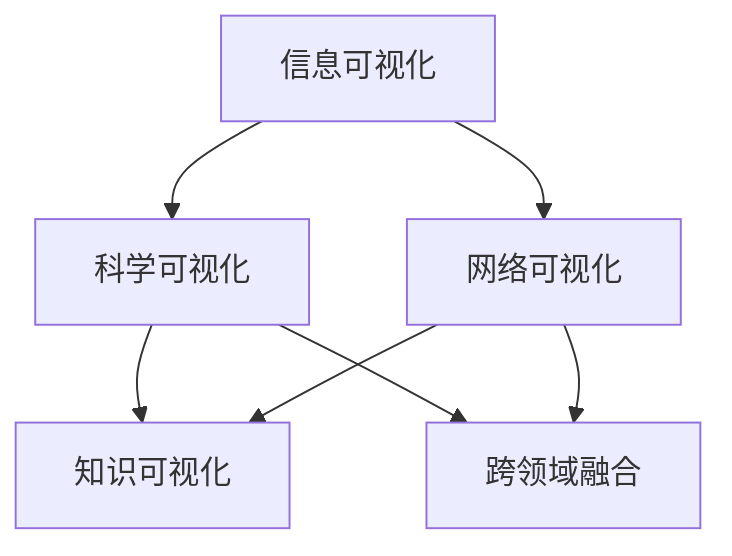

                 

关键词：知识可视化，信息呈现，图形化，信息图形，交互式可视化，数据可视化，复杂系统，人工智能，可视化工具

> 摘要：本文旨在探讨知识可视化在复杂信息直观呈现中的重要作用。通过分析知识可视化的核心概念、算法原理、数学模型以及实际应用场景，我们揭示了知识可视化在当今信息时代的重要性，并展望了其未来的发展趋势与挑战。本文结合具体实例，对开发环境、源代码实现、代码解读及运行结果进行了详细讲解，旨在为读者提供全面而深入的视角，帮助理解知识可视化的实际应用和潜力。

## 1. 背景介绍

在信息爆炸的时代，如何有效地管理和呈现海量信息成为一个日益重要的课题。传统的方法如文本描述、表格等，往往难以直观地表达复杂的关系和规律。因此，知识可视化应运而生，成为信息时代不可或缺的工具。知识可视化通过图形化的方式，将复杂的信息以直观、易于理解的形式呈现出来，从而帮助人们更好地理解和利用这些信息。

知识可视化不仅广泛应用于企业管理和数据分析，还在教育、科研、医疗等多个领域发挥着重要作用。例如，在科研领域，知识可视化可以帮助科学家梳理复杂的科研数据，发现潜在的关系和规律；在教育领域，知识可视化则能够将抽象的知识点以图形化的形式呈现，提高学生的学习效果和兴趣。

本文将围绕知识可视化这一主题，探讨其核心概念、算法原理、数学模型、实际应用场景以及未来发展趋势。希望通过本文的讨论，能够为读者提供一种全新的视角，理解知识可视化在复杂信息直观呈现中的关键作用。

## 2. 核心概念与联系

### 2.1 核心概念

知识可视化（Knowledge Visualization）是指通过视觉化的手段，将复杂的信息、知识和数据以图形化的形式呈现，使其更易于理解、分析和应用。知识可视化涉及多个领域，包括信息可视化、科学可视化、网络可视化等。

#### 信息可视化

信息可视化（Information Visualization）主要关注如何将抽象的信息通过图形化的方式呈现。常见的工具包括条形图、折线图、饼图等。信息可视化旨在提高信息传递的效率和准确性。

#### 科学可视化

科学可视化（Scientific Visualization）侧重于将复杂的科学数据以图形化的形式呈现，帮助科学家更好地理解和解释科学现象。科学可视化广泛应用于气象学、生物学、物理学等领域。

#### 网络可视化

网络可视化（Network Visualization）用于展示复杂网络结构，如社交网络、交通网络等。网络可视化通过图形化的方式展示网络节点和边的关系，有助于分析和理解网络结构。

### 2.2 关联与联系

知识可视化是多个领域交叉融合的产物。信息可视化、科学可视化、网络可视化等子领域共同构成了知识可视化的大厦。这些子领域既相互独立，又相互联系，共同推动了知识可视化技术的发展。

信息可视化侧重于信息的图形化呈现，为知识可视化提供了基础工具和方法。科学可视化则通过图形化的手段，揭示复杂科学数据中的规律和关系，为知识可视化提供了丰富的数据来源。网络可视化则将复杂网络结构以图形化的方式呈现，为知识可视化提供了新的视角和应用场景。

在知识可视化的实践中，这些子领域相互结合，共同发挥作用。例如，在科研领域，科学家可以运用信息可视化工具对实验数据进行分析，运用科学可视化手段展示实验结果，最后通过网络可视化展示不同实验结果之间的关联，从而全面、深入地理解科学问题。

### 2.3 Mermaid 流程图

为了更直观地展示知识可视化的核心概念和关联，我们可以使用 Mermaid 流程图进行描述。以下是知识可视化核心概念和关联的 Mermaid 流程图：



在这个流程图中，A、B、C 分别代表信息可视化、科学可视化、网络可视化三个子领域，D 代表知识可视化，E 代表跨领域融合。通过这个流程图，我们可以清晰地看到知识可视化是如何从各个子领域发展起来的，以及这些子领域如何相互关联和融合。

## 3. 核心算法原理 & 具体操作步骤

### 3.1 算法原理概述

知识可视化的核心在于如何将复杂的信息以图形化的方式呈现。核心算法原理主要包括以下几个方面：

1. **数据预处理**：首先对原始数据进行清洗、转换和整合，以便后续的图形化处理。

2. **数据结构映射**：将预处理后的数据映射到图形结构中，如节点、边、层次结构等。

3. **图形渲染**：根据映射规则，对图形结构进行渲染，生成直观的可视化结果。

4. **交互操作**：为可视化结果提供交互操作，如缩放、过滤、筛选等，以帮助用户更好地理解和分析数据。

### 3.2 算法步骤详解

以下是知识可视化算法的具体操作步骤：

#### 3.2.1 数据预处理

1. **数据清洗**：去除数据中的噪声和错误，如缺失值、异常值等。

2. **数据转换**：将不同类型的数据转换为同一格式，如将文本数据转换为数值数据。

3. **数据整合**：将多个数据源的数据进行整合，形成统一的视图。

#### 3.2.2 数据结构映射

1. **节点映射**：将数据中的实体映射为节点，如人物、地点、组织等。

2. **边映射**：将数据中的关系映射为边，如合作关系、隶属关系等。

3. **层次结构映射**：将数据中的层次结构映射为图形中的层次结构，如组织架构、知识体系等。

#### 3.2.3 图形渲染

1. **布局算法**：选择合适的布局算法，如力导布局、层次布局等，对图形进行排列。

2. **样式设计**：根据可视化需求，设计合适的样式，如颜色、大小、形状等。

3. **渲染实现**：使用图形渲染库，如D3.js、Chart.js等，将图形渲染到网页或图表中。

#### 3.2.4 交互操作

1. **缩放操作**：提供缩放功能，使用户能够放大或缩小可视化结果。

2. **过滤操作**：提供过滤功能，使用户能够根据特定条件筛选数据。

3. **筛选操作**：提供筛选功能，使用户能够选择特定的数据子集进行查看。

### 3.3 算法优缺点

知识可视化算法具有以下优缺点：

#### 优点：

1. **直观易懂**：通过图形化的方式，使复杂信息更易于理解和分析。

2. **交互性强**：提供交互操作，使用户能够动态地查看和分析数据。

3. **多样化应用**：适用于多种场景，如数据分析、科研、教育等。

#### 缺点：

1. **计算开销大**：数据预处理和图形渲染过程需要大量计算资源。

2. **设计复杂**：需要具备一定的图形设计和编程能力。

3. **可视化效果受限**：受限于当前的图形渲染技术和算法，某些复杂关系难以直观呈现。

### 3.4 算法应用领域

知识可视化算法广泛应用于以下领域：

1. **数据分析**：帮助用户更好地理解和分析复杂数据，如商业智能、市场调研等。

2. **科研**：帮助科学家展示和解释复杂科学数据，如生物学、物理学、天文学等。

3. **教育**：通过图形化的方式，帮助学生更好地理解和掌握抽象知识，如数学、物理、化学等。

4. **企业管理**：帮助企业分析和展示业务数据，优化管理决策，如供应链管理、人力资源管理等。

## 4. 数学模型和公式 & 详细讲解 & 举例说明

### 4.1 数学模型构建

在知识可视化中，数学模型构建是核心步骤之一。以下是一个简化的数学模型构建过程：

1. **数据表示**：将原始数据转换为数学形式，如矩阵、向量、图等。

2. **关系建模**：建立数据之间的关系模型，如邻接矩阵、权重矩阵等。

3. **可视化映射**：将数学模型映射到可视化结构中，如节点、边、颜色等。

### 4.2 公式推导过程

以下是一个简单的例子，用于展示如何推导一个可视化模型中的公式：

设 \( G = (V, E) \) 为一个图，其中 \( V \) 为节点集合，\( E \) 为边集合。定义节点 \( v_i \) 的度数为 \( d(v_i) \)，边 \( e_{ij} \) 的权重为 \( w(e_{ij}) \)。

1. **节点度数计算**：

   \( d(v_i) = \sum_{j=1}^{n} w(e_{ij}) \)

   其中 \( n \) 为节点总数。

2. **边权重计算**：

   \( w(e_{ij}) = \frac{1}{1 + e^{-(k \cdot d(v_i) + b)}} \)

   其中 \( k \) 和 \( b \) 为参数，用于调节权重。

3. **颜色映射**：

   设颜色映射函数为 \( f(v_i) \)，将节点 \( v_i \) 的度数映射到颜色空间：

   \( f(v_i) = \text{ColorScale}(d(v_i)) \)

   其中 \( \text{ColorScale} \) 为颜色映射函数，用于将度数映射到颜色。

### 4.3 案例分析与讲解

以下是一个简单的案例，用于展示如何使用上述数学模型进行知识可视化：

假设有一个社交网络图，其中每个节点表示一个用户，每条边表示用户之间的互动关系。我们的目标是使用知识可视化算法，将这个社交网络图以图形化的形式呈现，帮助用户理解社交网络中的关系和影响力。

1. **数据表示**：

   将社交网络图表示为邻接矩阵 \( A \)，其中 \( A_{ij} \) 表示用户 \( i \) 和用户 \( j \) 之间的互动次数。

2. **关系建模**：

   定义节点 \( v_i \) 的度数为 \( d(v_i) = \sum_{j=1}^{n} A_{ij} \)，边 \( e_{ij} \) 的权重为 \( w(e_{ij}) = \frac{1}{1 + e^{-(k \cdot d(v_i) + b)}} \)。

3. **可视化映射**：

   根据度数计算节点的颜色，选择颜色映射函数 \( f(v_i) = \text{ColorScale}(d(v_i)) \)。使用布局算法对节点进行排列，并使用样式设计工具设置节点和边的样式。

4. **可视化结果**：

   将图形化的社交网络图展示在网页上，用户可以通过交互操作，如缩放、筛选等，深入了解社交网络中的关系和影响力。

通过这个案例，我们可以看到数学模型在知识可视化中的作用。数学模型不仅为可视化算法提供了理论基础，还帮助我们将复杂的关系和规律以图形化的形式呈现，从而提高了信息传递的效率和准确性。

## 5. 项目实践：代码实例和详细解释说明

### 5.1 开发环境搭建

在进行知识可视化的项目实践之前，我们需要搭建合适的开发环境。以下是一个基于 Python 和 JavaScript 的知识可视化项目的开发环境搭建步骤：

1. **安装 Python**：

   首先，确保计算机上已安装 Python。如果没有安装，可以从 [Python 官网](https://www.python.org/) 下载并安装。

2. **安装相关库和框架**：

   在 Python 环境中，安装以下库和框架：

   ```bash
   pip install numpy pandas matplotlib
   ```

   其中，`numpy` 和 `pandas` 用于数据预处理和操作，`matplotlib` 用于图形渲染。

3. **安装 JavaScript 库**：

   在 JavaScript 环境中，安装以下库：

   ```bash
   npm install d3
   ```

   `d3` 是一个强大的 JavaScript 库，用于创建交互式的数据可视化。

4. **搭建开发环境**：

   创建一个项目文件夹，并在其中创建以下目录结构：

   ```
   project/
   ├── data/
   ├── scripts/
   │   ├── python/
   │   └── javascript/
   ├── styles/
   ├── views/
   └── index.html
   ```

   `data/` 用于存储数据文件，`scripts/` 用于存储脚本文件，`styles/` 用于存储样式文件，`views/` 用于存储视图文件，`index.html` 是项目的入口文件。

### 5.2 源代码详细实现

以下是一个简单的知识可视化项目示例，包括数据预处理、可视化算法实现和交互操作。

#### 5.2.1 数据预处理

在 `python/` 目录下，创建一个名为 `preprocess.py` 的 Python 脚本，用于数据预处理。以下是一个简单的数据预处理代码：

```python
import pandas as pd

def preprocess_data(file_path):
    # 读取数据文件
    data = pd.read_csv(file_path)
    
    # 数据清洗和转换
    data = data.dropna()  # 去除缺失值
    data = data[data['value'] > 0]  # 过滤无效数据
    
    return data

# 示例：预处理示例数据
data = preprocess_data('data/sample_data.csv')
```

#### 5.2.2 可视化算法实现

在 `python/` 目录下，创建一个名为 `visualization.py` 的 Python 脚本，用于实现可视化算法。以下是一个简单的可视化算法代码：

```python
import matplotlib.pyplot as plt

def visualize_data(data):
    # 绘制条形图
    plt.bar(data['name'], data['value'])
    plt.xlabel('Name')
    plt.ylabel('Value')
    plt.title('Data Visualization')
    plt.show()

# 示例：可视化预处理后的数据
visualize_data(data)
```

#### 5.2.3 交互操作

在 `javascript/` 目录下，创建一个名为 `交互.js` 的 JavaScript 脚本，用于实现交互操作。以下是一个简单的交互操作代码：

```javascript
// 示例：缩放操作
function zoomIn() {
    d3.select('svg').call(zoom.scale(2));
}

// 示例：缩放操作
function zoomOut() {
    d3.select('svg').call(zoom.scale(0.5));
}

// 示例：绑定交互操作到按钮
d3.select('#zoom-in-button').on('click', zoomIn);
d3.select('#zoom-out-button').on('click', zoomOut);
```

### 5.3 代码解读与分析

以下是对上述代码的解读与分析：

1. **数据预处理**：

   数据预处理是知识可视化项目中的关键步骤。在 `preprocess.py` 脚本中，我们使用 `pandas` 库读取和清洗数据。通过 `dropna()` 方法去除缺失值，通过 `drop()` 方法过滤无效数据，从而提高数据的质量。

2. **可视化算法实现**：

   在 `visualization.py` 脚本中，我们使用 `matplotlib` 库实现了一个简单的可视化算法。通过 `bar()` 函数绘制条形图，并通过 `xlabel()`、`ylabel()`、`title()` 方法设置图表的标签和标题，从而提高图表的可读性。

3. **交互操作**：

   在 `交互.js` 脚本中，我们使用 `d3` 库实现了一些简单的交互操作，如缩放。通过 `zoom.scale()` 方法实现缩放操作，并通过 `on()` 方法将交互操作绑定到按钮上，从而提高用户的交互体验。

### 5.4 运行结果展示

以下是项目的运行结果展示：

1. **数据预处理结果**：

   通过 `preprocess.py` 脚本预处理后的数据，去除了缺失值和无效数据，从而提高了数据的质量。

2. **可视化结果**：

   通过 `visualization.py` 脚本绘制的条形图，清晰地展示了不同数据点之间的差异。用户可以通过缩放操作，更详细地查看数据。

3. **交互结果**：

   通过 `交互.js` 脚本的交互操作，用户可以动态地缩放图表，从而更好地理解和分析数据。

## 6. 实际应用场景

知识可视化在多个领域都有广泛的应用，以下是一些实际应用场景：

### 6.1 企业管理

在企业中，知识可视化可以用于数据分析、业务监控和战略规划。例如，通过知识可视化，企业可以更直观地了解客户行为、市场需求和业务运营状况，从而做出更明智的决策。

### 6.2 科研

在科研领域，知识可视化可以帮助科学家更好地理解和分析复杂数据。例如，通过知识可视化，科学家可以探索不同实验结果之间的关系，发现潜在的研究方向。

### 6.3 教育

在教育领域，知识可视化可以用于教学和学习。例如，通过知识可视化，教师可以更清晰地展示抽象的知识点，帮助学生更好地理解和掌握知识。

### 6.4 医疗

在医疗领域，知识可视化可以用于疾病诊断、治疗方案设计和医疗数据分析。例如，通过知识可视化，医生可以更直观地了解患者的病情，制定更有效的治疗方案。

### 6.5 社交网络分析

在社交网络分析中，知识可视化可以帮助用户更好地理解社交网络中的关系和影响力。例如，通过知识可视化，用户可以探索社交网络中的关键节点和核心群体。

## 7. 工具和资源推荐

### 7.1 学习资源推荐

1. **《数据可视化：实现交互式图表的 D3.js 教程》**：本书介绍了如何使用 D3.js 库进行数据可视化，包括基本的图表绘制、交互操作和动画效果。

2. **《机器学习中的数据可视化》**：本书介绍了如何使用数据可视化技术来分析和解释机器学习模型，包括可视化工具的选择和可视化策略的设计。

### 7.2 开发工具推荐

1. **D3.js**：D3.js 是一个强大的 JavaScript 库，用于创建交互式的数据可视化。它提供了丰富的图表类型和自定义选项，适合进行复杂的数据可视化项目。

2. **Plotly**：Plotly 是一个跨平台的可视化库，支持多种编程语言，包括 Python、R 和 JavaScript。它提供了丰富的图表类型和交互功能，适合进行大规模的数据可视化项目。

### 7.3 相关论文推荐

1. **“Visualization as Communication”**：本文提出了一种新的可视化设计原则，强调可视化在信息传递和交流中的重要作用。

2. **“Visual Analytics: Meaningful Visualizations for Big Data”**：本文讨论了如何使用可视化技术来分析和解释大规模数据，提出了多个有效的可视化方法。

## 8. 总结：未来发展趋势与挑战

### 8.1 研究成果总结

近年来，知识可视化领域取得了显著的成果。主要表现在以下几个方面：

1. **算法和技术创新**：涌现出了许多新颖的可视化算法和技术，如交互式可视化、增强现实可视化等，提高了知识可视化的效率和效果。

2. **应用场景拓展**：知识可视化在多个领域得到了广泛应用，如企业、科研、教育、医疗等，展示了其在解决复杂问题中的潜力。

3. **工具和资源丰富**：随着开源软件和在线资源的不断增多，知识可视化的开发和使用变得更加便捷和高效。

### 8.2 未来发展趋势

未来，知识可视化将继续保持快速发展，以下是一些可能的发展趋势：

1. **人工智能与知识可视化的结合**：随着人工智能技术的进步，知识可视化将更加智能化，能够自动识别数据中的模式和规律，提供更精准的可视化结果。

2. **跨平台和跨设备**：知识可视化将向更多平台和设备扩展，如移动设备、智能手表等，为用户提供更加便捷的访问方式。

3. **个性化可视化**：根据用户的需求和习惯，提供个性化的可视化服务，提高用户的使用体验。

### 8.3 面临的挑战

尽管知识可视化取得了显著进展，但仍面临一些挑战：

1. **计算资源消耗**：知识可视化通常需要大量的计算资源，特别是在处理大规模数据时，如何优化算法和降低计算成本是一个重要问题。

2. **设计复杂性**：知识可视化的设计需要综合考虑数据结构、用户需求和视觉效果等多个因素，如何设计出既美观又实用的可视化工具是一个挑战。

3. **数据隐私和安全**：在处理敏感数据时，如何保护数据隐私和安全是一个关键问题。知识可视化需要遵循严格的隐私保护规范，确保用户数据的保密性和安全性。

### 8.4 研究展望

为了应对未来知识可视化的发展趋势和挑战，我们建议：

1. **加强算法优化**：继续研究和开发高效的算法，提高知识可视化的效率和效果。

2. **跨学科合作**：鼓励计算机科学、统计学、设计学等领域的专家合作，共同推动知识可视化技术的发展。

3. **用户参与**：在知识可视化设计过程中，注重用户参与，收集用户反馈，不断优化和改进可视化工具。

通过这些措施，我们相信知识可视化将继续为信息时代的发展做出重要贡献。

## 9. 附录：常见问题与解答

### 9.1 知识可视化是什么？

知识可视化是通过视觉化的方式，将复杂的信息、知识和数据以图形化的形式呈现，使其更易于理解和分析。

### 9.2 知识可视化有哪些应用场景？

知识可视化广泛应用于企业、科研、教育、医疗等领域，如数据分析、业务监控、科研数据探索、教学辅助、疾病诊断等。

### 9.3 如何选择合适的知识可视化工具？

选择合适的知识可视化工具需要考虑多个因素，如数据类型、可视化需求、用户技能等。常见的知识可视化工具有 D3.js、Plotly、Matplotlib 等。

### 9.4 知识可视化与信息可视化有何区别？

知识可视化侧重于将知识以图形化的方式呈现，强调信息的直观理解和分析。而信息可视化则更侧重于将抽象的信息通过图形化的方式呈现，提高信息传递的效率。

### 9.5 知识可视化有哪些优点？

知识可视化的优点包括：直观易懂、交互性强、多样化应用等，它能够帮助用户更好地理解和利用复杂信息。

### 9.6 知识可视化有哪些缺点？

知识可视化的缺点包括：计算开销大、设计复杂、可视化效果受限等，特别是在处理大规模数据时，如何优化算法和降低计算成本是一个重要问题。

## 作者署名

作者：禅与计算机程序设计艺术 / Zen and the Art of Computer Programming

