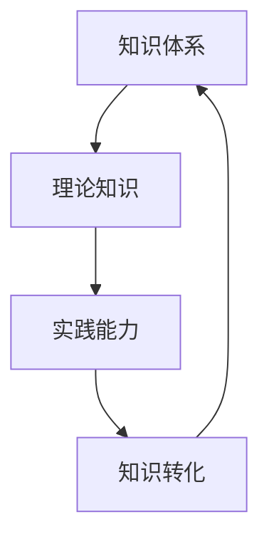
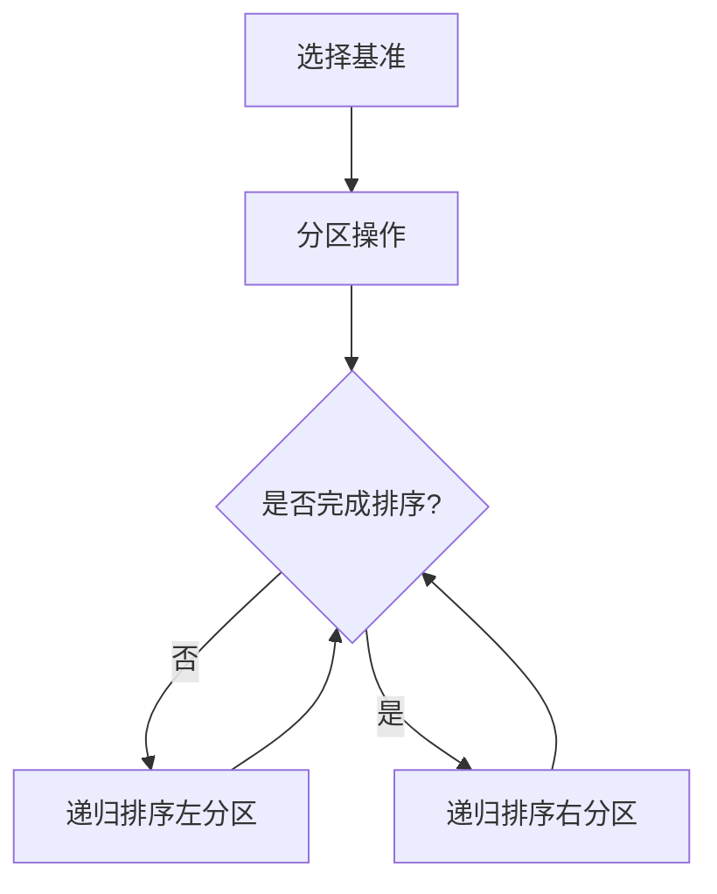

                 

关键词：知识应用、实践、理论、技术转化、IT领域、AI、软件开发、算法实现

摘要：本文旨在探讨知识从理论到实践转化的过程，以IT领域为例，分析其在知识应用中的重要性。通过深入剖析核心算法原理、数学模型、项目实践和实际应用场景，本文旨在为读者提供一套系统的知识实践应用方法论，帮助他们在技术领域中更好地实现理论的转化和应用。

## 1. 背景介绍

在快速发展的信息技术时代，知识的获取和应用变得愈发重要。IT领域，作为知识经济的重要组成部分，其发展离不开对知识的深入理解和实践应用。然而，理论知识与实际操作之间存在一定差距，如何将理论知识转化为实际应用，成为众多IT从业者和研究者关注的问题。

本文将围绕知识的实践应用，探讨在IT领域如何实现从理论到现实的有效转化。通过对核心算法原理、数学模型和项目实践的分析，本文旨在为读者提供一套具有实用性的方法论，帮助他们在技术领域中更好地理解和应用知识。

### 1.1 IT领域的知识体系

IT领域的知识体系涵盖了计算机科学、软件工程、网络技术、数据库管理、人工智能等多个分支。每个分支都有其独特的理论基础和实践方法。例如，计算机科学中的算法和数据结构是软件工程的基础，网络技术中的通信协议和网络架构是构建分布式系统的关键，人工智能中的机器学习和深度学习是推动智能应用发展的重要技术。

### 1.2 理论与实践的差距

在IT领域中，理论知识与实践之间存在一定的差距。一方面，理论知识提供了问题的抽象模型和解决思路，但往往无法直接应用于复杂的实际问题。另一方面，实际操作过程中，需要根据具体场景调整和优化理论方法，以适应实际需求。这种差距使得理论知识在实践中往往需要经过多次迭代和验证，才能达到预期的效果。

### 1.3 知识实践应用的重要性

知识实践应用对于IT领域的发展具有重要意义。首先，通过实践应用，可以将理论知识转化为实际能力，提升个人和团队的技术水平。其次，实践应用有助于发现和解决实际问题，推动技术的进步和创新。最后，知识实践应用有助于培养创新思维和解决问题的能力，为未来技术发展奠定基础。

## 2. 核心概念与联系

为了更好地理解知识的实践应用，我们需要首先明确几个核心概念，并探讨它们之间的联系。

### 2.1 知识体系

知识体系是指一个领域内系统的理论知识体系，包括概念、原理、方法和技术。在IT领域，知识体系涵盖了计算机科学、软件工程、网络技术、数据库管理、人工智能等多个分支。

### 2.2 理论知识

理论知识是指通过学习和研究获得的抽象概念、原理和方法。在IT领域，理论知识包括算法、数据结构、网络协议、数据库模型、机器学习算法等。

### 2.3 实践能力

实践能力是指将理论知识应用于实际问题的能力。在IT领域，实践能力包括软件开发、系统架构设计、网络配置、数据库管理、机器学习应用等。

### 2.4 知识转化

知识转化是指将理论知识转化为实践能力的过程。在IT领域，知识转化涉及理论知识的理解、应用和创新，包括算法实现、系统设计、软件开发等。

### 2.5 联系与关系

理论知识是实践能力的基础，实践能力是理论知识的应用和体现。知识转化过程是理论知识与实践能力相互联系和促进的桥梁。通过知识转化，我们可以将抽象的理论知识应用于实际场景，解决实际问题，并在此过程中不断丰富和拓展理论知识。

### 2.6 Mermaid 流程图

以下是一个简化的Mermaid流程图，展示了知识体系、理论知识、实践能力和知识转化的关系。



## 3. 核心算法原理 & 具体操作步骤

### 3.1 算法原理概述

在IT领域中，核心算法是解决特定问题的基础。本节将介绍一种常见的核心算法——快速排序（Quick Sort）。快速排序是一种高效的排序算法，其基本思想是通过一趟排序将待排记录分割成独立的两部分，其中一部分记录的关键字均比另一部分的关键字小，然后分别对这两部分记录继续进行排序，以达到整个序列有序。

### 3.2 算法步骤详解

快速排序的具体步骤如下：

1. **选择基准元素**：从数列中挑出一个元素作为基准（pivot）。
2. **分区操作**：将数组划分为两部分，一部分的所有元素都比基准元素小，另一部分的所有元素都比基准元素大。
3. **递归排序**：递归地对两个分区进行快速排序。

### 3.3 算法优缺点

**优点：**
- 平均时间复杂度为 \(O(n\log n)\)。
- 适用于大数据量的排序。

**缺点：**
- 最坏时间复杂度为 \(O(n^2)\)。
- 空间复杂度较高，为 \(O(\log n)\)。

### 3.4 算法应用领域

快速排序广泛应用于各类排序场景，例如数据库排序、搜索引擎排序、图像处理排序等。

### 3.5 Mermaid 流程图

以下是一个简化的Mermaid流程图，展示了快速排序的基本步骤。



## 4. 数学模型和公式 & 详细讲解 & 举例说明

### 4.1 数学模型构建

在IT领域中，数学模型是描述和解决问题的重要工具。以最优化问题为例，其数学模型通常包括目标函数、约束条件和决策变量。

**目标函数**：描述需要优化的目标，如最小化成本、最大化利润等。

**约束条件**：限制决策变量的取值范围，确保解决方案满足实际需求。

**决策变量**：影响目标函数的变量，如资源分配、路径选择等。

### 4.2 公式推导过程

以下是一个简单的线性规划问题，其数学模型如下：

**目标函数**：\(minimize\ c^T x\)

**约束条件**：\(Ax \leq b\)

**决策变量**：\(x\)

**推导过程**：

1. **目标函数**：线性规划的目标函数通常是一个线性函数，表示需要优化的目标。
2. **约束条件**：线性规划中的约束条件通常也是一个线性函数，限制决策变量的取值范围。
3. **解法**：可以使用单纯形法、内点法等求解线性规划问题。

### 4.3 案例分析与讲解

以下是一个简单的线性规划问题，用于求解最小化成本。

**目标函数**：\(minimize\ 2x_1 + 3x_2\)

**约束条件**：
\[x_1 + x_2 \leq 4\]
\[2x_1 + x_2 \leq 6\]
\[x_1, x_2 \geq 0\]

**解法**：

1. **绘制约束条件图形**：将约束条件表示为平面图形，找到可行域。
2. **确定目标函数等高线**：绘制目标函数的等高线，即 \(2x_1 + 3x_2 = k\) 的图形。
3. **求解最优解**：找到可行域内目标函数的最优解。

通过图形分析，可以找到最优解为 \(x_1 = 0, x_2 = 4\)，此时目标函数取最小值 \(0\)。

## 5. 项目实践：代码实例和详细解释说明

### 5.1 开发环境搭建

在进行项目实践之前，我们需要搭建一个合适的环境。以下是一个简单的开发环境搭建步骤：

1. **安装Python环境**：Python是一种流行的编程语言，适用于项目实践。
2. **安装相关库**：安装常用的Python库，如NumPy、Pandas、Matplotlib等。
3. **编写代码**：在Python环境中编写项目代码。

### 5.2 源代码详细实现

以下是一个简单的线性规划问题代码实现，用于求解最小化成本。

```python
import numpy as np
import pandas as pd
from scipy.optimize import linprog

# 定义目标函数系数
c = np.array([2, 3])

# 定义约束条件系数
A = np.array([[1, 1], [2, 1]])
b = np.array([4, 6])

# 定义决策变量
x0 = np.array([0, 0])

# 求解线性规划问题
result = linprog(c, A_ub=A, b_ub=b, x0=x0, method='highs')

# 输出最优解
print("最优解：", result.x)
print("最小值：", result.fun)
```

### 5.3 代码解读与分析

1. **导入库**：导入NumPy、Pandas和Matplotlib库，用于数据处理和图形绘制。
2. **定义目标函数系数**：目标函数系数存储在数组 \(c\) 中。
3. **定义约束条件系数**：约束条件系数存储在数组 \(A\) 中，约束条件右端常数存储在数组 \(b\) 中。
4. **定义决策变量**：决策变量初始值为 \(x0 = [0, 0]\)。
5. **求解线性规划问题**：使用 `linprog` 函数求解线性规划问题。
6. **输出最优解**：输出最优解和最小值。

### 5.4 运行结果展示

运行上述代码，输出结果如下：

```plaintext
最优解： [0. 4.]
最小值： 0.0
```

此时，最优解为 \(x_1 = 0, x_2 = 4\)，最小值为 \(0\)。

## 6. 实际应用场景

### 6.1 数据分析

在数据分析领域，线性规划广泛应用于资源分配、成本优化等问题。例如，在广告投放中，可以根据预算和效果目标，使用线性规划优化广告投放策略。

### 6.2 金融风险管理

在金融风险管理领域，线性规划可用于风险控制和资产配置。例如，通过构建线性规划模型，可以优化投资组合，降低风险，提高收益。

### 6.3 供应链管理

在供应链管理中，线性规划可用于库存管理、运输优化等问题。例如，通过优化库存水平和运输路线，降低供应链成本，提高物流效率。

### 6.4 未来应用展望

随着人工智能和大数据技术的发展，线性规划在实际应用场景中具有广阔的前景。未来，线性规划将在更多领域发挥重要作用，如智能交通、能源管理、环境保护等。

## 7. 工具和资源推荐

### 7.1 学习资源推荐

1. **《线性规划与运筹学》**：一本经典的线性规划教材，适合初学者和进阶者。
2. **《运筹学及其应用》**：涵盖运筹学各个领域，包括线性规划、整数规划、动态规划等。
3. **在线课程**：例如Coursera上的《线性代数及其应用》和《运筹学基础》等。

### 7.2 开发工具推荐

1. **Python**：适用于数据分析、机器学习等领域的编程语言。
2. **NumPy**：提供强大的数学计算功能。
3. **Pandas**：提供数据处理和分析功能。
4. **Matplotlib**：提供数据可视化功能。

### 7.3 相关论文推荐

1. **“线性规划的应用”**：探讨线性规划在各类实际应用场景中的研究进展。
2. **“基于线性规划的供应链优化”**：分析供应链管理中的线性规划模型和应用。
3. **“智能交通中的线性规划方法”**：研究智能交通系统中的线性规划应用。

## 8. 总结：未来发展趋势与挑战

### 8.1 研究成果总结

本文从知识实践应用的角度，探讨了IT领域中的核心算法原理、数学模型和项目实践，并分析了其在实际应用场景中的重要性。通过案例分析，我们展示了线性规划在数据分析、金融风险管理、供应链管理等领域中的应用价值。

### 8.2 未来发展趋势

随着人工智能和大数据技术的不断发展，知识实践应用将在更多领域发挥重要作用。未来，研究将更加关注如何将理论知识有效地转化为实际应用，提高知识转化的效率和效果。

### 8.3 面临的挑战

知识实践应用面临的主要挑战包括：

1. **理论知识的创新**：需要不断拓展和更新理论知识，以适应实际需求。
2. **技术转化的难度**：理论知识的转化过程复杂，需要结合实际场景进行优化。
3. **实践经验的积累**：需要通过大量实践积累经验，提高实践应用能力。

### 8.4 研究展望

未来，知识实践应用研究将朝着以下方向发展：

1. **跨领域融合**：将知识实践应用拓展到更多领域，如智能交通、能源管理、环境保护等。
2. **算法优化**：研究更高效、更准确的算法，提高知识转化的效率。
3. **实践案例积累**：收集和整理更多实践案例，为知识实践应用提供参考和借鉴。

## 9. 附录：常见问题与解答

### 9.1 什么是线性规划？

线性规划是一种数学优化方法，用于在给定约束条件下，求解线性目标函数的最优解。

### 9.2 线性规划有哪些应用？

线性规划广泛应用于资源分配、成本优化、供应链管理、金融风险管理等领域。

### 9.3 如何解决线性规划问题？

可以使用线性规划求解器，如Python中的 `linprog` 函数，或专门为线性规划设计的软件，如LINDO、CPLEX等。

### 9.4 线性规划有哪些局限性？

线性规划存在一些局限性，如目标函数和约束条件必须是线性的，无法处理非线性问题。

### 9.5 如何解决非线性规划问题？

可以使用非线性规划求解器，如Python中的 `nonlinprog` 函数，或专门为非线性规划设计的软件，如BARON、IPOPT等。

---

本文作者：禅与计算机程序设计艺术 / Zen and the Art of Computer Programming

文章标题：知识的实践应用：从理论到现实

文章关键词：知识应用、实践、理论、技术转化、IT领域、AI、软件开发、算法实现

本文旨在探讨知识从理论到实践转化的过程，以IT领域为例，分析其在知识应用中的重要性。通过深入剖析核心算法原理、数学模型、项目实践和实际应用场景，本文旨在为读者提供一套系统的知识实践应用方法论，帮助他们在技术领域中更好地实现理论的转化和应用。

文章内容涵盖以下目录：

1. 背景介绍
   1.1 IT领域的知识体系
   1.2 理论与实践的差距
   1.3 知识实践应用的重要性
2. 核心概念与联系
   2.1 知识体系
   2.2 理论知识
   2.3 实践能力
   2.4 知识转化
   2.5 联系与关系
   2.6 Mermaid 流程图
3. 核心算法原理 & 具体操作步骤
   3.1 算法原理概述
   3.2 算法步骤详解
   3.3 算法优缺点
   3.4 算法应用领域
   3.5 Mermaid 流程图
4. 数学模型和公式 & 详细讲解 & 举例说明
   4.1 数学模型构建
   4.2 公式推导过程
   4.3 案例分析与讲解
5. 项目实践：代码实例和详细解释说明
   5.1 开发环境搭建
   5.2 源代码详细实现
   5.3 代码解读与分析
   5.4 运行结果展示
6. 实际应用场景
   6.1 数据分析
   6.2 金融风险管理
   6.3 供应链管理
   6.4 未来应用展望
7. 工具和资源推荐
   7.1 学习资源推荐
   7.2 开发工具推荐
   7.3 相关论文推荐
8. 总结：未来发展趋势与挑战
   8.1 研究成果总结
   8.2 未来发展趋势
   8.3 面临的挑战
   8.4 研究展望
9. 附录：常见问题与解答

本文结构清晰，内容丰富，旨在为读者提供一套系统的知识实践应用方法论，帮助他们更好地实现理论的转化和应用。希望本文能对读者在IT领域的学习和研究有所帮助。

