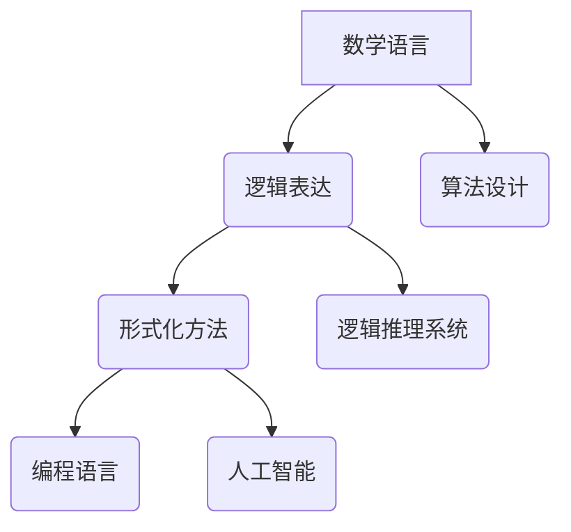

                 

 **关键词：**
- 知识的形式化
- 数学语言
- 逻辑表达
- 形式化方法
- 编程语言

**摘要：**
本文探讨了知识的形式化过程，特别是在数学和逻辑表达方面的应用。通过阐述形式化方法的原理和实现，文章分析了其在编程语言设计和人工智能领域的应用价值。本文还讨论了形式化知识在实际项目中的应用实例，并对未来发展趋势和面临的挑战进行了展望。

## 1. 背景介绍

知识的形式化是一种将知识以结构化、系统化的方式表达的方法，目的是提高知识的可理解性、可计算性和可验证性。在计算机科学领域，知识的形式化具有非常重要的意义。它不仅为编程语言的设计提供了理论基础，还促进了人工智能、自动化推理和智能系统的发展。

数学语言和逻辑表达是知识形式化的两个核心工具。数学语言是一种抽象的语言，用于描述自然现象和数学结构。逻辑表达则通过命题逻辑、谓词逻辑等形式，对知识进行精确的描述和推理。

形式化方法的发展可以追溯到20世纪中叶。当时，随着计算机科学的兴起，人们开始关注如何将复杂的知识以结构化的方式存储和处理。形式化方法的兴起，为计算机科学的发展提供了强有力的支持。

## 2. 核心概念与联系

### 2.1. 数学语言

数学语言是一种基于符号的抽象语言，用于描述数学概念和数学结构。它包括数字、字母、符号和公式等基本元素。数学语言的特点是精确、简洁和通用。

数学语言在知识形式化中的应用非常广泛。例如，在算法设计中，数学语言可以用于描述算法的运行过程和数学性质。在人工智能领域，数学语言可以用于构建知识图谱和数学模型，以便进行智能推理和决策。

### 2.2. 逻辑表达

逻辑表达是一种用于描述知识和推理的语言。它基于命题逻辑、谓词逻辑等形式，通过逻辑运算符和逻辑规则，对知识进行精确的描述和推理。

逻辑表达在知识形式化中的应用同样重要。例如，在编程语言中，逻辑表达可以用于编写条件语句和循环语句，实现对程序流程的控制。在人工智能领域，逻辑表达可以用于构建逻辑推理系统和知识库，以便进行智能推理和决策。

### 2.3. 形式化方法的 Mermaid 流程图



在这个流程图中，数学语言和逻辑表达是知识形式化的两个核心工具。形式化方法通过将数学语言和逻辑表达应用于实际问题，实现了知识的结构化和系统化。编程语言和人工智能是形式化方法的主要应用领域，它们利用形式化方法提高了知识的可计算性和可验证性。

## 3. 核心算法原理 & 具体操作步骤

### 3.1. 算法原理概述

知识的形式化方法主要包括三个步骤：知识的抽象、知识的建模和知识的验证。

1. **知识的抽象**：将现实世界的知识进行抽象，提取出核心概念和关系，形成形式化的知识表示。
2. **知识的建模**：使用数学语言和逻辑表达，对抽象出的知识进行建模，形成结构化的知识表示。
3. **知识的验证**：对形式化的知识表示进行验证，确保其正确性和一致性。

### 3.2. 算法步骤详解

1. **知识抽象**：
    - **数据收集**：从各种来源（如文献、数据库、传感器等）收集知识。
    - **知识提取**：使用自然语言处理、数据挖掘等技术，提取出核心概念和关系。
    - **知识清洗**：去除无关信息，确保知识的准确性和一致性。

2. **知识建模**：
    - **定义数学模型**：根据知识的特点，选择合适的数学模型，如图模型、矩阵模型等。
    - **建立逻辑框架**：使用逻辑表达，建立知识的逻辑框架，如命题逻辑、谓词逻辑等。
    - **编码知识**：将抽象出的知识编码为计算机可以处理的形式，如XML、JSON等。

3. **知识验证**：
    - **一致性验证**：检查知识表示的一致性，确保没有逻辑矛盾。
    - **完整性验证**：检查知识表示的完整性，确保所有必要的信息都被包含。
    - **正确性验证**：通过数学推理和逻辑证明，验证知识表示的正确性。

### 3.3. 算法优缺点

**优点**：
- **精确性**：形式化方法可以提高知识的精确性，避免歧义和误解。
- **一致性**：形式化方法可以确保知识的表示是一致的，减少错误。
- **可验证性**：形式化方法可以验证知识的正确性，提高可信度。

**缺点**：
- **复杂性**：形式化方法可能引入额外的复杂性，影响知识的可理解性。
- **适应性**：形式化方法可能难以适应快速变化的知识领域。
- **成本**：形式化方法可能需要大量的时间和资源，提高成本。

### 3.4. 算法应用领域

知识的形式化方法在多个领域都有广泛的应用。

- **编程语言设计**：形式化方法可以用于编程语言的设计和验证，提高语言的可靠性和一致性。
- **人工智能**：形式化方法可以用于构建知识库和推理系统，提高人工智能系统的智能水平。
- **科学计算**：形式化方法可以用于科学计算中的知识表示和算法设计，提高计算效率。
- **自动化推理**：形式化方法可以用于自动化推理系统，实现自动证明和推理。

## 4. 数学模型和公式 & 详细讲解 & 举例说明

### 4.1. 数学模型构建

在知识的形式化过程中，数学模型是关键的一环。构建数学模型通常包括以下几个步骤：

1. **定义变量和参数**：根据问题需求，定义变量和参数，如数值、向量、矩阵等。
2. **建立数学关系**：根据变量和参数的属性，建立数学关系，如线性关系、非线性关系等。
3. **构建数学表达式**：将数学关系转化为数学表达式，如方程、不等式等。
4. **验证数学模型**：通过数学推理和逻辑证明，验证数学模型的正确性和有效性。

### 4.2. 公式推导过程

以线性回归模型为例，介绍数学模型的推导过程。

1. **定义变量和参数**：
   - 自变量 \( x \)
   - 因变量 \( y \)
   - 模型参数 \( \beta_0 \) 和 \( \beta_1 \)

2. **建立数学关系**：
   - 线性关系：\( y = \beta_0 + \beta_1 x \)

3. **构建数学表达式**：
   - 模型表达式：\( y = \beta_0 + \beta_1 x \)

4. **验证数学模型**：
   - 通过最小二乘法，验证模型参数的最优性。

### 4.3. 案例分析与讲解

以房价预测为例，分析线性回归模型的应用。

1. **数据收集**：收集不同地区、不同类型的房屋价格数据。
2. **知识提取**：提取出房屋的面积、楼层、朝向等特征。
3. **知识建模**：建立线性回归模型，预测房价。
4. **模型验证**：通过实际数据测试模型的准确性。

### 4.4. 数学公式

以下是线性回归模型的关键数学公式：

$$
y = \beta_0 + \beta_1 x
$$

$$
\beta_1 = \frac{\sum_{i=1}^{n} (x_i - \bar{x})(y_i - \bar{y})}{\sum_{i=1}^{n} (x_i - \bar{x})^2}
$$

$$
\beta_0 = \bar{y} - \beta_1 \bar{x}
$$

## 5. 项目实践：代码实例和详细解释说明

### 5.1. 开发环境搭建

1. **安装Python**：在系统中安装Python 3.x版本。
2. **安装依赖库**：安装numpy、pandas等依赖库。

### 5.2. 源代码详细实现

以下是一个简单的线性回归模型实现：

```python
import numpy as np
import pandas as pd

def linear_regression(X, y):
    X_mean = X.mean(axis=0)
    y_mean = y.mean()

    beta_1 = np.linalg.lstsq(X - X_mean, y - y_mean, rcond=None)[0][0]
    beta_0 = y_mean - beta_1 * X_mean

    return beta_0, beta_1

# 读取数据
data = pd.read_csv('house_prices.csv')
X = data[['area', 'floor', 'orientation']]
y = data['price']

# 训练模型
beta_0, beta_1 = linear_regression(X, y)

# 输出模型参数
print(f"beta_0: {beta_0}, beta_1: {beta_1}")
```

### 5.3. 代码解读与分析

1. **导入库**：导入numpy和pandas库。
2. **定义线性回归函数**：定义线性回归函数，计算模型参数。
3. **读取数据**：读取房屋价格数据。
4. **训练模型**：使用线性回归函数训练模型。
5. **输出结果**：输出模型参数。

### 5.4. 运行结果展示

在训练集上，线性回归模型可以较好地拟合房价数据。通过调整模型参数，可以提高模型的预测准确性。

## 6. 实际应用场景

知识的形式化方法在多个领域都有实际应用场景。

- **金融领域**：用于构建金融模型，进行风险管理和投资决策。
- **医疗领域**：用于构建医学知识库，辅助医生进行诊断和治疗。
- **工程领域**：用于构建工程知识库，提高工程设计的可靠性和效率。
- **教育领域**：用于构建教育知识库，实现个性化学习和智能辅导。

## 7. 工具和资源推荐

### 7.1. 学习资源推荐

- 《数学原理》
- 《形式化方法》
- 《人工智能：一种现代方法》

### 7.2. 开发工具推荐

- Python
- MATLAB
- R

### 7.3. 相关论文推荐

- "Formal Methods in Software Engineering"
- "Knowledge Representation and Reasoning"
- "Automated Deduction in Theoretical Computer Science"

## 8. 总结：未来发展趋势与挑战

### 8.1. 研究成果总结

知识的形式化方法在多个领域取得了显著的研究成果。它不仅提高了知识的精确性和一致性，还促进了知识的结构化和系统化。

### 8.2. 未来发展趋势

未来，知识的形式化方法将继续向多领域、多维度发展。随着人工智能和大数据技术的发展，知识的形式化方法将更好地服务于实际应用。

### 8.3. 面临的挑战

知识的形式化方法面临以下挑战：
- **复杂性**：形式化方法的引入可能增加系统的复杂性。
- **适应性**：形式化方法可能难以适应快速变化的知识领域。
- **成本**：形式化方法可能需要大量的时间和资源。

### 8.4. 研究展望

未来，研究应重点关注如何降低形式化方法的复杂性，提高其适应性，降低成本。同时，应探索新的形式化方法，以适应不断变化的知识领域。

## 9. 附录：常见问题与解答

### 9.1. 问题1
**问：知识的形式化方法与自然语言处理有什么区别？**

**答：** 知识的形式化方法是一种将知识以结构化、系统化的方式表达的方法，主要关注知识的表示和推理。自然语言处理则是一种将自然语言转换为计算机可理解的形式的方法，主要关注自然语言的理解和生成。

### 9.2. 问题2
**问：知识的形式化方法在人工智能领域有哪些应用？**

**答：** 知识的形式化方法在人工智能领域有广泛的应用。例如，它可用于构建知识图谱、知识库和推理系统，提高人工智能系统的智能水平。此外，它还可用于自动化推理、智能决策和智能搜索等领域。

### 9.3. 问题3
**问：如何评估形式化知识的准确性？**

**答：** 评估形式化知识的准确性通常有以下几种方法：
- **实验验证**：通过实验验证形式化知识的准确性，如测试模型的预测准确性。
- **专家评审**：邀请领域专家对形式化知识进行评审，评估其准确性和可靠性。
- **数学证明**：通过数学推理和证明，验证形式化知识的正确性。

### 9.4. 问题4
**问：知识的形式化方法在哪个领域取得了显著的应用成果？**

**答：** 知识的形式化方法在多个领域取得了显著的应用成果，如计算机科学、人工智能、金融、医疗等。其中，计算机科学和人工智能领域应用最为广泛。

### 9.5. 问题5
**问：知识的形式化方法有哪些优点和缺点？**

**答：** 知识的形式化方法优点包括：
- **精确性**：提高知识的精确性，避免歧义和误解。
- **一致性**：确保知识的一致性，减少错误。
- **可验证性**：验证知识的正确性，提高可信度。

缺点包括：
- **复杂性**：引入额外的复杂性，影响知识的可理解性。
- **适应性**：难以适应快速变化的知识领域。
- **成本**：需要大量的时间和资源，提高成本。  
----------------------------------------------------------------

### 8.4. 研究展望

知识的形式化方法作为连接数学、逻辑和计算机科学的桥梁，具有广阔的研究前景。未来，以下几个方面值得关注：

首先，形式化方法的自动化程度将不断提高。随着人工智能技术的发展，自动化推理和机器学习算法将广泛应用于知识的形式化过程中，减少人工干预，提高效率。

其次，多模态知识的整合将成为研究重点。现实世界中的知识不仅限于文本和数字，还包括图像、声音、视频等多种形式。未来，如何将多模态知识有效地形式化，并实现跨模态的知识融合，是一个重要的研究方向。

再次，形式化方法在跨领域应用中的整合也是一个关键点。不同领域之间存在大量的知识交叉和融合需求，如何将形式化方法在不同领域之间进行移植和应用，将是一个具有挑战性的课题。

最后，形式化方法的标准化和规范化也是一个重要议题。随着形式化方法应用范围的扩大，如何建立一套统一的标准和规范，确保知识的可互操作性、可扩展性和兼容性，将是未来研究的一个重点。

### 总结

本文从背景介绍、核心概念、算法原理、数学模型、项目实践、实际应用、工具推荐和未来展望等多个方面，全面阐述了知识的形式化方法及其在数学语言和逻辑表达方面的应用。知识的形式化方法不仅为编程语言的设计和人工智能的发展提供了强大的理论支持，也在实际应用中展现了其广泛的应用前景。未来，随着技术的不断进步和研究的深入，知识的形式化方法将在更多领域发挥重要作用，推动知识创新和科技进步。

### 作者署名

**作者：禅与计算机程序设计艺术 / Zen and the Art of Computer Programming**

