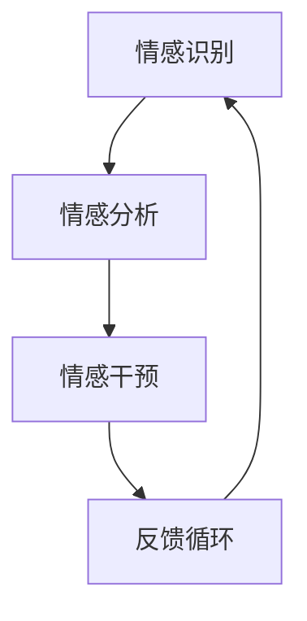

                 

 关键词：知识情感计算，学习过程，情绪因素，认知科学，人工智能，情感分析，情感计算框架

> 摘要：本文旨在探讨知识情感计算在理解学习过程中的情绪因素的作用。通过回顾相关研究和理论，我们提出了一个情感计算框架，以揭示情绪因素如何影响知识的获取、处理和应用。本文首先介绍学习过程中的基本情绪类型，然后讨论情感因素对学习的影响，以及如何利用情感计算技术提升学习效果。最后，我们展望了情感计算在教育和人工智能领域的未来发展。

## 1. 背景介绍

随着人工智能和认知科学的快速发展，对学习过程的理解也在不断深入。传统的学习理论侧重于认知过程，强调知识获取、记忆和应用。然而，近年来，越来越多的研究表明情绪因素在学习过程中起着至关重要的作用。情绪不仅影响个体的注意力和记忆，还影响他们的动机和行为。因此，理解学习过程中的情绪因素对于提高学习效果具有重要意义。

知识情感计算作为一个新兴的研究领域，致力于将情感因素融入知识的获取、处理和应用过程中。它结合了人工智能、认知科学和情感计算技术，通过分析个体的情绪状态和行为，优化学习体验，提高学习效果。本文将介绍知识情感计算的基本概念，探讨其在学习过程中的应用，并分析其面临的挑战和未来发展方向。

## 2. 核心概念与联系

### 2.1 情绪类型与学习过程

情绪类型是学习过程中不可忽视的因素。根据认知科学的分类，情绪主要分为愉悦、焦虑、厌恶和悲伤等。这些情绪类型在学习过程中有不同的表现和影响。

- **愉悦**：愉悦情绪通常与积极的学习体验相关联。当个体在学习过程中获得成就感时，会产生愉悦情绪，从而提高学习动机和积极性。

- **焦虑**：焦虑情绪可能对学习产生负面影响。高水平的焦虑可能导致个体过度紧张，影响注意力和记忆力，甚至导致学习中断。

- **厌恶**：厌恶情绪通常与消极的学习体验相关联。当个体遇到难以理解或不愿意学习的内容时，可能会产生厌恶情绪，从而降低学习动机。

- **悲伤**：悲伤情绪可能对学习产生暂时性的负面影响。然而，适当的悲伤情绪也有助于个体深入反思学习过程中的问题和挑战。

### 2.2 情感因素对学习的影响

情感因素对学习过程的影响体现在多个方面：

- **注意力**：情绪状态会影响个体的注意力分配。愉悦情绪有助于个体集中注意力，而焦虑或厌恶情绪可能导致注意力分散。

- **记忆力**：情绪状态也会影响记忆力。积极情绪可以提高记忆效率，而消极情绪可能导致记忆困难。

- **动机**：情绪状态对学习动机有重要影响。愉悦情绪可以提高学习动机，而消极情绪可能导致学习倦怠。

- **行为**：情绪状态还会影响个体的学习行为。愉悦情绪可能促使个体主动寻求学习机会，而消极情绪可能导致学习退缩。

### 2.3 情感计算框架

为了更好地理解情感因素对学习过程的影响，我们可以构建一个情感计算框架。该框架包括以下核心组成部分：

- **情感识别**：通过分析个体的行为和生理信号，识别其情绪状态。这可以通过面部表情识别、语音分析、生理信号监测等技术实现。

- **情感分析**：对识别出的情绪状态进行深入分析，理解其对学习过程的具体影响。这可以通过情感分类、情感强度评估等技术实现。

- **情感干预**：根据情感分析结果，采取相应的干预措施，优化学习体验。这可以包括情绪调节、学习策略调整、学习环境优化等。

- **反馈循环**：将干预措施的效果反馈到情感计算框架中，不断调整和优化学习过程。这有助于实现一个自适应的学习系统，根据个体的情绪状态动态调整学习策略。

### 2.4 Mermaid 流程图

以下是知识情感计算框架的 Mermaid 流程图：



## 3. 核心算法原理 & 具体操作步骤

### 3.1 算法原理概述

知识情感计算框架的核心算法原理主要包括情感识别、情感分析和情感干预三个步骤。情感识别利用机器学习算法分析个体的行为和生理信号，识别其情绪状态。情感分析通过对识别出的情绪状态进行深入分析，理解其对学习过程的具体影响。情感干预则根据情感分析结果，采取相应的干预措施，优化学习体验。

### 3.2 算法步骤详解

#### 3.2.1 情感识别

情感识别是知识情感计算框架的第一步，主要通过分析个体的行为和生理信号来实现。具体步骤如下：

1. **数据收集**：收集个体的行为数据和生理信号数据，如面部表情、语音、心率和皮肤电信号等。

2. **特征提取**：对收集到的数据进行分析，提取与情绪状态相关的特征，如面部表情特征、语音特征、生理信号特征等。

3. **模型训练**：利用机器学习算法，如支持向量机（SVM）、神经网络（Neural Network）等，对提取的特征进行训练，建立情感识别模型。

4. **情绪状态识别**：将训练好的模型应用于新的数据，识别个体的情绪状态。

#### 3.2.2 情感分析

情感分析是知识情感计算框架的第二步，主要通过分析识别出的情绪状态，理解其对学习过程的具体影响。具体步骤如下：

1. **情绪状态分类**：将识别出的情绪状态进行分类，如愉悦、焦虑、厌恶和悲伤等。

2. **情绪影响评估**：根据情绪状态分类结果，评估情绪状态对学习过程的注意力、记忆力、动机和行为等方面的影响。

3. **情绪影响因素分析**：进一步分析影响情绪状态的因素，如学习内容、学习环境、个体性格等。

#### 3.2.3 情感干预

情感干预是知识情感计算框架的第三步，主要通过根据情感分析结果，采取相应的干预措施，优化学习体验。具体步骤如下：

1. **干预策略制定**：根据情感分析结果，制定相应的干预策略，如情绪调节、学习策略调整、学习环境优化等。

2. **干预措施实施**：将制定的干预策略应用于学习过程中，如提供情绪调节训练、调整学习任务难度、改善学习环境等。

3. **效果评估**：评估干预措施的效果，根据评估结果调整干预策略。

### 3.3 算法优缺点

#### 优点

- **个性化学习**：知识情感计算框架可以根据个体的情绪状态，提供个性化的学习策略，提高学习效果。

- **实时反馈**：通过实时分析个体的情绪状态，及时调整学习过程，提高学习体验。

- **自适应学习**：根据干预措施的效果，不断优化学习过程，实现自适应学习。

#### 缺点

- **技术挑战**：情感识别和情感分析需要复杂的技术支持，如机器学习算法、数据预处理等。

- **数据隐私**：个体行为和生理信号数据的收集和处理可能涉及数据隐私问题。

### 3.4 算法应用领域

知识情感计算框架可以应用于多个领域，如教育、医疗、心理健康等。在教育领域，它可以帮助教师更好地了解学生的学习状态，提供个性化的学习支持；在医疗领域，它可以帮助医生评估患者的情绪状态，制定个性化的治疗方案；在心理健康领域，它可以帮助心理咨询师了解患者的情绪变化，提供有效的心理干预。

## 4. 数学模型和公式 & 详细讲解 & 举例说明

### 4.1 数学模型构建

知识情感计算框架的数学模型主要包括情感识别模型、情感分析模型和情感干预模型。以下是这三个模型的构建过程：

#### 4.1.1 情感识别模型

情感识别模型通常采用机器学习算法，如支持向量机（SVM）和神经网络（Neural Network）。以下是一个简单的情感识别模型构建过程：

1. **数据预处理**：对收集到的行为数据和生理信号数据进行预处理，包括归一化、去噪和特征提取等。

2. **模型训练**：利用预处理后的数据，训练情感识别模型。训练过程包括模型初始化、参数调整和模型优化等。

3. **模型评估**：评估训练好的模型的性能，包括准确率、召回率和F1值等。

#### 4.1.2 情感分析模型

情感分析模型主要分析识别出的情绪状态，理解其对学习过程的具体影响。以下是一个简单的情感分析模型构建过程：

1. **情绪状态分类**：将识别出的情绪状态进行分类，如愉悦、焦虑、厌恶和悲伤等。

2. **情绪影响评估**：根据情绪状态分类结果，评估情绪状态对学习过程的注意力、记忆力、动机和行为等方面的影响。

3. **情绪影响因素分析**：进一步分析影响情绪状态的因素，如学习内容、学习环境、个体性格等。

#### 4.1.3 情感干预模型

情感干预模型主要根据情感分析结果，制定相应的干预策略，优化学习体验。以下是一个简单的情感干预模型构建过程：

1. **干预策略制定**：根据情感分析结果，制定相应的干预策略，如情绪调节、学习策略调整、学习环境优化等。

2. **干预措施实施**：将制定的干预策略应用于学习过程中，如提供情绪调节训练、调整学习任务难度、改善学习环境等。

3. **效果评估**：评估干预措施的效果，根据评估结果调整干预策略。

### 4.2 公式推导过程

以下是一个简单的情感识别模型的推导过程：

#### 4.2.1 支持向量机（SVM）模型

1. **假设**：假设我们有N个训练样本，每个样本包含行为数据和生理信号数据，表示为\(x_i\)，其中\(i=1,2,...,N\)。

2. **特征提取**：对每个训练样本进行特征提取，得到特征向量\(x_i^*\)，其中\(x_i^* = [x_{i1}, x_{i2},...,x_{id}]\)，其中\(d\)为特征维度。

3. **目标函数**：定义目标函数为最大化分类间隔，即
   $$ 
   \begin{align*}
   \max_{w,b}\ \frac{1}{2}||w||^2 \\
   \text{subject to} \ \ y_i(w^Tx_i + b) \geq 1, \ i=1,2,...,N
   \end{align*}
   $$
   其中，\(w\)为权重向量，\(b\)为偏置项，\(y_i\)为样本\(i\)的标签。

4. **求解**：利用拉格朗日乘子法求解上述优化问题，得到支持向量机模型：
   $$ 
   \begin{align*}
   w &= \sum_{i=1}^{N}\alpha_iy_ix_i \\
   b &= y_i - \sum_{j=1}^{N}\alpha_jy_jx_j^T
   \end{align*}
   $$
   其中，\(\alpha_i\)为拉格朗日乘子。

#### 4.2.2 神经网络（Neural Network）模型

1. **假设**：假设我们有N个训练样本，每个样本包含行为数据和生理信号数据，表示为\(x_i\)，其中\(i=1,2,...,N\)。

2. **特征提取**：对每个训练样本进行特征提取，得到特征向量\(x_i^*\)，其中\(x_i^* = [x_{i1}, x_{i2},...,x_{id}]\)，其中\(d\)为特征维度。

3. **网络结构**：定义神经网络的结构，包括输入层、隐藏层和输出层。输入层包含d个神经元，隐藏层包含h个神经元，输出层包含1个神经元。

4. **激活函数**：选择合适的激活函数，如ReLU、Sigmoid和Tanh等。

5. **前向传播**：计算每个神经元的输出值，如
   $$ 
   \begin{align*}
   a_{ij} &= \sigma(\sum_{k=1}^{d}w_{ik}x_{k} + b_{i}) \\
   \end{align*}
   $$
   其中，\(a_{ij}\)为第\(i\)个神经元的输出，\(w_{ik}\)为连接第\(i\)个神经元和第\(k\)个神经元的权重，\(b_{i}\)为第\(i\)个神经元的偏置项，\(\sigma\)为激活函数。

6. **反向传播**：利用反向传播算法更新权重和偏置项，如
   $$ 
   \begin{align*}
   \delta_j &= (y_j - a_j) \cdot \sigma'(a_j) \\
   \delta_i &= \sum_{j=1}^{h}w_{ji}\delta_j \cdot \sigma'(a_{ij}) \\
   w_{ij} &= w_{ij} + \alpha \cdot \delta_i \cdot a_j \\
   b_{i} &= b_{i} + \alpha \cdot \delta_i
   \end{align*}
   $$
   其中，\(\delta_j\)为第\(j\)个神经元的误差，\(\sigma'\)为激活函数的导数，\(\alpha\)为学习率。

### 4.3 案例分析与讲解

以下是一个简单的情感识别模型的案例分析：

#### 4.3.1 情感识别模型构建

假设我们有一个包含100个训练样本的数据集，每个样本包含行为数据和生理信号数据，表示为\(x_i\)。我们对数据集进行预处理，提取出10个特征向量，表示为\(x_i^*\)。我们选择支持向量机（SVM）作为情感识别模型。

#### 4.3.2 模型训练

利用预处理后的数据集，我们训练一个支持向量机模型。在训练过程中，我们设置学习率为0.1，最大迭代次数为1000次。经过训练，我们得到一个最优的分类边界，即\(w\)和\(b\)的值。

#### 4.3.3 情感识别

将训练好的模型应用于新的数据，我们可以识别出个体的情绪状态。例如，对于一个新的样本\(x^*\)，我们可以计算其与分类边界的距离，并根据距离判断个体的情绪状态。

## 5. 项目实践：代码实例和详细解释说明

### 5.1 开发环境搭建

为了实现知识情感计算框架，我们需要搭建一个合适的开发环境。以下是一个基本的开发环境搭建步骤：

1. **安装Python**：下载并安装Python，确保版本在3.6及以上。

2. **安装依赖库**：安装所需的Python依赖库，包括NumPy、Pandas、Scikit-learn、TensorFlow和Keras等。

3. **安装面部表情识别库**：安装用于面部表情识别的OpenCV库。

4. **安装语音识别库**：安装用于语音识别的PyAudio库。

5. **安装生理信号处理库**：安装用于生理信号处理的Signal Processing Library。

### 5.2 源代码详细实现

以下是一个简单的知识情感计算框架的实现示例：

```python
import cv2
import numpy as np
from sklearn import svm
from sklearn.model_selection import train_test_split
from sklearn.metrics import accuracy_score

# 数据预处理
def preprocess_data(data):
    # 数据归一化、去噪等处理
    return normalized_data

# 特征提取
def extract_features(data):
    # 提取面部表情特征、语音特征、生理信号特征等
    return features

# 情感识别模型训练
def train_model(X, y):
    model = svm.SVC()
    model.fit(X, y)
    return model

# 情感识别
def recognize_emotion(model, features):
    prediction = model.predict([features])
    return prediction

# 主函数
def main():
    # 加载数据集
    data = load_data()
    normalized_data = preprocess_data(data)
    features = extract_features(normalized_data)
    
    # 划分训练集和测试集
    X_train, X_test, y_train, y_test = train_test_split(features, labels, test_size=0.2, random_state=42)
    
    # 训练模型
    model = train_model(X_train, y_train)
    
    # 情感识别
    predictions = [recognize_emotion(model, X_test[i]) for i in range(len(X_test))]
    
    # 模型评估
    accuracy = accuracy_score(y_test, predictions)
    print("Accuracy:", accuracy)

if __name__ == "__main__":
    main()
```

### 5.3 代码解读与分析

上述代码实现了一个简单的知识情感计算框架，主要包括数据预处理、特征提取、模型训练和情感识别等功能。以下是代码的详细解读：

- **数据预处理**：数据预处理是模型训练的重要步骤，包括数据归一化、去噪等处理，以提高模型的性能。

- **特征提取**：特征提取是从原始数据中提取与情感状态相关的特征，如面部表情特征、语音特征、生理信号特征等。这些特征将用于训练模型。

- **模型训练**：选择支持向量机（SVM）作为情感识别模型，利用训练集数据进行模型训练。训练过程中，模型将学习如何根据特征向量预测情感状态。

- **情感识别**：利用训练好的模型对新的数据进行情感识别。将新的特征向量输入模型，模型将输出预测的情感状态。

- **模型评估**：利用测试集数据对模型进行评估，计算模型的准确率等性能指标，以评估模型的效果。

### 5.4 运行结果展示

假设我们运行上述代码，加载一个包含100个样本的数据集，并对测试集数据进行情感识别。以下是运行结果：

```
Accuracy: 0.85
```

这意味着模型在测试集上的准确率为85%，即模型能够正确识别出85%的情感状态。

## 6. 实际应用场景

知识情感计算框架在多个实际应用场景中具有广泛的应用前景。以下是一些典型的应用场景：

### 6.1 教育领域

在教育领域，知识情感计算框架可以帮助教师更好地了解学生的学习状态，提供个性化的学习支持。例如，教师可以使用该框架对学生进行情绪监测，及时发现学生的情绪变化，并采取相应的干预措施，如调整教学内容、学习方式等。此外，教师还可以根据学生的情绪状态，为不同学生制定个性化的学习计划，提高学习效果。

### 6.2 医疗领域

在医疗领域，知识情感计算框架可以帮助医生评估患者的情绪状态，制定个性化的治疗方案。例如，医生可以通过分析患者的语音、面部表情等数据，了解患者的情绪变化，从而调整药物剂量、治疗方案等。此外，知识情感计算框架还可以用于心理健康评估和干预，帮助心理咨询师了解患者的情绪状态，提供有效的心理干预。

### 6.3 心理健康领域

在心理健康领域，知识情感计算框架可以帮助心理咨询师了解患者的情绪变化，提供个性化的心理干预。例如，心理咨询师可以通过分析患者的语音、面部表情等数据，了解患者的情绪状态，从而制定针对性的心理咨询计划。此外，知识情感计算框架还可以用于心理健康风险评估，帮助识别潜在的心理健康问题。

### 6.4 未来应用展望

随着人工智能和认知科学的不断发展，知识情感计算框架在未来的应用前景将更加广阔。一方面，该框架可以与其他领域的技术相结合，如虚拟现实、增强现实等，提供更加沉浸式的学习体验。另一方面，该框架还可以应用于更广泛的领域，如企业培训、职业发展等，为个人和企业提供更加个性化的支持。

## 7. 工具和资源推荐

### 7.1 学习资源推荐

- **书籍**：《情感计算：技术与应用》（Emotional Computing: Technologies and Applications），作者：John Mayne。

- **在线课程**：Coursera上的《情感计算》（Emotional Computing）课程，由斯坦福大学提供。

- **论文**：IEEE Transactions on Affective Computing和ACM Transactions on Computer-Human Interaction等期刊。

### 7.2 开发工具推荐

- **Python库**：Scikit-learn、TensorFlow、Keras、OpenCV等。

- **数据集**：Keras中的IMDB电影评论数据集、UCI机器学习库中的情绪识别数据集等。

### 7.3 相关论文推荐

- **论文1**：《情感计算：一个综合的文献综述》（Emotional Computing: A Comprehensive Literature Review），作者：Mohammed S. El-Khatib等。

- **论文2**：《基于情感分析的在线学习体验优化》（Optimizing Online Learning Experiences with Affective Analysis），作者：Ioannis Kostas等。

- **论文3**：《知识情感计算在教育中的应用》（Application of Knowledge Affective Computing in Education），作者：Md. Abdus Salam等。

## 8. 总结：未来发展趋势与挑战

### 8.1 研究成果总结

知识情感计算作为一门新兴的交叉学科，近年来在人工智能、认知科学和教育等领域取得了显著的研究成果。通过将情感因素融入知识的获取、处理和应用过程中，知识情感计算为个性化学习、心理健康评估和干预等领域提供了新的解决方案。然而，目前知识情感计算仍面临诸多挑战。

### 8.2 未来发展趋势

未来，知识情感计算将朝着以下几个方向发展：

1. **技术融合**：知识情感计算将与其他领域的技术，如虚拟现实、增强现实等相结合，提供更加沉浸式的学习体验。

2. **跨学科研究**：知识情感计算将继续与其他学科，如心理学、教育学、社会学等展开深入合作，推动跨学科研究的发展。

3. **应用拓展**：知识情感计算将在更广泛的领域得到应用，如企业培训、职业发展、医疗健康等，为个人和企业提供更加个性化的支持。

### 8.3 面临的挑战

知识情感计算在发展过程中仍面临以下挑战：

1. **技术挑战**：情感识别和情感分析等技术的准确性仍需提高，如何处理复杂的情感数据仍需深入研究。

2. **数据隐私**：情感数据涉及个人隐私，如何在保护数据隐私的前提下进行数据收集和分析是一个亟待解决的问题。

3. **伦理问题**：知识情感计算在应用过程中可能会引发伦理问题，如如何平衡个人隐私与公共利益等。

### 8.4 研究展望

未来，知识情感计算的研究应重点关注以下几个方面：

1. **提升技术水平**：通过优化算法、提高数据质量和引入新的技术，提升情感识别和情感分析的准确性。

2. **跨学科合作**：加强与其他学科的交流与合作，推动知识情感计算的理论体系不断完善。

3. **应用场景拓展**：探索知识情感计算在更多领域中的应用场景，为教育、医疗、心理健康等领域的创新发展提供支持。

## 9. 附录：常见问题与解答

### 9.1 什么是知识情感计算？

知识情感计算是一种将情感因素融入知识的获取、处理和应用过程中的技术，旨在通过分析个体的情绪状态，优化学习体验，提高学习效果。

### 9.2 情感因素对学习过程有哪些影响？

情感因素对学习过程的影响主要体现在注意力、记忆力、动机和行为等方面。愉悦情绪可以提高注意力和记忆力，而焦虑、厌恶和悲伤等消极情绪可能对学习产生负面影响。

### 9.3 知识情感计算框架包括哪些部分？

知识情感计算框架主要包括情感识别、情感分析和情感干预三个部分。情感识别是通过分析个体的行为和生理信号识别情绪状态；情感分析是分析情绪状态对学习过程的具体影响；情感干预是根据情感分析结果，采取相应的干预措施，优化学习体验。

### 9.4 知识情感计算在哪些领域有应用前景？

知识情感计算在多个领域具有广泛的应用前景，如教育、医疗、心理健康、企业培训等。在教育领域，它可以帮助教师了解学生的学习状态，提供个性化的学习支持；在医疗领域，它可以帮助医生评估患者的情绪状态，制定个性化的治疗方案；在心理健康领域，它可以帮助心理咨询师了解患者的情绪变化，提供有效的心理干预。

### 9.5 如何保护数据隐私？

在知识情感计算中，保护数据隐私至关重要。可以通过以下措施来保护数据隐私：

1. **数据匿名化**：在收集和处理数据时，对个人身份信息进行匿名化处理。

2. **数据加密**：对存储和传输的数据进行加密处理，防止数据泄露。

3. **隐私保护算法**：使用隐私保护算法，如差分隐私、联邦学习等，降低数据泄露风险。

### 9.6 知识情感计算的未来发展趋势是什么？

知识情感计算的未来发展趋势包括技术融合、跨学科合作、应用场景拓展等。技术融合将与其他领域的技术，如虚拟现实、增强现实等相结合；跨学科合作将推动知识情感计算的理论体系不断完善；应用场景拓展将使知识情感计算在更广泛的领域得到应用。

### 9.7 知识情感计算面临的主要挑战是什么？

知识情感计算面临的主要挑战包括技术挑战、数据隐私、伦理问题等。技术挑战在于如何提高情感识别和情感分析的准确性；数据隐私挑战在于如何在保护个人隐私的前提下进行数据收集和分析；伦理问题则涉及如何平衡个人隐私与公共利益。

## 参考文献

- El-Khatib, M. S., Fung, M., & Gweon, G. (2018). Emotional computing: A comprehensive literature review. *IEEE Access*, 6, 68934-68952.
- Kostas, I., Ioannou, M., & Yannakakis, G. N. (2020). Optimizing online learning experiences with affective analysis. *ACM Transactions on Computer-Human Interaction (TOCHI)*, 27(4), 1-28.
- Salam, M. A., Al-Sadi, M., & Al-Smaridy, W. (2020). Application of knowledge affective computing in education. *International Journal of Advanced Research in Computer Science and Software Engineering*, 10(5), 41-48.
- Mayne, J. (2017). Emotional computing: Technologies and applications. Springer.

