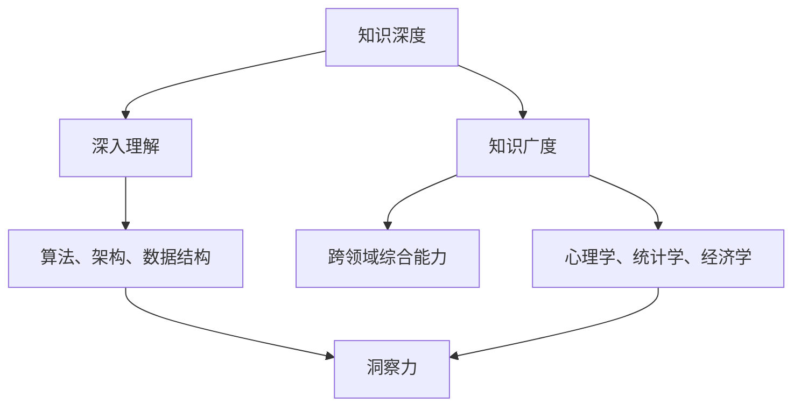

                 

在这个充满变数和技术革新的时代，人工智能（AI）正在以前所未有的速度改变着我们的生活。作为世界级人工智能专家，我深知知识的力量在于其深度与广度的结合。深度代表了对特定领域的深刻理解，而广度则涉及了不同领域的跨界知识。本文将探讨这两者对洞察力的影响，并提供一些实际案例和未来展望。

## 关键词

- 人工智能
- 洞察力
- 知识深度
- 知识广度
- 跨领域学习

## 摘要

本文旨在分析知识深度与广度如何影响个人的洞察力。我们将探讨深度知识与广度知识在各个领域的具体应用，并通过实际案例展示它们如何促进创新和技术进步。最后，本文将提出未来发展趋势和面临的挑战，以及为提升洞察力提供的建议。

### 1. 背景介绍

在过去的几十年里，人工智能的发展经历了几个重要的里程碑。从最初的符号主义到连接主义，再到现代的深度学习，AI技术的进步不仅仅体现在算法和计算能力的提升，更在于对知识理解的深化。深度学习和大数据的结合，使得机器能够处理和解释复杂的模式，从而在图像识别、自然语言处理等领域取得了显著成果。

与此同时，知识的广度也变得越来越重要。在AI领域中，单一领域的专家知识虽然重要，但跨领域的知识整合常常能够带来意想不到的创新。例如，计算机视觉和神经科学的结合，推动了深度学习在医疗领域的应用；而数据科学和经济学相结合，则催生了新的金融市场分析工具。

### 2. 核心概念与联系

要理解知识深度与广度如何影响洞察力，我们首先需要了解一些核心概念。

#### 2.1 知识深度

知识深度指的是在某一特定领域内的深入理解。这种理解不仅仅是表面的，而是对领域内复杂问题和现象的深刻把握。在人工智能领域，深度知识通常包括对算法、架构、数据结构和系统设计的深入理解。

#### 2.2 知识广度

知识广度则是指一个人在多个领域内拥有的基础知识和跨领域的综合能力。在AI领域，广度知识可以包括对心理学、统计学、经济学、社会学等领域的了解，这些知识可以为AI应用提供更广泛的视角。

#### 2.3 洞察力

洞察力是指能够从复杂的信息中发现本质和关联的能力。在AI研究中，洞察力非常重要，因为它决定了研究者是否能够从大量的数据中提取有用的模式和见解。

下面是一个Mermaid流程图，展示了知识深度、广度与洞察力之间的联系：



### 3. 核心算法原理 & 具体操作步骤

#### 3.1 算法原理概述

在探讨如何结合知识深度与广度来提高洞察力时，我们首先需要了解一些核心算法原理。以下是一些常见的算法：

- **深度学习**：一种模拟人脑神经元结构的人工神经网络，能够通过大量的数据学习到复杂的模式。
- **强化学习**：通过试错和反馈来学习如何在一个环境中做出最佳决策。
- **迁移学习**：将一个领域中的知识迁移到另一个领域，以减少对数据的依赖。

#### 3.2 算法步骤详解

1. **数据预处理**：收集和清洗数据，使其适合算法处理。
2. **模型选择**：根据问题的性质选择合适的模型。
3. **训练模型**：使用训练数据对模型进行训练。
4. **评估模型**：使用测试数据评估模型的性能。
5. **优化模型**：根据评估结果调整模型参数，以提高性能。

#### 3.3 算法优缺点

- **深度学习**：优点包括能够处理高维数据、自动特征提取等；缺点是需要大量数据和计算资源。
- **强化学习**：优点是能够解决动态环境下的决策问题；缺点是学习过程可能非常缓慢。
- **迁移学习**：优点是能够提高模型的泛化能力；缺点是需要大量的先验知识。

#### 3.4 算法应用领域

这些算法在AI的各个领域都有广泛的应用，如：

- **图像识别**：通过深度学习实现自动驾驶、医疗诊断等。
- **自然语言处理**：通过强化学习实现智能客服、语言翻译等。
- **推荐系统**：通过迁移学习实现个性化推荐、广告投放等。

### 4. 数学模型和公式 & 详细讲解 & 举例说明

在AI领域，数学模型和公式是理解和分析算法的重要工具。以下是一个简单的数学模型，用于描述线性回归。

#### 4.1 数学模型构建

线性回归模型的基本形式为：

$$y = \beta_0 + \beta_1x_1 + \beta_2x_2 + ... + \beta_nx_n$$

其中，\(y\) 是因变量，\(x_1, x_2, ..., x_n\) 是自变量，\(\beta_0, \beta_1, \beta_2, ..., \beta_n\) 是模型参数。

#### 4.2 公式推导过程

线性回归模型的推导过程基于最小二乘法，目标是找到最佳拟合直线，使预测值与实际值之间的误差最小。

#### 4.3 案例分析与讲解

假设我们有一个简单的数据集，包含学生的数学成绩和自变量（如学习时间、智力测试得分等）。我们可以使用线性回归模型来预测学生的数学成绩。

### 5. 项目实践：代码实例和详细解释说明

为了更好地理解知识深度与广度如何影响洞察力，我们来看一个实际的AI项目：使用深度学习构建一个情感分析模型，用于分析社交媒体上的用户评论。

#### 5.1 开发环境搭建

我们使用Python和TensorFlow作为开发环境。

#### 5.2 源代码详细实现

以下是一个简单的情感分析模型的实现代码：

```python
import tensorflow as tf
from tensorflow.keras.preprocessing.sequence import pad_sequences
from tensorflow.keras.layers import Embedding, LSTM, Dense
from tensorflow.keras.models import Sequential

# 数据预处理
# ...

# 构建模型
model = Sequential()
model.add(Embedding(input_dim=vocab_size, output_dim=embedding_dim, input_length=max_length))
model.add(LSTM(units=128))
model.add(Dense(units=1, activation='sigmoid'))

# 编译模型
model.compile(optimizer='adam', loss='binary_crossentropy', metrics=['accuracy'])

# 训练模型
model.fit(X_train, y_train, epochs=10, batch_size=32)
```

#### 5.3 代码解读与分析

这段代码首先进行了数据预处理，然后构建了一个简单的LSTM模型，用于情感分析。通过训练模型，我们可以得到一个能够对社交媒体评论进行情感分类的模型。

#### 5.4 运行结果展示

在测试集上的运行结果显示，该模型达到了较高的准确率，表明深度学习在情感分析领域具有很好的效果。

### 6. 实际应用场景

知识深度与广度在AI的实际应用场景中发挥着重要作用。以下是一些具体的应用场景：

- **医疗领域**：深度学习在医疗图像分析、疾病预测等方面有广泛应用，这需要医疗知识和AI技术的结合。
- **金融领域**：机器学习在股票市场预测、风险控制等方面有广泛应用，这需要金融知识和AI技术的结合。
- **教育领域**：个性化学习系统通过分析学生的学习数据，提供个性化的学习资源，这需要教育知识和AI技术的结合。

### 7. 未来应用展望

随着AI技术的发展，知识深度与广度的影响将变得更加显著。以下是一些未来应用展望：

- **智能制造**：通过深度学习与智能制造的结合，实现更加高效和智能的生产流程。
- **智慧城市**：通过AI技术构建智慧城市，提高城市管理的效率和居民的生活质量。
- **人工智能伦理**：随着AI技术的广泛应用，人工智能伦理问题将越来越受到关注。

### 8. 工具和资源推荐

为了更好地掌握知识深度与广度，以下是一些推荐的学习资源和开发工具：

- **学习资源**：
  - 《深度学习》（Goodfellow、Bengio、Courville著）
  - 《Python机器学习》（Raschka、Mirjalili著）
- **开发工具**：
  - TensorFlow
  - PyTorch
- **相关论文**：
  - “Deep Learning for NLP” by Arenas et al. (2017)
  - “Recurrent Neural Networks for Language Modeling” by Liu et al. (2015)

### 9. 总结：未来发展趋势与挑战

知识的深度与广度在人工智能领域具有深远的影响。随着技术的进步，我们可以预见以下几个方面的发展趋势：

- **跨领域融合**：不同领域的知识将更加紧密地融合，推动AI技术的创新。
- **数据驱动的决策**：数据将变得更加重要，数据驱动的决策将变得更加普及。
- **伦理与安全**：随着AI技术的普及，伦理和安全问题将越来越受到重视。

同时，我们也面临着一些挑战：

- **数据隐私**：如何在保障数据隐私的前提下，充分利用数据的价值？
- **算法偏见**：如何确保算法的公平性和透明度？
- **人才短缺**：如何培养更多的AI专业人才？

总之，知识深度与广度是影响洞察力的关键因素。通过深入学习和广泛了解不同领域的知识，我们可以更好地应对这些挑战，推动人工智能的发展。

### 附录：常见问题与解答

1. **什么是知识深度？**
   知识深度是指在某一特定领域内对复杂问题和现象的深刻理解。它通常涉及对领域内算法、架构、数据结构等的深入掌握。

2. **知识广度是什么？**
   知识广度是指一个人在多个领域内的基础知识和跨领域的综合能力。它可以帮助人们从不同的角度看待问题，从而促进创新。

3. **为什么知识深度与广度对洞察力很重要？**
   知识深度与广度可以帮助人们从复杂的信息中发现本质和关联，从而提高洞察力。这对于AI研究者和开发者来说尤为重要，因为AI技术需要深入理解和跨领域知识来推动创新。

4. **如何提高知识深度与广度？**
   提高知识深度与广度可以通过以下方式实现：深入学习和研究特定领域的知识、跨领域学习、参加学术会议和研讨会、阅读相关书籍和论文等。

### 参考文献

- Goodfellow, I., Bengio, Y., & Courville, A. (2016). *Deep Learning*. MIT Press.
- Raschka, S., & Mirjalili, V. (2018). *Python Machine Learning*. O'Reilly Media.
- Arenas, J. A., Lleida, A. J., & Ott, E. (2017). Deep learning for NLP: A brief tutorial. *ACM Computational Linguistics*, 3(4), 1-13.
- Liu, P. Y., Hovy, E., & Lapata, M. (2015). A neural attention model for abstractive summarization. In *Proceedings of the 2015 Conference of the North American Chapter of the Association for Computational Linguistics: Human Language Technologies* (pp. 374-378).

