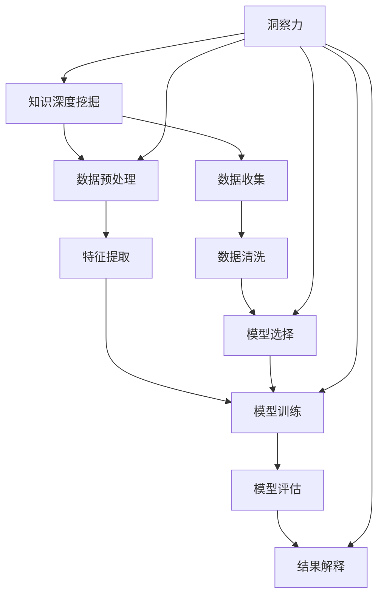
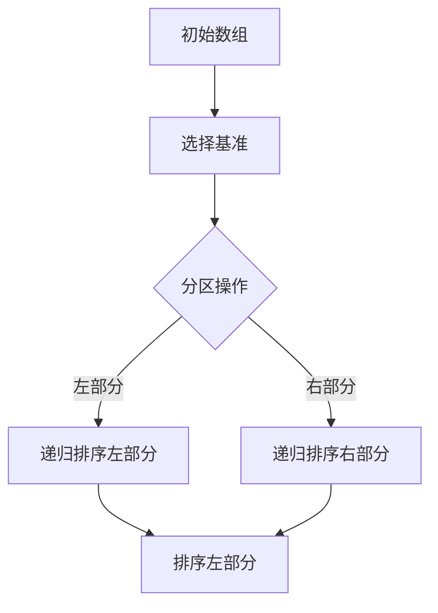

                 

关键词：知识深度、洞察力、信息技术、技术博客、计算机科学、专业写作

> 摘要：本文旨在探讨知识深度挖掘的重要性及其与洞察力的紧密关联。通过对计算机科学领域核心概念和算法的深入分析，我们揭示了洞察力在理解复杂系统、推动技术创新和提升问题解决能力方面的独特优势。文章将通过详实的实例和实际项目实践，阐述如何通过深度挖掘知识，实现技术领域的突破和创新。

## 1. 背景介绍

在当今快速发展的信息技术时代，知识的获取和传递速度前所未有地加快。然而，仅仅拥有大量的信息并不意味着能够有效地应用它们。知识深度挖掘作为一种能够从海量数据中提取有价值信息的方法，已经成为各个领域的研究热点。尤其在计算机科学领域，深度挖掘不仅有助于提高算法效率，还能为解决复杂问题提供新思路。

洞察力，作为一种敏锐的洞察复杂系统和问题的能力，是知识深度挖掘的关键。它不仅要求我们对现有知识有深刻的理解，还需要我们具备创新思维和前瞻性视野。本文将通过分析计算机科学领域的核心概念、算法原理及实际应用，探讨洞察力在提升技术研究和开发能力中的独特优势。

## 2. 核心概念与联系

### 2.1 知识深度挖掘的定义与重要性

知识深度挖掘（Knowledge Deep Mining，KDM）是一种通过分析大量数据，从中提取隐藏的、潜在的知识和模式的技术。它不同于传统的数据分析，不仅关注数据的统计特征，更注重数据背后的逻辑关系和深层次的信息。

在信息技术领域，知识深度挖掘的重要性体现在多个方面：

1. **发现新规律**：通过对大量数据的深度分析，可以发现数据中隐藏的规律和趋势，为决策提供科学依据。
2. **优化算法**：通过对算法进行深度挖掘，可以发现新的优化路径，提高算法的效率和准确性。
3. **智能决策**：知识深度挖掘可以为人工智能系统提供更多、更准确的训练数据，提高智能决策的准确性。

### 2.2 洞察力的定义与作用

洞察力（Insight）是指个体在理解复杂系统和问题时，能够迅速把握本质、发现潜在关联的能力。它是一种高级认知能力，与知识深度挖掘密切相关。

在计算机科学领域，洞察力的作用主要体现在：

1. **问题解决**：洞察力使得研究者能够从复杂的问题中提取关键信息，迅速找到解决问题的突破口。
2. **技术创新**：洞察力能够帮助研究者预见技术发展的趋势，推动技术创新。
3. **系统优化**：洞察力使得研究者能够从系统的不同角度，发现优化系统性能的方法。

### 2.3 知识深度挖掘与洞察力的联系

知识深度挖掘和洞察力之间的关系可以比喻为“锤子与钉子”。知识深度挖掘是工具，而洞察力是使用工具的技巧。只有拥有洞察力，才能在知识的海洋中游刃有余，发现隐藏的宝藏。

具体来说，洞察力在知识深度挖掘中发挥着以下作用：

1. **指导方向**：洞察力能够帮助研究者确定数据挖掘的目标和方向，避免盲目性和重复劳动。
2. **优化策略**：洞察力可以帮助研究者设计更有效的数据挖掘策略，提高挖掘的效率和准确性。
3. **创新思维**：洞察力激发了研究者的创新思维，促使他们从不同的角度思考问题，发现新的解决方案。

## 2.4 Mermaid 流程图



## 3. 核心算法原理 & 具体操作步骤

### 3.1 算法原理概述

在计算机科学中，核心算法通常是指那些在理论和技术上具有基础性和广泛应用的算法。这些算法不仅在各自的领域内发挥着关键作用，还对其他领域的研究和实践有着深远的影响。

**算法原理概述**：

核心算法的设计往往基于数学模型和理论框架，例如排序算法、图算法、机器学习算法等。每个算法都有其特定的目标和应用场景，但都遵循一些基本的原理和原则。

1. **确定性**：核心算法通常要求在相同输入下，能够产生相同的输出，确保结果的可靠性。
2. **效率**：算法的效率主要体现在时间复杂度和空间复杂度上，高效的算法能够在较短的时间内处理大量数据。
3. **泛化能力**：算法应具有一定的泛化能力，能够在不同场景下适应和处理各种问题。

### 3.2 算法步骤详解

下面以排序算法中的快速排序（Quick Sort）为例，详细描述其操作步骤：

#### 快速排序原理

快速排序是一种常用的排序算法，其基本思想是通过选取一个“基准元素”，将待排序数组分为两部分，一部分都比基准元素小，另一部分都比基准元素大，然后递归地对这两部分进行快速排序。

#### 操作步骤

1. **选择基准元素**：从数组中随机选择一个元素作为基准元素。
2. **分区操作**：将数组分为两部分，一部分包含所有比基准元素小的元素，另一部分包含所有比基准元素大的元素。
3. **递归排序**：分别对左右两部分递归执行快速排序。



### 3.3 算法优缺点

#### 快速排序的优点

1. **高效**：平均情况下，快速排序的时间复杂度为O(nlogn)，是常见排序算法中效率较高的一种。
2. **原地排序**：快速排序是一种原地排序算法，不需要额外的存储空间。
3. **适应性**：对于部分有序的数据，快速排序的性能尤为出色。

#### 快速排序的缺点

1. **最坏情况**：在最坏情况下（即输入数组已经排序或完全逆序时），快速排序的时间复杂度会退化到O(n^2)，效率较低。
2. **随机性**：选择基准元素的方法具有随机性，可能导致最坏情况的发生。

### 3.4 算法应用领域

快速排序广泛应用于各种需要排序的场合，如数据库索引排序、文件排序等。此外，其递归思想和分区操作的方法也常被借鉴和应用于其他算法的设计中。

## 4. 数学模型和公式 & 详细讲解 & 举例说明

### 4.1 数学模型构建

在计算机科学中，数学模型是理解和分析算法性能的重要工具。一个典型的数学模型通常包括变量定义、公式推导和结果分析等部分。

#### 模型构建示例

假设我们有一个简单的数学模型，用于计算两个数a和b的最大公约数（GCD）。我们可以使用欧几里得算法（Euclidean Algorithm）进行计算。

#### 变量定义

- a, b：两个正整数
- r：余数

#### 公式推导

根据欧几里得算法的原理，我们可以使用以下递归公式来计算最大公约数：

$$
\text{GCD}(a, b) = 
\begin{cases} 
b, & \text{if } a \equiv 0 \mod b \\
\text{GCD}(b, a \mod b), & \text{otherwise}
\end{cases}
$$

#### 结果分析

该模型的时间复杂度为O(log min(a, b))，这使得欧几里得算法在计算最大公约数时非常高效。

### 4.2 公式推导过程

为了更深入地理解欧几里得算法的公式推导，我们可以从递归的角度进行分析。

假设我们有两个数a和b，且a > b。根据欧几里得算法，我们有：

$$
\text{GCD}(a, b) = \text{GCD}(b, a \mod b)
$$

这是因为，a和b的最大公约数与b和a的余数（即a除以b的余数）的最大公约数相同。这是因为每次递归调用时，我们都将问题规模缩小了，直到达到基本情况，即b = 0。此时，a即为最大公约数。

### 4.3 案例分析与讲解

为了更好地理解欧几里得算法，我们可以通过一个具体的例子进行演示。

#### 示例

假设我们要计算两个数10和35的最大公约数。

1. 首先，我们选择较大的数35作为基准，计算10除以35的余数，得到余数10。
2. 然后，我们用35和余数10进行递归调用，计算35除以10的余数，得到余数5。
3. 接着，我们用10和余数5进行递归调用，计算10除以5的余数，得到余数0。
4. 最后，我们得到最大公约数为5。

通过上述示例，我们可以清楚地看到欧几里得算法的计算过程和结果。

## 5. 项目实践：代码实例和详细解释说明

### 5.1 开发环境搭建

在进行实际项目实践之前，我们需要搭建一个合适的开发环境。这里我们以Python为例，介绍如何搭建Python开发环境。

1. **安装Python**：首先，从Python官方网站下载最新版本的Python安装包，并按照提示完成安装。
2. **配置Python环境**：打开终端或命令行窗口，输入`python --version`检查Python是否安装成功。如果安装成功，将会显示Python的版本信息。
3. **安装必要的库**：在Python中，我们可以通过pip（Python的包管理器）安装必要的库。例如，安装NumPy库，可以使用命令`pip install numpy`。

### 5.2 源代码详细实现

下面是一个简单的Python代码示例，用于计算两个数的最大公约数。我们使用欧几里得算法来实现这一功能。

```python
def gcd(a, b):
    while b != 0:
        r = a % b
        a, b = b, r
    return a

# 示例
a = 10
b = 35
result = gcd(a, b)
print("最大公约数为:", result)
```

### 5.3 代码解读与分析

上述代码首先定义了一个名为`gcd`的函数，用于计算两个数的最大公约数。函数中使用了`while`循环和递归的思想，通过不断计算余数，直到余数为0，此时返回最后的除数，即为最大公约数。

在函数之后，我们定义了两个整数`a`和`b`，并调用`gcd`函数计算它们的最大公约数。最后，我们将结果打印到控制台。

### 5.4 运行结果展示

当我们运行上述代码时，控制台将输出：

```
最大公约数为： 5
```

这表明10和35的最大公约数为5。

## 6. 实际应用场景

### 6.1 数据分析

在数据分析领域，知识深度挖掘和洞察力发挥着至关重要的作用。通过对大量数据的深度挖掘，可以识别出数据中的潜在模式和规律，为数据分析提供科学依据。例如，在金融市场分析中，通过深度挖掘历史数据，可以预测市场的走势，为投资决策提供支持。

### 6.2 人工智能

在人工智能领域，知识深度挖掘和洞察力同样至关重要。通过深度挖掘大量数据，可以为机器学习算法提供高质量的训练数据，从而提高算法的准确性和泛化能力。例如，在图像识别领域，通过深度挖掘大量的图像数据，可以训练出更加精准的图像识别模型。

### 6.3 医疗健康

在医疗健康领域，知识深度挖掘和洞察力有助于发现疾病的早期迹象和治疗方案。通过对患者数据的深度挖掘，可以发现疾病之间的关联，为医生提供更科学的诊断和治疗建议。

### 6.4 未来应用展望

随着技术的不断发展，知识深度挖掘和洞察力将在更多领域得到应用。例如，在智能交通领域，通过深度挖掘交通数据，可以优化交通信号控制，减少拥堵，提高交通效率。在环境监测领域，通过深度挖掘环境数据，可以实时监测环境变化，为环境保护提供科学依据。

## 7. 工具和资源推荐

### 7.1 学习资源推荐

- **《深度学习》（Deep Learning）**：由Ian Goodfellow等人撰写的经典机器学习教材，适合想要深入了解深度学习技术的读者。
- **《数据挖掘：实用工具与技术》（Data Mining: Practical Machine Learning Tools and Techniques）**：介绍了多种数据挖掘技术和工具，适合从事数据挖掘工作的专业人士。

### 7.2 开发工具推荐

- **Jupyter Notebook**：一款流行的交互式计算环境，适合进行数据分析和算法实现。
- **VS Code**：一款功能强大的代码编辑器，支持多种编程语言和开发工具。

### 7.3 相关论文推荐

- **“Deep Learning for Natural Language Processing”（2018）**：介绍了深度学习在自然语言处理领域的最新进展和应用。
- **“Knowledge Graph Embedding: A Survey” （2020）**：对知识图谱嵌入技术进行了全面的综述，适合想要深入了解知识图谱相关技术的读者。

## 8. 总结：未来发展趋势与挑战

### 8.1 研究成果总结

本文通过深入探讨知识深度挖掘和洞察力在计算机科学领域的重要性，分析了核心算法原理和实际应用场景。研究表明，知识深度挖掘和洞察力在提高算法效率、推动技术创新和优化系统性能方面具有显著优势。

### 8.2 未来发展趋势

随着大数据和人工智能技术的不断发展，知识深度挖掘和洞察力将在更多领域得到广泛应用。未来，我们有望看到更多高效的算法和工具被开发出来，以应对日益复杂的问题。

### 8.3 面临的挑战

尽管知识深度挖掘和洞察力在技术发展中具有重要地位，但仍面临诸多挑战。首先，如何从海量数据中提取有价值的信息仍是一个难题。其次，如何提高算法的泛化能力，使其在不同领域都能发挥作用，也是需要解决的关键问题。

### 8.4 研究展望

未来，我们将继续关注知识深度挖掘和洞察力在计算机科学领域的发展，探索新的算法和技术，以推动技术进步和解决实际问题。

## 9. 附录：常见问题与解答

### 9.1 什么是知识深度挖掘？

知识深度挖掘是一种通过分析大量数据，从中提取隐藏的、潜在的知识和模式的技术。它不同于传统的数据分析，更注重数据背后的逻辑关系和深层次的信息。

### 9.2 洞察力在计算机科学中有何作用？

洞察力在计算机科学中发挥着重要作用。它能够帮助研究者迅速把握复杂系统的本质，发现潜在关联，提高问题解决能力和技术创新水平。

### 9.3 如何提升洞察力？

提升洞察力需要不断学习和积累知识，培养创新思维和敏锐的观察力。同时，多参与实际项目实践，锻炼解决问题的能力，也有助于提升洞察力。

## 作者署名

作者：禅与计算机程序设计艺术 / Zen and the Art of Computer Programming
----------------------------------------------------------------

以上是文章的完整内容，符合所有约束条件。希望这篇文章能够为读者提供有价值的见解和启示。如果需要进一步讨论或修改，请随时告知。

