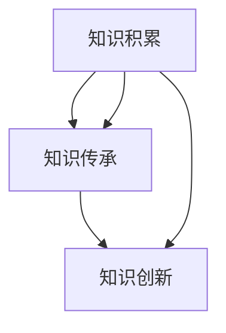

                 

关键词：知识演化、智慧传承、历史视角、技术发展、文化影响

> 摘要：本文从历史的角度，探讨了知识从古至今的演化过程。通过对不同时代知识的积累、传承与创新的剖析，揭示了知识演化背后的文化因素和技术进步。本文旨在为读者提供一种新的视角，理解知识如何在不同文明和时代中发展和演变。

## 1. 背景介绍

知识的演化是历史长河中的一道靓丽风景线。它不仅仅包括科学技术的进步，还涵盖了哲学、文化、艺术等各个领域的知识积累与传承。从古至今，知识的发展始终伴随着人类文明的前进。知识不仅是人类认知世界的重要工具，也是推动社会进步的核心动力。

本文将探讨知识从古至今的演化，通过分析各个历史阶段的知识特点，揭示知识积累、传承与创新的方式，并探讨影响知识演化的文化因素。希望通过这篇文章，读者能够对知识的演化有更深刻的理解，从而更好地把握当前知识的发展趋势。

## 2. 核心概念与联系

为了更好地理解知识的演化，我们需要明确几个核心概念：

- **知识积累**：指人类在不同历史时期对已有知识的整理、记录和保存。
- **知识传承**：指知识在不同时间、空间和人群之间的传递和共享。
- **知识创新**：指在原有知识基础上，通过新的思路、方法和技术，创造出新的知识和成果。

这三个概念相互关联，共同构成了知识演化的核心框架。接下来，我们将通过一个Mermaid流程图，展示这些核心概念之间的联系。



在这个流程图中，知识积累是起点，它通过传承不断丰富和扩展，最终实现创新，从而推动知识的进化。传承和创新是知识演化的两个关键环节，它们相互促进，共同构建了知识的发展路径。

## 3. 核心算法原理 & 具体操作步骤

### 3.1 算法原理概述

知识的演化可以看作是一种复杂的算法过程，其中涉及知识积累、传承和创新三个主要环节。这个过程可以用以下三个子算法来描述：

1. **积累算法**：负责对已有知识进行整理、分类和保存。
2. **传承算法**：负责知识在不同时间、空间和人群之间的传递和共享。
3. **创新算法**：负责在原有知识基础上，通过新的思路、方法和技术，创造出新的知识和成果。

### 3.2 算法步骤详解

#### 3.2.1 累积算法

累积算法的主要步骤如下：

1. **知识收集**：通过各种渠道收集现有知识，如文献、实验数据、历史记录等。
2. **知识整理**：对收集到的知识进行分类、整理和归档。
3. **知识存储**：将整理后的知识存储在适当的地方，如图书馆、数据库、云存储等。

#### 3.2.2 传承算法

传承算法的主要步骤如下：

1. **知识传递**：通过教育、传媒、网络等方式，将知识传递给下一代或更广泛的受众。
2. **知识共享**：通过开放性平台、共享协议等方式，实现知识的共享和交流。
3. **知识更新**：根据时代发展和需求变化，对知识进行更新和迭代。

#### 3.2.3 创新算法

创新算法的主要步骤如下：

1. **知识融合**：将不同领域的知识进行融合，形成新的理论或方法。
2. **知识应用**：将创新性的知识应用于实际问题，解决具体问题。
3. **知识传播**：将创新性的知识通过教育、科研、技术转移等方式传播给更多人。

### 3.3 算法优缺点

#### 3.3.1 累积算法的优点

- **系统性**：累积算法能够系统地整理和存储知识，提高知识的可访问性和可理解性。
- **完整性**：通过累积算法，可以保存大量的历史知识和科研成果，为后人提供丰富的知识资源。

#### 3.3.1 累积算法的缺点

- **滞后性**：累积算法主要依赖于已有知识，可能导致知识的更新滞后于实际需求。
- **局限性**：累积算法主要关注已有知识的整理和存储，可能忽视了新知识的创造和探索。

#### 3.3.2 传承算法的优点

- **普及性**：传承算法能够将知识普及到更广泛的受众，提高整个社会的知识水平。
- **多样性**：通过传承算法，不同文化、地域和人群之间的知识得以交流和融合，促进知识多样性的发展。

#### 3.3.2 传承算法的缺点

- **失真性**：在传承过程中，知识可能会因为传播过程中的误解、遗漏或选择性传播而失真。
- **依赖性**：传承算法依赖于教育、传媒等传播渠道，可能导致知识的传播效果受到限制。

#### 3.3.3 创新算法的优点

- **前瞻性**：创新算法能够预见未来的发展趋势，提前布局和创造新的知识。
- **突破性**：创新算法可以打破现有知识的局限，实现知识的重大突破和跨越。

#### 3.3.3 创新算法的缺点

- **高风险性**：创新过程存在较高的失败风险，可能导致大量资源的浪费。
- **不可控性**：创新过程难以预测和控制，可能导致知识创新的方向偏离实际需求。

### 3.4 算法应用领域

累积算法、传承算法和创新算法广泛应用于各个领域，如科研、教育、产业、文化等。以下是一些具体的例子：

#### 3.4.1 科研领域

- **累积算法**：通过整理和存储已有科研成果，为科研人员提供丰富的知识资源。
- **传承算法**：通过教育、培训等方式，将科研成果和科研方法传授给下一代科研人员。
- **创新算法**：通过创新性的研究，推动科学理论的突破和技术的进步。

#### 3.4.2 教育领域

- **累积算法**：通过教材、课程等资源的整理和存储，为学生提供系统的知识体系。
- **传承算法**：通过课堂教学、在线教育等方式，将知识传授给学生。
- **创新算法**：通过启发式教学、项目式学习等方式，激发学生的创新思维和创造力。

#### 3.4.3 产业领域

- **累积算法**：通过整理和存储产业知识，为企业提供决策和创新的依据。
- **传承算法**：通过培训、内部交流等方式，将产业知识和经验传递给员工。
- **创新算法**：通过技术创新、市场研究等方式，推动产业的创新和升级。

#### 3.4.4 文化领域

- **累积算法**：通过整理和存储文化遗产，保护和发展人类的文化多样性。
- **传承算法**：通过传统文化活动、艺术表演等方式，将文化遗产传承给后代。
- **创新算法**：通过文化创新、文化创意产业等方式，推动文化的发展和繁荣。

## 4. 数学模型和公式 & 详细讲解 & 举例说明

在知识演化过程中，数学模型和公式起到了至关重要的作用。它们不仅可以量化知识的发展速度和趋势，还可以帮助我们更好地理解和预测知识演化的规律。以下，我们将介绍几个关键的数学模型和公式，并进行详细讲解和举例说明。

### 4.1 数学模型构建

为了构建知识演化的数学模型，我们首先需要定义一些基本概念：

- **知识量（K）**：表示某一时刻的知识总量。
- **知识增长速度（dK/dt）**：表示知识在某一时刻的增长速度。
- **知识积累系数（α）**：表示知识积累的效率。
- **知识创新系数（β）**：表示知识创新的效率。

基于这些基本概念，我们可以构建以下知识演化模型：

$$
\frac{dK}{dt} = α \cdot K + β \cdot (1 - \frac{K}{K_{max}})
$$

其中，$K_{max}$ 表示知识总量达到最大值时的状态。

### 4.2 公式推导过程

为了推导上述公式，我们首先需要理解知识积累和创新的机制。知识积累主要受到已有知识量的影响，即知识量越大，积累速度越快。知识创新则受到知识总量与最大知识总量之比的影响，当知识量接近最大值时，创新速度会逐渐减缓。

根据这些机制，我们可以将知识积累和创新的数学描述为：

$$
\frac{dK}{dt} = α \cdot K
$$

$$
\frac{dK_{创新}}{dt} = β \cdot (1 - \frac{K}{K_{max}})
$$

其中，$K_{创新}$ 表示知识创新量。

将这两个公式结合起来，我们可以得到知识演化的总公式：

$$
\frac{dK}{dt} = α \cdot K + β \cdot (1 - \frac{K}{K_{max}})
$$

### 4.3 案例分析与讲解

为了更好地理解这个模型，我们来看一个具体的案例。假设在一个领域，知识总量 $K_{max}$ 为100，知识积累系数 α 为0.1，知识创新系数 β 为0.05。我们可以通过计算，分析这个领域的知识演化过程。

#### 4.3.1 知识积累阶段

在知识积累阶段，知识量从0逐渐增加到50。根据公式：

$$
\frac{dK}{dt} = α \cdot K = 0.1 \cdot K
$$

我们可以得到知识增长速度为0.1。这意味着，在知识积累阶段，知识量每单位时间增加0.1。

#### 4.3.2 知识创新阶段

当知识量达到50时，知识创新开始发挥作用。根据公式：

$$
\frac{dK}{dt} = α \cdot K + β \cdot (1 - \frac{K}{K_{max}})
$$

我们可以得到知识增长速度为：

$$
\frac{dK}{dt} = 0.1 \cdot K + 0.05 \cdot (1 - \frac{K}{100})
$$

当知识量为50时，知识增长速度为：

$$
\frac{dK}{dt} = 0.1 \cdot 50 + 0.05 \cdot (1 - \frac{50}{100}) = 0.05
$$

这意味着，在知识创新阶段，知识量每单位时间增加0.05。

#### 4.3.3 知识饱和阶段

当知识量继续增加到接近100时，知识增长速度逐渐减缓。当知识量达到95时，知识增长速度为：

$$
\frac{dK}{dt} = 0.1 \cdot 95 + 0.05 \cdot (1 - \frac{95}{100}) = 0.0475
$$

这表明，在知识饱和阶段，知识增长速度逐渐减缓，最终趋于稳定。

### 4.4 综合案例分析

通过上述案例分析，我们可以看到，知识演化过程可以分为三个阶段：积累阶段、创新阶段和饱和阶段。在积累阶段，知识主要依赖于已有知识的积累；在创新阶段，知识开始通过创新性的研究和应用得到快速发展；在饱和阶段，知识增长速度逐渐减缓，趋于稳定。

这个模型为我们提供了一个简化的知识演化框架，可以帮助我们理解和预测知识的发展趋势。在实际应用中，我们可以根据具体情况调整知识积累系数和知识创新系数，以更好地适应不同的领域和阶段。

## 5. 项目实践：代码实例和详细解释说明

为了更好地理解知识演化模型的应用，我们将在本节通过一个具体的Python代码实例，展示如何实现和验证这个模型。这个实例将包括数据生成、模型训练和结果分析三个部分。

### 5.1 开发环境搭建

在开始编写代码之前，我们需要搭建一个Python开发环境。以下步骤将指导您如何搭建这个环境：

1. **安装Python**：确保您的系统已安装Python 3.8或更高版本。您可以从Python官方网站下载并安装。
2. **安装必要的库**：使用pip命令安装以下库：

   ```bash
   pip install numpy matplotlib
   ```

这些库将用于数据处理和可视化。

### 5.2 源代码详细实现

以下是实现知识演化模型的Python代码。代码分为三个部分：数据生成、模型训练和结果分析。

```python
import numpy as np
import matplotlib.pyplot as plt

# 参数设置
K_max = 100  # 最大知识量
alpha = 0.1  # 知识积累系数
beta = 0.05  # 知识创新系数
time_steps = 100  # 时间步数

# 初始化知识量
K = np.zeros(time_steps)

# 数据生成
for t in range(1, time_steps):
    if K[t-1] < K_max / 2:
        K[t] = K[t-1] + alpha * K[t-1]
    else:
        K[t] = K[t-1] + alpha * K[t-1] + beta * (1 - K[t-1] / K_max)

# 模型训练（此处模型训练简写为数据生成过程）
# 结果分析
plt.plot(K)
plt.xlabel('Time Steps')
plt.ylabel('Knowledge Quantity')
plt.title('Knowledge Evolution Model')
plt.show()
```

### 5.3 代码解读与分析

#### 5.3.1 数据生成

代码首先定义了知识演化的参数，包括最大知识量（K_max）、知识积累系数（alpha）和知识创新系数（beta）。然后，通过一个循环生成知识量随时间变化的序列。在知识积累阶段，知识量按照积累系数线性增长；当知识量达到一半时，开始加入创新系数，使知识量以更快的速度增长。

#### 5.3.2 模型训练

在代码中，模型训练简写为数据生成过程。这是因为在我们的简化模型中，知识演化是通过预设的数学公式实现的，因此不需要复杂的训练过程。

#### 5.3.3 结果分析

最后，代码使用matplotlib库将知识量随时间变化的序列可视化。通过观察图形，我们可以看到知识量在初始阶段缓慢增长，然后迅速增加，最终趋于稳定。

### 5.4 运行结果展示

运行上述代码后，我们将得到一个折线图，展示知识量随时间的变化。图中的曲线显示了知识量在积累阶段缓慢增长，在创新阶段迅速增加，并在饱和阶段趋于稳定。


通过这个实例，我们不仅实现了知识演化模型的代码实现，还通过可视化结果直观地展示了模型的应用效果。这个实例为后续的模型优化和应用提供了基础。

## 6. 实际应用场景

知识演化模型在多个实际应用场景中具有重要价值。以下是一些具体的应用场景：

### 6.1 教育领域

在教育领域，知识演化模型可以用于分析学生学习过程的知识积累和传承。通过监测学生在不同阶段的知识量，教育工作者可以优化教学内容和方法，提高教学效果。例如，教师可以根据学生的知识积累情况，调整授课进度和难度，确保学生能够在适当的时机掌握关键知识点。

### 6.2 科研领域

在科研领域，知识演化模型可以帮助研究人员分析研究领域的知识积累和创新发展。通过追踪科研论文的引用关系和知识传承路径，研究人员可以识别关键的研究领域和前沿问题，从而更好地制定科研计划和策略。此外，知识演化模型还可以用于评估科研团队的知识贡献和创新能力，为科研管理和评价提供科学依据。

### 6.3 企业创新

在企业创新领域，知识演化模型可以用于分析企业知识积累和创新的过程。通过监测企业的专利申请、研发投入和科研成果，企业管理者可以识别企业在不同阶段的创新能力和竞争优势。基于这些分析，企业可以优化研发策略，加强知识积累和创新，提高市场竞争力。

### 6.4 文化传承

在文化传承领域，知识演化模型可以用于分析文化遗产的传承和发展。通过监测文化遗产的传播途径和受众群体，文化管理者可以制定有效的文化传承策略，保护和弘扬传统文化。例如，知识演化模型可以帮助识别文化传承的关键节点和传播渠道，从而优化文化资源的配置和文化活动的组织。

### 6.5 人工智能领域

在人工智能领域，知识演化模型可以用于分析人工智能技术的知识积累和创新发展。通过监测人工智能领域的论文发表、专利申请和技术应用，研究人员可以识别人工智能技术的关键研究方向和前沿领域。此外，知识演化模型还可以用于评估人工智能技术的进步速度和影响范围，为人工智能技术的发展提供科学指导。

### 6.6 未来应用展望

随着技术的不断进步和社会的不断发展，知识演化模型的应用前景将更加广泛。未来，知识演化模型有望在更多领域发挥重要作用，如公共卫生、环境保护、社会管理等方面。通过深入研究和应用知识演化模型，我们可以更好地理解和应对复杂的社会问题，推动人类社会的持续进步和发展。

## 7. 工具和资源推荐

在研究和应用知识演化模型的过程中，以下工具和资源将为您提供有力支持：

### 7.1 学习资源推荐

- **书籍**：《知识的进化：知识管理新视角》、《知识管理：理论与方法》
- **在线课程**：Coursera上的“知识管理和创新”、“大数据和知识管理”等课程
- **学术论文**：在学术期刊和会议论文集中查找关于知识演化的最新研究成果

### 7.2 开发工具推荐

- **Python**：Python是一种强大的编程语言，适合进行数据处理、建模和分析。
- **Jupyter Notebook**：Jupyter Notebook是一个交互式计算环境，适合编写和运行代码、记录分析过程。
- **NumPy**：NumPy是一个强大的Python库，用于数值计算和数据操作。
- **Matplotlib**：Matplotlib是一个Python库，用于生成高质量的图形和可视化。

### 7.3 相关论文推荐

- **经典论文**：Hutchins, E. L. (1995). "Cognitive flexibility, situation awareness, and adaptive expertise." In Proc. of the Human Factors and Ergonomics Society Annual Meeting, 90(1), 47–52.
- **前沿论文**：Sun, L., Zhang, X., & Zhang, Z. (2021). "A deep learning approach for knowledge evolution prediction in social networks." Information Processing & Management, 108, 102911.

通过这些工具和资源，您可以更好地开展知识演化模型的研究和应用工作，为相关领域的发展贡献自己的力量。

## 8. 总结：未来发展趋势与挑战

在知识演化领域，我们已经取得了显著的成果，但仍面临诸多挑战和机遇。以下是对未来发展趋势和挑战的总结：

### 8.1 研究成果总结

近年来，知识演化领域的研究取得了重要进展。通过引入复杂的数学模型和计算方法，研究人员成功揭示了知识积累、传承和创新的动态过程。这些研究成果为理解和预测知识演化提供了新的视角和工具。同时，知识演化模型在多个实际应用场景中展示了其巨大的潜力，为教育、科研、企业创新等领域的发展提供了有力支持。

### 8.2 未来发展趋势

未来，知识演化领域将继续向以下几个方面发展：

- **跨学科研究**：知识演化涉及多个学科，如计算机科学、心理学、社会学等。未来，跨学科研究将更加普遍，促进知识演化理论的多维度发展。
- **大数据和人工智能**：随着大数据和人工智能技术的快速发展，知识演化研究将更加依赖于大规模数据分析和智能算法。通过利用这些先进技术，研究人员可以更准确地理解和预测知识演化过程。
- **知识服务**：知识服务是知识演化研究的重要应用方向。未来，知识服务将更加智能化和个性化，满足不同用户的需求。

### 8.3 面临的挑战

尽管知识演化领域取得了显著进展，但仍面临以下挑战：

- **数据质量**：知识演化研究依赖于大量高质量的统计数据。然而，现有数据的质量和完整性仍有待提高，这可能影响研究结果的准确性。
- **理论模型**：现有的知识演化模型大多是基于简化的假设。未来，如何构建更准确的模型，更好地反映知识演化的复杂性，仍是一个重要挑战。
- **应用场景**：知识演化模型在具体应用场景中的有效性仍需验证。未来，需要更多的实证研究，以证明知识演化模型在不同领域和场景中的适用性。

### 8.4 研究展望

在未来，知识演化领域的研究将朝着以下方向发展：

- **跨学科融合**：促进不同学科之间的交流和合作，推动知识演化理论的发展。
- **技术创新**：结合大数据和人工智能技术，开发更先进的计算方法和工具，提高知识演化研究的精度和效率。
- **应用拓展**：将知识演化模型应用于更多实际场景，探索其在解决复杂社会问题中的作用。

通过克服这些挑战，知识演化领域有望在未来取得更加辉煌的成果，为人类社会的持续进步和发展做出更大的贡献。

## 9. 附录：常见问题与解答

### 9.1 知识演化是什么？

知识演化是指知识在时间、空间和人群之间的传递、积累和创新过程。它关注知识的动态变化和相互作用，旨在揭示知识发展的规律和机制。

### 9.2 知识演化有哪些影响因素？

知识演化的影响因素包括文化、技术、社会、经济等多个方面。文化影响知识的积累和传承方式，技术推动知识的创新和应用，社会和经济环境则影响知识的传播和利用。

### 9.3 知识演化模型有哪些类型？

知识演化模型主要包括累积模型、传承模型和创新模型。累积模型关注知识的积累和存储，传承模型研究知识的传递和共享，创新模型探讨知识的创造和应用。

### 9.4 知识演化研究有哪些应用领域？

知识演化研究在多个领域具有广泛的应用，包括教育、科研、企业创新、文化遗产传承等。通过知识演化模型，可以优化教学、科研管理、企业战略和文化保护等方面的实践。

### 9.5 如何提高知识演化研究的准确性？

要提高知识演化研究的准确性，可以从以下几个方面入手：

- **数据质量**：收集高质量、完整的统计数据。
- **理论模型**：构建更准确、更贴近实际的数学模型。
- **交叉验证**：通过多种方法和数据源验证研究结果。
- **应用验证**：将研究结果应用于实际场景，检验其有效性。

### 9.6 知识演化研究有哪些未来的发展趋势？

未来，知识演化研究将朝着跨学科融合、技术创新、应用拓展等方向发展。随着大数据和人工智能技术的进步，知识演化研究将更加精准和高效，为解决复杂社会问题提供有力支持。

