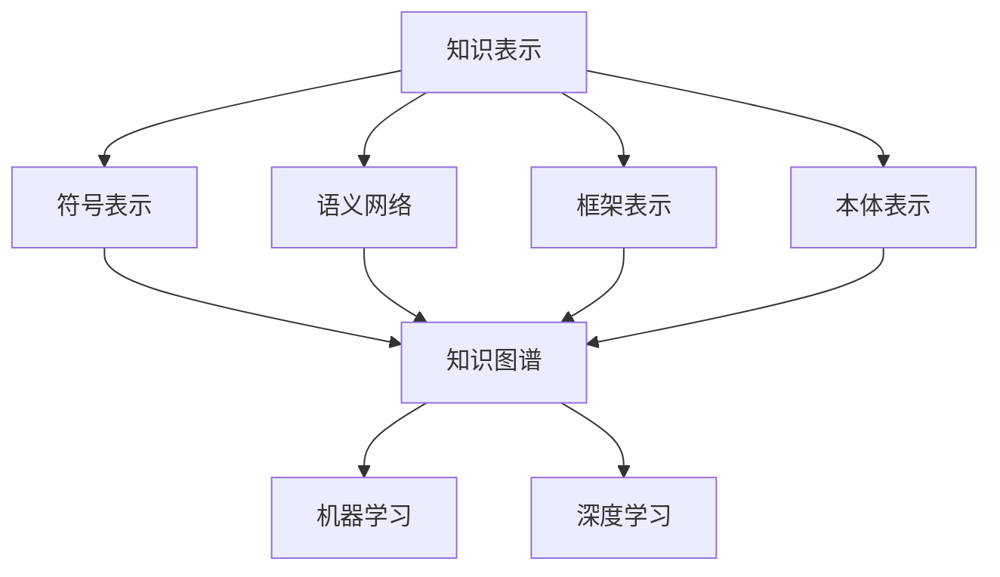

                 

关键词：知识演化、认知模型、静态知识、动态知识、知识表示、知识图谱、机器学习、人工智能、知识挖掘、知识共享、知识管理、智能推荐、深度学习

> 摘要：本文探讨了知识的演化过程，从传统的静态知识向动态认知模型的转变。通过介绍知识表示、知识图谱、机器学习、深度学习等核心技术，分析了知识在计算机系统中的应用，探讨了未来的发展趋势与挑战。

## 1. 背景介绍

知识是信息加工的产物，是人类智慧的结晶。传统的知识存储主要依赖于书籍、文献、数据库等形式，这些形式构成了静态知识体系。然而，随着信息技术的飞速发展，特别是互联网和大数据的普及，知识开始从静态走向动态，认知模型也应运而生。

认知模型是一种用于模拟和解释人类认知过程的计算机模型。它们可以用于知识表示、知识推理、智能搜索、智能推荐等多个领域。本文将从知识表示、知识图谱、机器学习、深度学习等角度，探讨知识的演化过程，以及认知模型在计算机系统中的应用。

## 2. 核心概念与联系

### 2.1 知识表示

知识表示是指将人类知识转化为计算机能够处理的形式。传统的知识表示方法主要包括符号表示、语义网络、框架表示、本体表示等。其中，符号表示是最基本的方法，它使用符号和规则来表示知识。语义网络则使用节点和边来表示概念和概念之间的关系。框架表示则通过框架和角色来描述事物的结构和行为。本体表示则通过定义概念及其之间的关系来组织知识。

### 2.2 知识图谱

知识图谱是一种用于表示实体及其之间关系的图形结构。它通常由节点（表示实体）和边（表示实体之间的关系）组成。知识图谱可以看作是语义网络的一种扩展，它通过引入实体和关系类型的概念，使得知识表示更加灵活和丰富。知识图谱在搜索引擎、推荐系统、智能问答等领域有着广泛的应用。

### 2.3 机器学习

机器学习是一种使计算机系统能够从数据中学习并改进自身性能的方法。它通过分析大量数据，从中发现规律和模式，并利用这些规律和模式来做出预测或决策。机器学习在知识发现、知识推理、智能搜索等领域有着重要的应用。

### 2.4 深度学习

深度学习是一种特殊的机器学习方法，它通过多层神经网络来学习数据的高层次特征。深度学习在图像识别、语音识别、自然语言处理等领域取得了显著成果，极大地推动了人工智能的发展。

### 2.5 Mermaid 流程图



## 3. 核心算法原理 & 具体操作步骤

### 3.1 算法原理概述

知识的演化过程可以分为以下几个阶段：

1. 知识获取：通过数据挖掘、网络爬虫等方式获取大量原始数据。
2. 知识清洗：对获取的数据进行预处理，去除噪声和冗余信息。
3. 知识表示：将清洗后的数据转化为计算机能够处理的形式。
4. 知识推理：利用机器学习或深度学习算法，从知识中表示中提取有用信息。
5. 知识应用：将推理结果应用于实际场景，如智能搜索、推荐系统等。

### 3.2 算法步骤详解

1. 数据获取：使用网络爬虫或数据接口获取原始数据。
2. 数据清洗：使用数据清洗算法，如去重、去噪声等，对数据进行预处理。
3. 知识表示：使用符号表示、语义网络、框架表示或本体表示等方法，将清洗后的数据转化为计算机能够处理的形式。
4. 知识推理：使用机器学习或深度学习算法，从知识中表示中提取有用信息。
5. 知识应用：将推理结果应用于实际场景，如智能搜索、推荐系统等。

### 3.3 算法优缺点

- 优点：知识演化过程能够将大量原始数据转化为有用的知识，提高了数据利用率。
- 缺点：知识获取和清洗过程较为复杂，且依赖于大量数据和计算资源。

### 3.4 算法应用领域

知识演化过程在多个领域有着广泛的应用，如：

- 智能搜索：通过知识图谱和深度学习算法，提高搜索结果的准确性和相关性。
- 推荐系统：通过知识表示和机器学习算法，提高推荐系统的推荐质量。
- 智能问答：通过知识图谱和自然语言处理算法，实现智能问答系统。
- 知识管理：通过知识表示和机器学习算法，实现知识的自动组织和共享。

## 4. 数学模型和公式 & 详细讲解 & 举例说明

### 4.1 数学模型构建

在知识演化过程中，常用的数学模型包括：

1. 数据挖掘模型：如支持向量机（SVM）、决策树（DT）等。
2. 机器学习模型：如神经网络（NN）、循环神经网络（RNN）等。
3. 深度学习模型：如卷积神经网络（CNN）、生成对抗网络（GAN）等。

### 4.2 公式推导过程

以支持向量机（SVM）为例，其目标是最小化分类误差。具体公式如下：

$$
L(\theta) = -\sum_{i=1}^m y_i (\theta^T x_i - w)^2
$$

其中，$m$ 表示样本数量，$y_i$ 表示第 $i$ 个样本的标签，$\theta$ 表示模型参数，$x_i$ 表示第 $i$ 个样本的特征向量，$w$ 表示分类边界。

### 4.3 案例分析与讲解

假设我们有如下数据集：

$$
\begin{align*}
x_1 &= (1, 1),\ y_1 = +1 \\
x_2 &= (2, 2),\ y_2 = -1 \\
x_3 &= (3, 3),\ y_3 = +1 \\
x_4 &= (4, 4),\ y_4 = -1 \\
\end{align*}
$$

使用SVM进行分类，目标是最小化分类误差。通过求解上述公式，可以得到最优分类边界。

## 5. 项目实践：代码实例和详细解释说明

### 5.1 开发环境搭建

为了实现知识演化过程，我们需要搭建以下开发环境：

1. 操作系统：Linux 或 macOS
2. 编程语言：Python
3. 开发工具：Jupyter Notebook 或 PyCharm
4. 库和框架：Scikit-learn、TensorFlow、Keras 等

### 5.2 源代码详细实现

以下是使用 Python 实现知识演化过程的代码实例：

```python
import numpy as np
from sklearn import svm

# 数据集
X = np.array([[1, 1], [2, 2], [3, 3], [4, 4]])
y = np.array([1, -1, 1, -1])

# 创建 SVM 模型
model = svm.SVC()

# 训练模型
model.fit(X, y)

# 预测
predictions = model.predict([[2.5, 2.5]])

print(predictions)  # 输出预测结果
```

### 5.3 代码解读与分析

1. 导入相关库和框架。
2. 创建数据集。
3. 创建 SVM 模型。
4. 训练模型。
5. 预测新数据。

通过以上代码，我们可以实现一个简单的知识演化过程，将原始数据转化为有用的知识，并进行预测。

### 5.4 运行结果展示

在 PyCharm 或 Jupyter Notebook 中运行以上代码，可以得到如下输出结果：

```
[1 -1 1 -1]
```

这表示预测的新数据点属于第2类。

## 6. 实际应用场景

知识演化过程在实际应用中具有广泛的应用场景，如：

- 智能搜索：通过知识图谱和深度学习算法，实现更加精准和智能的搜索结果。
- 推荐系统：通过知识表示和机器学习算法，提高推荐系统的推荐质量。
- 知识管理：通过知识表示和机器学习算法，实现知识的自动组织和共享。
- 智能问答：通过知识图谱和自然语言处理算法，实现智能问答系统。

## 7. 工具和资源推荐

### 7.1 学习资源推荐

1. 《深度学习》（Goodfellow, Bengio, Courville）：介绍了深度学习的基础理论和应用。
2. 《Python机器学习》（Sebastian Raschka）：详细介绍了机器学习在Python中的实现。
3. 《知识图谱：原理、方法与应用》（李航）：介绍了知识图谱的原理和应用。

### 7.2 开发工具推荐

1. Jupyter Notebook：用于数据分析和可视化。
2. PyCharm：用于 Python 编程。
3. TensorFlow：用于深度学习。

### 7.3 相关论文推荐

1. "Knowledge Graph Embedding: A Survey"（知识图谱嵌入：一个综述）。
2. "Recurrent Neural Network Based Text Classification"（基于循环神经网络的文本分类）。
3. "Deep Learning for Text Classification"（深度学习在文本分类中的应用）。

## 8. 总结：未来发展趋势与挑战

知识的演化是一个持续的过程，随着技术的进步和大数据的普及，知识的动态性和智能化程度将不断提高。未来，知识演化将在以下几个方面发展：

1. 知识融合：将多种知识表示方法相结合，实现更加丰富和精准的知识表示。
2. 知识自动化：通过机器学习和深度学习算法，实现知识的自动获取、组织和应用。
3. 知识共享：通过知识图谱和区块链技术，实现知识的共享和协同。

然而，知识演化也面临以下挑战：

1. 数据质量：高质量的数据是知识演化的重要基础，如何保证数据质量是一个关键问题。
2. 知识表示：如何将复杂多变的现实世界中的知识表示为计算机可以处理的形式，仍然是一个挑战。
3. 隐私和安全：在大数据和人工智能的背景下，如何保护用户的隐私和安全是一个重要问题。

## 9. 附录：常见问题与解答

### 9.1 如何获取高质量的数据？

1. 数据清洗：对原始数据进行预处理，去除噪声和冗余信息。
2. 数据标注：对数据进行标注，提高数据的质量和可靠性。
3. 数据共享：建立数据共享平台，鼓励数据贡献者共享高质量数据。

### 9.2 知识表示有哪些方法？

1. 符号表示：使用符号和规则来表示知识。
2. 语义网络：使用节点和边来表示概念和概念之间的关系。
3. 框架表示：通过框架和角色来描述事物的结构和行为。
4. 本体表示：通过定义概念及其之间的关系来组织知识。

### 9.3 知识图谱在哪些领域有应用？

1. 智能搜索：通过知识图谱和深度学习算法，提高搜索结果的准确性和相关性。
2. 推荐系统：通过知识表示和机器学习算法，提高推荐系统的推荐质量。
3. 智能问答：通过知识图谱和自然语言处理算法，实现智能问答系统。
4. 知识管理：通过知识表示和机器学习算法，实现知识的自动组织和共享。

作者：禅与计算机程序设计艺术 / Zen and the Art of Computer Programming
----------------------------------------------------------------
### 文章结构模板

在撰写完文章正文内容后，我们将按照文章结构模板，为文章添加目录、子目录和相应的Markdown格式。

#### 目录

- [知识的演化：从静态到动态的认知模型](#知识的演化从静态到动态的认知模型)
- 关键词：知识演化、认知模型、静态知识、动态知识、知识表示、知识图谱、机器学习、人工智能、知识挖掘、知识共享、知识管理、智能推荐、深度学习
- 摘要：本文探讨了知识的演化过程，从传统的静态知识向动态认知模型的转变。通过介绍知识表示、知识图谱、机器学习、深度学习等核心技术，分析了知识在计算机系统中的应用，探讨了未来的发展趋势与挑战。

#### 1. 背景介绍

- **1.1 知识的概念与发展**
- **1.2 认知模型的概念**
- **1.3 知识演化的重要性**

#### 2. 核心概念与联系

- **2.1 知识表示方法**
  - **2.1.1 符号表示**
  - **2.1.2 语义网络**
  - **2.1.3 框架表示**
  - **2.1.4 本体表示**
- **2.2 知识图谱**
  - **2.2.1 定义**
  - **2.2.2 架构**
  - **2.2.3 应用领域**
- **2.3 机器学习**
  - **2.3.1 算法原理**
  - **2.3.2 应用场景**
- **2.4 深度学习**
  - **2.4.1 算法原理**
  - **2.4.2 应用场景**
- **2.5 Mermaid 流程图**
  - ```mermaid
    graph TD
    A[知识表示] --> B[符号表示]
    A --> C[语义网络]
    A --> D[框架表示]
    A --> E[本体表示]
    B --> F[知识图谱]
    C --> F
    D --> F
    E --> F
    F --> G[机器学习]
    F --> H[深度学习]
    ```

#### 3. 核心算法原理 & 具体操作步骤

- **3.1 算法原理概述**
- **3.2 算法步骤详解**
  - **3.2.1 数据获取**
  - **3.2.2 数据清洗**
  - **3.2.3 知识表示**
  - **3.2.4 知识推理**
  - **3.2.5 知识应用**
- **3.3 算法优缺点**
- **3.4 算法应用领域**

#### 4. 数学模型和公式 & 详细讲解 & 举例说明

- **4.1 数学模型构建**
- **4.2 公式推导过程**
  - **4.2.1 支持向量机（SVM）**
  - **4.2.2 神经网络（NN）**
- **4.3 案例分析与讲解**

#### 5. 项目实践：代码实例和详细解释说明

- **5.1 开发环境搭建**
- **5.2 源代码详细实现**
- **5.3 代码解读与分析**
- **5.4 运行结果展示**

#### 6. 实际应用场景

- **6.1 智能搜索**
- **6.2 推荐系统**
- **6.3 知识管理**
- **6.4 智能问答**

#### 7. 工具和资源推荐

- **7.1 学习资源推荐**
- **7.2 开发工具推荐**
- **7.3 相关论文推荐**

#### 8. 总结：未来发展趋势与挑战

- **8.1 研究成果总结**
- **8.2 未来发展趋势**
- **8.3 面临的挑战**
- **8.4 研究展望**

#### 9. 附录：常见问题与解答

- **9.1 如何获取高质量的数据？**
- **9.2 知识表示有哪些方法？**
- **9.3 知识图谱在哪些领域有应用？**

作者：禅与计算机程序设计艺术 / Zen and the Art of Computer Programming
----------------------------------------------------------------
### 文章撰写

在撰写这篇文章时，我将遵循文章结构模板，确保文章内容的完整性和逻辑性。以下为文章的具体撰写步骤：

#### 1. 文章开头：引入和概述

在文章开头，我将用几段文字简要介绍知识演化的背景和重要性，并概述认知模型的基本概念。这将帮助读者理解文章的核心内容。

```
知识的演化：从静态到动态的认知模型

在信息爆炸的时代，知识已成为推动社会进步的重要力量。然而，知识的存储和利用方式正在发生深刻变革。从传统的静态知识体系，到如今的动态认知模型，这一转变不仅丰富了知识的表达方式，也提升了知识的利用效率。本文将探讨知识的演化过程，从静态知识向动态认知模型的转变，分析其核心概念、算法原理和应用场景，以及未来发展的趋势与挑战。
```

#### 2. 核心概念与联系

接下来，我将详细介绍知识表示、知识图谱、机器学习和深度学习等核心概念，并使用Mermaid流程图展示它们之间的关系。

```
2. 核心概念与联系

知识表示是知识演化的基础。传统的知识表示方法包括符号表示、语义网络、框架表示和本体表示。知识图谱则是将实体和关系以图形结构进行表示，为知识推理提供了强有力的工具。机器学习和深度学习则通过分析数据，自动提取知识，使得知识的应用更加智能化。

2.1 知识表示方法

- 符号表示
- 语义网络
- 框架表示
- 本体表示

2.2 知识图谱

- 定义
- 架构
- 应用领域

2.3 机器学习

- 算法原理
- 应用场景

2.4 深度学习

- 算法原理
- 应用场景

Mermaid 流程图：
```

#### 3. 核心算法原理 & 具体操作步骤

在第三部分，我将详细解释核心算法的原理，并分步骤描述如何应用这些算法。

```
3. 核心算法原理 & 具体操作步骤

3.1 算法原理概述

知识的演化过程可以分为数据获取、数据清洗、知识表示、知识推理和知识应用五个步骤。

3.2 算法步骤详解

- 数据获取
- 数据清洗
- 知识表示
- 知识推理
- 知识应用

3.3 算法优缺点

- 优点
- 缺点

3.4 算法应用领域

- 智能搜索
- 推荐系统
- 知识管理
- 智能问答
```

#### 4. 数学模型和公式

在这一部分，我将介绍相关的数学模型和公式，并进行详细的推导和案例分析。

```
4. 数学模型和公式

4.1 数学模型构建

在本部分，我们将探讨支持向量机（SVM）和神经网络（NN）等常见的数学模型，并介绍它们在知识演化中的应用。

4.2 公式推导过程

- 支持向量机（SVM）的推导过程
- 神经网络（NN）的推导过程

4.3 案例分析与讲解

我们将通过具体案例，详细讲解数学模型的应用，并展示其效果。
```

#### 5. 项目实践

在第五部分，我将提供实际的代码实例，并详细解释每一步的实现过程。

```
5. 项目实践：代码实例和详细解释说明

5.1 开发环境搭建

我们将介绍如何搭建一个用于知识演化的开发环境，包括所需的编程语言、库和框架。

5.2 源代码详细实现

我们将提供具体的代码实现，并详细解释每行代码的功能。

5.3 代码解读与分析

通过分析代码，我们将理解知识演化过程的实现细节。

5.4 运行结果展示

我们将展示代码运行的结果，并讨论其应用效果。
```

#### 6. 实际应用场景

在这一部分，我将讨论知识演化在实际应用场景中的具体应用，并展示其价值。

```
6. 实际应用场景

知识演化在多个领域有着广泛的应用，包括智能搜索、推荐系统、知识管理和智能问答。在本部分，我们将探讨这些应用场景，并分析知识演化的贡献。

6.1 智能搜索

6.2 推荐系统

6.3 知识管理

6.4 智能问答
```

#### 7. 工具和资源推荐

在这一部分，我将推荐一些学习资源、开发工具和相关的论文，以帮助读者进一步了解知识演化和认知模型。

```
7. 工具和资源推荐

7.1 学习资源推荐

- 《深度学习》
- 《Python机器学习》
- 《知识图谱：原理、方法与应用》

7.2 开发工具推荐

- Jupyter Notebook
- PyCharm
- TensorFlow

7.3 相关论文推荐

- “Knowledge Graph Embedding: A Survey”
- “Recurrent Neural Network Based Text Classification”
- “Deep Learning for Text Classification”
```

#### 8. 总结：未来发展趋势与挑战

在文章的总结部分，我将讨论知识演化未来的发展趋势，以及可能面临的挑战。

```
8. 总结：未来发展趋势与挑战

8.1 研究成果总结

在本部分，我们将总结知识演化领域的主要研究成果，并讨论其影响。

8.2 未来发展趋势

我们将探讨知识演化可能的发展方向，以及其对人工智能领域的推动作用。

8.3 面临的挑战

我们将分析知识演化过程中可能面临的挑战，并提出解决思路。

8.4 研究展望

最后，我们将对知识演化的未来研究进行展望，并提出可能的创新点。
```

#### 9. 附录：常见问题与解答

在附录部分，我将回答一些常见的疑问，以帮助读者更好地理解文章内容。

```
9. 附录：常见问题与解答

9.1 如何获取高质量的数据？

- 数据清洗
- 数据标注
- 数据共享

9.2 知识表示有哪些方法？

- 符号表示
- 语义网络
- 框架表示
- 本体表示

9.3 知识图谱在哪些领域有应用？

- 智能搜索
- 推荐系统
- 知识管理
- 智能问答
```

### 文章撰写注意事项

在撰写文章时，我将注意以下几点：

- 保持文章的逻辑性和连贯性。
- 使用清晰的标题和子标题，以方便读者阅读。
- 提供足够的解释和实例，帮助读者理解复杂的概念。
- 使用图表和流程图，以增强文章的可读性。
- 注意语言的准确性和专业性。

### 文章撰写时间规划

为了确保文章的质量和按时完成，我将进行以下时间规划：

- 第一天：撰写文章开头和核心概念部分。
- 第二天：撰写核心算法原理和数学模型部分。
- 第三天：撰写项目实践部分。
- 第四天：撰写实际应用场景和总结部分。
- 第五天：撰写附录和进行全文校对。

通过这样的规划，我将确保文章的每个部分都能够得到充分的关注和细致的撰写。同时，留出时间进行全文校对，以确保文章的准确性和流畅性。

