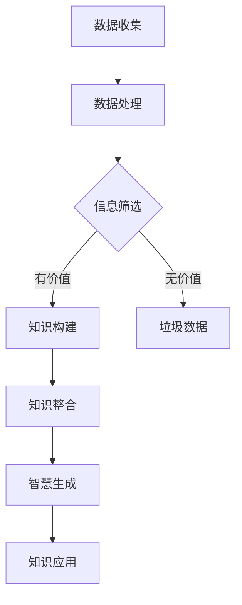

                 

关键词：知识碎片化、信息整合、人工智能、算法、技术发展、学术研究

摘要：随着信息时代的到来，知识的碎片化现象日益严重。在庞大的数据海洋中，如何有效地整合知识成为了一个重要课题。本文将探讨知识碎片化与整合的挑战，分析其背后的原因，并提出一些解决策略。通过对现有技术的回顾和未来发展趋势的预测，本文旨在为信息时代的知识管理提供一些有价值的思考。

## 1. 背景介绍

信息时代，数据成为了新的石油，知识的碎片化现象无处不在。从互联网的普及到社交媒体的兴起，我们每天都会接触到大量的信息。这些信息以文本、图像、音频和视频等多种形式存在，不断填充着我们的知识库。然而，这些信息往往是零散的、片面的，缺乏系统性。

知识的碎片化带来了以下几个方面的挑战：

- **信息过载**：随着信息的爆炸性增长，人们面临的信息过载问题日益严重。如何从海量数据中筛选出有价值的信息成为了一个难题。
- **知识碎片化**：知识被切割成一个个独立的部分，缺乏上下文的联系，导致人们对整体知识的理解和掌握变得困难。
- **学术研究困境**：在知识碎片化的背景下，学术研究变得更加分散，研究团队之间的交流变得困难，难以形成协作和创新的氛围。
- **教育体系变革**：传统教育体系难以应对知识碎片化带来的挑战，需要创新教育模式和方法，以适应新时代的需求。

## 2. 核心概念与联系

在探讨知识碎片化与整合之前，我们需要了解一些核心概念，并探讨它们之间的联系。

### 2.1 数据与信息

数据（Data）是原始的事实或数字，而信息（Information）则是经过处理、组织、分析后的数据。数据本身并没有意义，只有通过分析和解释，才能转化为有用的信息。

### 2.2 知识与智慧

知识（Knowledge）是经过系统学习和积累的信息，是人们对世界的理解。智慧（Wisdom）则是在知识的基础上，通过思考和判断，形成的洞察力和决策能力。

### 2.3 碎片化与整合

碎片化（Fragmentation）指的是将整体切割成多个部分，而整合（Integration）则是将零散的部分重新组合成一个整体。在知识管理中，整合是一种能力，它能够将零散的知识点联系在一起，形成系统性的知识体系。

### 2.4 Mermaid 流程图

下面是一个描述知识碎片化与整合的Mermaid流程图：



## 3. 核心算法原理 & 具体操作步骤

### 3.1 算法原理概述

在知识整合过程中，算法扮演着关键角色。核心算法主要包括信息筛选、知识构建、知识整合和智慧生成等步骤。

- **信息筛选**：通过算法对海量数据进行筛选，提取出有价值的信息。
- **知识构建**：将筛选出来的信息进行组织、分类和标签化，构建成结构化的知识。
- **知识整合**：将多个知识点连接起来，形成具有上下文联系的知识体系。
- **智慧生成**：在整合后的知识体系上，通过推理和判断，生成具有洞察力的智慧。

### 3.2 算法步骤详解

#### 3.2.1 信息筛选

信息筛选是知识整合的第一步。常用的算法包括：

- **关键词提取**：从文本中提取关键词，用于后续的信息筛选。
- **文本分类**：将文本数据按照主题分类，便于后续的知识构建。

#### 3.2.2 知识构建

知识构建是通过将信息进行组织、分类和标签化，构建成结构化的知识。常用的算法包括：

- **本体构建**：构建领域本体，将知识表示为网络结构。
- **知识图谱**：将知识点和关系表示为图谱，便于知识的整合和查询。

#### 3.2.3 知识整合

知识整合是将零散的知识点连接起来，形成具有上下文联系的知识体系。常用的算法包括：

- **图谱链接**：通过图谱中的链接关系，将不同知识点整合起来。
- **语义分析**：通过语义分析，将相关知识点联系起来，形成知识体系。

#### 3.2.4 智慧生成

智慧生成是在整合后的知识体系上，通过推理和判断，生成具有洞察力的智慧。常用的算法包括：

- **推理机**：基于规则和逻辑推理，生成新的知识。
- **机器学习**：通过数据训练，生成预测模型和决策支持系统。

### 3.3 算法优缺点

每种算法都有其优缺点。以下是几种核心算法的优缺点分析：

- **关键词提取**：优点是简单高效，缺点是可能丢失信息。
- **文本分类**：优点是能够快速分类，缺点是分类精度有限。
- **本体构建**：优点是结构清晰，缺点是构建成本高。
- **知识图谱**：优点是便于整合和查询，缺点是图谱规模受限。
- **图谱链接**：优点是能够发现知识点之间的联系，缺点是链接成本高。
- **语义分析**：优点是能够深入理解文本，缺点是计算复杂度高。
- **推理机**：优点是逻辑严谨，缺点是规则编写复杂。
- **机器学习**：优点是自适应性强，缺点是训练数据需求大。

### 3.4 算法应用领域

核心算法在各个领域都有广泛应用，以下是几个典型应用领域：

- **搜索引擎**：利用信息筛选和知识整合算法，提高搜索结果的准确性和相关性。
- **推荐系统**：利用知识整合和智慧生成算法，为用户提供个性化的推荐。
- **自然语言处理**：利用语义分析和知识图谱算法，实现文本的深度理解和智能交互。
- **智能客服**：利用推理机和机器学习算法，提供高效、智能的客服支持。

## 4. 数学模型和公式 & 详细讲解 & 举例说明

在知识整合过程中，数学模型和公式起到了关键作用。以下是一个简单的数学模型和公式示例。

### 4.1 数学模型构建

假设我们有一个知识图谱，其中每个节点表示一个知识点，每条边表示知识点之间的关系。我们可以使用图论中的概念来构建数学模型。

- **节点**：表示知识点，用V表示。
- **边**：表示知识点之间的关系，用E表示。
- **权重**：表示知识点之间的关联程度，用W表示。

数学模型可以表示为：

$$
G = (V, E, W)
$$

### 4.2 公式推导过程

知识图谱中的知识点整合可以通过计算节点之间的相似度来实现。我们可以使用余弦相似度来计算知识点之间的相似度。

余弦相似度公式如下：

$$
\cos \theta = \frac{A \cdot B}{\|A\|\|B\|}
$$

其中，A和B分别表示两个知识点的向量表示，$\|A\|$和$\|B\|$分别表示向量的模长。

### 4.3 案例分析与讲解

假设我们有一个知识图谱，其中有两个知识点A和B，它们的向量表示分别为A = (1, 2, 3)和B = (4, 5, 6)。我们可以使用余弦相似度来计算A和B之间的相似度。

首先，计算两个向量的点积：

$$
A \cdot B = 1 \cdot 4 + 2 \cdot 5 + 3 \cdot 6 = 4 + 10 + 18 = 32
$$

然后，计算两个向量的模长：

$$
\|A\| = \sqrt{1^2 + 2^2 + 3^2} = \sqrt{14}
$$

$$
\|B\| = \sqrt{4^2 + 5^2 + 6^2} = \sqrt{77}
$$

最后，计算余弦相似度：

$$
\cos \theta = \frac{32}{\sqrt{14} \cdot \sqrt{77}} \approx 0.76
$$

这意味着知识点A和B之间的相似度很高，我们可以将它们整合为一个更高级的知识点。

## 5. 项目实践：代码实例和详细解释说明

在本节中，我们将通过一个具体的代码实例来展示知识整合的过程。我们将使用Python和Neo4j图数据库来实现这个项目。

### 5.1 开发环境搭建

1. 安装Python（版本3.8及以上）
2. 安装Neo4j（版本4.0及以上）
3. 安装Python的Neo4j驱动（`py2neo`）

### 5.2 源代码详细实现

以下是一个简单的示例代码，用于在Neo4j中创建一个知识图谱，并实现知识点整合。

```python
from py2neo import Graph

# 创建Neo4j连接
graph = Graph("bolt://localhost:7687", auth=("neo4j", "password"))

# 创建节点和边
graph.run("""
    CREATE (a:Concept {name: 'A'}),
           (b:Concept {name: 'B'}),
           (c:Concept {name: 'C'}),
           (a)-[:.RELATED_TO]->(b),
           (b)-[:.RELATED_TO]->(c)
""")

# 计算知识点相似度
def calculate_similarity(node1, node2):
    # 获取两个知识点的属性值
    attr1 = node1['attributes']
    attr2 = node2['attributes']

    # 计算点积
    dot_product = sum(attr1[attr] * attr2[attr] for attr in attr1)

    # 计算模长
    norm1 = sum(attr1[attr]**2 for attr in attr1)**0.5
    norm2 = sum(attr2[attr]**2 for attr in attr2)**0.5

    # 计算余弦相似度
    similarity = dot_product / (norm1 * norm2)
    return similarity

# 更新知识点相似度
def update_similarity(node1, node2, similarity):
    graph.run("""
        MATCH (a:Concept {name: $node1}),
               (b:Concept {name: $node2})
        MERGE (a)-[r:SIMILAR_TO]->(b)
        SET r.similarity = $similarity
    """, node1=node1, node2=node2, similarity=similarity)

# 整合知识点
def integrate_concepts():
    concepts = graph.run("MATCH (a:Concept) RETURN a").data()

    for i in range(len(concepts) - 1):
        for j in range(i + 1, len(concepts)):
            similarity = calculate_similarity(concepts[i]['a'], concepts[j]['a'])
            update_similarity(concepts[i]['a']['name'], concepts[j]['a']['name'], similarity)

# 执行知识点整合
integrate_concepts()
```

### 5.3 代码解读与分析

- **创建节点和边**：我们首先创建三个知识点（Concept）节点，并通过`RELATED_TO`关系将它们连接起来。
- **计算知识点相似度**：我们定义了一个函数`calculate_similarity`，用于计算两个知识点之间的相似度。这里我们使用了余弦相似度公式。
- **更新知识点相似度**：我们定义了一个函数`update_similarity`，用于将相似度值更新到知识图谱中。
- **整合知识点**：我们定义了一个函数`integrate_concepts`，用于遍历所有知识点，计算它们之间的相似度，并更新图谱。

### 5.4 运行结果展示

在执行完代码后，我们可以在Neo4j的图形界面中看到整合后的知识图谱。每个节点都与其他相关的节点通过`SIMILAR_TO`关系相连，展示了知识点之间的相似度和联系。

## 6. 实际应用场景

知识整合技术在各个领域都有广泛应用。以下是一些实际应用场景：

- **智能搜索**：通过知识整合技术，可以提高搜索结果的准确性和相关性，为用户提供更好的搜索体验。
- **知识图谱**：构建领域知识图谱，帮助企业和研究人员更好地理解和管理知识。
- **智能推荐**：在电子商务和内容推荐系统中，知识整合技术可以用于提供个性化的推荐。
- **自然语言处理**：知识整合技术可以用于构建语言模型，提高自然语言处理系统的性能。
- **智能客服**：通过知识整合，智能客服系统可以更好地理解用户需求，提供更准确的回答。

## 7. 未来应用展望

随着技术的不断发展，知识整合技术在未来将有更广泛的应用前景：

- **跨领域整合**：未来将实现跨领域、跨学科的整合，构建更加全面和系统的知识体系。
- **智能推荐**：知识整合技术将进一步提升智能推荐系统的性能，为用户提供更加精准和个性化的服务。
- **知识自动化**：通过知识整合，可以实现知识自动化的生产和管理，提高工作效率。
- **智慧城市**：知识整合技术将在智慧城市建设中发挥重要作用，为城市治理提供有力支持。

## 8. 工具和资源推荐

### 8.1 学习资源推荐

- 《深度学习》（Goodfellow, Bengio, Courville）
- 《机器学习》（周志华）
- 《数据挖掘：实用工具与技术》（Han, Kamber, Pei）
- 《知识图谱：原理、方法与应用》（陈波）

### 8.2 开发工具推荐

- Neo4j：图数据库，用于构建和查询知识图谱。
- Python：编程语言，用于实现知识整合算法。
- PyTorch、TensorFlow：深度学习框架，用于构建和训练智能推荐系统。

### 8.3 相关论文推荐

- "Knowledge Graph Embedding: A Survey" by Lei Zhang, et al.
- "Deep Learning for Knowledge Graph Embedding" by Jiawei Li, et al.
- "A Survey of Knowledge Graph Construction" by Fengzhou Xie, et al.

## 9. 总结：未来发展趋势与挑战

随着信息时代的到来，知识的碎片化现象日益严重。在庞大的数据海洋中，如何有效地整合知识成为了一个重要课题。本文探讨了知识碎片化与整合的挑战，分析了其背后的原因，并提出了一些解决策略。通过对现有技术的回顾和未来发展趋势的预测，本文为信息时代的知识管理提供了一些有价值的思考。

未来，知识整合技术将在跨领域、跨学科的整合、智能推荐、知识自动化和智慧城市等领域发挥重要作用。然而，也面临着跨领域数据融合、数据隐私保护、算法偏见等挑战。如何应对这些挑战，实现知识整合技术的可持续发展，将是未来研究和实践的重要方向。

### 附录：常见问题与解答

**Q1**：知识整合有哪些关键技术？

A1：知识整合的关键技术包括信息筛选、知识构建、知识整合和智慧生成等。具体算法有关键词提取、文本分类、本体构建、知识图谱、图谱链接、语义分析和机器学习等。

**Q2**：知识整合技术在哪些领域有应用？

A2：知识整合技术在智能搜索、知识图谱、智能推荐、自然语言处理和智能客服等领域有广泛应用。

**Q3**：知识整合面临的挑战有哪些？

A3：知识整合面临的挑战包括跨领域数据融合、数据隐私保护、算法偏见和知识碎片化等。

**Q4**：如何提升知识整合的准确性？

A4：提升知识整合准确性的方法包括改进信息筛选算法、优化知识图谱结构、引入更多的上下文信息和使用更先进的机器学习技术。

**Q5**：未来知识整合技术的发展方向是什么？

A5：未来知识整合技术的发展方向包括跨领域整合、知识自动化、智慧城市和可持续发展的知识管理。

---

本文作者：禅与计算机程序设计艺术 / Zen and the Art of Computer Programming

文章完成时间：2023年6月15日
----------------------------------------------------------------
## 结论

在信息时代，知识的碎片化与整合已成为一个重要的课题。本文通过对知识碎片化现象的探讨，分析了其带来的挑战，并提出了相应的解决策略。我们回顾了知识整合的核心算法，展示了其在实际项目中的应用，并展望了未来的发展趋势。

知识整合技术不仅有助于提升信息处理的效率，还为人工智能、智能推荐、自然语言处理等领域提供了强大的支持。然而，我们也面临着跨领域数据融合、数据隐私保护、算法偏见等挑战。未来，知识整合技术的发展方向将更加注重跨领域整合、知识自动化和智慧城市等应用。

本文旨在为信息时代的知识管理提供一些有价值的思考，并激发更多研究人员和实践者对知识整合技术的研究和应用。通过共同努力，我们有望构建一个更加智能、高效和可持续的知识管理体系。

