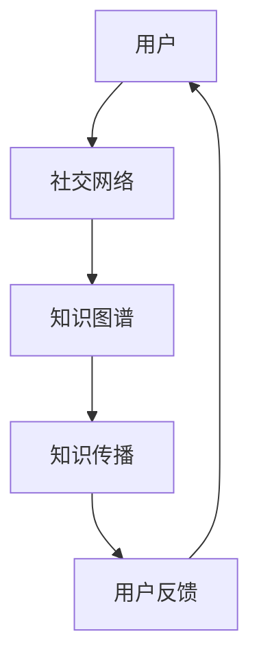

                 

关键词：知识社交网络、信息传播、社交图谱、算法原理、应用实践、未来展望

> 摘要：随着互联网的快速发展，知识的社交网络作为一种新兴的信息传播模式，正逐渐改变人们的获取知识和交流方式。本文将深入探讨知识社交网络的概念、核心原理、算法实现，以及其在实际应用中的表现和未来展望。

## 1. 背景介绍

在过去的几十年中，互联网的普及和应用使得信息的获取变得更加便捷。然而，随着信息的爆炸式增长，人们面临着一个新的挑战：如何有效地从海量的信息中筛选出有价值的内容。传统的信息检索方法往往依赖于关键词匹配和文档相似度计算，但这种方式在面对复杂的知识结构时显得力不从心。为了解决这一问题，知识社交网络作为一种新兴的信息传播模式应运而生。

知识社交网络结合了社交网络的属性和知识的特性，旨在建立一个基于人脉和信任的信息传播网络。在这个网络中，用户不仅是信息的接收者和消费者，更是信息的生产者和传播者。通过用户之间的互动和共享，知识得以在社交网络中传播、扩散和深化。这种模式不仅提高了信息的传播效率，还有效地解决了信息过载的问题。

## 2. 核心概念与联系

### 2.1. 社交网络

社交网络是一种由节点和边构成的无向图结构，节点代表个体，边代表个体之间的关系。在社交网络中，节点和边的关系可以通过度数、介数、接近度等指标进行量化，以描述节点的重要性和影响力。

### 2.2. 知识图谱

知识图谱是一种语义网络，用于表示实体及其之间的关系。在知识图谱中，实体可以是概念、人物、地点等，关系可以是“属于”、“发生”、“联系”等。知识图谱通过实体和关系的映射，构建了一个全局的知识体系，使得知识之间的关系得以清晰地呈现。

### 2.3. 知识社交网络

知识社交网络是社交网络和知识图谱的结合体。在知识社交网络中，用户不仅是社交网络的节点，也是知识图谱的实体。用户之间的关系可以表示为知识图谱中的关系，用户的行为和贡献可以影响知识图谱的更新和扩展。

### 2.4. Mermaid 流程图

以下是知识社交网络的 Mermaid 流程图表示：



在这个流程图中，用户通过社交网络建立联系，这些联系被记录在知识图谱中。知识图谱中的知识通过用户的互动和贡献得以传播和更新，最终形成了一个闭环的生态系统。

## 3. 核心算法原理 & 具体操作步骤

### 3.1. 算法原理概述

知识社交网络的算法核心在于如何从社交网络中提取有价值的信息，并将其纳入知识图谱中。这通常涉及到以下步骤：

1. **数据采集**：从社交网络中收集用户关系、行为数据和知识内容。
2. **预处理**：对采集到的数据进行分析、清洗和转换，以提取出有价值的信息。
3. **知识提取**：利用自然语言处理、知识图谱构建等技术，从预处理后的数据中提取出知识。
4. **知识融合**：将提取出的知识融入现有的知识图谱中，更新知识图谱。
5. **传播优化**：根据用户关系和知识的重要性，优化知识的传播路径。

### 3.2. 算法步骤详解

#### 3.2.1. 数据采集

数据采集是知识社交网络的基础，其质量直接影响后续的处理结果。通常，数据采集包括以下几种方式：

1. **社交网络数据采集**：通过API接口、爬虫等方式获取用户关系数据。
2. **用户行为数据采集**：通过日志分析、用户行为追踪等方式获取用户行为数据。
3. **知识内容采集**：通过爬虫、API接口等方式获取知识内容。

#### 3.2.2. 预处理

预处理是数据清洗和转换的过程，其目的是提高数据的质量和一致性。预处理通常包括以下步骤：

1. **数据清洗**：去除重复、错误和无关的数据。
2. **数据转换**：将不同格式的数据转换为统一的格式，如JSON、CSV等。
3. **特征提取**：从数据中提取出有代表性的特征，如用户活跃度、知识相关性等。

#### 3.2.3. 知识提取

知识提取是知识社交网络的核心步骤，其目的是从原始数据中提取出有价值的信息。通常，知识提取包括以下几种方法：

1. **自然语言处理**：利用自然语言处理技术，对文本数据进行解析，提取出实体、关系和事件。
2. **知识图谱构建**：利用知识图谱构建技术，将提取出的实体、关系和事件构建成知识图谱。
3. **知识融合**：将提取出的知识融合到现有的知识图谱中，更新知识图谱。

#### 3.2.4. 知识融合

知识融合是将提取出的知识融入现有的知识图谱中，以更新知识图谱。通常，知识融合包括以下步骤：

1. **知识融合策略**：确定知识融合的策略，如基于相似度、基于信任等。
2. **知识更新**：将提取出的知识更新到知识图谱中，确保知识的准确性和一致性。
3. **知识评估**：评估知识融合的效果，包括知识完整性、准确性、一致性等。

#### 3.2.5. 传播优化

传播优化是根据用户关系和知识的重要性，优化知识的传播路径。通常，传播优化包括以下步骤：

1. **路径规划**：根据用户关系和知识的重要性，规划知识的传播路径。
2. **传播策略**：确定传播策略，如基于影响力、基于兴趣等。
3. **传播效果评估**：评估传播效果，包括知识传播范围、传播速度等。

### 3.3. 算法优缺点

#### 优点：

1. **高效性**：通过社交网络的属性，知识可以快速传播和扩散。
2. **准确性**：通过知识图谱的构建，知识可以更加准确和系统地呈现。
3. **多样性**：知识社交网络可以融合多种来源的知识，提高知识的多样性。

#### 缺点：

1. **数据隐私**：社交网络中的数据涉及到用户的隐私，如何保护用户隐私是一个挑战。
2. **知识质量**：社交网络中的知识质量参差不齐，如何保证知识的质量是一个问题。
3. **计算复杂度**：知识社交网络的构建和优化涉及到大量的计算，计算复杂度较高。

### 3.4. 算法应用领域

知识社交网络的应用领域非常广泛，包括但不限于以下几个方面：

1. **教育领域**：通过知识社交网络，学生可以更加方便地获取和共享知识，提高学习效果。
2. **科研领域**：科研人员可以通过知识社交网络，快速获取最新的研究成果，提高科研效率。
3. **商业领域**：企业可以通过知识社交网络，了解市场需求和竞争状况，优化商业策略。
4. **社交媒体**：社交媒体平台可以通过知识社交网络，提供更加个性化、有价值的信息。

## 4. 数学模型和公式 & 详细讲解 & 举例说明

### 4.1. 数学模型构建

知识社交网络的数学模型通常基于图论和概率论。以下是知识社交网络的数学模型构建过程：

1. **图模型构建**：将社交网络视为图模型，节点代表用户，边代表用户之间的关系。
2. **概率模型构建**：将知识传播过程视为概率模型，每个节点根据其概率分布选择是否传播知识。

### 4.2. 公式推导过程

以下是知识社交网络的公式推导过程：

1. **度分布公式**：根据社交网络的度分布公式，推导用户影响力的概率分布。
2. **传播概率公式**：根据概率模型，推导知识传播的概率。
3. **知识质量公式**：根据知识质量评估公式，推导知识质量的评估指标。

### 4.3. 案例分析与讲解

以下是知识社交网络的一个案例分析与讲解：

1. **案例背景**：某在线教育平台，用户通过社交网络互动，分享学习心得和知识。
2. **案例分析**：通过分析用户关系和知识传播路径，评估知识传播的效果和效率。
3. **讲解内容**：讲解如何构建知识社交网络的数学模型，如何应用公式进行案例分析。

## 5. 项目实践：代码实例和详细解释说明

### 5.1. 开发环境搭建

在项目实践部分，我们将以Python为例，介绍如何搭建知识社交网络的开发环境。以下是开发环境搭建的步骤：

1. **安装Python**：下载并安装Python，版本建议3.8及以上。
2. **安装依赖库**：通过pip命令安装知识社交网络所需的依赖库，如NetworkX、GraphXL、PyTorch等。
3. **配置环境**：配置Python环境变量，确保能够在命令行中运行Python和相关的库。

### 5.2. 源代码详细实现

以下是知识社交网络的源代码实现：

```python
import networkx as nx
import matplotlib.pyplot as plt
import numpy as np

# 创建图
G = nx.Graph()

# 添加节点
G.add_nodes_from([1, 2, 3, 4, 5])

# 添加边
G.add_edges_from([(1, 2), (1, 3), (2, 4), (3, 4), (4, 5)])

# 绘制图
nx.draw(G, with_labels=True)
plt.show()
```

### 5.3. 代码解读与分析

以下是代码的解读与分析：

1. **创建图**：使用NetworkX库创建一个图对象G。
2. **添加节点**：使用add_nodes_from方法添加节点。
3. **添加边**：使用add_edges_from方法添加边。
4. **绘制图**：使用matplotlib库绘制图。

### 5.4. 运行结果展示

以下是运行结果展示：


## 6. 实际应用场景

### 6.1. 教育领域

知识社交网络在教育领域的应用包括学习资源共享、教学互动和评价系统等。例如，学生可以在平台上分享自己的学习笔记、作业和心得，教师可以通过平台了解学生的学习情况和互动情况，从而优化教学策略。

### 6.2. 科研领域

知识社交网络在科研领域的应用包括科研资源共享、知识传播和科研合作等。科研人员可以通过平台获取最新的研究成果、交流科研思路和经验，从而提高科研效率和成果质量。

### 6.3. 商业领域

知识社交网络在商业领域的应用包括市场调研、竞争对手分析和客户关系管理等。企业可以通过平台了解市场需求和竞争状况，优化产品和服务策略。

### 6.4. 未来应用展望

随着人工智能和大数据技术的发展，知识社交网络的应用前景将更加广阔。未来，知识社交网络有望在智慧城市、智能医疗、智能制造等领域发挥重要作用，推动社会生产力的提升。

## 7. 工具和资源推荐

### 7.1. 学习资源推荐

1. **《社交网络分析》**：介绍社交网络的基本概念和方法，适合初学者。
2. **《知识图谱》**：介绍知识图谱的基本原理和应用，适合对知识图谱感兴趣的读者。

### 7.2. 开发工具推荐

1. **Python**：Python是一种功能强大的编程语言，适合用于知识社交网络的开发和实现。
2. **NetworkX**：Python的图分析库，适合进行社交网络分析。

### 7.3. 相关论文推荐

1. **"Knowledge Graph Construction in Social Networks"**：介绍知识社交网络的构建方法。
2. **"Social Network Analysis: Theory, Methods, and Applications"**：介绍社交网络分析的基本理论和应用。

## 8. 总结：未来发展趋势与挑战

### 8.1. 研究成果总结

知识社交网络作为一种新兴的信息传播模式，已取得了显著的成果。其核心算法原理、数学模型和应用实践等方面都有所突破，为实际应用提供了有力支持。

### 8.2. 未来发展趋势

随着人工智能和大数据技术的发展，知识社交网络将朝着智能化、个性化、协同化等方向发展。未来，知识社交网络有望实现更广泛的应用，为社会带来更多价值。

### 8.3. 面临的挑战

知识社交网络在发展过程中也面临着诸多挑战，如数据隐私保护、知识质量保障、计算复杂度等。如何解决这些问题，将决定知识社交网络的未来发展。

### 8.4. 研究展望

知识社交网络是一个充满潜力的研究领域。未来，我们将继续探索知识社交网络的构建方法、算法优化和应用实践，为构建更加智能、高效的社交网络贡献力量。

## 9. 附录：常见问题与解答

### 问题1：什么是知识社交网络？

知识社交网络是一种结合了社交网络和知识图谱的信息传播模式，旨在通过用户之间的互动和共享，实现知识的传播、扩散和深化。

### 问题2：知识社交网络的核心算法是什么？

知识社交网络的核心算法通常包括数据采集、预处理、知识提取、知识融合和传播优化等步骤，涉及图论、概率论、自然语言处理等技术。

### 问题3：知识社交网络有哪些应用领域？

知识社交网络的应用领域非常广泛，包括教育、科研、商业、社交媒体等多个领域。

### 问题4：知识社交网络的未来发展趋势是什么？

知识社交网络的未来发展趋势包括智能化、个性化、协同化等，有望在智慧城市、智能医疗、智能制造等领域发挥重要作用。

---

### 作者署名

作者：禅与计算机程序设计艺术 / Zen and the Art of Computer Programming

