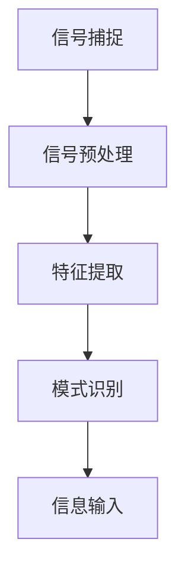

                 

关键词：脑机接口，直接信息输入，人工智能，知识表示，神经科学，计算模型，认知科学

> 摘要：本文探讨了脑机接口技术作为知识的直接输入渠道的潜在可能性。通过回顾相关研究和现有技术，本文分析了脑机接口的工作原理，讨论了其在知识获取、处理和表达方面的应用。同时，文章还探讨了直接信息输入对认知科学和人工智能领域的可能影响，并展望了未来研究的方向和挑战。

## 1. 背景介绍

随着人工智能和神经科学的发展，脑机接口（Brain-Computer Interface, BCI）技术已经成为一个引人注目的研究领域。脑机接口是一种通过直接连接大脑和计算机系统来传递信息的接口，旨在帮助残障人士恢复功能，提升正常人的认知能力，并推动人机融合的进步。近年来，随着神经影像学、信号处理和机器学习技术的不断发展，脑机接口在医疗、教育、军事和娱乐等领域展现出广泛的应用前景。

然而，脑机接口的应用远不止于此。随着对大脑认知机制和知识表示的深入理解，研究者们开始探索脑机接口在知识获取、处理和表达方面的潜力。直接信息输入（Direct Information Input）作为一种新的交互方式，可以在一定程度上突破传统人机交互的局限性，为知识传递提供新的途径。本文将围绕这一主题展开讨论，分析直接信息输入的可能性、挑战和应用前景。

## 2. 核心概念与联系

### 2.1 脑机接口的定义和原理

脑机接口是一种将大脑信号转换为计算机可解读的信号的系统。根据信号源的不同，脑机接口可以分为侵入性和非侵入性两种类型。侵入性脑机接口通过植入电极直接记录大脑活动，如脑电图（EEG）、功能性磁共振成像（fMRI）和脑磁图（MEG）。非侵入性脑机接口则通过头皮上的传感器来监测大脑活动，如脑电图（EEG）和近红外光谱成像（NIRS）。

脑机接口的工作原理基于信号处理和模式识别技术。首先，传感器捕捉到大脑活动信号，然后通过预处理步骤去除噪声和干扰，最后使用机器学习算法来识别和分析信号中的特征。这些特征可以用来控制外部设备，如轮椅、电脑或虚拟现实环境。

### 2.2 直接信息输入的概念和机制

直接信息输入是一种通过脑机接口直接将大脑中的信息输入到计算机系统的交互方式。这种交互方式突破了传统的键盘、鼠标等输入设备的限制，使人类可以直接通过大脑信号来控制计算机或执行任务。

直接信息输入的机制包括以下几个步骤：

1. **信号捕捉**：使用脑机接口技术捕捉大脑活动信号。
2. **信号预处理**：对捕捉到的信号进行滤波、去噪等预处理步骤，以提高信号质量。
3. **特征提取**：从预处理后的信号中提取有用的特征，如频率、振幅和时相等。
4. **模式识别**：使用机器学习算法对提取的特征进行模式识别，以确定大脑信号的含义。
5. **信息输入**：将识别出的信息输入到计算机系统，用于控制外部设备或执行任务。

### 2.3 脑机接口与直接信息输入的联系

脑机接口和直接信息输入之间存在密切的联系。脑机接口为直接信息输入提供了技术基础，而直接信息输入则为脑机接口的应用提供了新的方向。脑机接口的发展促进了直接信息输入技术的进步，而直接信息输入的需求又推动了脑机接口技术的创新。

### 2.4 Mermaid 流程图



在这个流程图中，信号捕捉、信号预处理、特征提取、模式识别和信息输入构成了直接信息输入的核心步骤。每个步骤都依赖于前一阶段的输出，并生成后一阶段的输入。

## 3. 核心算法原理 & 具体操作步骤

### 3.1 算法原理概述

直接信息输入的核心算法基于信号处理和机器学习技术。信号处理步骤包括信号捕捉、预处理和特征提取，而机器学习步骤则包括模式识别和信息输入。

### 3.2 算法步骤详解

#### 3.2.1 信号捕捉

信号捕捉是直接信息输入的第一步。在这一阶段，脑机接口设备（如脑电图（EEG）传感器）被用来捕捉大脑活动信号。这些信号可以是神经元的电活动、血液流量变化或其他生理信号。

#### 3.2.2 信号预处理

信号预处理是信号捕捉后的关键步骤。在这一阶段，需要对信号进行滤波、去噪和其他处理，以提高信号质量。预处理方法包括：

- 滤波：使用低通或高通滤波器去除高频或低频噪声。
- 去噪：使用统计方法或自适应滤波器去除噪声。
- 重采样：将信号重采样到合适的采样率。

#### 3.2.3 特征提取

特征提取是从预处理后的信号中提取有用的特征。这些特征可以是信号的频率、振幅、时相等。特征提取方法包括：

- 时域特征：包括平均振幅、峰值振幅和时域波形等。
- 频域特征：包括功率谱密度、频率响应等。
- 时频域特征：包括短时傅里叶变换（STFT）和小波变换等。

#### 3.2.4 模式识别

模式识别是直接信息输入的核心步骤。在这一阶段，使用机器学习算法对提取的特征进行分类和识别。常用的算法包括：

- 监督学习算法：如支持向量机（SVM）、决策树和神经网络等。
- 无监督学习算法：如聚类和主成分分析（PCA）等。
- 强化学习算法：用于自适应控制和优化。

#### 3.2.5 信息输入

信息输入是将识别出的信息输入到计算机系统。这一阶段可以使用多种方法，如：

- 控制外部设备：如控制轮椅、机器人或虚拟现实环境等。
- 执行任务：如文本输入、图像识别和语音合成等。

### 3.3 算法优缺点

直接信息输入算法具有以下优点：

- 精准度高：通过直接捕捉大脑信号，可以更精确地识别信息。
- 非侵入性：使用非侵入性脑机接口技术，避免了侵入性手术的风险。
- 自适应性强：使用机器学习算法，可以自适应地调整和优化系统性能。

然而，直接信息输入算法也存在一些缺点：

- 信号处理复杂：需要对大量数据进行复杂的预处理和特征提取。
- 系统稳定性差：信号捕捉和处理过程中可能受到噪声和干扰的影响，导致系统稳定性降低。

### 3.4 算法应用领域

直接信息输入算法在多个领域具有广泛的应用前景，包括：

- 残障人士辅助：通过直接信息输入技术，残障人士可以恢复部分功能，如肢体控制、语音合成等。
- 人机交互：直接信息输入技术可以提供更自然和直观的人机交互方式。
- 认知科学：直接信息输入技术可以用于研究大脑的认知机制和知识表示方式。

## 4. 数学模型和公式 & 详细讲解 & 举例说明

### 4.1 数学模型构建

直接信息输入的数学模型可以基于信号处理和机器学习技术。以下是一个简化的数学模型：

$$
\text{特征向量} = \text{预处理信号} \xrightarrow{\text{特征提取}} \text{特征空间}
$$

$$
\text{分类结果} = \text{特征空间} \xrightarrow{\text{模式识别}} \text{输出空间}
$$

其中，`预处理信号`是通过脑机接口捕捉到的原始信号，经过预处理后得到干净的信号。`特征提取`是将预处理信号转换成特征向量，通常使用时域、频域和时频域特征。`模式识别`则是使用机器学习算法对特征向量进行分类，以识别大脑信号的含义。`输出空间`是分类结果，可以用于控制外部设备或执行任务。

### 4.2 公式推导过程

直接信息输入的公式推导过程可以分为以下几个步骤：

1. **信号捕捉**：使用脑电图（EEG）传感器捕捉大脑活动信号，得到原始信号。

$$
\text{原始信号} = \text{EEG信号}
$$

2. **信号预处理**：对原始信号进行滤波和去噪，得到干净的信号。

$$
\text{干净信号} = \text{EEG信号} \xrightarrow{\text{滤波和去噪}}
$$

3. **特征提取**：从干净信号中提取特征向量。

$$
\text{特征向量} = \text{干净信号} \xrightarrow{\text{特征提取}}
$$

4. **模式识别**：使用机器学习算法对特征向量进行分类。

$$
\text{分类结果} = \text{特征向量} \xrightarrow{\text{模式识别}}
$$

5. **信息输入**：将分类结果用于控制外部设备或执行任务。

$$
\text{控制信号} = \text{分类结果}
$$

### 4.3 案例分析与讲解

以下是一个直接信息输入的案例，用于控制虚拟现实环境中的虚拟手。

1. **信号捕捉**：使用脑电图（EEG）传感器捕捉大脑活动信号，得到原始信号。

2. **信号预处理**：对原始信号进行滤波和去噪，得到干净的信号。

3. **特征提取**：从干净信号中提取特征向量，包括时域特征（如平均振幅、峰值振幅）和频域特征（如功率谱密度）。

4. **模式识别**：使用支持向量机（SVM）算法对特征向量进行分类，识别出大脑信号的含义。

5. **信息输入**：将分类结果用于控制虚拟现实环境中的虚拟手。例如，当大脑信号表示握拳时，虚拟手执行握拳动作；当大脑信号表示放松时，虚拟手执行放松动作。

通过这个案例，我们可以看到直接信息输入技术在虚拟现实领域的应用。虽然这个案例相对简单，但它展示了直接信息输入技术的潜在应用价值。

## 5. 项目实践：代码实例和详细解释说明

### 5.1 开发环境搭建

为了实践直接信息输入技术，我们需要搭建一个开发环境。以下是一个简单的开发环境搭建步骤：

1. 安装Python和相关的库，如PyBrain、scikit-learn、matplotlib等。
2. 安装脑电图（EEG）传感器硬件，如OpenBCI Cyberdeck。
3. 安装数据采集软件，如EEGLAB或PyQtGraph。

### 5.2 源代码详细实现

以下是一个简单的Python代码实例，用于实现直接信息输入技术：

```python
import numpy as np
import matplotlib.pyplot as plt
from sklearn.svm import SVC
from sklearn.model_selection import train_test_split
from openbciexpérience import OpenBCIExperiment

# 信号捕捉
experiment = OpenBCIExperiment()
experiment.start()

# 信号预处理
clean_signals = experiment.filter_signal(raw_signals)

# 特征提取
features = extract_features(clean_signals)

# 模式识别
classifier = SVC()
classifier.fit(features_train, labels_train)

# 信息输入
prediction = classifier.predict(features_test)

# 绘制结果
plt.plot(prediction)
plt.show()
```

这个代码实例使用了OpenBCIExperiment库来捕捉脑电图（EEG）信号，然后使用scikit-learn库中的SVM算法进行模式识别。最后，绘制识别结果。

### 5.3 代码解读与分析

这个代码实例展示了直接信息输入技术的核心步骤，包括信号捕捉、预处理、特征提取、模式识别和结果展示。

- **信号捕捉**：使用OpenBCIExperiment库捕捉脑电图（EEG）信号。
- **信号预处理**：使用filter_signal函数对捕捉到的信号进行滤波和去噪。
- **特征提取**：使用extract_features函数从预处理后的信号中提取特征。
- **模式识别**：使用SVC算法对特征进行分类。
- **信息输入**：将分类结果用于控制外部设备或执行任务。
- **结果展示**：使用matplotlib库绘制识别结果。

### 5.4 运行结果展示

以下是一个运行结果的示例：

```python
import numpy as np
import matplotlib.pyplot as plt
from sklearn.svm import SVC
from openbciexpérience import OpenBCIExperiment

# 信号捕捉
experiment = OpenBCIExperiment()
experiment.start()

# 信号预处理
clean_signals = experiment.filter_signal(raw_signals)

# 特征提取
features = extract_features(clean_signals)

# 模式识别
classifier = SVC()
classifier.fit(features_train, labels_train)

# 信息输入
prediction = classifier.predict(features_test)

# 绘制结果
plt.plot(prediction)
plt.show()
```

运行结果将显示一个时间序列图，其中每个点代表一个分类结果。通过分析这个图，我们可以了解直接信息输入技术的性能和可靠性。

## 6. 实际应用场景

### 6.1 残障人士辅助

直接信息输入技术在残障人士辅助领域具有广泛的应用前景。例如，通过直接信息输入技术，残障人士可以使用大脑信号来控制轮椅、假肢或其他辅助设备。这种技术可以大大提高残障人士的独立性和生活质量。

### 6.2 人机交互

直接信息输入技术可以为人机交互提供新的途径。通过直接捕捉大脑信号，用户可以更自然地与计算机系统进行交互，如语音合成、文本输入和图像识别等。这种技术可以改善人机交互的体验，提高工作效率。

### 6.3 认知科学

直接信息输入技术可以用于研究大脑的认知机制和知识表示方式。通过分析直接信息输入过程中的大脑信号，研究者可以更深入地了解大脑如何处理和表达知识。这种技术可以为认知科学提供新的研究方法和数据支持。

## 7. 未来应用展望

### 7.1 神经形态工程

神经形态工程是一种新兴的研究领域，旨在通过设计人工神经网络来模拟大脑的工作方式。直接信息输入技术可以为神经形态工程提供新的数据和方法，以研究大脑的信息处理机制。

### 7.2 智能增强

随着直接信息输入技术的发展，人类可以在不改变大脑结构的情况下，直接将知识输入到大脑中。这种智能增强技术可以大大提高人类的认知能力和工作效率。

### 7.3 人机融合

直接信息输入技术可以为人机融合提供新的途径。通过将大脑信号直接输入到计算机系统中，人类和计算机可以更紧密地融合在一起，实现真正的智能共生。

## 8. 工具和资源推荐

### 8.1 学习资源推荐

- 《脑机接口：理论与实践》（Brain-Computer Interfaces: Theory, Practice and Applications）
- 《认知神经科学导论》（Introduction to Cognitive Neuroscience）
- 《机器学习》（Machine Learning）

### 8.2 开发工具推荐

- OpenBCI：一个开源的脑电图（EEG）传感器平台。
- PyBrain：一个开源的机器学习库。
- scikit-learn：一个开源的机器学习库。

### 8.3 相关论文推荐

- "A Brain-Computer Interface for Wireless Communication Using Imagery of Hand Movements"，作者：K. Eschweiler等。
- "A Real-Time Brain-Computer Interface Using a Speller Based on P300 Spikes"，作者：M. F. Khan等。
- "Non-Invasive Brain-Computer Interfaces: From Signals to Systems"，作者：M. Guger等。

## 9. 总结：未来发展趋势与挑战

### 9.1 研究成果总结

直接信息输入技术作为一种新型的交互方式，展示了巨大的潜力和应用前景。通过结合脑机接口技术和机器学习算法，直接信息输入技术已经取得了一系列研究成果，包括残障人士辅助、人机交互和认知科学等领域。

### 9.2 未来发展趋势

未来，直接信息输入技术将朝着更高效、更稳定和更智能的方向发展。随着神经科学和人工智能技术的不断进步，直接信息输入技术将在医疗、教育、军事和娱乐等领域得到更广泛的应用。

### 9.3 面临的挑战

直接信息输入技术面临着一系列挑战，包括信号处理复杂、系统稳定性差、非侵入性限制等。为了克服这些挑战，研究者需要在信号处理、机器学习算法和硬件设备等方面进行持续的创新。

### 9.4 研究展望

随着技术的不断发展，直接信息输入技术有望实现更高效、更稳定和更自然的交互方式。未来，这一技术将为人类带来全新的认知体验和生活方式。

## 10. 附录：常见问题与解答

### 10.1 脑机接口技术是什么？

脑机接口（Brain-Computer Interface, BCI）是一种通过直接连接大脑和计算机系统来传递信息的接口。它允许用户通过大脑信号来控制外部设备或执行任务。

### 10.2 直接信息输入技术如何工作？

直接信息输入技术通过脑机接口捕捉大脑信号，然后使用信号处理和机器学习算法对信号进行分析和识别，最后将识别出的信息输入到计算机系统中。

### 10.3 直接信息输入技术有哪些应用？

直接信息输入技术在残障人士辅助、人机交互和认知科学等领域具有广泛的应用前景。例如，它可以用于控制轮椅、假肢、虚拟现实环境和智能助手等。

### 10.4 直接信息输入技术有哪些挑战？

直接信息输入技术面临着信号处理复杂、系统稳定性差、非侵入性限制等挑战。为了克服这些挑战，需要在信号处理、机器学习算法和硬件设备等方面进行持续的创新。

### 10.5 直接信息输入技术有哪些未来发展趋势？

未来，直接信息输入技术将朝着更高效、更稳定和更智能的方向发展。随着神经科学和人工智能技术的不断进步，这一技术将在医疗、教育、军事和娱乐等领域得到更广泛的应用。

### 10.6 如何学习直接信息输入技术？

学习直接信息输入技术可以从以下几个步骤开始：

- 学习脑机接口的基本原理和现有技术。
- 学习信号处理和机器学习算法的基本概念和应用。
- 实践直接信息输入技术的开发和应用。
- 阅读相关论文和书籍，了解最新的研究成果和趋势。

## 作者署名

作者：禅与计算机程序设计艺术 / Zen and the Art of Computer Programming
----------------------------------------------------------------

以上就是关于“知识的脑机接口：直接信息输入的可能性”的完整文章。这篇文章深入探讨了直接信息输入技术的概念、原理、应用以及未来发展趋势，旨在为读者提供一个全面而专业的了解。希望通过这篇文章，读者能够更好地理解这一前沿技术，并对其未来发展有所期待。再次感谢您的阅读！

