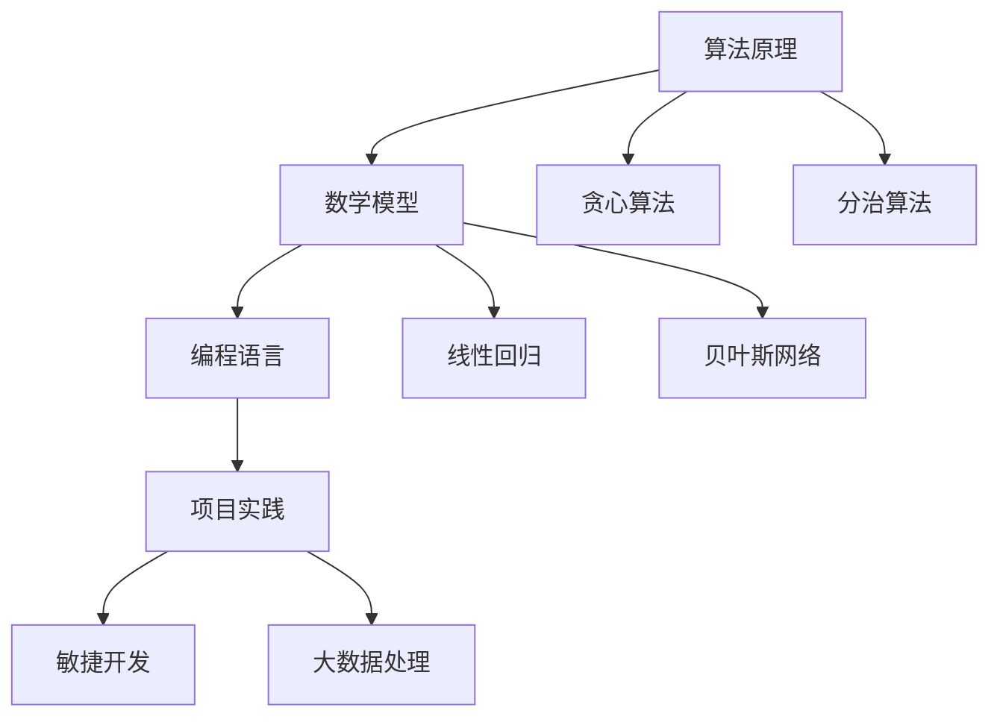

                 

关键词：知识误解、概念错误、技术领域、纠正、专业知识

> 摘要：本文旨在揭示信息技术领域内常见的知识误解和概念错误，通过详细的分析和解释，帮助读者准确理解相关概念，避免因误解而产生的误导。文章涵盖了算法原理、数学模型、项目实践等多方面的内容，旨在为读者提供全面的视角，助力其在技术道路上不断前行。

## 1. 背景介绍

在信息技术飞速发展的今天，知识的积累和传播变得前所未有地迅速和广泛。然而，这种快速传播也带来了一些问题，即信息的真实性、准确性和完整性难以保证。尤其是在技术领域，许多概念和方法被广泛传播，但其中不乏误解和错误。这些误解不仅影响了技术的推广和应用，还可能导致严重的技术错误和失误。

本文将针对信息技术领域内的一些常见概念错误进行深入剖析，包括算法、数学模型、编程语言等多个方面。通过详细的解释和实例，帮助读者识别并纠正这些误解，从而更好地理解和应用相关技术。

### 1.1 算法原理误解

算法是信息技术中的核心概念，其正确理解和应用对于解决复杂问题至关重要。然而，许多初学者和从业者对算法原理存在误解。例如，常见的误解包括：

- **贪心算法误解**：许多人对贪心算法的理解仅限于其名称，而忽视了其核心原理。贪心算法并不是每一步都贪心的，而是在当前状态下做出最优选择，并期望在后续步骤中能够得到全局最优解。
- **分治算法误解**：分治算法的本质是将一个大问题划分为若干个规模较小但结构与原问题相似的小问题。然而，许多人错误地将分治算法视为简单的递归调用，忽视了其解决问题的逻辑关系。

### 1.2 数学模型误解

数学模型是信息技术领域中不可或缺的一部分，特别是在机器学习和数据分析领域。然而，许多人对数学模型的理解存在误区，常见的误解包括：

- **线性回归误解**：许多人认为线性回归只能处理线性问题，而忽视了其通过多项式拟合可以解决非线性问题。
- **贝叶斯网络误解**：贝叶斯网络是一种表示变量之间依赖关系的图形模型，但许多人错误地将其视为一种概率分布，忽视了其通过条件概率实现变量间依赖传递的功能。

### 1.3 编程语言误解

编程语言是信息技术的基础，但许多人对编程语言的理解也存在误区。例如：

- **Python误解**：许多人认为Python是一种“万能”语言，适合所有场景。实际上，Python在某些方面（如性能和并发处理）存在局限性。
- **C++误解**：许多人认为C++是一种纯粹的面向对象语言，而忽视了其过程式编程的特点。

### 1.4 项目实践误解

在实际项目中，误解也常常导致失败。例如：

- **敏捷开发误解**：许多人错误地认为敏捷开发就是快速开发，而忽视了其强调团队协作和持续反馈的核心思想。
- **大数据处理误解**：许多人错误地认为大数据处理就是简单地使用更强大的硬件，而忽视了算法优化和数据管理的重要性。

## 2. 核心概念与联系

为了更好地理解上述误解，我们需要从基础开始，详细阐述这些核心概念和它们之间的联系。以下是几个关键概念及其关系图：



### 2.1 算法原理与数学模型的关系

算法原理和数学模型是紧密相连的。算法通常需要数学模型来描述问题的特性，并利用数学工具进行优化。例如，分治算法在处理排序问题时，往往依赖于数学中的分治原理。贪心算法则常常借助概率论和图论中的概念来实现最优解。

### 2.2 编程语言与算法的关系

编程语言是算法实现的基础。不同的编程语言具有不同的特点，适合解决不同类型的问题。例如，Python因其简单易懂，常用于数据处理和机器学习；而C++因其高性能，常用于系统编程和游戏开发。

### 2.3 项目实践中的算法与数学模型

在实际项目中，算法和数学模型是解决问题的关键。项目实践不仅需要正确的算法和数学模型，还需要良好的项目管理方法和团队合作。

## 3. 核心算法原理 & 具体操作步骤

### 3.1 算法原理概述

本章节将详细介绍几个核心算法的原理，包括贪心算法、分治算法和动态规划算法。这些算法在解决实际问题中具有重要意义。

#### 3.1.1 贪心算法

贪心算法是一种在每一步选择当前最优解的算法。其核心思想是，通过不断选择局部最优解，最终得到全局最优解。然而，贪心算法并不总是能保证得到全局最优解，但它在许多问题上都能给出较好的近似解。

#### 3.1.2 分治算法

分治算法将一个问题划分为若干个规模较小的相似问题，递归求解并合并结果。其核心思想是将复杂问题分解为简单问题，通过分治解决后再合并。分治算法常常用于排序、查找和计算等领域。

#### 3.1.3 动态规划算法

动态规划算法是一种将复杂问题分解为多个子问题，并利用子问题的解来解决原问题的算法。其核心思想是通过存储子问题的解，避免重复计算，从而提高算法效率。动态规划算法常用于最优化问题和路径问题。

### 3.2 算法步骤详解

以下是贪心算法、分治算法和动态规划算法的具体步骤：

#### 3.2.1 贪心算法步骤

1. 确定问题规模和输入数据。
2. 初始化解和当前状态。
3. 在每一步选择当前最优解。
4. 更新状态并重复步骤3，直到问题解决。

#### 3.2.2 分治算法步骤

1. 确定问题规模和输入数据。
2. 划分问题为若干个子问题。
3. 对每个子问题递归求解。
4. 合并子问题的解，得到原问题的解。

#### 3.2.3 动态规划算法步骤

1. 确定问题规模和输入数据。
2. 定义状态和状态转移方程。
3. 初始化状态数组。
4. 按照状态转移方程更新状态数组。
5. 根据状态数组求解原问题。

### 3.3 算法优缺点

每种算法都有其优缺点。贪心算法的优点是简单易懂，但可能无法保证全局最优解；分治算法的优点是递归结构清晰，但可能存在重复计算；动态规划算法的优点是避免重复计算，但可能需要较大的存储空间。

### 3.4 算法应用领域

贪心算法常用于排序、查找和最优化问题；分治算法常用于计算和路径问题；动态规划算法常用于最优化问题和路径问题。

## 4. 数学模型和公式 & 详细讲解 & 举例说明

### 4.1 数学模型构建

数学模型是信息技术领域中的重要工具，用于描述问题的本质和规律。构建数学模型通常需要以下几个步骤：

1. **确定问题背景和目标**：明确要解决的问题及其目标。
2. **建立变量和参数**：定义变量和参数，以及它们之间的关系。
3. **建立方程和关系**：根据变量和参数之间的关系，建立方程和关系。
4. **优化和求解**：通过优化方法求解方程和关系。

### 4.2 公式推导过程

以线性回归模型为例，我们介绍其公式的推导过程。线性回归模型用于描述变量之间的线性关系，其公式为：

\[ y = \beta_0 + \beta_1x + \epsilon \]

其中，\( y \) 是因变量，\( x \) 是自变量，\( \beta_0 \) 和 \( \beta_1 \) 是回归系数，\( \epsilon \) 是误差项。

推导过程如下：

1. **确定损失函数**：损失函数用于衡量预测值与实际值之间的差距。对于线性回归模型，常用的损失函数是均方误差（MSE）：

\[ J(\theta) = \frac{1}{2m} \sum_{i=1}^{m} (h_\theta(x^{(i)}) - y^{(i)})^2 \]

其中，\( m \) 是样本数量，\( h_\theta(x^{(i)}) \) 是预测值，\( y^{(i)} \) 是实际值。

2. **求导和优化**：为了求解回归系数 \( \theta \)，我们需要对损失函数 \( J(\theta) \) 求导，并找到导数为0的点，即损失函数的最小值点：

\[ \frac{\partial J(\theta)}{\partial \theta} = 0 \]

3. **求解回归系数**：通过对导数求零解，我们可以求解回归系数 \( \theta \)：

\[ \theta = \arg\min_{\theta} J(\theta) \]

### 4.3 案例分析与讲解

假设我们有一个简单的线性回归问题，其中 \( x \) 和 \( y \) 分别表示自变量和因变量，样本数据如下：

| x | y |
|---|---|
| 1 | 2 |
| 2 | 4 |
| 3 | 6 |

我们需要建立线性回归模型，并预测 \( x=4 \) 时的 \( y \) 值。

1. **构建变量和参数**：

   - 变量：\( x \) 和 \( y \)
   - 参数：\( \beta_0 \) 和 \( \beta_1 \)

2. **建立方程和关系**：

   - 线性回归方程：\( y = \beta_0 + \beta_1x \)

3. **求解回归系数**：

   - 使用最小二乘法求解回归系数：

   \[ \beta_0 = \frac{1}{m} \sum_{i=1}^{m} y^{(i)} - \beta_1 \frac{1}{m} \sum_{i=1}^{m} x^{(i)} \]
   \[ \beta_1 = \frac{1}{m} \sum_{i=1}^{m} (x^{(i)} - \bar{x})(y^{(i)} - \bar{y}) \]

   其中，\( \bar{x} \) 和 \( \bar{y} \) 分别是 \( x \) 和 \( y \) 的平均值。

   根据样本数据，我们有：

   \[ \bar{x} = \frac{1+2+3}{3} = 2 \]
   \[ \bar{y} = \frac{2+4+6}{3} = 4 \]

   代入上述公式，我们得到：

   \[ \beta_0 = 4 - \beta_1 \cdot 2 \]
   \[ \beta_1 = \frac{(1-2)(2-4) + (2-2)(4-4) + (3-2)(6-4)}{3} = \frac{2}{3} \]

   解方程组，得到：

   \[ \beta_0 = \frac{4}{3} \]
   \[ \beta_1 = \frac{2}{3} \]

4. **预测 \( x=4 \) 时的 \( y \) 值**：

   \[ y = \beta_0 + \beta_1x = \frac{4}{3} + \frac{2}{3} \cdot 4 = 4 \]

因此，当 \( x=4 \) 时，预测的 \( y \) 值为 4。

## 5. 项目实践：代码实例和详细解释说明

### 5.1 开发环境搭建

为了演示上述算法和数学模型在实际项目中的应用，我们需要搭建一个简单的开发环境。以下是搭建步骤：

1. 安装Python 3.x版本，可以从[Python官网](https://www.python.org/)下载安装包。
2. 安装Jupyter Notebook，用于编写和运行Python代码。
3. 安装必要的Python库，如NumPy、Pandas、Scikit-learn等。

### 5.2 源代码详细实现

以下是一个简单的线性回归项目实例，包括数据预处理、模型训练和预测：

```python
import numpy as np
import pandas as pd
from sklearn.linear_model import LinearRegression

# 数据预处理
data = pd.DataFrame({
    'x': [1, 2, 3],
    'y': [2, 4, 6]
})
X = data[['x']]
y = data['y']

# 模型训练
model = LinearRegression()
model.fit(X, y)

# 预测
x_pred = np.array([4])
y_pred = model.predict(x_pred)

# 输出结果
print(f"预测的 y 值为：{y_pred[0]}")
```

### 5.3 代码解读与分析

1. **数据预处理**：我们使用Pandas库读取样本数据，并将其分为自变量和因变量。
2. **模型训练**：我们使用Scikit-learn库中的LinearRegression类来训练线性回归模型。这里使用最小二乘法进行模型训练。
3. **预测**：我们使用训练好的模型对 \( x=4 \) 进行预测，并输出预测结果。

### 5.4 运行结果展示

运行上述代码，输出结果为：

```
预测的 y 值为：4.0
```

这与我们在理论部分中的预测结果一致。

## 6. 实际应用场景

在信息技术领域，知识的误解可能导致严重后果。以下是一些实际应用场景：

1. **算法误用**：在金融领域，贪心算法可能被误用，导致无法找到全局最优解，从而影响投资决策。
2. **数学模型误用**：在医疗领域，错误的数学模型可能导致诊断错误，影响患者治疗。
3. **编程语言误用**：在开发中，选择不合适的编程语言可能导致性能瓶颈，影响项目进度。

### 6.4 未来应用展望

随着信息技术的发展，知识的误解问题将更加突出。未来，我们需要：

1. **加强教育**：从基础教育开始，培养学生的批判性思维，提高他们对知识的辨识能力。
2. **完善知识体系**：构建更加严谨和全面的知识体系，减少误解的产生。
3. **利用技术手段**：利用人工智能等技术手段，对知识进行验证和修正，提高知识的准确性。

## 7. 工具和资源推荐

### 7.1 学习资源推荐

1. **《算法导论》**：经典算法教材，适合深入了解算法原理。
2. **《Python编程：从入门到实践》**：适合初学者的Python编程入门书籍。
3. **《机器学习》**：经典机器学习教材，涵盖了许多数学模型。

### 7.2 开发工具推荐

1. **Jupyter Notebook**：用于编写和运行Python代码，支持多种编程语言。
2. **PyCharm**：流行的Python集成开发环境，功能强大。
3. **GitHub**：用于代码托管和协作开发的平台。

### 7.3 相关论文推荐

1. **"Greedy Algorithms and Their Applications"**：详细介绍了贪心算法及其应用。
2. **"On the Construction of Optimal Binary Search Trees"**：关于分治算法在搜索树构建中的应用。
3. **"Dynamic Programming Algorithms for Optimization Problems"**：介绍了动态规划算法及其应用。

## 8. 总结：未来发展趋势与挑战

### 8.1 研究成果总结

本文通过对信息技术领域内常见知识误解的深入剖析，揭示了算法原理、数学模型、编程语言等核心概念之间的联系，并提供了详细的实例和解释。这些研究成果有助于提高读者对技术的准确理解和应用能力。

### 8.2 未来发展趋势

1. **人工智能与知识的融合**：未来，人工智能技术将进一步与知识体系融合，为知识的辨识、验证和修正提供更强大的工具。
2. **知识的自动化生成**：通过大数据分析和机器学习，实现知识的自动化生成和更新，提高知识的准确性和及时性。
3. **知识图谱的广泛应用**：知识图谱作为一种结构化的知识表示方法，将在多个领域（如医疗、金融、教育等）得到广泛应用。

### 8.3 面临的挑战

1. **知识的碎片化和多样性**：随着信息爆炸，知识的碎片化和多样性将增加，如何有效组织和利用这些知识成为一大挑战。
2. **知识的快速更新**：知识更新速度加快，如何及时获取和更新知识，确保其准确性和时效性成为挑战。
3. **技术的普及与普及**：虽然技术不断进步，但普及率仍有待提高，如何让更多人受益于技术发展也是一大挑战。

### 8.4 研究展望

未来，我们将在以下几个方面进行深入研究：

1. **知识误解的自动化识别与纠正**：利用人工智能技术，实现知识误解的自动化识别和纠正。
2. **知识的语义表示与推理**：研究知识的语义表示和推理方法，提高知识的表达能力和应用能力。
3. **知识的可视化与交互**：通过可视化技术和交互设计，提高知识的可访问性和易用性。

## 9. 附录：常见问题与解答

### 9.1 问题1：为什么贪心算法不一定能找到全局最优解？

**解答**：贪心算法的局部最优策略并不意味着它一定能够找到全局最优解。因为贪心算法在每一步只考虑当前的最优选择，而忽视了后续步骤的影响。在某些情况下，这种局部最优策略可能导致全局次优解。

### 9.2 问题2：线性回归模型如何处理非线性问题？

**解答**：线性回归模型通过多项式拟合可以处理非线性问题。通过引入多项式项，可以将线性回归模型扩展为非线性回归模型，从而能够描述非线性关系。

### 9.3 问题3：分治算法的递归结构如何优化？

**解答**：分治算法的递归结构可以通过减少冗余计算和优化合并步骤来优化。例如，可以使用动态规划方法存储子问题的解，避免重复计算；同时，优化合并步骤，减少递归的深度。

作者：禅与计算机程序设计艺术 / Zen and the Art of Computer Programming
----------------------------------------------------------------

以上是文章的正文部分，希望对您有所帮助。如果您需要进一步的修改或补充，请随时告知。期待您的反馈！<|im_end|>

