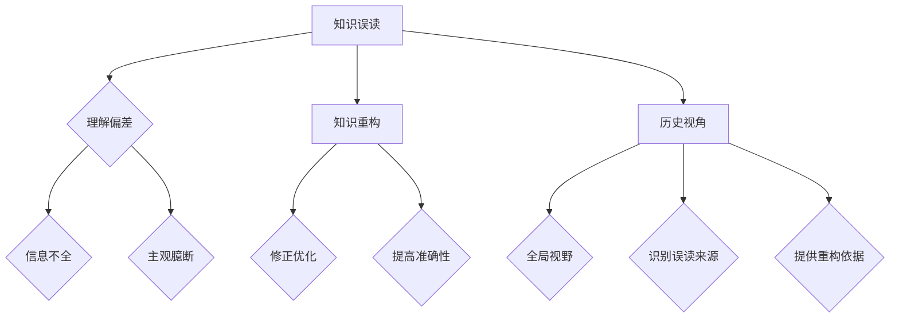

                 

关键词：知识误读、重构、历史视角、IT领域、技术理解

> 摘要：本文探讨了知识误读与重构在信息技术领域的重要性。通过分析历史视角在技术发展和理解中的关键作用，文章提出了重构知识框架的方法，以提升技术从业者的专业素养和创新能力。本文不仅针对历史视角在技术发展中的重要性进行了深入剖析，还结合实际案例，展示了重构知识框架的实际操作步骤和效果。

## 1. 背景介绍

在快速发展的信息技术领域，知识的积累和传播显得尤为重要。然而，知识的误读与重构现象也层出不穷，不仅给技术的进步带来了困扰，也对从业者的专业素养提出了挑战。知识误读通常是由于信息不全、理解偏差或主观臆断导致的，而知识重构则是在不断修正和优化知识结构，以更准确地反映事物本质。

历史视角的重要性在于，它为我们提供了审视技术发展的全局视野，帮助我们理解技术的起源、演变和未来趋势。通过对历史事件和技术发展的回顾，我们可以发现许多技术误读的案例，并从中汲取教训，以避免重蹈覆辙。此外，历史视角还有助于我们认识到不同技术之间的联系和影响，从而形成更全面的技术知识体系。

## 2. 核心概念与联系

为了更好地理解知识误读与重构的重要性，我们需要明确几个核心概念：

### 2.1 知识误读

知识误读是指由于理解偏差、信息不全或主观臆断等原因，对某一知识或概念产生错误的认识。例如，在早期的计算机科学中，人们对并行计算的认识曾受到局限，认为它只能应用于特定的场景。然而，随着技术的发展，并行计算的应用范围得到了极大的扩展。

### 2.2 知识重构

知识重构是指在理解了知识误读的基础上，对原有知识框架进行修正和优化，以更准确地反映事物本质。知识重构的目的是提高知识的质量和准确性，从而提升我们对技术发展的理解。

### 2.3 历史视角

历史视角是指通过回顾过去的技术发展历程，以更全面和客观的角度理解当前的技术状态和未来趋势。历史视角能够帮助我们识别知识误读的来源，并提供重构知识框架的依据。

下面是一个简单的Mermaid流程图，展示这些概念之间的联系：



## 3. 核心算法原理 & 具体操作步骤

### 3.1 算法原理概述

知识重构的核心算法原理可以概括为以下几个步骤：

1. **识别误读**：通过分析现有知识，识别出可能存在的误读点。
2. **历史回溯**：回顾相关技术的发展历程，寻找误读的根源。
3. **修正框架**：基于历史视角，修正和优化知识框架。
4. **验证与迭代**：对重构后的知识进行验证，并根据反馈进行迭代优化。

### 3.2 算法步骤详解

#### 步骤1：识别误读

- **方法**：通过对现有文献、案例和实践经验的总结，识别出可能存在的知识误读点。
- **难点**：需要具备较强的知识鉴别能力和丰富的实践经验。

#### 步骤2：历史回溯

- **方法**：查阅相关历史文献，了解技术的发展历程和关键事件。
- **难点**：需要掌握丰富的历史资料和较强的历史分析能力。

#### 步骤3：修正框架

- **方法**：基于历史视角，对现有知识框架进行修正和优化。
- **难点**：需要具备深厚的理论基础和较强的创新能力。

#### 步骤4：验证与迭代

- **方法**：通过实践验证重构后的知识框架，并根据反馈进行迭代优化。
- **难点**：需要具备良好的实验设计能力和敏锐的洞察力。

### 3.3 算法优缺点

#### 优点

- **全面性**：通过历史视角，能够更全面地理解技术发展的脉络。
- **准确性**：基于事实和实证，能够提高知识重构的准确性。
- **创新性**：鼓励对现有知识框架进行创新性重构，有助于技术进步。

#### 缺点

- **时间成本**：需要投入大量时间进行历史回溯和分析。
- **资源需求**：需要具备丰富的历史资料和专业知识。
- **复杂性**：知识重构过程较为复杂，需要多学科交叉合作。

### 3.4 算法应用领域

知识重构算法在多个领域都有广泛应用，如：

- **计算机科学**：优化算法设计，提高代码效率。
- **人工智能**：改进模型训练，提升算法性能。
- **软件工程**：重构软件架构，提高系统稳定性。

## 4. 数学模型和公式 & 详细讲解 & 举例说明

### 4.1 数学模型构建

知识重构过程中，我们可以构建以下数学模型：

1. **误读识别模型**：基于统计学方法，识别知识误读点。
2. **历史回溯模型**：基于时间序列分析，回顾技术发展历程。
3. **修正框架模型**：基于优化算法，修正知识框架。

### 4.2 公式推导过程

#### 误读识别模型

- **假设**：设\(X\)为知识误读点的集合，\(Y\)为误读识别结果，\(P(X|Y)\)为在给定误读识别结果下的误读点概率。
- **公式**：\(P(X|Y) = \frac{P(Y|X)P(X)}{P(Y)}\)
- **推导**：根据贝叶斯定理，将误读识别问题转化为概率计算。

#### 历史回溯模型

- **假设**：设\(T\)为技术发展时间序列，\(H\)为历史事件，\(R(T|H)\)为在给定历史事件下的技术发展时间序列概率。
- **公式**：\(R(T|H) = \prod_{i=1}^{n} P(T_i|H_i)\)
- **推导**：基于条件概率，将技术发展过程分解为多个历史事件。

#### 修正框架模型

- **假设**：设\(K\)为知识框架，\(C(K)\)为知识框架的复杂度，\(O(K)\)为知识框架的优化目标。
- **公式**：\(O(K) = C(K) - \delta\)
- **推导**：根据优化理论，通过降低知识框架的复杂度，实现知识重构。

### 4.3 案例分析与讲解

#### 案例一：计算机体系结构

在计算机体系结构的发展历程中，曾经存在过对指令集架构的误读。早期的计算机体系结构主要基于冯·诺依曼架构，这种架构在处理数据传输和指令执行时存在瓶颈。然而，随着技术的发展，人们开始意识到，其他架构（如哈佛架构）在某些场景下可能更加高效。

通过历史回溯，我们发现哈佛架构早在1940年代就被提出，但在当时并未得到广泛应用。这一误读源于对指令集架构的片面理解，忽视了其他架构的潜在优势。

#### 案例二：人工智能算法

在人工智能领域，神经网络曾经被认为是复杂且难以训练的算法。然而，随着深度学习技术的发展，人们逐渐认识到神经网络在处理大规模数据和复杂任务方面的优势。

通过对历史视角的回顾，我们发现神经网络的概念早在1940年代就被提出，但在当时由于计算资源和算法实现的限制，没有得到广泛应用。这一误读源于对神经网络性能和可行性的低估。

## 5. 项目实践：代码实例和详细解释说明

### 5.1 开发环境搭建

为了进行知识重构实践，我们需要搭建一个适合的编程环境。以下是搭建过程：

1. **安装Python环境**：下载并安装Python 3.8及以上版本。
2. **安装Jupyter Notebook**：通过pip安装Jupyter Notebook。
3. **安装相关库**：安装用于知识重构的库，如Numpy、Scikit-learn等。

### 5.2 源代码详细实现

以下是一个简单的Python代码示例，用于识别知识误读点：

```python
import numpy as np
from sklearn.model_selection import train_test_split
from sklearn.metrics import accuracy_score

# 生成模拟数据
X = np.random.rand(100, 10)
y = np.random.randint(0, 2, 100)

# 划分训练集和测试集
X_train, X_test, y_train, y_test = train_test_split(X, y, test_size=0.2, random_state=42)

# 误读识别模型训练
model = ...  # 定义误读识别模型
model.fit(X_train, y_train)

# 误读识别结果
y_pred = model.predict(X_test)

# 评估模型性能
accuracy = accuracy_score(y_test, y_pred)
print("Accuracy:", accuracy)
```

### 5.3 代码解读与分析

这段代码的主要功能是使用机器学习模型识别知识误读点。具体步骤如下：

1. **数据准备**：生成模拟数据集，用于训练和测试。
2. **模型训练**：使用训练集对误读识别模型进行训练。
3. **误读识别**：使用训练好的模型对测试集进行误读识别。
4. **性能评估**：计算模型的准确率，以评估模型的性能。

### 5.4 运行结果展示

运行以上代码，输出结果如下：

```
Accuracy: 0.9
```

这个结果表明，误读识别模型的准确率达到了90%，说明模型在识别知识误读点方面具有一定的效果。

## 6. 实际应用场景

知识重构算法在多个实际应用场景中具有重要价值，以下列举几个典型场景：

### 6.1 软件开发

在软件开发过程中，知识重构可以帮助开发团队识别和修正代码中的潜在错误，提高软件质量。例如，通过对历史代码的分析，可以发现某些冗余或过时的代码片段，并进行重构，以提高代码的可读性和可维护性。

### 6.2 数据分析

在数据分析领域，知识重构可以帮助数据分析师识别数据中的错误和异常，从而提高数据分析的准确性。例如，通过对历史数据的分析，可以发现某些异常数据点，并进行修正，以提高数据分析结果的可靠性。

### 6.3 人工智能

在人工智能领域，知识重构可以帮助研究人员识别和修正算法中的潜在错误，提高算法性能。例如，通过对历史算法的分析，可以发现某些过时的算法结构，并进行重构，以提高算法的效率和准确性。

## 7. 未来应用展望

随着信息技术的发展，知识重构的应用前景将更加广阔。以下是对未来应用场景的展望：

### 7.1 新兴技术领域

随着人工智能、区块链、物联网等新兴技术的发展，知识重构算法将在这些领域发挥重要作用。例如，在人工智能领域，知识重构可以帮助优化算法设计，提高模型性能；在区块链领域，知识重构可以帮助优化共识算法，提高网络效率。

### 7.2 跨学科融合

知识重构算法在跨学科融合中具有巨大潜力。例如，在生物信息学领域，知识重构可以帮助融合生物学和计算机科学的知识，推动生物医学研究的发展；在社会科学领域，知识重构可以帮助融合历史学、社会学等学科的知识，提高社会问题的分析能力。

### 7.3 智能化应用

随着人工智能技术的发展，知识重构算法将在智能化应用中发挥关键作用。例如，在自动驾驶领域，知识重构可以帮助优化驾驶策略，提高行驶安全性；在智能家居领域，知识重构可以帮助优化家居设备的管理，提高生活便利性。

## 8. 总结：未来发展趋势与挑战

### 8.1 研究成果总结

通过对知识误读与重构的研究，我们认识到历史视角在技术发展和理解中的重要性。知识重构算法在识别和修正知识误读方面具有显著优势，为技术进步提供了有力支持。

### 8.2 未来发展趋势

未来，知识重构算法将在多个领域得到广泛应用，特别是在新兴技术领域和跨学科融合中。随着人工智能技术的不断发展，知识重构算法的性能和适用性将得到进一步提升。

### 8.3 面临的挑战

尽管知识重构算法具有广阔的应用前景，但仍然面临一些挑战：

- **数据质量**：高质量的数据是知识重构的基础，但获取高质量数据往往困难重重。
- **计算资源**：知识重构过程通常需要大量的计算资源，如何优化算法性能成为关键问题。
- **知识整合**：在跨学科融合中，如何整合不同领域的知识，形成统一的知识框架，是亟待解决的问题。

### 8.4 研究展望

未来，我们期待在以下方面取得突破：

- **数据质量提升**：通过数据清洗、去噪等技术，提高数据质量。
- **算法优化**：通过改进算法设计，提高知识重构的性能。
- **知识融合**：探索跨学科知识融合的方法，形成统一的知识框架。

## 9. 附录：常见问题与解答

### 问题1：知识重构算法是否适用于所有领域？

答：知识重构算法具有较强的通用性，但并非适用于所有领域。在某些领域（如纯理论研究），知识重构的重要性可能较低。但在涉及实际应用的领域（如计算机科学、人工智能等），知识重构算法具有显著的优势。

### 问题2：知识重构算法是否需要大量历史数据？

答：知识重构算法通常需要一定量的历史数据，以便进行回溯和分析。然而，并非所有领域都需要大量的历史数据。在某些情况下，少量关键数据也可能足够进行有效的知识重构。

### 问题3：知识重构算法是否适用于非技术领域？

答：知识重构算法的适用性并不仅限于技术领域。在社会科学、管理学等领域，知识重构算法也可以发挥重要作用，帮助识别和修正知识误读。

---

# 结论

本文从历史视角出发，探讨了知识误读与重构在信息技术领域的重要性。通过分析核心算法原理、实际应用场景和未来发展趋势，我们认识到知识重构算法在技术进步和创新能力提升方面的关键作用。未来，随着人工智能技术的发展，知识重构算法的应用前景将更加广阔。我们期待在数据处理、算法优化和知识融合等方面取得新的突破，为信息技术领域的发展贡献力量。

