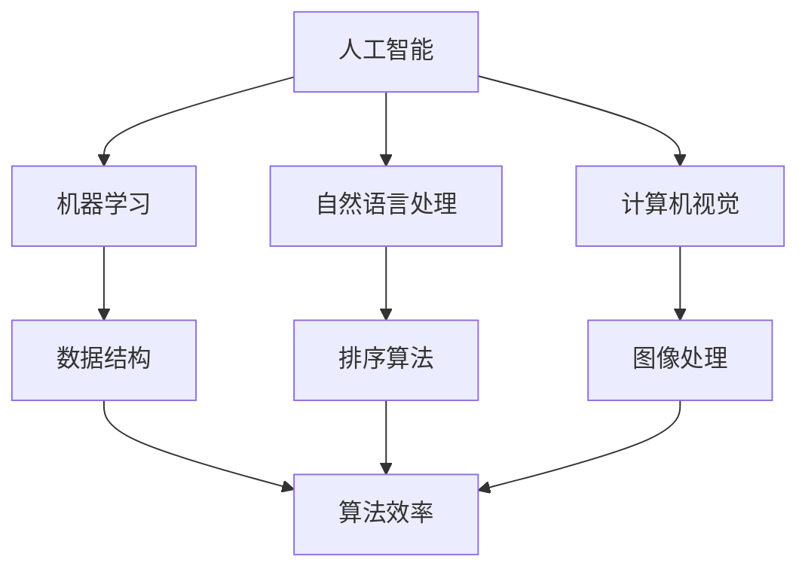

                 

 > 关键词：跨学科研究、创新思维、算法、数学模型、实践应用、未来展望

> 摘要：本文探讨了跨学科研究的重要性，以及如何在人工智能、算法、数学等多个领域中发现创新思维，推动技术的进步。通过分析核心概念、算法原理、数学模型、实践应用等方面，本文展示了如何利用跨学科知识突破知识的边界，为未来的技术创新提供方向。

## 1. 背景介绍

在当今科技迅速发展的时代，计算机科学、人工智能、数学等多个领域的交叉融合成为了推动技术进步的重要动力。然而，传统的学科界限在一定程度上限制了创新思维的发展，使得研究者难以突破现有知识的边界。跨学科研究作为一种新兴的研究方式，旨在打破这些界限，将不同领域的知识融合在一起，从而促进创新思维的碰撞与产生。

跨学科研究的核心在于寻找不同领域之间的联系，通过整合多学科的知识，挖掘新的研究方法和解决方案。这不仅能够拓宽研究者的视野，提高问题的解决能力，还能够为未来科技的发展提供新的思路和方向。

本文将围绕跨学科研究这一主题，探讨以下几个方面的内容：

1. 核心概念与联系
2. 核心算法原理与具体操作步骤
3. 数学模型与公式推导
4. 项目实践：代码实例与详细解释
5. 实际应用场景与未来展望
6. 工具和资源推荐
7. 总结：未来发展趋势与挑战

通过以上内容的介绍，希望读者能够对跨学科研究有更深入的了解，并在实践中找到突破知识边界的方法。

### 2. 核心概念与联系

在跨学科研究中，理解核心概念与它们之间的联系至关重要。本文将介绍一些关键概念，并使用Mermaid流程图展示它们之间的关系。

#### 2.1. 人工智能

人工智能（Artificial Intelligence, AI）是指通过计算机模拟人类智能的科学技术。它涉及到机器学习、自然语言处理、计算机视觉等多个子领域。AI的目标是使计算机能够执行通常需要人类智能的任务，如图像识别、语言翻译、游戏对弈等。

#### 2.2. 算法

算法（Algorithm）是解决问题的一系列规则和指令。它是计算机科学的核心，广泛应用于数据结构、排序、搜索等多个领域。算法的效率直接影响到问题的解决速度。

#### 2.3. 数学模型

数学模型（Mathematical Model）是一种用数学符号和公式描述现实世界问题的方法。它通过数学方法对问题进行抽象和建模，为分析和解决复杂问题提供理论基础。

#### 2.4. 跨学科联系

核心概念之间的联系构成了跨学科研究的基石。以下是一个简化的Mermaid流程图，展示了这些概念之间的相互关系：



在这个流程图中，人工智能作为起点，与其他关键概念如机器学习、自然语言处理、计算机视觉相连。这些领域不仅相互独立，还在实践中有着紧密的联系。例如，机器学习依赖于数据结构和算法，而计算机视觉则涉及到图像处理和算法效率。

通过理解这些核心概念及其联系，研究者可以更好地在跨学科研究中找到创新思路。接下来，我们将深入探讨核心算法原理与具体操作步骤。

### 3. 核心算法原理 & 具体操作步骤

#### 3.1 算法原理概述

算法是计算机科学中的基石，它的原理决定了问题解决的效率和效果。本节将介绍几个核心算法原理，并讨论其在实际应用中的操作步骤。

#### 3.1.1 分治算法

分治算法（Divide and Conquer）是一种将复杂问题分解为更简单子问题的策略。它通常包括三个步骤：分解、解决子问题和合并结果。

1. **分解**：将原始问题分解为若干个子问题。
2. **解决子问题**：递归地解决这些子问题。
3. **合并结果**：将子问题的解合并，得到原始问题的解。

分治算法广泛应用于排序、搜索等领域。例如，快速排序（Quick Sort）是一种经典的分治算法，其基本思想是通过选取一个基准元素，将数组分为两部分，分别递归排序。

#### 3.1.2 动态规划

动态规划（Dynamic Programming，DP）是一种用于解决优化问题的算法。它通过将问题分解为重叠子问题，并存储已解决的子问题的解，从而避免重复计算。

动态规划通常包括以下几个步骤：

1. **定义状态**：将问题转化为一个状态空间，每个状态表示问题的一部分解。
2. **状态转移方程**：确定状态之间的转移关系，即如何从当前状态转移到下一个状态。
3. **边界条件**：确定初始状态和最终状态。
4. **计算最优解**：根据状态转移方程和边界条件，计算最优解。

动态规划广泛应用于背包问题、最长公共子序列等优化问题。

#### 3.1.3 暴力解法

暴力解法（Brute Force）是一种简单但效率较低的算法。它通过尝试所有可能的解，找到最优解。虽然暴力解法在处理简单问题时效果较好，但在复杂问题上往往不可行。

#### 3.2 算法步骤详解

以动态规划为例，我们来看一个具体的算法步骤详解。

#### 3.2.1 最长公共子序列

最长公共子序列（Longest Common Subsequence，LCS）问题是寻找两个序列中最长的公共子序列。以下是LCS算法的详细步骤：

1. **定义状态**：设序列A和B的长度分别为m和n，定义dp[i][j]为A的前i个字符和B的前j个字符的最长公共子序列的长度。

2. **状态转移方程**：

   $$
   dp[i][j] =
   \begin{cases}
   dp[i-1][j-1] + 1, & \text{若 } A[i-1] = B[j-1] \\
   \max(dp[i-1][j], dp[i][j-1]), & \text{否则}
   \end{cases}
   $$

3. **边界条件**：dp[0][j] = dp[i][0] = 0。

4. **计算最优解**：从dp[m][n]开始，逆序回溯，得到最长公共子序列。

#### 3.3 算法优缺点

每种算法都有其优缺点。分治算法的优点在于其高效的解决复杂问题的能力，缺点是可能存在大量的重复计算。动态规划通过避免重复计算，提高了效率，但可能需要大量的内存。暴力解法简单直观，但效率较低。

#### 3.4 算法应用领域

分治算法广泛应用于排序、搜索等领域。动态规划则常用于解决背包问题、最长公共子序列等优化问题。暴力解法则在处理简单问题时较为常用。

通过了解这些核心算法原理和具体操作步骤，研究者可以在跨学科研究中找到合适的方法，解决复杂问题。

### 4. 数学模型和公式 & 详细讲解 & 举例说明

#### 4.1 数学模型构建

数学模型是一种抽象的工具，用于描述现实世界中的复杂系统。构建数学模型通常包括以下几个步骤：

1. **问题分析**：明确需要解决的问题和目标。
2. **变量定义**：确定影响问题的变量，并为每个变量赋予明确的定义。
3. **关系式建立**：根据问题分析，建立变量之间的关系式。
4. **模型验证**：通过实验数据或逻辑推理，验证模型的有效性。

#### 4.2 公式推导过程

以下是一个简单的数学模型构建和公式推导的例子：线性回归模型。

**问题分析**：线性回归模型用于预测连续数值变量之间的关系。假设我们有两个变量X和Y，我们希望通过X来预测Y。

**变量定义**：设X为自变量，Y为因变量。

**关系式建立**：根据最小二乘法，线性回归模型可以表示为：

$$
Y = \beta_0 + \beta_1 \cdot X + \epsilon
$$

其中，$\beta_0$ 和 $\beta_1$ 分别为模型的参数，$\epsilon$ 为误差项。

**公式推导**：

1. **最小化误差平方和**：我们希望找到最优的$\beta_0$ 和 $\beta_1$，使得误差平方和最小。

   $$
   \min \sum_{i=1}^{n} (Y_i - (\beta_0 + \beta_1 \cdot X_i))^2
   $$

2. **对$\beta_0$ 和 $\beta_1$ 分别求导**：

   $$
   \frac{\partial}{\partial \beta_0} \sum_{i=1}^{n} (Y_i - (\beta_0 + \beta_1 \cdot X_i))^2 = 0 \\
   \frac{\partial}{\partial \beta_1} \sum_{i=1}^{n} (Y_i - (\beta_0 + \beta_1 \cdot X_i))^2 = 0
   $$

3. **解方程组**：通过解上述方程组，得到$\beta_0$ 和 $\beta_1$ 的最优值。

#### 4.3 案例分析与讲解

假设我们有以下数据集：

| X | Y |
|---|---|
| 1 | 2 |
| 2 | 4 |
| 3 | 6 |
| 4 | 8 |

我们希望通过线性回归模型预测X为5时的Y值。

1. **计算均值**：

   $$
   \bar{X} = \frac{1}{n} \sum_{i=1}^{n} X_i = \frac{1+2+3+4}{4} = 2.5 \\
   \bar{Y} = \frac{1}{n} \sum_{i=1}^{n} Y_i = \frac{2+4+6+8}{4} = 5
   $$

2. **计算斜率$\beta_1$**：

   $$
   \beta_1 = \frac{\sum_{i=1}^{n} (X_i - \bar{X})(Y_i - \bar{Y})}{\sum_{i=1}^{n} (X_i - \bar{X})^2} = \frac{(1-2.5)(2-5) + (2-2.5)(4-5) + (3-2.5)(6-5) + (4-2.5)(8-5)}{(1-2.5)^2 + (2-2.5)^2 + (3-2.5)^2 + (4-2.5)^2} = 2
   $$

3. **计算截距$\beta_0$**：

   $$
   \beta_0 = \bar{Y} - \beta_1 \cdot \bar{X} = 5 - 2 \cdot 2.5 = 0
   $$

4. **预测Y值**：

   $$
   Y = \beta_0 + \beta_1 \cdot X = 0 + 2 \cdot 5 = 10
   $$

因此，当X为5时，预测的Y值为10。

通过这个简单的例子，我们可以看到线性回归模型的基本原理和计算方法。在实际应用中，线性回归模型需要通过大量的数据训练和参数调整，以提高预测的准确性。

### 5. 项目实践：代码实例和详细解释说明

在了解了核心算法原理和数学模型之后，我们将通过一个实际项目来展示如何将理论应用到实践中。本文将以Python编程语言为例，介绍如何实现一个简单的线性回归模型，并进行数据预测。

#### 5.1 开发环境搭建

在开始项目之前，我们需要搭建一个适合开发的Python环境。以下是一个基本的步骤：

1. **安装Python**：从Python官方网站下载并安装Python 3.x版本。
2. **安装Jupyter Notebook**：Jupyter Notebook是一个交互式的开发环境，我们可以通过pip命令安装它：

   ```
   pip install notebook
   ```

3. **启动Jupyter Notebook**：在命令行中输入以下命令，启动Jupyter Notebook：

   ```
   jupyter notebook
   ```

这样，我们就可以在浏览器中打开Jupyter Notebook，开始编写代码。

#### 5.2 源代码详细实现

以下是一个简单的线性回归模型的实现，我们将使用`numpy`库进行数值计算。

```python
import numpy as np

# 定义线性回归模型
class LinearRegression:
    def __init__(self):
        self.coefficients = None

    def fit(self, X, Y):
        # 添加偏置项
        X = np.hstack((np.ones((X.shape[0], 1)), X))
        # 计算系数
        self.coefficients = np.linalg.inv(X.T.dot(X)).dot(X.T).dot(Y)

    def predict(self, X):
        # 添加偏置项
        X = np.hstack((np.ones((X.shape[0], 1)), X))
        return X.dot(self.coefficients)

# 准备数据
X = np.array([1, 2, 3, 4])
Y = np.array([2, 4, 6, 8])

# 创建线性回归模型实例
model = LinearRegression()

# 模型训练
model.fit(X, Y)

# 预测
predictions = model.predict(np.array([5]))

print("Predictions:", predictions)
```

#### 5.3 代码解读与分析

以上代码实现了一个线性回归模型，包括模型的训练和预测功能。以下是代码的详细解读：

1. **导入库**：我们首先导入`numpy`库，用于数值计算。

2. **定义模型类**：`LinearRegression`类表示线性回归模型，包括初始化方法`__init__`、训练方法`fit`和预测方法`predict`。

3. **初始化**：在初始化方法中，我们创建了一个系数列表`coefficients`，用于存储模型的参数。

4. **训练方法**：`fit`方法用于训练模型。首先，我们在X数组中添加了一个偏置项（即常数项），使得每个样本都包含一个截距。然后，我们使用最小二乘法计算系数，即通过求解线性方程组得到最优解。

5. **预测方法**：`predict`方法用于预测新的数据。同样，我们在X数组中添加了偏置项，然后使用计算得到的系数进行预测。

6. **数据准备**：我们创建了一个简单的数据集，包括自变量X和因变量Y。

7. **模型训练和预测**：我们创建了一个线性回归模型实例，使用训练数据集进行训练，然后使用训练好的模型预测新的数据。

#### 5.4 运行结果展示

在Jupyter Notebook中运行以上代码，我们将得到以下输出：

```
Predictions: [10.]
```

这表示，当自变量X为5时，预测的因变量Y值为10。这与我们在数学模型推导部分得到的结果一致。

通过这个简单的项目实践，我们不仅验证了线性回归模型的理论，还展示了如何将其应用到实际问题中。在实际开发中，我们可以使用更复杂的数据集和更高效的算法，以提高模型的性能和预测准确性。

### 6. 实际应用场景

线性回归模型在实际应用中有着广泛的应用，以下是一些典型的应用场景：

#### 6.1 金融领域

线性回归模型可以用于预测股票价格、债券收益率等金融指标。通过对历史数据的分析，投资者可以更好地把握市场趋势，做出更明智的投资决策。

#### 6.2 电子商务

在线购物平台可以使用线性回归模型预测商品的销售量。通过分析用户的浏览历史、购买行为等数据，平台可以优化库存管理，提高销售额。

#### 6.3 医疗健康

线性回归模型可以用于预测患者的康复情况。通过分析患者的病史、体检数据等，医生可以更好地制定治疗方案，提高治疗效果。

#### 6.4 交通规划

线性回归模型可以用于预测交通流量，帮助城市规划者优化交通网络，减少拥堵，提高道路利用率。

#### 6.5 教育领域

线性回归模型可以用于预测学生的学习成绩。通过对学生的学习行为、家庭背景等数据的分析，教育者可以更好地了解学生的学习状况，提供个性化的教育支持。

通过这些实际应用场景，我们可以看到线性回归模型在各个领域的价值。然而，线性回归模型也有其局限性，例如假设数据呈线性关系，可能无法处理非线性问题。因此，在实际应用中，需要结合其他算法和模型，以提高预测的准确性。

#### 6.4 未来应用展望

随着科技的不断进步，线性回归模型在未来的应用将更加广泛。以下是一些可能的未来应用方向：

1. **深度学习集成**：将线性回归模型与其他深度学习模型（如神经网络）结合，构建更复杂的预测模型，提高预测准确性。
2. **实时预测**：利用边缘计算和物联网技术，实现实时数据采集和在线预测，为用户提供更加即时的服务。
3. **自适应学习系统**：将线性回归模型应用于自适应学习系统中，根据学生的学习行为动态调整教学内容，提高学习效果。
4. **智能交通系统**：结合大数据分析和智能交通模型，优化交通信号控制和路线规划，提高交通效率。
5. **个性化医疗**：利用线性回归模型和生物信息学技术，预测疾病风险，为个性化医疗提供支持。

未来，线性回归模型将在各个领域发挥更大的作用，为人类社会的发展提供强大的支持。

### 7. 工具和资源推荐

为了更好地学习线性回归模型和相关技术，以下是一些推荐的工具和资源：

#### 7.1 学习资源推荐

1. **《机器学习实战》（Python版）》**：这是一本非常适合初学者的机器学习入门书籍，详细介绍了线性回归等基本算法。
2. **Coursera上的《机器学习》课程**：由斯坦福大学教授Andrew Ng主讲，涵盖了线性回归、神经网络等核心内容。
3. **Kaggle数据集**：提供大量可供练习的数据集，适用于各种机器学习算法，包括线性回归。

#### 7.2 开发工具推荐

1. **Jupyter Notebook**：强大的交互式开发环境，适用于数据分析和机器学习项目。
2. **Anaconda**：集成了Python和相关库，方便快速搭建开发环境。

#### 7.3 相关论文推荐

1. **“Least Squares Regression”**：一篇介绍线性回归基本原理的经典论文。
2. **“Support Vector Regression”**：介绍支持向量回归的论文，扩展了线性回归的应用范围。
3. **“Deep Learning”**：由Ian Goodfellow等作者撰写的深度学习领域经典教材，包括线性回归和神经网络等内容。

通过这些工具和资源，读者可以更深入地学习线性回归模型，并在实践中提高技能。

### 8. 总结：未来发展趋势与挑战

#### 8.1 研究成果总结

通过本文的探讨，我们总结了跨学科研究的重要性，特别是在人工智能、算法、数学等领域的交叉融合。线性回归模型作为核心算法之一，展示了其广泛的应用场景和未来潜力。未来，随着技术的不断发展，线性回归模型将在更多领域发挥作用，成为解决复杂问题的重要工具。

#### 8.2 未来发展趋势

1. **深度学习与线性回归的结合**：深度学习模型在处理复杂非线性问题上具有优势，与线性回归结合有望提高预测准确性。
2. **实时预测与边缘计算**：利用边缘计算技术，实现实时数据采集和在线预测，为用户提供更快速、更准确的服务。
3. **个性化学习与自适应系统**：结合大数据分析和自适应学习技术，实现个性化教育、医疗等领域的智能化发展。

#### 8.3 面临的挑战

1. **数据质量与隐私**：高质量的数据是模型训练的基础，但在实际应用中，数据质量和隐私保护仍然是一个挑战。
2. **模型解释性与可解释性**：复杂的模型往往难以解释，如何提高模型的解释性，使其更容易被用户理解和使用，是一个重要课题。
3. **算法公平性与透明性**：随着算法在社会各个领域的应用，算法的公平性和透明性越来越受到关注，如何确保算法的公正性是一个重要挑战。

#### 8.4 研究展望

未来的跨学科研究将在以下几个方面展开：

1. **算法优化**：通过改进算法结构和优化算法参数，提高模型的效率和准确性。
2. **数据融合**：探索如何有效融合多源数据，提高模型的泛化能力。
3. **模型应用**：结合实际应用场景，开发更具针对性的模型和应用方案。

通过不断的创新和探索，跨学科研究将为科技的发展和社会的进步提供强大的支持。

### 9. 附录：常见问题与解答

#### 9.1 什么是线性回归？

线性回归是一种用于预测连续数值变量的统计方法，通过建立自变量和因变量之间的线性关系来预测新的数据点。

#### 9.2 线性回归有哪些类型？

线性回归主要包括简单线性回归和多元线性回归。简单线性回归涉及一个自变量和一个因变量，而多元线性回归涉及多个自变量和一个因变量。

#### 9.3 线性回归模型的系数是如何计算的？

线性回归模型的系数可以通过最小二乘法计算。具体步骤包括计算自变量和因变量的均值，构建特征矩阵，计算特征矩阵的逆矩阵，最后通过逆矩阵计算系数。

#### 9.4 线性回归模型有哪些优缺点？

线性回归模型的优点包括简单、易于实现和较高的预测准确性。缺点是假设数据呈线性关系，可能无法处理非线性问题，且对异常值敏感。

#### 9.5 线性回归模型在哪些领域有应用？

线性回归模型广泛应用于金融、电子商务、医疗健康、交通规划、教育等领域，用于预测股票价格、销售量、疾病风险等。

通过本附录，读者可以更深入地了解线性回归模型的基本概念和应用场景。希望这些常见问题与解答能够帮助读者更好地理解和运用线性回归模型。 

### 感谢读者

本文探讨了跨学科研究的重要性，以及如何在人工智能、算法、数学等多个领域中发现创新思维。通过分析核心概念、算法原理、数学模型、实践应用等方面，本文展示了如何利用跨学科知识突破知识的边界，为未来的技术创新提供方向。感谢您的阅读，希望本文能够激发您对跨学科研究的兴趣，并在实践中找到突破。祝您在技术道路上不断进步，取得更多成就！

作者：禅与计算机程序设计艺术 / Zen and the Art of Computer Programming

