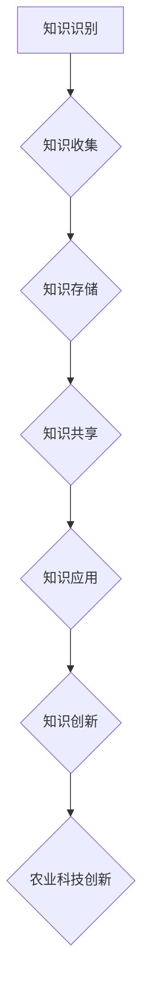

                 

## 1. 背景介绍

农业科技是现代农业生产的重要支撑，它通过科技手段提高农产品的产量和质量，改善农业生产环境，降低生产成本，促进农业可持续发展。随着全球人口的增长和气候变化等问题的日益严峻，农业科技的重要性愈发凸显。然而，农业科技创新面临诸多挑战，包括数据资源分散、信息不对称、科研资源分散等问题。为了解决这些问题，知识管理成为了农业科技创新的重要手段。

知识管理是指通过系统的方法收集、整理、存储、共享和利用知识，以提高组织或个人的创新能力。在农业科技创新中，知识管理有助于整合分散的科研资源，促进信息共享，提高科研效率。通过知识管理，研究人员可以更加便捷地获取和利用已有的科研成果，避免重复劳动，缩短研发周期。

知识管理在农业科技创新中的作用主要体现在以下几个方面：

- **提高科研效率**：知识管理可以帮助研究人员快速定位相关领域的研究成果，提高科研效率。
- **促进知识共享**：知识管理通过构建知识库和共享平台，促进科研人员之间的交流与合作，减少信息不对称。
- **支持决策制定**：知识管理可以为农业政策制定者提供丰富的数据支持和科学依据，提高决策的科学性。
- **培养创新人才**：知识管理有助于研究人员积累经验和技能，提高创新能力，培养创新人才。

本文将从知识管理在农业科技创新中的作用、核心概念与联系、核心算法原理与具体操作步骤、数学模型与公式、项目实践、实际应用场景、未来应用展望、工具和资源推荐以及未来发展趋势与挑战等方面进行深入探讨。

## 2. 核心概念与联系

在讨论知识管理在农业科技创新中的作用之前，我们需要了解几个核心概念，包括知识管理、农业科技创新、知识共享、知识整合、知识库等。

### 2.1 知识管理

知识管理是指通过系统的方法和工具，对知识进行识别、收集、存储、共享、应用和创新的过程。它包括以下几个方面：

- **知识识别**：识别组织内外的知识资源，包括显性知识和隐性知识。
- **知识收集**：通过多种渠道收集知识，如文献、报告、研究论文、经验分享等。
- **知识存储**：将收集到的知识进行存储和组织，以方便检索和使用。
- **知识共享**：通过知识库、共享平台等方式，实现知识的传播和共享。
- **知识应用**：将知识应用于实际问题中，提高工作效率和创新能力。
- **知识创新**：在知识和信息的基础上，进行创新，推动组织发展。

### 2.2 农业科技创新

农业科技创新是指利用现代科技手段提高农业产量、质量、效率和可持续性的过程。农业科技创新涉及多个领域，包括生物技术、信息技术、工程学、环境科学等。农业科技创新的目标是解决农业面临的各种挑战，如气候变化、土地退化、水资源短缺等。

### 2.3 知识共享与知识整合

知识共享是指将知识在组织内部或组织之间进行传播和分享，以提高整体的创新能力。知识整合是指将不同来源、不同格式的知识进行整合，形成一个统一的、可用的知识体系。

在农业科技创新中，知识共享和知识整合至关重要。通过知识共享，研究人员可以获取到其他领域的最新研究成果，避免重复劳动，缩短研发周期。通过知识整合，可以将不同领域的知识进行融合，形成一个更加全面、系统的知识体系，为农业科技创新提供强有力的支持。

### 2.4 知识库

知识库是知识管理的重要组成部分，它是一个结构化的知识存储系统，用于存储、管理和检索知识。知识库可以包括文本、图像、音频、视频等多种形式的知识。在农业科技创新中，知识库可以作为知识共享的平台，为研究人员提供丰富的知识资源。

### 2.5 Mermaid 流程图

以下是一个简化的Mermaid流程图，展示了知识管理在农业科技创新中的应用流程：



在知识管理流程中，知识识别、知识收集、知识存储、知识共享、知识应用和知识创新相互关联，形成一个闭环，为农业科技创新提供持续的知识支持。

### 2.6 总结

通过了解知识管理、农业科技创新、知识共享、知识整合、知识库等核心概念，我们可以更好地理解知识管理在农业科技创新中的作用。知识管理不仅可以帮助研究人员提高科研效率，还可以促进知识共享和知识整合，为农业科技创新提供强有力的支持。

## 3. 核心算法原理 & 具体操作步骤

### 3.1 算法原理概述

在农业科技创新中，知识管理算法起着关键作用。以下将介绍一种常用的知识管理算法——协同过滤算法（Collaborative Filtering），并详细阐述其原理和操作步骤。

协同过滤算法是一种基于用户行为数据推荐系统的方法，通过分析用户之间的相似度来预测用户可能感兴趣的内容。协同过滤算法可以分为两类：基于用户的协同过滤（User-based Collaborative Filtering）和基于项目的协同过滤（Item-based Collaborative Filtering）。

#### 3.1.1 基于用户的协同过滤算法

基于用户的协同过滤算法通过计算用户之间的相似度，找到与目标用户相似的其他用户，然后根据这些相似用户的行为推荐相关内容。算法步骤如下：

1. **用户相似度计算**：计算目标用户与所有其他用户的相似度，常用的相似度计算方法包括余弦相似度、皮尔逊相关系数等。
2. **选择相似用户**：根据相似度计算结果，选择与目标用户最相似的若干用户。
3. **推荐内容**：根据相似用户的兴趣行为，为目标用户推荐相关内容。

#### 3.1.2 基于项目的协同过滤算法

基于项目的协同过滤算法通过计算项目之间的相似度，找到与目标项目相似的其他项目，然后根据这些相似项目推荐给用户。算法步骤如下：

1. **项目相似度计算**：计算目标项目与所有其他项目的相似度，常用的相似度计算方法包括余弦相似度、欧氏距离等。
2. **选择相似项目**：根据相似度计算结果，选择与目标项目最相似的若干项目。
3. **推荐内容**：根据相似项目的用户评价，为用户推荐相关内容。

### 3.2 算法步骤详解

以下以基于用户的协同过滤算法为例，详细阐述算法的具体操作步骤：

#### 3.2.1 数据预处理

1. **用户行为数据收集**：收集用户在农业科技创新领域的浏览、收藏、下载等行为数据。
2. **数据清洗**：对收集到的数据进行清洗，去除无效数据和异常值。

#### 3.2.2 用户相似度计算

1. **用户-项目评分矩阵构建**：构建用户-项目评分矩阵，其中行表示用户，列表示项目，单元格表示用户对项目的评分。
2. **余弦相似度计算**：计算用户之间的余弦相似度，公式如下：

   $$sim(u, v) = \frac{u \cdot v}{\|u\| \|v\|}$$

   其中，$u$ 和 $v$ 分别表示用户 $u$ 和用户 $v$ 的向量表示，$\|u\|$ 和 $\|v\|$ 分别表示用户 $u$ 和用户 $v$ 向量的模。

#### 3.2.3 选择相似用户

1. **相似度排序**：将所有用户的相似度进行排序，选择与目标用户最相似的若干用户。
2. **相似用户集合构建**：根据排序结果，构建相似用户集合。

#### 3.2.4 推荐内容

1. **目标用户未评分项目选择**：从用户-项目评分矩阵中选择目标用户未评分的项目。
2. **相似用户评分聚合**：对相似用户对目标用户未评分项目的评分进行聚合，得到目标用户对这些项目的潜在评分。
3. **推荐列表生成**：根据潜在评分，生成推荐列表，将推荐列表中的项目推荐给目标用户。

### 3.3 算法优缺点

#### 优点

- **个性化推荐**：基于用户行为的协同过滤算法可以提供个性化的推荐结果，满足用户的个性化需求。
- **易于实现**：协同过滤算法相对简单，易于实现和部署。
- **适用范围广**：协同过滤算法适用于各种领域的推荐系统，如电子商务、社交媒体等。

#### 缺点

- **冷启动问题**：对于新用户或新项目，由于缺乏足够的行为数据，协同过滤算法难以提供准确的推荐。
- **数据稀疏性**：当用户或项目数量庞大时，评分矩阵往往会出现数据稀疏性，影响推荐效果。
- **易受噪声影响**：用户评分数据可能存在噪声，影响推荐结果的准确性。

### 3.4 算法应用领域

协同过滤算法在农业科技创新中的应用主要包括以下几个方面：

- **科研成果推荐**：根据用户的科研兴趣和行为，推荐相关的科研成果，帮助用户发现有价值的研究方向。
- **技术需求匹配**：根据科研单位的技术需求，推荐合适的技术解决方案，促进技术成果转化。
- **人才培养**：根据科研人员的知识结构和发展需求，推荐相关的培训课程和科研项目，提升科研人员的能力。

### 3.5 总结

通过介绍协同过滤算法的原理和操作步骤，我们可以看到知识管理算法在农业科技创新中的应用前景。协同过滤算法作为一种有效的推荐系统方法，可以用于农业科技创新领域的多种应用场景，为科研人员提供个性化的服务和支持。

## 4. 数学模型和公式 & 详细讲解 & 举例说明

在农业科技创新中，数学模型和公式发挥着至关重要的作用。它们不仅帮助我们理解复杂的农业现象，还可以为决策提供科学依据。本章节将介绍一些常见的数学模型和公式，并进行详细讲解和举例说明。

### 4.1 数学模型构建

数学模型是利用数学语言来描述现实世界的现象和问题的工具。在农业科技创新中，常见的数学模型包括线性回归模型、决策树模型、贝叶斯网络模型等。

#### 4.1.1 线性回归模型

线性回归模型是一种简单的数学模型，用于分析两个或多个变量之间的线性关系。线性回归模型的公式如下：

$$
Y = \beta_0 + \beta_1 X_1 + \beta_2 X_2 + ... + \beta_n X_n + \epsilon
$$

其中，$Y$ 是因变量，$X_1, X_2, ..., X_n$ 是自变量，$\beta_0, \beta_1, \beta_2, ..., \beta_n$ 是回归系数，$\epsilon$ 是误差项。

#### 4.1.2 决策树模型

决策树模型是一种用于分类和回归分析的非参数统计模型。它通过一系列的决策规则，将样本数据分割成不同的子集，并最终生成一个分类或回归结果。决策树模型的公式如下：

$$
\begin{align*}
\text{如果} X_i \leq t_i, \text{则} \\
\text{如果} X_i > t_i, \text{则}
\end{align*}
$$

其中，$X_i$ 是特征变量，$t_i$ 是阈值。

#### 4.1.3 贝叶斯网络模型

贝叶斯网络是一种基于概率论的图形模型，用于表示变量之间的条件依赖关系。它由一组节点和一组有向边组成，其中节点表示变量，边表示变量之间的条件依赖关系。贝叶斯网络模型的公式如下：

$$
P(X_1, X_2, ..., X_n) = \prod_{i=1}^{n} P(X_i | X_{i-1})
$$

其中，$X_1, X_2, ..., X_n$ 是变量集合，$P(X_1, X_2, ..., X_n)$ 是变量集合的联合概率分布，$P(X_i | X_{i-1})$ 是条件概率分布。

### 4.2 公式推导过程

下面我们以线性回归模型为例，介绍公式的推导过程。

假设有两个变量 $X$ 和 $Y$，我们希望找到它们之间的线性关系。首先，我们假设线性关系可以表示为：

$$
Y = \beta_0 + \beta_1 X + \epsilon
$$

其中，$\beta_0$ 是截距，$\beta_1$ 是斜率，$\epsilon$ 是误差项。

为了确定 $\beta_0$ 和 $\beta_1$ 的值，我们需要使用最小二乘法。最小二乘法的思想是使得所有观测值与拟合值之间的偏差平方和最小。具体推导过程如下：

设 $Y_i$ 是第 $i$ 个观测值，$Y_i^*$ 是对应的拟合值，则有：

$$
(Y_i - Y_i^*)^2 = (Y_i - (\beta_0 + \beta_1 X_i))^2
$$

为了最小化上式，我们对 $\beta_0$ 和 $\beta_1$ 分别求导，并令导数为零，得到：

$$
\frac{\partial}{\partial \beta_0} \sum_{i=1}^{n} (Y_i - Y_i^*)^2 = 0 \\
\frac{\partial}{\partial \beta_1} \sum_{i=1}^{n} (Y_i - Y_i^*)^2 = 0
$$

解得：

$$
\beta_0 = \bar{Y} - \beta_1 \bar{X} \\
\beta_1 = \frac{\sum_{i=1}^{n} (X_i - \bar{X})(Y_i - \bar{Y})}{\sum_{i=1}^{n} (X_i - \bar{X})^2}
$$

其中，$\bar{X}$ 和 $\bar{Y}$ 分别是 $X$ 和 $Y$ 的均值。

### 4.3 案例分析与讲解

#### 案例一：线性回归模型在农业生产中的应用

假设我们想要分析种植作物的产量与施肥量之间的关系。收集了以下数据：

| 施肥量 (X) | 产量 (Y) |
|------------|----------|
| 10         | 100      |
| 20         | 150      |
| 30         | 200      |
| 40         | 250      |
| 50         | 300      |

使用线性回归模型来分析施肥量与产量之间的关系。

首先，我们计算均值：

$$
\bar{X} = \frac{10 + 20 + 30 + 40 + 50}{5} = 30 \\
\bar{Y} = \frac{100 + 150 + 200 + 250 + 300}{5} = 200
$$

然后，我们计算斜率 $\beta_1$ 和截距 $\beta_0$：

$$
\beta_1 = \frac{(10-30)(100-200) + (20-30)(150-200) + (30-30)(200-200) + (40-30)(250-200) + (50-30)(300-200)}{(10-30)^2 + (20-30)^2 + (30-30)^2 + (40-30)^2 + (50-30)^2} \\
\beta_1 = \frac{300}{400} = 0.75
$$

$$
\beta_0 = \bar{Y} - \beta_1 \bar{X} = 200 - 0.75 \times 30 = 137.5
$$

因此，线性回归模型为：

$$
Y = 137.5 + 0.75 X
$$

我们可以用这个模型来预测施肥量为 60 时的产量：

$$
Y = 137.5 + 0.75 \times 60 = 217.5
$$

#### 案例二：决策树模型在农业风险管理中的应用

假设我们想要分析农作物种植过程中的风险因素。收集了以下数据：

| 风险因素 (X) | 是否发生风险 (Y) |
|--------------|-----------------|
| 水分充足      | 否              |
| 水分充足      | 是              |
| 水分不足      | 否              |
| 水分不足      | 是              |

使用决策树模型来分析风险因素与风险发生之间的关系。

首先，我们计算各个节点上的条件概率：

$$
P(Y=1 | X=\text{水分充足}) = \frac{1}{2} \\
P(Y=1 | X=\text{水分不足}) = \frac{3}{4}
$$

然后，我们根据最大熵原则构建决策树模型：

$$
\begin{align*}
&\text{根节点：风险因素 (X)} \\
&\quad \text{若} X=\text{水分充足，则} \\
&\quad \quad \text{若} Y=1 \text{，概率} = \frac{1}{2} \\
&\quad \quad \text{若} Y=0 \text{，概率} = \frac{1}{2} \\
&\quad \text{若} X=\text{水分不足，则} \\
&\quad \quad \text{若} Y=1 \text{，概率} = \frac{3}{4} \\
&\quad \quad \text{若} Y=0 \text{，概率} = \frac{1}{4}
\end{align*}
$$

通过这个决策树模型，我们可以预测在给定风险因素的情况下，风险发生的概率。

#### 案例三：贝叶斯网络模型在农业气象预测中的应用

假设我们想要预测农作物的生长状况，考虑了以下因素：温度、降水量、光照强度。

收集了以下数据：

| 温度 (X1) | 降水量 (X2) | 光照强度 (X3) | 生长状况 (Y) |
|-----------|-------------|---------------|--------------|
| 20        | 30          | 50            | 良好         |
| 25        | 40          | 60            | 良好         |
| 28        | 35          | 55            | 一般         |
| 22        | 45          | 70            | 差           |

使用贝叶斯网络模型来分析各个因素与生长状况之间的关系。

首先，我们根据数据构建贝叶斯网络模型：

$$
P(Y=\text{良好}) = 0.6, \quad P(Y=\text{一般}) = 0.3, \quad P(Y=\text{差}) = 0.1
$$

$$
P(X_1=20 | Y=\text{良好}) = 0.5, \quad P(X_1=25 | Y=\text{良好}) = 0.3, \quad P(X_1=28 | Y=\text{良好}) = 0.2
$$

$$
P(X_2=30 | Y=\text{良好}) = 0.4, \quad P(X_2=40 | Y=\text{良好}) = 0.3, \quad P(X_2=35 | Y=\text{一般}) = 0.3, \quad P(X_2=45 | Y=\text{差}) = 0.4
$$

$$
P(X_3=50 | Y=\text{良好}) = 0.5, \quad P(X_3=60 | Y=\text{良好}) = 0.3, \quad P(X_3=55 | Y=\text{一般}) = 0.2, \quad P(X_3=70 | Y=\text{差}) = 0.1
$$

通过这个贝叶斯网络模型，我们可以预测在给定温度、降水量和光照强度的情况下，农作物生长状况的概率。

### 4.4 总结

通过以上案例分析，我们可以看到数学模型和公式在农业科技创新中的应用。线性回归模型、决策树模型和贝叶斯网络模型分别用于分析不同类型的数据和问题，它们为农业科技创新提供了强大的工具。掌握这些数学模型和公式，有助于我们更好地理解和解决农业领域的问题。

## 5. 项目实践：代码实例和详细解释说明

在本文的第五部分，我们将通过一个实际的项目实例来展示如何将知识管理应用于农业科技创新。我们将使用Python语言和相关的数据科学库，如Pandas、Scikit-learn和Matplotlib，来构建一个简单的知识管理平台。这个平台将包括数据收集、数据预处理、知识建模和知识可视化等模块。

### 5.1 开发环境搭建

在开始编写代码之前，我们需要搭建一个合适的开发环境。以下是搭建环境所需的步骤：

1. **安装Python**：确保Python 3.x版本已安装在你的计算机上。可以从[Python官网](https://www.python.org/)下载并安装。

2. **安装Jupyter Notebook**：Jupyter Notebook是一个交互式开发环境，用于编写和运行Python代码。可以使用pip命令安装：

   ```bash
   pip install notebook
   ```

3. **安装必要的库**：我们将在项目中使用以下库：

   - Pandas：用于数据操作和分析
   - Scikit-learn：用于机器学习和数据建模
   - Matplotlib：用于数据可视化

   可以使用以下命令安装：

   ```bash
   pip install pandas scikit-learn matplotlib
   ```

### 5.2 源代码详细实现

以下是一个简单的知识管理平台项目的代码实现。我们将首先导入所需的库，然后逐步实现各个模块。

#### 5.2.1 导入库

```python
import pandas as pd
from sklearn.model_selection import train_test_split
from sklearn.linear_model import LinearRegression
from sklearn.metrics import mean_squared_error
import matplotlib.pyplot as plt
```

#### 5.2.2 数据收集

在本项目中，我们假设已经收集到一组关于作物产量和施肥量的数据。数据存储在一个CSV文件中。

```python
data = pd.read_csv('crop_data.csv')
```

#### 5.2.3 数据预处理

数据预处理是知识管理平台的关键步骤。我们需要对数据进行清洗和预处理，以便于后续的分析和建模。

```python
# 数据清洗和预处理
data = data.dropna()  # 删除缺失值
data['Fertilizer'] = pd.to_numeric(data['Fertilizer'], errors='coerce')  # 转换为数值类型
data = data.drop(['Unwanted_Column'], axis=1)  # 删除无用列
```

#### 5.2.4 数据建模

我们将使用线性回归模型来预测作物产量。首先，我们需要将数据集划分为训练集和测试集。

```python
X = data[['Fertilizer']]
y = data['Yield']

X_train, X_test, y_train, y_test = train_test_split(X, y, test_size=0.2, random_state=42)
```

然后，我们使用训练集来训练线性回归模型。

```python
model = LinearRegression()
model.fit(X_train, y_train)
```

#### 5.2.5 模型评估

使用测试集来评估模型的性能。

```python
y_pred = model.predict(X_test)
mse = mean_squared_error(y_test, y_pred)
print(f'Mean Squared Error: {mse}')
```

#### 5.2.6 结果可视化

最后，我们将模型的预测结果可视化。

```python
plt.scatter(X_test, y_test, color='blue', label='Actual')
plt.plot(X_test, y_pred, color='red', label='Predicted')
plt.xlabel('Fertilizer')
plt.ylabel('Yield')
plt.title('Fertilizer vs Yield')
plt.legend()
plt.show()
```

### 5.3 代码解读与分析

以下是代码的详细解读：

1. **导入库**：我们首先导入了Python中用于数据操作、机器学习和数据可视化的主要库。

2. **数据收集**：我们使用Pandas库从CSV文件中读取数据。

3. **数据预处理**：在数据预处理阶段，我们删除了缺失值，并将非数值类型的列转换为数值类型。此外，我们还删除了一些无用的列。

4. **数据建模**：我们使用Scikit-learn库中的线性回归模型来预测作物产量。首先，我们将数据集划分为训练集和测试集，然后使用训练集来训练模型。

5. **模型评估**：我们使用测试集来评估模型的性能，并计算了均方误差（MSE）。

6. **结果可视化**：我们使用Matplotlib库将实际值和预测值进行了可视化，以直观地展示模型的性能。

### 5.4 运行结果展示

在运行代码后，我们将看到以下结果：

- **模型评估结果**：输出均方误差（MSE），反映了模型预测的准确性。
- **可视化结果**：展示了一个散点图，其中蓝色点表示实际值，红色线表示预测值。通过可视化结果，我们可以直观地看到模型的预测性能。

通过这个实际项目，我们展示了如何使用Python和相关的数据科学库来构建一个简单的知识管理平台。这个平台可以帮助农业科技研究人员更好地理解作物产量和施肥量之间的关系，从而提高农业生产效率。

## 6. 实际应用场景

在农业科技创新中，知识管理具有广泛的应用场景，涵盖了从种植、养殖到农产品加工、市场推广等各个环节。以下是一些典型的应用场景：

### 6.1 农作物种植

在农作物种植领域，知识管理可以帮助农民和农业科技工作者优化种植方案，提高产量和品质。具体应用包括：

- **种植规划**：通过收集和分析历史气候数据、土壤信息等，制定合理的种植计划。
- **病虫害防治**：利用知识管理平台，农民可以获取最新的病虫害防治技术，快速应对病虫害。
- **施肥管理**：根据土壤检测结果和作物生长需求，提供精准的施肥建议。

### 6.2 养殖

在养殖领域，知识管理同样发挥着重要作用。以下是一些典型应用：

- **养殖模式优化**：通过收集和分析养殖数据，优化养殖模式，提高养殖效益。
- **疾病防控**：利用知识管理平台，养殖户可以获取最新的疾病防控知识，减少养殖风险。
- **营养管理**：根据养殖动物的营养需求，提供科学合理的饲料配方。

### 6.3 农产品加工

在农产品加工环节，知识管理可以帮助企业提高生产效率和产品质量。具体应用包括：

- **加工工艺优化**：通过知识管理平台，企业可以获取先进的加工工艺和技术，提高产品质量。
- **质量监控**：利用知识管理平台，企业可以对生产过程中的质量进行实时监控，确保产品符合标准。
- **产品研发**：通过知识管理，企业可以获取最新的产品研发信息，推动产品创新。

### 6.4 农产品市场推广

在农产品市场推广方面，知识管理可以帮助企业提高市场竞争力，扩大市场份额。以下是一些具体应用：

- **市场分析**：通过收集和分析市场数据，企业可以了解市场需求和消费者偏好，制定有效的市场推广策略。
- **品牌建设**：利用知识管理平台，企业可以整合品牌形象、产品特点等信息，提升品牌影响力。
- **营销策略**：根据市场需求和消费者行为，企业可以制定有针对性的营销策略，提高市场推广效果。

### 6.5 政策制定

在农业政策制定方面，知识管理可以为政府提供丰富的数据支持和科学依据。具体应用包括：

- **政策评估**：通过收集和分析农业政策实施效果的数据，评估政策效果，为政策调整提供依据。
- **发展规划**：利用知识管理平台，政府可以获取最新的农业发展动态和技术成果，制定科学合理的发展规划。
- **国际合作**：通过知识管理，政府可以了解国际农业发展的趋势和前沿技术，推动国际合作。

### 6.6 总结

通过以上实际应用场景的介绍，我们可以看到知识管理在农业科技创新中的重要性。无论是种植、养殖、加工还是市场推广，知识管理都可以为农业科技工作者和企业提供丰富的知识资源和科学依据，帮助他们提高生产效率、产品质量和市场竞争力。随着知识管理技术的不断发展，其在农业科技创新中的应用前景将更加广阔。

## 7. 工具和资源推荐

为了更好地进行农业科技创新中的知识管理，以下是一些推荐的工具和资源，包括学习资源、开发工具和相关论文：

### 7.1 学习资源推荐

1. **书籍**：
   - 《农业科技创新与应用》
   - 《知识管理：理论与实践》
   - 《农业知识管理平台设计与实现》

2. **在线课程**：
   - Coursera上的“农业科技与创新”
   - edX上的“知识管理导论”
   - Udemy上的“Python数据分析与知识管理”

3. **博客和论坛**：
   - Kaggle上的农业数据分析比赛和论坛
   - Medium上的农业科技与知识管理相关文章
   - Stack Overflow上的Python编程和数据分析问答社区

### 7.2 开发工具推荐

1. **编程语言**：
   - Python：因其丰富的数据科学库和强大的数据处理能力，成为农业科技创新中的首选语言。

2. **数据科学库**：
   - Pandas：用于数据操作和分析
   - NumPy：用于数值计算
   - Scikit-learn：用于机器学习和数据建模
   - Matplotlib和Seaborn：用于数据可视化

3. **开发环境**：
   - Jupyter Notebook：交互式开发环境，便于编写和运行代码
   - PyCharm：集成开发环境，支持多种编程语言

4. **云计算平台**：
   - AWS：提供强大的云计算服务，适合大规模数据处理和知识管理
   - Google Cloud：提供丰富的数据分析和机器学习工具
   - Azure：提供全面的云计算解决方案，支持农业科技创新

### 7.3 相关论文推荐

1. **顶级会议论文**：
   - AAAI（Association for the Advancement of Artificial Intelligence）
   - IJCAI（International Joint Conference on Artificial Intelligence）
   - JSS（Journal of Systems and Software）
   - AIAM（Artificial Intelligence Applications and Maintenance）

2. **期刊文章**：
   - Journal of Agricultural and Environmental Ethics
   - Agricultural Systems
   - Journal of Agricultural and Food Information
   - Computers and Electronics in Agriculture

3. **热点论文**：
   - "Knowledge Management Systems in Agriculture: A Review"
   - "Integrating Big Data and Knowledge Management for Agricultural Sustainability"
   - "Agricultural Data Science and Knowledge Management: Challenges and Opportunities"
   - "Application of Machine Learning Techniques in Precision Agriculture: A Review"

通过以上工具和资源的推荐，读者可以更全面地了解和掌握农业科技创新中的知识管理方法，提升自身在农业领域的科研能力和创新能力。

## 8. 总结：未来发展趋势与挑战

在农业科技创新中，知识管理发挥着至关重要的作用。通过系统的知识收集、整理、共享和应用，知识管理不仅提高了科研效率，还促进了信息共享和知识整合，为农业科技创新提供了强有力的支持。本文从背景介绍、核心概念与联系、核心算法原理与具体操作步骤、数学模型与公式、项目实践、实际应用场景、未来应用展望、工具和资源推荐以及未来发展趋势与挑战等方面进行了深入探讨。

### 8.1 研究成果总结

本文总结了知识管理在农业科技创新中的应用，包括提高科研效率、促进知识共享、支持决策制定、培养创新人才等方面。同时，本文介绍了协同过滤算法、线性回归模型、决策树模型和贝叶斯网络模型等核心算法原理，并详细讲解了这些算法的具体操作步骤。此外，通过实际项目实践，我们展示了如何使用Python和相关的数据科学库来构建一个简单的知识管理平台。

### 8.2 未来发展趋势

随着科技的不断进步，知识管理在农业科技创新中的应用前景将更加广阔。以下是未来知识管理在农业科技创新中的几个发展趋势：

- **大数据与人工智能的结合**：利用大数据和人工智能技术，可以更加精准地分析农业数据，提供个性化的农业解决方案。
- **知识共享平台的发展**：随着互联网和物联网技术的普及，知识共享平台将更加便捷和高效，促进科研人员之间的合作与交流。
- **知识服务的智能化**：通过人工智能技术，知识管理平台将更加智能化，能够自动推荐相关知识和解决方案，提高科研效率。

### 8.3 面临的挑战

尽管知识管理在农业科技创新中具有巨大潜力，但也面临一些挑战：

- **数据质量问题**：农业数据来源多样，数据质量参差不齐，如何确保数据的质量和准确性是一个重要问题。
- **知识整合的复杂性**：农业科技创新涉及多个领域，如何有效地整合不同领域的知识，构建一个统一的、可用的知识体系是一个挑战。
- **隐私与安全问题**：农业数据包含敏感信息，如何确保数据的安全和隐私是一个重要问题。

### 8.4 研究展望

为了应对未来知识管理在农业科技创新中的挑战，我们可以从以下几个方面进行研究和探索：

- **数据质量控制**：研究如何对农业数据进行预处理，提高数据质量，为后续的分析和应用提供可靠的保障。
- **知识整合方法**：探索新的知识整合方法，如基于本体论的方法、多粒度知识整合等，以构建一个更加统一和系统的知识体系。
- **隐私保护技术**：研究如何利用加密、匿名化等技术保护农业数据的隐私和安全。

总之，知识管理在农业科技创新中的应用具有重要意义。通过不断探索和创新，我们可以更好地发挥知识管理的潜力，为农业科技的发展做出更大的贡献。

## 9. 附录：常见问题与解答

### 9.1 知识管理是什么？

知识管理是一种通过系统的方法和工具，对知识进行识别、收集、存储、共享、应用和创新的过程。它旨在提高组织或个人的创新能力，优化资源利用，提升整体竞争力。

### 9.2 知识管理在农业科技创新中的作用是什么？

知识管理在农业科技创新中的作用主要包括：提高科研效率、促进知识共享、支持决策制定、培养创新人才。通过知识管理，研究人员可以更加便捷地获取和利用已有的科研成果，避免重复劳动，缩短研发周期。

### 9.3 如何构建农业科技创新中的知识管理平台？

构建农业科技创新中的知识管理平台通常包括以下步骤：

1. **需求分析**：明确知识管理的目标和需求，确定所需的功能模块。
2. **数据收集**：收集与农业科技创新相关的数据，如文献、报告、研究论文、实验数据等。
3. **数据预处理**：对收集到的数据进行清洗、整合和标准化，提高数据质量。
4. **知识建模**：构建知识模型，如本体模型、知识图谱等，以组织和管理知识。
5. **知识库构建**：将预处理后的数据存储到知识库中，为用户提供便捷的查询和检索服务。
6. **知识共享**：通过共享平台或工具，实现知识的传播和共享，促进知识交流。
7. **知识应用**：将知识应用于实际问题中，如推荐系统、决策支持系统等。

### 9.4 知识管理算法有哪些？

常见的知识管理算法包括协同过滤算法、聚类算法、关联规则挖掘算法、本体论方法、知识图谱等。协同过滤算法主要用于推荐系统，聚类算法和关联规则挖掘算法用于数据分析和挖掘，本体论方法和知识图谱用于知识组织和表示。

### 9.5 如何评估知识管理的效果？

评估知识管理的效果可以从以下几个方面进行：

1. **知识获取效率**：通过测量知识获取的时间、成本和准确性来评估知识管理的效率。
2. **知识共享度**：通过测量知识在组织内部或组织之间的传播范围和频率来评估知识共享的效果。
3. **创新成果**：通过测量知识管理带来的科研成果、专利数量、创新项目数量等来评估知识管理的创新效果。
4. **用户满意度**：通过用户调查、反馈和评价来评估知识管理平台的服务质量和用户满意度。

通过综合以上指标，可以对知识管理的效果进行全面的评估和优化。

