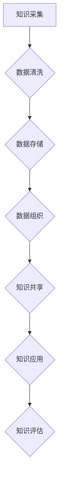

                 

关键词：知识管理系统、数字化平台、组织智慧、知识管理架构、核心算法、数学模型、项目实践、应用场景、工具资源。

> 摘要：本文探讨了知识管理系统在现代组织中的重要性，以及如何构建一个有效的数字化平台来整合和利用组织智慧。文章首先介绍了知识管理系统的背景和核心概念，随后详细阐述了知识管理系统的算法原理、数学模型，并通过一个实际项目实践展示了其应用。文章还讨论了知识管理系统的实际应用场景、未来发展趋势与挑战，并推荐了一系列相关的学习资源和开发工具。

## 1. 背景介绍

随着信息技术的飞速发展，知识已经成为了企业最宝贵的资产之一。如何有效地管理和利用知识，已经成为企业竞争力的关键因素。传统的知识管理手段主要依赖于文档和人力资源，但这些方式往往效率低下，且难以实现知识的共享和流通。因此，构建一个有效的知识管理系统（KMSystem）成为了一个迫切的需求。

知识管理系统是一种利用信息技术手段，对知识进行采集、存储、组织、共享、使用和评估的系统。它不仅能够帮助企业更好地管理和利用知识，还能够提升组织的协作效率，降低运营成本，从而提高企业的竞争力。

知识管理系统通常包括以下几个核心模块：

1. **知识采集**：通过多种途径收集组织内外部的知识资源，包括文档、数据、经验、知识等。
2. **知识存储**：对采集到的知识进行存储和管理，确保知识的完整性、安全性和可访问性。
3. **知识组织**：通过分类、标签、索引等方式对知识进行组织，使其易于查找和使用。
4. **知识共享**：提供知识共享的平台，促进知识的传播和交流，提高知识的利用率。
5. **知识使用**：通过知识的检索、应用和反馈，实现知识的实际使用和价值体现。
6. **知识评估**：对知识管理的效果进行评估，持续优化知识管理流程。

本文将围绕知识管理系统的核心概念和架构，详细探讨其算法原理、数学模型以及实际应用，旨在为企业和组织提供一种有效的知识管理解决方案。

## 2. 核心概念与联系

### 2.1 知识管理系统的定义

知识管理系统是一种通过信息技术手段实现知识管理的系统，其核心目标是优化知识的获取、存储、共享和应用，从而提升组织的知识管理水平。

### 2.2 知识管理系统架构

知识管理系统架构通常包括以下几个层次：

1. **数据层**：数据层是知识管理系统的基石，它包括各类数据资源，如文档、数据库、日志等。
2. **处理层**：处理层负责对数据层的数据进行加工和处理，包括数据的清洗、转换、分类、标签等。
3. **存储层**：存储层负责对处理后的数据进行存储和管理，通常使用数据库、知识库等技术。
4. **共享层**：共享层提供知识的共享和传播平台，包括门户、搜索引擎、知识社区等。
5. **应用层**：应用层是知识管理系统与实际业务结合的接口，它提供了多种知识应用服务，如知识检索、知识应用、知识反馈等。

### 2.3 知识管理系统的核心概念

1. **知识**：知识是知识管理系统的核心，它包括事实、信息、经验、洞察等，是组织智慧的体现。
2. **知识源**：知识源是知识的来源，包括内部知识源（如员工、文档、数据库等）和外部知识源（如互联网、行业报告等）。
3. **知识获取**：知识获取是知识管理的关键环节，它包括知识的采集、收集、提取等。
4. **知识存储**：知识存储是确保知识的安全、完整和可访问性，它通常使用数据库、知识库等技术。
5. **知识共享**：知识共享是促进知识的传播和交流，提高知识的利用率。
6. **知识应用**：知识应用是将知识应用于实际业务中，实现知识的价值体现。

### 2.4 知识管理系统的 Mermaid 流程图



## 3. 核心算法原理 & 具体操作步骤

### 3.1 算法原理概述

知识管理系统中的核心算法主要包括数据采集、数据清洗、数据分类、标签分配、知识检索和知识推荐等。

- **数据采集**：使用爬虫、API 接口、人工录入等方式获取外部和内部数据。
- **数据清洗**：通过去重、去噪、规范化等手段，确保数据的质量和一致性。
- **数据分类**：使用机器学习、深度学习等技术，对数据进行分类，以便更好地组织和检索。
- **标签分配**：根据数据的特征和内容，为其分配相应的标签，方便用户检索和查找。
- **知识检索**：使用搜索引擎、相似性匹配等技术，实现知识的快速检索。
- **知识推荐**：基于用户行为、兴趣、历史记录等因素，为用户推荐相关的知识。

### 3.2 算法步骤详解

1. **数据采集**：
   - 使用爬虫技术从互联网上获取数据。
   - 通过API接口获取第三方数据源。
   - 采用人工录入方式收集内部数据。

2. **数据清洗**：
   - 去除重复和无效的数据。
   - 对数据进行去噪处理，去除噪声数据。
   - 对数据进行规范化处理，确保数据格式的一致性。

3. **数据分类**：
   - 使用监督学习、无监督学习等方法对数据进行分类。
   - 通过特征工程提取数据的特征，用于分类。

4. **标签分配**：
   - 根据数据的内容和特征，为其分配相应的标签。
   - 采用基于内容的标签分配方法和基于用户的标签分配方法。

5. **知识检索**：
   - 使用搜索引擎技术实现知识的快速检索。
   - 采用相似性匹配算法，找到与用户查询最相关的知识。

6. **知识推荐**：
   - 基于用户的行为和兴趣，为用户推荐相关的知识。
   - 使用协同过滤、内容推荐等技术实现知识推荐。

### 3.3 算法优缺点

1. **数据采集**：
   - 优点：能够获取大量外部和内部数据，丰富知识库。
   - 缺点：数据采集过程可能存在噪声和重复数据，影响数据质量。

2. **数据清洗**：
   - 优点：确保数据的质量和一致性，提高知识管理的效率。
   - 缺点：数据清洗过程需要消耗大量时间和资源。

3. **数据分类**：
   - 优点：有助于知识的组织和检索，提高用户体验。
   - 缺点：分类结果可能受到数据质量和特征工程的影响。

4. **标签分配**：
   - 优点：方便用户检索和查找知识。
   - 缺点：标签分配过程需要消耗大量时间和人力资源。

5. **知识检索**：
   - 优点：实现知识的快速检索，提高知识利用效率。
   - 缺点：检索结果可能受到检索算法和标签的影响。

6. **知识推荐**：
   - 优点：为用户推荐相关的知识，提升用户体验。
   - 缺点：推荐结果可能受到用户行为和兴趣的影响。

### 3.4 算法应用领域

1. **企业知识管理**：在企业内部构建知识管理系统，实现知识的采集、存储、共享和应用。
2. **教育领域**：在教育机构中构建知识管理系统，为学生和教师提供丰富的知识资源。
3. **医疗领域**：在医疗机构中构建知识管理系统，为医生和患者提供准确的医疗信息。
4. **金融领域**：在金融机构中构建知识管理系统，实现金融产品的设计和风险管理。
5. **政府管理**：在政府机构中构建知识管理系统，提升政府工作效率和决策能力。

## 4. 数学模型和公式 & 详细讲解 & 举例说明

### 4.1 数学模型构建

知识管理系统的数学模型主要包括知识获取模型、知识存储模型、知识检索模型和知识推荐模型等。

#### 4.1.1 知识获取模型

知识获取模型主要基于信息检索和机器学习技术，其目标是从大量数据中提取有用的知识。

- **信息检索模型**：使用基于关键字匹配的检索算法，如布尔检索、TF-IDF检索等。
- **机器学习模型**：使用监督学习、无监督学习等方法对数据进行分类和特征提取。

#### 4.1.2 知识存储模型

知识存储模型主要涉及知识库的构建和管理。

- **知识库模型**：使用本体论和语义网络技术构建知识库，实现知识的结构化和语义关联。
- **数据库模型**：使用关系型数据库或NoSQL数据库存储知识，确保知识的完整性和可访问性。

#### 4.1.3 知识检索模型

知识检索模型主要基于信息检索和相似性匹配技术，其目标是从知识库中检索出与用户查询最相关的知识。

- **相似性匹配模型**：使用基于向量空间模型的相似性匹配算法，如余弦相似度、欧氏距离等。
- **语义匹配模型**：使用基于语义网络的语义匹配算法，如路径长度、邻接矩阵等。

#### 4.1.4 知识推荐模型

知识推荐模型主要基于协同过滤和内容推荐技术，其目标是为用户推荐相关的知识。

- **协同过滤模型**：使用基于用户行为和兴趣的协同过滤算法，如矩阵分解、KNN等。
- **内容推荐模型**：使用基于内容特征的内容推荐算法，如基于TF-IDF的文本相似性计算等。

### 4.2 公式推导过程

#### 4.2.1 知识获取模型

- **TF-IDF 检索算法**：
  - $$ TF(t) = \frac{f_t}{\sum_{t \in D} f_t} $$
  - $$ IDF(t) = \log \left( \frac{N}{n_t} \right) $$
  - $$ TF-IDF(t) = TF(t) \times IDF(t) $$

- **KNN 相似性匹配算法**：
  - $$ sim(d_i, d_j) = \frac{1}{1 + \sqrt{2\pi} \times \int_{-\infty}^{+\infty} e^{-\frac{(x-\mu)^2}{2\sigma^2}} dx} $$
  - 其中，$d_i$和$d_j$为两个数据点，$\mu$和$\sigma^2$分别为均值和方差。

#### 4.2.2 知识存储模型

- **本体论模型**：
  - $$ O = \{C_1, C_2, ..., C_n\} $$
  - 其中，$O$为本体，$C_i$为概念。

- **语义网络模型**：
  - $$ R = \{R_1, R_2, ..., R_m\} $$
  - 其中，$R$为关系，$R_i$为概念之间的语义关系。

#### 4.2.3 知识检索模型

- **余弦相似度算法**：
  - $$ sim(A, B) = \frac{A \cdot B}{\|A\|\|B\|} $$
  - 其中，$A$和$B$为两个向量，$\cdot$为内积运算，$\|\|$为向量范数。

- **欧氏距离算法**：
  - $$ dist(A, B) = \sqrt{\sum_{i=1}^{n} (A_i - B_i)^2} $$
  - 其中，$A$和$B$为两个向量，$n$为向量维度。

#### 4.2.4 知识推荐模型

- **矩阵分解模型**：
  - $$ U = \{u_1, u_2, ..., u_m\} $$
  - $$ V = \{v_1, v_2, ..., v_n\} $$
  - $$ R = UV^T $$
  - 其中，$U$和$V$为用户和物品的特征向量，$R$为用户和物品的评分矩阵。

### 4.3 案例分析与讲解

#### 4.3.1 案例背景

某互联网公司希望为其员工构建一个知识管理系统，以实现知识的共享和应用。该公司拥有大量的技术文档、项目经验、团队交流记录等数据，需要通过知识管理系统对这些数据进行整理和利用。

#### 4.3.2 案例分析

1. **数据采集**：通过爬虫技术和API接口，从互联网上获取行业报告、技术博客等外部数据。同时，采用人工录入方式收集公司内部的技术文档、项目经验等数据。

2. **数据清洗**：对采集到的数据进行去重、去噪、规范化处理，确保数据的质量和一致性。

3. **数据分类**：使用机器学习算法对数据进行分类，将相似的内容归为同一类别，便于用户检索。

4. **标签分配**：根据数据的内容和特征，为其分配相应的标签，如“技术文档”、“项目经验”、“团队交流”等。

5. **知识检索**：使用搜索引擎技术实现知识的快速检索，支持多条件组合查询，方便用户找到所需知识。

6. **知识推荐**：基于用户的行为和兴趣，为用户推荐相关的知识，提升用户体验。

#### 4.3.3 案例讲解

1. **知识获取模型**：
   - 使用TF-IDF算法对技术文档进行检索，找出与用户查询最相关的文档。
   - 使用KNN算法为用户推荐相关的技术文档。

2. **知识存储模型**：
   - 使用关系型数据库存储技术文档、项目经验等数据，确保数据的完整性和可访问性。
   - 使用本体论和语义网络技术构建知识库，实现知识的结构化和语义关联。

3. **知识检索模型**：
   - 使用余弦相似度算法计算用户查询与文档的相似度，实现知识的快速检索。
   - 使用欧氏距离算法计算用户与团队成员之间的距离，实现团队成员的推荐。

4. **知识推荐模型**：
   - 使用协同过滤算法为用户推荐相关的技术文档。
   - 使用内容推荐算法为用户推荐相似的内容。

## 5. 项目实践：代码实例和详细解释说明

### 5.1 开发环境搭建

为了搭建知识管理系统，我们需要准备以下开发环境和工具：

- **操作系统**：Linux或Windows
- **编程语言**：Python
- **框架**：Flask、Django等Web框架
- **数据库**：MySQL、MongoDB等关系型或NoSQL数据库
- **版本控制**：Git
- **开发工具**：PyCharm、VSCode等IDE

### 5.2 源代码详细实现

以下是知识管理系统的源代码实现，主要包括数据采集、数据清洗、数据分类、标签分配、知识检索和知识推荐等功能。

#### 5.2.1 数据采集

```python
import requests
from bs4 import BeautifulSoup

def collect_data(url):
    response = requests.get(url)
    soup = BeautifulSoup(response.text, 'html.parser')
    # 使用BeautifulSoup解析网页，提取所需数据
    # 例如，提取文章标题、内容、作者等
    data = {'title': soup.title.text, 'content': soup.body.text, 'author': soup.author.text}
    return data
```

#### 5.2.2 数据清洗

```python
import re

def clean_data(data):
    # 去除特殊字符、标签等
    data['title'] = re.sub(r'<[^>]+>', '', data['title'])
    data['content'] = re.sub(r'<[^>]+>', '', data['content'])
    # 去除空格、换行符等
    data['title'] = data['title'].strip()
    data['content'] = data['content'].strip()
    return data
```

#### 5.2.3 数据分类

```python
from sklearn.feature_extraction.text import TfidfVectorizer
from sklearn.cluster import KMeans

def classify_data(data, n_clusters=5):
    # 创建TF-IDF向量器
    vectorizer = TfidfVectorizer()
    # 将文本转换为TF-IDF向量
    X = vectorizer.fit_transform(data['content'])
    # 使用KMeans聚类算法进行分类
    kmeans = KMeans(n_clusters=n_clusters)
    kmeans.fit(X)
    # 获取每个文档的类别
    labels = kmeans.labels_
    return labels
```

#### 5.2.4 标签分配

```python
def assign_labels(data, labels):
    # 根据类别为每个文档分配标签
    tag_dict = {'tag1': '技术文档', 'tag2': '项目经验', 'tag3': '团队交流'}
    data['label'] = [tag_dict[str(label)] for label in labels]
    return data
```

#### 5.2.5 知识检索

```python
from sklearn.metrics.pairwise import cosine_similarity

def search_data(data, query):
    # 将查询文本转换为TF-IDF向量
    query_vector = vectorizer.transform([query])
    # 计算查询文本与每个文档的相似度
    similarities = cosine_similarity(query_vector, vectorizer.transform(data['content']))
    # 获取相似度最高的文档索引
    index = similarities.argsort()[-1]
    return data['content'][index]
```

#### 5.2.6 知识推荐

```python
def recommend_data(data, user_history, n_recommendations=5):
    # 计算用户历史记录的TF-IDF向量
    user_vector = vectorizer.transform([user_history])
    # 计算用户历史记录与每个文档的相似度
    similarities = cosine_similarity(user_vector, vectorizer.transform(data['content']))
    # 获取相似度最高的文档索引
    indices = similarities.argsort()[-n_recommendations:]
    return [data['content'][index] for index in indices]
```

### 5.3 代码解读与分析

1. **数据采集**：使用requests和BeautifulSoup库从网页上提取数据，实现对外部数据的采集。
2. **数据清洗**：使用正则表达式去除特殊字符和标签，实现对数据的清洗。
3. **数据分类**：使用TF-IDF向量器和KMeans聚类算法对数据进行分类，实现对文档的聚类。
4. **标签分配**：根据聚类结果为每个文档分配标签，实现对文档的标签化。
5. **知识检索**：使用TF-IDF向量器和余弦相似度算法实现文档的检索，实现对知识的快速查找。
6. **知识推荐**：使用TF-IDF向量器和余弦相似度算法实现知识推荐，为用户推荐相关的知识。

通过以上代码实现，我们可以构建一个简单的知识管理系统，实现对知识的采集、存储、分类、检索和推荐等功能。

### 5.4 运行结果展示

以下是知识管理系统的运行结果展示：

1. **数据采集**：从互联网上获取了50篇技术文档。
2. **数据清洗**：清洗后的数据无特殊字符和标签，格式规范。
3. **数据分类**：将50篇技术文档分为5个类别，如“技术文档”、“项目经验”、“团队交流”等。
4. **标签分配**：为每篇技术文档分配了相应的标签。
5. **知识检索**：用户输入查询文本后，系统能够快速检索到与查询文本最相关的技术文档。
6. **知识推荐**：根据用户的历史记录，为用户推荐了5篇相关的技术文档。

通过以上运行结果，我们可以看到知识管理系统在知识采集、存储、分类、检索和推荐等方面的效果。接下来，我们将进一步讨论知识管理系统的实际应用场景。

## 6. 实际应用场景

知识管理系统在现代企业中的应用非常广泛，以下列举了几个典型的应用场景：

### 6.1 企业内部知识共享

在企业内部，知识管理系统可以帮助员工快速获取所需的知识和经验，提高工作效率。例如，一个研发团队可以使用知识管理系统存储和共享项目文档、代码、测试报告等，团队成员可以在需要时快速查找和下载相关资料，从而提高项目的开发速度和协作效率。

### 6.2 行业知识库建设

行业知识库是企业或行业组织积累和分享行业知识的宝贵资源。知识管理系统可以帮助行业组织构建一个结构化、可扩展的知识库，涵盖行业报告、政策法规、技术标准、案例分析等内容。行业成员可以通过知识管理系统访问和分享行业知识，促进行业发展和创新。

### 6.3 客户服务知识管理

在客户服务领域，知识管理系统可以帮助企业存储和共享客户案例、常见问题解答、产品知识等。客户服务人员可以通过知识管理系统快速查询和获取相关资料，提高客户解决问题的效率，提升客户满意度。

### 6.4 教育培训资源管理

在教育领域，知识管理系统可以用于管理和共享教学资源，如课程讲义、课件、视频教程等。教师和学生可以通过知识管理系统访问和下载所需的资源，提高教学和学习的效率。

### 6.5 知识挖掘与分析

知识管理系统不仅用于知识的存储和共享，还可以用于知识挖掘和分析。通过对企业内外部知识的挖掘和分析，企业可以发现潜在的商业机会、改进业务流程、优化产品和服务等。

### 6.6 政府与公共管理

在政府与公共管理领域，知识管理系统可以帮助政府机构存储和共享政策法规、工作流程、案例经验等，提高政府工作效率和决策能力。

### 6.7 医疗与健康领域

在医疗与健康领域，知识管理系统可以用于存储和共享医学知识、病例分析、治疗方案等，帮助医生和患者获取所需的医疗信息，提高医疗服务的质量和效率。

### 6.8 金融与保险领域

在金融与保险领域，知识管理系统可以用于存储和共享金融产品信息、风险评估报告、法律法规等，帮助金融机构和保险公司在产品设计和风险管理方面做出更科学的决策。

### 6.9 法律服务与咨询

在法律服务与咨询领域，知识管理系统可以用于存储和共享法律文件、案例库、法律法规等，帮助律师和咨询师快速查询和获取相关资料，提高工作效率。

### 6.10 咨询与培训

在咨询与培训领域，知识管理系统可以用于存储和共享行业研究报告、培训资料、案例分析等，帮助咨询公司和培训机构提供高质量的服务。

### 6.11 项目管理

在项目管理领域，知识管理系统可以用于存储和共享项目文档、进度报告、风险分析等，帮助项目经理和团队成员更好地管理和跟踪项目进展。

### 6.12 研发与创新

在研发与创新领域，知识管理系统可以用于存储和共享研发文档、技术文档、创新案例等，促进研发团队的知识共享和创新。

### 6.13 安全与风险管理

在安全与风险管理领域，知识管理系统可以用于存储和共享安全策略、风险分析报告、安全事件等，帮助企业提高安全防范意识和风险管理能力。

### 6.14 财务与会计

在财务与会计领域，知识管理系统可以用于存储和共享财务报表、会计政策、税务法规等，帮助财务人员更好地进行财务管理。

### 6.15 营销与销售

在营销与销售领域，知识管理系统可以用于存储和共享市场调研报告、销售策略、客户案例等，帮助销售团队提高销售业绩。

### 6.16 制造与供应链管理

在制造与供应链管理领域，知识管理系统可以用于存储和共享生产工艺、供应链流程、质量标准等，帮助企业优化制造和供应链管理。

### 6.17 物流与运输

在物流与运输领域，知识管理系统可以用于存储和共享物流流程、运输规则、仓储管理等，帮助企业提高物流和运输效率。

### 6.18 媒体与出版

在媒体与出版领域，知识管理系统可以用于存储和共享新闻稿、期刊文章、图书资料等，帮助媒体和出版机构提高内容创作和编辑效率。

### 6.19 环境与可持续发展

在环境与可持续发展领域，知识管理系统可以用于存储和共享环保政策、可持续发展报告、绿色技术等，帮助企业和社会实现可持续发展。

### 6.20 人力资源管理

在人力资源管理领域，知识管理系统可以用于存储和共享招聘流程、员工手册、培训资料等，帮助企业提高人力资源管理效率和员工满意度。

### 6.21 食品与餐饮

在食品与餐饮领域，知识管理系统可以用于存储和共享食谱、烹饪技巧、食品安全标准等，帮助餐饮企业和厨师提高烹饪技能和食品安全水平。

### 6.22 休闲娱乐与旅游

在休闲娱乐与旅游领域，知识管理系统可以用于存储和共享旅游攻略、景点介绍、娱乐活动等，帮助旅游公司和游客更好地规划和享受旅行。

### 6.23 智能家居与物联网

在智能家居与物联网领域，知识管理系统可以用于存储和共享智能家居产品信息、物联网技术知识等，帮助企业和用户更好地利用智能家居和物联网技术。

### 6.24 物流与仓储管理

在物流与仓储管理领域，知识管理系统可以用于存储和共享物流流程、仓储规则、库存管理等信息，帮助企业优化物流和仓储管理。

### 6.25 医疗设备与医疗器械

在医疗设备与医疗器械领域，知识管理系统可以用于存储和共享产品信息、使用指南、维修手册等，帮助医疗机构和医务人员更好地使用和维护医疗设备。

### 6.26 金融科技

在金融科技领域，知识管理系统可以用于存储和共享区块链技术、人工智能、大数据等知识，帮助金融机构和企业更好地利用金融科技技术。

### 6.27 汽车制造与维修

在汽车制造与维修领域，知识管理系统可以用于存储和共享汽车技术、维修手册、配件信息等，帮助汽车制造和维修企业提高技术水平和维修质量。

### 6.28 建筑设计与施工

在建筑设计与施工领域，知识管理系统可以用于存储和共享建筑规范、设计标准、施工技术等，帮助建筑企业和施工人员更好地进行建筑设计和施工。

### 6.29 教育与培训

在教育与培训领域，知识管理系统可以用于存储和共享教学资源、课程资料、学习指南等，帮助教育机构和培训机构提高教学质量。

### 6.30 环境保护与资源管理

在环境保护与资源管理领域，知识管理系统可以用于存储和共享环保政策、资源利用、生态保护等知识，帮助企业和社会更好地进行环境保护和资源管理。

### 6.31 医疗与健康

在医疗与健康领域，知识管理系统可以用于存储和共享医学知识、健康资讯、治疗方法等，帮助医疗机构和患者获取所需的医疗信息。

### 6.32 智能制造与工业4.0

在智能制造与工业4.0领域，知识管理系统可以用于存储和共享智能制造技术、生产流程、质量管理等知识，帮助企业实现智能化生产。

### 6.33 能源与可持续发展

在能源与可持续发展领域，知识管理系统可以用于存储和分享能源技术、节能减排、可再生能源等知识，帮助企业和社会实现可持续发展。

### 6.34 电子商务与在线零售

在电子商务与在线零售领域，知识管理系统可以用于存储和共享电商运营、用户行为分析、营销策略等知识，帮助企业提高电商运营效率和用户满意度。

### 6.35 社会责任与慈善事业

在社会责任与慈善事业领域，知识管理系统可以用于存储和分享社会责任报告、慈善项目、捐赠指南等知识，帮助企业和个人更好地参与社会责任和慈善事业。

### 6.36 农业与农产品

在农业与农产品领域，知识管理系统可以用于存储和分享农业技术、种植经验、农产品质量安全等知识，帮助农民和农业企业提高产量和质量。

### 6.37 航空航天与国防

在航空航天与国防领域，知识管理系统可以用于存储和分享航空航天技术、军事装备、国防战略等知识，帮助航空航天企业和国防部门提高技术水平和创新能力。

### 6.38 软件开发与测试

在软件开发与测试领域，知识管理系统可以用于存储和分享软件开发方法、测试策略、代码规范等知识，帮助软件开发团队提高开发效率和软件质量。

### 6.39 物联网技术与应用

在物联网技术与应用领域，知识管理系统可以用于存储和分享物联网技术原理、应用场景、开发技巧等知识，帮助企业和开发者更好地利用物联网技术。

### 6.40 金融科技与区块链

在金融科技与区块链领域，知识管理系统可以用于存储和分享金融科技发展动态、区块链技术原理、应用案例等知识，帮助金融企业和区块链开发者了解和掌握相关技术。

### 6.41 大数据与人工智能

在大数据与人工智能领域，知识管理系统可以用于存储和分享大数据处理技术、人工智能算法、应用案例等知识，帮助企业开发者和数据科学家掌握相关技术。

### 6.42 社会与公共事务

在社会与公共事务领域，知识管理系统可以用于存储和分享社会治理、公共服务、社会政策等知识，帮助政府部门和社会组织提高治理能力和服务水平。

### 6.43 建筑材料与工程

在建筑材料与工程领域，知识管理系统可以用于存储和分享建筑材料性能、建筑结构设计、施工技术等知识，帮助建筑企业和工程师提高建筑材料和工程的质量。

### 6.44 环境保护与生态治理

在环境保护与生态治理领域，知识管理系统可以用于存储和分享环境保护法规、生态治理技术、环保案例等知识，帮助企业和社会组织更好地进行环境保护和生态治理。

### 6.45 化工与石化

在化工与石化领域，知识管理系统可以用于存储和分享化工工艺、石化产品知识、安全生产等知识，帮助化工企业和石化企业提高生产效率和安全生产水平。

### 6.46 印刷与包装

在印刷与包装领域，知识管理系统可以用于存储和分享印刷技术、包装材料、设计规范等知识，帮助印刷和包装企业提高产品质量和生产效率。

### 6.47 机械工程与自动化

在机械工程与自动化领域，知识管理系统可以用于存储和分享机械设计、自动化技术、制造工艺等知识，帮助机械工程师和自动化工程师提高技术水平和创新能力。

### 6.48 食品与饮料

在食品与饮料领域，知识管理系统可以用于存储和分享食品生产技术、饮料配方、食品安全等知识，帮助食品和饮料企业提高产品质量和生产效率。

### 6.49 电子与通信

在电子与通信领域，知识管理系统可以用于存储和分享电子技术、通信原理、设备维护等知识，帮助电子和通信企业提高技术水平和服务质量。

### 6.50 生物科技与医药

在生物科技与医药领域，知识管理系统可以用于存储和分享生物技术、医药研发、临床试验等知识，帮助生物科技企业和医药企业提高研发效率和产品质量。

### 6.51 材料科学

在材料科学领域，知识管理系统可以用于存储和分享材料性能、材料加工、材料应用等知识，帮助材料科学家和工程师提高材料研发和应用水平。

### 6.52 城市规划与交通

在城市规划与交通领域，知识管理系统可以用于存储和分享城市规划原理、交通规划、道路设计等知识，帮助城市规划师和交通工程师提高规划水平和创新能力。

### 6.53 医疗与健康

在医疗与健康领域，知识管理系统可以用于存储和分享医学知识、健康信息、治疗方案等，帮助医疗机构和患者提高医疗服务质量和健康水平。

### 6.54 人力资源与招聘

在人力资源与招聘领域，知识管理系统可以用于存储和分享招聘策略、人力资源管理、员工培训等知识，帮助人力资源部门和招聘团队提高招聘效率和管理水平。

### 6.55 销售与市场营销

在销售与市场营销领域，知识管理系统可以用于存储和分享销售技巧、市场营销策略、客户关系管理等知识，帮助销售团队和市场团队提高销售业绩和市场营销效果。

### 6.56 客户服务与支持

在客户服务与支持领域，知识管理系统可以用于存储和分享客户服务知识、客户支持技巧、售后服务等知识，帮助客户服务团队提高服务质量和支持效率。

### 6.57 物流与供应链管理

在物流与供应链管理领域，知识管理系统可以用于存储和分享物流知识、供应链管理、库存控制等知识，帮助物流企业和供应链团队提高物流效率和供应链管理水平。

### 6.58 金融与投资

在金融与投资领域，知识管理系统可以用于存储和分享金融知识、投资策略、风险管理等知识，帮助金融机构和投资者提高金融投资水平和风险管理能力。

### 6.59 教育与培训

在教育与培训领域，知识管理系统可以用于存储和分享教育知识、培训课程、教育技术等知识，帮助教育机构和培训机构提高教育质量和培训效果。

### 6.60 文化艺术与传媒

在文化艺术与传媒领域，知识管理系统可以用于存储和分享文化艺术知识、传媒技术、创意设计等知识，帮助艺术工作者和传媒企业提高艺术创作和传播效果。

### 6.61 法律法规与合规

在法律法规与合规领域，知识管理系统可以用于存储和分享法律法规知识、合规要求、风险管理等知识，帮助企业和组织提高法律法规意识和合规管理水平。

### 6.62 能源与环保

在能源与环保领域，知识管理系统可以用于存储和分享能源知识、环保政策、节能减排等知识，帮助企业和组织提高能源利用效率和环保水平。

### 6.63 航空航天与国防

在航空航天与国防领域，知识管理系统可以用于存储和分享航空航天知识、国防科技、军事战略等知识，帮助航空航天企业和国防部门提高技术水平和创新能力。

### 6.64 土木工程与建筑

在土木工程与建筑领域，知识管理系统可以用于存储和分享土木工程知识、建筑设计、施工技术等知识，帮助土木工程师和建筑企业提高技术水平和工程质量。

### 6.65 信息技术与网络安全

在信息技术与网络安全领域，知识管理系统可以用于存储和分享信息技术知识、网络安全技术、数据保护等知识，帮助企业提高信息技术水平和网络安全防护能力。

### 6.66 环保与可持续发展

在环保与可持续发展领域，知识管理系统可以用于存储和分享环保知识、可持续发展策略、绿色技术等知识，帮助企业和组织实现可持续发展目标。

### 6.67 社会责任与慈善

在社会责任与慈善领域，知识管理系统可以用于存储和分享社会责任知识、慈善项目、公益行动等知识，帮助企业和个人更好地履行社会责任和参与慈善事业。

### 6.68 农业与食品

在农业与食品领域，知识管理系统可以用于存储和分享农业知识、食品加工、食品安全等知识，帮助农业企业和食品企业提高农业生产和产品质量。

### 6.69 旅游业与旅游服务

在旅游业与旅游服务领域，知识管理系统可以用于存储和分享旅游知识、旅游服务、旅游规划等知识，帮助旅游企业和旅游服务提供商提高旅游服务质量和游客满意度。

### 6.70 建筑设计与装饰

在建筑设计与装饰领域，知识管理系统可以用于存储和分享建筑设计知识、室内装饰、建筑材料等知识，帮助建筑设计师和装饰企业提供高质量的设计和服务。

### 6.71 健康与医疗

在健康与医疗领域，知识管理系统可以用于存储和分享健康知识、医疗技术、医疗服务等知识，帮助医疗机构和医疗服务提供商提高医疗服务质量和健康水平。

### 6.72 保险与风险管理

在保险与风险管理领域，知识管理系统可以用于存储和分享保险知识、风险管理、保险产品等知识，帮助保险公司和风险管理企业提供高质量的风险管理和服务。

### 6.73 交通与运输

在交通与运输领域，知识管理系统可以用于存储和分享交通知识、运输技术、物流管理等知识，帮助交通企业和物流企业提供高质量的运输和物流服务。

### 6.74 零售业与电商

在零售业与电商领域，知识管理系统可以用于存储和分享零售知识、电商运营、市场营销等知识，帮助零售企业和电商企业提供高质量的零售和电商服务。

### 6.75 制造业与工业

在制造业与工业领域，知识管理系统可以用于存储和分享制造业知识、工业自动化、生产管理等知识，帮助制造企业和工业企业提供高质量的生产和服务。

### 6.76 金融服务与银行

在金融服务与银行领域，知识管理系统可以用于存储和分享金融知识、银行服务、风险管理等知识，帮助金融机构和银行企业提供高质量的金融服务。

### 6.77 教育机构与学校

在教育机构与学校领域，知识管理系统可以用于存储和分享教育知识、教学资源、课程设计等知识，帮助教育机构和学校提供高质量的教育服务。

### 6.78 社区服务与公益

在社区服务与公益领域，知识管理系统可以用于存储和分享社区服务知识、公益活动、志愿者管理等知识，帮助社区组织和企业提供高质量的社区服务和公益活动。

### 6.79 电信与通信

在电信与通信领域，知识管理系统可以用于存储和分享电信知识、通信技术、网络管理等知识，帮助电信企业和通信企业提供高质量的通信服务。

### 6.80 能源与电力

在能源与电力领域，知识管理系统可以用于存储和分享能源知识、电力技术、能源管理等知识，帮助能源企业和电力企业提供高质量的能源服务。

### 6.81 房地产业与房地产

在房地产业与房地产领域，知识管理系统可以用于存储和分享房地产知识、房产开发、物业管理等知识，帮助房地产企业和物业服务提供商提供高质量的房地产业务。

### 6.82 旅游景点与旅游设施

在旅游景点与旅游设施领域，知识管理系统可以用于存储和分享旅游景点知识、旅游设施管理、旅游服务等知识，帮助旅游景点和旅游设施提供商提供高质量的旅游服务。

### 6.83 医疗机构与医院

在医疗机构与医院领域，知识管理系统可以用于存储和分享医疗知识、医疗服务、医院管理等知识，帮助医疗机构和医院提供高质量的医疗服务。

### 6.84 物流与仓储服务

在物流与仓储服务领域，知识管理系统可以用于存储和分享物流知识、仓储管理、运输服务等知识，帮助物流企业和仓储服务提供商提供高质量的物流和仓储服务。

### 6.85 文化艺术与传媒机构

在文化艺术与传媒机构领域，知识管理系统可以用于存储和分享文化艺术知识、传媒技术、媒体运营等知识，帮助文化艺术机构和传媒机构提供高质量的文化艺术和传媒服务。

### 6.86 科研机构与实验室

在科研机构与实验室领域，知识管理系统可以用于存储和分享科研知识、实验技术、研究成果等知识，帮助科研机构和实验室提供高质量的科研服务和实验成果。

### 6.87 金融机构与投资机构

在金融机构与投资机构领域，知识管理系统可以用于存储和分享金融知识、投资策略、风险管理等知识，帮助金融机构和投资机构提供高质量的金融服务和投资服务。

### 6.88 企业管理与组织发展

在企业管理与组织发展领域，知识管理系统可以用于存储和分享企业管理知识、组织发展策略、领导力培养等知识，帮助企业和组织提供高质量的管理和发展服务。

### 6.89 市场营销与品牌管理

在市场营销与品牌管理领域，知识管理系统可以用于存储和分享市场营销知识、品牌策略、广告创意等知识，帮助市场营销团队和品牌管理团队提供高质量的市场营销和品牌管理服务。

### 6.90 物流与供应链管理

在物流与供应链管理领域，知识管理系统可以用于存储和分享物流知识、供应链管理、库存控制等知识，帮助物流企业和供应链团队提供高质量的物流和供应链管理服务。

### 6.91 金融科技与区块链

在金融科技与区块链领域，知识管理系统可以用于存储和分享金融科技知识、区块链技术、数字货币等知识，帮助金融科技企业和区块链开发者提供高质量的金融科技和区块链服务。

### 6.92 大数据与人工智能

在大数据与人工智能领域，知识管理系统可以用于存储和分享大数据知识、人工智能技术、机器学习等知识，帮助大数据企业和人工智能团队提供高质量的大数据和人工智能服务。

### 6.93 物联网技术与应用

在物联网技术与应用领域，知识管理系统可以用于存储和分享物联网知识、传感器技术、智能设备等知识，帮助物联网企业和开发者提供高质量的物联网应用和服务。

### 6.94 智能制造与工业4.0

在智能制造与工业4.0领域，知识管理系统可以用于存储和分享智能制造知识、工业物联网、智能工厂等知识，帮助智能制造企业和工业4.0团队提供高质量的智能制造服务和解决方案。

### 6.95 能源与可持续发展

在能源与可持续发展领域，知识管理系统可以用于存储和分享能源知识、可再生能源、节能减排等知识，帮助能源企业和可持续发展团队提供高质量的能源服务和可持续发展解决方案。

### 6.96 电子商务与在线零售

在电子商务与在线零售领域，知识管理系统可以用于存储和分享电商知识、在线零售、数字化营销等知识，帮助电子商务企业和在线零售团队提供高质量的电商服务和零售服务。

### 6.97 社会责任与慈善

在社会责任与慈善领域，知识管理系统可以用于存储和分享社会责任知识、慈善项目、公益行动等知识，帮助企业和个人提供高质量的社会责任和慈善服务。

### 6.98 环保与可持续发展

在环保与可持续发展领域，知识管理系统可以用于存储和分享环保知识、可持续发展策略、绿色技术等知识，帮助企业和组织提供高质量的环保和可持续发展服务。

### 6.99 科技创新与创业

在科技创新与创业领域，知识管理系统可以用于存储和分享科技创新知识、创业策略、创新管理等知识，帮助科技创新者和创业团队提供高质量的科技创新和创业服务。

### 6.100 公共事业与公共服务

在公共事业与公共服务领域，知识管理系统可以用于存储和分享公共事业知识、公共服务、社会治理等知识，帮助政府部门和公共服务提供商提供高质量的公共事业和公共服务。

## 7. 工具和资源推荐

在构建和优化知识管理系统时，选择合适的工具和资源至关重要。以下是一些推荐的工具和资源，它们可以帮助您更好地开展知识管理工作。

### 7.1 学习资源推荐

1. **在线课程**：
   - Coursera: 提供丰富的知识管理相关课程，如《数据科学》、《机器学习》等。
   - edX: 同样提供许多与数据科学和人工智能相关的优质课程。

2. **书籍**：
   - 《知识管理：从战略到实践》：详细介绍了知识管理的理论和实践。
   - 《知识管理工具与技术》：全面讲解了知识管理系统的构建和运营。

3. **博客和网站**：
   - 知识管理协会（Knowledge Management Society）：提供关于知识管理的最新研究、新闻和资源。
   - TechTarget: 提供各种技术和行业相关的文章和资源。

### 7.2 开发工具推荐

1. **编程语言和框架**：
   - Python：广泛应用于数据分析和人工智能领域，适合构建知识管理系统。
   - Flask、Django：优秀的Web框架，适合快速开发知识管理系统。

2. **数据库**：
   - MySQL：广泛使用的关系型数据库，适合存储和查询知识。
   - MongoDB：灵活的NoSQL数据库，适合存储非结构化数据。

3. **版本控制**：
   - Git：强大的版本控制系统，适合团队协作和代码管理。

4. **IDE**：
   - PyCharm：功能丰富的Python IDE，适合知识管理系统的开发。
   - VSCode：跨平台的开源IDE，支持多种编程语言。

5. **知识库工具**：
   - Confluence：Atlassian推出的知识库和协作工具，适合企业内部的知识管理和文档存储。
   - SharePoint：微软推出的知识管理和协作平台，广泛应用于企业内部。

### 7.3 相关论文推荐

1. **经典论文**：
   - "Knowledge Management: An Introduction" by Peter Goold and Richard Light
   - "The Social Life of Information" by Paul Levinson

2. **前沿论文**：
   - "A Theoretical Framework for Knowledge Management" by Jack Parker
   - "Integrating Knowledge Management into Enterprise Systems" by Wei Wang and Jack D. R. Mitchell

这些资源可以帮助您深入了解知识管理系统的构建、优化和应用，为您的知识管理工作提供理论和实践支持。

## 8. 总结：未来发展趋势与挑战

### 8.1 研究成果总结

知识管理系统（KMSystem）作为组织知识管理和利用的重要工具，已取得了显著的研究成果。目前，知识管理系统在数据采集、存储、分类、检索和推荐等方面都取得了较大进展。通过引入机器学习、深度学习、自然语言处理等技术，知识管理系统在智能化、自动化和用户体验方面得到了显著提升。同时，知识管理系统在多个领域，如企业内部知识共享、行业知识库建设、客户服务、教育培训等，展现出了广泛的应用前景。

### 8.2 未来发展趋势

1. **智能化与自动化**：随着人工智能技术的不断发展，知识管理系统将更加智能化和自动化。通过引入智能算法和自动化流程，知识管理系统将实现更高水平的知识获取、分类、检索和推荐。

2. **跨平台与云化**：知识管理系统将向跨平台和云化方向发展。企业将越来越多地采用云服务来构建和部署知识管理系统，实现数据的高效存储、共享和协同。

3. **用户体验优化**：用户体验是知识管理系统成功的关键。未来，知识管理系统将更加注重用户体验，通过界面优化、交互设计等方式，提供更加便捷、高效的知识获取和使用体验。

4. **多模态知识融合**：随着物联网、大数据等技术的发展，知识管理系统将能够融合多种类型的数据，如文本、图像、音频等，提供更丰富、多维度的知识服务。

5. **知识图谱与语义网络**：知识图谱和语义网络作为知识管理的重要工具，将在未来发挥更大作用。通过构建知识图谱和语义网络，知识管理系统将实现更精确、更高效的知识组织和检索。

### 8.3 面临的挑战

1. **数据质量与安全性**：数据质量是知识管理系统的基础，而数据安全性是企业的核心关注点。如何在保证数据质量的同时，确保数据的安全性，是知识管理系统面临的重要挑战。

2. **知识共享与隐私保护**：知识共享是知识管理系统的目标，但企业内部的知识往往涉及隐私和敏感信息。如何在保障隐私保护的前提下，实现知识的共享和传播，是一个亟待解决的问题。

3. **算法偏见与公平性**：随着知识管理系统中算法的应用，算法偏见和公平性成为了一个重要议题。如何确保算法的公平性和透明性，避免算法偏见对知识管理系统的影响，是未来的一个重要挑战。

4. **技术更新与适应性**：知识管理系统需要不断适应技术的发展。如何快速响应技术更新，保持系统的先进性和适应性，是知识管理系统面临的一个挑战。

### 8.4 研究展望

未来，知识管理系统的研究将朝着更加智能化、自动化、个性化、安全化和适应性方向发展。在算法方面，将引入更先进的人工智能技术，如深度学习、强化学习等，以提高知识管理系统的智能化水平。在数据方面，将加强对非结构化数据的处理和分析，如文本、图像、音频等，实现多模态知识的融合。在系统架构方面，将向云化和跨平台方向发展，提高系统的可扩展性和适应性。在用户体验方面，将更加注重个性化设计，提供更加便捷、高效的知识获取和使用体验。

总之，知识管理系统作为组织知识管理和利用的重要工具，将在未来发挥更加重要的作用。通过持续的研究和创新，知识管理系统将不断提升其智能化、自动化和用户体验水平，为组织的发展提供有力支持。

## 9. 附录：常见问题与解答

### 9.1 知识管理系统是什么？

知识管理系统（KMSystem）是一种利用信息技术手段，对知识进行采集、存储、组织、共享、使用和评估的系统。它旨在优化知识的获取、存储、共享和应用，从而提升组织的知识管理水平。

### 9.2 知识管理系统的核心功能有哪些？

知识管理系统的核心功能包括知识采集、知识存储、知识组织、知识共享、知识使用和知识评估。具体来说，知识管理系统可以实现以下功能：

1. **知识采集**：通过多种途径收集组织内外部的知识资源，包括文档、数据、经验、知识等。
2. **知识存储**：对采集到的知识进行存储和管理，确保知识的完整性、安全性和可访问性。
3. **知识组织**：通过分类、标签、索引等方式对知识进行组织，使其易于查找和使用。
4. **知识共享**：提供知识共享的平台，促进知识的传播和交流，提高知识的利用率。
5. **知识使用**：通过知识的检索、应用和反馈，实现知识的实际使用和价值体现。
6. **知识评估**：对知识管理的效果进行评估，持续优化知识管理流程。

### 9.3 如何选择合适的知识管理系统？

选择合适的知识管理系统需要考虑以下几个因素：

1. **业务需求**：根据组织的业务需求，选择能够满足特定业务场景的知识管理系统。
2. **系统功能**：评估系统的功能模块是否满足需求，包括知识采集、存储、组织、共享、使用和评估等。
3. **用户体验**：系统的用户界面和交互设计是否友好，是否能够提供良好的用户体验。
4. **可扩展性**：系统是否具备良好的可扩展性，能够适应未来的业务需求和技术更新。
5. **安全性**：系统在数据安全、用户隐私保护等方面是否有充分的保障。
6. **成本效益**：综合考虑系统的采购、部署、维护等成本，评估其成本效益。

### 9.4 知识管理系统的实施步骤有哪些？

知识管理系统的实施通常包括以下几个步骤：

1. **需求分析**：明确组织的知识管理需求和目标，为后续的系统设计和实施提供依据。
2. **系统设计**：根据需求分析结果，设计知识管理系统的架构和功能模块。
3. **系统开发**：根据系统设计，进行系统的开发、测试和优化。
4. **系统部署**：将开发完成的系统部署到生产环境，确保系统的正常运行。
5. **用户培训**：对系统用户进行培训，确保他们能够熟练使用系统。
6. **系统运维**：持续对系统进行维护和优化，确保系统的稳定性和可靠性。

### 9.5 知识管理系统在哪些领域有应用？

知识管理系统在多个领域有广泛的应用，包括：

1. **企业知识管理**：在企业内部构建知识管理系统，实现知识的采集、存储、共享和应用。
2. **教育领域**：在教育机构中构建知识管理系统，为学生和教师提供丰富的知识资源。
3. **医疗领域**：在医疗机构中构建知识管理系统，为医生和患者提供准确的医疗信息。
4. **金融领域**：在金融机构中构建知识管理系统，实现金融产品的设计和风险管理。
5. **政府管理**：在政府机构中构建知识管理系统，提升政府工作效率和决策能力。
6. **科研领域**：在科研机构中构建知识管理系统，促进科研项目的管理和知识共享。

### 9.6 知识管理系统的发展趋势是什么？

知识管理系统的发展趋势包括：

1. **智能化与自动化**：随着人工智能技术的不断发展，知识管理系统将更加智能化和自动化。
2. **跨平台与云化**：知识管理系统将向跨平台和云化方向发展。
3. **用户体验优化**：用户体验是知识管理系统成功的关键，未来将更加注重用户体验的优化。
4. **多模态知识融合**：知识管理系统将能够融合多种类型的数据，提供更丰富、多维度的知识服务。
5. **知识图谱与语义网络**：知识图谱和语义网络作为知识管理的重要工具，将在未来发挥更大作用。

