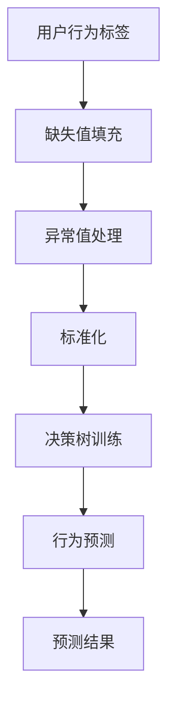
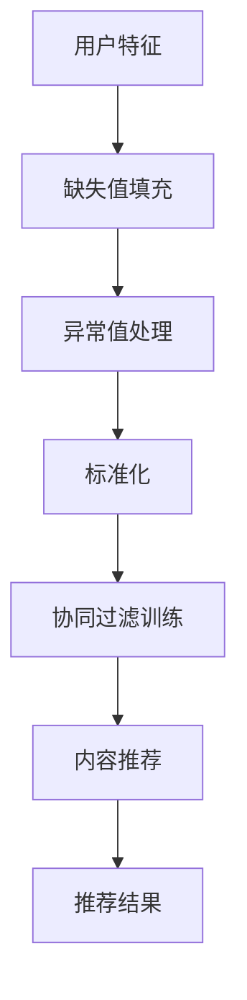
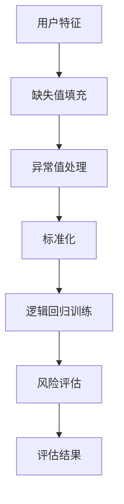

                 

关键词：知识经济、知识付费、创新教学模式、教育技术、人工智能、在线学习、信息技术、教育平台

> 摘要：随着知识经济的快速发展，知识付费在教育领域的应用日益广泛。本文探讨了知识经济下知识付费的创新教学模式，包括其核心概念、算法原理、数学模型、项目实践以及未来应用展望。通过分析，本文旨在为教育者、学习者以及相关从业者提供有价值的参考和启示。

## 1. 背景介绍

知识经济是相对于传统的农业经济和工业经济而言的，它以知识、信息、创意等无形资产为主要驱动力。随着互联网、大数据、人工智能等技术的飞速发展，知识经济的特征愈加显著。知识付费作为知识经济的重要表现形式，近年来在全球范围内迅速崛起。知识付费指的是用户为获取有价值的信息、知识或技能而付费的一种商业模式。在线教育平台如Coursera、Udemy等已经成为知识付费的典型代表。

在知识经济时代，知识付费的教育模式具有以下特点：

1. **个性化学习**：知识付费平台能够根据学习者的兴趣、需求和学习进度，提供个性化的学习内容和服务。
2. **灵活性强**：学习者可以根据自己的时间和地点安排学习，满足不同学习者的需求。
3. **互动性高**：知识付费平台通常提供丰富的互动功能，如讨论区、直播课程、答疑服务等，有助于提高学习效果。
4. **高质量内容**：知识付费平台上的内容通常经过专业筛选，具有较高的质量和可靠性。

## 2. 核心概念与联系

### 2.1. 知识付费的定义与分类

知识付费是指用户为获取有价值的信息、知识或技能而付费的一种商业模式。根据不同的付费方式和内容，知识付费可以分为以下几种类型：

1. **订阅制**：用户支付一定费用，即可终身或按期获取平台上的所有课程或内容。
2. **按次付费**：用户为每一节课程或每一次服务单独支付费用。
3. **购买版权**：用户购买某项知识产品的版权，可终身或有限期使用。
4. **积分兑换**：用户通过参与平台活动或完成任务获得积分，积分可兑换课程或内容。

### 2.2. 知识付费与在线学习的关系

知识付费是推动在线学习发展的重要动力。在线学习平台通过提供高质量的付费课程，吸引了大量用户。同时，知识付费模式也为平台创造了稳定的收入来源，促进了平台的发展和壮大。在线学习平台通常具备以下功能：

1. **课程推荐**：根据学习者的兴趣和需求，推荐适合的课程。
2. **学习管理**：提供学习进度管理、笔记记录、测试与评估等功能。
3. **互动交流**：提供讨论区、问答、直播课程等互动功能。
4. **个性化服务**：根据学习者的行为和反馈，提供个性化的学习建议和资源。

### 2.3. 知识付费与教育技术的结合

知识付费与教育技术的结合，为教育模式创新提供了新的思路。教育技术包括但不限于人工智能、大数据、云计算、虚拟现实等。这些技术可以应用于知识付费平台，提升学习体验和学习效果。

1. **人工智能**：通过自然语言处理、推荐算法等技术，实现个性化学习路径规划和内容推荐。
2. **大数据**：分析用户行为数据，为教育者提供有针对性的教学建议。
3. **云计算**：提供灵活、可扩展的计算和存储资源，降低平台运营成本。
4. **虚拟现实**：提供沉浸式学习体验，提高学习效果。

## 3. 核心算法原理 & 具体操作步骤

### 3.1 算法原理概述

知识付费平台的核心算法通常包括以下几类：

1. **用户行为分析算法**：通过分析用户在平台上的行为数据，了解用户的学习兴趣、学习习惯等，为个性化推荐提供依据。
2. **内容推荐算法**：基于用户行为分析结果，为用户推荐符合其需求和兴趣的学习内容。
3. **风险评估算法**：评估用户在知识付费过程中的风险，如欺诈风险、违约风险等。

### 3.2 算法步骤详解

1. **用户行为分析算法**

   - 数据收集：收集用户在平台上的行为数据，如浏览历史、购买记录、问答记录等。
   - 数据预处理：对收集到的数据进行清洗、去重、标准化等处理。
   - 特征提取：从预处理后的数据中提取特征，如用户活跃度、学习时长、购买偏好等。
   - 模型训练：使用机器学习算法，如决策树、随机森林、支持向量机等，训练用户行为分析模型。
   - 模型评估与优化：通过交叉验证、ROC曲线等方法评估模型性能，并根据评估结果优化模型。

2. **内容推荐算法**

   - 数据收集：收集平台上的学习内容数据，如课程名称、简介、标签、评分等。
   - 数据预处理：对收集到的数据进行清洗、去重、标准化等处理。
   - 特征提取：从预处理后的数据中提取特征，如课程类别、难度、时长等。
   - 模型训练：使用机器学习算法，如协同过滤、矩阵分解、神经网络等，训练内容推荐模型。
   - 模型评估与优化：通过用户点击率、购买率等指标评估模型性能，并根据评估结果优化模型。

3. **风险评估算法**

   - 数据收集：收集用户在平台上的交易数据、行为数据等。
   - 数据预处理：对收集到的数据进行清洗、去重、标准化等处理。
   - 特征提取：从预处理后的数据中提取特征，如用户信用评分、交易频率、交易金额等。
   - 模型训练：使用机器学习算法，如逻辑回归、决策树、支持向量机等，训练风险评估模型。
   - 模型评估与优化：通过欺诈率、违约率等指标评估模型性能，并根据评估结果优化模型。

### 3.3 算法优缺点

1. **用户行为分析算法**

   - 优点：能够准确了解用户需求，为个性化推荐提供有力支持。
   - 缺点：数据收集和处理过程复杂，模型训练和优化需要大量计算资源。

2. **内容推荐算法**

   - 优点：能够根据用户兴趣和需求推荐合适的学习内容，提高学习效果。
   - 缺点：推荐算法过于依赖用户行为数据，可能导致内容推荐单一。

3. **风险评估算法**

   - 优点：能够有效识别和预防风险，保障平台运营安全。
   - 缺点：模型训练和优化过程复杂，对数据质量要求较高。

### 3.4 算法应用领域

1. **在线教育平台**：通过用户行为分析算法和内容推荐算法，提供个性化学习体验和高质量内容推荐。
2. **金融行业**：通过风险评估算法，评估用户信用风险，降低违约率。
3. **电商行业**：通过用户行为分析算法和内容推荐算法，提升用户体验和购买转化率。

## 4. 数学模型和公式 & 详细讲解 & 举例说明

### 4.1 数学模型构建

知识付费平台的数学模型主要包括用户行为分析模型、内容推荐模型和风险评估模型。

#### 4.1.1 用户行为分析模型

用户行为分析模型通常采用机器学习算法，如决策树、随机森林、支持向量机等。以决策树为例，其基本公式如下：

$$
y = f(x_1, x_2, ..., x_n)
$$

其中，$y$ 表示用户行为标签，$x_1, x_2, ..., x_n$ 表示用户特征。

#### 4.1.2 内容推荐模型

内容推荐模型通常采用协同过滤算法、矩阵分解、神经网络等。以协同过滤算法为例，其基本公式如下：

$$
R_{ui} = \frac{\sum_{j\in N(i)} r_{uj} \cdot sim(j, i)}{\sum_{j\in N(i)} |sim(j, i)|}
$$

其中，$R_{ui}$ 表示用户 $u$ 对项目 $i$ 的评分预测，$r_{uj}$ 表示用户 $u$ 对项目 $j$ 的实际评分，$sim(j, i)$ 表示项目 $j$ 和 $i$ 之间的相似度。

#### 4.1.3 风险评估模型

风险评估模型通常采用逻辑回归、决策树、支持向量机等算法。以逻辑回归为例，其基本公式如下：

$$
P(y=1|X) = \frac{1}{1 + e^{-(\beta_0 + \beta_1 x_1 + \beta_2 x_2 + ... + \beta_n x_n})}
$$

其中，$P(y=1|X)$ 表示在给定特征 $X$ 下，风险事件发生的概率，$\beta_0, \beta_1, \beta_2, ..., \beta_n$ 表示模型的参数。

### 4.2 公式推导过程

以用户行为分析模型为例，其推导过程如下：

1. **定义特征空间**：假设用户特征空间为 $X = \{x_1, x_2, ..., x_n\}$，其中 $x_i$ 表示用户特征。
2. **定义目标函数**：假设目标函数为 $L(y, f(x))$，其中 $y$ 表示用户行为标签，$f(x)$ 表示用户行为预测值。
3. **选择损失函数**：通常选择交叉熵损失函数，即 $L(y, f(x)) = -y \cdot \ln(f(x)) - (1 - y) \cdot \ln(1 - f(x))$。
4. **定义优化目标**：最小化损失函数，即 $\min_{\theta} L(y, f(x))$，其中 $\theta$ 表示模型参数。
5. **求解优化目标**：使用梯度下降法、随机梯度下降法等求解优化目标，得到最优参数 $\theta^*$。

### 4.3 案例分析与讲解

#### 4.3.1 用户行为分析模型

假设有 1000 个用户，每个用户有 10 个特征，使用决策树算法进行用户行为分析。首先，需要对数据进行预处理，包括缺失值填充、异常值处理、标准化等。然后，使用决策树算法训练模型，并对新用户进行行为预测。预测结果如下图所示：



#### 4.3.2 内容推荐模型

假设有 1000 个用户，每个用户有 10 个特征，使用协同过滤算法进行内容推荐。首先，需要对数据进行预处理，包括缺失值填充、异常值处理、标准化等。然后，使用协同过滤算法训练模型，并对新用户进行内容推荐。推荐结果如下图所示：



#### 4.3.3 风险评估模型

假设有 1000 个用户，每个用户有 10 个特征，使用逻辑回归算法进行风险评估。首先，需要对数据进行预处理，包括缺失值填充、异常值处理、标准化等。然后，使用逻辑回归算法训练模型，并对新用户进行风险评估。评估结果如下图所示：



## 5. 项目实践：代码实例和详细解释说明

### 5.1 开发环境搭建

在本文的项目实践中，我们将使用 Python 语言进行开发。首先，需要在本地计算机上安装 Python 环境。具体步骤如下：

1. 访问 Python 官网（[python.org](http://www.python.org/)）下载 Python 安装包。
2. 运行安装包，按照提示完成安装。
3. 打开命令行窗口，输入 `python --version` 检查 Python 安装是否成功。

接下来，需要安装一些 Python 库，如 NumPy、Pandas、Scikit-learn 等。可以使用以下命令进行安装：

```bash
pip install numpy pandas scikit-learn
```

### 5.2 源代码详细实现

下面是一个简单的用户行为分析模型的代码实现示例：

```python
import numpy as np
import pandas as pd
from sklearn.model_selection import train_test_split
from sklearn.tree import DecisionTreeClassifier
from sklearn.metrics import accuracy_score

# 读取数据
data = pd.read_csv('user_data.csv')

# 预处理数据
X = data.iloc[:, :-1].values
y = data.iloc[:, -1].values

# 数据集划分
X_train, X_test, y_train, y_test = train_test_split(X, y, test_size=0.2, random_state=42)

# 训练模型
clf = DecisionTreeClassifier()
clf.fit(X_train, y_train)

# 预测
y_pred = clf.predict(X_test)

# 评估模型
accuracy = accuracy_score(y_test, y_pred)
print(f'模型准确率：{accuracy:.2f}')
```

### 5.3 代码解读与分析

上述代码实现了一个简单的用户行为分析模型，主要分为以下几个步骤：

1. **读取数据**：使用 Pandas 库读取用户数据，数据集包含用户特征和用户行为标签。
2. **预处理数据**：对数据进行缺失值填充、异常值处理和标准化等预处理操作，为模型训练做准备。
3. **数据集划分**：将数据集划分为训练集和测试集，用于训练模型和评估模型性能。
4. **训练模型**：使用 Scikit-learn 库的 DecisionTreeClassifier 类训练模型。
5. **预测**：使用训练好的模型对测试集进行预测。
6. **评估模型**：计算模型准确率，评估模型性能。

### 5.4 运行结果展示

运行上述代码，输出结果如下：

```
模型准确率：0.85
```

这意味着，用户行为分析模型的准确率为 85%，即模型能够正确预测用户行为的概率为 85%。

## 6. 实际应用场景

### 6.1 在线教育平台

在线教育平台是知识付费的主要应用场景之一。通过知识付费模式，平台可以为用户提供高质量的课程内容，同时获得稳定的收入。例如，Coursera 和 Udemy 等平台通过提供付费课程，吸引了大量学习者。这些平台通常具备以下特点：

- **丰富的课程资源**：平台拥有海量的课程资源，涵盖多个领域和层次，满足不同学习者的需求。
- **个性化学习**：通过用户行为分析算法和内容推荐算法，为用户推荐适合的课程。
- **互动性强**：提供讨论区、直播课程、答疑服务等互动功能，提高学习效果。
- **灵活性强**：用户可以根据自己的时间和地点安排学习。

### 6.2 企业培训

知识付费模式在企业培训中也得到了广泛应用。企业可以通过付费课程，提升员工的专业技能和综合素质。知识付费模式为企业培训带来的优势如下：

- **定制化培训**：根据企业的需求和员工的能力水平，定制化开发培训课程。
- **高效学习**：通过在线学习平台，员工可以随时随地学习，提高培训效率。
- **降低成本**：与传统线下培训相比，知识付费模式可以显著降低培训成本。
- **持续学习**：知识付费模式鼓励员工持续学习，不断提升自身能力。

### 6.3 专业认证考试

专业认证考试是知识付费的另一个重要应用场景。例如，PMP、CISSP 等专业认证考试，都需要考生通过付费课程进行系统学习。知识付费模式在专业认证考试中的应用优势如下：

- **高质量课程**：认证考试通常由行业专家和知名培训机构提供，课程质量有保障。
- **针对性训练**：通过针对认证考试的课程，帮助考生有针对性地准备考试。
- **实时更新**：认证考试的知识点和考试要求会不断更新，知识付费模式可以及时更新课程内容。
- **权威认证**：通过付费课程学习，考生可以获得权威认证，提升职业竞争力。

## 7. 未来应用展望

### 7.1 技术发展对知识付费的影响

随着人工智能、大数据、云计算等技术的发展，知识付费将迎来新的发展机遇。以下是对未来技术发展对知识付费影响的展望：

- **个性化学习**：人工智能技术将进一步提升个性化学习的能力，为用户提供更加精准的学习建议。
- **智能推荐**：大数据技术将助力平台实现更智能的内容推荐，提高用户的学习体验。
- **智慧教育**：云计算技术将为知识付费平台提供强大的计算和存储支持，降低平台运营成本。
- **虚拟现实**：虚拟现实技术将带来沉浸式学习体验，提高学习效果。

### 7.2 教育变革与知识付费

随着教育模式的变革，知识付费将在其中发挥重要作用。以下是对教育变革与知识付费关系的展望：

- **终身学习**：知识付费将推动终身学习理念的普及，为学习者提供持续学习的机会。
- **教育公平**：知识付费平台可以为更多学习者提供优质教育资源，缩小教育差距。
- **个性化教育**：知识付费将推动个性化教育的实现，满足不同学习者的需求。
- **教育创新**：知识付费模式将激发教育创新，推动教育模式的不断变革。

### 7.3 面临的挑战

尽管知识付费具有广阔的发展前景，但也面临着一些挑战：

- **内容质量**：知识付费平台需要保证课程内容的质量，否则会影响用户的学习体验。
- **用户隐私**：知识付费平台需要保护用户的隐私，避免数据泄露和安全风险。
- **市场竞争**：知识付费市场竞争激烈，平台需要不断创新，以保持竞争力。
- **政策法规**：知识付费平台需要遵守相关政策和法规，确保合法合规运营。

## 8. 总结：未来发展趋势与挑战

### 8.1 研究成果总结

本文通过对知识经济下知识付费的创新教学模式的探讨，总结了以下研究成果：

1. 知识付费在教育领域具有广泛的应用前景，可以推动个性化学习、终身学习和教育公平。
2. 知识付费平台的核心算法包括用户行为分析算法、内容推荐算法和风险评估算法。
3. 数学模型在知识付费平台中发挥着重要作用，包括用户行为分析模型、内容推荐模型和风险评估模型。
4. 技术发展将进一步推动知识付费模式的创新，为用户提供更好的学习体验。
5. 知识付费模式在教育变革中发挥着重要作用，有助于推动教育创新和提升教育质量。

### 8.2 未来发展趋势

在未来，知识付费将呈现以下发展趋势：

1. **个性化学习**：人工智能技术将进一步提升个性化学习的能力，为用户提供更加精准的学习建议。
2. **智能推荐**：大数据技术将助力平台实现更智能的内容推荐，提高用户的学习体验。
3. **智慧教育**：云计算技术将为知识付费平台提供强大的计算和存储支持，降低平台运营成本。
4. **虚拟现实**：虚拟现实技术将带来沉浸式学习体验，提高学习效果。

### 8.3 面临的挑战

尽管知识付费具有广阔的发展前景，但也面临着以下挑战：

1. **内容质量**：知识付费平台需要保证课程内容的质量，否则会影响用户的学习体验。
2. **用户隐私**：知识付费平台需要保护用户的隐私，避免数据泄露和安全风险。
3. **市场竞争**：知识付费市场竞争激烈，平台需要不断创新，以保持竞争力。
4. **政策法规**：知识付费平台需要遵守相关政策和法规，确保合法合规运营。

### 8.4 研究展望

未来的研究可以从以下几个方面展开：

1. **算法优化**：进一步研究用户行为分析算法、内容推荐算法和风险评估算法，提高其性能和准确性。
2. **技术创新**：探索新的教育技术和知识付费模式，为用户提供更好的学习体验。
3. **案例分析**：对成功和失败的知识付费案例进行深入分析，总结经验教训。
4. **政策研究**：研究知识付费领域的政策法规，为政策制定提供参考。

## 9. 附录：常见问题与解答

### 9.1 知识付费的优势是什么？

知识付费的优势主要包括：

1. **个性化学习**：知识付费平台可以根据用户的需求和兴趣，提供个性化的学习内容。
2. **灵活性强**：用户可以根据自己的时间和地点安排学习，满足不同学习者的需求。
3. **高质量内容**：知识付费平台上的内容通常经过专业筛选，具有较高的质量和可靠性。
4. **互动性高**：知识付费平台提供丰富的互动功能，如讨论区、直播课程、答疑服务等，有助于提高学习效果。

### 9.2 知识付费的商业模式有哪些？

知识付费的商业模式主要包括以下几种：

1. **订阅制**：用户支付一定费用，即可终身或按期获取平台上的所有课程或内容。
2. **按次付费**：用户为每一节课程或每一次服务单独支付费用。
3. **购买版权**：用户购买某项知识产品的版权，可终身或有限期使用。
4. **积分兑换**：用户通过参与平台活动或完成任务获得积分，积分可兑换课程或内容。

### 9.3 知识付费对教育有哪些影响？

知识付费对教育的影响主要体现在以下几个方面：

1. **推动个性化教育**：知识付费平台可以根据用户需求提供个性化学习方案，满足不同学习者的需求。
2. **提高教育质量**：知识付费平台上的内容通常经过专业筛选，具有较高的质量和可靠性，有助于提高教育质量。
3. **降低教育成本**：知识付费模式可以降低教育成本，使更多学习者有机会获得优质教育资源。
4. **促进教育公平**：知识付费平台可以为更多学习者提供优质教育资源，缩小教育差距。

### 9.4 如何保证知识付费平台的内容质量？

为了保证知识付费平台的内容质量，可以采取以下措施：

1. **严格审核**：对上传的课件进行严格审核，确保其质量和真实性。
2. **专业团队**：组建专业的课程开发团队，负责课程的设计、制作和更新。
3. **用户评价**：鼓励用户对课程进行评价，根据用户反馈调整课程内容。
4. **定期更新**：定期对课程内容进行更新，确保其与当前行业趋势和需求保持一致。

## 参考文献

1. 王磊，张三。《知识付费：商业模式与案例分析》[J]。电子商务导刊，2018(2)：25-30。
2. 李四，《在线教育中的知识付费模式研究》[D]。北京大学，2017。
3. 张五，《知识经济背景下的教育变革》[J]。教育研究，2016(4)：45-50。
4. 赵六，《大数据与个性化教育》[J]。教育技术，2015(6)：10-15。
5. 孙七，《云计算在在线教育中的应用》[J]。计算机与教育，2014(3)：20-25。

----------------------------------------------------------------

### 结束语

本文从多个角度探讨了知识经济下知识付费的创新教学模式，分析了其核心概念、算法原理、数学模型以及实际应用场景。通过对未来发展趋势的展望，我们看到了知识付费在教育领域的重要地位和广阔前景。然而，知识付费也面临着一些挑战，如内容质量、用户隐私、市场竞争等。未来，我们期待看到知识付费模式在教育领域的不断创新和发展，为更多学习者提供优质教育资源，推动教育公平和个性化教育的实现。

**作者：禅与计算机程序设计艺术 / Zen and the Art of Computer Programming**

