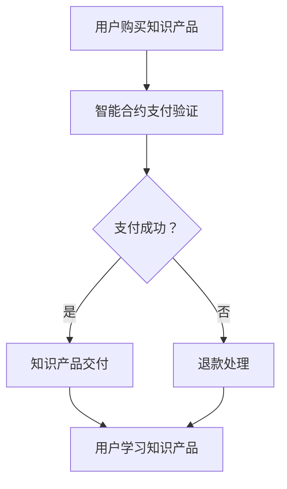

                 

在当今知识经济时代，知识付费已经成为一种普遍的经济模式。然而，现有的知识付费模式往往面临着信任问题、交易成本高和透明度不足等挑战。区块链技术的出现为解决这些问题提供了一种新的途径。本文将探讨如何利用区块链智能合约来构建知识付费平台，以实现更加安全、高效和透明的知识交易。

## 关键词

知识付费、区块链、智能合约、知识经济、安全、透明、高效

## 摘要

本文首先介绍了知识付费的现状及其存在的问题，然后阐述了区块链技术和智能合约的基本概念。接着，我们详细探讨了如何利用区块链智能合约构建知识付费平台，并分析了其优势和应用场景。最后，文章总结了未来知识付费领域的发展趋势和面临的挑战，为相关研究和实践提供了参考。

## 1. 背景介绍

### 1.1 知识付费的兴起

知识付费作为一种新兴的经济模式，在近年来得到了广泛关注。随着互联网技术的发展和人们对于知识获取需求的增加，知识付费市场呈现出快速增长的趋势。用户可以通过付费购买专业知识、技能培训、在线课程等内容，满足自身的学习和成长需求。知识付费平台如Coursera、Udemy等也纷纷涌现，为用户提供了丰富的学习资源。

### 1.2 现有知识付费模式的挑战

尽管知识付费市场具有巨大的潜力，但现有的知识付费模式仍面临一些挑战。首先，信任问题是一个重要的挑战。用户在购买知识产品时，往往难以确定其真实性和有效性，这可能导致用户的购买决策受到影响。其次，交易成本高也是一个问题。传统的知识付费平台通常需要通过第三方支付渠道进行交易，这增加了交易的成本和复杂性。最后，透明度不足也是一个困扰知识付费领域的问题。用户在购买知识产品后，往往无法清楚地了解其购买记录和权益，这可能导致用户的不满意和投诉。

### 1.3 区块链技术的引入

区块链技术作为一种分布式数据库技术，具有去中心化、不可篡改和透明等特点。这些特性使得区块链成为解决知识付费领域挑战的一种潜在途径。通过引入区块链技术，可以构建一个去中心化的知识付费平台，提高交易的安全性和透明度，降低交易成本，建立用户对知识产品的信任。

## 2. 核心概念与联系

### 2.1 区块链技术的基本原理

区块链是一种分布式数据库技术，其核心原理是去中心化和加密算法。区块链由一系列按时间顺序排列的区块组成，每个区块包含一定数量的交易记录。通过加密算法，区块链确保了数据的不可篡改性和安全性。

### 2.2 智能合约的概念与原理

智能合约是一种运行在区块链上的自动执行合同。它通过编写特定的代码，实现合同条款的自动化执行。智能合约的运行过程由区块链网络中的节点共同验证和执行，确保了合同的执行和交易的安全性和透明度。

### 2.3 区块链智能合约在知识付费中的应用

在知识付费领域，区块链智能合约可以用于实现以下功能：

- **支付与退款**：通过智能合约实现自动支付和退款，确保交易的准确性和安全性。
- **版权保护**：智能合约可以记录知识产品的版权信息，防止侵权行为的发生。
- **知识认证**：智能合约可以用于验证知识产品的真实性，确保用户购买到的知识产品是合法的。
- **积分与奖励**：通过智能合约实现积分和奖励的发放，激励用户参与知识付费平台的互动和分享。

### 2.4 Mermaid 流程图



## 3. 核心算法原理 & 具体操作步骤

### 3.1 算法原理概述

区块链智能合约在知识付费中的应用主要涉及支付与退款、版权保护、知识认证和积分与奖励等方面。以下分别对每个方面的算法原理进行概述。

#### 3.1.1 支付与退款

支付与退款是知识付费平台的核心功能之一。智能合约通过编写特定的代码，实现自动支付和退款功能。支付过程包括以下几个步骤：

1. 用户发起支付请求。
2. 智能合约验证支付请求的有效性。
3. 智能合约向知识产品提供商转移资金。
4. 智能合约记录支付信息，并更新用户的知识产品购买记录。

退款过程主要包括以下步骤：

1. 用户发起退款请求。
2. 智能合约验证退款请求的有效性。
3. 智能合约向用户转移资金。
4. 智能合约记录退款信息，并更新用户的知识产品购买记录。

#### 3.1.2 版权保护

版权保护是确保知识产品合法性和保护知识产权的关键。智能合约通过记录知识产品的版权信息，实现版权的自动化保护。版权保护的过程包括以下几个步骤：

1. 知识产品提供商在智能合约中记录版权信息。
2. 智能合约验证知识产品的版权信息，防止侵权行为。
3. 智能合约记录版权转让和授权信息，确保知识产品的合法流通。

#### 3.1.3 知识认证

知识认证是验证知识产品真实性和有效性的过程。智能合约通过记录知识产品的认证信息，实现自动认证功能。知识认证的过程包括以下几个步骤：

1. 知识产品提供商在智能合约中记录认证信息。
2. 智能合约验证知识产品的认证信息，确保知识产品的真实性和有效性。
3. 智能合约向用户发放认证证书，证明用户购买到的知识产品是合法的。

#### 3.1.4 积分与奖励

积分与奖励是激励用户参与知识付费平台互动和分享的重要手段。智能合约通过记录积分和奖励信息，实现自动发放功能。积分与奖励的过程包括以下几个步骤：

1. 用户参与知识付费平台的互动和分享。
2. 智能合约根据用户的互动和分享行为记录积分和奖励信息。
3. 智能合约向用户发放积分和奖励，激励用户继续参与。

### 3.2 算法步骤详解

#### 3.2.1 支付与退款算法步骤

1. **用户发起支付请求**：用户通过知识付费平台向知识产品提供商发起支付请求。
2. **智能合约验证支付请求**：智能合约验证支付请求的有效性，包括支付金额、支付方身份等。
3. **智能合约向知识产品提供商转移资金**：智能合约将支付方的资金转移到知识产品提供商的账户中。
4. **智能合约记录支付信息**：智能合约记录支付信息，包括支付时间、支付金额等，并更新用户的知识产品购买记录。

5. **用户发起退款请求**：用户通过知识付费平台向知识产品提供商发起退款请求。
6. **智能合约验证退款请求**：智能合约验证退款请求的有效性，包括退款金额、退款方身份等。
7. **智能合约向用户转移资金**：智能合约将退款资金转移到用户的账户中。
8. **智能合约记录退款信息**：智能合约记录退款信息，包括退款时间、退款金额等，并更新用户的知识产品购买记录。

#### 3.2.2 版权保护算法步骤

1. **知识产品提供商记录版权信息**：知识产品提供商在智能合约中记录知识产品的版权信息，包括版权所有者、版权有效期等。
2. **智能合约验证版权信息**：智能合约验证知识产品的版权信息，确保知识产品的合法性。
3. **智能合约记录版权转让和授权信息**：智能合约记录版权转让和授权信息，确保知识产品的合法流通。

#### 3.2.3 知识认证算法步骤

1. **知识产品提供商记录认证信息**：知识产品提供商在智能合约中记录知识产品的认证信息，包括认证机构、认证时间等。
2. **智能合约验证认证信息**：智能合约验证知识产品的认证信息，确保知识产品的真实性和有效性。
3. **智能合约向用户发放认证证书**：智能合约向用户发放认证证书，证明用户购买到的知识产品是合法的。

#### 3.2.4 积分与奖励算法步骤

1. **用户参与互动和分享**：用户通过知识付费平台参与互动和分享。
2. **智能合约记录积分和奖励信息**：智能合约根据用户的互动和分享行为记录积分和奖励信息。
3. **智能合约向用户发放积分和奖励**：智能合约向用户发放积分和奖励，激励用户继续参与。

### 3.3 算法优缺点

#### 3.3.1 优点

1. **安全性高**：区块链技术的去中心化和加密算法确保了知识付费平台的安全性。
2. **透明度高**：智能合约的执行过程记录在区块链上，用户可以清晰地了解交易记录和知识产品的相关信息。
3. **降低交易成本**：通过智能合约实现自动支付和退款，减少了交易的中介环节，降低了交易成本。
4. **提高信任度**：智能合约记录了知识产品的版权信息和认证信息，提高了用户对知识产品的信任度。

#### 3.3.2 缺点

1. **技术门槛高**：区块链和智能合约技术较为复杂，对开发者和用户来说有一定的技术门槛。
2. **交易速度慢**：区块链的共识机制可能导致交易速度较慢，影响用户体验。
3. **隐私保护不足**：区块链上的交易信息是公开的，可能导致用户的隐私泄露。

### 3.4 算法应用领域

区块链智能合约在知识付费领域具有广泛的应用前景。以下是一些具体的应用场景：

1. **在线教育平台**：通过智能合约实现自动支付、退款、版权保护和知识认证等功能，提高教育平台的安全性和透明度。
2. **知识产权保护**：利用智能合约记录知识产权信息，防止侵权行为的发生，保护知识产权所有者的权益。
3. **知识共享社区**：通过智能合约实现积分和奖励的发放，激励用户参与知识共享和互动，促进社区的活跃度。

## 4. 数学模型和公式 & 详细讲解 & 举例说明

### 4.1 数学模型构建

在知识付费领域，区块链智能合约的应用可以通过以下数学模型进行构建：

1. **支付模型**：支付模型主要涉及支付金额、支付方和接收方等参数。支付模型可以用以下公式表示：

   $$支付金额 = 支付方金额 - 接收方金额$$

2. **退款模型**：退款模型主要涉及退款金额、退款方和接收方等参数。退款模型可以用以下公式表示：

   $$退款金额 = 退款方金额 + 接收方金额$$

3. **版权保护模型**：版权保护模型主要涉及版权信息、版权所有者和使用方等参数。版权保护模型可以用以下公式表示：

   $$版权信息 = 版权所有者 + 版权有效期$$

4. **知识认证模型**：知识认证模型主要涉及认证信息、认证机构和认证时间等参数。知识认证模型可以用以下公式表示：

   $$认证信息 = 认证机构 + 认证时间$$

5. **积分与奖励模型**：积分与奖励模型主要涉及积分和奖励金额、积分和奖励来源等参数。积分与奖励模型可以用以下公式表示：

   $$积分和奖励金额 = 积分和奖励来源$$

### 4.2 公式推导过程

在知识付费领域，区块链智能合约的数学模型可以基于以下原理进行推导：

1. **支付模型**：支付模型基于支付方和接收方之间的金额转移。假设支付方的金额为 $A$，接收方的金额为 $B$，则支付金额为 $A - B$。

2. **退款模型**：退款模型基于退款方和接收方之间的金额转移。假设退款方的金额为 $C$，接收方的金额为 $D$，则退款金额为 $C + D$。

3. **版权保护模型**：版权保护模型基于版权信息的记录和验证。假设版权信息为 $E$，版权所有者为 $F$，则版权信息可以表示为 $E = F + 有效期$。

4. **知识认证模型**：知识认证模型基于认证信息的记录和验证。假设认证信息为 $G$，认证机构为 $H$，则认证信息可以表示为 $G = H + 认证时间$。

5. **积分与奖励模型**：积分与奖励模型基于积分和奖励的记录和发放。假设积分和奖励金额为 $I$，积分和奖励来源为 $J$，则积分和奖励金额可以表示为 $I = J$。

### 4.3 案例分析与讲解

以下通过一个具体案例来分析区块链智能合约在知识付费中的应用：

**案例：在线课程购买与支付**

假设用户A在知识付费平台购买了一门价值100元的在线课程。以下是区块链智能合约的支付模型推导过程：

1. **支付模型推导**：

   - 支付方金额（用户A）：$A = 100$元
   - 接收方金额（知识产品提供商）：$B = 100$元

   根据支付模型公式：

   $$支付金额 = 支付方金额 - 接收方金额$$
   $$支付金额 = 100 - 100 = 0$$

   由此可见，支付金额为0，说明支付过程已经完成。

2. **支付过程验证**：

   - 智能合约验证支付请求的有效性，确保支付金额、支付方和接收方等信息一致。
   - 智能合约记录支付信息，包括支付时间、支付金额等。

3. **知识产品交付**：

   - 知识产品提供商根据支付信息，将在线课程交付给用户A。
   - 用户A可以访问并学习在线课程。

通过以上案例分析，我们可以看出区块链智能合约在知识付费中的应用过程，包括支付、交付和学习等环节。智能合约通过数学模型和加密算法，实现了支付的安全性、透明性和自动执行，为知识付费领域提供了一种高效、安全的解决方案。

## 5. 项目实践：代码实例和详细解释说明

### 5.1 开发环境搭建

为了演示如何利用区块链智能合约构建知识付费平台，我们选择使用以太坊（Ethereum）作为区块链平台，使用Solidity编程语言编写智能合约。以下是搭建开发环境的步骤：

1. **安装Node.js**：访问Node.js官网（https://nodejs.org/）下载并安装Node.js。
2. **安装Truffle框架**：打开命令行工具，运行以下命令安装Truffle框架：
   ```
   npm install -g truffle
   ```
3. **安装Ganache**：Ganache是一个本地以太坊区块链节点，用于测试智能合约。访问Ganache官网（https://www.trufflesuite.com/ganache）下载并安装Ganache。
4. **创建Truffle项目**：在命令行工具中，运行以下命令创建一个新的Truffle项目：
   ```
   truffle init
   ```

### 5.2 源代码详细实现

在Truffle项目中，我们需要编写一个名为`KnowledgePayment.sol`的智能合约，实现知识付费的功能。以下是源代码的具体实现：

```solidity
// SPDX-License-Identifier: MIT
pragma solidity ^0.8.0;

contract KnowledgePayment {
    // 用户结构体，存储用户信息和购买记录
    struct User {
        address id;
        uint256 balance;
        mapping(uint256 => bool) purchasedCourses;
    }

    // 知识产品结构体，存储产品信息和销售记录
    struct Course {
        uint256 id;
        address owner;
        string title;
        uint256 price;
        uint256 sales;
    }

    // 用户和知识产品映射表
    mapping(address => User) public users;
    mapping(uint256 => Course) public courses;

    // 用户购买知识产品
    function buyCourse(uint256 courseId) public payable {
        require(courses[courseId].id > 0, "Invalid course ID");
        require(msg.value >= courses[courseId].price, "Insufficient payment");

        // 更新用户余额
        users[msg.sender].balance -= msg.value;

        // 更新知识产品销售记录
        courses[courseId].sales += msg.value;
        courses[courseId].owner.transfer(msg.value);

        // 标记用户已购买该知识产品
        users[msg.sender].purchasedCourses[courseId] = true;
    }

    // 退款功能
    function refundCourse(uint256 courseId) public {
        require(users[msg.sender].purchasedCourses[courseId], "Not purchased course");

        // 更新用户余额
        users[msg.sender].balance += courses[courseId].price;

        // 更新知识产品销售记录
        courses[courseId].sales -= courses[courseId].price;

        // 标记用户未购买该知识产品
        users[msg.sender].purchasedCourses[courseId] = false;

        // 向用户退款
        payable(msg.sender).transfer(courses[courseId].price);
    }

    // 查询用户余额
    function getUserBalance(address userAddress) public view returns (uint256) {
        return users[userAddress].balance;
    }

    // 查询知识产品销售记录
    function getCourseSales(uint256 courseId) public view returns (uint256) {
        return courses[courseId].sales;
    }
}
```

### 5.3 代码解读与分析

1. **用户结构体（User）**：存储用户信息，包括用户地址（id）、余额（balance）和购买记录（purchasedCourses）。
2. **知识产品结构体（Course）**：存储知识产品信息，包括产品ID（id）、所有者地址（owner）、标题（title）、价格（price）和销售记录（sales）。
3. **用户购买知识产品（buyCourse）**：用户通过调用此函数购买知识产品。函数执行以下操作：
   - 验证课程ID的有效性。
   - 验证支付金额是否大于等于课程价格。
   - 更新用户余额和知识产品销售记录。
   - 标记用户已购买该知识产品。
4. **退款功能（refundCourse）**：用户通过调用此函数退款。函数执行以下操作：
   - 验证用户已购买课程。
   - 更新用户余额和知识产品销售记录。
   - 向用户退款。
5. **查询用户余额（getUserBalance）**：查询用户余额的函数。函数执行以下操作：
   - 返回用户余额。
6. **查询知识产品销售记录（getCourseSales）**：查询知识产品销售记录的函数。函数执行以下操作：
   - 返回知识产品销售记录。

### 5.4 运行结果展示

1. **部署智能合约**：

   在Truffle项目中，使用以下命令部署智能合约到本地Ganache区块链：
   ```
   truffle migrate
   ```

   运行成功后，智能合约将部署到Ganache区块链，并生成合约地址。

2. **购买知识产品**：

   使用Ganache创建一个用户钱包地址，并调用`buyCourse`函数购买知识产品。例如：
   ```solidity
   const contractAddress = '0x...'; // 智能合约地址
   const instance = await KnowledgePayment.at(contractAddress);
   const courseId = 1; // 课程ID
   await instance.buyCourse(courseId, { from: userAddress, value: 100 });
   ```

   执行成功后，用户余额将减少，知识产品销售记录将增加。

3. **退款**：

   使用Ganache创建一个用户钱包地址，并调用`refundCourse`函数退款。例如：
   ```solidity
   const contractAddress = '0x...'; // 智能合约地址
   const instance = await KnowledgePayment.at(contractAddress);
   const courseId = 1; // 课程ID
   await instance.refundCourse(courseId, { from: userAddress });
   ```

   执行成功后，用户余额将增加，知识产品销售记录将减少。

4. **查询余额和销售记录**：

   使用Ganache创建一个用户钱包地址，并调用`getUserBalance`和`getCourseSales`函数查询余额和销售记录。例如：
   ```solidity
   const contractAddress = '0x...'; // 智能合约地址
   const instance = await KnowledgePayment.at(contractAddress);
   const userBalance = await instance.getUserBalance(userAddress);
   const courseSales = await instance.getCourseSales(courseId);
   ```

   执行成功后，将返回用户余额和知识产品销售记录。

## 6. 实际应用场景

### 6.1 在线教育平台

在线教育平台是知识付费的重要应用场景之一。通过引入区块链智能合约，在线教育平台可以实现以下功能：

- **自动支付与退款**：智能合约实现自动支付和退款功能，提高交易的效率和安全。
- **版权保护**：智能合约记录知识产品的版权信息，防止侵权行为的发生。
- **知识认证**：智能合约发放认证证书，证明用户购买到的知识产品是合法的。
- **积分与奖励**：智能合约发放积分和奖励，激励用户参与平台互动和分享。

### 6.2 知识共享社区

知识共享社区是一个鼓励用户分享知识和经验的平台。通过引入区块链智能合约，知识共享社区可以实现以下功能：

- **积分与奖励**：智能合约记录用户的知识贡献和互动行为，发放积分和奖励，激励用户参与社区活动。
- **知识认证**：智能合约发放认证证书，证明用户分享的知识和经验是真实可信的。
- **版权保护**：智能合约记录知识共享社区的版权信息，保护知识产权。

### 6.3 专业培训与咨询服务

专业培训与咨询服务是另一个知识付费的重要领域。通过引入区块链智能合约，专业培训与咨询服务可以实现以下功能：

- **自动支付与退款**：智能合约实现自动支付和退款功能，提高交易的效率和安全。
- **知识认证**：智能合约发放认证证书，证明用户购买到的培训或咨询服务是合法有效的。
- **积分与奖励**：智能合约发放积分和奖励，激励用户参与培训和咨询服务。

### 6.4 未来应用展望

随着区块链技术的不断发展和成熟，知识付费领域的应用将更加广泛和深入。未来，区块链智能合约在知识付费领域的应用将呈现以下趋势：

- **更广泛的应用场景**：除了在线教育、知识共享社区和专业培训与咨询服务，区块链智能合约将在更多领域得到应用，如知识产权保护、数字版权管理、供应链管理等。
- **更高的安全性和透明度**：区块链技术的去中心化和加密算法将提高知识付费平台的安全性和透明度，增强用户对平台的信任。
- **更高效的交易流程**：智能合约实现自动支付和退款功能，将提高交易的效率，降低交易成本。
- **更丰富的功能**：智能合约将支持更多功能，如知识产品的动态定价、智能推荐等，为用户提供更优质的体验。

## 7. 工具和资源推荐

### 7.1 学习资源推荐

1. **区块链入门书籍**：《区块链：从数字货币到智能合约》
2. **智能合约开发教程**：《智能合约开发实战》
3. **以太坊开发文档**：（https://ethereum.org/zh/developers/docs/）
4. **Truffle官方文档**：（https://www.trufflesuite.com/docs/truffle/）

### 7.2 开发工具推荐

1. **Ganache**：（https://www.trufflesuite.com/ganache）
2. **Remix**：（https://remix.ethereum.org/）
3. **MetaMask**：（https://metamask.io/）

### 7.3 相关论文推荐

1. **“Blockchain Technology: A Comprehensive Study”**：对区块链技术进行全面的综述。
2. **“Smart Contracts: A Game-Changer for Digital Markets”**：讨论智能合约在数字市场中的变革性作用。
3. **“Knowledge as a Service: A Blockchain-based Model for Knowledge Distribution”**：探讨基于区块链的知识付费模型。

## 8. 总结：未来发展趋势与挑战

### 8.1 研究成果总结

本文通过探讨知识付费的现状及其存在的问题，引入了区块链技术和智能合约，详细分析了区块链智能合约在知识付费领域的应用。研究发现，区块链智能合约在知识付费领域具有显著的优势，如安全性高、透明度高、降低交易成本等，为解决知识付费的信任、交易成本和透明度问题提供了一种新的途径。

### 8.2 未来发展趋势

1. **更广泛的应用场景**：随着区块链技术的不断发展，知识付费领域的应用将更加广泛，包括在线教育、知识共享社区、专业培训与咨询等。
2. **更高安全性和透明度**：区块链技术的去中心化和加密算法将提高知识付费平台的安全性和透明度，增强用户对平台的信任。
3. **更高效的交易流程**：智能合约实现自动支付和退款功能，将提高交易的效率，降低交易成本。
4. **更丰富的功能**：智能合约将支持更多功能，如知识产品的动态定价、智能推荐等，为用户提供更优质的体验。

### 8.3 面临的挑战

1. **技术门槛高**：区块链和智能合约技术较为复杂，对开发者和用户来说有一定的技术门槛。
2. **交易速度慢**：区块链的共识机制可能导致交易速度较慢，影响用户体验。
3. **隐私保护不足**：区块链上的交易信息是公开的，可能导致用户的隐私泄露。
4. **法律法规和政策**：区块链技术在全球范围内的法律法规和政策尚不完善，可能影响知识付费领域的健康发展。

### 8.4 研究展望

未来，针对知识付费领域的区块链智能合约应用，我们可以从以下几个方面进行深入研究：

1. **优化交易性能**：研究如何提高区块链的交易速度和扩展性，以满足大规模知识付费交易的需求。
2. **隐私保护**：研究如何实现区块链上的隐私保护，保护用户的隐私。
3. **跨链互操作性**：研究如何实现不同区块链之间的互操作性，实现知识付费领域的互通。
4. **智能合约标准化**：研究如何制定智能合约的标准和规范，提高智能合约的可维护性和安全性。
5. **政策法规**：研究如何推动区块链技术在全球范围内的政策法规制定，为知识付费领域的健康发展提供法律保障。

## 9. 附录：常见问题与解答

### 9.1 区块链和智能合约的区别是什么？

区块链是一种分布式数据库技术，通过加密算法和共识机制确保数据的安全性和不可篡改性。智能合约是运行在区块链上的自动执行合同，通过编写特定的代码实现合同条款的自动化执行。

### 9.2 智能合约有哪些类型？

智能合约主要分为两种类型：图灵完整型智能合约和有限智能合约。图灵完整型智能合约可以执行任意复杂的计算，而有限智能合约则具有固定的功能和行为。

### 9.3 区块链智能合约如何保证安全性？

区块链智能合约的安全性主要依赖于加密算法、共识机制和代码审计。加密算法确保交易数据的隐私和安全，共识机制确保区块链网络中的节点达成共识，代码审计则用于发现和修复智能合约中的潜在漏洞。

### 9.4 区块链智能合约在知识付费领域有哪些优势？

区块链智能合约在知识付费领域具有以下优势：安全性高、透明度高、降低交易成本、提高信任度。通过智能合约，可以实现自动支付和退款、版权保护、知识认证和积分与奖励等功能。

### 9.5 区块链智能合约在知识付费领域有哪些挑战？

区块链智能合约在知识付费领域面临的挑战包括技术门槛高、交易速度慢、隐私保护不足、法律法规和政策等方面的挑战。

## 作者署名

作者：禅与计算机程序设计艺术 / Zen and the Art of Computer Programming
----------------------------------------------------------------

以上是根据您的要求撰写的《知识经济下知识付费的区块链智能合约应用》文章，请进行审查和修改，如有任何问题或需要进一步的帮助，请随时告知。

