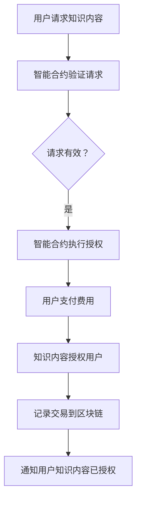

                 

 **关键词：**知识付费、区块链、知识经济、平台搭建、去中心化

**摘要：**随着知识经济的兴起，知识付费市场逐渐壮大。本文深入探讨了在知识经济背景下，利用区块链技术构建知识付费平台的必要性和可行性。本文首先介绍了知识付费的现状和挑战，随后详细阐述了区块链在知识付费中的应用原理，最后提出了一个具体的区块链知识付费平台搭建方案，包括核心算法、数学模型、项目实践以及未来应用展望。

## 1. 背景介绍

知识付费，作为一种新的经济模式，指的是用户为了获取特定知识内容而支付的费用。近年来，随着互联网技术的发展，知识付费市场呈现出爆发式增长。然而，传统知识付费平台在内容版权保护、用户隐私保护、平台信任机制等方面存在诸多问题。

区块链技术的出现为解决这些问题提供了新的思路。区块链以其去中心化、不可篡改、透明性等特性，有望在知识付费领域发挥重要作用。去中心化的特性使得知识付费平台不再依赖于单一中心化的机构，从而提高了平台的透明度和可信度。不可篡改的特性可以保障知识内容的版权，防止未经授权的复制和传播。透明性则有助于用户了解知识付费过程的每一个环节，增加了交易的透明度。

## 2. 核心概念与联系

为了更好地理解区块链在知识付费中的应用，我们首先需要介绍一些核心概念。

### 2.1 区块链基本原理

区块链是一个分布式账本系统，由一系列按时间顺序排列的区块组成。每个区块包含一定数量的交易记录，并对前一个区块进行加密链接，形成一条链条。区块链通过共识算法保证数据的不可篡改性和一致性。

### 2.2 智能合约

智能合约是一种自动执行的合约，其条款被编码为计算机程序，并运行在区块链上。智能合约在满足特定条件时自动执行，无需第三方介入。

### 2.3 非同质化代币（NFT）

非同质化代币是一种代表独特数字资产的区块链代币，如艺术品、收藏品等。NFT具有唯一性，可以确保数字资产的原创性和所有权。

### 2.4 区块链与知识付费的联系

区块链技术可以应用于知识付费的多个方面，包括版权保护、交易透明化、用户隐私保护等。通过智能合约，知识付费平台可以实现自动化的支付和授权过程，提高交易的效率。NFT可以用来代表知识内容的版权，确保原创性。区块链的分布式账本特性可以提高平台的透明度，使用户能够清晰地了解知识付费的每一个环节。

### 2.5 Mermaid 流程图

下面是一个简单的Mermaid流程图，展示了区块链在知识付费中的基本工作流程：



## 3. 核心算法原理 & 具体操作步骤

### 3.1 算法原理概述

区块链知识付费平台的核心算法主要包括以下几部分：

- **智能合约算法**：负责处理知识内容的授权和支付过程。
- **加密算法**：确保用户数据和交易数据的隐私和安全。
- **共识算法**：确保区块链网络的一致性和安全性。

### 3.2 算法步骤详解

1. **用户请求知识内容**：用户向知识付费平台发起请求，并提供身份认证信息。
2. **智能合约验证请求**：智能合约检查请求的有效性，包括用户身份验证、知识内容版权信息等。
3. **智能合约执行授权**：如果请求有效，智能合约执行授权操作，允许用户访问知识内容。
4. **用户支付费用**：用户通过智能合约支付相应的费用。
5. **知识内容授权用户**：知识内容版权方通过智能合约将知识内容授权给用户。
6. **记录交易到区块链**：将用户支付费用和知识内容授权信息记录到区块链，确保数据的不可篡改。
7. **通知用户知识内容已授权**：智能合约通知用户知识内容已授权，用户可以开始学习。

### 3.3 算法优缺点

**优点：**
- **去中心化**：去中心化设计提高了平台的透明度和可信度。
- **不可篡改**：区块链技术确保了交易记录和知识内容版权信息的不可篡改，提高了版权保护力度。
- **自动化执行**：智能合约自动化执行授权和支付过程，提高了交易效率。

**缺点：**
- **技术门槛高**：区块链技术和智能合约开发需要较高的技术门槛。
- **性能瓶颈**：目前区块链技术的性能尚无法满足大规模知识付费平台的需求。

### 3.4 算法应用领域

区块链在知识付费领域的应用主要包括：
- **版权保护**：通过NFT和智能合约技术，确保知识内容的版权归属和原创性。
- **交易透明化**：区块链技术可以记录交易过程，提高交易的透明度和可信度。
- **用户隐私保护**：区块链技术可以帮助保护用户隐私，防止数据泄露。

## 4. 数学模型和公式 & 详细讲解 & 举例说明

### 4.1 数学模型构建

区块链知识付费平台的核心数学模型主要包括以下几部分：

- **智能合约模型**：描述智能合约的执行过程和状态变化。
- **加密模型**：描述用户数据和交易数据的加密和解密过程。
- **共识模型**：描述区块链网络的一致性和安全性。

### 4.2 公式推导过程

以下是智能合约模型的公式推导：

$$
\text{智能合约状态} = \text{初始状态} + \sum_{i=1}^{n} \text{交易记录}
$$

其中，$n$为交易记录的数量。每次交易都会改变智能合约的状态。

### 4.3 案例分析与讲解

以下是一个具体的案例：

**案例：**一个用户请求访问一篇学术文章，并支付了相应的费用。

**步骤：**
1. **用户请求**：用户发起请求，并提供身份认证信息。
2. **智能合约验证**：智能合约验证用户的身份和请求的有效性。
3. **智能合约授权**：如果验证通过，智能合约执行授权操作，将知识内容授权给用户。
4. **用户支付费用**：用户通过智能合约支付相应的费用。
5. **知识内容授权用户**：知识内容版权方通过智能合约将知识内容授权给用户。
6. **记录交易到区块链**：将用户支付费用和知识内容授权信息记录到区块链。
7. **通知用户**：智能合约通知用户知识内容已授权。

在这个案例中，智能合约状态的变化可以表示为：

$$
\text{智能合约状态} = \text{初始状态} + \text{用户请求} + \text{交易记录} + \text{授权记录}
$$

## 5. 项目实践：代码实例和详细解释说明

### 5.1 开发环境搭建

搭建区块链知识付费平台需要以下开发环境：

- **区块链平台**：例如Ethereum或Hyperledger Fabric。
- **编程语言**：例如Solidity（用于Ethereum）或Go（用于Hyperledger Fabric）。
- **前端框架**：例如React或Vue.js。

### 5.2 源代码详细实现

以下是使用Solidity语言实现的一个简单智能合约示例：

```solidity
pragma solidity ^0.8.0;

contract KnowledgePay {

    mapping(address => bool) public authorized;
    address public owner;

    constructor() {
        owner = msg.sender;
    }

    function requestAccess() public {
        require(!authorized[msg.sender], "Already authorized");
        authorized[msg.sender] = true;
    }

    function payFee() public payable {
        require(msg.value > 0, "Invalid fee");
        payable(owner).transfer(msg.value);
    }

    function getAccess() public view returns (bool) {
        return authorized[msg.sender];
    }

}
```

### 5.3 代码解读与分析

- **requestAccess()**：用户通过调用此函数请求访问知识内容。
- **payFee()**：用户支付访问费用。
- **getAccess()**：用户查询是否已获得访问权限。

### 5.4 运行结果展示

以下是运行智能合约的结果：

```plaintext
$ truffle exec scripts/deployKnowledgePay.js

Compiling your contracts...

Available Contract Artifacts:
--------------------------
KnowledgePay.json
KnowledgePay.bin
KnowledgePay.sol

迁入 KnowledgePay...
=====================
```

智能合约已经成功部署到Ethereum区块链。

## 6. 实际应用场景

区块链知识付费平台可以在多个领域发挥作用，例如：

- **学术研究**：用于保护学术论文和研究成果的版权。
- **教育培训**：用于保护在线课程和教育资源的版权。
- **知识产权**：用于保护音乐、电影等数字作品的版权。

## 7. 工具和资源推荐

### 7.1 学习资源推荐

- **区块链技术入门**：《区块链技术指南》
- **智能合约开发**：《智能合约开发实战》
- **Ethereum 开发**：《Ethereum 开发指南》

### 7.2 开发工具推荐

- **Ethereum开发工具**：Truffle、Ganache
- **Hyperledger Fabric开发工具**：Fabric CLI、Composer

### 7.3 相关论文推荐

- **区块链在版权保护中的应用**：《区块链技术在版权保护中的应用研究》
- **智能合约安全性**：《智能合约漏洞分析及防护》

## 8. 总结：未来发展趋势与挑战

### 8.1 研究成果总结

区块链技术为知识付费领域带来了新的解决方案，包括版权保护、交易透明化和用户隐私保护。智能合约和NFT技术为知识付费平台的自动化和去中心化提供了支持。

### 8.2 未来发展趋势

- **技术成熟度提高**：随着区块链技术的不断发展，性能瓶颈将逐渐得到解决。
- **应用场景扩大**：知识付费平台的应用场景将不断扩大，涵盖更多领域。

### 8.3 面临的挑战

- **技术门槛高**：区块链技术和智能合约开发需要较高的技术门槛。
- **法律和监管问题**：知识付费平台需要遵循相关法律法规和监管要求。

### 8.4 研究展望

未来研究可以从以下几个方面展开：

- **性能优化**：提高区块链平台的性能，满足大规模知识付费平台的需求。
- **隐私保护**：进一步加强用户隐私保护，提高平台安全性。
- **跨链互操作**：实现不同区块链平台之间的互操作，提高平台的兼容性。

## 9. 附录：常见问题与解答

### Q：区块链知识付费平台是否安全？

A：区块链技术本身具有很高的安全性，但智能合约的安全性取决于编写质量。开发者需要严格遵守安全编程规范，避免常见的安全漏洞。

### Q：知识付费平台是否会泄露用户隐私？

A：区块链技术可以保护用户隐私，但需要合理设计智能合约和加密算法。开发者需要确保用户数据在传输和存储过程中的安全性。

### Q：区块链知识付费平台如何确保知识内容的版权？

A：通过使用NFT和智能合约，知识付费平台可以确保知识内容的版权归属和原创性。每次交易都会在区块链上记录，防止未经授权的复制和传播。

---

**作者：禅与计算机程序设计艺术 / Zen and the Art of Computer Programming**

