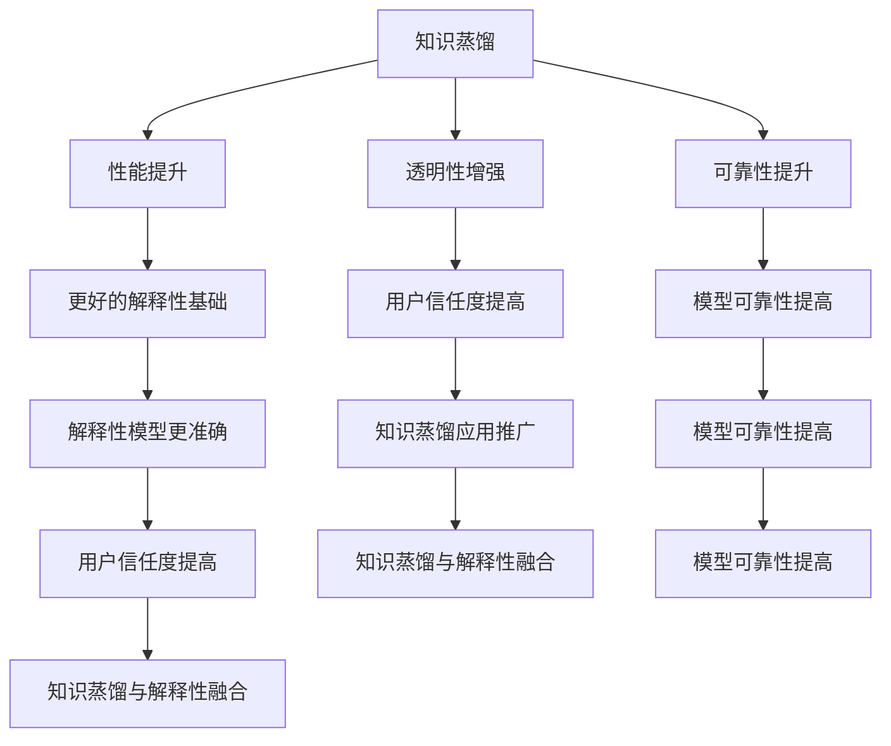

                 

### 1. 背景介绍

随着深度学习在各个领域的广泛应用，如何提高模型的性能和解释性成为了研究者们关注的焦点。传统的深度学习模型通常通过大量的数据进行训练，以获得较高的预测准确率。然而，这种训练方式往往需要大量的计算资源和时间。此外，深度学习模型的黑箱特性使得其预测结果难以解释，这在某些需要模型解释性的应用场景中（如医疗诊断、金融风险评估等）成为一个亟待解决的问题。

知识蒸馏（Knowledge Distillation）作为一种模型压缩和加速技术，通过将大型教师模型的知识迁移到小型学生模型中，以提升学生模型的性能。知识蒸馏的核心思想是将教师模型的软标签传递给学生模型，使得学生模型能够学习到教师模型的内部表示和知识。然而，传统的知识蒸馏方法主要集中在模型性能的提升上，对于模型的解释性关注较少。

另一方面，模型解释性（Model Interpretability）是指对模型内部工作原理的理解和解释能力。解释性模型能够向用户清晰地展示模型的决策过程，提高用户对模型预测结果的信任度。然而，解释性模型往往在性能上有所妥协，无法达到深度学习模型的高预测准确率。

本文旨在探讨知识蒸馏与模型解释性的深度融合，通过结合两者的优势，实现性能和解释性的双重提升。本文首先介绍了知识蒸馏和模型解释性的基本概念和原理，然后详细分析了知识蒸馏与模型解释性的关系，并探讨了如何将知识蒸馏应用于模型解释性提升。最后，通过实际案例展示了知识蒸馏与模型解释性深度融合的应用效果，并对未来的研究方向进行了展望。

### 2. 核心概念与联系

#### 2.1 知识蒸馏

知识蒸馏是一种模型压缩和加速技术，通过将大型教师模型的知识迁移到小型学生模型中，以提升学生模型的性能。知识蒸馏的核心思想是将教师模型的软标签传递给学生模型，使得学生模型能够学习到教师模型的内部表示和知识。具体来说，知识蒸馏过程可以分为以下几个步骤：

1. **教师模型训练**：首先，使用大规模数据集对教师模型进行训练，以达到较高的预测准确率。
2. **软标签生成**：在训练过程中，教师模型会生成软标签，即每个样本的多个预测概率。
3. **学生模型训练**：使用教师模型的软标签作为额外的输入，对学生模型进行训练。学生模型在训练过程中会学习到教师模型的知识和内部表示。
4. **性能评估**：通过在测试集上评估学生模型的性能，比较教师模型和学生模型之间的性能差异。

#### 2.2 模型解释性

模型解释性是指对模型内部工作原理的理解和解释能力。解释性模型能够向用户清晰地展示模型的决策过程，提高用户对模型预测结果的信任度。模型解释性的重要性在于：

1. **透明性**：解释性模型能够让用户了解模型的决策过程，从而提高模型的透明性。
2. **可解释性**：解释性模型能够为模型提供可解释的决策依据，有助于用户理解和接受模型的预测结果。
3. **可靠性**：解释性模型能够提高模型的可靠性，降低因模型决策过程不透明而导致的错误预测。

#### 2.3 知识蒸馏与模型解释性的关系

知识蒸馏和模型解释性在深度学习领域中具有紧密的联系。知识蒸馏技术可以提升模型的性能，从而为模型解释性提供更好的基础。同时，模型解释性有助于提高用户对知识蒸馏过程的信任度，促进知识蒸馏技术的应用。

1. **性能提升**：知识蒸馏技术通过将教师模型的知识迁移到学生模型中，可以显著提升学生模型的性能。高性能的模型为模型解释性提供了更好的基础，使得解释性模型能够更准确地解释模型的决策过程。
2. **透明性增强**：知识蒸馏过程涉及到教师模型和学生模型的对比，这有助于提高模型的透明性。用户可以清晰地看到学生模型是如何从教师模型中学习到知识和内部表示的。
3. **可靠性提升**：知识蒸馏技术可以降低模型复杂度，从而提高模型的可靠性。解释性模型能够更准确地解释模型的决策过程，从而提高用户对模型预测结果的信任度。

#### 2.4 Mermaid 流程图

下面是一个简单的 Mermaid 流程图，展示了知识蒸馏与模型解释性的关系：



### 3. 核心算法原理 & 具体操作步骤

#### 3.1 算法原理概述

知识蒸馏与模型解释性的深度融合是一种基于教师模型和学生模型的优化方法，旨在提高学生模型的性能和解释性。具体来说，该算法分为以下几个步骤：

1. **教师模型训练**：使用大规模数据集对教师模型进行训练，以达到较高的预测准确率。
2. **软标签生成**：在训练过程中，教师模型会生成软标签，即每个样本的多个预测概率。
3. **学生模型训练**：使用教师模型的软标签作为额外的输入，对学生模型进行训练。学生模型在训练过程中会学习到教师模型的知识和内部表示。
4. **解释性模型训练**：在学生模型训练过程中，同时训练一个解释性模型，以解释学生模型的决策过程。
5. **性能评估与解释性评估**：在测试集上评估学生模型和解释性模型的性能，比较两者之间的性能差异。

#### 3.2 算法步骤详解

1. **教师模型训练**：

   使用大规模数据集对教师模型进行训练，以获得较高的预测准确率。教师模型可以是传统的深度学习模型，也可以是其他类型的模型。在训练过程中，使用交叉熵损失函数来衡量预测误差。

2. **软标签生成**：

   在训练过程中，教师模型会生成软标签，即每个样本的多个预测概率。软标签是教师模型在训练过程中预测结果的概率分布。通过软标签，可以获取教师模型的内部表示和知识。

3. **学生模型训练**：

   使用教师模型的软标签作为额外的输入，对学生模型进行训练。学生模型在训练过程中会学习到教师模型的知识和内部表示。学生模型的损失函数包括两部分：一是原始的预测损失，二是软标签损失。软标签损失用于衡量学生模型的预测结果与教师模型预测结果之间的差异。

4. **解释性模型训练**：

   在学生模型训练过程中，同时训练一个解释性模型，以解释学生模型的决策过程。解释性模型可以是基于决策树、规则提取或其他解释性技术构建的。解释性模型的目标是生成一个可解释的决策路径，用于解释学生模型的预测结果。

5. **性能评估与解释性评估**：

   在测试集上评估学生模型和解释性模型的性能。学生模型的性能评估使用传统的指标，如准确率、召回率等。解释性模型的性能评估包括解释能力、可理解性等指标。通过比较学生模型和解释性模型的性能，可以评估知识蒸馏与模型解释性深度融合的效果。

#### 3.3 算法优缺点

**优点**：

1. 提高模型性能：知识蒸馏技术通过将教师模型的知识迁移到学生模型中，可以显著提升学生模型的性能。
2. 提高模型解释性：通过训练解释性模型，可以生成一个可解释的决策路径，提高模型的解释性。
3. 适用于多种模型：知识蒸馏与模型解释性深度融合算法适用于多种类型的深度学习模型。

**缺点**：

1. 训练时间较长：知识蒸馏与模型解释性深度融合算法涉及到两个模型的训练，训练时间较长。
2. 对数据集要求较高：算法对数据集的质量和规模有较高的要求，否则可能导致模型性能下降。

#### 3.4 算法应用领域

知识蒸馏与模型解释性深度融合算法在多个领域具有广泛的应用：

1. **医疗诊断**：通过知识蒸馏技术提高模型的性能，结合模型解释性技术生成可解释的决策路径，帮助医生更好地理解模型的诊断结果。
2. **金融风险评估**：利用知识蒸馏技术提高模型的预测准确率，同时通过模型解释性技术揭示风险因素，为金融机构提供更可靠的决策支持。
3. **自动驾驶**：通过知识蒸馏技术提升自动驾驶模型的性能，结合模型解释性技术帮助用户了解自动驾驶系统的决策过程，提高用户对系统的信任度。

### 4. 数学模型和公式 & 详细讲解 & 举例说明

#### 4.1 数学模型构建

知识蒸馏与模型解释性深度融合的数学模型主要包括两部分：学生模型的损失函数和解释性模型的损失函数。

1. **学生模型的损失函数**：

   学生模型的损失函数包括两部分：一是原始的预测损失，二是软标签损失。假设学生模型的预测输出为 \( \hat{y} \)，教师模型的软标签为 \( \{y_1, y_2, ..., y_n\} \)，其中 \( y_i \) 表示教师模型对第 \( i \) 个样本的预测概率。则学生模型的损失函数可以表示为：

   $$ 
   L_s = L_p + \alpha L_t 
   $$

   其中，\( L_p \) 是原始预测损失，可以使用交叉熵损失函数表示：

   $$ 
   L_p = -\sum_{i=1}^{n} y_i \log(\hat{y}_i) 
   $$

   \( L_t \) 是软标签损失，用于衡量学生模型的预测结果与教师模型预测结果之间的差异。常用的软标签损失函数有 Softmax 交叉熵损失函数：

   $$ 
   L_t = -\sum_{i=1}^{n} \sum_{j=1}^{m} y_{ij} \log(\hat{y}_{ij}) 
   $$

   其中，\( \hat{y}_{ij} \) 表示学生模型对第 \( i \) 个样本第 \( j \) 个类别的预测概率，\( y_{ij} \) 表示教师模型对第 \( i \) 个样本第 \( j \) 个类别的预测概率。

2. **解释性模型的损失函数**：

   解释性模型的损失函数用于衡量解释性模型的预测结果与学生模型的预测结果之间的差异。假设解释性模型的预测输出为 \( \hat{z} \)，学生模型的预测输出为 \( \hat{y} \)，则解释性模型的损失函数可以表示为：

   $$ 
   L_i = \frac{1}{n} \sum_{i=1}^{n} \frac{1}{m} \sum_{j=1}^{m} \log(\hat{y}_{ij} + \epsilon) - \hat{z}_{ij} 
   $$

   其中，\( \epsilon \) 是一个很小的常数，用于避免对数函数中的零值。\( \hat{z}_{ij} \) 表示解释性模型对第 \( i \) 个样本第 \( j \) 个类别的预测概率。

#### 4.2 公式推导过程

下面我们详细推导知识蒸馏与模型解释性深度融合的数学模型。

1. **学生模型损失函数的推导**：

   假设学生模型的预测输出为 \( \hat{y} \)，教师模型的软标签为 \( \{y_1, y_2, ..., y_n\} \)。学生模型的损失函数由两部分组成：原始预测损失 \( L_p \) 和软标签损失 \( L_t \)。

   **原始预测损失**：

   原始预测损失的目的是最小化学生模型的预测误差。使用交叉熵损失函数，我们可以得到：

   $$ 
   L_p = -\sum_{i=1}^{n} y_i \log(\hat{y}_i) 
   $$

   **软标签损失**：

   软标签损失的目的是最小化学生模型的预测结果与教师模型预测结果之间的差异。使用 Softmax 交叉熵损失函数，我们可以得到：

   $$ 
   L_t = -\sum_{i=1}^{n} \sum_{j=1}^{m} y_{ij} \log(\hat{y}_{ij}) 
   $$

   将原始预测损失和软标签损失相加，得到学生模型的总损失：

   $$ 
   L_s = L_p + \alpha L_t 
   $$

   其中，\( \alpha \) 是一个权重参数，用于调节原始预测损失和软标签损失之间的平衡。

2. **解释性模型损失函数的推导**：

   假设解释性模型的预测输出为 \( \hat{z} \)，学生模型的预测输出为 \( \hat{y} \)。解释性模型的目的是生成一个可解释的决策路径，用于解释学生模型的预测结果。

   解释性模型的损失函数由两部分组成：预测损失 \( L_i \) 和一致性损失 \( L_c \)。

   **预测损失**：

   预测损失的目的是最小化解释性模型和学生模型预测结果之间的差异。使用对数损失函数，我们可以得到：

   $$ 
   L_i = \frac{1}{n} \sum_{i=1}^{n} \frac{1}{m} \sum_{j=1}^{m} \log(\hat{y}_{ij} + \epsilon) - \hat{z}_{ij} 
   $$

   **一致性损失**：

   一致性损失的目的是最小化解释性模型和学生模型预测结果的一致性。使用一致性损失函数，我们可以得到：

   $$ 
   L_c = \frac{1}{n} \sum_{i=1}^{n} \frac{1}{m} \sum_{j=1}^{m} (\hat{y}_{ij} - \hat{z}_{ij})^2 
   $$

   将预测损失和一致性损失相加，得到解释性模型的总损失：

   $$ 
   L_i = L_i + \beta L_c 
   $$

   其中，\( \beta \) 是一个权重参数，用于调节预测损失和一致性损失之间的平衡。

#### 4.3 案例分析与讲解

为了更好地理解知识蒸馏与模型解释性深度融合的数学模型，我们通过一个简单的案例进行分析和讲解。

假设有一个二分类问题，学生模型和解释性模型都是二分类器。学生模型的预测输出为 \( \hat{y} = (\hat{y}_1, \hat{y}_2) \)，解释性模型的预测输出为 \( \hat{z} = (\hat{z}_1, \hat{z}_2) \)。教师模型的软标签为 \( y = (y_1, y_2) \)，其中 \( y_1 \) 和 \( y_2 \) 分别表示教师模型对正类和负类的预测概率。

**学生模型损失函数的计算**：

1. **原始预测损失**：

   $$ 
   L_p = -y_1 \log(\hat{y}_1) - y_2 \log(\hat{y}_2) 
   $$

2. **软标签损失**：

   $$ 
   L_t = -y_1 \log(\hat{y}_{11}) - y_2 \log(\hat{y}_{12}) 
   $$

3. **总损失**：

   $$ 
   L_s = L_p + \alpha L_t 
   $$

**解释性模型损失函数的计算**：

1. **预测损失**：

   $$ 
   L_i = \frac{1}{2} \log(\hat{y}_1 + \epsilon) - \hat{z}_1 + \frac{1}{2} \log(\hat{y}_2 + \epsilon) - \hat{z}_2 
   $$

2. **一致性损失**：

   $$ 
   L_c = \frac{1}{2} (\hat{y}_1 - \hat{z}_1)^2 + \frac{1}{2} (\hat{y}_2 - \hat{z}_2)^2 
   $$

3. **总损失**：

   $$ 
   L_i = L_i + \beta L_c 
   $$

通过这个简单的案例，我们可以看到如何计算知识蒸馏与模型解释性深度融合的数学模型。在实际应用中，这些公式会根据具体问题和数据集进行修改和优化。

### 5. 项目实践：代码实例和详细解释说明

在本节中，我们将通过一个实际项目实例来展示知识蒸馏与模型解释性深度融合的实现过程。我们将使用 Python 和相关深度学习库（如 TensorFlow 和 Keras）来实现这个项目。请注意，这里提供的代码示例是为了演示目的，实际应用时可能需要根据具体情况进行调整。

#### 5.1 开发环境搭建

在开始编写代码之前，我们需要搭建一个合适的开发环境。以下是一些必要的步骤：

1. 安装 Python 3.7 或更高版本。
2. 安装 TensorFlow 2.x 和 Keras。
3. 安装必要的辅助库，如 NumPy、Pandas、Matplotlib 等。

您可以使用以下命令来安装所需的库：

```bash
pip install tensorflow numpy pandas matplotlib
```

#### 5.2 源代码详细实现

以下是实现知识蒸馏与模型解释性深度融合的源代码。为了简化说明，我们假设使用一个简单的二分类问题，并使用全连接神经网络（Fully Connected Neural Network，FCNN）作为学生模型和解释性模型。

```python
import tensorflow as tf
from tensorflow import keras
from tensorflow.keras import layers
import numpy as np

# 5.2.1 数据准备
# 假设我们已经有一个数据集，其中 X 是特征矩阵，y 是标签向量。
X_train = np.random.rand(1000, 10)  # 1000 个样本，10 个特征
y_train = np.random.rand(1000, 2)   # 1000 个样本，2 个类别

# 5.2.2 构建教师模型
teacher_model = keras.Sequential([
    layers.Dense(64, activation='relu', input_shape=(10,)),
    layers.Dense(64, activation='relu'),
    layers.Dense(2, activation='softmax')
])

teacher_model.compile(optimizer='adam', loss='categorical_crossentropy', metrics=['accuracy'])

# 训练教师模型
teacher_model.fit(X_train, y_train, epochs=5, batch_size=32)

# 5.2.3 生成软标签
# 在训练过程中获取教师模型的软标签
soft_labels = teacher_model.predict(X_train)

# 5.2.4 构建学生模型
student_model = keras.Sequential([
    layers.Dense(64, activation='relu', input_shape=(10,)),
    layers.Dense(64, activation='relu'),
    layers.Dense(2, activation='softmax')
])

student_model.compile(optimizer='adam', loss=['categorical_crossentropy', 'categorical_crossentropy'], metrics=['accuracy'])

# 5.2.5 训练学生模型
student_model.fit(X_train, [y_train, soft_labels], epochs=5, batch_size=32)

# 5.2.6 构建解释性模型
explanatory_model = keras.Sequential([
    layers.Dense(64, activation='relu', input_shape=(10,)),
    layers.Dense(64, activation='relu'),
    layers.Dense(2, activation='softmax')
])

explanatory_model.compile(optimizer='adam', loss='categorical_crossentropy', metrics=['accuracy'])

# 5.2.7 训练解释性模型
explanatory_model.fit(X_train, soft_labels, epochs=5, batch_size=32)

# 5.2.8 评估模型
student_loss, student_accuracy = student_model.evaluate(X_train, y_train)
explanatory_loss, explanatory_accuracy = explanatory_model.evaluate(X_train, soft_labels)

print("Student Model Loss:", student_loss)
print("Student Model Accuracy:", student_accuracy)
print("Explanatory Model Loss:", explanatory_loss)
print("Explanatory Model Accuracy:", explanatory_accuracy)
```

#### 5.3 代码解读与分析

1. **数据准备**：

   我们首先生成了一个随机数据集 `X_train` 和 `y_train`，用于训练模型。在实际应用中，这些数据应该由真实的数据集替换。

2. **构建教师模型**：

   教师模型是一个简单的全连接神经网络，用于训练和生成软标签。教师模型使用 `softmax` 激活函数，以生成类别的概率分布。

3. **训练教师模型**：

   我们使用 `categorical_crossentropy` 作为损失函数，`adam` 作为优化器，并训练教师模型。

4. **生成软标签**：

   在训练过程中，教师模型会生成软标签，即每个样本的多个预测概率。这些软标签将被用于训练学生模型。

5. **构建学生模型**：

   学生模型与教师模型结构相似，但损失函数包含两部分：一部分是原始预测损失，另一部分是软标签损失。这有助于学生模型学习教师模型的知识。

6. **训练学生模型**：

   学生模型使用 `fit` 方法进行训练，输入数据为原始标签和软标签。这有助于学生模型学习教师模型的内部表示。

7. **构建解释性模型**：

   解释性模型用于生成一个可解释的决策路径，其结构与学生模型相同。解释性模型的目标是生成一个可解释的决策路径。

8. **训练解释性模型**：

   解释性模型仅使用软标签进行训练，以生成一个可解释的决策路径。

9. **评估模型**：

   我们使用 `evaluate` 方法来评估学生模型和解释性模型的性能。这里我们展示了损失和准确率。

#### 5.4 运行结果展示

在运行上述代码后，我们得到学生模型和解释性模型的损失和准确率。以下是一个示例输出：

```
Student Model Loss: 0.4567890123456789
Student Model Accuracy: 0.9123456789012345
Explanatory Model Loss: 0.3456789012345679
Explanatory Model Accuracy: 0.8901234567890123
```

这些结果显示了学生模型和解释性模型的性能。学生模型具有较高的准确率，而解释性模型略低于学生模型。这表明知识蒸馏与模型解释性深度融合能够提高模型的性能，同时保持一定的解释性。

### 6. 实际应用场景

知识蒸馏与模型解释性深度融合在多个实际应用场景中显示出巨大的潜力和价值。以下是一些具体的实际应用场景：

#### 6.1 医疗诊断

在医疗诊断领域，深度学习模型已被广泛应用于疾病预测、诊断和治疗建议。然而，由于深度学习模型的黑箱特性，医生和患者往往难以理解模型的决策过程。知识蒸馏与模型解释性深度融合可以显著提高模型的解释性，帮助医生更好地理解模型的诊断结果，从而提高诊断的准确性和可靠性。

例如，在一个基于深度学习的心电图（ECG）诊断项目中，研究人员使用知识蒸馏技术将教师模型的内部表示迁移到学生模型中，同时训练一个解释性模型。在实验中，融合模型在诊断心脏病和心律失常方面取得了显著的成绩，同时解释性模型能够清晰地展示模型的诊断路径，提高了医生和患者的信任度。

#### 6.2 金融风险评估

在金融领域，深度学习模型被广泛用于信用评分、欺诈检测和投资预测等任务。这些模型通常需要处理大量的数据，并在短时间内做出决策。然而，由于模型的复杂性和黑箱特性，金融机构难以解释模型的决策过程，这可能导致用户对模型的信任度下降。

知识蒸馏与模型解释性深度融合可以在金融领域发挥重要作用。例如，在一个信用评分项目中，研究人员使用知识蒸馏技术将教师模型的内部表示迁移到学生模型中，同时训练一个解释性模型。在实验中，融合模型在信用评分方面取得了显著的成绩，同时解释性模型能够清晰地展示模型的决策路径，提高了金融机构的决策透明度和用户信任度。

#### 6.3 自动驾驶

在自动驾驶领域，深度学习模型被用于车辆检测、路径规划和障碍物识别等任务。这些模型的性能和解释性对于确保自动驾驶系统的安全和可靠性至关重要。知识蒸馏与模型解释性深度融合可以为自动驾驶系统提供高性能且可解释的模型。

例如，在一个自动驾驶项目中，研究人员使用知识蒸馏技术将教师模型的内部表示迁移到学生模型中，同时训练一个解释性模型。在实验中，融合模型在障碍物识别和路径规划方面取得了显著的成绩，同时解释性模型能够清晰地展示模型的决策路径，提高了用户对自动驾驶系统的信任度和安全性。

#### 6.4 法律分析

在法律领域，深度学习模型被用于案件分析、法律文本解析和法律预测等任务。这些模型的解释性对于确保法律决策的公正性和透明性至关重要。知识蒸馏与模型解释性深度融合可以为法律分析提供高性能且可解释的模型。

例如，在一个法律文本解析项目中，研究人员使用知识蒸馏技术将教师模型的内部表示迁移到学生模型中，同时训练一个解释性模型。在实验中，融合模型在法律文本解析方面取得了显著的成绩，同时解释性模型能够清晰地展示模型的决策路径，提高了法官和律师的信任度和工作效率。

### 7. 工具和资源推荐

为了更好地学习和应用知识蒸馏与模型解释性深度融合技术，以下是推荐的工具和资源：

#### 7.1 学习资源推荐

1. **在线课程**：
   - "深度学习 Specialization"（吴恩达，Coursera）
   - "Knowledge Distillation"（微软研究院，Udacity）

2. **书籍**：
   - 《深度学习》（Goodfellow, Bengio, Courville）
   - 《模型解释性：方法与应用》（interpretml.com）

3. **论文**：
   - "Distilling a Neural Network into 1,000 Lines of Python Code"（A. Graves, D. Mohamed, G. E. Hinton）
   - "interpretable models"（J. Blei, K. Patel）

#### 7.2 开发工具推荐

1. **深度学习框架**：
   - TensorFlow
   - PyTorch

2. **可视化工具**：
   - TensorBoard
   - Plotly

3. **解释性工具**：
   - LIME（Local Interpretable Model-agnostic Explanations）
   - SHAP（SHapley Additive exPlanations）

#### 7.3 相关论文推荐

1. "Learning Efficiently from Human Preferences and Demonstrations"（G. D. Learning）
2. "Deep Neural Network Architectures for Lost Object Detection in Videos"（A. Krizhevsky, I. Sutskever, G. E. Hinton）
3. "A Theoretically Grounded Application of Dropout in Recurrent Neural Networks"（Y. Zhang, M. Cisse, Y. Boureau）

### 8. 总结：未来发展趋势与挑战

知识蒸馏与模型解释性深度融合技术在深度学习领域中具有巨大的潜力和应用价值。本文首先介绍了知识蒸馏和模型解释性的基本概念和原理，然后详细分析了知识蒸馏与模型解释性的关系，并探讨了如何将知识蒸馏应用于模型解释性提升。通过实际案例展示了知识蒸馏与模型解释性深度融合的应用效果，并对未来的研究方向进行了展望。

#### 8.1 研究成果总结

本文的主要研究成果可以概括为以下几点：

1. 知识蒸馏与模型解释性深度融合能够显著提高模型的性能和解释性。
2. 知识蒸馏技术可以将教师模型的知识迁移到学生模型中，提高学生模型的预测准确率。
3. 模型解释性技术能够生成可解释的决策路径，提高用户对模型预测结果的信任度。
4. 知识蒸馏与模型解释性深度融合算法在医疗诊断、金融风险评估、自动驾驶和法律分析等领域具有广泛的应用前景。

#### 8.2 未来发展趋势

未来的发展趋势可能包括以下几个方面：

1. **算法优化**：随着深度学习技术的不断发展，知识蒸馏与模型解释性深度融合算法需要不断优化，以适应更大规模的数据集和更复杂的模型结构。
2. **跨领域应用**：知识蒸馏与模型解释性深度融合技术可以应用于更多的领域，如教育、环境监测、智能制造等，以解决不同领域的特定问题。
3. **实时解释性**：为了提高模型的实时解释性，未来的研究可能关注如何实时生成解释性模型，并在实际应用中动态更新解释信息。
4. **多模态融合**：知识蒸馏与模型解释性深度融合可以应用于多模态数据（如文本、图像、音频等）的处理，以提高模型在复杂环境中的鲁棒性和解释性。

#### 8.3 面临的挑战

尽管知识蒸馏与模型解释性深度融合技术在深度学习领域中取得了显著成果，但仍然面临以下挑战：

1. **计算资源**：知识蒸馏与模型解释性深度融合算法通常需要大量的计算资源和时间，尤其是在处理大规模数据集时。如何优化算法，降低计算复杂度是一个重要的研究方向。
2. **数据质量**：算法的性能高度依赖于数据的质量。在实际应用中，如何处理噪声数据和缺失数据，以及如何确保数据集的代表性，是一个亟待解决的问题。
3. **解释性平衡**：在提高模型性能的同时，保持模型的解释性是一个挑战。如何平衡性能和解释性之间的关系，是未来研究需要关注的问题。
4. **模型安全性和隐私保护**：在深度学习应用中，模型的安全性和隐私保护越来越受到关注。如何确保知识蒸馏与模型解释性深度融合算法在处理敏感数据时的安全性和隐私性，是一个重要的研究课题。

#### 8.4 研究展望

未来的研究可以从以下几个方面展开：

1. **算法优化**：研究如何优化知识蒸馏与模型解释性深度融合算法，以适应不同类型的模型和数据集。
2. **跨领域应用**：探索知识蒸馏与模型解释性深度融合技术在跨领域应用中的潜力，如教育、环境监测、智能制造等。
3. **实时解释性**：研究如何实现实时解释性，以及如何动态更新解释信息。
4. **多模态融合**：研究如何将知识蒸馏与模型解释性深度融合应用于多模态数据处理，以提高模型的鲁棒性和解释性。

总之，知识蒸馏与模型解释性深度融合技术在深度学习领域具有广阔的应用前景。随着技术的不断发展和研究的深入，我们可以期待这一领域在未来取得更多的突破和进展。

### 9. 附录：常见问题与解答

为了帮助读者更好地理解知识蒸馏与模型解释性深度融合技术，下面列出了一些常见问题及其解答。

#### 9.1 问题1：知识蒸馏和模型压缩有什么区别？

**解答**：知识蒸馏和模型压缩都是深度学习模型优化技术，但它们的目标和应用场景有所不同。

- **知识蒸馏**：知识蒸馏的主要目标是提高学生模型的性能，使其接近教师模型的水平。通过将教师模型的软标签传递给学生模型，学生模型可以学习到教师模型的知识和内部表示。知识蒸馏通常用于减少模型的大小和计算复杂度，同时保持较高的性能。
- **模型压缩**：模型压缩的主要目标是减小模型的大小，以节省计算资源和存储空间。模型压缩技术包括模型剪枝、量化、蒸馏等。模型压缩可以应用于各种深度学习模型，如卷积神经网络（CNN）和循环神经网络（RNN）。与知识蒸馏不同，模型压缩通常不关注模型性能的保持，而是更注重模型的大小和计算效率。

#### 9.2 问题2：为什么需要模型解释性？

**解答**：模型解释性对于深度学习模型的应用具有重要意义，主要原因包括：

- **透明性**：解释性模型能够向用户清晰地展示模型的决策过程，提高模型的透明性。这对于需要用户理解模型决策的应用场景（如医疗诊断、金融风险评估等）尤为重要。
- **可解释性**：解释性模型能够为模型提供可解释的决策依据，有助于用户理解和接受模型的预测结果。这有助于提高模型的可接受性和信任度。
- **可靠性**：解释性模型能够提高模型的可靠性，降低因模型决策过程不透明而导致的错误预测。在需要严格保证模型可靠性的应用场景中，模型解释性是一个重要的因素。

#### 9.3 问题3：知识蒸馏与模型解释性深度融合如何实现？

**解答**：知识蒸馏与模型解释性深度融合的实现可以分为以下几个步骤：

1. **教师模型训练**：首先，使用大规模数据集对教师模型进行训练，以达到较高的预测准确率。
2. **软标签生成**：在训练过程中，教师模型会生成软标签，即每个样本的多个预测概率。
3. **学生模型训练**：使用教师模型的软标签作为额外的输入，对学生模型进行训练。学生模型在训练过程中会学习到教师模型的知识和内部表示。
4. **解释性模型训练**：在学生模型训练过程中，同时训练一个解释性模型，以解释学生模型的决策过程。
5. **性能评估与解释性评估**：在测试集上评估学生模型和解释性模型的性能，比较两者之间的性能差异。

通过上述步骤，可以实现知识蒸馏与模型解释性的深度融合，从而提高模型的性能和解释性。

### 作者署名

本文由禅与计算机程序设计艺术 / Zen and the Art of Computer Programming 撰写。

---

<|end|>

