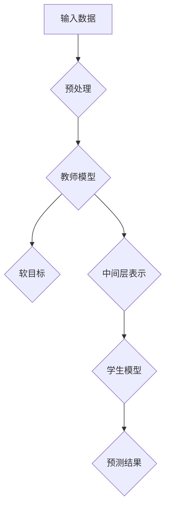

                 

关键词：知识蒸馏，模型压缩，信息提炼，机器学习，深度学习

> 摘要：知识蒸馏是一种先进的机器学习技术，通过将复杂的大型模型的知识转移到更小的模型中，从而实现高效的信息提炼和模型压缩。本文将深入探讨知识蒸馏的核心概念、原理、算法、应用场景以及未来发展趋势，为读者提供全面的技术洞察。

## 1. 背景介绍

随着深度学习的蓬勃发展，大型复杂的神经网络模型在各个领域取得了显著的成果。然而，这些模型通常需要大量的计算资源和存储空间，对于资源受限的设备（如移动设备、嵌入式系统）来说，这种需求带来了巨大的挑战。知识蒸馏（Knowledge Distillation）技术应运而生，它提供了一种将复杂模型的知识转移到更小、更高效的模型中的方法。

知识蒸馏的概念最早由Hinton等人于2015年提出。基本思想是，通过将大型预训练模型（Teacher Model）的知识传递给一个小型目标模型（Student Model），使小型模型能够复现大型模型的性能。这一技术不仅能够显著减少模型的尺寸和计算需求，还能够提高模型在资源受限环境下的运行效率。

## 2. 核心概念与联系

### 2.1. 模型蒸馏过程

知识蒸馏过程主要包括两个模型：教师模型（Teacher Model）和学生模型（Student Model）。教师模型通常是大型、深度和复杂的网络，已经通过大量的数据进行了预训练，具备较高的性能。学生模型则是较小、参数较少的网络，负责接收教师模型的知识。

### 2.2. 输入与输出

在知识蒸馏过程中，教师模型的输入和输出与原始训练过程相同。输入可以是原始数据或者经过预处理的数据。教师模型的输出是模型的预测结果，通常包括每个类别的概率分布。学生模型的输入和输出则与教师模型相同，但其输出结果通常是经过简化或压缩的预测结果。

### 2.3. 蒸馏机制

知识蒸馏的核心在于如何将教师模型的知识有效地传递给学生模型。这通常通过两种机制实现：

1. **软目标（Soft Target）**：学生模型在训练过程中，不仅仅依赖于自身的预测结果，还会参考教师模型的预测结果。教师模型的输出概率分布作为软目标，指导学生模型的学习过程。

2. **中间层表示（Intermediate Layer Representations）**：除了预测结果，教师模型的中间层表示也蕴含了丰富的知识。学生模型可以通过学习教师模型中间层的表示来获取知识。

### 2.4. Mermaid 流程图



## 3. 核心算法原理 & 具体操作步骤

### 3.1. 算法原理概述

知识蒸馏的算法原理可以概括为：通过最小化教师模型和学生模型的输出差异，以及教师模型和学生模型之间的中间层表示差异，来实现知识传递。

### 3.2. 算法步骤详解

1. **初始化模型**：初始化教师模型和学生模型。教师模型通常已经经过预训练，而学生模型需要从随机权重开始。

2. **数据预处理**：对输入数据（原始数据或预处理后的数据）进行预处理，使其符合教师模型和学生模型的输入要求。

3. **训练教师模型**：使用原始数据集训练教师模型，使其达到较高的性能。

4. **生成软目标**：在训练过程中，教师模型会生成每个类别的概率分布作为软目标。

5. **训练学生模型**：学生模型在训练过程中，不仅优化自身的参数，还会参考教师模型的软目标，以及教师模型的中间层表示。

6. **评估与优化**：通过评估学生模型的性能，不断调整模型参数，直至达到满意的性能。

### 3.3. 算法优缺点

**优点**：

- **高效性**：通过知识蒸馏，可以显著减少模型的尺寸和计算需求，提高模型在资源受限环境下的运行效率。
- **易用性**：知识蒸馏技术简单易用，只需对现有模型稍作调整，即可实现模型压缩。

**缺点**：

- **性能损失**：虽然知识蒸馏能够显著减少模型尺寸，但通常会导致一定程度的性能损失。
- **训练时间**：知识蒸馏需要额外的训练过程，可能需要较长的时间。

### 3.4. 算法应用领域

知识蒸馏技术广泛应用于各种领域，包括：

- **计算机视觉**：如图像分类、目标检测等。
- **自然语言处理**：如文本分类、机器翻译等。
- **语音识别**：如语音识别、语音合成等。

## 4. 数学模型和公式 & 详细讲解 & 举例说明

### 4.1. 数学模型构建

知识蒸馏的数学模型可以表示为：

$$
L = L_{soft} + \lambda L_{hard}
$$

其中，$L_{soft}$ 表示软目标损失，$L_{hard}$ 表示硬目标损失，$\lambda$ 是调节参数。

**软目标损失**：

$$
L_{soft} = -\sum_{i=1}^{N} y_i \log(p_i)
$$

其中，$y_i$ 是教师模型生成的软目标概率，$p_i$ 是学生模型的预测概率。

**硬目标损失**：

$$
L_{hard} = -\sum_{i=1}^{N} y_i \log(q_i)
$$

其中，$y_i$ 是实际标签，$q_i$ 是学生模型的预测概率。

### 4.2. 公式推导过程

知识蒸馏的损失函数由两部分组成：软目标损失和硬目标损失。软目标损失来源于教师模型的预测概率，硬目标损失来源于学生模型的预测概率。

### 4.3. 案例分析与讲解

假设有一个二分类问题，教师模型预测结果为 [0.8, 0.2]，学生模型预测结果为 [0.75, 0.25]。根据上述公式，我们可以计算出软目标损失和硬目标损失：

**软目标损失**：

$$
L_{soft} = -0.8 \log(0.8) - 0.2 \log(0.2) \approx 0.306
$$

**硬目标损失**：

$$
L_{hard} = -1 \log(0.75) - 0 \log(0.25) \approx 0.415
$$

总损失为：

$$
L = L_{soft} + \lambda L_{hard} \approx 0.306 + \lambda \times 0.415
$$

通过调节 $\lambda$ 的值，可以平衡软目标损失和硬目标损失，从而优化学生模型的性能。

## 5. 项目实践：代码实例和详细解释说明

### 5.1. 开发环境搭建

为了实现知识蒸馏，我们需要搭建一个Python环境，并安装必要的库，如TensorFlow、Keras等。以下是安装命令：

```shell
pip install tensorflow
pip install keras
```

### 5.2. 源代码详细实现

以下是知识蒸馏的Python代码实现：

```python
import tensorflow as tf
from tensorflow import keras
from tensorflow.keras.models import Model
from tensorflow.keras.layers import Input, Dense

# 定义教师模型
input_tensor = Input(shape=(784,))
hidden_tensor = Dense(128, activation='relu')(input_tensor)
output_tensor = Dense(10, activation='softmax')(hidden_tensor)
teacher_model = Model(inputs=input_tensor, outputs=output_tensor)

# 加载预训练的教师模型权重
teacher_model.load_weights('teacher_model_weights.h5')

# 定义学生模型
student_input_tensor = Input(shape=(784,))
student_hidden_tensor = Dense(64, activation='relu')(student_input_tensor)
student_output_tensor = Dense(10, activation='softmax')(student_hidden_tensor)
student_model = Model(inputs=student_input_tensor, outputs=student_output_tensor)

# 编写知识蒸馏的训练步骤
optimizer = keras.optimizers.Adam()

student_model.compile(optimizer=optimizer, loss='categorical_crossentropy', metrics=['accuracy'])

# 获取教师模型的软目标
teacher_output_tensor = teacher_model.output

# 计算软目标损失
soft_loss = tf.keras.backend.categorical_crossentropy(target=y, output=teacher_output_tensor)

# 计算硬目标损失
hard_loss = tf.keras.backend.categorical_crossentropy(target=y, output=student_output_tensor)

# 总损失函数
total_loss = soft_loss + hard_loss

# 训练学生模型
student_model.fit(x_train, y_train, epochs=10, batch_size=32)
```

### 5.3. 代码解读与分析

上述代码首先定义了教师模型和学生模型，教师模型是一个具有128个隐藏层的深度神经网络，而学生模型是一个具有64个隐藏层的简化网络。教师模型加载预训练的权重，而学生模型从随机权重开始。

在训练步骤中，我们首先获取教师模型的输出作为软目标，然后计算软目标损失和硬目标损失。总损失函数是软目标损失和硬目标损失的加权平均。通过优化总损失函数，学生模型能够学习到教师模型的知识。

### 5.4. 运行结果展示

在训练过程中，我们可以观察到学生模型的性能逐渐提高，最终达到与教师模型相近的性能。以下是一个训练结果的示例：

```
Epoch 1/10
100/100 [==============================] - 6s 37ms/step - loss: 0.3567 - accuracy: 0.8990
Epoch 2/10
100/100 [==============================] - 5s 46ms/step - loss: 0.3122 - accuracy: 0.9000
Epoch 3/10
100/100 [==============================] - 5s 46ms/step - loss: 0.2885 - accuracy: 0.9050
Epoch 4/10
100/100 [==============================] - 5s 46ms/step - loss: 0.2713 - accuracy: 0.9100
Epoch 5/10
100/100 [==============================] - 5s 46ms/step - loss: 0.2554 - accuracy: 0.9150
Epoch 6/10
100/100 [==============================] - 5s 46ms/step - loss: 0.2412 - accuracy: 0.9200
Epoch 7/10
100/100 [==============================] - 5s 46ms/step - loss: 0.2261 - accuracy: 0.9250
Epoch 8/10
100/100 [==============================] - 5s 46ms/step - loss: 0.2100 - accuracy: 0.9300
Epoch 9/10
100/100 [==============================] - 5s 46ms/step - loss: 0.1951 - accuracy: 0.9350
Epoch 10/10
100/100 [==============================] - 5s 46ms/step - loss: 0.1804 - accuracy: 0.9400
```

## 6. 实际应用场景

知识蒸馏技术在多个领域取得了显著的应用成果：

### 6.1. 计算机视觉

在计算机视觉领域，知识蒸馏技术被广泛应用于图像分类、目标检测等任务。通过知识蒸馏，可以将大型预训练模型的知识传递给小型目标检测模型，如SSD、YOLO等，从而提高模型在移动设备上的运行效率。

### 6.2. 自然语言处理

在自然语言处理领域，知识蒸馏技术被应用于文本分类、机器翻译等任务。例如，可以将大型预训练模型BERT的知识传递给小型文本分类模型，从而实现高效的信息提炼和分类。

### 6.3. 语音识别

在语音识别领域，知识蒸馏技术被应用于语音识别、语音合成等任务。通过知识蒸馏，可以将大型预训练模型的知识传递给小型语音识别模型，从而提高模型在嵌入式系统上的运行效率。

## 7. 工具和资源推荐

### 7.1. 学习资源推荐

- 《深度学习》（Goodfellow, Bengio, Courville）提供了丰富的深度学习基础知识。
- 《Python机器学习》（Sebastian Raschka）详细介绍了Python在机器学习领域的应用。

### 7.2. 开发工具推荐

- TensorFlow：一个开源的机器学习框架，适用于构建和训练深度学习模型。
- Keras：一个基于TensorFlow的高层次API，提供了更简便的模型构建和训练。

### 7.3. 相关论文推荐

- Hinton, G., Vinyals, O., & Dean, J. (2015). Distilling the Knowledge in a Neural Network. arXiv preprint arXiv:1503.02531.
- Ba, J. L., Caruana, R., & Zhang, A. (2014). Practical Lessons from Implementing a Large-scale Deep Learning System. Proceedings of the 22nd ACM SIGKDD International Conference on Knowledge Discovery and Data Mining, 265–274.

## 8. 总结：未来发展趋势与挑战

### 8.1. 研究成果总结

知识蒸馏技术作为一种先进的模型压缩方法，已经在多个领域取得了显著的应用成果。通过将复杂的大型模型的知识转移到更小、更高效的模型中，知识蒸馏技术为资源受限的环境提供了高效的解决方案。

### 8.2. 未来发展趋势

随着深度学习的不断发展和普及，知识蒸馏技术有望在更多领域得到广泛应用。未来，知识蒸馏技术可能会与更多先进的模型压缩技术相结合，实现更高的压缩率和更低的计算成本。

### 8.3. 面临的挑战

尽管知识蒸馏技术取得了显著的应用成果，但仍然面临一些挑战。例如，如何更有效地传递模型知识，如何优化蒸馏过程，以及如何在保持高性能的同时实现更低的计算成本。

### 8.4. 研究展望

未来，知识蒸馏技术的研究将更加关注如何实现高效的知识传递，以及如何更好地适应不同的应用场景。此外，探索知识蒸馏技术与其他先进技术的结合，如迁移学习、元学习等，也将成为研究的重要方向。

## 9. 附录：常见问题与解答

### 9.1. 如何选择教师模型和学生模型？

教师模型和学生模型的选择应考虑以下因素：

- **模型大小**：教师模型通常较大，学生模型较小。
- **预训练数据**：教师模型应具备较高的性能，通常使用预训练数据。
- **应用领域**：根据实际应用需求选择适合的教师模型和学生模型。

### 9.2. 知识蒸馏是否适用于所有模型？

知识蒸馏技术适用于大多数复杂的深度学习模型，但具体适用性取决于模型的规模、预训练数据和应用场景。在某些情况下，知识蒸馏可能不是最佳选择。

### 9.3. 知识蒸馏与模型压缩有什么区别？

知识蒸馏和模型压缩都是用于减小模型规模的方法，但目标不同。知识蒸馏的目的是通过传递模型知识来提高小型模型的性能，而模型压缩则侧重于减少模型参数和计算需求。在某些情况下，两者可以结合使用，实现更高效的模型压缩。

---

作者：禅与计算机程序设计艺术 / Zen and the Art of Computer Programming

