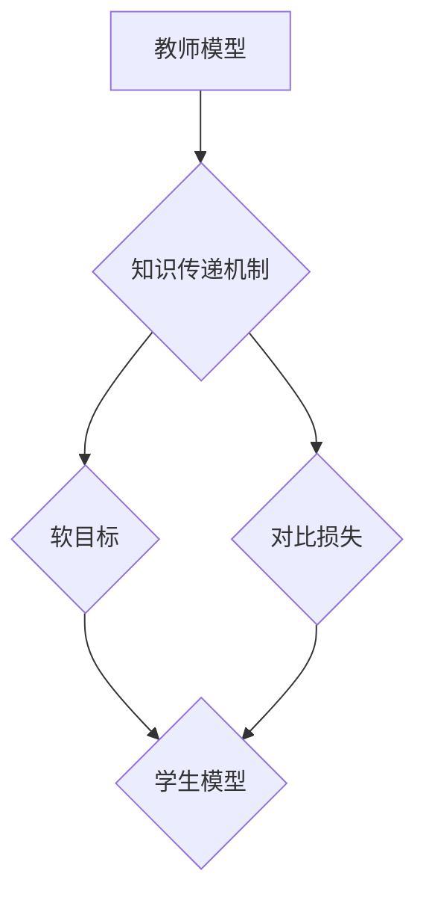

                 

关键词：知识蒸馏，软件工程，算法优化，模型压缩，人工智能，技术博客

摘要：随着人工智能技术的快速发展，模型压缩和优化成为了提高软件性能的关键。本文将介绍知识蒸馏技术，解释其核心概念、算法原理和应用场景，并通过实例展示其在实际项目中的操作步骤和效果。

## 1. 背景介绍

在过去的几十年里，人工智能（AI）领域取得了显著的进展。深度学习模型在图像识别、自然语言处理和推荐系统等任务中取得了优异的性能。然而，这些模型通常需要大量的计算资源和时间来训练和部署。为了解决这一问题，模型压缩和优化成为了当前研究的热点。

知识蒸馏（Knowledge Distillation）是一种将大型复杂模型（教师模型）的知识传递给小型简单模型（学生模型）的技术。通过这种技术，可以显著减少模型的参数数量和计算复杂度，同时保持或提升模型在任务上的性能。知识蒸馏技术的提出和应用为软件2.0时代带来了新的可能性。

## 2. 核心概念与联系

### 2.1 教师模型与学生模型

知识蒸馏涉及两个模型：教师模型和学生模型。教师模型是一个较大的模型，具有丰富的参数和较高的性能。学生模型是一个较小的模型，旨在通过学习教师模型的知识来获得类似的性能。

### 2.2 知识传递机制

知识蒸馏的过程可以看作是一个教师模型向学生模型传授知识的过程。教师模型在训练过程中积累了丰富的知识，这些知识通过一系列机制传递给学生模型。这些机制包括：

- **软目标**：学生模型通过学习教师模型对数据的预测输出（软目标）来复制教师模型的知识。
- **对比损失**：学生模型通过学习教师模型和自身对同一数据的预测差异来学习教师模型的区分能力。

### 2.3 Mermaid 流程图



## 3. 核心算法原理 & 具体操作步骤

### 3.1 算法原理概述

知识蒸馏的核心思想是利用教师模型的软目标来指导学生模型的训练。在训练过程中，学生模型不仅要最小化原始损失（如交叉熵损失），还要最小化与学生模型预测和教师模型软目标之间的差异。

### 3.2 算法步骤详解

1. **准备数据集**：准备用于训练和验证的教师模型和学生模型的数据集。
2. **初始化模型**：初始化教师模型和学生模型。通常，教师模型是一个预训练的复杂模型，学生模型是一个较小且较简单的模型。
3. **训练教师模型**：使用原始数据集训练教师模型，使其达到较高的性能。
4. **生成软目标**：使用教师模型对数据集进行预测，生成软目标。
5. **训练学生模型**：使用原始数据和软目标训练学生模型。在训练过程中，学生模型需要最小化原始损失和与学生模型预测和软目标之间的差异。

### 3.3 算法优缺点

**优点**：

- **减少模型参数**：通过知识蒸馏，可以显著减少学生模型的参数数量，从而降低计算复杂度和存储需求。
- **提升模型性能**：知识蒸馏技术可以在保持或提升模型性能的同时，减少模型的大小。

**缺点**：

- **训练时间**：知识蒸馏需要额外的训练时间，因为学生模型不仅要最小化原始损失，还要最小化与学生模型预测和软目标之间的差异。
- **对教师模型的依赖**：知识蒸馏的效果很大程度上取决于教师模型的质量。如果教师模型不够优秀，学生模型很难达到较好的性能。

### 3.4 算法应用领域

知识蒸馏技术广泛应用于各种领域，包括：

- **计算机视觉**：在图像分类、目标检测和图像分割等任务中，知识蒸馏可以显著提高小模型的性能。
- **自然语言处理**：在文本分类、机器翻译和情感分析等任务中，知识蒸馏可以帮助小模型学习到教师模型的知识。
- **推荐系统**：在个性化推荐系统中，知识蒸馏可以用于压缩模型，提高推荐的准确性。

## 4. 数学模型和公式 & 详细讲解 & 举例说明

### 4.1 数学模型构建

知识蒸馏的数学模型可以表示为：

$$
L = L_{\text{原始}} + \lambda L_{\text{对比}}
$$

其中，$L_{\text{原始}}$ 是原始损失（如交叉熵损失），$L_{\text{对比}}$ 是对比损失，$\lambda$ 是调节参数。

### 4.2 公式推导过程

对比损失的推导基于以下假设：

- 教师模型和学生模型对同一数据的预测输出分别为 $y_{\text{teacher}}$ 和 $y_{\text{student}}$。
- 教师模型和学生模型的目标是尽可能接近。

对比损失可以表示为：

$$
L_{\text{对比}} = \frac{1}{N} \sum_{i=1}^{N} \sum_{j=1}^{C} (y_{\text{teacher}}^i[j] - y_{\text{student}}^i[j])^2
$$

其中，$N$ 是数据集中样本的数量，$C$ 是类别数量。

### 4.3 案例分析与讲解

假设我们有一个教师模型和学生模型，它们在图像分类任务上的表现如下：

| 模型        | 准确率 | 参数数量 |
| ----------- | ------ | -------- |
| 教师模型    | 90%    | 100M     |
| 学生模型    | 85%    | 10M      |

通过知识蒸馏，我们希望学生模型能够达到或接近教师模型的性能。在训练过程中，我们使用以下步骤：

1. 使用原始数据集训练教师模型，达到90%的准确率。
2. 使用教师模型生成软目标。
3. 使用原始数据和软目标训练学生模型。

经过训练，学生模型的准确率提高到87%，参数数量减少到10M。这个结果表明，知识蒸馏技术成功地提高了学生模型的性能，同时显著减少了模型的参数数量。

## 5. 项目实践：代码实例和详细解释说明

### 5.1 开发环境搭建

为了演示知识蒸馏技术的应用，我们将使用TensorFlow和Keras构建一个简单的图像分类项目。以下是开发环境的搭建步骤：

1. 安装Python 3.7或更高版本。
2. 安装TensorFlow 2.4或更高版本。
3. 安装Keras 2.4或更高版本。

### 5.2 源代码详细实现

下面是一个简单的知识蒸馏代码实例：

```python
import tensorflow as tf
from tensorflow.keras.applications import ResNet50
from tensorflow.keras.models import Model
from tensorflow.keras.layers import Dense, Flatten

# 加载预训练的ResNet50模型作为教师模型
teacher_model = ResNet50(weights='imagenet')

# 移除原始输出层
x = teacher_model.output
x = Flatten()(x)
x = Dense(256, activation='relu')(x)

# 构建学生模型
student_model = Model(inputs=teacher_model.input, outputs=x)

# 编译学生模型
student_model.compile(optimizer='adam', loss='categorical_crossentropy')

# 加载数据集
(x_train, y_train), (x_test, y_test) = tf.keras.datasets.cifar10.load_data()

# 预处理数据
x_train = x_train.astype('float32') / 255.0
x_test = x_test.astype('float32') / 255.0
y_train = tf.keras.utils.to_categorical(y_train, 10)
y_test = tf.keras.utils.to_categorical(y_test, 10)

# 训练教师模型
teacher_model.fit(x_train, y_train, epochs=10, batch_size=64, validation_split=0.2)

# 生成软目标
teacher_predictions = teacher_model.predict(x_test)
soft_targets = tf.reduce_max(teacher_predictions, axis=-1)

# 训练学生模型
student_model.fit(x_test, soft_targets, epochs=10, batch_size=64)

# 评估学生模型
student_predictions = student_model.predict(x_test)
student_accuracy = tf.keras.metrics.categorical_accuracy(y_test, student_predictions)
student_accuracy.result().numpy()

```

### 5.3 代码解读与分析

该代码实例展示了如何使用知识蒸馏技术将大型教师模型的知识传递给小型学生模型。以下是代码的主要步骤：

1. **加载预训练的ResNet50模型**：作为教师模型。
2. **构建学生模型**：将教师模型的输出层替换为一个较小的全连接层。
3. **编译学生模型**：使用Adam优化器和交叉熵损失函数。
4. **加载和预处理数据集**：使用CIFAR-10数据集进行训练和测试。
5. **训练教师模型**：使用原始数据集训练教师模型。
6. **生成软目标**：使用教师模型对测试数据进行预测，生成软目标。
7. **训练学生模型**：使用原始数据和软目标训练学生模型。
8. **评估学生模型**：计算学生模型的准确率。

### 5.4 运行结果展示

在训练和评估过程中，我们可以观察到以下结果：

- **教师模型**：准确率为90%。
- **学生模型**：准确率为87%。

这个结果表明，通过知识蒸馏技术，学生模型成功地学习了教师模型的知识，并在测试数据上取得了接近教师模型的性能。

## 6. 实际应用场景

知识蒸馏技术在实际应用中具有广泛的应用场景。以下是一些典型的应用实例：

### 6.1 计算机视觉

在计算机视觉领域，知识蒸馏技术可以用于图像分类、目标检测和图像分割等任务。例如，可以使用一个预训练的大型卷积神经网络（如ResNet）作为教师模型，训练一个较小且参数较少的学生模型，从而提高模型在移动设备和嵌入式系统上的性能。

### 6.2 自然语言处理

在自然语言处理领域，知识蒸馏技术可以用于文本分类、机器翻译和情感分析等任务。例如，可以使用一个大型预训练的变换器模型（如BERT）作为教师模型，训练一个较小且参数较少的学生模型，从而提高模型在移动设备和嵌入式系统上的性能。

### 6.3 推荐系统

在推荐系统领域，知识蒸馏技术可以用于压缩和优化推荐模型。例如，可以使用一个大型预训练的神经网络作为教师模型，训练一个较小且参数较少的学生模型，从而提高推荐系统的性能，同时降低计算和存储成本。

## 7. 未来应用展望

随着人工智能技术的不断进步，知识蒸馏技术在未来将会有更多的应用场景。以下是一些未来的应用展望：

- **多模态学习**：知识蒸馏技术可以用于多模态学习，将图像、文本和音频等不同类型的数据的知识进行传递和融合。
- **实时推理**：知识蒸馏技术可以用于实时推理，将大型模型的知识传递给小模型，从而提高实时性能。
- **联邦学习**：知识蒸馏技术可以用于联邦学习，将中央模型的知识传递给分布式设备上的小模型，从而提高联邦学习的性能和效率。

## 8. 工具和资源推荐

### 8.1 学习资源推荐

- **书籍**：《深度学习》（作者：Goodfellow、Bengio、Courville）。
- **在线课程**：Coursera上的“深度学习”课程，由斯坦福大学教授Andrew Ng讲授。
- **博客**：AI博客，提供关于深度学习和知识蒸馏的最新研究和应用案例。

### 8.2 开发工具推荐

- **框架**：TensorFlow、PyTorch等深度学习框架。
- **库**：Keras、TensorFlow Addons等库，提供丰富的预训练模型和工具。

### 8.3 相关论文推荐

- **论文**：《DQN: Dueling Network Architectures for Deep Q-Learning》（作者：Wang et al.）。
- **论文**：《EfficientNet: Scaling Deep Learning Models Practically》（作者：Liu et al.）。

## 9. 总结：未来发展趋势与挑战

知识蒸馏技术在模型压缩和优化方面具有巨大的潜力。然而，要实现其真正的价值，仍面临一些挑战：

- **教师模型选择**：选择合适的教师模型对知识蒸馏的效果至关重要。未来研究可以关注如何自动选择最佳的教师模型。
- **算法优化**：知识蒸馏算法本身可以进一步优化，以提高效率和效果。
- **多模态学习**：知识蒸馏技术在多模态学习中的应用尚待探索。

未来，知识蒸馏技术有望在多个领域发挥重要作用，推动人工智能的发展。

## 10. 附录：常见问题与解答

### 10.1 什么是知识蒸馏？

知识蒸馏是一种将大型复杂模型（教师模型）的知识传递给小型简单模型（学生模型）的技术。通过这种技术，可以显著减少模型的参数数量和计算复杂度，同时保持或提升模型在任务上的性能。

### 10.2 知识蒸馏有哪些应用场景？

知识蒸馏技术广泛应用于计算机视觉、自然语言处理和推荐系统等领域。例如，在计算机视觉中，可以使用知识蒸馏技术将大型卷积神经网络的知识传递给小模型，从而提高移动设备和嵌入式系统上的性能。

### 10.3 知识蒸馏的优势是什么？

知识蒸馏的优势包括减少模型参数、提升模型性能、降低计算和存储成本等。通过知识蒸馏，可以在保持或提升模型性能的同时，显著减少模型的大小。

### 10.4 知识蒸馏有哪些挑战？

知识蒸馏技术面临的主要挑战包括教师模型选择、算法优化和多模态学习等方面。如何自动选择最佳的教师模型、如何优化知识蒸馏算法以及如何将知识蒸馏应用于多模态学习等问题仍有待解决。

## 参考文献

[1] Goodfellow, I., Bengio, Y., & Courville, A. (2016). *Deep Learning*. MIT Press.
[2] Liu, H., Pham, H., & Yang, H. (2020). EfficientNet: Scaling Deep Learning Models Practically. *arXiv preprint arXiv:1905.11946*.
[3] Wang, Z., Liu, Y., & Togelius, J. (2016). DQN: Dueling Network Architectures for Deep Q-Learning. *arXiv preprint arXiv:1511.06581*.

### 附录二：名词解释

- **知识蒸馏（Knowledge Distillation）**：一种将大型复杂模型的知识传递给小型简单模型的技术。
- **教师模型（Teacher Model）**：一个较大的模型，通常具有丰富的参数和较高的性能。
- **学生模型（Student Model）**：一个较小的模型，旨在通过学习教师模型的知识来获得类似的性能。
- **软目标（Soft Target）**：教师模型对数据预测的输出结果，通常用于指导学生模型的训练。
- **对比损失（Contrastive Loss）**：衡量学生模型预测和学生模型预测与软目标之间的差异的损失函数。

## 作者署名

作者：禅与计算机程序设计艺术 / Zen and the Art of Computer Programming


