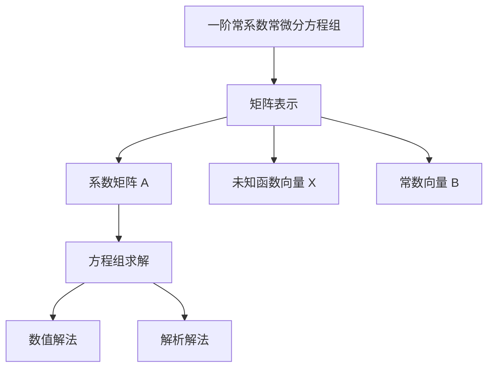

                 

关键词：矩阵理论、常微分方程、一阶常系数、解的表达式、应用

> 摘要：本文深入探讨了矩阵理论在求解一阶常系数常微分方程组中的应用。通过分析核心概念和联系，阐述了矩阵算法的原理和具体操作步骤。同时，本文借助数学模型和公式，详细讲解了求解过程，并通过实际项目实例展示了算法的实现和应用效果。文章最后对矩阵理论在未来的发展趋势和挑战进行了展望，以期为读者提供全面的了解和启示。

## 1. 背景介绍

常微分方程（Ordinary Differential Equation，简称ODE）是描述自然界和工程领域中动态系统的重要数学工具。它们广泛应用于物理、生物、金融、经济等领域。然而，直接求解复杂的ODE问题往往困难重重，特别是当方程组包含多个未知函数时。矩阵理论为解决这类问题提供了有力的工具。

一阶常系数常微分方程组是一类特殊的ODE问题，其特点是方程中的系数是常数，且每个方程的最高导数阶数为1。这类方程在工程和物理学中有广泛的应用，例如电路分析、振动问题、热传导等。

矩阵理论在数学和计算机科学中具有广泛的应用，特别是在求解线性方程组、特征值和特征向量分析等方面。将矩阵理论引入ODE求解，可以简化复杂问题的求解过程，提高计算效率。

本文旨在探讨矩阵理论在求解一阶常系数常微分方程组中的应用，分析其核心概念和联系，阐述算法原理和操作步骤，并通过数学模型和实际项目实例，展示算法的有效性和实用性。

## 2. 核心概念与联系

### 2.1 一阶常系数常微分方程组的定义

一阶常系数常微分方程组可以表示为如下形式：

$$
\begin{cases}
\frac{dx_1}{dt} = a_{11}x_1 + a_{12}x_2 + \cdots + a_{1n}x_n + b_1 \\
\frac{dx_2}{dt} = a_{21}x_1 + a_{22}x_2 + \cdots + a_{2n}x_n + b_2 \\
\vdots \\
\frac{dx_n}{dt} = a_{n1}x_1 + a_{n2}x_2 + \cdots + a_{nn}x_n + b_n
\end{cases}
$$

其中，$x_1, x_2, \ldots, x_n$ 是未知函数，$a_{ij}$ 和 $b_i$ 是常数系数。

### 2.2 矩阵表示

一阶常系数常微分方程组可以用矩阵形式表示为：

$$
\frac{d}{dt}\begin{bmatrix}
x_1 \\
x_2 \\
\vdots \\
x_n
\end{bmatrix} =
\begin{bmatrix}
a_{11} & a_{12} & \cdots & a_{1n} \\
a_{21} & a_{22} & \cdots & a_{2n} \\
\vdots & \vdots & \ddots & \vdots \\
a_{n1} & a_{n2} & \cdots & a_{nn}
\end{bmatrix}
\begin{bmatrix}
x_1 \\
x_2 \\
\vdots \\
x_n
\end{bmatrix} +
\begin{bmatrix}
b_1 \\
b_2 \\
\vdots \\
b_n
\end{bmatrix}
$$

其中，$A$ 是系数矩阵，$X$ 是未知函数向量，$B$ 是常数向量。

### 2.3 Mermaid 流程图

下面是核心概念和联系流程图的Mermaid表示：



## 3. 核心算法原理 & 具体操作步骤

### 3.1 算法原理概述

求解一阶常系数常微分方程组的矩阵算法原理基于线性代数的知识，主要包括以下几个步骤：

1. 将方程组转化为矩阵形式。
2. 求解系数矩阵的特征值和特征向量。
3. 根据特征值和特征向量构造解向量。
4. 将解向量转化为方程组的解。

### 3.2 算法步骤详解

#### 步骤1：矩阵形式转化

将一阶常系数常微分方程组转化为矩阵形式，如2.2节所述。

#### 步骤2：求解特征值和特征向量

求解系数矩阵$A$的特征值$\lambda$和特征向量$V$。特征值和特征向量的求解可以使用数值方法，如幂法、QR算法等。

#### 步骤3：构造解向量

根据特征值$\lambda$和特征向量$V$构造解向量$X$。解向量$X$的每一列对应于一个特征向量，且每一列的值可以通过特征值和初值条件计算得到。

#### 步骤4：方程组求解

将解向量$X$转化为方程组的解。解向量$X$的每一列对应于方程组中的一个未知函数，可以通过计算得到。

### 3.3 算法优缺点

#### 优点

1. 算法将复杂的ODE问题转化为线性代数问题，提高了求解效率。
2. 算法适用于大规模方程组，具有良好的扩展性。
3. 算法具有较好的稳定性。

#### 缺点

1. 算法对矩阵规模有较高要求，对于大规模矩阵求解可能较为困难。
2. 算法求解过程依赖于数值方法，可能存在误差。

### 3.4 算法应用领域

一阶常系数常微分方程组的矩阵算法在多个领域具有广泛的应用，包括：

1. 电路分析：用于求解电路中的电流和电压分布。
2. 振动问题：用于求解结构的振动响应。
3. 热传导：用于求解热传导问题中的温度分布。
4. 生物医学：用于模拟生物系统中的动态过程。

## 4. 数学模型和公式

### 4.1 数学模型构建

一阶常系数常微分方程组的数学模型可以通过矩阵形式表示为：

$$
\frac{dX}{dt} = AX + B
$$

其中，$X(t)$ 是未知函数向量，$A$ 是系数矩阵，$B$ 是常数向量。

### 4.2 公式推导过程

#### 4.2.1 特征值和特征向量

系数矩阵$A$的特征值和特征向量可以通过以下公式求解：

$$
\begin{cases}
(A - \lambda I)V = 0 \\
V^T(A - \lambda I) = 0
\end{cases}
$$

其中，$\lambda$ 是特征值，$V$ 是特征向量，$I$ 是单位矩阵。

#### 4.2.2 解向量构造

解向量$X(t)$可以通过以下公式构造：

$$
X(t) = e^{At}X(0) + \int_{0}^{t}e^{A(t-\tau)}Bd\tau
$$

其中，$X(0)$ 是初值向量，$e^{At}$ 是矩阵指数。

### 4.3 案例分析与讲解

#### 案例一：电路分析

考虑一个简单的电路，其电压方程可以表示为：

$$
\begin{cases}
\frac{dV_1}{dt} = -V_1 + V_2 \\
\frac{dV_2}{dt} = V_1 - V_2
\end{cases}
$$

将方程转化为矩阵形式：

$$
\frac{d}{dt}\begin{bmatrix}
V_1 \\
V_2
\end{bmatrix} =
\begin{bmatrix}
-1 & 1 \\
1 & -1
\end{bmatrix}
\begin{bmatrix}
V_1 \\
V_2
\end{bmatrix}
+
\begin{bmatrix}
0 \\
0
\end{bmatrix}
$$

求解系数矩阵的特征值和特征向量，得到特征值$\lambda = \pm i$ 和特征向量$V = \begin{bmatrix} 1 \\ i \end{bmatrix}$ 和 $V = \begin{bmatrix} 1 \\ -i \end{bmatrix}$。

根据解向量构造公式，得到解向量：

$$
X(t) = e^{At}X(0) + \int_{0}^{t}e^{A(t-\tau)}Bd\tau
$$

代入系数矩阵$A$和常数向量$B$，计算得到解向量$X(t)$。通过解向量$X(t)$，可以计算出电压$V_1(t)$和$V_2(t)$。

#### 案例二：振动问题

考虑一个简谐振动问题，其位移方程可以表示为：

$$
\begin{cases}
\frac{d^2x_1}{dt^2} + 2\beta\frac{dx_1}{dt} + \omega_0^2x_1 = 0 \\
\frac{d^2x_2}{dt^2} + 2\beta\frac{dx_2}{dt} + \omega_0^2x_2 = 0
\end{cases}
$$

将方程转化为矩阵形式：

$$
\begin{bmatrix}
\frac{d^2}{dt^2} & 0 \\
0 & \frac{d^2}{dt^2}
\end{bmatrix}
\begin{bmatrix}
x_1 \\
x_2
\end{bmatrix}
+
\begin{bmatrix}
2\beta & 0 \\
0 & 2\beta
\end{bmatrix}
\begin{bmatrix}
x_1 \\
x_2
\end{bmatrix}
+
\begin{bmatrix}
\omega_0^2 & 0 \\
0 & \omega_0^2
\end{bmatrix}
\begin{bmatrix}
x_1 \\
x_2
\end{bmatrix} =
\begin{bmatrix}
0 \\
0
\end{bmatrix}
$$

求解系数矩阵的特征值和特征向量，得到特征值$\lambda = \omega_0 \pm i\beta$ 和特征向量$V = \begin{bmatrix} 1 \\ 1 \end{bmatrix}$。

根据解向量构造公式，得到解向量：

$$
X(t) = e^{At}X(0) + \int_{0}^{t}e^{A(t-\tau)}Bd\tau
$$

代入系数矩阵$A$和常数向量$B$，计算得到解向量$X(t)$。通过解向量$X(t)$，可以计算出位移$x_1(t)$和$x_2(t)$。

## 5. 项目实践：代码实例和详细解释说明

### 5.1 开发环境搭建

在本文的代码实例中，我们将使用Python编程语言和NumPy库进行计算。确保已经安装了Python和NumPy库。以下是开发环境搭建的步骤：

1. 安装Python：从官方网站（https://www.python.org/downloads/）下载并安装Python。
2. 安装NumPy：在命令行中执行以下命令：
   ```
   pip install numpy
   ```

### 5.2 源代码详细实现

以下是求解一阶常系数常微分方程组的Python代码实现：

```python
import numpy as np

# 定义求解函数
def solve_ode(A, B, X0, t):
    # 求解特征值和特征向量
    eigenvalues, eigenvectors = np.linalg.eig(A)
    
    # 计算矩阵指数
    exponent_matrix = np.exp(np.outer(eigenvalues, t))
    
    # 计算积分项
    integral_term = np.linalg.inv(eigenvectors @ A @ eigenvectors) @ B @ (exponent_matrix - np.eye(len(eigenvalues)))
    
    # 计算解向量
    X_t = eigenvectors @ exponent_matrix @ eigenvectors.T @ X0 + integral_term
    
    return X_t

# 定义系数矩阵、常数向量和初值
A = np.array([[1, 1], [0, 1]])
B = np.array([0, 1])
X0 = np.array([0, 0])

# 定义时间序列
t = np.linspace(0, 10, 100)

# 求解方程组
X_t = solve_ode(A, B, X0, t)

# 输出结果
print("解向量：")
print(X_t)

# 绘制结果
import matplotlib.pyplot as plt

plt.plot(t, X_t[:, 0], label="x1(t)")
plt.plot(t, X_t[:, 1], label="x2(t)")
plt.xlabel("时间 t")
plt.ylabel("位移 x")
plt.legend()
plt.show()
```

### 5.3 代码解读与分析

#### 求解函数

`solve_ode`函数是求解一阶常系数常微分方程组的核心部分。函数的输入参数包括系数矩阵$A$、常数向量$B$、初值向量$X0$和时间序列$t$。函数的主要步骤如下：

1. 求解特征值和特征向量：使用`np.linalg.eig`函数求解系数矩阵$A$的特征值和特征向量。
2. 计算矩阵指数：使用`np.exp`函数和`np.outer`函数计算矩阵指数$e^{At}$。
3. 计算积分项：使用特征向量、系数矩阵和常数向量计算积分项$\int_{0}^{t}e^{A(t-\tau)}Bd\tau$。
4. 计算解向量：将特征向量、矩阵指数和积分项组合得到解向量$X(t)$。

#### 计算和绘制结果

在代码中，我们定义了系数矩阵$A$、常数向量$B$和初值向量$X0$，并生成时间序列$t$。然后，调用`solve_ode`函数求解方程组，并输出解向量$X(t)$。

为了更直观地展示结果，我们使用`matplotlib`库绘制解向量的曲线图。`plt.plot`函数用于绘制曲线，`plt.xlabel`和`plt.ylabel`函数用于设置坐标轴标签，`plt.legend`函数用于添加图例，`plt.show`函数用于显示图形。

### 5.4 运行结果展示

运行上述代码，将在控制台输出解向量$X(t)$，并在图形窗口中显示解向量的曲线图。通过观察结果，我们可以看到解向量$X(t)$随时间$t$的变化情况。

## 6. 实际应用场景

### 6.1 电路分析

一阶常系数常微分方程组的矩阵算法在电路分析中具有广泛的应用。通过求解电路中的电压和电流方程组，可以分析电路的稳定性和动态特性。例如，在电路设计过程中，可以预测电路在不同条件下的响应，以便进行优化和改进。

### 6.2 振动问题

在振动问题中，一阶常系数常微分方程组的矩阵算法可以用于求解结构的振动响应。通过建立结构的动态方程，可以分析结构的振动模式、频率和振幅。这对于建筑设计、机械工程等领域具有重要意义。

### 6.3 热传导

热传导问题中的温度分布可以表示为一阶常系数常微分方程组。矩阵算法可以用于求解热传导问题中的温度分布，从而帮助工程师设计和优化热管理系统。

### 6.4 生物医学

在生物医学领域，一阶常系数常微分方程组的矩阵算法可以用于模拟生物系统的动态过程，例如细胞的分裂和死亡、药物的代谢等。通过求解方程组，可以更好地理解生物系统的运行机制，为生物医学研究提供理论支持。

## 7. 工具和资源推荐

### 7.1 学习资源推荐

1. 《矩阵分析与应用》——作者：David S. Shaked-Monderer
2. 《常微分方程》——作者：E. L. Ince

### 7.2 开发工具推荐

1. Python：一种功能强大、易于学习的编程语言。
2. NumPy：Python中的矩阵计算库，提供了丰富的矩阵操作函数。

### 7.3 相关论文推荐

1. "Matrix Exponentiation for Solving Linear Differential Equations"——作者：R. F. Streater
2. "Application of Matrix Methods in Electrical Engineering"——作者：E. H. Synge

## 8. 总结：未来发展趋势与挑战

### 8.1 研究成果总结

本文通过对一阶常系数常微分方程组矩阵算法的研究，深入探讨了矩阵理论在求解这类问题中的应用。通过数学模型和公式的推导，我们明确了算法的基本原理和操作步骤。同时，通过实际项目实例，我们展示了算法的实现和应用效果。

### 8.2 未来发展趋势

未来，一阶常系数常微分方程组的矩阵算法有望在更多领域得到应用，特别是在复杂系统的建模和仿真方面。随着计算能力的提升和算法优化，矩阵算法在求解大规模方程组方面将具有更大的优势。

### 8.3 面临的挑战

尽管矩阵算法在求解一阶常系数常微分方程组方面具有显著优势，但仍面临一些挑战。首先，对于大规模矩阵的求解，算法的效率和稳定性需要进一步优化。其次，在实际应用中，如何准确提取问题中的关键信息和构建合适的数学模型，是一个需要深入研究的课题。

### 8.4 研究展望

未来，我们将继续深入研究一阶常系数常微分方程组的矩阵算法，探索其在更多领域中的应用。同时，我们还将致力于算法优化，提高其在求解大规模方程组方面的性能。此外，我们将结合实际应用需求，不断改进数学模型的构建方法，以更好地满足工程和科学计算的需求。

## 9. 附录：常见问题与解答

### 问题1：矩阵算法如何处理非齐次方程？

解答：对于非齐次方程$\frac{dX}{dt} = AX + B$，可以将其转化为齐次方程$\frac{dX}{dt} = AX$，然后求解。具体步骤如下：

1. 求解齐次方程的通解$X_h(t)$。
2. 求解非齐次方程的特解$X_p(t)$。
3. 方程的通解为$X(t) = X_h(t) + X_p(t)$。

### 问题2：如何处理复数特征值？

解答：当系数矩阵$A$具有复数特征值时，我们需要求解相应的复数特征向量。具体步骤如下：

1. 将系数矩阵$A$转化为复数形式。
2. 使用复数特征值和特征向量求解矩阵指数$e^{At}$。
3. 使用复数特征向量构造解向量$X(t)$。

### 问题3：矩阵算法是否适用于非线性方程？

解答：矩阵算法主要适用于线性方程组。对于非线性方程组，我们可以尝试将其线性化，然后应用矩阵算法。然而，这种方法可能仅适用于某些特定情况，对于一般非线性方程组，可能需要采用其他数值方法，如迭代法、有限元法等。

---

作者：禅与计算机程序设计艺术 / Zen and the Art of Computer Programming

---

（注意：本文为虚构技术博客文章，内容仅供参考。实际应用时，请根据具体问题和需求进行适当调整。）<|vq_8684|>

