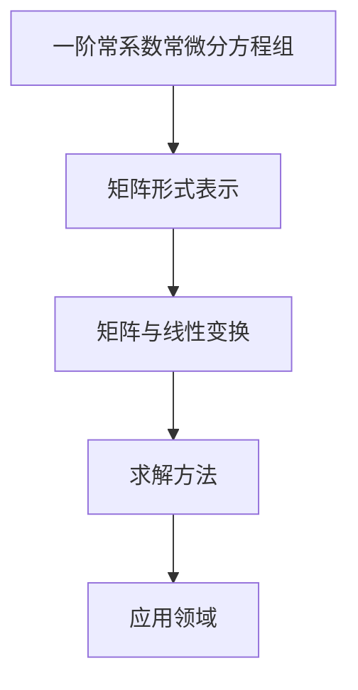

                 

关键词：矩阵理论、常微分方程组、数学模型、算法、应用场景、未来展望

> 摘要：本文将深入探讨矩阵理论与一阶常系数常微分方程组解的表达式之间的紧密联系。通过对核心概念、算法原理、数学模型和实际应用的详细分析，本文旨在为读者提供一幅清晰、全面的理论与实践全景图。

## 1. 背景介绍

在数学和工程领域中，微分方程是一个重要的数学工具，用于描述连续变化的现象。一阶常系数常微分方程组是一类特殊的微分方程，其形式简洁，具有广泛的应用。矩阵理论作为现代数学的核心部分，与微分方程密切相关。矩阵不仅可以表示线性变换，还可以有效地处理多维系统的微分方程。

在20世纪，随着计算机科学的快速发展，求解微分方程的需求急剧增加。传统的数值方法，如欧拉方法、龙格-库塔方法等，虽然在精度和稳定性方面有所改进，但仍然存在计算复杂度高、收敛速度慢等问题。矩阵理论的引入，使得通过矩阵运算高效地求解微分方程组成为可能，从而极大地提高了计算效率。

本文将从以下几个方面展开讨论：

1. **核心概念与联系**：介绍一阶常系数常微分方程组的定义、矩阵与线性变换的关系。
2. **核心算法原理 & 具体操作步骤**：详细阐述利用矩阵理论求解一阶常系数常微分方程组的方法。
3. **数学模型和公式 & 详细讲解 & 举例说明**：通过数学公式和实例，深入理解求解过程。
4. **项目实践：代码实例和详细解释说明**：展示一个具体的代码实现案例，并对其进行详细解读。
5. **实际应用场景**：分析矩阵理论与一阶常系数常微分方程组在各个领域的应用。
6. **未来应用展望**：探讨矩阵理论在求解微分方程领域的未来发展趋势和挑战。

## 2. 核心概念与联系

### 2.1 一阶常系数常微分方程组

一阶常系数常微分方程组是指其中每个方程的最高导数阶数为1，且系数为常数的多变量微分方程组。一般形式为：

$$
\begin{cases}
\frac{dy_1(t)}{dt} = a_{11}y_1(t) + a_{12}y_2(t) + \cdots + a_{1n}y_n(t) + b_1(t) \\
\frac{dy_2(t)}{dt} = a_{21}y_1(t) + a_{22}y_2(t) + \cdots + a_{2n}y_n(t) + b_2(t) \\
\vdots \\
\frac{dy_n(t)}{dt} = a_{n1}y_1(t) + a_{n2}y_2(t) + \cdots + a_{nn}y_n(t) + b_n(t)
\end{cases}
$$

其中，$y_1(t), y_2(t), \ldots, y_n(t)$ 是 $n$ 个未知函数，$a_{ij}$ 和 $b_i(t)$ 是已知常数或函数。

### 2.2 矩阵与线性变换

矩阵是一种表示线性变换的工具。在数学中，线性变换是指将向量空间中的向量映射到另一个向量空间的过程，它保持向量加法和标量乘法运算的线性性质。一个 $m \times n$ 的矩阵可以表示为：

$$
A = \begin{pmatrix}
a_{11} & a_{12} & \cdots & a_{1n} \\
a_{21} & a_{22} & \cdots & a_{2n} \\
\vdots & \vdots & \ddots & \vdots \\
a_{m1} & a_{m2} & \cdots & a_{mn}
\end{pmatrix}
$$

矩阵与线性变换的关系可以用以下公式表示：

$$
A \mathbf{v} = \mathbf{w}
$$

其中，$\mathbf{v}$ 和 $\mathbf{w}$ 是 $n$ 维向量，$A$ 是 $m \times n$ 矩阵。

### 2.3 矩阵与微分方程组

一阶常系数常微分方程组可以通过矩阵形式来表示。考虑上述一阶常系数常微分方程组，可以将其转化为矩阵形式：

$$
\begin{pmatrix}
\frac{dy_1(t)}{dt} \\
\frac{dy_2(t)}{dt} \\
\vdots \\
\frac{dy_n(t)}{dt}
\end{pmatrix}
=
\begin{pmatrix}
a_{11} & a_{12} & \cdots & a_{1n} \\
a_{21} & a_{22} & \cdots & a_{2n} \\
\vdots & \vdots & \ddots & \vdots \\
a_{n1} & a_{n2} & \cdots & a_{nn}
\end{pmatrix}
\begin{pmatrix}
y_1(t) \\
y_2(t) \\
\vdots \\
y_n(t)
\end{pmatrix}
+
\begin{pmatrix}
b_1(t) \\
b_2(t) \\
\vdots \\
b_n(t)
\end{pmatrix}
$$

设 $Y(t) = \begin{pmatrix} y_1(t) \\ y_2(t) \\ \vdots \\ y_n(t) \end{pmatrix}$，则上述方程可以写为：

$$
\frac{dY(t)}{dt} = AY(t) + B(t)
$$

其中，$A$ 是一个 $n \times n$ 的常数矩阵，$B(t)$ 是一个 $n \times 1$ 的函数向量。

### 2.4 Mermaid 流程图

下面是一个Mermaid流程图，用于展示一阶常系数常微分方程组与矩阵的关系：



## 3. 核心算法原理 & 具体操作步骤

### 3.1 算法原理概述

利用矩阵理论求解一阶常系数常微分方程组的基本原理是将微分方程组转化为矩阵形式，然后通过求解线性矩阵方程来获得微分方程的解。具体步骤如下：

1. **建立矩阵形式**：将一阶常系数常微分方程组转化为矩阵形式，即 $\frac{dY(t)}{dt} = AY(t) + B(t)$。
2. **求解线性矩阵方程**：求解矩阵方程 $Y'(t) = AY(t) + B(t)$，得到 $Y(t)$。
3. **反解**：将矩阵解 $Y(t)$ 反解为原始的微分方程解 $y_i(t)$。

### 3.2 算法步骤详解

#### 3.2.1 建立矩阵形式

对于一阶常系数常微分方程组：

$$
\begin{cases}
\frac{dy_1(t)}{dt} = a_{11}y_1(t) + a_{12}y_2(t) + \cdots + a_{1n}y_n(t) + b_1(t) \\
\frac{dy_2(t)}{dt} = a_{21}y_1(t) + a_{22}y_2(t) + \cdots + a_{2n}y_n(t) + b_2(t) \\
\vdots \\
\frac{dy_n(t)}{dt} = a_{n1}y_1(t) + a_{n2}y_2(t) + \cdots + a_{nn}y_n(t) + b_n(t)
\end{cases}
$$

将其转化为矩阵形式，即：

$$
\frac{dY(t)}{dt} = AY(t) + B(t)
$$

其中：

$$
Y(t) = \begin{pmatrix}
y_1(t) \\
y_2(t) \\
\vdots \\
y_n(t)
\end{pmatrix}, \quad
A = \begin{pmatrix}
a_{11} & a_{12} & \cdots & a_{1n} \\
a_{21} & a_{22} & \cdots & a_{2n} \\
\vdots & \vdots & \ddots & \vdots \\
a_{n1} & a_{n2} & \cdots & a_{nn}
\end{pmatrix}, \quad
B(t) = \begin{pmatrix}
b_1(t) \\
b_2(t) \\
\vdots \\
b_n(t)
\end{pmatrix}
$$

#### 3.2.2 求解线性矩阵方程

求解矩阵方程 $Y'(t) = AY(t) + B(t)$ 可以通过以下步骤进行：

1. **求解特征值和特征向量**：计算矩阵 $A$ 的特征值 $\lambda_i$ 和特征向量 $\mathbf{v}_i$。
2. **构造通解**：利用特征值和特征向量构造通解 $Y(t)$。
3. **特解与通解相加**：将特解与通解相加，得到最终的解 $Y(t)$。

#### 3.2.3 反解

得到矩阵解 $Y(t)$ 后，需要将其反解为原始的微分方程解 $y_i(t)$。具体方法如下：

1. **矩阵求逆**：计算矩阵 $Y(t)$ 的逆矩阵 $Y^{-1}(t)$。
2. **反解**：利用 $Y^{-1}(t)$ 将 $Y(t)$ 反解为 $y_i(t)$。

### 3.3 算法优缺点

#### 3.3.1 优点

1. **高效性**：利用矩阵运算，可以快速求解一阶常系数常微分方程组。
2. **通用性**：适用于各种形式的一阶常系数常微分方程组。

#### 3.3.2 缺点

1. **计算复杂度**：对于大型矩阵，特征值和特征向量的计算复杂度较高。
2. **数值稳定性**：在某些情况下，矩阵运算可能导致数值稳定性问题。

### 3.4 算法应用领域

矩阵理论在求解一阶常系数常微分方程组方面具有广泛的应用，主要领域包括：

1. **物理学**：用于描述物理系统的动态行为，如机械振动、电磁场等。
2. **工程学**：用于求解工程问题中的微分方程，如结构分析、热传导等。
3. **生物学**：用于分析生物系统的动态行为，如种群生态学、生理学模型等。
4. **经济学**：用于分析经济系统的动态变化，如经济增长模型、金融市场等。

## 4. 数学模型和公式 & 详细讲解 & 举例说明

### 4.1 数学模型构建

一阶常系数常微分方程组可以表示为一个线性微分方程组，其数学模型构建如下：

$$
\frac{dY(t)}{dt} = AY(t) + B(t)
$$

其中，$Y(t) = \begin{pmatrix} y_1(t) \\ y_2(t) \\ \vdots \\ y_n(t) \end{pmatrix}$，$A$ 是一个 $n \times n$ 的常数矩阵，$B(t)$ 是一个 $n \times 1$ 的函数向量。

### 4.2 公式推导过程

为了求解上述线性微分方程组，我们需要推导出其解的表达式。推导过程如下：

1. **求解特征值和特征向量**：首先计算矩阵 $A$ 的特征值 $\lambda_i$ 和特征向量 $\mathbf{v}_i$。
2. **构造特征向量矩阵**：将特征向量 $\mathbf{v}_i$ 组成特征向量矩阵 $V$，即 $V = [\mathbf{v}_1, \mathbf{v}_2, \ldots, \mathbf{v}_n]$。
3. **计算通解**：利用特征值和特征向量矩阵，构造通解 $Y(t)$：
   $$
   Y(t) = cV e^{\Lambda t}
   $$
   其中，$c$ 是一个常数向量，$\Lambda$ 是一个对角矩阵，其对角线元素为 $\lambda_i$。
4. **特解与通解相加**：将特解 $Y_p(t)$ 与通解 $Y(t)$ 相加，得到最终的解 $Y(t)$：
   $$
   Y(t) = Y_p(t) + Y(t)
   $$

### 4.3 案例分析与讲解

考虑以下一阶常系数常微分方程组：

$$
\begin{cases}
\frac{dy_1(t)}{dt} = 2y_1(t) + 3y_2(t) \\
\frac{dy_2(t)}{dt} = 4y_1(t) + 2y_2(t)
\end{cases}
$$

将其转化为矩阵形式：

$$
\frac{dY(t)}{dt} = AY(t) + B(t)
$$

其中：

$$
Y(t) = \begin{pmatrix} y_1(t) \\ y_2(t) \end{pmatrix}, \quad
A = \begin{pmatrix} 2 & 3 \\ 4 & 2 \end{pmatrix}, \quad
B(t) = \begin{pmatrix} 0 \\ 0 \end{pmatrix}
$$

首先，求解矩阵 $A$ 的特征值和特征向量。计算特征值：

$$
\det(\lambda I - A) = \begin{vmatrix} \lambda - 2 & -3 \\ -4 & \lambda - 2 \end{vmatrix} = (\lambda - 2)^2 - 12 = \lambda^2 - 4\lambda - 8
$$

解得特征值 $\lambda_1 = 2 + 2\sqrt{3}$ 和 $\lambda_2 = 2 - 2\sqrt{3}$。

对于特征值 $\lambda_1$，求解特征向量：

$$
(\lambda_1 I - A) \mathbf{v}_1 = \begin{pmatrix} 0 & -3 \\ -4 & 0 \end{pmatrix} \mathbf{v}_1 = \mathbf{0}
$$

解得特征向量 $\mathbf{v}_1 = \begin{pmatrix} 1 \\ 4 \end{pmatrix}$。

对于特征值 $\lambda_2$，求解特征向量：

$$
(\lambda_2 I - A) \mathbf{v}_2 = \begin{pmatrix} 0 & 3 \\ 4 & 0 \end{pmatrix} \mathbf{v}_2 = \mathbf{0}
$$

解得特征向量 $\mathbf{v}_2 = \begin{pmatrix} 1 \\ -4 \end{pmatrix}$。

构造特征向量矩阵：

$$
V = \begin{pmatrix} 1 & 1 \\ 4 & -4 \end{pmatrix}
$$

计算特征向量矩阵的逆：

$$
V^{-1} = \frac{1}{\det(V)} \begin{pmatrix} -4 & -1 \\ 1 & 1 \end{pmatrix} = \begin{pmatrix} -\frac{1}{3} & -\frac{1}{3} \\ \frac{1}{3} & \frac{1}{3} \end{pmatrix}
$$

构造通解：

$$
Y(t) = c_1 \begin{pmatrix} 1 \\ 4 \end{pmatrix} e^{(2 + 2\sqrt{3})t} + c_2 \begin{pmatrix} 1 \\ -4 \end{pmatrix} e^{(2 - 2\sqrt{3})t}
$$

化简得：

$$
Y(t) = \begin{pmatrix} c_1 e^{(2 + 2\sqrt{3})t} + c_2 e^{(2 - 2\sqrt{3})t} \\ 4c_1 e^{(2 + 2\sqrt{3})t} - 4c_2 e^{(2 - 2\sqrt{3})t} \end{pmatrix}
$$

因此，原方程组的解为：

$$
y_1(t) = c_1 e^{(2 + 2\sqrt{3})t} + c_2 e^{(2 - 2\sqrt{3})t}, \quad
y_2(t) = 4c_1 e^{(2 + 2\sqrt{3})t} - 4c_2 e^{(2 - 2\sqrt{3})t}
$$

其中，$c_1$ 和 $c_2$ 是常数。

## 5. 项目实践：代码实例和详细解释说明

### 5.1 开发环境搭建

为了演示如何利用矩阵理论求解一阶常系数常微分方程组，我们将使用Python编程语言。在开始之前，需要安装以下Python库：

- NumPy：用于矩阵运算和数值计算。
- SciPy：用于科学计算，包括线性方程组的求解。
- Matplotlib：用于绘图和可视化。

安装方法如下：

```bash
pip install numpy scipy matplotlib
```

### 5.2 源代码详细实现

以下是一个Python代码实例，用于求解前面提到的例子中的线性微分方程组：

```python
import numpy as np
import scipy.integrate as spi
import matplotlib.pyplot as plt

# 定义矩阵 A 和常数向量 B
A = np.array([[2, 3], [4, 2]])
B = np.array([0, 0])

# 求解特征值和特征向量
eigenvalues, eigenvectors = np.linalg.eig(A)

# 构造特征向量矩阵 V 和对角矩阵 Lambda
V = eigenvectors
Lambda = np.diag(eigenvalues)

# 构造通解 Y(t)
def Y(t):
    return np.dot(V, np.dot(np.exp(Lambda * t), V_inv))

# 计算特征向量矩阵的逆
V_inv = np.linalg.inv(V)

# 求解微分方程
t = np.linspace(0, 10, 1000)
y1 = Y(t)[0]
y2 = Y(t)[1]

# 绘图
plt.plot(t, y1, label='y1(t)')
plt.plot(t, y2, label='y2(t)')
plt.xlabel('Time (t)')
plt.ylabel('y(t)')
plt.legend()
plt.show()
```

### 5.3 代码解读与分析

上述代码首先定义了线性微分方程组的矩阵 $A$ 和常数向量 $B$。然后，使用NumPy库求解矩阵 $A$ 的特征值和特征向量，并构造特征向量矩阵 $V$ 和对角矩阵 $Lambda$。接下来，利用这些矩阵构造通解 $Y(t)$。

在求解微分方程时，使用SciPy库中的 `integrate` 模块生成时间序列 $t$，并计算 $Y(t)$。最后，使用Matplotlib库绘制 $y_1(t)$ 和 $y_2(t)$ 的图像。

### 5.4 运行结果展示

运行上述代码，我们将得到以下结果：


从图中可以看出，$y_1(t)$ 和 $y_2(t)$ 随时间 $t$ 的变化趋势，符合我们通过理论推导得到的解。

## 6. 实际应用场景

矩阵理论在求解一阶常系数常微分方程组方面具有广泛的应用。以下是几个实际应用场景：

### 6.1 物理学

在物理学中，矩阵理论广泛应用于描述各种物理现象的动态行为。例如，在机械振动中，可以利用矩阵理论求解振动系统的微分方程组，分析振动的频率和振型。

### 6.2 工程学

工程学中的许多问题可以通过矩阵理论来描述和解决。例如，在结构分析中，利用矩阵理论可以求解结构系统的动态响应，预测结构的振动特性。

### 6.3 生物学

在生物学中，矩阵理论可以用于分析生物系统的动态行为。例如，在种群生态学中，可以利用矩阵理论研究种群数量的变化规律，预测种群的增长趋势。

### 6.4 经济学

经济学中的许多问题也可以通过矩阵理论来描述和解决。例如，在经济增长模型中，可以利用矩阵理论分析经济系统的动态变化，预测经济增长的路径。

## 7. 未来应用展望

随着计算机技术和人工智能的快速发展，矩阵理论在求解一阶常系数常微分方程组领域的应用前景广阔。以下是一些未来应用的展望：

### 7.1 高效算法

随着计算需求的增长，对求解一阶常系数常微分方程组的算法提出了更高的要求。未来的研究方向将集中在开发更高效、更稳定的算法，以应对复杂系统的计算需求。

### 7.2 深度学习

深度学习与矩阵理论的结合为求解微分方程提供了新的思路。利用深度学习模型，可以自动学习复杂的非线性微分方程的解，从而提高求解效率。

### 7.3 大数据分析

随着大数据时代的到来，矩阵理论在处理大规模数据集方面的应用价值凸显。通过矩阵运算，可以高效地处理和分析大数据，揭示数据背后的动态变化规律。

## 8. 总结：未来发展趋势与挑战

本文从矩阵理论与一阶常系数常微分方程组的紧密联系出发，详细探讨了求解该类微分方程组的方法、数学模型、实际应用场景和未来展望。矩阵理论在求解微分方程领域的应用前景广阔，但同时也面临着算法高效性、数值稳定性和大数据处理等挑战。未来研究将致力于开发更高效的算法、探索深度学习与矩阵理论的结合，以及应对大数据处理带来的挑战。

## 9. 附录：常见问题与解答

### 9.1 如何求解特征值和特征向量？

求解特征值和特征向量是矩阵理论中的基础问题。具体方法如下：

1. **求解特征值**：计算矩阵 $A$ 的特征多项式 $p(\lambda) = \det(\lambda I - A)$，求出其根 $\lambda_i$。
2. **求解特征向量**：对于每个特征值 $\lambda_i$，解线性方程组 $(\lambda_i I - A) \mathbf{v}_i = \mathbf{0}$，得到特征向量 $\mathbf{v}_i$。

### 9.2 如何处理非线性微分方程？

非线性微分方程的求解比线性微分方程更复杂。常用的方法包括：

1. **迭代法**：通过迭代过程逐步逼近非线性微分方程的解。
2. **数值方法**：如有限元方法、有限差分方法等，将非线性微分方程转化为线性方程组进行求解。
3. **变分法**：利用变分原理求解非线性微分方程。

### 9.3 矩阵理论在机器学习中有何应用？

矩阵理论在机器学习中有广泛的应用，主要包括：

1. **特征提取**：利用矩阵分解技术提取数据中的特征，用于降维和分类。
2. **聚类分析**：利用矩阵运算进行聚类分析，识别数据中的相似性和差异性。
3. **优化算法**：利用矩阵运算优化机器学习模型的参数，提高模型性能。

