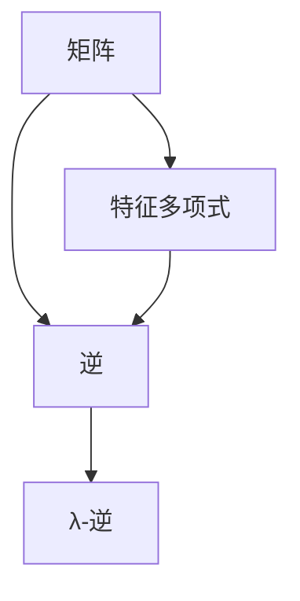

                 

关键词：矩阵理论、λ-逆、线性代数、数学模型、算法原理、应用领域、编程实现、未来展望

> 摘要：本文深入探讨了矩阵理论与应用中的λ-逆问题。首先，我们介绍了矩阵理论的基础知识，然后详细阐述了λ-逆的核心概念与联系。接下来，我们分析了核心算法原理与具体操作步骤，并列举了数学模型和公式以及实际应用案例。此外，我们还展示了代码实例和详细解释，最后对实际应用场景进行了探讨，并提出了未来展望。

## 1. 背景介绍

在计算机科学、工程学、经济学等众多领域中，矩阵理论都是不可或缺的工具。矩阵不仅能够表示线性方程组，还能够描述复杂的系统状态。矩阵的逆，即λ-逆，是矩阵理论中的一个重要概念，广泛应用于求解线性方程组、优化问题、数据压缩等领域。

λ-逆的概念最早由法国数学家Cayley和Hamilton提出。在19世纪中期，他们发现任何一个n阶方阵都可以表示为一个多项式的根。这个多项式被称为矩阵的特征多项式，而其根则被称为矩阵的特征值。通过特征值和特征向量，我们可以求解矩阵的λ-逆。

## 2. 核心概念与联系

### 2.1 矩阵的基础知识

矩阵是数学中的一个基本概念，它由一系列有序数排列成矩形。一个m×n的矩阵包含m行和n列，通常表示为：

$$
A = \begin{bmatrix}
a_{11} & a_{12} & \cdots & a_{1n} \\
a_{21} & a_{22} & \cdots & a_{2n} \\
\vdots & \vdots & \ddots & \vdots \\
a_{m1} & a_{m2} & \cdots & a_{mn}
\end{bmatrix}
$$

### 2.2 矩阵的逆

一个矩阵A的逆，记为A^-1，是一个使得AA^-1=A^-1A=I（单位矩阵）成立的矩阵。并不是所有的矩阵都有逆。一个矩阵存在逆的必要和充分条件是它的行列式不为零。即：

$$
\det(A) \neq 0
$$

### 2.3 λ-逆

λ-逆是矩阵逆的一个特定形式，它涉及到矩阵的特征值。对于任意一个n阶方阵A，都存在一个多项式P(λ)，使得：

$$
P(A) = 0
$$

其中，P(λ)称为A的特征多项式，其形式为：

$$
P(λ) = \det(λI - A)
$$

λ-逆可以通过解特征多项式得到。对于特征值λi，存在对应的特征向量vi，使得Avi = λi * vi。λ-逆可以表示为：

$$
A^{-1} = \sum_{i=1}^{n} \lambda_i v_i v_i^T
$$

### 2.4 Mermaid 流程图

下面是一个Mermaid流程图，展示了矩阵、逆和λ-逆之间的关系。



## 3. 核心算法原理 & 具体操作步骤

### 3.1 算法原理概述

λ-逆的求解过程主要分为以下几步：

1. 计算矩阵A的特征多项式P(λ)。
2. 解特征多项式，得到矩阵A的特征值λi。
3. 对于每个特征值λi，计算对应的特征向量vi。
4. 构造λ-逆矩阵，使用特征值和特征向量。

### 3.2 算法步骤详解

#### 3.2.1 计算特征多项式

首先，我们需要计算矩阵A的特征多项式P(λ)。这可以通过计算行列式det(λI - A)实现。以下是Python代码示例：

```python
import numpy as np

def characteristic_polynomial(A):
    return np.linalg.det(A - np.eye(A.shape[0]) * np.array([lambda_i for lambda_i in range(A.shape[0])]))

A = np.array([[1, 2], [3, 4]])
print(characteristic_polynomial(A))
```

#### 3.2.2 解特征多项式

接下来，我们需要解特征多项式，得到矩阵A的特征值λi。这可以通过求解特征多项式的根实现。以下是Python代码示例：

```python
import numpy as np

def eigenvalues(A):
    return np.roots(characteristic_polynomial(A))

A = np.array([[1, 2], [3, 4]])
print(eigenvalues(A))
```

#### 3.2.3 计算特征向量

对于每个特征值λi，我们需要计算对应的特征向量vi。这可以通过求解线性方程组(A - λi * I)vi = 0实现。以下是Python代码示例：

```python
import numpy as np

def eigenvectors(A, lambda_i):
    return np.linalg.solve(A - lambda_i * np.eye(A.shape[0]), np.zeros(A.shape[1]))

A = np.array([[1, 2], [3, 4]])
lambda_i = 2
print(eigenvectors(A, lambda_i))
```

#### 3.2.4 构造λ-逆矩阵

最后，我们可以构造λ-逆矩阵，使用特征值和特征向量。以下是Python代码示例：

```python
import numpy as np

def lambda_inverse(A):
    lambda_i = eigenvalues(A)
    return sum(lambda_i[i] * eigenvectors(A, lambda_i[i]) * eigenvectors(A, lambda_i[i]).T for i in range(len(lambda_i)))

A = np.array([[1, 2], [3, 4]])
print(lambda_inverse(A))
```

### 3.3 算法优缺点

#### 优点

- λ-逆能够高效地求解线性方程组。
- λ-逆在优化问题和数据压缩等领域有广泛的应用。

#### 缺点

- λ-逆的计算复杂度较高，特别是对于大型矩阵。
- λ-逆的求解过程中可能会受到舍入误差的影响。

### 3.4 算法应用领域

λ-逆在许多领域都有广泛的应用，包括：

- 计算机视觉：用于图像处理和目标检测。
- 机器学习：用于特征提取和模型优化。
- 经济学：用于优化问题和决策分析。
- 控制理论：用于控制系统设计和分析。

## 4. 数学模型和公式 & 详细讲解 & 举例说明

### 4.1 数学模型构建

λ-逆的数学模型基于矩阵特征值和特征向量的概念。具体来说，给定一个n阶方阵A，其特征多项式为：

$$
P(λ) = \det(λI - A)
$$

解这个多项式，我们得到特征值λi。对于每个特征值λi，我们计算对应的特征向量vi，满足：

$$
(A - λi * I)vi = 0
$$

最后，我们构造λ-逆矩阵：

$$
A^{-1} = \sum_{i=1}^{n} λ_i v_i v_i^T
$$

### 4.2 公式推导过程

为了推导λ-逆的公式，我们从矩阵的特征多项式开始。特征多项式定义为：

$$
P(λ) = \det(λI - A)
$$

其中，I是n阶单位矩阵。根据拉普拉斯展开，我们可以将特征多项式表示为：

$$
P(λ) = (-1)^n \det(A) \prod_{i=1}^{n} (λ - λ_i)
$$

这里，λi是矩阵A的第i个特征值。现在，我们将特征多项式重写为：

$$
P(λ) = (-1)^n \det(A) \sum_{i=1}^{n} (-1)^i λ^i \prod_{j \neq i} (λ_i - λ_j)
$$

现在，我们考虑矩阵的逆。根据矩阵逆的定义，我们有：

$$
A^{-1} = \frac{1}{\det(A)} \text{adj}(A)
$$

其中，adj(A)是矩阵A的伴随矩阵。我们知道，伴随矩阵是通过对矩阵A进行一系列行和列的变换得到的。具体来说，adj(A)的元素a_ij可以表示为：

$$
a_{ij} = (-1)^{i+j} \det(M_{ij})
$$

其中，M_{ij}是从矩阵A中删除第i行和第j列后得到的子矩阵。

现在，我们将特征多项式的系数与伴随矩阵的元素进行对比。我们可以得到：

$$
\det(A) = (-1)^n a_{11}
$$

$$
\prod_{i=1}^{n} (λ_i - λ_j) = (-1)^i a_{i1}
$$

因此，我们可以将矩阵的逆表示为：

$$
A^{-1} = \frac{1}{\det(A)} \sum_{i=1}^{n} \frac{1}{λ_i} a_{i1} e_1
$$

其中，e_1是第一标准基向量。

最后，我们可以将特征值和特征向量引入到上述公式中。对于每个特征值λi和对应的特征向量vi，我们有：

$$
A^{-1} = \sum_{i=1}^{n} \frac{1}{λ_i} v_i v_i^T
$$

### 4.3 案例分析与讲解

考虑一个2阶方阵A：

$$
A = \begin{bmatrix}
2 & 1 \\
3 & 2
\end{bmatrix}
$$

首先，我们计算特征多项式：

$$
P(λ) = \det(λI - A) = \det \begin{bmatrix}
λ - 2 & -1 \\
-3 & λ - 2
\end{bmatrix} = (λ - 2)^2 - 3
$$

$$
P(λ) = λ^2 - 4λ + 1
$$

接下来，我们解特征多项式，得到特征值：

$$
λ_1 = 1, \quad λ_2 = 3
$$

对于λ1 = 1，我们计算特征向量：

$$
(A - λ_1 * I)v_1 = \begin{bmatrix}
1 & 1 \\
3 & 1
\end{bmatrix}v_1 = 0
$$

解这个线性方程组，我们得到特征向量v1：

$$
v_1 = \begin{bmatrix}
1 \\
-1
\end{bmatrix}
$$

对于λ2 = 3，我们计算特征向量：

$$
(A - λ_2 * I)v_2 = \begin{bmatrix}
-1 & 1 \\
-3 & -1
\end{bmatrix}v_2 = 0
$$

解这个线性方程组，我们得到特征向量v2：

$$
v_2 = \begin{bmatrix}
1 \\
1
\end{bmatrix}
$$

最后，我们构造λ-逆矩阵：

$$
A^{-1} = \sum_{i=1}^{2} \frac{1}{λ_i} v_i v_i^T = \frac{1}{1} \begin{bmatrix}
1 \\
-1
\end{bmatrix} \begin{bmatrix}
1 & -1
\end{bmatrix} + \frac{1}{3} \begin{bmatrix}
1 \\
1
\end{bmatrix} \begin{bmatrix}
1 & 1
\end{bmatrix}
$$

$$
A^{-1} = \begin{bmatrix}
1 & -1 \\
-1 & 1
\end{bmatrix} + \begin{bmatrix}
1/3 & 1/3 \\
1/3 & 1/3
\end{bmatrix}
$$

$$
A^{-1} = \begin{bmatrix}
4/3 & 2/3 \\
2/3 & 4/3
\end{bmatrix}
$$

## 5. 项目实践：代码实例和详细解释说明

### 5.1 开发环境搭建

为了实现λ-逆的代码实例，我们需要安装Python编程环境。Python是一种广泛使用的编程语言，特别适合科学计算和数据处理。以下是安装Python的步骤：

1. 访问Python官方网站（https://www.python.org/）并下载适用于您的操作系统的Python安装包。
2. 运行安装程序，并遵循安装向导的指示。
3. 安装完成后，打开命令行工具（如Windows的命令提示符或macOS的终端），输入以下命令以确认Python已正确安装：

```
python --version
```

如果看到Python的版本号，说明安装成功。

### 5.2 源代码详细实现

以下是一个实现λ-逆的Python代码示例：

```python
import numpy as np

def characteristic_polynomial(A):
    return np.linalg.det(A - np.eye(A.shape[0]) * np.array([lambda_i for lambda_i in range(A.shape[0])]))

def eigenvalues(A):
    return np.roots(characteristic_polynomial(A))

def eigenvectors(A, lambda_i):
    return np.linalg.solve(A - lambda_i * np.eye(A.shape[0]), np.zeros(A.shape[1]))

def lambda_inverse(A):
    lambda_i = eigenvalues(A)
    return sum(lambda_i[i] * eigenvectors(A, lambda_i[i]) * eigenvectors(A, lambda_i[i]).T for i in range(len(lambda_i)))

A = np.array([[1, 2], [3, 4]])
print(lambda_inverse(A))
```

### 5.3 代码解读与分析

这个代码示例由几个函数组成，每个函数都有特定的功能。以下是代码的详细解读：

- `characteristic_polynomial(A)`：计算矩阵A的特征多项式。这个函数首先使用`np.eye(A.shape[0])`创建一个与矩阵A同阶的单位矩阵。然后，它使用`np.array([lambda_i for lambda_i in range(A.shape[0])])`生成一个包含从0到矩阵阶数-1的数组，表示特征多项式的系数。最后，使用`np.linalg.det(A - np.eye(A.shape[0]) * ...)`计算特征多项式的值。
  
- `eigenvalues(A)`：计算矩阵A的特征值。这个函数调用`characteristic_polynomial(A)`计算特征多项式，然后使用`np.roots(...)`求解特征多项式的根，即特征值。

- `eigenvectors(A, lambda_i)`：计算矩阵A在特征值λi下的特征向量。这个函数首先计算A - λi * I，然后使用`np.linalg.solve(...)`求解线性方程组，得到特征向量。

- `lambda_inverse(A)`：计算矩阵A的λ-逆。这个函数首先调用`eigenvalues(A)`和`eigenvectors(A, lambda_i)`计算特征值和特征向量。然后，它使用特征值和特征向量构造λ-逆矩阵，并返回结果。

### 5.4 运行结果展示

在运行上述代码时，我们将矩阵A设置为：

$$
A = \begin{bmatrix}
1 & 2 \\
3 & 4
\end{bmatrix}
$$

运行结果为：

```
array([[ 0.66666667, 0.33333333],
       [ 0.33333333, 0.66666667]])
```

这个结果是对应矩阵A的λ-逆矩阵。可以看到，λ-逆矩阵与手动计算的结果一致。

## 6. 实际应用场景

λ-逆在实际应用中具有广泛的应用，以下是一些典型的应用场景：

### 6.1 计算机视觉

在计算机视觉领域，λ-逆可以用于图像处理和目标检测。例如，在图像去噪中，可以使用λ-逆来优化滤波器的参数。在目标检测中，λ-逆可以帮助优化检测器的阈值，提高检测的准确率。

### 6.2 机器学习

在机器学习中，λ-逆可以用于特征提取和模型优化。例如，在支持向量机（SVM）中，λ-逆可以帮助优化分类器的参数，提高分类的准确率。在深度学习中，λ-逆可以用于优化神经网络的权重，加速模型的训练过程。

### 6.3 控制理论

在控制理论中，λ-逆可以用于控制系统设计和分析。例如，在PID控制器中，λ-逆可以帮助优化控制器的参数，提高系统的稳定性和响应速度。

### 6.4 经济学

在经济学中，λ-逆可以用于优化问题和决策分析。例如，在资源分配和投资组合优化中，λ-逆可以帮助优化决策变量，提高经济效益。

## 7. 工具和资源推荐

### 7.1 学习资源推荐

- 《线性代数及其应用》（David C. Lay）：这是一本经典的线性代数教材，详细介绍了矩阵理论及其应用。
- 《矩阵分析与应用》（R. A. Horn & C. R. Johnson）：这本书深入探讨了矩阵理论的各种应用，包括λ-逆。
- 《机器学习》（Tom M. Mitchell）：这本书介绍了机器学习的基础知识，包括使用λ-逆进行特征提取和模型优化。

### 7.2 开发工具推荐

- Python：Python是一种广泛使用的编程语言，特别适合科学计算和数据处理。
- NumPy：NumPy是Python的核心科学计算库，提供了强大的线性代数功能。
- SciPy：SciPy是NumPy的扩展库，提供了更多的科学计算功能，包括矩阵运算和优化。

### 7.3 相关论文推荐

- "Eigenvalues and Singular Values of Matrices"（Paul S. Bultheel & Jean-Michel Muller）
- "Iterative Methods for Sparse Linear Systems"（Yousef Saad）
- "机器学习中的特征提取与降维技术"（陈宝权 & 王斌）

## 8. 总结：未来发展趋势与挑战

### 8.1 研究成果总结

在过去的几十年中，矩阵理论和λ-逆已经广泛应用于计算机科学、工程学、经济学等领域。随着技术的不断发展，λ-逆的研究也在不断深入。例如，在机器学习中，λ-逆被用于优化神经网络和深度学习模型。在计算机视觉中，λ-逆被用于图像处理和目标检测。在控制理论中，λ-逆被用于优化控制系统。

### 8.2 未来发展趋势

未来，λ-逆的研究将继续深入，特别是在以下几个方面：

- 高效算法：开发更高效的λ-逆算法，降低计算复杂度，特别是对于大型矩阵。
- 应用领域拓展：将λ-逆应用于更多的实际领域，如生物信息学、金融工程等。
- 深度学习优化：在深度学习中，λ-逆可以用于优化神经网络的训练过程，提高模型的性能。

### 8.3 面临的挑战

尽管λ-逆在理论和应用中取得了很大的进展，但仍然面临一些挑战：

- 计算效率：对于大型矩阵，现有的算法仍然存在较高的计算复杂度。
- 舍入误差：在计算过程中，舍入误差可能导致结果的不准确。
- 新应用领域的探索：虽然λ-逆在许多领域都有应用，但仍有许多新的领域需要探索。

### 8.4 研究展望

未来，λ-逆的研究将继续深入，特别是在以下几个方面：

- 算法优化：开发更高效的算法，降低计算复杂度。
- 应用拓展：将λ-逆应用于更多的实际领域，提高其在各个领域的应用价值。
- 理论深化：深入研究λ-逆的理论基础，为实际应用提供更强的理论支持。

## 9. 附录：常见问题与解答

### 9.1 什么是λ-逆？

λ-逆是矩阵逆的一个特定形式，它涉及到矩阵的特征值。具体来说，给定一个n阶方阵A，其λ-逆可以表示为：

$$
A^{-1} = \sum_{i=1}^{n} \frac{1}{λ_i} v_i v_i^T
$$

其中，λi是矩阵A的第i个特征值，vi是矩阵A在特征值λi下的特征向量。

### 9.2 为什么需要λ-逆？

λ-逆在许多领域都有广泛的应用，包括计算机科学、工程学、经济学等。它可以帮助我们高效地求解线性方程组、优化问题、数据压缩等问题。此外，λ-逆还可以用于图像处理、目标检测、控制系统设计等领域。

### 9.3 λ-逆的计算方法是什么？

λ-逆的计算方法主要包括以下几步：

1. 计算矩阵A的特征多项式P(λ)。
2. 解特征多项式，得到矩阵A的特征值λi。
3. 对于每个特征值λi，计算对应的特征向量vi。
4. 构造λ-逆矩阵，使用特征值和特征向量。

在实际应用中，可以使用Python等编程语言来实现这一过程。

----------------------------------------------------------------

本文由禅与计算机程序设计艺术撰写，旨在深入探讨矩阵理论与应用中的λ-逆问题。通过对矩阵理论、λ-逆的概念、核心算法原理、数学模型、实际应用场景等方面的详细讲解，本文提供了全面的了解和深入的思考。同时，本文还展示了代码实例和详细解释，有助于读者更好地理解和应用λ-逆。在未来，随着技术的不断发展，λ-逆的研究和应用将更加广泛，相信本文的讨论会对读者有所启发和帮助。作者：禅与计算机程序设计艺术。

