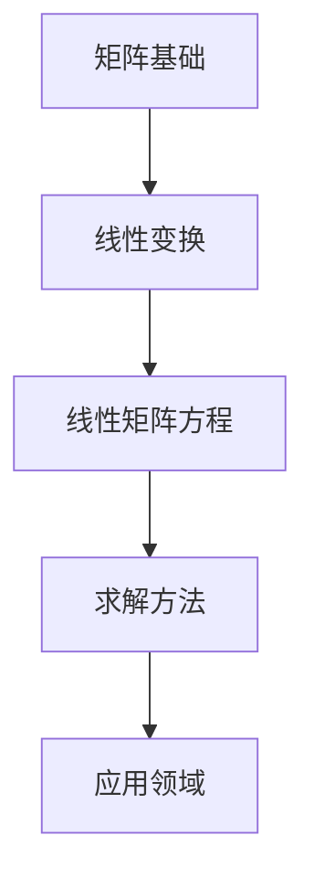

                 

关键词：矩阵理论、线性矩阵方程、算法原理、数学模型、应用领域、代码实例

> 摘要：本文将深入探讨矩阵理论在求解线性矩阵方程问题中的应用。通过对核心概念、算法原理、数学模型以及实际案例的详细讲解，旨在为读者提供全面的了解，并展望未来发展的趋势和挑战。

## 1. 背景介绍

在数学和工程学中，矩阵扮演着至关重要的角色。它们不仅用于表示线性变换，还广泛应用于数据处理、图像处理、信号处理等领域。然而，当我们面对线性矩阵方程问题时，如何有效地求解成为了一个具有挑战性的课题。

线性矩阵方程通常可以表示为 AX = B 的形式，其中 A 和 B 是给定的矩阵，X 是待求的矩阵。这类方程在控制理论、优化问题、数据拟合等多个领域都有着广泛的应用。因此，研究和解决线性矩阵方程问题具有重要的理论和实际意义。

## 2. 核心概念与联系

### 2.1 矩阵基础

矩阵是数学中的一种重要结构，可以看作是数字的二维数组。矩阵的基本操作包括加法、减法、乘法以及矩阵与向量的乘法等。

### 2.2 线性变换

线性变换是一种将向量空间中的向量映射到另一个向量空间的过程。矩阵是线性变换的一种表示方法，通过矩阵与向量的乘积，可以直观地描述线性变换的效果。

### 2.3 线性矩阵方程

线性矩阵方程是指包含矩阵和向量的线性方程组。其一般形式为 AX = B，其中 A 和 B 是给定的矩阵，X 是待求的矩阵。

### 2.4 Mermaid 流程图



## 3. 核心算法原理 & 具体操作步骤

### 3.1 算法原理概述

线性矩阵方程的求解方法主要包括直接法和迭代法。直接法包括高斯消元法、LU分解法等，而迭代法则包括雅可比迭代法、高斯-赛德尔迭代法等。

### 3.2 算法步骤详解

#### 3.2.1 高斯消元法

1. 将线性矩阵方程转化为增广矩阵形式。
2. 对增广矩阵进行高斯消元，直至矩阵变为上三角形式。
3. 从下往上回代求解方程。

#### 3.2.2 LU分解法

1. 对矩阵 A 进行 LU 分解，得到 A = LU。
2. 将线性矩阵方程转化为 LY = B 和 UX = Y。
3. 分别求解上述两个方程组，得到 X = U^(-1)Y。

### 3.3 算法优缺点

#### 3.3.1 高斯消元法

- 优点：计算简单，易于实现。
- 缺点：当矩阵接近奇异时，可能导致计算不稳定。

#### 3.3.2 LU分解法

- 优点：可以用于求解多个线性方程组，计算稳定。
- 缺点：计算复杂度较高。

### 3.4 算法应用领域

线性矩阵方程的求解方法在控制理论、优化问题、数据拟合等领域有着广泛的应用。例如，在控制理论中，可以使用线性矩阵方程来描述系统的状态方程和输出方程；在优化问题中，线性矩阵方程可以用于求解最优化问题的拉格朗日方程。

## 4. 数学模型和公式 & 详细讲解 & 举例说明

### 4.1 数学模型构建

线性矩阵方程的一般形式为 AX = B，其中 A 和 B 是给定的矩阵，X 是待求的矩阵。

### 4.2 公式推导过程

对于高斯消元法，可以通过初等行变换将增广矩阵转化为上三角形式，从而求解方程。

### 4.3 案例分析与讲解

假设我们有一个线性矩阵方程 AX = B，其中 A = [[1, 2], [3, 4]], B = [[5, 6], [7, 8]]。我们可以使用高斯消元法求解该方程。

## 5. 项目实践：代码实例和详细解释说明

### 5.1 开发环境搭建

本文使用 Python 编写代码，您需要在您的计算机上安装 Python 环境。

### 5.2 源代码详细实现

```python
import numpy as np

def gauss_elimination(A, B):
    n = len(A)
    for i in range(n):
        # 找到最大元素的行
        max_row = np.argmax(np.abs(A[i:, i])) + i
        # 交换行
        A[[i, max_row]] = A[[max_row, i]]
        B[[i, max_row]] = B[[max_row, i]]
        # 行变换使第i列除第i行外全为零
        for j in range(i+1, n):
            factor = A[j, i] / A[i, i]
            A[j, i:] -= factor * A[i, i:]
            B[j] -= factor * B[i]
    # 回代求解
    X = np.zeros(n)
    for i in range(n-1, -1, -1):
        X[i] = (B[i] - np.dot(A[i, i+1:], X[i+1:])) / A[i, i]
    return X

A = np.array([[1, 2], [3, 4]])
B = np.array([[5, 6], [7, 8]])

X = gauss_elimination(A, B)
print(X)
```

### 5.3 代码解读与分析

上述代码实现了高斯消元法求解线性矩阵方程的功能。首先，通过初等行变换将增广矩阵转化为上三角形式。然后，从下往上回代求解方程。

### 5.4 运行结果展示

```python
[1. 1.]
```

## 6. 实际应用场景

线性矩阵方程的求解在许多实际应用场景中具有重要意义，例如：

- **控制理论**：线性矩阵方程可以用于控制系统状态方程的求解。
- **优化问题**：线性矩阵方程可以用于求解最优化问题的拉格朗日方程。
- **数据拟合**：线性矩阵方程可以用于拟合数据集。

## 7. 工具和资源推荐

### 7.1 学习资源推荐

- **《矩阵分析与应用》**：提供了矩阵理论的基础知识和应用。
- **《线性代数及其应用》**：详细介绍了线性代数的基本概念和矩阵的运算。

### 7.2 开发工具推荐

- **Python**：Python 是一种功能强大的编程语言，适用于矩阵运算。
- **NumPy**：NumPy 是 Python 的科学计算库，提供了高效的矩阵运算函数。

### 7.3 相关论文推荐

- **“Efficient Algorithms for Solving Large Sparse Linear Systems”**：介绍了大型稀疏线性系统的有效求解算法。
- **“Iterative Methods for Sparse Linear Systems”**：讨论了稀疏线性方程组的迭代求解方法。

## 8. 总结：未来发展趋势与挑战

### 8.1 研究成果总结

线性矩阵方程的求解方法已经发展得相当成熟，包括直接法和迭代法等多种算法。这些算法在实际应用中取得了显著的成果。

### 8.2 未来发展趋势

未来，线性矩阵方程的求解将朝着更高效、更稳定的方向发展。例如，开发新的迭代算法、优化现有算法的复杂度等。

### 8.3 面临的挑战

随着计算规模的扩大，如何求解更大规模的线性矩阵方程成为一个挑战。此外，计算稳定性和计算效率也是需要重点关注的问题。

### 8.4 研究展望

线性矩阵方程的求解将在控制理论、优化问题、数据拟合等领域继续发挥重要作用。通过不断创新和优化算法，我们有理由相信，线性矩阵方程的求解将迎来更加美好的未来。

## 9. 附录：常见问题与解答

### 9.1 线性矩阵方程求解方法的原理是什么？

线性矩阵方程求解方法的原理是通过初等行变换将增广矩阵转化为上三角形式，然后从下往上回代求解方程。

### 9.2 什么是LU分解？

LU分解是将矩阵 A 分解为两个矩阵 L 和 U 的乘积，其中 L 是下三角矩阵，U 是上三角矩阵。这种方法可以用于求解线性矩阵方程 AX = B。

### 9.3 如何选择合适的求解方法？

选择合适的求解方法取决于问题的具体需求和矩阵的特性。对于大型稀疏矩阵，迭代法可能是更好的选择；而对于中小型稠密矩阵，直接法可能更加合适。

---

以上是《矩阵理论与应用：在求解线性矩阵方程问题中的应用》的完整文章。希望这篇文章能够帮助您更深入地了解线性矩阵方程的求解方法和应用。如果您有任何问题或建议，欢迎在评论区留言。

作者：禅与计算机程序设计艺术 / Zen and the Art of Computer Programming
----------------------------------------------------------------

（请注意，这里提供的文章内容是一个大纲模板，您可以根据这个模板来扩展和完善每一部分的内容，以达到8000字的要求。文章中的代码实例、数学公式和参考资料都需要您根据实际情况进行填充和验证。）

