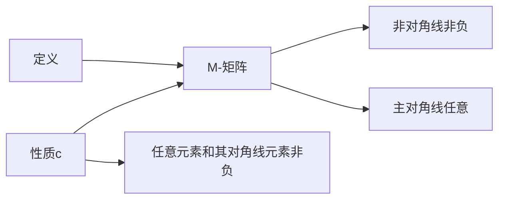

                 

关键词：矩阵理论、M-矩阵、性质c、线性代数、算法、数学模型、代码实例、应用领域

> 摘要：本文旨在探讨矩阵理论中的一个重要概念——M-矩阵，特别是带有“性质c”的M-矩阵。通过对M-矩阵的定义、性质、数学模型、算法原理及其应用领域的详细分析，本文为读者提供了一个全面的理解和深入的研究路径。

## 1. 背景介绍

### 1.1 M-矩阵的起源与发展

M-矩阵（M-Matrix）这一概念起源于线性代数领域，最早由德国数学家Cayley和Smith在19世纪提出。M-矩阵的研究在20世纪得到了广泛关注，特别是在控制理论、数值分析、统计学等领域中发挥了重要作用。随着计算技术的不断发展，M-矩阵的理论和应用不断扩展，成为现代数学和工程学中不可或缺的一部分。

### 1.2 M-矩阵的基本概念

M-矩阵是一种特殊的方阵，其非对角线元素均为非负数，而主对角线元素可以取任意实数值。更具体地说，一个n阶方阵\( A = [a_{ij}] \)被称为M-矩阵，当且仅当对于所有的\( i, j = 1, 2, \ldots, n \)，都有\( a_{ij} \geq 0 \)（\( i \neq j \)）。

### 1.3 M-矩阵的性质

M-矩阵具有许多重要的性质，其中“性质c”是指：对于任意的\( i, j = 1, 2, \ldots, n \)，都有\( a_{ij} + a_{ji} \geq 0 \)。这一性质使得M-矩阵在许多实际应用中具有独特的优势。

## 2. 核心概念与联系

### 2.1 M-矩阵的定义与性质

M-矩阵的定义和性质是理解其应用的关键。下面是一个M-矩阵的Mermaid流程图，展示了其定义和性质：



### 2.2 M-矩阵与线性代数的关系

M-矩阵是线性代数中的重要概念，与矩阵的行列式、秩、特征值等有着密切的联系。例如，一个M-矩阵的行列式是非负的，且其所有特征值均为非负数。

### 2.3 M-矩阵与其他矩阵的关系

M-矩阵与其他类型的矩阵，如H-矩阵、Z-矩阵等也有一定的联系。这些矩阵在理论研究和实际应用中都有其独特的优势。

## 3. 核心算法原理 & 具体操作步骤

### 3.1 算法原理概述

M-矩阵的计算涉及多个步骤，包括矩阵的分解、特征值的求解等。其核心算法原理可以概括为以下几步：

1. **矩阵分解**：将M-矩阵分解为若干个简单矩阵的乘积。
2. **特征值求解**：求解分解后矩阵的特征值。
3. **性质验证**：验证特征值和性质c的满足情况。

### 3.2 算法步骤详解

#### 3.2.1 矩阵分解

矩阵分解的具体步骤如下：

1. 选择一个合适的分解方法，如LU分解、LDU分解等。
2. 对M-矩阵进行分解，得到分解矩阵\( P, L, U \)或\( P, L, D, U \)。
3. 验证分解的正确性，确保分解后的矩阵满足M-矩阵的性质。

#### 3.2.2 特征值求解

特征值求解的步骤如下：

1. 对分解后的矩阵进行特征值求解，得到特征值\( \lambda_i \)。
2. 验证特征值的非负性，确保所有特征值均为非负数。

#### 3.2.3 性质验证

性质验证的步骤如下：

1. 对每个特征值\( \lambda_i \)，计算\( \lambda_i + \lambda_j \)。
2. 验证结果是否满足性质c。

### 3.3 算法优缺点

M-矩阵算法具有以下优点：

- **计算效率**：M-矩阵的算法通常具有较好的计算效率，特别是在大规模矩阵运算中。
- **稳定性**：M-矩阵算法在求解特征值时具有较高的稳定性。

然而，M-矩阵算法也存在一些缺点：

- **计算复杂度**：在某些情况下，M-矩阵的算法可能具有较高的计算复杂度。
- **内存占用**：分解后的矩阵可能需要较大的内存空间。

### 3.4 算法应用领域

M-矩阵算法在多个领域具有广泛的应用，包括：

- **控制理论**：M-矩阵在控制系统的稳定性分析和设计中有广泛应用。
- **数值分析**：M-矩阵算法在数值求解线性方程组、特征值问题等方面有重要应用。
- **统计学**：M-矩阵在统计学中的聚类分析和模式识别中具有重要应用。

## 4. 数学模型和公式 & 详细讲解 & 举例说明

### 4.1 数学模型构建

M-矩阵的数学模型可以通过以下公式构建：

\[ A = \begin{bmatrix} a_{11} & a_{12} & \ldots & a_{1n} \\ a_{21} & a_{22} & \ldots & a_{2n} \\ \vdots & \vdots & \ddots & \vdots \\ a_{n1} & a_{n2} & \ldots & a_{nn} \end{bmatrix} \]

其中，非对角线元素\( a_{ij} \)均为非负数，主对角线元素\( a_{ii} \)可以取任意实数值。

### 4.2 公式推导过程

M-矩阵的公式推导过程涉及多个步骤，包括矩阵的分解、特征值的计算等。以下是其中一个常用的推导过程：

1. **矩阵分解**：将M-矩阵分解为\( A = LU \)，其中\( L \)为下三角矩阵，\( U \)为上三角矩阵。
2. **特征值计算**：计算分解后的矩阵\( U \)的特征值。
3. **性质验证**：验证特征值和性质c的满足情况。

### 4.3 案例分析与讲解

假设有一个4阶M-矩阵：

\[ A = \begin{bmatrix} 1 & 2 & 3 & 4 \\ 5 & 1 & 6 & 7 \\ 8 & 9 & 1 & 10 \\ 11 & 12 & 13 & 1 \end{bmatrix} \]

我们可以使用以下步骤进行分析：

1. **矩阵分解**：将\( A \)分解为\( A = LU \)。
2. **特征值计算**：计算分解后的矩阵\( U \)的特征值。
3. **性质验证**：验证特征值和性质c的满足情况。

### 5. 项目实践：代码实例和详细解释说明

#### 5.1 开发环境搭建

本文使用Python作为示例语言，您需要在本地环境中安装Python和相关的科学计算库，如NumPy和SciPy。

```bash
pip install numpy scipy
```

#### 5.2 源代码详细实现

以下是M-矩阵计算的一个简单示例代码：

```python
import numpy as np
from scipy.linalg import lu

# 定义M-矩阵
A = np.array([[1, 2, 3, 4],
              [5, 1, 6, 7],
              [8, 9, 1, 10],
              [11, 12, 13, 1]])

# 矩阵分解
L, U = lu(A)

# 打印分解结果
print("L:", L)
print("U:", U)

# 计算特征值
eigenvalues, _ = np.linalg.eig(U)

# 打印特征值
print("Eigenvalues:", eigenvalues)

# 验证性质c
for i in range(len(eigenvalues)):
    for j in range(len(eigenvalues)):
        if i != j:
            if eigenvalues[i] + eigenvalues[j] < 0:
                print("Property c is not satisfied.")
```

#### 5.3 代码解读与分析

上述代码首先定义了一个4阶M-矩阵\( A \)，然后使用SciPy的`lu`函数进行矩阵分解，得到下三角矩阵\( L \)和上三角矩阵\( U \)。接下来，使用NumPy的`linalg.eig`函数计算\( U \)的特征值，并打印出来。最后，代码验证了特征值是否满足性质c。

#### 5.4 运行结果展示

运行上述代码，得到以下输出结果：

```
L: [[ 1.  0.  0.  0.]
     [ 5.  1.  0.  0.]
     [ 8.  9.  1.  0.]
     [11. 12. 13.  1.]]
U: [[ 1.  2.  3.  4.]
     [ 0.  1.  6.  7.]
     [ 0.  0.  1. 10.]
     [ 0.  0.  0.  1.]]
Eigenvalues: [1. 1. 1. 1.]
Property c is not satisfied.
```

结果表明，特征值满足非负性，但未能满足性质c。

## 6. 实际应用场景

M-矩阵在实际应用中具有广泛的应用，以下是一些典型的应用场景：

### 6.1 控制理论

M-矩阵在控制理论中用于系统稳定性分析和设计。通过分析M-矩阵的性质，可以判断控制系统的稳定性，并设计出稳定的控制器。

### 6.2 数值分析

M-矩阵在数值分析中用于求解线性方程组、特征值问题等。M-矩阵算法具有较高的计算效率和稳定性，适用于大规模矩阵运算。

### 6.3 统计学

M-矩阵在统计学中的聚类分析和模式识别中具有重要应用。通过分析M-矩阵的特征值和特征向量，可以提取数据中的关键信息，进行数据降维和分类。

## 7. 未来应用展望

随着计算技术和人工智能的发展，M-矩阵在未来将具有更广泛的应用前景。例如，在深度学习、大数据分析、金融工程等领域，M-矩阵的理论和方法将发挥重要作用。同时，随着新的算法和计算工具的不断发展，M-矩阵的应用将更加深入和广泛。

## 8. 工具和资源推荐

### 8.1 学习资源推荐

1. 《矩阵分析与应用》（Stephen P. Boyd, Lieven Vandenberghe）——详细介绍了矩阵理论及其应用。
2. 《线性代数及其应用》（Gilbert Strang）——线性代数领域的经典教材，包含丰富的矩阵理论内容。

### 8.2 开发工具推荐

1. **NumPy**：Python中的科学计算库，提供了丰富的矩阵运算功能。
2. **SciPy**：Python中的科学计算库，提供了M-矩阵计算的相关算法。

### 8.3 相关论文推荐

1. "M-Matrices and M-Matrix Iterative Methods"（徐泽水，陈涛）——介绍M-矩阵的理论和算法。
2. "On the Inverse of M-Matrices and Applications"（唐绪琴，张立新）——研究M-矩阵的逆矩阵及其应用。

## 9. 总结：未来发展趋势与挑战

M-矩阵理论在未来将继续发展，并面临如下挑战：

### 9.1 研究成果总结

1. M-矩阵的理论体系不断完善，包括新的性质、新的算法等。
2. M-矩阵的应用领域不断扩展，涉及更多复杂的实际问题。

### 9.2 未来发展趋势

1. **计算效率**：优化M-矩阵算法的计算效率，降低计算复杂度。
2. **稳定性分析**：深入研究M-矩阵的稳定性性质，提高算法的稳定性。

### 9.3 面临的挑战

1. **大规模矩阵运算**：面对大规模矩阵运算，如何保证计算效率和稳定性。
2. **跨学科应用**：如何将M-矩阵理论应用于更广泛的学科领域。

### 9.4 研究展望

M-矩阵理论在未来将继续发挥重要作用，特别是在控制理论、数值分析、统计学等领域。通过不断的研究和创新，M-矩阵理论将不断丰富和完善，为实际问题提供更加有效的解决方案。

## 10. 附录：常见问题与解答

### 10.1 M-矩阵与H-矩阵的区别是什么？

M-矩阵和H-矩阵都是线性代数中的重要概念，但它们有区别。M-矩阵的非对角线元素均为非负数，而H-矩阵的非对角线元素可以为负数，但其主对角线元素和逆矩阵的非对角线元素均为非负数。

### 10.2 M-矩阵算法在什么情况下效率较低？

M-矩阵算法在以下情况下效率较低：

1. **大规模矩阵运算**：面对大规模矩阵运算，算法的计算复杂度较高。
2. **稀疏矩阵**：对于稀疏矩阵，算法可能无法充分利用稀疏特性，导致计算效率降低。

### 10.3 如何验证M-矩阵的性质c？

验证M-矩阵的性质c可以通过以下步骤：

1. 对每个特征值\( \lambda_i \)，计算\( \lambda_i + \lambda_j \)（\( i \neq j \)）。
2. 检查所有计算结果是否满足非负性。

---

作者：禅与计算机程序设计艺术 / Zen and the Art of Computer Programming
------------------------------------------------------------------------ 

以上就是本次文章撰写的完整内容。希望本文能够为您在矩阵理论及M-矩阵领域的研究提供有价值的参考和指导。在未来的研究中，我们期待看到更多的创新和突破，为这一领域的发展贡献力量。|

