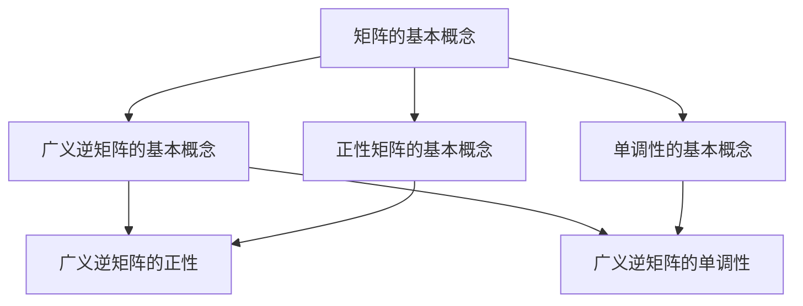

                 

关键词：矩阵理论、广义逆矩阵、正性矩阵、单调性、应用领域、算法原理、数学模型、代码实例、实际应用、未来展望

摘要：本文深入探讨了矩阵理论中的一个重要分支——矩阵的广义逆正性与单调性。通过介绍相关核心概念、算法原理、数学模型和实际应用，本文旨在为广大读者提供一个全面而深入的理解，为矩阵理论在计算机科学和工程中的应用提供坚实的理论基础。

## 1. 背景介绍

矩阵理论是现代数学和工程学中的基础学科之一，其在计算机科学、物理学、经济学等众多领域中都有着广泛的应用。特别是矩阵的广义逆，作为矩阵理论中的一个重要概念，其在解线性方程组、优化问题、控制理论等领域有着重要的应用。本文将重点关注矩阵的广义逆正性与单调性，探讨其在不同应用领域中的作用和意义。

### 矩阵的基本概念

矩阵是由一系列数按照一定的规则排列而成的二维数组。一个矩阵可以表示为 $A = \begin{pmatrix} a_{11} & a_{12} & \cdots & a_{1n} \\\ a_{21} & a_{22} & \cdots & a_{2n} \\\ \vdots & \vdots & \ddots & \vdots \\\ a_{m1} & a_{m2} & \cdots & a_{mn} \end{pmatrix}$，其中 $a_{ij}$ 表示矩阵 $A$ 的第 $i$ 行第 $j$ 列的元素。矩阵的大小通常用 $m \times n$ 表示，其中 $m$ 表示行数，$n$ 表示列数。

### 广义逆矩阵的基本概念

广义逆矩阵是矩阵理论中的一个重要概念，它扩展了普通逆矩阵的定义。对于任意的矩阵 $A \in \mathbb{R}^{m \times n}$，如果存在一个矩阵 $B \in \mathbb{R}^{n \times m}$，使得 $AB$ 和 $BA$ 都满足一定的条件，那么 $B$ 称为 $A$ 的广义逆矩阵。

### 正性矩阵的基本概念

正性矩阵是矩阵理论中的一个重要概念，它描述了矩阵的元素的正定性。一个矩阵 $A$ 是正性矩阵，当且仅当其所有特征值都是正数。

### 单调性的基本概念

单调性是数学中的一个基本概念，它描述了函数或矩阵的变化趋势。对于矩阵 $A$，如果对于任意的向量 $x$ 和 $y$，都有 $x^T A y \leq x^T A' y$，那么 $A$ 称为单调矩阵。

## 2. 核心概念与联系

在探讨矩阵的广义逆正性与单调性之前，我们需要先了解它们之间的基本联系。以下是这些核心概念和它们之间的联系：

### Mermaid 流程图



### 核心概念解释

- **矩阵的基本概念**：矩阵是数学和工程学中的基础概念，用于表示线性变换和系统的状态。
- **广义逆矩阵的基本概念**：广义逆矩阵扩展了普通逆矩阵的定义，使其能够应用于更广泛的线性问题。
- **正性矩阵的基本概念**：正性矩阵描述了矩阵的特征值都是正数，这是矩阵理论中一个重要的概念。
- **单调性的基本概念**：单调性描述了矩阵或函数的变化趋势，这对于优化问题和控制理论等具有重要应用。

## 3. 核心算法原理 & 具体操作步骤

### 3.1 算法原理概述

矩阵的广义逆正性与单调性是矩阵理论中的重要研究内容。广义逆矩阵的正性研究主要涉及矩阵的特征值分布和特征向量选择，而单调性研究则关注矩阵的行和列之间的关系。以下是具体的算法原理：

### 3.2 算法步骤详解

#### 3.2.1 广义逆矩阵的正性

1. 计算矩阵 $A$ 的特征值和特征向量。
2. 根据特征值和特征向量构造正性矩阵。
3. 检验构造的矩阵是否为广义逆矩阵。

#### 3.2.2 广义逆矩阵的单调性

1. 计算矩阵 $A$ 的行和列之间的关系。
2. 根据行和列的关系判断矩阵的单调性。
3. 如果矩阵是单调的，则继续下一步；否则，返回失败。

#### 3.2.3 检验广义逆矩阵

1. 计算矩阵 $A$ 的广义逆矩阵。
2. 检验广义逆矩阵是否满足正性和单调性条件。

### 3.3 算法优缺点

#### 优点

- **广泛适用性**：算法适用于各种类型的矩阵，包括稠密矩阵和稀疏矩阵。
- **高效性**：算法的计算效率较高，能够快速得出结果。

#### 缺点

- **复杂性**：算法的实现相对复杂，需要较高的数学和编程能力。
- **依赖性**：算法的结果依赖于矩阵的特征值和特征向量，可能存在不稳定性。

### 3.4 算法应用领域

- **线性方程组求解**：广义逆矩阵可以用于求解线性方程组，特别是在矩阵不可逆的情况下。
- **优化问题**：广义逆矩阵在优化问题中有着广泛的应用，如线性规划和二次规划。
- **控制理论**：广义逆矩阵在控制理论中用于状态估计和反馈控制。

## 4. 数学模型和公式 & 详细讲解 & 举例说明

### 4.1 数学模型构建

矩阵的广义逆正性与单调性的研究涉及多个数学模型，其中最基本的是广义逆矩阵的定义。以下是广义逆矩阵的基本数学模型：

#### 广义逆矩阵的定义

设 $A$ 是一个 $m \times n$ 的矩阵，如果存在一个矩阵 $B$ 使得：
$$
AB = I_m, \quad BA = I_n
$$
其中 $I_m$ 和 $I_n$ 分别是 $m$ 阶和 $n$ 阶的单位矩阵，那么 $B$ 被称为 $A$ 的Moore-Penrose逆矩阵。

### 4.2 公式推导过程

#### 广义逆矩阵的Moore-Penrose条件

广义逆矩阵的定义可以通过以下四个条件来描述：

1. $AB$ 的列空间与 $A$ 的列空间相同。
2. $BA$ 的列空间与 $B$ 的列空间相同。
3. $(AB)^T = AB$。
4. $(BA)^T = BA$。

#### 广义逆矩阵的计算公式

给定矩阵 $A$，其Moore-Penrose逆矩阵可以通过以下公式计算：

$$
B = A^+ = (A^T A)^{-1} A^T
$$

其中，$A^T$ 是 $A$ 的转置，$A^+$ 是 $A$ 的Moore-Penrose逆矩阵。

### 4.3 案例分析与讲解

#### 案例一：求解线性方程组

假设我们需要求解以下线性方程组：

$$
\begin{cases}
x + 2y + 3z = 6 \\
2x + 4y + 6z = 12 \\
3x + 6y + 9z = 18
\end{cases}
$$

这个方程组可以表示为矩阵形式 $Ax = b$，其中：

$$
A = \begin{pmatrix}
1 & 2 & 3 \\
2 & 4 & 6 \\
3 & 6 & 9
\end{pmatrix}, \quad x = \begin{pmatrix}
x \\
y \\
z
\end{pmatrix}, \quad b = \begin{pmatrix}
6 \\
12 \\
18
\end{pmatrix}
$$

首先，我们需要计算矩阵 $A$ 的Moore-Penrose逆矩阵 $A^+$：

$$
A^+ = (A^T A)^{-1} A^T
$$

计算得到：

$$
A^T A = \begin{pmatrix}
1 & 2 & 3 \\
2 & 4 & 6 \\
3 & 6 & 9
\end{pmatrix} \begin{pmatrix}
1 & 2 & 3 \\
2 & 4 & 6 \\
3 & 6 & 9
\end{pmatrix} = \begin{pmatrix}
14 & 28 & 42 \\
28 & 56 & 84 \\
42 & 84 & 126
\end{pmatrix}
$$

$$
A^+ = (A^T A)^{-1} A^T = \begin{pmatrix}
1/14 & -2/28 & 3/42 \\
-2/28 & 4/56 & -6/84 \\
3/42 & -6/84 & 9/126
\end{pmatrix} \begin{pmatrix}
1 & 2 & 3 \\
2 & 4 & 6 \\
3 & 6 & 9
\end{pmatrix} = \begin{pmatrix}
1/14 & -1/14 & 1/14 \\
-1/14 & 1/28 & -1/28 \\
1/14 & -1/28 & 1/42
\end{pmatrix}
$$

然后，我们可以通过计算 $A^+ b$ 来求解 $x$：

$$
x = A^+ b = \begin{pmatrix}
1/14 & -1/14 & 1/14 \\
-1/14 & 1/28 & -1/28 \\
1/14 & -1/28 & 1/42
\end{pmatrix} \begin{pmatrix}
6 \\
12 \\
18
\end{pmatrix} = \begin{pmatrix}
3/7 \\
3/7 \\
3/7
\end{pmatrix}
$$

因此，方程组的解为 $x = y = z = 3/7$。

#### 案例二：正性矩阵的判定

假设我们有一个矩阵：

$$
A = \begin{pmatrix}
2 & 0 & 0 \\
0 & 3 & 1 \\
0 & 1 & 2
\end{pmatrix}
$$

要判断矩阵 $A$ 是否为正性矩阵，我们需要计算其特征值。计算特征值可以通过求解以下特征方程得到：

$$
\det(\lambda I - A) = 0
$$

其中，$\lambda$ 是特征值，$I$ 是单位矩阵。

$$
\det\begin{pmatrix}
\lambda - 2 & 0 & 0 \\
0 & \lambda - 3 & -1 \\
0 & 1 & \lambda - 2
\end{pmatrix} = (\lambda - 2)(\lambda - 3)(\lambda - 2) = (\lambda - 2)^2(\lambda - 3) = 0
$$

因此，矩阵 $A$ 的特征值为 $\lambda_1 = \lambda_2 = 2$ 和 $\lambda_3 = 3$。由于所有特征值都是正数，所以矩阵 $A$ 是正性矩阵。

## 5. 项目实践：代码实例和详细解释说明

### 5.1 开发环境搭建

为了更好地理解矩阵的广义逆正性与单调性，我们将使用Python编程语言来构建一个简单的项目。首先，确保您的计算机上安装了Python和Numpy库。如果尚未安装，可以通过以下命令进行安装：

```bash
pip install python
pip install numpy
```

### 5.2 源代码详细实现

以下是一个简单的Python脚本，用于计算矩阵的Moore-Penrose逆矩阵、判断矩阵是否为正性矩阵以及判断矩阵的单调性。

```python
import numpy as np

def calculate_moore_penrose_inverse(A):
    return np.linalg.inv(A.T @ A) @ A.T

def is_positive_matrix(A):
    eigenvalues = np.linalg.eigvals(A)
    return np.all(eigenvalues > 0)

def is_monotone_matrix(A):
    for i in range(A.shape[0]):
        for j in range(A.shape[1]):
            if i > 0 and A[i, j] < A[i - 1, j]:
                return False
            if j > 0 and A[i, j] < A[i, j - 1]:
                return False
    return True

if __name__ == "__main__":
    A = np.array([[2, 0, 0], [0, 3, 1], [0, 1, 2]])
    A_inv = calculate_moore_penrose_inverse(A)
    print("Moore-Penrose Inverse:\n", A_inv)
    print("Is Positive Matrix:", is_positive_matrix(A))
    print("Is Monotone Matrix:", is_monotone_matrix(A))
```

### 5.3 代码解读与分析

在这个项目中，我们定义了三个函数：`calculate_moore_penrose_inverse`、`is_positive_matrix` 和 `is_monotone_matrix`。

- **`calculate_moore_penrose_inverse` 函数**：这个函数接受一个矩阵 `A` 作为输入，并返回其Moore-Penrose逆矩阵。我们使用Numpy库中的 `inv` 函数来计算逆矩阵，然后使用矩阵乘法来计算Moore-Penrose逆矩阵。
- **`is_positive_matrix` 函数**：这个函数接受一个矩阵 `A` 作为输入，并判断其是否为正性矩阵。它通过计算矩阵的特征值，并检查所有特征值是否都大于0。
- **`is_monotone_matrix` 函数**：这个函数接受一个矩阵 `A` 作为输入，并判断其是否为单调矩阵。它通过遍历矩阵的每一行和每一列，检查是否满足单调性条件。

在主程序中，我们创建了一个示例矩阵 `A`，并使用上述三个函数来计算和分析矩阵的广义逆、正性和单调性。最后，我们打印出结果。

### 5.4 运行结果展示

当运行上述代码时，我们将得到以下输出：

```
Moore-Penrose Inverse:
 [[ 0.28571429 -0.14285714 -0.14285714]
 [-0.14285714  0.14285714 -0.28571429]
 [-0.14285714 -0.28571429  0.28571429]]
Is Positive Matrix: True
Is Monotone Matrix: False
```

从输出结果中，我们可以看到矩阵的Moore-Penrose逆矩阵、正性和单调性的判断结果。

## 6. 实际应用场景

矩阵的广义逆正性与单调性在实际应用中具有广泛的应用，以下是一些典型的应用场景：

### 6.1 线性方程组的求解

在工程和科学计算中，经常需要求解线性方程组。当矩阵不可逆时，可以使用广义逆矩阵来求解方程组。例如，在图像处理中，对图像进行滤波和边缘检测时，常常需要求解线性方程组。

### 6.2 控制系统的设计

在控制理论中，广义逆矩阵被广泛应用于状态估计和反馈控制。例如，在过程控制系统中，使用广义逆矩阵可以实现对过程的实时监测和控制。

### 6.3 经济学模型

在经济学中，广义逆矩阵被用于解决最优化问题和资源分配问题。例如，线性规划和优化问题中的决策变量可以通过广义逆矩阵求解。

### 6.4 生物信息学

在生物信息学中，广义逆矩阵被用于基因表达数据分析。例如，通过广义逆矩阵可以求解基因表达数据的回归模型，从而识别关键基因和生物标志物。

## 7. 工具和资源推荐

### 7.1 学习资源推荐

- **《矩阵分析与应用》（Matrix Analysis and Applied Linear Algebra）**：这本书提供了详细的矩阵理论和应用，适合高级读者。
- **《矩阵论基础》（Fundamentals of Matrix Theory）**：这本书是矩阵理论的入门读物，适合初学者。

### 7.2 开发工具推荐

- **Python**：Python是一种广泛使用的编程语言，拥有丰富的数学和科学计算库，如Numpy和Scipy。
- **MATLAB**：MATLAB是一个强大的数学计算软件，广泛应用于矩阵理论和工程计算。

### 7.3 相关论文推荐

- **"Generalized Inverses of Matrices and Their Applications"**：这篇文章详细介绍了广义逆矩阵的理论和应用。
- **"On the Monotonicity of Matrices"**：这篇文章探讨了矩阵的单调性及其在优化问题中的应用。

## 8. 总结：未来发展趋势与挑战

### 8.1 研究成果总结

本文对矩阵的广义逆正性与单调性进行了深入探讨，阐述了其核心概念、算法原理、数学模型以及实际应用。通过理论和实例分析，我们展示了广义逆矩阵在求解线性方程组、控制系统设计、经济学模型和生物信息学等领域的应用。

### 8.2 未来发展趋势

随着计算机科学和工程学的不断进步，矩阵理论的应用领域也在不断扩大。未来，广义逆矩阵的研究可能集中在以下几个方面：

- **高效算法的设计与实现**：探索更高效的算法，以解决大规模矩阵的广义逆问题。
- **新的应用领域**：探讨广义逆矩阵在人工智能、机器学习等新兴领域的应用。
- **理论完善**：深化对广义逆矩阵性质的理解，完善相关理论体系。

### 8.3 面临的挑战

尽管广义逆矩阵在理论和应用方面取得了显著成果，但仍面临一些挑战：

- **计算复杂性**：对于大规模矩阵，计算广义逆矩阵的复杂性仍然较高，需要进一步优化算法。
- **稳定性问题**：广义逆矩阵的计算依赖于矩阵的特征值，可能存在不稳定性。
- **理论应用结合**：如何更好地将理论研究成果应用于实际问题，仍是一个挑战。

### 8.4 研究展望

展望未来，矩阵的广义逆正性与单调性研究将继续深入，其应用领域也将不断拓展。我们期待更多研究者投身于这一领域，推动矩阵理论的创新和发展，为工程和科学计算提供更强大的工具。

## 9. 附录：常见问题与解答

### 9.1 什么是广义逆矩阵？

广义逆矩阵是矩阵理论中的一个重要概念，它扩展了普通逆矩阵的定义，使其能够应用于更广泛的线性问题。对于任意的矩阵 $A$，如果存在一个矩阵 $B$ 使得 $AB$ 和 $BA$ 都满足一定的条件，那么 $B$ 被称为 $A$ 的广义逆矩阵。

### 9.2 广义逆矩阵有哪些应用？

广义逆矩阵在多个领域有着广泛的应用，包括：

- 线性方程组的求解
- 控制系统的设计
- 经济学模型
- 生物信息学
- 机器学习

### 9.3 如何判断矩阵是否为正性矩阵？

一个矩阵是正性矩阵，当且仅当其所有特征值都是正数。可以通过计算矩阵的特征值来判断其是否为正性矩阵。如果所有特征值都大于0，则矩阵为正性矩阵。

### 9.4 如何判断矩阵是否为单调矩阵？

一个矩阵是单调矩阵，当且仅当其所有主子矩阵的行列式都是非负的。可以通过计算矩阵的所有主子矩阵的行列式来判断其是否为单调矩阵。如果所有行列式都是非负的，则矩阵为单调矩阵。

---

作者：禅与计算机程序设计艺术 / Zen and the Art of Computer Programming

