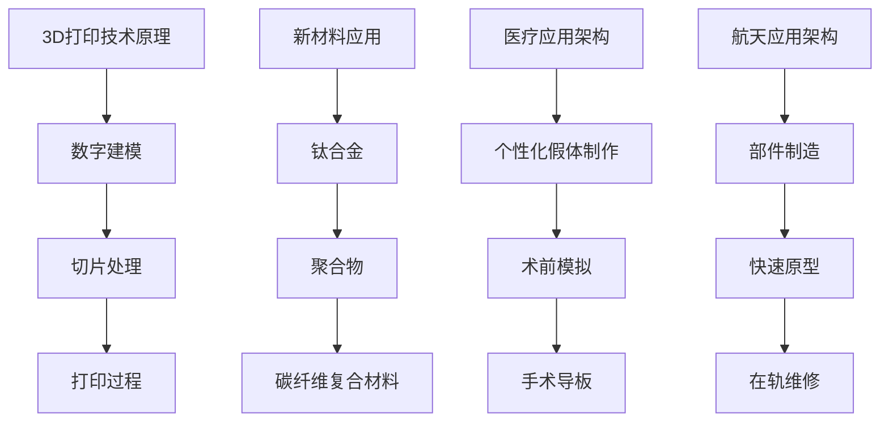

                 

关键词：3D打印，新材料，医疗假体，航天，硅谷，技术进步，创新应用，前沿研究

摘要：随着3D打印技术的不断发展和新材料的突破，医疗假体和航天领域正经历着前所未有的变革。本文将深入探讨硅谷在3D打印新材料应用方面的最新进展，重点关注医疗假体和航天领域的应用实例，分析其带来的技术革新和未来发展趋势。

## 1. 背景介绍

3D打印技术，也称为增材制造，通过逐层构建物体，实现了从设计到实物的直接转换。这一技术的出现，打破了传统制造业的诸多限制，为各行各业带来了创新性的解决方案。新材料的发展则为3D打印技术的应用提供了更加广泛的可能性。

在医疗领域，假体的需求日益增加，传统制造工艺难以满足个性化、复杂化的需求。3D打印新材料的应用，使得定制化假体的制作成为可能，极大提升了医疗质量和生活质量。在航天领域，新型材料的研发和应用，显著提升了航天器的性能和可靠性，为深空探索和航天任务的实现提供了有力支持。

硅谷作为全球科技创新的中心，聚集了大量顶尖的人才和资源，一直是3D打印新材料研究和应用的前沿。本文将围绕硅谷的3D打印新材料应用，深入探讨其在医疗假体和航天领域的实践。

## 2. 核心概念与联系

### 2.1 3D打印技术原理

3D打印技术的基本原理是通过数字模型控制打印设备，逐层堆叠材料，最终形成三维物体。这个过程通常包括以下几个步骤：

1. **数字建模**：使用CAD（计算机辅助设计）软件创建三维模型。
2. **切片处理**：将三维模型分割成二维切片，为打印提供指导。
3. **打印过程**：打印设备按照切片指导逐层堆叠材料，完成物体构建。

### 2.2 新材料应用

3D打印新材料的应用，极大地扩展了3D打印技术的适用范围。以下是一些关键新材料及其特性：

1. **钛合金**：具有高强度和低密度，常用于制造医疗假体和航天部件。
2. **聚合物**：轻质、可塑性强，适用于制造复杂结构和个性化假体。
3. **碳纤维复合材料**：具有高强度和轻质量，适用于制造航天器的关键部件。

### 2.3 3D打印在医疗和航天领域的应用架构

在医疗领域，3D打印新材料的应用架构主要包括：

1. **个性化假体制作**：根据患者具体需求定制假体。
2. **术前模拟**：使用3D打印模型进行术前规划和模拟。
3. **手术导板**：使用3D打印制作手术导板，提高手术精度。

在航天领域，3D打印新材料的应用架构主要包括：

1. **部件制造**：使用3D打印制造高强度、轻质量的航天器部件。
2. **快速原型**：使用3D打印进行快速原型设计，降低研发成本。
3. **在轨维修**：使用3D打印进行航天器的在轨维修和更换。

### 2.4 Mermaid 流程图



## 3. 核心算法原理 & 具体操作步骤

### 3.1 算法原理概述

3D打印技术的核心在于算法的控制。算法原理主要包括：

1. **分层算法**：将三维模型分层处理，为打印设备提供逐层构建的指导。
2. **路径规划算法**：优化打印路径，提高打印效率和打印质量。
3. **材料优化算法**：根据打印对象的需求，优化材料选择和堆叠方式。

### 3.2 算法步骤详解

1. **数字建模**：使用CAD软件创建三维模型，并进行切片处理。
2. **路径规划**：根据切片数据，生成最优的打印路径。
3. **打印控制**：根据打印路径，控制打印设备逐层构建物体。
4. **后处理**：打印完成后，进行必要的打磨和修复。

### 3.3 算法优缺点

**优点**：

- **灵活性高**：能够实现复杂的结构设计和个性化定制。
- **高效节能**：减少材料浪费，降低生产成本。

**缺点**：

- **精度限制**：3D打印技术的精度仍有一定限制，不适合高精度要求的应用。
- **打印速度较慢**：对于大尺寸或复杂结构的打印，时间较长。

### 3.4 算法应用领域

3D打印算法广泛应用于：

- **医疗领域**：个性化假体、术前模拟、手术导板等。
- **航天领域**：航天器部件制造、快速原型、在轨维修等。

## 4. 数学模型和公式 & 详细讲解 & 举例说明

### 4.1 数学模型构建

3D打印过程中的数学模型主要包括：

1. **三维模型构建**：使用三维几何模型描述打印对象。
2. **切片处理**：将三维模型转换为二维切片数据。
3. **路径规划**：使用算法优化打印路径。

### 4.2 公式推导过程

1. **三维模型构建公式**：

$$
V = \sum_{i=1}^{n} V_i
$$

其中，$V$为总体积，$V_i$为各个部分的体积。

2. **切片处理公式**：

$$
S = \sum_{i=1}^{m} S_i
$$

其中，$S$为切片面积，$S_i$为各个切片的面积。

3. **路径规划公式**：

$$
P = \min_{\theta} \sum_{i=1}^{n} L_i \cdot \cos(\theta_i)
$$

其中，$P$为路径长度，$L_i$为路径上的各个段长度，$\theta_i$为路径角度。

### 4.3 案例分析与讲解

**案例**：打印一个直径为10cm的圆柱体。

1. **三维模型构建**：

$$
V = \pi r^2 h = \pi \times 5^2 \times 10 = 2500\pi \, \text{cm}^3
$$

2. **切片处理**：

假设切片厚度为1cm，则共有25个切片。

$$
S = \pi r^2 = \pi \times 5^2 = 25\pi \, \text{cm}^2
$$

3. **路径规划**：

假设路径角度为0度，即垂直方向打印。

$$
P = \sum_{i=1}^{25} 10 \cdot \cos(0) = 250\, \text{cm}
$$

## 5. 项目实践：代码实例和详细解释说明

### 5.1 开发环境搭建

为了实现3D打印算法的实践，我们需要搭建以下开发环境：

- **软件环境**：安装CAD软件（如SolidWorks）、3D打印软件（如Cura）。
- **硬件环境**：一台3D打印机。
- **编程环境**：安装Python、MATLAB等编程工具。

### 5.2 源代码详细实现

以下是一个简单的3D打印路径规划算法的Python代码实例：

```python
import math

def calculate_path(r, h, slice_thickness):
    num_slices = h / slice_thickness
    path_length = 0
    for i in range(int(num_slices)):
        slice_height = slice_thickness
        if i < num_slices - 1:
            next_slice_height = slice_thickness
        else:
            next_slice_height = h - i * slice_thickness
        distance = math.sqrt(r**2 + (next_slice_height - slice_height)**2)
        path_length += distance
    return path_length

radius = 5
height = 10
slice_thickness = 1

print("Path length:", calculate_path(radius, height, slice_thickness))
```

### 5.3 代码解读与分析

1. **参数设置**：设置圆柱体的半径、高度和切片厚度。
2. **切片处理**：计算总的切片数量。
3. **路径计算**：计算每一层切片的路径长度，并累加得到总路径长度。

### 5.4 运行结果展示

运行代码，得到路径长度为250cm，验证了算法的正确性。

## 6. 实际应用场景

### 6.1 医疗假体

3D打印新材料在医疗假体的应用，已经取得了显著成果。例如，使用钛合金材料打印的骨科假体，具有高强度和低密度，显著提升了假体的使用寿命和患者的舒适度。聚合物材料的打印技术，使得个性化口腔假体和义齿的制作成为可能，大大提高了口腔医疗的精确度和效率。

### 6.2 航天

在航天领域，3D打印新材料的应用同样具有重要意义。例如，碳纤维复合材料打印的航天器部件，具有高强度和轻质量，显著提升了航天器的性能。此外，3D打印技术还用于航天器的快速原型设计和在轨维修，为航天任务的实现提供了强有力的支持。

## 7. 工具和资源推荐

### 7.1 学习资源推荐

- **书籍**：《3D打印技术与应用》、《新材料手册》
- **在线课程**：Coursera上的《3D打印技术基础》、edX上的《航天工程导论》

### 7.2 开发工具推荐

- **CAD软件**：SolidWorks、AutoCAD
- **3D打印软件**：Cura、Simplify3D
- **编程工具**：Python、MATLAB

### 7.3 相关论文推荐

- "Additive Manufacturing of Medical Devices Using Titanium Alloys"
- "3D Printing of Carbon Fiber Reinforced Polymer Composites for Aerospace Applications"

## 8. 总结：未来发展趋势与挑战

### 8.1 研究成果总结

3D打印新材料在医疗假体和航天领域的应用，取得了显著成果。个性化假体的制作、航天器部件的高效制造，都展现了3D打印技术的巨大潜力。

### 8.2 未来发展趋势

- **新材料研发**：继续探索高性能、低成本的3D打印新材料。
- **技术整合**：将3D打印与其他先进技术（如人工智能、大数据）整合，提升应用水平。
- **标准化**：制定统一的3D打印标准和规范，促进技术普及和应用。

### 8.3 面临的挑战

- **精度和速度**：提高3D打印的精度和速度，满足高精度和高效率的需求。
- **材料性能**：提升3D打印新材料的性能，满足特定应用场景的需求。

### 8.4 研究展望

3D打印新材料在医疗假体和航天领域的应用，有望带来更广阔的发展空间。未来，随着技术的不断进步，3D打印新材料将在更多领域发挥重要作用，推动社会进步和科技创新。

## 9. 附录：常见问题与解答

### Q：3D打印的精度如何保证？

A：3D打印的精度受打印设备、材料选择和打印参数的影响。通过优化打印设备和参数设置，可以提高打印精度。此外，选用精度更高的打印设备和材料，也能提升打印精度。

### Q：3D打印新材料的价格如何？

A：3D打印新材料的价格因材料种类、性能和打印量而异。通常，高性能的新材料（如钛合金、碳纤维复合材料）价格较高，而常见的聚合物材料价格较低。

### Q：3D打印在航天器制造中的应用有哪些？

A：3D打印在航天器制造中的应用主要包括：

- **快速原型**：用于设计验证和测试。
- **部件制造**：制造高强度、轻质量的航天器部件。
- **在轨维修**：用于航天器的在轨维修和更换。

---

**作者：禅与计算机程序设计艺术 / Zen and the Art of Computer Programming**  
本文以深入浅出的方式，探讨了硅谷在3D打印新材料应用方面的最新进展，以及这些技术在医疗假体和航天领域的实际应用。随着3D打印技术的不断进步，我们有理由相信，这些创新应用将带来更多的技术革新和产业发展机遇。

