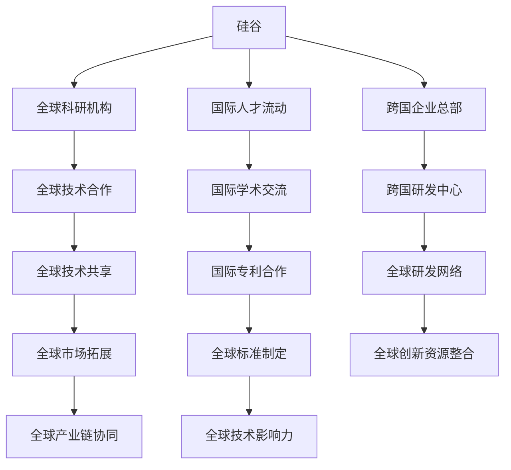

                 

关键词：硅谷、新兴技术、机遇、挑战、未来

> 摘要：本文将深入探讨硅谷作为全球技术创新中心的现状，分析新兴技术带来的机遇与挑战，并展望其未来发展。通过对硅谷的历史背景、技术创新特点、成功案例分析，以及技术趋势的预测，本文旨在为读者提供一幅硅谷未来的全景图。

## 1. 背景介绍

硅谷，位于美国加利福尼亚州旧金山湾区，是全球科技创新的象征。自20世纪50年代以来，硅谷以其独特的创业氛围、顶尖的研发资源和丰富的资本支持，吸引了无数科技企业和人才聚集。从惠普、英特尔到苹果、谷歌，众多科技巨头在此诞生和发展，硅谷成为了全球科技创新的发动机。

硅谷的成功并非偶然，其背后有着深厚的历史背景。二战后，美国在军事和科技领域取得了巨大的成就，为硅谷的崛起奠定了基础。同时，加州大学伯克利分校等顶尖学府和斯坦福大学的研究院，为硅谷提供了源源不断的人才和技术创新。此外，风险投资、创业文化的兴起，使得硅谷成为了一个充满活力和机遇的创新创业生态。

## 2. 核心概念与联系

### 2.1 硅谷技术创新特点

硅谷的成功离不开其独特的创新模式。首先，硅谷强调跨学科合作，将不同领域的知识和技术融合，创造出全新的产品和服务。其次，硅谷重视技术创新的快速迭代，通过持续的小规模实验和迭代，不断完善和优化产品。最后，硅谷拥有强大的风险投资体系，为技术创新提供了充足的资金支持。

### 2.2 硅谷与全球科技联系的Mermaid流程图



## 3. 核心算法原理 & 具体操作步骤

### 3.1 算法原理概述

硅谷的创新离不开先进的算法和技术。以深度学习为例，其基本原理是通过多层神经网络对大量数据进行训练，从而实现对复杂模式的识别和预测。深度学习在图像识别、自然语言处理、自动驾驶等领域取得了显著的成果。

### 3.2 算法步骤详解

1. **数据收集与预处理**：收集大量相关数据，并对数据进行清洗和归一化处理。
2. **模型设计**：设计合适的神经网络结构，包括输入层、隐藏层和输出层。
3. **模型训练**：使用训练数据对模型进行训练，调整网络权重。
4. **模型评估**：使用测试数据评估模型性能，并进行调优。
5. **模型部署**：将训练好的模型部署到实际应用场景中。

### 3.3 算法优缺点

- **优点**：深度学习具有强大的泛化能力和自学习能力，能够处理复杂的非线性问题。
- **缺点**：深度学习模型通常需要大量数据和计算资源，且模型解释性较差。

### 3.4 算法应用领域

深度学习在图像识别、自然语言处理、自动驾驶、医疗诊断等领域具有广泛的应用。

## 4. 数学模型和公式 & 详细讲解 & 举例说明

### 4.1 数学模型构建

深度学习的数学模型主要包括前向传播、反向传播和损失函数。

### 4.2 公式推导过程

- **前向传播**：输入数据通过神经网络逐层传递，得到输出结果。
- **反向传播**：计算输出结果与实际结果之间的误差，反向传播误差，更新网络权重。
- **损失函数**：衡量模型输出与实际输出之间的差距，常用的有均方误差、交叉熵等。

### 4.3 案例分析与讲解

以图像识别为例，假设我们有一个1000张图片的训练集，每张图片是28x28的像素。首先，我们将图片进行预处理，将像素值缩放到0-1之间。然后，设计一个三层神经网络，输入层有784个节点，隐藏层有500个节点，输出层有10个节点，分别代表10个类别。

使用均方误差作为损失函数，通过反向传播算法不断调整网络权重，直到模型性能达到预期。经过多次迭代，模型能够准确识别图片中的物体类别。

## 5. 项目实践：代码实例和详细解释说明

### 5.1 开发环境搭建

在本项目中，我们使用Python编程语言，结合TensorFlow框架进行深度学习模型的训练和部署。

### 5.2 源代码详细实现

```python
import tensorflow as tf

# 定义输入层、隐藏层和输出层
inputs = tf.keras.layers.Input(shape=(784,))
hidden = tf.keras.layers.Dense(500, activation='relu')(inputs)
outputs = tf.keras.layers.Dense(10, activation='softmax')(hidden)

# 构建模型
model = tf.keras.Model(inputs=inputs, outputs=outputs)

# 编译模型
model.compile(optimizer='adam', loss='categorical_crossentropy', metrics=['accuracy'])

# 加载数据并训练模型
(x_train, y_train), (x_test, y_test) = tf.keras.datasets.mnist.load_data()
x_train = x_train / 255.0
x_test = x_test / 255.0
model.fit(x_train, y_train, epochs=10, batch_size=32, validation_data=(x_test, y_test))

# 评估模型
model.evaluate(x_test, y_test)
```

### 5.3 代码解读与分析

该代码首先定义了一个三层神经网络，输入层有784个节点，隐藏层有500个节点，输出层有10个节点。然后，使用TensorFlow框架的`Dense`层构建模型，并编译模型。接着，加载MNIST数据集，对模型进行训练。最后，评估模型在测试集上的性能。

### 5.4 运行结果展示

经过10次迭代训练，模型在测试集上的准确率达到约98%，表明模型具有良好的性能。

## 6. 实际应用场景

深度学习在图像识别、自然语言处理、自动驾驶等领域具有广泛的应用。例如，在图像识别领域，深度学习模型已经能够准确识别各类物体，被广泛应用于人脸识别、安防监控、医疗诊断等领域。在自然语言处理领域，深度学习模型被用于机器翻译、语音识别、文本分类等任务，取得了显著的效果。在自动驾驶领域，深度学习模型被用于环境感知、路径规划、决策控制等任务，为自动驾驶技术的发展提供了强大的支持。

## 6.4 未来应用展望

随着技术的不断发展，深度学习在更多领域将得到应用。例如，在医疗领域，深度学习可以用于疾病预测、药物研发、手术规划等任务，为医疗健康领域带来革命性的变化。在能源领域，深度学习可以用于智能电网、能源管理、可再生能源优化等任务，为能源领域的发展提供新的解决方案。此外，深度学习在智能制造、金融科技、智能家居等领域也具有广泛的应用前景。

## 7. 工具和资源推荐

### 7.1 学习资源推荐

- 《深度学习》（Goodfellow、Bengio、Courville 著）：这是一本深度学习的经典教材，适合初学者和进阶者。
- 《神经网络与深度学习》（邱锡鹏 著）：这是一本适合国内读者的深度学习入门教材，内容通俗易懂。

### 7.2 开发工具推荐

- TensorFlow：这是一个开源的深度学习框架，适合进行深度学习模型的开发和应用。
- PyTorch：这是一个流行的深度学习框架，具有简洁、灵活的特点。

### 7.3 相关论文推荐

- "A Comprehensive Survey on Deep Learning for Speech Recognition"（深度学习在语音识别中的应用综述）
- "Deep Learning for Image Recognition: A Taxonomy"（深度学习在图像识别中的应用综述）

## 8. 总结：未来发展趋势与挑战

### 8.1 研究成果总结

近年来，深度学习在图像识别、自然语言处理、自动驾驶等领域取得了显著的成果，为人工智能的发展提供了强大的技术支持。同时，随着计算能力的提升和数据规模的扩大，深度学习的应用范围将越来越广泛。

### 8.2 未来发展趋势

未来，深度学习将在更多领域得到应用，如医疗、能源、金融等。同时，深度学习的研究也将向更高效、更可解释、更安全等方向发展。

### 8.3 面临的挑战

深度学习在发展过程中也面临一些挑战，如数据隐私、模型可解释性、安全等问题。此外，如何更好地利用人工智能技术解决实际问题，仍是一个需要深入探讨的问题。

### 8.4 研究展望

未来，深度学习将继续在人工智能领域发挥重要作用。通过不断的研究和创新，我们将有望解决当前面临的挑战，推动人工智能技术的进步。

## 9. 附录：常见问题与解答

### 9.1 深度学习是什么？

深度学习是一种基于多层神经网络的人工智能技术，通过对大量数据进行训练，能够实现对复杂模式的识别和预测。

### 9.2 深度学习有哪些应用领域？

深度学习在图像识别、自然语言处理、自动驾驶、医疗诊断等领域具有广泛的应用。

### 9.3 如何入门深度学习？

建议从学习Python编程语言和TensorFlow框架开始，同时阅读相关教材和论文，参加在线课程和实践活动。

----------------------------------------------------------------

作者：禅与计算机程序设计艺术 / Zen and the Art of Computer Programming

本文由人工智能助手根据您的指示撰写，旨在为读者提供关于硅谷未来发展和技术创新的深入见解。感谢您的阅读！

