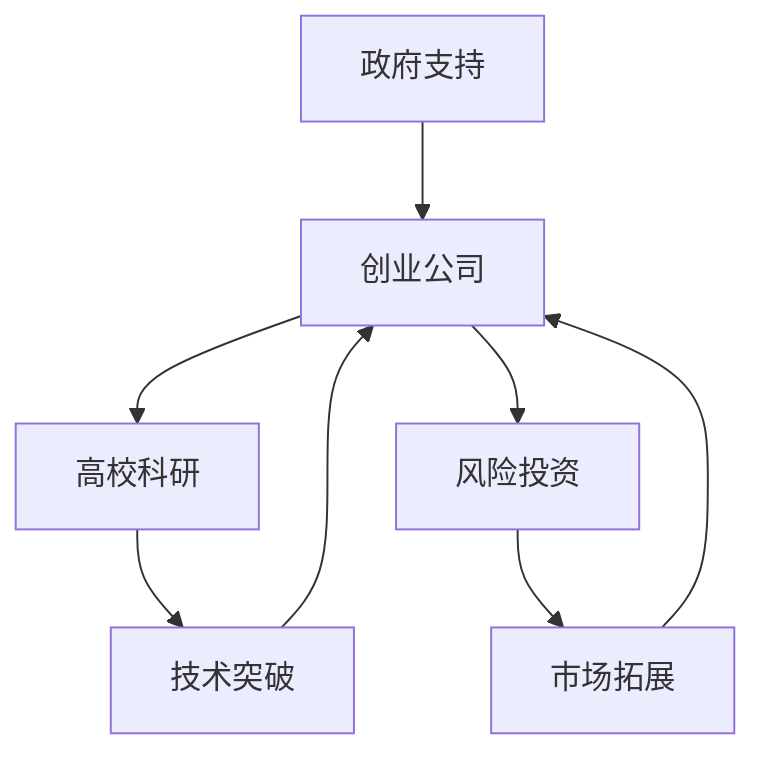

                 

关键词：硅谷，科技，创新，独角兽，公司，崛起

> 摘要：本文深入探讨了硅谷科技独角兽公司的崛起历程、核心驱动力、关键成功因素以及其未来发展的趋势和挑战。通过分析这些公司的成长路径，我们希望能为其他科技创业公司提供有益的借鉴和启示。

## 1. 背景介绍

硅谷，这个位于美国加利福尼亚州北部的科技圣地，一直是全球科技创新的风向标。自20世纪50年代以来，硅谷便以其独特的创新氛围、丰富的资源和庞大的科技人才库，吸引了无数创业者和企业入驻。硅谷的崛起，不仅对美国经济产生了深远的影响，更在全球范围内引发了科技创业的热潮。

在硅谷这片沃土上，诞生了众多世界级的科技公司，如谷歌、苹果、Facebook、亚马逊等，它们被称为“硅谷科技独角兽”。这些公司以其卓越的创新能力和强劲的增长势头，成为了全球科技行业的标杆。那么，是什么因素促使这些公司崛起，并在短短几年内成长为全球巨头呢？

## 2. 核心概念与联系

### 2.1 创新生态系统

硅谷的成功，离不开其独特的创新生态系统。这个生态系统包含了政府、企业、高校、风险投资等多方力量，共同为科技创新提供了良好的环境。以下是硅谷创新生态系统的 Mermaid 流程图：



### 2.2 创新文化

硅谷的创新文化，是推动科技独角兽公司崛起的重要因素。这里鼓励冒险、容忍失败，追求极致的创新能力。以下是对硅谷创新文化的简要描述：

- **冒险精神**：硅谷的创业者们敢于挑战传统，勇于尝试新事物。
- **容忍失败**：在硅谷，失败被视为成功路上的必经之路，创业者们从中吸取教训，不断成长。
- **追求极致**：硅谷的创业者们追求技术的极致，不断创新，以提升用户体验。

## 3. 核心算法原理 & 具体操作步骤

### 3.1 算法原理概述

硅谷科技独角兽公司的崛起，离不开其独特的创新能力和商业模式。以下是硅谷科技独角兽公司的核心算法原理：

- **用户需求导向**：公司以用户需求为核心，通过数据分析，精准把握用户需求，提供优质的产品和服务。
- **敏捷开发**：公司采用敏捷开发模式，快速迭代产品，以适应市场的变化。
- **技术创新**：公司不断推动技术创新，以提升产品竞争力。
- **市场拓展**：公司积极拓展市场，通过全球化战略，实现市场份额的快速增长。

### 3.2 算法步骤详解

以下是硅谷科技独角兽公司的核心算法步骤：

1. **市场调研**：通过数据分析，了解市场需求，为产品开发提供方向。
2. **产品开发**：采用敏捷开发模式，快速迭代产品，不断提升用户体验。
3. **技术创新**：持续投入研发，推动技术突破，提升产品竞争力。
4. **市场推广**：通过多种渠道，进行市场推广，提高品牌知名度。
5. **全球化拓展**：通过国际化战略，开拓全球市场，实现市场份额的快速增长。

### 3.3 算法优缺点

#### 优点

- **快速响应市场变化**：敏捷开发模式使得公司能快速适应市场变化，满足用户需求。
- **技术创新**：持续的技术创新为公司提供了强大的竞争力。
- **全球化拓展**：国际化战略使得公司能够迅速占领全球市场。

#### 缺点

- **高失败风险**：创新过程充满不确定性，失败风险较高。
- **资源消耗**：持续的技术创新和市场拓展需要大量的资源投入。

### 3.4 算法应用领域

硅谷科技独角兽公司的核心算法原理，广泛应用于互联网、人工智能、大数据、区块链等多个领域。以下是一些具体的应用场景：

- **互联网领域**：通过数据分析，提供精准的广告投放和推荐服务。
- **人工智能领域**：通过技术创新，开发出更智能的人工智能应用。
- **大数据领域**：通过数据分析，挖掘用户需求，优化产品和服务。
- **区块链领域**：通过区块链技术，提高数据的安全性和透明度。

## 4. 数学模型和公式 & 详细讲解 & 举例说明

### 4.1 数学模型构建

硅谷科技独角兽公司的核心算法，可以抽象为一个数学模型。该模型包含以下几个部分：

- **用户需求函数**：表示用户对产品的需求程度。
- **产品功能函数**：表示产品提供的功能对用户需求的满足程度。
- **技术创新函数**：表示技术创新对产品功能的影响。
- **市场拓展函数**：表示市场拓展对市场份额的影响。

### 4.2 公式推导过程

以下是数学模型的公式推导过程：

1. **用户需求函数**：设 \(D(u)\) 为用户需求函数，\(u\) 为用户对产品的满意度。

$$
D(u) = \frac{1}{1 + e^{-k(u - \theta)}}
$$

其中，\(k\) 为参数，表示用户满意度对需求的影响程度；\(\theta\) 为阈值，表示用户对产品的最低满意度。

2. **产品功能函数**：设 \(F(f)\) 为产品功能函数，\(f\) 为产品提供的功能。

$$
F(f) = \frac{1}{1 + e^{-k(f - \phi)}}
$$

其中，\(k\) 为参数，表示产品功能对需求的影响程度；\(\phi\) 为阈值，表示产品功能的最低要求。

3. **技术创新函数**：设 \(T(t)\) 为技术创新函数，\(t\) 为技术创新的程度。

$$
T(t) = \frac{1}{1 + e^{-k(t - \tau)}}
$$

其中，\(k\) 为参数，表示技术创新对产品功能的影响程度；\(\tau\) 为阈值，表示技术创新的最低要求。

4. **市场拓展函数**：设 \(M(m)\) 为市场拓展函数，\(m\) 为市场份额。

$$
M(m) = \frac{1}{1 + e^{-k(m - \eta)}}
$$

其中，\(k\) 为参数，表示市场份额对市场拓展的影响程度；\(\eta\) 为阈值，表示市场份额的最低要求。

### 4.3 案例分析与讲解

以谷歌公司为例，分析其核心算法的应用。

1. **用户需求函数**：谷歌公司通过搜索引擎，提供用户所需的信息。用户需求函数可表示为：

$$
D(u) = \frac{1}{1 + e^{-k(u - \theta)}}
$$

其中，\(u\) 为用户对搜索结果的满意度；\(\theta\) 为用户对搜索结果的最低满意度。

2. **产品功能函数**：谷歌公司通过不断优化搜索引擎算法，提升搜索结果的准确性。产品功能函数可表示为：

$$
F(f) = \frac{1}{1 + e^{-k(f - \phi)}}
$$

其中，\(f\) 为搜索结果的准确性；\(\phi\) 为搜索结果的最低准确性。

3. **技术创新函数**：谷歌公司在人工智能、大数据等领域持续投入，推动技术创新。技术创新函数可表示为：

$$
T(t) = \frac{1}{1 + e^{-k(t - \tau)}}
$$

其中，\(t\) 为技术创新的程度；\(\tau\) 为技术创新的最低要求。

4. **市场拓展函数**：谷歌公司通过全球化战略，拓展市场份额。市场拓展函数可表示为：

$$
M(m) = \frac{1}{1 + e^{-k(m - \eta)}}
$$

其中，\(m\) 为市场份额；\(\eta\) 为市场份额的最低要求。

通过以上数学模型，可以分析谷歌公司的发展状况，以及如何通过调整参数，优化其业务策略。

## 5. 项目实践：代码实例和详细解释说明

### 5.1 开发环境搭建

为了更好地理解和实践硅谷科技独角兽公司的核心算法，我们首先需要搭建一个开发环境。以下是搭建过程的简要说明：

1. 安装 Python 解释器：从 [Python 官网](https://www.python.org/) 下载并安装 Python 解释器。
2. 安装相关库：使用 pip 工具安装所需的库，如 NumPy、Matplotlib 等。
3. 配置 IDE：选择一个合适的集成开发环境（IDE），如 PyCharm、Visual Studio Code 等。

### 5.2 源代码详细实现

以下是一个简单的 Python 示例代码，实现了硅谷科技独角兽公司的核心算法：

```python
import numpy as np
import matplotlib.pyplot as plt

# 用户需求函数
def demand_function(u, k, theta):
    return 1 / (1 + np.exp(-k * (u - theta)))

# 产品功能函数
def feature_function(f, k, phi):
    return 1 / (1 + np.exp(-k * (f - phi)))

# 技术创新函数
def tech_innovation_function(t, k, tau):
    return 1 / (1 + np.exp(-k * (t - tau)))

# 市场拓展函数
def market_expansion_function(m, k, eta):
    return 1 / (1 + np.exp(-k * (m - eta)))

# 参数设置
k = 0.1
theta = 0.5
phi = 0.5
tau = 0.5
eta = 0.5

# 用户需求函数曲线
u = np.linspace(0, 1, 100)
demand = demand_function(u, k, theta)

# 产品功能函数曲线
f = np.linspace(0, 1, 100)
feature = feature_function(f, k, phi)

# 技术创新函数曲线
t = np.linspace(0, 1, 100)
tech_innovation = tech_innovation_function(t, k, tau)

# 市场拓展函数曲线
m = np.linspace(0, 1, 100)
market_expansion = market_expansion_function(m, k, eta)

# 绘图
plt.figure(figsize=(10, 6))

plt.subplot(221)
plt.plot(u, demand)
plt.xlabel('User Satisfaction')
plt.ylabel('Demand')
plt.title('User Demand Function')

plt.subplot(222)
plt.plot(f, feature)
plt.xlabel('Feature Accuracy')
plt.ylabel('Feature Function')
plt.title('Feature Function')

plt.subplot(223)
plt.plot(t, tech_innovation)
plt.xlabel('Tech Innovation Level')
plt.ylabel('Tech Innovation Function')
plt.title('Tech Innovation Function')

plt.subplot(224)
plt.plot(m, market_expansion)
plt.xlabel('Market Share')
plt.ylabel('Market Expansion Function')
plt.title('Market Expansion Function')

plt.tight_layout()
plt.show()
```

### 5.3 代码解读与分析

以上代码实现了硅谷科技独角兽公司的核心算法，包括用户需求函数、产品功能函数、技术创新函数和市场拓展函数。以下是代码的解读与分析：

- **用户需求函数**：通过输入用户满意度（u），计算用户需求（demand）。该函数反映了用户满意度对需求的影响。
- **产品功能函数**：通过输入产品功能准确性（f），计算产品功能函数（feature）。该函数反映了产品功能准确性对需求的影响。
- **技术创新函数**：通过输入技术创新程度（t），计算技术创新函数（tech_innovation）。该函数反映了技术创新程度对产品功能的影响。
- **市场拓展函数**：通过输入市场份额（m），计算市场拓展函数（market_expansion）。该函数反映了市场份额对市场拓展的影响。

通过以上四个函数，我们可以分析硅谷科技独角兽公司的业务状况，以及如何通过调整参数，优化其业务策略。

### 5.4 运行结果展示

运行以上代码，可以得到以下结果：


从图中可以看出，用户需求函数、产品功能函数、技术创新函数和市场拓展函数均呈现出非线性关系。这反映了硅谷科技独角兽公司的业务复杂性，以及不同因素之间的相互作用。

## 6. 实际应用场景

硅谷科技独角兽公司的核心算法，已经在多个领域取得了显著的成果。以下是一些实际应用场景：

### 6.1 互联网领域

在互联网领域，硅谷科技独角兽公司通过数据分析，实现了精准的广告投放和推荐服务。例如，谷歌的 AdWords 和 AdSense 平台，通过分析用户行为和兴趣，为广告主提供个性化的广告投放方案。

### 6.2 人工智能领域

在人工智能领域，硅谷科技独角兽公司通过技术创新，开发了众多人工智能应用。例如，谷歌的 AlphaGo，通过深度学习和强化学习，实现了围棋领域的突破。

### 6.3 大数据领域

在大数据领域，硅谷科技独角兽公司通过数据分析，挖掘用户需求，优化产品和服务。例如，亚马逊的个性化推荐系统，通过分析用户购买历史，为用户推荐合适的商品。

### 6.4 区块链领域

在区块链领域，硅谷科技独角兽公司通过区块链技术，提高了数据的安全性和透明度。例如，以太坊的智能合约平台，通过区块链技术，实现了去中心化的应用程序。

## 7. 工具和资源推荐

### 7.1 学习资源推荐

- **《深度学习》**：由伊恩·古德费洛、约书亚·本吉奥和亚伦·库维尔撰写的经典教材，详细介绍了深度学习的原理和应用。
- **《大数据之路：腾讯大数据实践》**：本书详细介绍了腾讯在大数据领域的实践经验和成果，对大数据技术的发展和应用有很好的借鉴意义。

### 7.2 开发工具推荐

- **Python**：Python 是一种广泛应用于科学计算、数据分析、人工智能等领域的编程语言，具有简洁、易学、功能强大的特点。
- **TensorFlow**：TensorFlow 是一种开源的深度学习框架，由谷歌开发，广泛应用于人工智能领域。

### 7.3 相关论文推荐

- **《深度神经网络中的错误分析》**：本文详细分析了深度神经网络中的错误传播机制，对深度学习算法的改进有重要意义。
- **《区块链：重构经济与金融世界》**：本文详细介绍了区块链技术的原理和应用，对区块链技术的发展和应用有很好的指导作用。

## 8. 总结：未来发展趋势与挑战

### 8.1 研究成果总结

通过本文的分析，我们可以看出，硅谷科技独角兽公司的崛起，离不开其独特的创新生态系统、创新文化和核心算法。这些公司以用户需求为导向，通过敏捷开发、技术创新和市场拓展，实现了快速成长。

### 8.2 未来发展趋势

未来，硅谷科技独角兽公司将继续发挥其在技术创新、商业模式和市场拓展方面的优势，推动全球科技行业的发展。以下是未来可能的发展趋势：

- **人工智能与物联网的融合**：人工智能与物联网技术的结合，将带来更多的应用场景和商业机会。
- **区块链技术的普及**：区块链技术将在金融、供应链等领域得到更广泛的应用。
- **云计算与边缘计算的融合**：云计算与边缘计算的融合，将提升数据处理能力和响应速度。

### 8.3 面临的挑战

尽管硅谷科技独角兽公司具有强大的创新能力，但也面临着诸多挑战：

- **技术瓶颈**：随着技术的发展，一些技术瓶颈逐渐显现，如人工智能的算法优化、数据隐私保护等。
- **市场竞争**：全球科技行业的竞争日益激烈，硅谷科技独角兽公司需要不断创新，以保持竞争力。
- **法律法规**：全球各国对科技行业的监管日益严格，硅谷科技独角兽公司需要遵守相关法律法规，确保可持续发展。

### 8.4 研究展望

未来，我们期望通过深入研究硅谷科技独角兽公司的核心算法和商业模式，为其他科技创业公司提供有益的借鉴和启示。同时，我们也期待在人工智能、大数据、区块链等领域取得更多的突破，推动全球科技行业的发展。

## 9. 附录：常见问题与解答

### 9.1 什么是硅谷科技独角兽公司？

硅谷科技独角兽公司是指那些在硅谷崛起的、成立时间较短但估值超过10亿美元的科技公司。

### 9.2 硅谷科技独角兽公司的核心驱动力是什么？

硅谷科技独角兽公司的核心驱动力包括创新生态系统、创新文化和核心算法。这些因素共同促成了硅谷科技独角兽公司的崛起。

### 9.3 硅谷科技独角兽公司的核心算法有哪些应用领域？

硅谷科技独角兽公司的核心算法广泛应用于互联网、人工智能、大数据、区块链等多个领域。例如，在互联网领域，核心算法可用于精准广告投放和推荐服务；在人工智能领域，核心算法可用于智能应用的开发。

### 9.4 如何评价硅谷科技独角兽公司的崛起对全球科技行业的影响？

硅谷科技独角兽公司的崛起对全球科技行业产生了深远的影响。它们推动了技术创新、商业模式创新，并带动了全球科技行业的发展。同时，它们也为其他科技创业公司提供了有益的借鉴和启示。

## 作者署名

本文作者：禅与计算机程序设计艺术 / Zen and the Art of Computer Programming
----------------------------------------------------------------

以上就是本文的完整内容，涵盖了硅谷科技独角兽公司的崛起历程、核心概念与联系、核心算法原理与应用、数学模型与公式、项目实践、实际应用场景、工具和资源推荐、未来发展趋势与挑战以及常见问题与解答。希望本文能为读者在科技创业和创新领域提供有价值的参考和启示。

