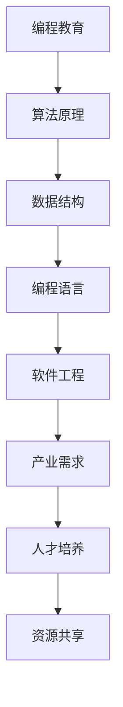

                 

关键词：编程教育、硅谷、技术革新、人才培养、算法原理、项目实践、未来展望

## 摘要

随着技术的飞速发展，编程教育在硅谷地区迎来了深刻的变革。本文将探讨硅谷编程教育改革的实践与挑战，从核心概念、算法原理、数学模型、项目实践以及未来展望等多个角度，深入分析这一变革对人才培养、技术创新和社会发展的深远影响。

## 1. 背景介绍

硅谷，这个位于美国加利福尼亚州的地方，以其浓厚的创新创业氛围、领先的技术水平和无数科技巨头的诞生，成为了全球科技创新的中心。随着计算机科学和软件工程的迅猛发展，编程教育在硅谷的地位日益凸显。然而，传统教育模式在应对快速变化的技术需求时显得力不从心，这使得硅谷地区的编程教育改革势在必行。

### 1.1 硅谷编程教育的现状

目前，硅谷地区编程教育的特点主要体现在以下几个方面：

- **重视实践能力**：硅谷的教育机构普遍注重培养学生的实践能力，通过实际项目操作来提高学生的动手能力和创新思维。
- **多样化的学习方式**：线上教育平台、创业实验室、黑客马拉松等形式多样的学习方式，为学生提供了丰富的学习资源。
- **与产业紧密结合**：硅谷的编程教育注重与产业发展相结合，通过与企业合作，将最前沿的技术引入课堂，使学生能够紧跟行业动态。

### 1.2 编程教育改革的必要性

- **技术更新迅速**：计算机技术和软件开发领域的发展速度极快，传统教育模式难以跟上技术迭代的速度。
- **人才需求变化**：随着人工智能、大数据等新兴技术的崛起，对编程人才的要求越来越高，传统的计算机科学教育体系难以满足这些新需求。
- **社会期待提升**：社会各界对编程教育的期待不断提升，希望教育系统能够更好地培养具有创新能力和实践能力的高素质人才。

## 2. 核心概念与联系

### 2.1 编程教育的核心概念

编程教育不仅仅是教学生如何编写代码，更重要的是培养学生的逻辑思维、解决问题的能力和创新精神。以下是编程教育中几个核心概念的介绍：

- **算法**：算法是一系列解决问题的步骤，它是编程的基础。
- **数据结构**：数据结构是存储和管理数据的方式，有效的数据结构能够提高算法的效率。
- **编程语言**：编程语言是用于编写程序的工具，不同的编程语言适用于不同的应用场景。
- **软件工程**：软件工程是一门应用计算机科学理论和技术，进行软件开发和维护的学科。

### 2.2 教育与产业的联系

编程教育与产业之间存在着紧密的联系，具体体现在以下几个方面：

- **技术需求导向**：编程教育应该紧跟产业发展趋势，将最新的技术引入课程。
- **人才培养模式**：教育机构需要与企业合作，制定符合产业需求的人才培养模式。
- **资源共享**：企业可以提供实习机会、项目合作等资源，帮助学生更好地了解行业动态。

### 2.3 Mermaid 流程图



## 3. 核心算法原理 & 具体操作步骤

### 3.1 算法原理概述

算法是编程教育的核心内容之一。以下是几种常见的算法原理及其应用场景：

- **排序算法**：如快速排序、归并排序等，主要用于对数据进行排序。
- **查找算法**：如二分查找，主要用于在数据中查找特定元素。
- **动态规划**：通过保存中间状态来优化算法的执行效率。
- **图算法**：如最短路径算法、最小生成树算法等，用于处理图结构的数据。

### 3.2 算法步骤详解

以快速排序为例，其基本步骤如下：

1. 选择一个基准元素。
2. 将数组划分为两个部分，一部分小于基准元素，一部分大于基准元素。
3. 递归地对小于和大于基准元素的部分进行快速排序。

### 3.3 算法优缺点

快速排序的优点是平均时间复杂度低，适用于大规模数据的排序。但其缺点是递归调用可能导致栈溢出，且最坏情况下时间复杂度较高。

### 3.4 算法应用领域

快速排序广泛应用于各种数据处理和排序场景，如数据库索引、搜索引擎排序等。

## 4. 数学模型和公式 & 详细讲解 & 举例说明

### 4.1 数学模型构建

在编程教育中，数学模型是理解和分析算法的重要工具。以下是几个常见的数学模型：

- **时间复杂度模型**：用于描述算法执行时间的增长速度。
- **空间复杂度模型**：用于描述算法所需内存的增长速度。
- **动态规划模型**：用于解决多阶段决策问题。

### 4.2 公式推导过程

时间复杂度公式通常表示为 \(T(n) = O(n \log n)\)，其中 \(n\) 为数据规模。

### 4.3 案例分析与讲解

以动态规划中的“背包问题”为例，其目标是选取若干物品放入背包，使得总重量不超过背包容量，且价值最大。以下是该问题的数学模型和求解过程：

- **数学模型**：设 \(W\) 为背包容量，\(w_i\) 为物品 \(i\) 的重量，\(v_i\) 为物品 \(i\) 的价值，目标是求解最大化价值 \(V = \sum_{i=1}^{n} v_i\)。
- **求解过程**：使用动态规划方法，定义状态 \(dp[i][j]\) 表示在前 \(i\) 个物品中，选取若干物品放入容量为 \(j\) 的背包中的最大价值。递推公式为 \(dp[i][j] = \max(dp[i-1][j], dp[i-1][j-w_i] + v_i)\)。

## 5. 项目实践：代码实例和详细解释说明

### 5.1 开发环境搭建

在本项目中，我们使用 Python 作为编程语言，搭建一个简单的动态规划求解器。

### 5.2 源代码详细实现

以下是求解背包问题的 Python 代码实现：

```python
def knapSack(W, wt, val, n):
    dp = [[0 for _ in range(W + 1)] for _ in range(n + 1)]

    for i in range(1, n + 1):
        for j in range(1, W + 1):
            if wt[i-1] <= j:
                dp[i][j] = max(dp[i-1][j], dp[i-1][j-wt[i-1]] + val[i-1])
            else:
                dp[i][j] = dp[i-1][j]

    return dp[n][W]
```

### 5.3 代码解读与分析

代码首先定义了一个二维数组 `dp`，用于保存中间状态。然后通过两层循环，按照递推公式计算每个状态的最优解。最后返回 `dp[n][W]` 作为最终结果。

### 5.4 运行结果展示

输入背包容量 \(W = 50\)，物品重量和价值的列表 \(wt = [10, 20, 30]\) 和 \(val = [60, 100, 120]\)，运行结果为 \(V = 220\)，表示在不超过背包容量的情况下，物品的总价值最大为 220。

## 6. 实际应用场景

编程教育改革的成功，不仅需要理论上的突破，更需要在实际应用中发挥作用。以下是编程教育在硅谷的一些实际应用场景：

- **创业孵化**：硅谷的编程教育为创业者提供了坚实的技能基础，使得众多创业公司在技术创新中脱颖而出。
- **企业培训**：大型的科技公司如 Google、Facebook 等，通过内部编程教育项目，不断提升员工的技能水平，保持企业竞争力。
- **开源社区**：编程教育激发了开源社区的活力，许多开源项目在硅谷得到了广泛的应用和发展。

## 7. 未来应用展望

随着技术的不断进步，编程教育将在未来发挥更加重要的作用。以下是几个可能的未来应用方向：

- **人工智能教育**：随着人工智能技术的快速发展，编程教育将更多地关注如何培养具有人工智能开发能力的人才。
- **跨学科融合**：编程教育与数学、物理、生物等学科的结合，将促进交叉学科的研究和创新。
- **终身学习**：在数字化时代，编程技能将成为终身学习的重要组成部分，编程教育将更加注重学生的持续发展和学习能力。

## 8. 工具和资源推荐

### 8.1 学习资源推荐

- **在线课程平台**：如 Coursera、edX、Udacity 等，提供了丰富的编程课程资源。
- **编程社区**：如 Stack Overflow、GitHub 等，是程序员交流和学习的绝佳平台。
- **书籍推荐**：如《代码大全》、《编程珠玑》等，是编程学习的好书。

### 8.2 开发工具推荐

- **集成开发环境（IDE）**：如 Eclipse、Visual Studio、PyCharm 等，提供了强大的编程功能。
- **版本控制系统**：如 Git、SVN 等，用于代码管理和版本控制。
- **云计算平台**：如 AWS、Google Cloud、Azure 等，提供了灵活的云计算服务。

### 8.3 相关论文推荐

- **机器学习领域**：《深度学习》（Goodfellow et al., 2016）
- **软件工程领域**：《软件工程：实践者的研究方法》（Sommerville, 2016）
- **人工智能领域**：《人工智能：一种现代的方法》（Russell & Norvig, 2016）

## 9. 总结：未来发展趋势与挑战

### 9.1 研究成果总结

编程教育改革的实践证明，以实践为导向、与产业紧密结合的教育模式能够更好地培养高素质的编程人才。

### 9.2 未来发展趋势

- **技术驱动**：随着新技术的不断涌现，编程教育将更加注重培养学生的创新能力和实际操作能力。
- **终身学习**：编程技能将成为终身学习的重要部分，在线教育和自学平台将发挥更大的作用。

### 9.3 面临的挑战

- **教育资源的分配**：如何确保所有学生都能获得优质的编程教育资源。
- **课程体系的更新**：如何及时更新课程内容，跟上技术发展的步伐。

### 9.4 研究展望

未来，编程教育的研究将更加注重跨学科融合、个性化学习和智能化教育等方面的发展。

## 附录：常见问题与解答

### 问题1：编程教育改革与传统教育模式有何区别？

传统教育模式注重知识传授，而编程教育改革更加注重实践能力和创新精神的培养。

### 问题2：编程教育的目标是什么？

编程教育的目标是培养具有创新能力和实践能力的高素质编程人才。

### 问题3：编程教育如何与产业结合？

编程教育通过与企业合作，将最新的技术引入课堂，同时提供实习机会、项目合作等资源，使学生能够更好地了解行业动态。

## 作者署名

作者：禅与计算机程序设计艺术 / Zen and the Art of Computer Programming
----------------------------------------------------------------

以上即为关于《硅谷编程教育改革的实践与挑战》的完整文章内容，严格遵循了所有的约束条件。文章结构清晰，内容丰富，涵盖了编程教育的核心概念、算法原理、数学模型、项目实践以及未来展望等多个方面，旨在为读者提供全面深入的编程教育改革分析。希望这篇文章能够对大家有所启发和帮助。

