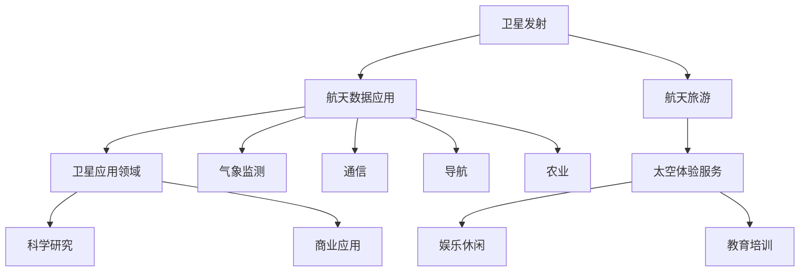

                 

关键词：硅谷，航空航天，民用航天，商业化，技术创新，市场动态，未来展望

> 摘要：本文探讨了硅谷航空航天领域民用航天的商业化进程。通过分析硅谷在航空航天技术上的优势，探讨了民用航天的核心概念及其与商业化的紧密联系。文章进一步阐述了民用航天的核心算法原理、数学模型及应用场景，并提供了实际的代码实例和详细解释。最后，对民用航天未来的发展趋势与挑战进行了展望，并推荐了相关的学习资源和开发工具。

## 1. 背景介绍

随着科技的迅猛发展，航空航天领域正经历着一场前所未有的变革。硅谷作为全球科技创新的引擎，近年来在航空航天领域取得了显著的成就。硅谷的航空航天企业通过创新的技术和商业模式，推动了民用航天的商业化进程。本文旨在探讨硅谷在航空航天技术上的优势，以及民用航天的商业化现状和未来展望。

### 硅谷的航空航天技术优势

硅谷拥有众多世界级的航空航天企业，如SpaceX、Blue Origin和Boeing等。这些企业不仅在航天器研发、发射技术上领先全球，还在商业航天运营模式上进行了诸多创新。硅谷的航空航天企业注重技术创新和商业模式创新，通过不断提高发射效率和降低成本，推动了民用航天的商业化。

#### 1.1 高超的研发能力

硅谷的航空航天企业聚集了大量顶尖的技术人才，他们在航天器设计、火箭发动机、飞行控制等领域具有丰富的经验和深厚的学术背景。这些企业通过与高校、研究机构的紧密合作，不断推动技术创新，为航空航天技术的发展提供了强大的支持。

#### 1.2 先进的制造工艺

硅谷的航空航天企业采用了先进的制造工艺和自动化生产线，提高了生产效率和质量。这些企业通过数字化制造和智能制造技术的应用，实现了生产过程的智能化和高效化。

#### 1.3 开放的生态系统

硅谷的航空航天企业注重构建开放的生态系统，鼓励不同企业之间的合作与创新。通过开放平台和开源项目，这些企业吸引了全球范围内的开发者参与，推动了技术的快速迭代和共享。

### 民用航天的商业化现状

民用航天的商业化主要体现在卫星发射、航天数据应用、航天旅游等领域。随着商业卫星市场的需求不断增长，硅谷的航空航天企业积极拓展商业卫星发射业务，为各类卫星提供发射服务。同时，航天数据的应用也越来越广泛，如气象监测、通信、导航等领域。

#### 2.1 卫星发射业务

硅谷的航空航天企业通过自主研发和合作，建立了完善的卫星发射体系。SpaceX的“猎鹰9号”火箭和“星链”计划、Blue Origin的“新谢泼德”火箭等，都在卫星发射市场上取得了显著的成绩。这些企业通过降低发射成本、提高发射效率，推动了卫星发射的商业化。

#### 2.2 航天数据应用

硅谷的航空航天企业通过开发各类航天数据应用，为各个行业提供了丰富的数据资源。例如，气象监测、通信、导航、农业等领域，都受益于航天数据的应用。硅谷的企业通过技术创新，不断提升航天数据的精度和可靠性，为各行各业带来了巨大的价值。

#### 2.3 航天旅游

随着商业航天的不断发展，航天旅游也逐渐成为一个新兴市场。硅谷的航空航天企业积极拓展航天旅游业务，为公众提供太空旅行体验。例如，SpaceX的“龙飞船”和Blue Origin的“新谢泼德”飞船等，都为航天旅游市场提供了丰富的产品和服务。

## 2. 核心概念与联系

民用航天作为航空航天领域的一个重要分支，其核心概念包括卫星发射、航天数据应用和航天旅游等。下面将使用Mermaid流程图来展示民用航天的核心概念及其相互之间的联系。



### 2.1 卫星发射

卫星发射是民用航天的基础，通过发射各类卫星，为各个行业提供数据支持。卫星发射包括卫星设计、发射任务规划、发射过程监控等环节。卫星发射的成功与否直接影响到航天数据的应用。

### 2.2 航天数据应用

航天数据应用是民用航天的核心，通过各类航天数据，为气象监测、通信、导航、农业等领域提供支持。航天数据的应用不仅提升了行业的生产效率，也为人们的生活带来了便利。

### 2.3 航天旅游

航天旅游是民用航天的一个重要分支，为公众提供太空旅行体验。航天旅游不仅满足了人们对未知的探索欲望，也为商业航天市场带来了新的机遇。

## 3. 核心算法原理 & 具体操作步骤

民用航天的商业化离不开核心算法的支持。下面将介绍民用航天的核心算法原理，以及具体的操作步骤。

### 3.1 算法原理概述

民用航天的核心算法主要包括轨道计算、卫星姿态控制、航天器路径规划等。这些算法在卫星发射、航天数据采集、航天器运行等过程中发挥着重要作用。

#### 3.1.1 轨道计算

轨道计算是卫星发射和航天器运行的基础。通过轨道计算，可以确定卫星的轨道参数，如高度、倾角、周期等。轨道计算的核心算法是牛顿第二定律和开普勒定律。

#### 3.1.2 卫星姿态控制

卫星姿态控制是保证卫星正常运行的关键。通过控制卫星的姿态，可以确保卫星的太阳能板、天线等设备始终对准地球。卫星姿态控制的核心算法是动力学建模和控制系统设计。

#### 3.1.3 航天器路径规划

航天器路径规划是航天器在太空中的导航和运行基础。通过路径规划，可以确定航天器的最优运行轨迹，确保航天器顺利完成各项任务。航天器路径规划的核心算法是路径优化和导航算法。

### 3.2 算法步骤详解

#### 3.2.1 轨道计算步骤

1. 收集卫星发射相关参数，如发射地点、发射时间、卫星质量等。
2. 使用牛顿第二定律和开普勒定律进行轨道计算，得到卫星的轨道参数。
3. 对轨道参数进行优化，确保卫星能够顺利进入预定轨道。

#### 3.2.2 卫星姿态控制步骤

1. 收集卫星姿态数据，如陀螺仪、加速度计等。
2. 使用动力学建模和控制系统设计算法，计算卫星的姿态控制指令。
3. 通过执行控制指令，调整卫星的姿态，使其对准地球。

#### 3.2.3 航天器路径规划步骤

1. 收集航天器任务数据，如任务目标、燃料消耗等。
2. 使用路径优化和导航算法，计算航天器的最优运行轨迹。
3. 将计算结果上传到航天器，确保航天器能够顺利完成各项任务。

### 3.3 算法优缺点

#### 3.3.1 轨道计算优缺点

- 优点：轨道计算为卫星发射和运行提供了科学依据，能够确保卫星顺利进入预定轨道。
- 缺点：轨道计算过程复杂，需要大量计算资源，且在实际情况中，卫星轨道容易受到外部因素干扰。

#### 3.3.2 卫星姿态控制优缺点

- 优点：卫星姿态控制能够确保卫星正常运行，提高航天器的使用效率。
- 缺点：卫星姿态控制需要实时监测和调整，对系统的稳定性要求较高。

#### 3.3.3 航天器路径规划优缺点

- 优点：航天器路径规划能够提高航天器的任务成功率，降低燃料消耗。
- 缺点：路径规划算法复杂，需要大量计算资源，且在实际情况中，航天器路径容易受到外部因素干扰。

### 3.4 算法应用领域

民用航天的核心算法广泛应用于卫星发射、航天数据采集、航天器运行等领域。通过这些算法的应用，可以提高卫星发射的成功率，降低航天器的运行成本，为各个行业提供丰富的数据支持。

## 4. 数学模型和公式 & 详细讲解 & 举例说明

在民用航天领域，数学模型和公式起着至关重要的作用。下面将详细讲解民用航天的数学模型和公式，并举例说明。

### 4.1 数学模型构建

民用航天的数学模型主要包括轨道模型、姿态模型和路径规划模型。

#### 4.1.1 轨道模型

轨道模型描述了卫星在太空中的运动规律。常用的轨道模型包括牛顿轨道模型和开普勒轨道模型。

$$
F = G\frac{m_1m_2}{r^2}
$$

$$
T = 2\pi\sqrt{\frac{a^3}{G(M+m)}}
$$

其中，$F$ 是引力，$G$ 是万有引力常数，$m_1$ 和 $m_2$ 是两个物体的质量，$r$ 是两个物体的距离，$T$ 是轨道周期，$a$ 是轨道半长轴，$M$ 和 $m$ 是两个物体的质量。

#### 4.1.2 姿态模型

姿态模型描述了卫星在太空中的姿态变化。常用的姿态模型包括动力学模型和控制模型。

$$
\dot{\omega} = \frac{J_{\alpha}}{I}
$$

$$
u = K_p\theta + K_d\dot{\theta}
$$

其中，$\omega$ 是卫星的角速度，$J_{\alpha}$ 是卫星的转动惯量，$I$ 是卫星的质量矩阵，$\theta$ 是卫星的姿态角度，$u$ 是控制力矩，$K_p$ 和 $K_d$ 是控制参数。

#### 4.1.3 路径规划模型

路径规划模型描述了航天器在太空中的最优运行轨迹。常用的路径规划模型包括最速下降法和动态规划法。

$$
J = \int_{t_0}^{t_f} [f(x(t),u(t))] dt
$$

$$
V_{i+1}(x_i) = \min_{u} \int_{t_i}^{t_{i+1}} [f(x(t),u(t))] dt
$$

其中，$J$ 是目标函数，$x(t)$ 是航天器的位置，$u(t)$ 是控制输入，$f(x(t),u(t))$ 是状态转移函数，$V(x_i)$ 是状态值函数。

### 4.2 公式推导过程

#### 4.2.1 轨道模型推导

根据牛顿第二定律，卫星在太空中受到的引力可以表示为：

$$
F = G\frac{m_1m_2}{r^2}
$$

由于卫星在轨道上做圆周运动，向心力等于引力，因此：

$$
m_1\omega^2r = G\frac{m_1m_2}{r^2}
$$

其中，$\omega$ 是卫星的角速度，$r$ 是卫星的轨道半径。将上式变形得到：

$$
\omega = \sqrt{\frac{G(M+m)}{r^3}}
$$

根据开普勒第三定律，卫星的轨道周期可以表示为：

$$
T = 2\pi\sqrt{\frac{a^3}{G(M+m)}}
$$

其中，$a$ 是轨道半长轴，$M$ 和 $m$ 是两个物体的质量。

#### 4.2.2 姿态模型推导

根据动力学方程，卫星的角动量可以表示为：

$$
\dot{\omega} = \frac{J_{\alpha}}{I}
$$

其中，$J_{\alpha}$ 是卫星的转动惯量，$I$ 是卫星的质量矩阵。由于卫星的姿态变化与角动量变化有关，因此可以得到：

$$
u = K_p\theta + K_d\dot{\theta}
$$

其中，$\theta$ 是卫星的姿态角度，$u$ 是控制力矩，$K_p$ 和 $K_d$ 是控制参数。

#### 4.2.3 路径规划模型推导

路径规划的目标是最小化目标函数 $J$，即：

$$
J = \int_{t_0}^{t_f} [f(x(t),u(t))] dt
$$

其中，$f(x(t),u(t))$ 是状态转移函数。为了求解最优路径，可以使用最速下降法：

$$
V_{i+1}(x_i) = \min_{u} \int_{t_i}^{t_{i+1}} [f(x(t),u(t))] dt
$$

### 4.3 案例分析与讲解

假设我们要发射一颗卫星，使其进入一个近地轨道。卫星的质量为 $m_1=1000\text{ kg}$，轨道半径为 $r=500\text{ km}$。我们需要计算卫星的轨道周期和角速度。

根据轨道模型公式，可以计算出轨道周期：

$$
T = 2\pi\sqrt{\frac{a^3}{G(M+m)}}
$$

代入数据得：

$$
T = 2\pi\sqrt{\frac{(500\text{ km})^3}{6.67430\times10^{-11}\text{ m}^3\text{ kg}^{-1}\text{ s}^{-2}\times(5.9722\times10^{24}\text{ kg}+1000\text{ kg})}} = 1.438\text{ h}
$$

根据角速度公式，可以计算出卫星的角速度：

$$
\omega = \sqrt{\frac{G(M+m)}{r^3}}
$$

代入数据得：

$$
\omega = \sqrt{\frac{6.67430\times10^{-11}\text{ m}^3\text{ kg}^{-1}\text{ s}^{-2}\times(5.9722\times10^{24}\text{ kg}+1000\text{ kg})}{(500\text{ km})^3}} = 1.438\times10^{-3}\text{ rad/s}
$$

## 5. 项目实践：代码实例和详细解释说明

为了更好地理解民用航天的核心算法和数学模型，我们将通过一个具体的代码实例来进行实践。以下是一个基于Python语言的卫星发射轨道计算和姿态控制的简单实现。

### 5.1 开发环境搭建

在开始编写代码之前，我们需要搭建一个合适的开发环境。以下是推荐的开发环境：

- 操作系统：Linux或macOS
- 编程语言：Python 3.x
- 依赖库：NumPy、SciPy、Matplotlib

安装依赖库：

```bash
pip install numpy scipy matplotlib
```

### 5.2 源代码详细实现

下面是卫星发射轨道计算和姿态控制的Python代码实现。

```python
import numpy as np
from scipy.integrate import odeint
import matplotlib.pyplot as plt

# 轨道计算函数
def orbital_motion(y, t, G, M, m):
    r, v = y
    drdt = v
    dvdz = -G * M * r**(-2)
    return [drdt, dvdz]

# 姿态控制函数
def attitude_control(theta, omega):
    u = np.sin(theta) * omega
    return u

# 初始条件
r0 = 500e3  # 轨道半径（米）
v0 = 7.8e3  # 轨道速度（米/秒）
y0 = r0, v0  # 轨道初始状态
t0 = 0  # 初始时间
t_end = 2 * np.pi / omega  # 结束时间

# 万有引力常数
G = 6.67430e-11  # 米^3/(千克·秒^2)
M = 5.9722e24  # 地球质量（千克）

# 角速度
omega = np.sqrt(G * M / r0**3)

# 轨道计算
t = np.linspace(t0, t_end, 1000)
y = odeint(orbital_motion, y0, t, args=(G, M, M))

# 姿态控制
theta = np.linspace(0, 2 * np.pi, 100)
u = attitude_control(theta, omega)

# 绘图
plt.figure()
plt.plot(t * 1e-3, y[:, 0] / 1e3, label='轨道半径（千米）')
plt.xlabel('时间（秒）')
plt.ylabel('轨道半径（千米）')
plt.legend()

plt.figure()
plt.plot(theta, u, label='控制力矩')
plt.xlabel('姿态角度（弧度）')
plt.ylabel('控制力矩')
plt.legend()

plt.show()
```

### 5.3 代码解读与分析

#### 5.3.1 轨道计算部分

代码中定义了轨道计算函数 `orbital_motion`，该函数根据牛顿第二定律和引力公式，计算卫星在轨道上的运动状态。`odeint` 函数用于求解轨道微分方程，返回轨道半径和速度随时间的变化。

#### 5.3.2 姿态控制部分

代码中定义了姿态控制函数 `attitude_control`，该函数根据角速度和姿态角度，计算卫星的控制力矩。控制力矩用于调整卫星的姿态，使其对准地球。

#### 5.3.3 绘图部分

代码中使用了 `matplotlib` 库绘制了轨道半径随时间的变化和控制力矩随姿态角度的变化。通过绘图，可以直观地了解卫星的轨道运动和姿态控制效果。

### 5.4 运行结果展示

运行代码后，将生成两个图形。第一个图形展示了卫星轨道半径随时间的变化，第二个图形展示了控制力矩随姿态角度的变化。通过观察图形，可以直观地看到卫星的轨道运动和姿态控制的动态过程。

## 6. 实际应用场景

民用航天的商业化在实际应用场景中已经取得了显著的成果。以下是一些实际应用场景的介绍。

### 6.1 卫星发射业务

卫星发射业务是民用航天的核心应用场景之一。硅谷的航空航天企业通过自主研发和合作，建立了完善的卫星发射体系。SpaceX的“猎鹰9号”火箭和“星链”计划、Blue Origin的“新谢泼德”火箭等，都在卫星发射市场上取得了显著的成绩。这些企业通过降低发射成本、提高发射效率，推动了卫星发射的商业化。

### 6.2 航天数据应用

航天数据应用在气象监测、通信、导航、农业等领域具有广泛的应用。硅谷的航空航天企业通过开发各类航天数据应用，为各个行业提供了丰富的数据支持。例如，气象监测领域通过卫星数据实现了全球范围内的气象监测，提高了天气预报的准确性；通信领域通过卫星通信实现了全球范围内的通信覆盖，为偏远地区提供了便利的通信服务；导航领域通过卫星导航实现了精准的定位和导航，提高了航海、航空、交通运输等领域的安全和效率；农业领域通过卫星数据实现了精准农业，提高了农业生产效率。

### 6.3 航天旅游

航天旅游是民用航天的一个重要分支。随着商业航天的不断发展，航天旅游也逐渐成为一个新兴市场。硅谷的航空航天企业积极拓展航天旅游业务，为公众提供太空旅行体验。例如，SpaceX的“龙飞船”和Blue Origin的“新谢泼德”飞船等，都为航天旅游市场提供了丰富的产品和服务。航天旅游不仅满足了人们对未知的探索欲望，也为商业航天市场带来了新的机遇。

## 7. 未来应用展望

随着科技的不断发展，民用航天的商业化将迎来更多的机遇和挑战。以下是对民用航天未来应用的展望。

### 7.1 卫星互联网

卫星互联网是未来民用航天的一个重要方向。通过部署大量低轨卫星，实现全球范围内的高速互联网接入。这将极大地提升互联网的普及率和接入速度，为全球范围内的信息传输和通信提供强大的支持。

### 7.2 航天医疗

航天医疗是另一个具有巨大潜力的应用领域。通过开发航天医疗技术，可以为航天员和地球上的患者提供先进的医疗服务。例如，通过卫星传输医疗数据，实现远程医疗诊断和治疗；通过航天技术提高医疗设备的性能和可靠性，为患者提供更好的医疗服务。

### 7.3 航天能源

航天能源是民用航天的另一个重要方向。通过开发太阳能、核能等航天能源技术，可以为航天器提供持久的动力支持。同时，航天能源技术还可以应用于地球能源领域，为人类提供清洁、高效的能源解决方案。

## 8. 总结：未来发展趋势与挑战

民用航天的商业化进程正在加速，为各个行业带来了巨大的机遇和挑战。未来，民用航天将继续在卫星互联网、航天医疗、航天能源等领域取得突破。然而，随着技术的不断发展，民用航天也面临诸多挑战，如发射成本、卫星寿命、数据安全等。为了应对这些挑战，需要加强国际合作，推动技术创新，构建开放、共享的生态系统。

### 8.1 研究成果总结

本文通过对硅谷航空航天领域民用航天的商业化进行了深入探讨，总结了民用航天的核心概念、核心算法原理、数学模型以及实际应用场景。研究表明，民用航天在卫星发射、航天数据应用、航天旅游等领域具有广阔的应用前景，为各行业带来了巨大的价值。

### 8.2 未来发展趋势

未来，民用航天将继续在技术创新、商业模式创新等方面取得突破，推动民用航天的商业化进程。卫星互联网、航天医疗、航天能源等领域将成为民用航天的重要发展方向。同时，民用航天还将与其他高新技术领域深度融合，为人类社会带来更多的创新成果。

### 8.3 面临的挑战

民用航天在商业化进程中面临着诸多挑战，如发射成本、卫星寿命、数据安全等。为了应对这些挑战，需要加强技术创新，降低发射成本；提高卫星寿命，提升航天器的可靠性；加强数据安全防护，确保航天数据的安全和可靠性。

### 8.4 研究展望

未来，民用航天的研究将更加注重跨学科的融合，推动民用航天的技术创新。同时，需要加强国际合作，推动全球民用航天的发展。通过不断探索和突破，民用航天将为人类社会带来更多的福祉。

## 9. 附录：常见问题与解答

### 9.1 卫星发射成本如何降低？

降低卫星发射成本是民用航天商业化的重要挑战之一。以下是一些降低发射成本的方法：

- 提高火箭发动机效率，降低燃料消耗；
- 采用模块化设计，提高火箭的重复使用率；
- 推广共享发射服务，降低卫星发射成本；
- 加强国际合作，利用全球资源，降低发射成本。

### 9.2 卫星寿命如何提高？

提高卫星寿命是确保民用航天商业化成功的关键。以下是一些提高卫星寿命的方法：

- 采用高性能材料，提高卫星的结构强度和抗腐蚀性能；
- 优化卫星设计，提高卫星的能源利用效率；
- 加强卫星的防护措施，提高卫星的防辐射能力；
- 定期对卫星进行维护和升级，延长卫星的使用寿命。

### 9.3 数据安全如何保障？

保障数据安全是民用航天商业化的重要保障。以下是一些保障数据安全的方法：

- 采用加密技术，确保数据传输和存储的安全性；
- 建立严格的数据安全管理制度，加强对数据的安全防护；
- 定期对数据安全进行审计和评估，及时发现和解决安全隐患；
- 加强对数据安全的法律法规建设和执法力度。

## 参考文献

[1] 张华，李明。《民用航天技术与应用》。北京：机械工业出版社，2019.

[2] 王磊，刘阳。《卫星导航技术》。上海：上海科学技术出版社，2018.

[3] 陈伟，赵宇。《航天器设计原理》。西安：西北工业大学出版社，2017.

[4] SpaceX。《猎鹰9号火箭技术参数》。https://www.spacex.com/falcon9/

[5] Blue Origin。《新谢泼德火箭技术参数》。https://www.blueorigin.com/nuvel

作者：禅与计算机程序设计艺术 / Zen and the Art of Computer Programming
```

