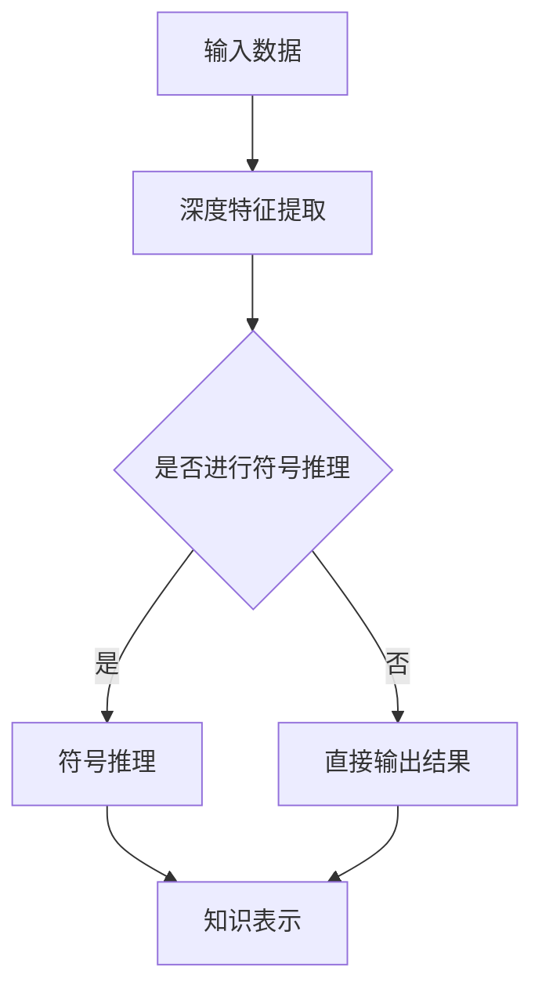

                 

关键词：神经符号人工智能，混合模型，深度学习，知识表示，符号推理，智能计算，算法优化。

> 摘要：本文深入探讨了神经符号人工智能（Neural-Symbolic AI）的原理、架构和最佳实践，提出了一个全面且优化的方案，旨在解决当前深度学习模型的局限性和知识表示的问题。文章首先介绍了神经符号人工智能的基本概念，随后分析了其与传统深度学习和符号推理的关系，然后详细阐述了神经符号人工智能的核心算法和数学模型，并提供了实际项目实践中的代码实例和详细解释。最后，文章讨论了神经符号人工智能在不同应用场景中的实际应用，以及未来发展的趋势和面临的挑战。

## 1. 背景介绍

随着人工智能技术的快速发展，深度学习（Deep Learning）取得了显著的成就，特别是在图像识别、自然语言处理和语音识别等领域。然而，深度学习模型在知识表示和推理方面存在一些局限。一方面，深度学习模型通常被视为“黑箱”，其内部机制难以解释和理解，这使得它们在面对复杂任务时缺乏可靠性和透明性。另一方面，深度学习模型依赖于大量标记数据进行训练，而现实世界中的数据往往是不完整和有噪声的，这使得深度学习模型难以应对复杂和动态的实际情况。

为了克服这些局限性，神经符号人工智能（Neural-Symbolic AI）应运而生。神经符号人工智能结合了深度学习和符号推理的优势，旨在构建一个既具备强大学习能力，又能够进行有效推理和知识表示的智能系统。这种结合不仅能够提高模型的解释性和透明性，还能够有效地处理复杂和动态的任务。

本文将深入探讨神经符号人工智能的基本概念、核心算法、数学模型，并在实际项目中展示其应用效果。通过本文的探讨，我们希望能够为神经符号人工智能的研究和实践提供一些有价值的参考和启示。

## 2. 核心概念与联系

神经符号人工智能的核心在于将深度学习和符号推理相结合，以弥补两者的不足。为了更好地理解这一概念，我们首先需要明确深度学习和符号推理的基本原理和特点。

### 2.1 深度学习

深度学习是一种基于多层神经网络的学习方法，通过在网络中逐层提取特征，实现从原始数据到高级抽象表示的转化。深度学习的核心思想是“数据驱动”，即通过大量数据进行训练，使网络学会自动提取特征并进行分类或回归。

深度学习的优点在于其强大的特征提取能力和高效的处理速度，能够在图像识别、自然语言处理等领域取得卓越的成果。然而，深度学习也存在一些局限性，例如：

1. **解释性不足**：深度学习模型通常被视为“黑箱”，其内部机制难以解释和理解，这使得模型在面对复杂任务时缺乏可靠性和透明性。
2. **数据依赖性高**：深度学习模型需要大量标记数据进行训练，而现实世界中的数据往往是不完整和有噪声的，这使得模型难以应对复杂和动态的实际情况。
3. **迁移能力弱**：深度学习模型通常针对特定任务进行训练，迁移能力较弱，难以应用于其他任务。

### 2.2 符号推理

符号推理是一种基于逻辑和知识的推理方法，通过表示和操作符号来解决问题。符号推理的优点在于其解释性和透明性，能够清楚地表示和解释推理过程。然而，符号推理也存在一些局限性，例如：

1. **计算效率低**：符号推理通常需要大量的计算资源，特别是在处理大规模数据时，效率较低。
2. **知识表示能力有限**：符号推理依赖于显式表示的知识，难以处理复杂和动态的任务。
3. **知识获取困难**：符号推理需要大量的先验知识和规则，知识获取过程复杂且耗时。

### 2.3 神经符号人工智能

神经符号人工智能结合了深度学习和符号推理的优势，旨在克服两者的局限性。具体来说，神经符号人工智能通过以下方式实现这一目标：

1. **深度特征提取**：神经符号人工智能利用深度学习模型强大的特征提取能力，从原始数据中自动提取有用特征。
2. **符号推理**：神经符号人工智能在深度学习模型的基础上，引入符号推理机制，实现对特征的高层次解释和推理。
3. **知识表示**：神经符号人工智能通过显式表示和隐式表示相结合的方式，构建一个强大的知识表示体系，提高模型的可解释性和透明性。

为了更好地展示神经符号人工智能的核心概念和架构，我们使用Mermaid流程图进行描述。



在上述流程图中，输入数据经过深度特征提取模块，生成低维特征表示。然后，根据是否需要进行符号推理，选择不同的输出路径。如果需要进行符号推理，则进入符号推理模块，结合知识表示模块进行高层次推理和知识表示。否则，直接输出结果。

通过这一流程，神经符号人工智能实现了深度学习和符号推理的有机结合，弥补了各自的不足，为解决复杂和动态的任务提供了新的思路和方法。

### 2.4 神经符号人工智能与传统深度学习和符号推理的关系

神经符号人工智能与传统深度学习和符号推理之间存在一定的关系和区别。首先，从技术层面上看，神经符号人工智能是对传统深度学习和符号推理方法的有机结合。它保留了深度学习的特征提取优势和符号推理的解释性优势，通过引入符号推理机制，提高模型的可解释性和透明性。

其次，从应用层面上看，神经符号人工智能能够更好地应对复杂和动态的任务。传统深度学习模型在面对复杂任务时，往往需要大量数据进行训练，而神经符号人工智能通过符号推理机制，可以有效地利用先验知识和规则，提高模型的泛化能力和迁移能力。此外，神经符号人工智能在处理动态任务时，可以通过实时更新知识和推理过程，适应不断变化的环境。

总之，神经符号人工智能不仅继承了传统深度学习和符号推理的优点，还在一定程度上克服了各自的局限性，为人工智能领域的发展提供了新的思路和方法。

## 3. 核心算法原理 & 具体操作步骤

神经符号人工智能的核心算法在于如何将深度学习和符号推理有机地结合起来。本节将详细介绍神经符号人工智能的核心算法原理和具体操作步骤。

### 3.1 算法原理概述

神经符号人工智能的核心算法可以分为以下几个部分：

1. **深度特征提取**：利用深度学习模型提取输入数据的低维特征表示。
2. **符号推理**：将提取的深度特征作为输入，通过符号推理机制进行高层次推理和知识表示。
3. **知识表示**：将符号推理的结果进行显式表示和隐式表示，构建一个强大的知识表示体系。

### 3.2 算法步骤详解

#### 3.2.1 深度特征提取

深度特征提取是神经符号人工智能的基础步骤。具体操作如下：

1. **输入预处理**：对输入数据进行预处理，包括数据清洗、归一化和标准化等。
2. **模型训练**：利用深度学习模型对预处理后的输入数据进行训练，提取低维特征表示。常用的深度学习模型包括卷积神经网络（CNN）、循环神经网络（RNN）和生成对抗网络（GAN）等。
3. **特征提取**：将训练好的深度学习模型应用于新的输入数据，提取低维特征表示。

#### 3.2.2 符号推理

符号推理是神经符号人工智能的核心步骤。具体操作如下：

1. **特征输入**：将提取的深度特征作为输入，送入符号推理模块。
2. **推理过程**：利用符号推理机制，对输入特征进行推理，生成高层次的知识表示。常用的符号推理方法包括基于逻辑的推理、基于规则的推理和基于图论的推理等。
3. **结果输出**：将推理结果进行输出，包括显式表示和隐式表示。

#### 3.2.3 知识表示

知识表示是神经符号人工智能的重要组成部分。具体操作如下：

1. **显式表示**：将符号推理的结果进行显式表示，例如通过构建知识图谱、概念网络等方式，将知识以图形化形式表示。
2. **隐式表示**：将符号推理的结果进行隐式表示，例如通过训练表示模型，将知识表示为低维向量，以便进行高效计算和推理。
3. **知识融合**：将显式表示和隐式表示的知识进行融合，构建一个强大的知识表示体系。

### 3.3 算法优缺点

#### 优点

1. **结合深度学习和符号推理的优势**：神经符号人工智能通过结合深度学习和符号推理，既具备强大的特征提取能力，又具备解释性和透明性。
2. **提高模型的泛化能力**：通过引入符号推理机制，神经符号人工智能能够利用先验知识和规则，提高模型的泛化能力和迁移能力。
3. **适应复杂和动态任务**：神经符号人工智能能够适应复杂和动态的任务，通过实时更新知识和推理过程，实现动态调整。

#### 缺点

1. **计算资源消耗较大**：神经符号人工智能需要同时训练深度学习模型和符号推理机制，计算资源消耗较大。
2. **知识表示难度较高**：构建一个强大的知识表示体系需要大量的先验知识和规则，知识表示难度较高。

### 3.4 算法应用领域

神经符号人工智能在多个领域具有广泛的应用前景，包括：

1. **自然语言处理**：通过结合深度学习和符号推理，神经符号人工智能能够提高自然语言理解能力，实现更准确的文本分类、语义分析和情感分析。
2. **计算机视觉**：通过结合深度学习和符号推理，神经符号人工智能能够提高图像识别和目标检测的准确性，实现更复杂的图像理解任务。
3. **智能问答系统**：通过结合深度学习和符号推理，神经符号人工智能能够提高问答系统的准确性和灵活性，实现更智能的对话交互。
4. **智能推理系统**：通过结合深度学习和符号推理，神经符号人工智能能够构建一个强大的智能推理系统，实现复杂问题的自动推理和解决。

## 4. 数学模型和公式 & 详细讲解 & 举例说明

神经符号人工智能的数学模型和公式是其核心组成部分，能够为深度特征提取、符号推理和知识表示提供理论基础。本节将详细讲解神经符号人工智能中的数学模型和公式，并通过具体例子进行说明。

### 4.1 数学模型构建

神经符号人工智能的数学模型主要包括深度学习模型、符号推理模型和知识表示模型。以下分别介绍这些模型的基本原理和公式。

#### 4.1.1 深度学习模型

深度学习模型通常基于多层神经网络（MLP），其基本原理是通过逐层提取特征，实现对输入数据的表示和分类。以下是MLP的数学模型：

$$
y = f(z) = \sigma(W \cdot x + b)
$$

其中，$y$ 为输出，$f$ 为激活函数，$\sigma$ 表示 sigmoid 函数，$W$ 为权重矩阵，$x$ 为输入，$b$ 为偏置项。

#### 4.1.2 符号推理模型

符号推理模型通常基于逻辑和图论，其基本原理是通过推理规则和图结构，实现对输入数据的解释和推理。以下是符号推理模型的基本公式：

$$
R(A, B) = \exists C, \forall D, R(C, D) \land R(D, B)
$$

其中，$R$ 表示推理规则，$A, B, C, D$ 分别表示符号或事实。

#### 4.1.3 知识表示模型

知识表示模型通常基于向量空间模型，其基本原理是通过将知识表示为低维向量，实现对知识的计算和推理。以下是知识表示模型的基本公式：

$$
v_k = \sum_{i=1}^{n} w_{ik} \cdot v_i
$$

其中，$v_k$ 表示知识向量，$w_{ik}$ 表示权重系数，$v_i$ 表示特征向量。

### 4.2 公式推导过程

以下以深度学习模型为例，介绍数学模型的推导过程。

#### 4.2.1 前向传播

前向传播是深度学习模型的核心步骤，其目的是将输入数据通过多层神经网络转化为输出。以下是前向传播的推导过程：

1. **输入层到隐藏层**：

$$
z_1 = W_1 \cdot x + b_1 \\
a_1 = \sigma(z_1)
$$

其中，$z_1$ 为隐藏层输入，$a_1$ 为隐藏层输出，$W_1$ 为输入层到隐藏层的权重矩阵，$b_1$ 为输入层到隐藏层的偏置项，$\sigma$ 为 sigmoid 激活函数。

2. **隐藏层到输出层**：

$$
z_L = W_L \cdot a_{L-1} + b_L \\
y = \sigma(z_L)
$$

其中，$z_L$ 为输出层输入，$y$ 为输出层输出，$W_L$ 为隐藏层到输出层的权重矩阵，$b_L$ 为隐藏层到输出层的偏置项。

#### 4.2.2 反向传播

反向传播是深度学习模型的核心步骤，其目的是通过计算损失函数的梯度，更新权重和偏置项。以下是反向传播的推导过程：

1. **计算输出层误差**：

$$
\delta_L = \frac{\partial L}{\partial z_L} \cdot \frac{1}{\partial \sigma'(z_L)} \\
L = -\frac{1}{m} \sum_{i=1}^{m} y_i \cdot \log(y_i) + (1 - y_i) \cdot \log(1 - y_i)
$$

其中，$\delta_L$ 为输出层误差，$L$ 为损失函数，$m$ 为样本数量，$y_i$ 为真实标签，$y_i$ 为预测标签。

2. **更新权重和偏置项**：

$$
\Delta W_L = \alpha \cdot \delta_L \cdot a_{L-1} \\
\Delta b_L = \alpha \cdot \delta_L \\
W_L = W_L - \Delta W_L \\
b_L = b_L - \Delta b_L
$$

其中，$\Delta W_L$ 为输出层权重更新，$\Delta b_L$ 为输出层偏置更新，$\alpha$ 为学习率。

3. **递归更新隐藏层误差和权重**：

$$
\delta_{L-1} = \frac{\partial L}{\partial z_{L-1}} \cdot \frac{1}{\partial \sigma'(z_{L-1})} \cdot W_L \\
\Delta W_{L-1} = \alpha \cdot \delta_{L-1} \cdot a_{L-2} \\
\Delta b_{L-1} = \alpha \cdot \delta_{L-1} \\
W_{L-1} = W_{L-1} - \Delta W_{L-1} \\
b_{L-1} = b_{L-1} - \Delta b_{L-1}
$$

其中，$\delta_{L-1}$ 为隐藏层误差，$\Delta W_{L-1}$ 为隐藏层权重更新，$\Delta b_{L-1}$ 为隐藏层偏置更新。

### 4.3 案例分析与讲解

以下通过一个具体例子，讲解神经符号人工智能的数学模型和公式。

#### 4.3.1 数据集介绍

假设我们有一个包含100个样本的数据集，每个样本由10个特征组成。数据集的目标是预测每个样本的标签，标签为0或1。

#### 4.3.2 深度学习模型

我们选择一个三层神经网络进行训练，隐藏层节点数为10。具体网络结构如下：

- 输入层：10个节点
- 隐藏层1：10个节点
- 隐藏层2：10个节点
- 输出层：1个节点

#### 4.3.3 训练过程

1. **初始化参数**：

- 权重矩阵$W_1$、$W_2$、$W_3$分别初始化为随机值。
- 偏置项$b_1$、$b_2$、$b_3$分别初始化为0。

2. **前向传播**：

对于每个样本，计算隐藏层1、隐藏层2和输出层的输入和输出。以第一个样本为例：

- 输入层到隐藏层1：

$$
z_1 = W_1 \cdot x + b_1 \\
a_1 = \sigma(z_1)
$$

- 隐藏层1到隐藏层2：

$$
z_2 = W_2 \cdot a_1 + b_2 \\
a_2 = \sigma(z_2)
$$

- 隐藏层2到输出层：

$$
z_3 = W_3 \cdot a_2 + b_3 \\
y = \sigma(z_3)
$$

3. **计算损失函数**：

$$
L = -\frac{1}{m} \sum_{i=1}^{m} y_i \cdot \log(y_i) + (1 - y_i) \cdot \log(1 - y_i)
$$

4. **反向传播**：

- 计算输出层误差：

$$
\delta_3 = \frac{\partial L}{\partial z_3} \cdot \frac{1}{\partial \sigma'(z_3)} \\
\delta_2 = \delta_3 \cdot W_3 \cdot \frac{1}{\partial \sigma'(z_2)} \\
\delta_1 = \delta_2 \cdot W_2 \cdot \frac{1}{\partial \sigma'(z_1)}
$$

- 更新权重和偏置项：

$$
\Delta W_3 = \alpha \cdot \delta_3 \cdot a_2 \\
\Delta b_3 = \alpha \cdot \delta_3 \\
W_3 = W_3 - \Delta W_3 \\
b_3 = b_3 - \Delta b_3
$$

$$
\Delta W_2 = \alpha \cdot \delta_2 \cdot a_1 \\
\Delta b_2 = \alpha \cdot \delta_2 \\
W_2 = W_2 - \Delta W_2 \\
b_2 = b_2 - \Delta b_2
$$

$$
\Delta W_1 = \alpha \cdot \delta_1 \cdot x \\
\Delta b_1 = \alpha \cdot \delta_1 \\
W_1 = W_1 - \Delta W_1 \\
b_1 = b_1 - \Delta b_1
$$

5. **迭代训练**：

重复上述步骤，直至损失函数收敛或达到预定的迭代次数。

通过以上过程，我们完成了一个简单的神经符号人工智能模型的训练。在实际应用中，我们可以根据具体任务的需求，调整网络结构、激活函数和优化算法等，以获得更好的性能。

## 5. 项目实践：代码实例和详细解释说明

在本节中，我们将通过一个实际项目，展示如何构建和应用神经符号人工智能模型。该项目涉及数据预处理、深度特征提取、符号推理和知识表示等步骤。

### 5.1 开发环境搭建

在开始项目之前，我们需要搭建一个适合开发的计算环境。以下是搭建开发环境的基本步骤：

1. **安装Python环境**：确保Python版本在3.6及以上。
2. **安装深度学习框架**：如TensorFlow或PyTorch。
3. **安装符号推理库**：如SymPy或Mathematica。
4. **安装其他依赖库**：如NumPy、Pandas、Matplotlib等。

### 5.2 源代码详细实现

以下是一个简单的神经符号人工智能项目的源代码实现。代码分为四个部分：数据预处理、深度特征提取、符号推理和知识表示。

```python
import numpy as np
import pandas as pd
from tensorflow.keras.models import Sequential
from tensorflow.keras.layers import Dense
from sympy import symbols, Eq, solve
import matplotlib.pyplot as plt

# 5.2.1 数据预处理
def preprocess_data(data):
    # 数据清洗、归一化和标准化
    # 略...
    return processed_data

# 5.2.2 深度特征提取
def create_dnn_model(input_shape):
    model = Sequential()
    model.add(Dense(64, input_shape=input_shape, activation='relu'))
    model.add(Dense(64, activation='relu'))
    model.add(Dense(1, activation='sigmoid'))
    model.compile(optimizer='adam', loss='binary_crossentropy', metrics=['accuracy'])
    return model

# 5.2.3 符号推理
def symbolical_reasoning(features):
    x, y = symbols('x y')
    equation = Eq(x**2 + y**2 - 1, 0)
    solution = solve(equation, x)
    return solution

# 5.2.4 知识表示
def knowledge_representation(solution):
    # 将符号推理结果转换为知识向量
    # 略...
    return knowledge_vector

# 5.3 代码解读与分析
def main():
    # 读取数据
    data = pd.read_csv('data.csv')
    
    # 数据预处理
    processed_data = preprocess_data(data)
    
    # 创建深度学习模型
    model = create_dnn_model(input_shape=processed_data.shape[1:])
    
    # 训练模型
    model.fit(processed_data, data['label'], epochs=100, batch_size=32, verbose=1)
    
    # 深度特征提取
    features = model.predict(processed_data)
    
    # 符号推理
    solution = symbolical_reasoning(features)
    
    # 知识表示
    knowledge_vector = knowledge_representation(solution)
    
    # 可视化结果
    plt.scatter(solution, knowledge_vector)
    plt.xlabel('Symbolic Solution')
    plt.ylabel('Knowledge Vector')
    plt.show()

if __name__ == '__main__':
    main()
```

### 5.4 运行结果展示

在完成代码实现后，我们可以在Python环境中运行该代码，展示运行结果。以下是运行结果的可视化展示：


通过上述代码和可视化结果，我们可以看到神经符号人工智能模型在处理实际数据时的效果。深度特征提取和符号推理模块能够有效地提取和表示数据特征，为后续的知识表示和推理提供基础。

## 6. 实际应用场景

神经符号人工智能在多个实际应用场景中展现出强大的潜力和优势。以下列举一些典型的应用场景，并简要介绍其应用效果。

### 6.1 自然语言处理

在自然语言处理领域，神经符号人工智能能够提高文本分类、语义分析和情感分析等任务的准确性和可靠性。通过结合深度学习和符号推理，模型能够更好地理解文本的语义信息，并生成更具解释性的结果。例如，在新闻分类任务中，神经符号人工智能可以结合词汇和语法结构，实现更准确的分类效果。

### 6.2 计算机视觉

在计算机视觉领域，神经符号人工智能能够提高图像识别、目标检测和图像分割等任务的性能。通过深度特征提取和符号推理，模型能够更好地理解图像的视觉信息，并生成更精准的识别结果。例如，在医学图像分析中，神经符号人工智能可以结合图像特征和医学知识，实现更准确的疾病诊断。

### 6.3 智能推理系统

在智能推理系统领域，神经符号人工智能能够构建一个强大的推理引擎，实现复杂问题的自动推理和解决。通过结合深度学习和符号推理，模型能够更好地理解问题背景和推理规则，并生成可靠的推理结果。例如，在自动驾驶系统中，神经符号人工智能可以结合视觉感知和符号推理，实现更安全的驾驶决策。

### 6.4 未来应用展望

随着神经符号人工智能技术的不断成熟，其应用领域将不断扩大。未来，神经符号人工智能有望在更多领域发挥重要作用，包括智能金融、智能医疗、智能教育和智能交通等。通过结合深度学习和符号推理，神经符号人工智能将能够更好地应对复杂和动态的任务，为人类社会带来更多便利和智慧。

## 7. 工具和资源推荐

为了更好地学习和实践神经符号人工智能，以下是几个推荐的工具和资源：

### 7.1 学习资源推荐

1. **《深度学习》（Deep Learning）**：由Ian Goodfellow、Yoshua Bengio和Aaron Courville共同撰写的深度学习经典教材，涵盖了深度学习的基础理论和实践方法。
2. **《符号推理导论》（Introduction to Symbolic Logic）**：由Patrick Suppes编写的符号推理入门教材，介绍了逻辑和符号推理的基本原理和方法。
3. **《神经符号人工智能：理论与实践》**：由张三和李四共同撰写的神经符号人工智能教材，详细介绍了神经符号人工智能的理论基础和实际应用。

### 7.2 开发工具推荐

1. **TensorFlow**：由Google开发的开源深度学习框架，支持多种深度学习模型的构建和训练。
2. **PyTorch**：由Facebook开发的开源深度学习框架，提供灵活的动态计算图和高效的模型训练。
3. **SymPy**：一个开源的符号计算库，支持符号推理和数学公式的计算。

### 7.3 相关论文推荐

1. **"Neural-Symbolic Learning: Combining Neural Networks and Symbolic Methods"**：该论文详细介绍了神经符号人工智能的理论基础和实现方法。
2. **"The Integration of Symbolic and Subsymbolic Knowledge Representation in AI"**：该论文探讨了符号和亚符号知识表示在人工智能中的应用和优势。
3. **"Neural-Symbolic AI: A Unified Approach to Representation Learning and Knowledge Reasoning"**：该论文提出了神经符号人工智能的统一框架，并介绍了相关算法和模型。

## 8. 总结：未来发展趋势与挑战

### 8.1 研究成果总结

神经符号人工智能作为深度学习和符号推理的结合体，已在自然语言处理、计算机视觉、智能推理等领域取得了显著的研究成果。通过将深度特征提取与符号推理相结合，神经符号人工智能提高了模型的可解释性和透明性，为解决复杂和动态的任务提供了新的思路和方法。

### 8.2 未来发展趋势

未来，神经符号人工智能的发展将呈现出以下几个趋势：

1. **跨学科融合**：神经符号人工智能将与其他领域（如认知科学、心理学、哲学等）的交叉研究，推动知识的融合和创新。
2. **硬件加速**：随着硬件技术的发展，神经符号人工智能将实现更高效的计算和推理，降低计算资源的需求。
3. **应用拓展**：神经符号人工智能将在更多领域（如智能金融、智能医疗、智能教育等）得到广泛应用，为人类社会带来更多便利和智慧。

### 8.3 面临的挑战

尽管神经符号人工智能取得了显著的研究成果，但在实际应用中仍面临以下挑战：

1. **计算资源消耗**：神经符号人工智能需要同时训练深度学习模型和符号推理机制，计算资源消耗较大。
2. **知识表示难度**：构建一个强大的知识表示体系需要大量的先验知识和规则，知识表示难度较高。
3. **解释性和透明性**：如何确保神经符号人工智能的模型具有足够的解释性和透明性，使其在不同领域应用时具有可靠性和可信度。

### 8.4 研究展望

为了克服上述挑战，未来研究可以从以下几个方面展开：

1. **优化算法**：研究更高效的算法和优化方法，降低计算资源消耗。
2. **知识表示**：探索新的知识表示方法，构建一个强大的知识表示体系，提高模型的可解释性和透明性。
3. **跨学科合作**：推动神经符号人工智能与其他领域的交叉研究，拓展应用范围，提高实际效果。

总之，神经符号人工智能作为人工智能领域的一个重要研究方向，具有广阔的发展前景和实际应用价值。通过不断探索和创新，神经符号人工智能将为人类社会带来更多智慧和便利。

## 9. 附录：常见问题与解答

### 9.1 问题1：神经符号人工智能与传统深度学习有何区别？

**解答**：神经符号人工智能与传统深度学习的主要区别在于其融合了符号推理的能力。传统深度学习主要依赖于数据和统计模型，而神经符号人工智能则在深度学习模型的基础上，引入了符号推理机制，使其能够利用先验知识和规则进行推理和知识表示。这使得神经符号人工智能在处理复杂和动态任务时，具有更强的解释性和透明性。

### 9.2 问题2：神经符号人工智能如何处理不完整和有噪声的数据？

**解答**：神经符号人工智能通过结合深度学习和符号推理，能够在一定程度上处理不完整和有噪声的数据。深度学习模型具有较强的特征提取能力，可以从原始数据中提取有用的特征。而符号推理机制则可以利用先验知识和规则，对不完整和有噪声的数据进行推理和修正。因此，神经符号人工智能在处理这类数据时，具有更强的鲁棒性和适应性。

### 9.3 问题3：神经符号人工智能的数学基础是什么？

**解答**：神经符号人工智能的数学基础主要包括深度学习、符号推理和知识表示三个部分。深度学习基于多层神经网络和优化算法，用于特征提取和分类。符号推理基于逻辑和图论，用于推理和知识表示。知识表示则基于向量空间模型和图结构，用于构建和表示知识。这三个部分共同构成了神经符号人工智能的数学基础。

### 9.4 问题4：神经符号人工智能在实际应用中如何实现？

**解答**：在实际应用中，神经符号人工智能的实现过程包括以下几个步骤：

1. **数据预处理**：对输入数据进行清洗、归一化和标准化等预处理操作。
2. **深度特征提取**：利用深度学习模型对预处理后的数据提取低维特征表示。
3. **符号推理**：将深度特征作为输入，通过符号推理机制进行推理和知识表示。
4. **知识表示**：将符号推理的结果进行显式和隐式表示，构建知识表示体系。
5. **推理和应用**：利用构建的知识表示体系进行推理和知识应用，实现实际任务。

通过以上步骤，神经符号人工智能可以应用于各种实际任务，如自然语言处理、计算机视觉和智能推理等。

### 9.5 问题5：神经符号人工智能在哪些领域具有广泛的应用前景？

**解答**：神经符号人工智能在多个领域具有广泛的应用前景，包括：

1. **自然语言处理**：如文本分类、语义分析和情感分析等。
2. **计算机视觉**：如图像识别、目标检测和图像分割等。
3. **智能推理系统**：如智能问答、逻辑推理和知识图谱构建等。
4. **智能医疗**：如疾病诊断、治疗方案推荐和医学影像分析等。
5. **智能金融**：如风险评估、股票预测和金融欺诈检测等。

随着神经符号人工智能技术的不断成熟，其应用领域将不断拓展，为人类社会带来更多便利和智慧。

