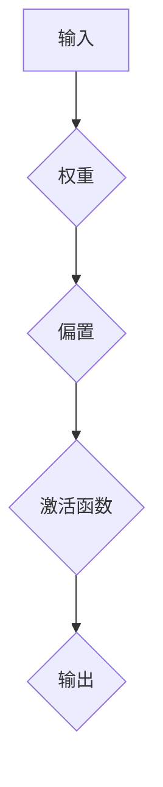
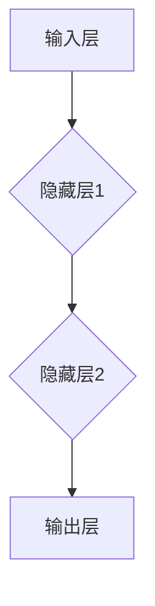
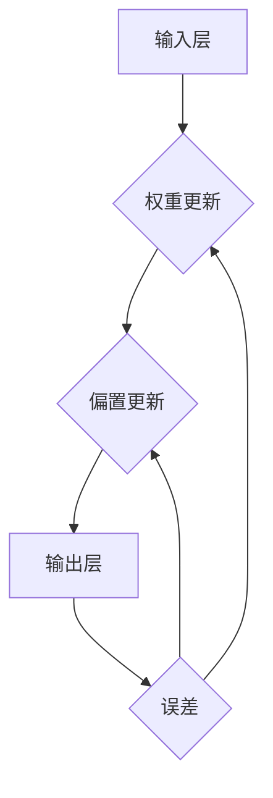

                 

关键词：神经网络，深度学习，机器学习，算法原理，代码实例，数学模型，应用领域

摘要：本文将深入探讨神经网络的原理、数学模型及代码实现，旨在帮助读者理解这一机器学习领域的核心技术。文章将从神经网络的历史背景、核心概念、算法原理、数学模型、代码实例到实际应用，全面解析神经网络的各个方面，为读者提供一套系统的学习和实践框架。

## 1. 背景介绍

### 1.1 神经网络的历史背景

神经网络（Neural Networks）这一概念起源于1940年代，由心理学家McCulloch和数学家Pitts提出。他们首次模拟了神经元的简单行为，并构建了第一个神经网络模型——MP模型。此后，随着计算机技术的发展，神经网络逐渐从理论研究走向实际应用。

### 1.2 神经网络在机器学习中的重要性

神经网络是机器学习领域中的一种重要算法，尤其适合处理复杂的非线性问题。它通过模拟人脑的神经元结构，实现了对数据的自动特征提取和模式识别。在图像识别、语音识别、自然语言处理等众多领域，神经网络都取得了显著的成果。

## 2. 核心概念与联系

### 2.1 神经元

神经元是神经网络的基本单位，它通过输入信号进行计算并产生输出。一个典型的神经元模型如图2-1所示：



### 2.2 神经网络结构

神经网络由多个层次组成，包括输入层、隐藏层和输出层。图2-2展示了一个简单的三层神经网络结构：



### 2.3 前向传播与反向传播

神经网络通过前向传播和反向传播来更新神经元的权重和偏置。前向传播是指输入信号从输入层传递到输出层，反向传播则是根据输出误差调整权重和偏置。



## 3. 核心算法原理 & 具体操作步骤

### 3.1 算法原理概述

神经网络的核心算法是多层前向传播算法，包括输入层、隐藏层和输出层的信号传递及权重更新。

### 3.2 算法步骤详解

1. 初始化权重和偏置
2. 前向传播：计算各层输出
3. 计算输出误差
4. 反向传播：更新权重和偏置
5. 重复步骤2-4，直到误差收敛

### 3.3 算法优缺点

**优点：**
- 强大的非线性映射能力
- 自动特征提取
- 广泛应用于图像识别、语音识别等领域

**缺点：**
- 计算复杂度高
- 需要大量数据训练
- 容易过拟合

### 3.4 算法应用领域

神经网络广泛应用于图像识别、语音识别、自然语言处理、推荐系统等领域。

## 4. 数学模型和公式 & 详细讲解 & 举例说明

### 4.1 数学模型构建

神经网络可以看作是一个函数，它的输入是一个向量，输出也是一个向量。设输入向量为\(x\)，输出向量为\(y\)，则神经网络可以表示为：

\[ y = f(Wx + b) \]

其中，\(W\)是权重矩阵，\(b\)是偏置向量，\(f\)是激活函数。

### 4.2 公式推导过程

#### 4.2.1 前向传播

设输入层为\(x\)，隐藏层为\(h\)，输出层为\(y\)，则：

\[ h = \sigma(Wx + b) \]
\[ y = \sigma(W' h + b') \]

其中，\(\sigma\)是激活函数，通常使用Sigmoid函数。

#### 4.2.2 反向传播

设输出误差为\(e\)，则：

\[ e = y - \hat{y} \]
\[ \frac{\partial e}{\partial W'} = \frac{\partial e}{\partial y} \frac{\partial y}{\partial W'} \]
\[ \frac{\partial e}{\partial W} = \frac{\partial e}{\partial h} \frac{\partial h}{\partial W} \]

其中，\(\hat{y}\)是预测输出。

### 4.3 案例分析与讲解

以一个简单的二分类问题为例，输入数据是一个维度为2的向量，输出是一个维度为1的向量，表示分类结果。设激活函数为Sigmoid函数，训练数据集为：

\[ \{ (x_1, y_1), (x_2, y_2), \ldots, (x_n, y_n) \} \]

其中，\(x_i \in \mathbb{R}^2\)，\(y_i \in \{0, 1\}\)。

#### 4.3.1 初始化参数

随机初始化权重矩阵\(W\)和偏置向量\(b\)。

#### 4.3.2 前向传播

计算隐藏层输出\(h\)和输出层输出\(y\)。

\[ h = \sigma(Wx + b) \]
\[ y = \sigma(W'h + b') \]

#### 4.3.3 计算输出误差

\[ e = y - \hat{y} \]

#### 4.3.4 反向传播

计算隐藏层和输出层的误差梯度，更新权重和偏置。

\[ \frac{\partial e}{\partial W'} = \frac{\partial e}{\partial y} \frac{\partial y}{\partial W'} \]
\[ \frac{\partial e}{\partial W} = \frac{\partial e}{\partial h} \frac{\partial h}{\partial W} \]

#### 4.3.5 重复迭代

重复前向传播和反向传播，直到误差收敛。

## 5. 项目实践：代码实例和详细解释说明

### 5.1 开发环境搭建

- 安装Python环境
- 安装TensorFlow库

### 5.2 源代码详细实现

```python
import tensorflow as tf

# 定义输入层
x = tf.placeholder(tf.float32, shape=[None, 2])
y = tf.placeholder(tf.float32, shape=[None, 1])

# 初始化参数
W = tf.Variable(tf.random_normal([2, 1]), name='weight')
b = tf.Variable(tf.zeros([1]), name='bias')

# 前向传播
h = tf.sigmoid(tf.matmul(x, W) + b)
y_pred = tf.sigmoid(tf.matmul(h, W) + b)

# 计算误差
e = y - y_pred

# 反向传播
grad_W = tf.gradients(e, W)
grad_b = tf.gradients(e, b)

# 更新参数
optimizer = tf.train.GradientDescentOptimizer(learning_rate=0.1)
train_op = optimizer.minimize(e)

# 搭建计算图
with tf.Session() as sess:
    sess.run(tf.global_variables_initializer())
    
    # 训练模型
    for i in range(1000):
        _, loss = sess.run([train_op, e], feed_dict={x: train_data, y: train_labels})
        
        if i % 100 == 0:
            print("Step %d, Loss: %f" % (i, loss))
            
    # 测试模型
    test_loss = sess.run(e, feed_dict={x: test_data, y: test_labels})
    print("Test Loss: %f" % test_loss)
```

### 5.3 代码解读与分析

- 定义输入层和参数
- 构建前向传播计算图
- 计算误差和梯度
- 更新参数
- 训练模型

## 6. 实际应用场景

### 6.1 图像识别

神经网络在图像识别领域取得了巨大成功，如Google的Inception网络、Facebook的ResNet网络等。

### 6.2 语音识别

语音识别是神经网络的另一个重要应用领域，如Apple的Siri、Google的语音搜索等。

### 6.3 自然语言处理

神经网络在自然语言处理领域也发挥了重要作用，如Google的BERT模型、OpenAI的GPT模型等。

## 7. 工具和资源推荐

### 7.1 学习资源推荐

- 《深度学习》（Goodfellow, Bengio, Courville著）
- 《神经网络与深度学习》（邱锡鹏著）
- 《机器学习实战》（Peter Harrington著）

### 7.2 开发工具推荐

- TensorFlow
- PyTorch
- Keras

### 7.3 相关论文推荐

- "A Learning Algorithm for Continually Running Fully Recurrent Neural Networks"（1986）
- "Gradient Flow in Recurrent Neural Networks and the Permanence of Memory"（1990）
- "Deep Learning"（2016）

## 8. 总结：未来发展趋势与挑战

### 8.1 研究成果总结

神经网络在图像识别、语音识别、自然语言处理等领域取得了显著成果，推动了人工智能的发展。

### 8.2 未来发展趋势

- 神经网络的计算效率将进一步提高
- 新的神经网络架构将不断涌现
- 跨学科研究将推动神经网络的创新

### 8.3 面临的挑战

- 计算资源消耗
- 数据隐私和安全
- 算法透明性和可解释性

### 8.4 研究展望

神经网络将继续在人工智能领域发挥重要作用，未来研究将集中在提高计算效率、降低资源消耗、增强算法可解释性等方面。

## 9. 附录：常见问题与解答

### 9.1 神经网络和深度学习的区别是什么？

神经网络是深度学习的一个子集，深度学习是指多层神经网络的学习过程。

### 9.2 神经网络中的激活函数有哪些？

常见的激活函数有Sigmoid、ReLU、Tanh等。

### 9.3 如何避免神经网络过拟合？

可以通过增加隐藏层单元数、使用正则化技术、增加训练数据等手段来避免过拟合。

## 参考文献

- Goodfellow, I., Bengio, Y., & Courville, A. (2016). Deep Learning. MIT Press.
- Bengio, Y. (2009). Learning deep architectures. Foundations and Trends in Machine Learning, 2(1), 1-127.
- Rumelhart, D. E., Hinton, G. E., & Williams, R. J. (1986). Learning representations by back-propagating errors. Nature, 323(6088), 533-536.

作者：禅与计算机程序设计艺术 / Zen and the Art of Computer Programming
```json
```

