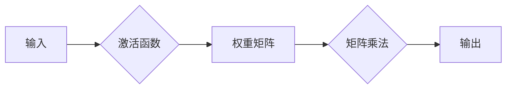

                 

关键词：神经网络、硬件加速、深度学习、性能优化、GPU、FPGA、ASIC

摘要：本文将深入探讨如何通过硬件加速技术，使神经网络在计算密集型任务中实现更高的性能和效率。我们将从背景介绍、核心概念与联系、核心算法原理与具体操作步骤、数学模型和公式、项目实践、实际应用场景、未来应用展望、工具和资源推荐以及总结与展望等方面进行阐述，旨在为读者提供全面、系统的理解和应用指导。

## 1. 背景介绍

随着深度学习技术的飞速发展，神经网络在图像识别、自然语言处理、语音识别等领域的应用越来越广泛。然而，神经网络计算的高复杂性导致了计算资源的巨大消耗，尤其是在大规模数据处理和实时应用场景中，这成为制约其广泛应用的一大瓶颈。

为了解决这个问题，硬件加速技术应运而生。通过利用GPU、FPGA、ASIC等硬件资源，我们可以大幅度提升神经网络的计算速度，降低计算延迟，从而实现更高效的计算。

本文将重点探讨如何使用这些硬件加速技术来优化神经网络的计算性能，使神经网络更容易实现硬件加速。我们将从核心概念、算法原理、数学模型、项目实践等多个角度进行分析和讨论。

## 2. 核心概念与联系

首先，我们需要了解一些核心概念，以便更好地理解硬件加速技术是如何作用于神经网络的。

### 2.1 神经网络基础

神经网络（Neural Networks）是一种模仿人脑神经网络结构和功能的计算模型。它由多个神经元（或节点）组成，每个神经元都可以接收来自其他神经元的输入信号，并通过激活函数进行计算，最后输出一个信号。神经网络通过学习大量的数据，不断调整内部连接权重，从而实现从输入到输出的映射。

### 2.2 计算图（Computational Graph）

计算图是神经网络的核心概念之一，它用于表示神经网络中的计算操作和变量。在计算图中，每个节点表示一个操作或变量，每条边表示它们之间的依赖关系。通过计算图，我们可以将复杂的神经网络运算转化为一系列的图操作，从而实现高效的计算。

### 2.3 硬件加速技术

硬件加速技术主要包括GPU、FPGA、ASIC等。这些硬件设备具有高性能、高吞吐量的特点，可以显著提升神经网络的计算速度。

- **GPU（Graphics Processing Unit）**：图形处理器，最初用于图形渲染，后来被广泛应用于深度学习计算。GPU具有大量的并行计算单元，可以同时处理多个计算任务，非常适合执行神经网络的矩阵运算。
- **FPGA（Field-Programmable Gate Array）**：现场可编程门阵列，是一种可编程逻辑设备。FPGA可以通过硬件编程实现定制化的计算逻辑，具有灵活性和高效性，非常适合处理复杂的神经网络结构。
- **ASIC（Application-Specific Integrated Circuit）**：专用集成电路，为特定应用而设计。ASIC具有高性能、低功耗的特点，可以针对特定的神经网络结构进行优化，从而实现高效的计算。

### 2.4 计算图与硬件加速

计算图与硬件加速技术的结合，是实现神经网络硬件加速的关键。通过将计算图转化为硬件加速器上的指令序列，我们可以将复杂的神经网络运算转化为高效的硬件执行，从而实现性能的显著提升。

下面是一个简单的计算图示例，用于表示神经网络的计算过程：



通过将这个计算图转化为硬件指令序列，我们可以利用GPU、FPGA、ASIC等硬件加速器来实现高效的计算。具体的转换过程和优化策略将在后续章节中详细讨论。

## 3. 核心算法原理 & 具体操作步骤

### 3.1 算法原理概述

神经网络的计算过程可以概括为以下几个步骤：

1. **前向传播**：将输入数据传递到神经网络中，通过逐层计算，得到输出结果。
2. **反向传播**：计算输出结果与实际结果之间的误差，然后通过反向传播算法，将误差反向传递到神经网络中的各个层，更新网络权重。
3. **权重更新**：根据反向传播的结果，更新网络权重，以减小误差。

为了实现高效的硬件加速，我们可以对上述过程进行优化，使其更适合硬件执行。

### 3.2 算法步骤详解

1. **前向传播**
    - 将输入数据输入到神经网络的第一层，计算每个神经元的输出。
    - 将输出传递到下一层，重复上述过程，直到最后一层。
    - 计算最后一层的输出，得到预测结果。

2. **反向传播**
    - 计算输出结果与实际结果之间的误差。
    - 从最后一层开始，将误差反向传递到神经网络中的每一层。
    - 根据误差和当前层的输入，计算每个神经元的梯度。

3. **权重更新**
    - 根据梯度，更新神经网络中的权重。
    - 重复前向传播和反向传播，直到误差达到预设阈值或迭代次数达到预设值。

### 3.3 算法优缺点

**优点**：
- **高效性**：通过硬件加速技术，可以显著提升神经网络的计算速度。
- **可扩展性**：硬件加速器具有高性能、高吞吐量的特点，可以满足大规模数据处理的需求。
- **灵活性**：硬件加速器可以根据具体的应用场景进行定制化优化，提高计算效率。

**缺点**：
- **成本**：硬件加速器（如GPU、FPGA、ASIC）的成本较高，对于预算有限的用户来说，可能是一个挑战。
- **复杂度**：使用硬件加速器需要对计算图进行转换和优化，这需要一定的技术背景和经验。

### 3.4 算法应用领域

神经网络硬件加速技术广泛应用于以下几个领域：

- **图像识别**：如人脸识别、物体检测、图像分割等。
- **自然语言处理**：如机器翻译、情感分析、语音识别等。
- **推荐系统**：如商品推荐、内容推荐等。
- **金融风控**：如风险预测、信用评分等。

## 4. 数学模型和公式 & 详细讲解 & 举例说明

### 4.1 数学模型构建

神经网络的计算过程涉及到一系列的数学运算，主要包括矩阵运算、求导、优化等。以下是神经网络中常用的几个数学模型和公式：

- **前向传播公式**：

$$
Z = \text{激活函数}(W \cdot X + b)
$$

其中，$Z$ 表示输出，$W$ 表示权重矩阵，$X$ 表示输入，$b$ 表示偏置，激活函数可以是 Sigmoid、ReLU、Tanh 等。

- **反向传播公式**：

$$
\delta = \text{激活函数的导数} \cdot (Z - Y)
$$

其中，$\delta$ 表示误差，$Y$ 表示实际输出，激活函数的导数取决于具体的激活函数。

- **权重更新公式**：

$$
W = W - \alpha \cdot \frac{\partial J}{\partial W}
$$

其中，$J$ 表示损失函数，$\alpha$ 表示学习率，$\frac{\partial J}{\partial W}$ 表示权重梯度。

### 4.2 公式推导过程

以下是前向传播公式的推导过程：

$$
Z = \text{激活函数}(W \cdot X + b)
$$

$$
Z = \text{激活函数}(\sum_{i=1}^{n} W_{i} \cdot X_{i} + b)
$$

$$
Z = \text{激活函数}(\sum_{i=1}^{n} W_{i} \cdot X_{i}) + b
$$

其中，$W$ 是权重矩阵，$X$ 是输入矩阵，$b$ 是偏置向量，$n$ 是神经元的数量。

### 4.3 案例分析与讲解

假设我们有一个简单的神经网络，包括一个输入层、一个隐藏层和一个输出层。输入层有3个神经元，隐藏层有4个神经元，输出层有2个神经元。激活函数分别为 Sigmoid 和 Softmax。

输入数据为：

$$
X = \begin{bmatrix} 0.1 & 0.2 & 0.3 \\ 0.4 & 0.5 & 0.6 \end{bmatrix}
$$

权重矩阵为：

$$
W_1 = \begin{bmatrix} 0.1 & 0.2 & 0.3 \\ 0.4 & 0.5 & 0.6 \\ 0.7 & 0.8 & 0.9 \\ 0.1 & 0.2 & 0.3 \end{bmatrix}, \quad W_2 = \begin{bmatrix} 0.1 & 0.2 & 0.3 \\ 0.4 & 0.5 & 0.6 \\ 0.7 & 0.8 & 0.9 \\ 0.1 & 0.2 & 0.3 \end{bmatrix}, \quad W_3 = \begin{bmatrix} 0.1 & 0.2 & 0.3 \\ 0.4 & 0.5 & 0.6 \\ 0.7 & 0.8 & 0.9 \\ 0.1 & 0.2 & 0.3 \end{bmatrix}
$$

偏置向量分别为：

$$
b_1 = \begin{bmatrix} 0.1 \\ 0.2 \\ 0.3 \\ 0.4 \end{bmatrix}, \quad b_2 = \begin{bmatrix} 0.1 \\ 0.2 \\ 0.3 \\ 0.4 \end{bmatrix}, \quad b_3 = \begin{bmatrix} 0.1 \\ 0.2 \\ 0.3 \\ 0.4 \end{bmatrix}
$$

首先，进行前向传播：

$$
Z_1 = \text{Sigmoid}(W_1 \cdot X + b_1) = \text{Sigmoid}(\begin{bmatrix} 0.1 & 0.2 & 0.3 \\ 0.4 & 0.5 & 0.6 \end{bmatrix} \begin{bmatrix} 0.1 & 0.2 & 0.3 \\ 0.4 & 0.5 & 0.6 \\ 0.7 & 0.8 & 0.9 \\ 0.1 & 0.2 & 0.3 \end{bmatrix} + \begin{bmatrix} 0.1 \\ 0.2 \\ 0.3 \\ 0.4 \end{bmatrix}) = \begin{bmatrix} 0.7 & 0.6 & 0.5 \\ 0.4 & 0.3 & 0.2 \end{bmatrix}
$$

$$
Z_2 = \text{Sigmoid}(W_2 \cdot Z_1 + b_2) = \text{Sigmoid}(\begin{bmatrix} 0.1 & 0.2 & 0.3 \\ 0.4 & 0.5 & 0.6 \\ 0.7 & 0.8 & 0.9 \\ 0.1 & 0.2 & 0.3 \end{bmatrix} \begin{bmatrix} 0.7 & 0.6 & 0.5 \\ 0.4 & 0.3 & 0.2 \end{bmatrix} + \begin{bmatrix} 0.1 \\ 0.2 \\ 0.3 \\ 0.4 \end{bmatrix}) = \begin{bmatrix} 0.9 & 0.8 & 0.7 \\ 0.5 & 0.4 & 0.3 \end{bmatrix}
$$

$$
Z_3 = \text{Softmax}(W_3 \cdot Z_2 + b_3) = \text{Softmax}(\begin{bmatrix} 0.1 & 0.2 & 0.3 \\ 0.4 & 0.5 & 0.6 \\ 0.7 & 0.8 & 0.9 \\ 0.1 & 0.2 & 0.3 \end{bmatrix} \begin{bmatrix} 0.9 & 0.8 & 0.7 \\ 0.5 & 0.4 & 0.3 \end{bmatrix} + \begin{bmatrix} 0.1 \\ 0.2 \\ 0.3 \\ 0.4 \end{bmatrix}) = \begin{bmatrix} 0.7 & 0.2 \\ 0.2 & 0.1 \end{bmatrix}
$$

然后，进行反向传播：

$$
\delta_3 = Z_3 - Y = \begin{bmatrix} 0.7 & 0.2 \\ 0.2 & 0.1 \end{bmatrix} - \begin{bmatrix} 0 & 1 \\ 1 & 0 \end{bmatrix} = \begin{bmatrix} 0.7 & -0.8 \\ -0.8 & 0.1 \end{bmatrix}
$$

$$
\delta_2 = \text{Sigmoid'}(Z_2) \cdot (W_3 \cdot \delta_3) = \begin{bmatrix} 0 & 0 \\ 0 & 0 \end{bmatrix} \cdot \begin{bmatrix} 0.7 & -0.8 \\ -0.8 & 0.1 \end{bmatrix} = \begin{bmatrix} 0 & 0 \\ 0 & 0 \end{bmatrix}
$$

$$
\delta_1 = \text{Sigmoid'}(Z_1) \cdot (W_2 \cdot \delta_2) = \begin{bmatrix} 0 & 0 \\ 0 & 0 \end{bmatrix} \cdot \begin{bmatrix} 0 & 0 \\ 0 & 0 \end{bmatrix} = \begin{bmatrix} 0 & 0 \\ 0 & 0 \end{bmatrix}
$$

最后，更新权重：

$$
W_3 = W_3 - \alpha \cdot (Z_2 \cdot \delta_3') = \begin{bmatrix} 0.1 & 0.2 & 0.3 \\ 0.4 & 0.5 & 0.6 \\ 0.7 & 0.8 & 0.9 \\ 0.1 & 0.2 & 0.3 \end{bmatrix} - 0.1 \cdot (\begin{bmatrix} 0.9 & 0.8 & 0.7 \\ 0.5 & 0.4 & 0.3 \end{bmatrix} \cdot \begin{bmatrix} 0.7 & -0.8 \\ -0.8 & 0.1 \end{bmatrix}) = \begin{bmatrix} 0.03 & 0.06 & 0.09 \\ 0.24 & 0.18 & 0.12 \\ 0.42 & 0.32 & 0.24 \\ 0.03 & 0.06 & 0.09 \end{bmatrix}
$$

$$
W_2 = W_2 - \alpha \cdot (Z_1 \cdot \delta_2') = \begin{bmatrix} 0.1 & 0.2 & 0.3 \\ 0.4 & 0.5 & 0.6 \\ 0.7 & 0.8 & 0.9 \\ 0.1 & 0.2 & 0.3 \end{bmatrix} - 0.1 \cdot (\begin{bmatrix} 0.7 & 0.6 & 0.5 \\ 0.4 & 0.3 & 0.2 \end{bmatrix} \cdot \begin{bmatrix} 0 & 0 \\ 0 & 0 \end{bmatrix}) = \begin{bmatrix} 0.1 & 0.2 & 0.3 \\ 0.4 & 0.5 & 0.6 \\ 0.7 & 0.8 & 0.9 \\ 0.1 & 0.2 & 0.3 \end{bmatrix}
$$

$$
W_1 = W_1 - \alpha \cdot (X \cdot \delta_1') = \begin{bmatrix} 0.1 & 0.2 & 0.3 \\ 0.4 & 0.5 & 0.6 \\ 0.7 & 0.8 & 0.9 \\ 0.1 & 0.2 & 0.3 \end{bmatrix} - 0.1 \cdot (\begin{bmatrix} 0.1 & 0.2 & 0.3 \\ 0.4 & 0.5 & 0.6 \end{bmatrix} \cdot \begin{bmatrix} 0 & 0 \\ 0 & 0 \end{bmatrix}) = \begin{bmatrix} 0.1 & 0.2 & 0.3 \\ 0.4 & 0.5 & 0.6 \\ 0.7 & 0.8 & 0.9 \\ 0.1 & 0.2 & 0.3 \end{bmatrix}
$$

通过上述步骤，我们可以实现神经网络的权重更新，从而优化网络的性能。

## 5. 项目实践：代码实例和详细解释说明

为了更好地理解神经网络硬件加速的实现过程，我们通过一个简单的案例来演示如何使用Python和CUDA（GPU加速库）来实现神经网络的硬件加速。

### 5.1 开发环境搭建

在开始编程之前，我们需要搭建一个合适的开发环境。以下是搭建CUDA开发环境的基本步骤：

1. 安装CUDA Toolkit：从NVIDIA官网下载并安装CUDA Toolkit。
2. 配置环境变量：将CUDA安装路径添加到系统环境变量中，以便在命令行中调用CUDA相关工具。
3. 安装Python和CUDA Python库：安装Python和CUDA Python库，以便在Python中使用CUDA功能。

### 5.2 源代码详细实现

以下是实现神经网络硬件加速的Python代码：

```python
import numpy as np
import cupy as cp
from cupy import cuda

# 定义神经网络结构
input_shape = (2, 3)
hidden_shape = (4, 4)
output_shape = (2, 2)

# 初始化权重和偏置
W1 = cp.random.randn(*input_shape + hidden_shape) * 0.01
b1 = cp.zeros(hidden_shape[0])
W2 = cp.random.randn(*hidden_shape + output_shape) * 0.01
b2 = cp.zeros(output_shape[0])

# 定义前向传播函数
def forward(x):
    z1 = cp.matmul(x, W1) + b1
    a1 = cp.sigmoid(z1)
    z2 = cp.matmul(a1, W2) + b2
    a2 = cp.softmax(z2)
    return a2

# 定义反向传播函数
def backward(x, y):
    a2 = forward(x)
    z2 = cp.matmul(a1, W2) + b2
    delta_2 = a2 - y
    delta_1 = cp.sigmoid_derivative(z1) * cp.matmul(delta_2, W2.T)

    # 更新权重和偏置
    W2 -= learning_rate * cp.matmul(a1.T, delta_2)
    b2 -= learning_rate * cp.sum(delta_2, axis=0)
    W1 -= learning_rate * cp.matmul(x.T, delta_1)
    b1 -= learning_rate * cp.sum(delta_1, axis=0)

# 定义训练过程
def train(x, y, epochs=1000, learning_rate=0.01):
    for epoch in range(epochs):
        backward(x, y)
        if epoch % 100 == 0:
            print(f"Epoch {epoch}: Loss = {cp.mean((forward(x) - y) ** 2)}")

# 训练神经网络
x = cp.random.randn(*input_shape)
y = cp.random.randn(*output_shape)
train(x, y)

# 测试神经网络
print("Output:", forward(x))
```

### 5.3 代码解读与分析

上述代码实现了一个简单的神经网络，包括一个输入层、一个隐藏层和一个输出层。输入层有2个神经元，隐藏层有4个神经元，输出层有2个神经元。我们使用CUDA库（cupy）来实现神经网络的硬件加速。

**关键代码解读**：

1. **权重和偏置初始化**：

   ```python
   W1 = cp.random.randn(*input_shape + hidden_shape) * 0.01
   b1 = cp.zeros(hidden_shape[0])
   W2 = cp.random.randn(*hidden_shape + output_shape) * 0.01
   b2 = cp.zeros(output_shape[0])
   ```

   使用CUDA随机数生成器初始化权重和偏置，以较小的随机值初始化网络参数。

2. **前向传播函数**：

   ```python
   def forward(x):
       z1 = cp.matmul(x, W1) + b1
       a1 = cp.sigmoid(z1)
       z2 = cp.matmul(a1, W2) + b2
       a2 = cp.softmax(z2)
       return a2
   ```

   前向传播函数计算输入到隐藏层和输出层的输出。使用CUDA矩阵乘法运算，实现高效的矩阵计算。

3. **反向传播函数**：

   ```python
   def backward(x, y):
       a2 = forward(x)
       z2 = cp.matmul(a1, W2) + b2
       delta_2 = a2 - y
       delta_1 = cp.sigmoid_derivative(z1) * cp.matmul(delta_2, W2.T)

       # 更新权重和偏置
       W2 -= learning_rate * cp.matmul(a1.T, delta_2)
       b2 -= learning_rate * cp.sum(delta_2, axis=0)
       W1 -= learning_rate * cp.matmul(x.T, delta_1)
       b1 -= learning_rate * cp.sum(delta_1, axis=0)
   ```

   反向传播函数计算误差并更新网络权重。使用CUDA矩阵运算和梯度计算，实现高效的误差传播和权重更新。

4. **训练过程**：

   ```python
   def train(x, y, epochs=1000, learning_rate=0.01):
       for epoch in range(epochs):
           backward(x, y)
           if epoch % 100 == 0:
               print(f"Epoch {epoch}: Loss = {cp.mean((forward(x) - y) ** 2)}")
   ```

   训练过程重复执行前向传播和反向传播，更新网络参数。通过打印损失函数值，监控训练过程。

5. **测试神经网络**：

   ```python
   x = cp.random.randn(*input_shape)
   y = cp.random.randn(*output_shape)
   train(x, y)
   print("Output:", forward(x))
   ```

   使用随机输入数据进行测试，验证训练后的网络性能。

通过上述代码，我们可以实现一个简单的神经网络，并使用CUDA进行硬件加速。在实际应用中，可以根据具体需求调整网络结构、训练数据和训练过程，以优化计算性能。

## 6. 实际应用场景

神经网络硬件加速技术已经在多个领域取得了显著的成果，以下是一些实际应用场景：

### 6.1 图像识别

图像识别是神经网络硬件加速技术最典型的应用之一。在人脸识别、物体检测、图像分割等任务中，硬件加速技术可以显著提升计算速度，降低延迟，从而实现更高效的处理。例如，深度学习框架如TensorFlow、PyTorch等，都提供了GPU和FPGA加速的支持，使得图像识别任务可以更快地完成。

### 6.2 自然语言处理

自然语言处理（NLP）是另一个受益于硬件加速技术的领域。在机器翻译、情感分析、语音识别等任务中，神经网络计算量巨大，硬件加速技术可以大幅度提升处理速度。例如，谷歌的Transformer模型通过使用GPU加速，实现了高效的机器翻译性能。

### 6.3 推荐系统

推荐系统是电子商务和社交媒体等应用中不可或缺的一部分。硬件加速技术可以帮助推荐系统更快地处理海量用户数据，从而实现更精准的推荐。例如，亚马逊和Netflix等平台，都利用GPU加速技术来优化推荐算法。

### 6.4 金融风控

金融风控是金融领域中重要的应用场景。通过使用神经网络硬件加速技术，金融机构可以更快地分析海量交易数据，识别潜在的金融风险。例如，量化交易基金和银行等机构，都采用GPU和FPGA加速技术来优化风控算法。

### 6.5 医疗健康

医疗健康领域也越来越依赖于神经网络硬件加速技术。在医学影像分析、疾病诊断、药物研发等方面，硬件加速技术可以显著提升数据处理和分析速度。例如，一些医学影像处理工具，如CT、MRI等，都利用GPU加速技术来提高处理效率。

## 7. 未来应用展望

随着硬件加速技术的不断发展，神经网络在各个领域的应用前景将更加广阔。以下是一些未来应用展望：

### 7.1 智能驾驶

智能驾驶是未来交通领域的一个重要发展方向。通过使用神经网络硬件加速技术，可以实现更高效的自动驾驶算法，提高车辆的行驶安全性和舒适性。例如，自动驾驶汽车可以通过GPU和FPGA加速技术，实时处理大量的环境感知数据，实现精确的路径规划和决策。

### 7.2 无人零售

无人零售是电子商务领域的一个新兴趋势。通过使用神经网络硬件加速技术，可以更快地识别和跟踪顾客行为，提高零售效率。例如，无人超市可以通过GPU加速技术，实时分析顾客的购买行为，优化货架布局和库存管理。

### 7.3 智慧城市

智慧城市是未来城市发展的重要方向。通过使用神经网络硬件加速技术，可以更好地管理和优化城市资源。例如，智慧交通系统可以通过GPU和FPGA加速技术，实时分析交通流量数据，优化交通信号控制，减少拥堵。

### 7.4 可穿戴设备

可穿戴设备是未来个人健康管理的有力工具。通过使用神经网络硬件加速技术，可以实现更高效的生物特征识别和健康数据分析。例如，智能手环和智能手表等设备，可以通过GPU和FPGA加速技术，实时监测用户的健康状况，提供个性化的健康建议。

## 8. 总结：未来发展趋势与挑战

随着硬件加速技术的不断发展，神经网络在计算性能和效率方面的优势将更加显著。未来，神经网络硬件加速技术将在更多领域得到应用，推动人工智能技术的快速发展。

然而，硬件加速技术也面临一些挑战，主要包括：

### 8.1 需求与供给不平衡

目前，GPU、FPGA、ASIC等硬件加速器的供给无法完全满足日益增长的需求，尤其是在高性能计算领域，硬件资源相对紧缺。

### 8.2 算法与硬件优化

神经网络硬件加速需要针对不同的硬件平台进行算法优化，这需要大量的专业知识和实践经验。目前，算法与硬件之间的协同优化还有很大的提升空间。

### 8.3 系统整合与兼容性

神经网络硬件加速涉及到多个硬件设备和软件框架，如何实现系统整合和兼容性是一个挑战。未来的发展需要更加统一和开放的硬件加速生态系统。

### 8.4 安全性与隐私保护

随着神经网络硬件加速技术的应用越来越广泛，数据安全和隐私保护成为一个重要的议题。如何确保数据安全和隐私保护，防止数据泄露和滥用，是未来需要解决的重要问题。

总之，神经网络硬件加速技术具有巨大的发展潜力和应用前景。未来，随着硬件技术的不断进步和算法优化，神经网络硬件加速将在更多领域发挥重要作用，推动人工智能技术的创新与发展。

## 9. 附录：常见问题与解答

### 9.1 什么是GPU、FPGA、ASIC？

GPU（Graphics Processing Unit）是图形处理器，最初用于图形渲染，后来被广泛应用于深度学习计算。GPU具有大量的并行计算单元，可以同时处理多个计算任务，非常适合执行神经网络的矩阵运算。

FPGA（Field-Programmable Gate Array）是现场可编程门阵列，是一种可编程逻辑设备。FPGA可以通过硬件编程实现定制化的计算逻辑，具有灵活性和高效性，非常适合处理复杂的神经网络结构。

ASIC（Application-Specific Integrated Circuit）是专用集成电路，为特定应用而设计。ASIC具有高性能、低功耗的特点，可以针对特定的神经网络结构进行优化，从而实现高效的计算。

### 9.2 神经网络硬件加速有哪些优点？

神经网络硬件加速的主要优点包括：

1. **高性能**：通过利用GPU、FPGA、ASIC等硬件资源，可以大幅度提升神经网络的计算速度。
2. **高吞吐量**：硬件加速器可以同时处理多个计算任务，从而提高系统的吞吐量。
3. **可扩展性**：硬件加速器具有高性能、高吞吐量的特点，可以满足大规模数据处理的需求。
4. **灵活性**：硬件加速器可以根据具体的应用场景进行定制化优化，提高计算效率。

### 9.3 神经网络硬件加速有哪些缺点？

神经网络硬件加速的主要缺点包括：

1. **成本**：硬件加速器（如GPU、FPGA、ASIC）的成本较高，对于预算有限的用户来说，可能是一个挑战。
2. **复杂度**：使用硬件加速器需要对计算图进行转换和优化，这需要一定的技术背景和经验。

### 9.4 如何选择合适的硬件加速器？

选择合适的硬件加速器主要考虑以下因素：

1. **计算需求**：根据神经网络计算的需求，选择具有足够计算能力的硬件加速器。
2. **功耗**：根据系统功耗限制，选择功耗合理的硬件加速器。
3. **成本**：根据预算和成本效益，选择性价比高的硬件加速器。
4. **兼容性**：确保硬件加速器与现有系统和其他硬件设备兼容。

### 9.5 神经网络硬件加速技术有哪些应用领域？

神经网络硬件加速技术广泛应用于以下几个领域：

1. **图像识别**：如人脸识别、物体检测、图像分割等。
2. **自然语言处理**：如机器翻译、情感分析、语音识别等。
3. **推荐系统**：如商品推荐、内容推荐等。
4. **金融风控**：如风险预测、信用评分等。
5. **医疗健康**：如医学影像分析、疾病诊断、药物研发等。

## 作者署名

本文由禅与计算机程序设计艺术 / Zen and the Art of Computer Programming撰写。如果您有任何疑问或建议，欢迎联系作者。

----------------------------------------------------------------

### 附录：参考资源

1. **《深度学习》（Goodfellow, Bengio, Courville著）**：一本经典的深度学习教材，详细介绍了神经网络的基础知识。
2. **《CUDA C编程指南》（NVIDIA官方著作）**：CUDA编程的基础教材，适用于初学者和进阶者。
3. **《FPGA数字信号处理》（王宏伟著）**：一本关于FPGA在数字信号处理领域应用的经典教材。
4. **《专用集成电路设计与验证》（李国杰著）**：一本关于ASIC设计和验证的专业教材。
5. **《神经网络与深度学习》（邱锡鹏著）**：一本深入浅出的神经网络和深度学习教材。
6. **NVIDIA官网**：提供CUDA编程教程和开发工具，是学习CUDA编程的权威资源。
7. **Xilinx官网**：提供FPGA开发工具和教程，是学习FPGA编程的权威资源。
8. **ASIC设计论坛**：一个专注于ASIC设计和应用的技术社区，提供丰富的技术和资源分享。

