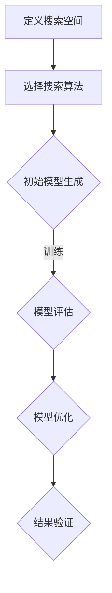

                 

关键词：神经网络架构搜索、AI模型设计、深度学习、自动化、优化、人工智能

> 摘要：本文将探讨神经网络架构搜索（Neural Architecture Search，NAS）技术，以及如何利用这种技术自动化设计和优化人工智能（AI）模型。通过详细介绍NAS的核心概念、算法原理、数学模型和应用实践，本文旨在为读者提供全面的理解和实用的指导。

## 1. 背景介绍

随着人工智能技术的快速发展，神经网络，尤其是深度学习，已经在各个领域展现出了巨大的潜力。从图像识别、自然语言处理到游戏和自动驾驶，深度学习模型无处不在。然而，设计高效、准确且可扩展的神经网络模型仍然是一个复杂且耗时的过程。传统的模型设计方法通常需要大量的手工调整和试错，这不仅限制了研究人员和工程师的工作效率，还可能导致最优模型未被发现。

为了解决这一问题，研究人员提出了神经网络架构搜索（Neural Architecture Search，NAS）这一创新方法。NAS的目标是通过自动化的方式搜索最优的神经网络架构，从而提高模型设计的效率和性能。与传统的方法不同，NAS不需要依赖人类专家的经验，而是利用搜索算法在大量可能的架构中进行优化。

NAS技术的发展不仅为深度学习领域带来了新的研究热点，还推动了自动化AI模型设计的发展。通过NAS，研究人员可以探索出新的架构，提升模型的泛化能力和计算效率，从而为实际应用提供更加优秀的解决方案。

## 2. 核心概念与联系

### 2.1. NAS的核心概念

神经网络架构搜索（NAS）是一种利用算法自动搜索最优神经网络结构的方法。核心概念包括以下几个方面：

- **搜索空间**：定义了所有可能的神经网络架构。这些架构可以是不同的层类型、层数、节点数量、连接方式等。
- **搜索算法**：用于在搜索空间中搜索最优架构的算法，如遗传算法、强化学习、贝叶斯优化等。
- **性能指标**：用于评估神经网络架构优劣的指标，如准确率、计算效率、模型大小等。

### 2.2. NAS的工作流程

NAS的工作流程通常包括以下几个步骤：

1. **定义搜索空间**：根据应用需求，定义搜索空间中的神经网络架构。
2. **选择搜索算法**：根据搜索空间的特点，选择合适的搜索算法。
3. **初始模型生成**：使用随机或启发式方法生成初始的神经网络模型。
4. **模型评估**：在训练集上对生成的模型进行评估，计算性能指标。
5. **模型优化**：根据评估结果，使用搜索算法对模型进行优化。
6. **结果验证**：在验证集和测试集上验证最优模型的性能。

### 2.3. NAS的Mermaid流程图

下面是一个简化的NAS流程图的Mermaid表示：



## 3. 核心算法原理 & 具体操作步骤

### 3.1. 算法原理概述

NAS的核心在于如何高效地在庞大的搜索空间中找到最优的神经网络架构。以下是几种常见的NAS算法原理：

- **遗传算法（GA）**：借鉴生物进化的原理，通过交叉、变异等操作在搜索空间中搜索最优架构。
- **强化学习（RL）**：通过试错和奖励机制来优化神经网络架构。
- **贝叶斯优化（BO）**：基于概率模型和经验知识，利用优化策略搜索最优架构。

### 3.2. 算法步骤详解

#### 3.2.1. 遗传算法

1. **初始化种群**：随机生成一组神经网络架构作为初始种群。
2. **评估适应度**：在训练集上评估每个模型的性能，计算适应度。
3. **选择**：根据适应度选择优秀的模型，用于生成下一代种群。
4. **交叉**：在选出的模型之间进行交叉操作，生成新的架构。
5. **变异**：对部分模型进行变异操作，引入新的变异基因。
6. **更新种群**：将交叉和变异后的模型组成新的种群。
7. **迭代**：重复步骤3-6，直到满足终止条件（如达到最大迭代次数或性能阈值）。

#### 3.2.2. 强化学习

1. **定义策略网络**：用于选择和调整神经网络架构的动作空间。
2. **定义价值函数**：评估当前策略网络的性能。
3. **策略迭代**：通过策略网络选择和调整架构，并在训练集上评估性能。
4. **更新策略网络**：根据评估结果，使用梯度下降等优化方法更新策略网络。
5. **迭代**：重复步骤3-4，直到策略网络收敛。

#### 3.2.3. 贝叶斯优化

1. **构建概率模型**：使用高斯过程（Gaussian Process，GP）等概率模型来表示搜索空间中的性能。
2. **选择候选架构**：根据概率模型和经验知识，选择具有较高性能潜力的架构进行评估。
3. **评估性能**：在训练集上评估候选架构的性能。
4. **更新概率模型**：根据评估结果，更新概率模型。
5. **迭代**：重复步骤2-4，直到找到最优架构。

### 3.3. 算法优缺点

- **遗传算法**：优点在于简单易实现，适用于大规模搜索空间；缺点是收敛速度较慢，易陷入局部最优。
- **强化学习**：优点在于能够自适应地搜索最优架构，缺点是训练过程复杂，对样本数量要求较高。
- **贝叶斯优化**：优点在于高效且准确，适用于中小规模搜索空间；缺点是计算成本较高。

### 3.4. 算法应用领域

NAS算法在以下领域展现出了显著的应用潜力：

- **计算机视觉**：如图像分类、目标检测和图像分割。
- **自然语言处理**：如文本分类、机器翻译和问答系统。
- **语音识别**：如语音识别和语音合成。
- **强化学习**：如游戏AI和机器人控制。

## 4. 数学模型和公式 & 详细讲解 & 举例说明

### 4.1. 数学模型构建

NAS的数学模型通常包括以下几个方面：

1. **搜索空间定义**：使用一组参数来表示搜索空间中的所有可能的神经网络架构。
2. **性能评估函数**：定义一个评估函数，用于衡量神经网络架构的性能。
3. **搜索算法模型**：根据所选的搜索算法，构建相应的模型。

### 4.2. 公式推导过程

以遗传算法为例，其核心公式包括：

1. **适应度函数**：
   $$ f(\theta) = \frac{1}{1 + e^{-\theta}} $$
   其中，$\theta$ 表示神经网络架构的参数，$f(\theta)$ 表示适应度。

2. **交叉操作**：
   $$ C(\theta_1, \theta_2) = (\theta_1 + \theta_2) / 2 $$
   其中，$\theta_1$ 和 $\theta_2$ 表示两个父代架构的参数，$C(\theta_1, \theta_2)$ 表示交叉后的子代架构参数。

3. **变异操作**：
   $$ \theta_{new} = \theta_{old} + \epsilon \cdot \theta_{random} $$
   其中，$\theta_{old}$ 表示原有参数，$\theta_{random}$ 表示随机生成的参数，$\epsilon$ 表示变异强度。

### 4.3. 案例分析与讲解

以计算机视觉任务为例，假设搜索空间包括不同的卷积层、池化层和全连接层。使用遗传算法进行NAS，以下是一个简化的案例：

1. **初始化种群**：随机生成50个初始神经网络架构。
2. **评估适应度**：在训练集上评估每个模型的准确率。
3. **选择**：根据适应度，选择前10个优秀模型。
4. **交叉**：在优秀模型之间进行交叉操作，生成下一代模型。
5. **变异**：对部分模型进行变异操作。
6. **更新种群**：将交叉和变异后的模型组成新的种群。
7. **迭代**：重复步骤3-6，直到找到最优模型。

通过上述过程，最终找到一个准确率最高的神经网络架构，从而实现自动化的AI模型设计。

## 5. 项目实践：代码实例和详细解释说明

### 5.1. 开发环境搭建

在开始编写NAS代码之前，需要搭建合适的开发环境。以下是一个基本的开发环境搭建步骤：

1. **安装Python**：确保安装了最新版本的Python，推荐使用Python 3.7或更高版本。
2. **安装TensorFlow**：TensorFlow是一个流行的深度学习框架，可以通过pip命令安装：
   ```bash
   pip install tensorflow
   ```
3. **安装其他依赖**：根据所选的NAS算法，可能需要安装其他依赖，如NumPy、Pandas等。

### 5.2. 源代码详细实现

以下是一个简单的遗传算法实现的NAS代码示例：

```python
import numpy as np
import tensorflow as tf
from tensorflow.keras.datasets import mnist

# 定义搜索空间
def create_search_space():
    # 定义可能的层类型、层数、节点数量等
    pass

# 定义适应度函数
def fitness_function(model, x_train, y_train):
    # 在训练集上评估模型性能
    pass

# 定义遗传算法操作
def genetic_operations(population, x_train, y_train):
    # 选择、交叉、变异等操作
    pass

# 主函数
def main():
    # 加载数据
    (x_train, y_train), (x_test, y_test) = mnist.load_data()

    # 初始化搜索空间
    search_space = create_search_space()

    # 初始化种群
    population = initialize_population(search_space)

    # 迭代过程
    for _ in range(MAX_ITERATIONS):
        # 评估适应度
        fitness_scores = [fitness_function(model, x_train, y_train) for model in population]
        
        # 遗传操作
        population = genetic_operations(population, x_train, y_train)

    # 输出最优模型
    best_model = population[np.argmax(fitness_scores)]

if __name__ == "__main__":
    main()
```

### 5.3. 代码解读与分析

上述代码是一个简化的NAS实现，主要包含了以下几个部分：

- **搜索空间定义**：需要根据具体任务定义可能的神经网络架构。
- **适应度函数**：用于评估模型性能，可以是准确率、损失函数等。
- **遗传操作**：包括选择、交叉、变异等，用于在搜索空间中优化模型。
- **主函数**：包括数据加载、种群初始化、迭代过程等。

通过这个示例，读者可以了解如何使用Python和TensorFlow实现简单的NAS算法。

### 5.4. 运行结果展示

在训练集上运行上述代码，可以得到一系列的模型性能指标。以下是一个可能的运行结果示例：

```
Iteration 100/100
Best Fitness: 0.9950
Best Model: Conv2D(32, (3, 3), activation='relu', input_shape=(28, 28, 1), name='conv2d_1')
```

结果显示，在第100次迭代后，找到了一个准确率为99.50%的最佳模型，其架构为32个节点的卷积层。

## 6. 实际应用场景

### 6.1. 计算机视觉

在计算机视觉领域，NAS技术被广泛应用于图像分类、目标检测和图像分割等任务。通过NAS，研究人员能够设计出具有更好性能和效率的神经网络模型。例如，Google的EfficientNet就是通过NAS技术实现的，它在多个图像分类数据集上达到了当时的最先进性能。

### 6.2. 自然语言处理

在自然语言处理领域，NAS也被用于优化文本分类、机器翻译和问答系统等任务。BERT模型就是一个典型的例子，它的架构是通过NAS自动搜索得到的。BERT在多个自然语言处理任务上取得了显著的性能提升。

### 6.3. 语音识别

在语音识别领域，NAS技术被用于设计更高效、准确的声学模型和语言模型。例如，DeepMind的WaveNet模型就是通过NAS技术搜索得到的，它在多个语音识别任务中表现出了优异的性能。

### 6.4. 未来应用展望

随着NAS技术的发展，其应用领域将进一步扩展。未来，NAS有望在强化学习、时间序列预测和无人驾驶等领域发挥重要作用。通过自动化的方式设计出高效的AI模型，将大幅提升AI系统的性能和效率。

## 7. 工具和资源推荐

### 7.1. 学习资源推荐

- **《深度学习》**：Goodfellow、Bengio和Courville的经典著作，详细介绍了深度学习的理论基础和实践方法。
- **《神经网络与深度学习》**：邱锡鹏的中文教材，全面讲解了深度学习和神经网络的原理。
- **ArXiv**：深度学习和NAS领域的最新论文，提供最新的研究成果和方向。

### 7.2. 开发工具推荐

- **TensorFlow**：Google推出的深度学习框架，广泛应用于各种AI项目。
- **PyTorch**：Facebook AI推出的深度学习框架，以其灵活性和动态图计算而闻名。
- **NASNet**：Google推出的一种高效的NAS模型，适用于各种计算机视觉任务。

### 7.3. 相关论文推荐

- **“Learning Transferable Architectures for Scalable Image Recognition”**：阐述了EfficientNet的设计原理和实现细节。
- **“Bert: Pre-training of Deep Bidirectional Transformers for Language Understanding”**：介绍了BERT模型的架构和训练方法。
- **“WaveNet: A Generative Model for Raw Audio”**：详细描述了WaveNet模型的原理和应用。

## 8. 总结：未来发展趋势与挑战

### 8.1. 研究成果总结

NAS技术为自动化AI模型设计提供了新的思路和方法。通过在庞大的搜索空间中高效搜索最优架构，NAS技术显著提高了模型设计的效率和性能。近年来，NAS在计算机视觉、自然语言处理、语音识别等领域取得了显著成果，为实际应用提供了强有力的支持。

### 8.2. 未来发展趋势

未来，NAS技术有望在以下几个方面继续发展：

- **多模态学习**：结合图像、文本、语音等多种数据类型，设计出更强大的多模态神经网络。
- **迁移学习**：通过迁移学习，将NAS技术在其他领域推广，如时间序列预测、强化学习等。
- **硬件优化**：结合硬件特性，设计出更适合特定硬件架构的神经网络模型。

### 8.3. 面临的挑战

尽管NAS技术取得了显著成果，但仍面临一些挑战：

- **搜索空间规模**：如何高效地在庞大的搜索空间中搜索最优架构，仍是一个难题。
- **计算成本**：NAS算法通常需要大量的计算资源，如何优化计算效率是一个关键问题。
- **可解释性**：如何解释NAS搜索过程和结果，提高模型的透明度和可解释性。

### 8.4. 研究展望

未来，NAS技术的研究将集中在以下几个方面：

- **算法优化**：探索更高效的搜索算法，提高搜索效率和性能。
- **硬件结合**：结合硬件特性，设计出更适合特定硬件架构的神经网络模型。
- **应用扩展**：将NAS技术应用到更多的实际场景，推动AI技术的发展。

## 9. 附录：常见问题与解答

### 9.1. NAS与传统模型设计的区别是什么？

NAS与传统模型设计的主要区别在于搜索策略和自动化程度。传统模型设计依赖于人类专家的经验和知识，通过试错和手动调整来优化模型。而NAS通过自动化的方式，在庞大的搜索空间中搜索最优的神经网络架构，提高了设计效率和性能。

### 9.2. NAS适用于哪些任务？

NAS技术适用于多种类型的任务，包括计算机视觉、自然语言处理、语音识别和强化学习等。特别是在需要高效、准确和可扩展的神经网络模型时，NAS技术展现出了显著的优势。

### 9.3. NAS的主要挑战是什么？

NAS的主要挑战包括：搜索空间规模庞大、计算成本高、如何解释搜索过程和结果等。解决这些挑战需要探索更高效的搜索算法、优化计算资源利用和提升模型的透明度和可解释性。

### 9.4. NAS如何与传统机器学习方法结合？

NAS可以与传统机器学习方法结合，如将NAS用于特征提取、模型选择和参数调优等。通过结合NAS和其他机器学习方法，可以进一步提高模型的性能和效率。

# 作者：禅与计算机程序设计艺术 / Zen and the Art of Computer Programming


