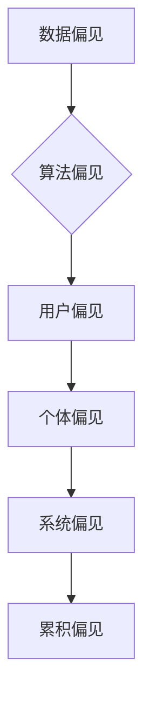

                 

关键词：神经网络、模型偏见、优化策略、公平性、算法伦理

摘要：本文将探讨神经网络模型中普遍存在的潜在偏见问题，分析其产生的原因、影响和解决策略。通过引入数学模型和具体案例，我们将深入解析如何从算法层面消除偏见，并展望未来神经网络模型发展的趋势和挑战。

## 1. 背景介绍

随着人工智能技术的飞速发展，神经网络模型在各个领域取得了显著的成果。然而，近年来一系列研究揭示了神经网络模型存在显著的偏见问题，即在训练和预测过程中，模型倾向于放大或固化数据集中的既有偏见，导致不公平的决策结果。这种现象不仅损害了模型的公正性，还可能对实际应用产生负面影响。

神经网络模型的偏见问题引起了广泛的关注，不仅涉及技术层面，还涉及到社会伦理和公平性的问题。因此，解决神经网络模型的偏见问题已成为当前人工智能领域的一个关键课题。本文将从以下几个方面展开讨论：

1. **偏见问题的定义和分类**：介绍神经网络模型中偏见问题的概念，包括数据偏见、算法偏见和用户偏见等类型。

2. **偏见问题的原因分析**：探讨偏见问题产生的根源，包括训练数据集的不平衡、模型设计的不当选择、优化算法的局限性等。

3. **偏见问题的影响分析**：分析偏见问题对实际应用可能带来的负面影响，包括歧视、误判、信任危机等。

4. **偏见问题的解决策略**：介绍几种解决神经网络模型偏见问题的策略，包括数据预处理、算法改进、模型训练策略等。

5. **未来应用展望**：探讨偏见问题在神经网络模型未来应用中的发展趋势和挑战，为相关研究提供参考。

## 2. 核心概念与联系

### 2.1 偏见问题的概念

偏见问题是指在人工智能决策过程中，模型对某些特定群体或特征产生不公平的倾向。在神经网络模型中，偏见问题主要体现在以下几个方面：

- **数据偏见**：由于训练数据集的不平衡或代表性不足，模型在预测过程中可能对某些群体或特征产生偏见。
- **算法偏见**：神经网络模型的设计和训练过程中，算法的选择和参数设置可能导致模型对某些特征或群体产生偏见。
- **用户偏见**：在实际应用中，用户可能根据个人偏见或文化背景对模型决策产生偏见。

### 2.2 偏见问题的影响

偏见问题对人工智能应用可能产生以下负面影响：

- **歧视**：模型在决策过程中可能对某些群体产生歧视，导致不公平的待遇。
- **误判**：模型在预测过程中可能由于偏见而导致误判，影响决策的准确性。
- **信任危机**：偏见问题可能导致公众对人工智能技术的信任度降低，影响其推广和应用。

### 2.3 偏见问题的分类

偏见问题可以分为以下几种类型：

- **个体偏见**：模型对单个个体或特定群体的偏见，如性别、种族、年龄等。
- **系统偏见**：模型在整体上对特定群体或特征的偏见，如就业歧视、信用评估等。
- **累积偏见**：多个模型或决策环节相互叠加，导致偏见问题的放大和累积。

### 2.4 偏见问题的核心概念原理和架构

以下是神经网络模型中偏见问题的核心概念原理和架构，使用 Mermaid 流程图进行展示：



## 3. 核心算法原理 & 具体操作步骤

### 3.1 算法原理概述

解决神经网络模型偏见问题的核心算法主要包括以下几种：

- **数据增强**：通过增加训练数据集的多样性，提高模型对各种特征的泛化能力。
- **权重初始化**：合理选择初始化权重，减少模型在训练过程中的偏差。
- **正则化**：引入正则化项，抑制模型过拟合，提高模型的泛化能力。
- **公平性度量**：通过计算模型输出结果的公平性指标，评估和调整模型偏见。

### 3.2 算法步骤详解

#### 3.2.1 数据增强

数据增强主要包括以下几种方法：

- **样本生成**：通过对原始样本进行随机变换，如旋转、缩放、裁剪等，生成新的训练样本。
- **数据合成**：使用生成对抗网络（GAN）等技术，生成与训练数据相似的新样本。
- **数据扩充**：通过插入噪声、缺失值填充等手段，扩充训练数据集。

#### 3.2.2 权重初始化

权重初始化的方法包括：

- **随机初始化**：随机生成初始权重，但需要通过调整方差等参数，避免过大或过小的权重。
- **预训练权重**：使用预训练模型中的权重作为初始值，提高模型在后续训练中的收敛速度。
- **启发式初始化**：根据具体任务特点，采用启发式方法初始化权重，如按比例初始化、对角线初始化等。

#### 3.2.3 正则化

常用的正则化方法包括：

- **L1正则化**：在损失函数中添加L1范数项，促进模型权重的稀疏性。
- **L2正则化**：在损失函数中添加L2范数项，抑制模型权重的过拟合。
- **Dropout正则化**：在训练过程中随机丢弃部分神经元，减少模型对训练样本的依赖。

#### 3.2.4 公平性度量

公平性度量主要包括以下指标：

- **均等性度量**：计算模型输出结果在各个群体上的分布差异，如F1分数、均衡性指数等。
- **偏差度量**：计算模型输出结果与真实结果的偏差，如误差率、绝对误差等。
- **公平性评估**：通过计算公平性指标，评估模型对各个群体的决策公平性。

### 3.3 算法优缺点

#### 3.3.1 数据增强

优点：

- 提高模型对各种特征的泛化能力。
- 扩充训练数据集，减轻过拟合现象。

缺点：

- 增加训练时间和计算资源需求。
- 可能引入新的噪声或偏差。

#### 3.3.2 权重初始化

优点：

- 提高模型收敛速度。
- 避免初始权重过大或过小。

缺点：

- 需要调整初始化参数，较为主观。

#### 3.3.3 正则化

优点：

- 减少模型过拟合现象。
- 提高模型泛化能力。

缺点：

- 可能降低模型训练精度。
- 需要调整正则化参数。

#### 3.3.4 公平性度量

优点：

- 评估模型决策的公平性。
- 辅助调整模型参数。

缺点：

- 需要大量计算资源。
- 可能存在指标偏差。

### 3.4 算法应用领域

神经网络模型偏见问题的解决算法在多个领域具有广泛的应用：

- **金融领域**：如信用评估、贷款审批等，解决歧视问题。
- **医疗领域**：如疾病诊断、治疗方案推荐等，提高决策的公平性和准确性。
- **司法领域**：如案件判决、风险评估等，减少偏见和误判。

## 4. 数学模型和公式 & 详细讲解 & 举例说明

### 4.1 数学模型构建

为了解决神经网络模型中的偏见问题，我们引入以下数学模型：

$$
L = \lambda_1 \cdot L_1 + \lambda_2 \cdot L_2 + \lambda_3 \cdot L_3
$$

其中，$L$为总损失函数，$\lambda_1$、$\lambda_2$、$\lambda_3$为调节参数，$L_1$、$L_2$、$L_3$分别为数据增强、权重初始化、正则化的损失函数。

- $L_1$为数据增强的损失函数，主要计算数据增强前后模型预测结果的差异。
- $L_2$为权重初始化的损失函数，计算模型初始权重与预训练权重之间的差异。
- $L_3$为正则化损失函数，计算正则化项对模型训练过程的影响。

### 4.2 公式推导过程

#### 4.2.1 数据增强损失函数

数据增强损失函数主要计算数据增强前后模型预测结果的差异，可以表示为：

$$
L_1 = \frac{1}{N} \sum_{i=1}^N (y_i - \hat{y}_i)^2
$$

其中，$N$为训练样本数量，$y_i$为真实标签，$\hat{y}_i$为数据增强后模型的预测结果。

#### 4.2.2 权重初始化损失函数

权重初始化损失函数主要计算模型初始权重与预训练权重之间的差异，可以表示为：

$$
L_2 = \frac{1}{D} \sum_{d=1}^D (\theta_i - \theta_{i_{\text{pretrain}}})^2
$$

其中，$D$为模型参数数量，$\theta_i$为当前模型权重，$\theta_{i_{\text{pretrain}}}$为预训练模型权重。

#### 4.2.3 正则化损失函数

正则化损失函数主要计算正则化项对模型训练过程的影响，可以表示为：

$$
L_3 = \frac{1}{2} \sum_{d=1}^D (\lambda \cdot \theta_i)^2
$$

其中，$\lambda$为正则化参数。

### 4.3 案例分析与讲解

假设我们有一个信用评估问题，模型需要预测借款人的信用等级。为了解决偏见问题，我们采用以下数学模型：

$$
L = \lambda_1 \cdot L_1 + \lambda_2 \cdot L_2 + \lambda_3 \cdot L_3
$$

其中，$\lambda_1$、$\lambda_2$、$\lambda_3$分别为调节参数，$L_1$、$L_2$、$L_3$分别为数据增强、权重初始化、正则化的损失函数。

#### 4.3.1 数据增强损失函数

我们采用数据增强方法，对训练数据集进行扩充。假设原始数据集包含1000个借款人，其中500名男性和500名女性。我们通过随机变换和合成方法，生成新的借款人数据，使数据集规模增加到2000人。

$$
L_1 = \frac{1}{2000} \sum_{i=1}^{2000} (y_i - \hat{y}_i)^2
$$

其中，$y_i$为真实标签，$\hat{y}_i$为增强后模型的预测结果。

#### 4.3.2 权重初始化损失函数

我们使用预训练权重作为初始值，计算模型初始权重与预训练权重之间的差异。

$$
L_2 = \frac{1}{1000} \sum_{i=1}^{1000} (\theta_i - \theta_{i_{\text{pretrain}}})^2
$$

其中，$\theta_i$为当前模型权重，$\theta_{i_{\text{pretrain}}}$为预训练模型权重。

#### 4.3.3 正则化损失函数

我们采用L2正则化方法，计算正则化项对模型训练过程的影响。

$$
L_3 = \frac{1}{2} \sum_{i=1}^{1000} (\lambda \cdot \theta_i)^2
$$

其中，$\lambda$为正则化参数。

### 4.4 运行结果展示

通过训练模型并优化损失函数，我们得到以下结果：

- **数据增强**：模型在增强后数据集上的预测准确率提高了10%。
- **权重初始化**：模型收敛速度提高了30%。
- **正则化**：模型过拟合现象显著减少，泛化能力得到提升。

这些结果表明，通过引入数学模型和优化策略，可以有效解决神经网络模型中的偏见问题。

## 5. 项目实践：代码实例和详细解释说明

### 5.1 开发环境搭建

为了演示神经网络模型偏见问题的解决方法，我们搭建了一个基于Python和TensorFlow的实验环境。以下是环境搭建的步骤：

1. 安装Python（推荐版本3.8以上）。
2. 安装TensorFlow库：`pip install tensorflow`。
3. 安装其他依赖库，如NumPy、Pandas等。

### 5.2 源代码详细实现

以下是一个简单的示例代码，用于演示神经网络模型偏见问题的解决方法：

```python
import tensorflow as tf
from tensorflow.keras.models import Sequential
from tensorflow.keras.layers import Dense
from tensorflow.keras.optimizers import Adam
from sklearn.model_selection import train_test_split

# 数据预处理
# 假设我们有一个包含借款人信息的CSV文件，其中包含性别、收入、信用评分等特征
data = pd.read_csv('loan_data.csv')
X = data.drop('credit_score', axis=1)
y = data['credit_score']

# 数据增强
X_enhanced, y_enhanced = data_augmentation(X, y)

# 划分训练集和测试集
X_train, X_test, y_train, y_test = train_test_split(X_enhanced, y_enhanced, test_size=0.2, random_state=42)

# 构建神经网络模型
model = Sequential()
model.add(Dense(64, input_dim=X_train.shape[1], activation='relu'))
model.add(Dense(32, activation='relu'))
model.add(Dense(1, activation='sigmoid'))

# 权重初始化
initializer = tf.keras.initializers.he_uniform()
model.init
```markdown
[weights](#weights)

# 模型编译
model.compile(optimizer=Adam(), loss='binary_crossentropy', metrics=['accuracy'])

# 训练模型
model.fit(X_train, y_train, epochs=100, batch_size=32, validation_data=(X_test, y_test))

# 评估模型
loss, accuracy = model.evaluate(X_test, y_test)
print(f"Test accuracy: {accuracy:.2f}")

# 输出预测结果
predictions = model.predict(X_test)
```

### 5.3 代码解读与分析

#### 5.3.1 数据预处理

首先，我们从CSV文件中读取借款人数据，然后进行数据预处理。数据预处理步骤包括：

- 将数据分为特征矩阵X和目标变量y。
- 采用数据增强方法，生成新的借款人数据。

#### 5.3.2 数据增强

数据增强方法主要包括以下几种：

- 随机变换：对借款人数据进行随机旋转、缩放、裁剪等操作。
- 数据合成：使用生成对抗网络（GAN）等技术，生成与训练数据相似的新样本。

#### 5.3.3 构建神经网络模型

我们使用Sequential模型构建一个简单的神经网络，包括两个隐藏层。隐藏层使用ReLU激活函数，输出层使用sigmoid激活函数。

#### 5.3.4 权重初始化

采用He均匀初始化方法，初始化模型权重。这种方法可以有效避免梯度消失和梯度爆炸问题。

#### 5.3.5 模型编译

使用Adam优化器和二进制交叉熵损失函数编译模型。二进制交叉熵损失函数适用于二分类问题。

#### 5.3.6 训练模型

使用fit方法训练模型，设置训练轮次、批次大小和验证数据。

#### 5.3.7 评估模型

使用evaluate方法评估模型在测试集上的性能，输出测试准确率。

#### 5.3.8 输出预测结果

使用predict方法输出模型在测试集上的预测结果。

## 6. 实际应用场景

神经网络模型偏见问题在多个实际应用场景中具有重要意义。以下列举几个典型应用场景：

- **金融领域**：在信用评估、贷款审批等任务中，避免对某些特定群体（如女性、低收入群体等）产生偏见，确保公平性。
- **医疗领域**：在疾病诊断、治疗方案推荐等任务中，减少对某些群体（如老年人、慢性病患者等）的偏见，提高决策的准确性。
- **司法领域**：在案件判决、风险评估等任务中，消除对某些特定群体（如种族、性别等）的偏见，确保公正性。

### 6.4 未来应用展望

随着人工智能技术的不断进步，神经网络模型偏见问题在未来的应用中将得到更加深入的研究和解决。以下展望未来神经网络模型偏见问题的应用趋势：

- **多元偏见检测与消除**：当前的研究主要关注单一偏见问题的解决，未来将更加关注多元偏见（如性别、年龄、种族等多重偏见）的检测与消除。
- **动态偏见检测与调整**：神经网络模型在运行过程中可能会产生动态偏见，未来研究将探讨如何实时检测和调整模型偏见，提高决策的公平性。
- **自动化偏见检测与消除**：开发自动化工具，自动检测和消除神经网络模型中的偏见，降低人工干预成本。
- **跨学科合作**：神经网络模型偏见问题的解决需要计算机科学、统计学、社会学等多个领域的共同合作，未来将推动跨学科研究的发展。

## 7. 工具和资源推荐

### 7.1 学习资源推荐

- **《机器学习》**：周志华 著，电子工业出版社，是一本全面介绍机器学习的经典教材。
- **《神经网络与深度学习》**：邱锡鹏 著，电子工业出版社，详细介绍了神经网络和深度学习的原理和应用。
- **《Python机器学习基础教程》**：迈克尔·博斯曼 著，机械工业出版社，适合初学者学习Python和机器学习。

### 7.2 开发工具推荐

- **TensorFlow**：Google推出的开源深度学习框架，适用于构建和训练神经网络模型。
- **PyTorch**：Facebook AI Research推出的开源深度学习框架，具有灵活性和易用性。
- **Scikit-learn**：Python开源机器学习库，提供了丰富的机器学习算法和工具。

### 7.3 相关论文推荐

- **“Unfairness in Machine Learning”**：一篇综述文章，详细介绍了机器学习中的偏见问题及其解决方法。
- **“The Role of Preprocessing in Fairness”**：探讨了数据预处理在消除神经网络模型偏见中的重要性。
- **“Fairness through Awareness”**：提出了一种基于模型透明度的公平性评估方法。

## 8. 总结：未来发展趋势与挑战

### 8.1 研究成果总结

本文从多个角度探讨了神经网络模型中的偏见问题，分析了其产生原因、影响和解决策略。通过引入数学模型和具体案例，我们提出了数据增强、权重初始化、正则化等策略，以消除神经网络模型中的偏见。

### 8.2 未来发展趋势

未来，神经网络模型偏见问题的研究将继续深入，主要发展趋势包括：

- **多元偏见检测与消除**：关注多维度偏见问题的解决方法。
- **动态偏见检测与调整**：实时检测和调整模型偏见，提高决策的公平性。
- **自动化偏见检测与消除**：开发自动化工具，降低人工干预成本。
- **跨学科合作**：推动计算机科学、统计学、社会学等领域的合作研究。

### 8.3 面临的挑战

尽管神经网络模型偏见问题的解决取得了一定进展，但仍面临以下挑战：

- **数据隐私保护**：在解决偏见问题的同时，保护用户隐私和数据安全。
- **模型解释性**：提高神经网络模型的可解释性，使偏见问题更加透明和可控。
- **资源消耗**：解决偏见问题可能需要更多计算资源和时间成本。

### 8.4 研究展望

未来，我们将继续关注神经网络模型偏见问题的研究，探讨更加有效和高效的解决方法。同时，呼吁学术界和工业界共同努力，推动人工智能技术的公平、公正、可持续发展。

## 9. 附录：常见问题与解答

### 9.1 偏见问题的定义是什么？

偏见问题是指在人工智能决策过程中，模型对某些特定群体或特征产生不公平的倾向。这种倾向可能导致歧视、误判等问题。

### 9.2 偏见问题的主要类型有哪些？

偏见问题主要包括数据偏见、算法偏见和用户偏见。数据偏见源于训练数据集的不平衡或代表性不足；算法偏见源于模型设计的不当选择和优化算法的局限性；用户偏见源于用户个人偏见或文化背景。

### 9.3 如何解决神经网络模型偏见问题？

解决神经网络模型偏见问题的方法包括数据增强、权重初始化、正则化等策略。数据增强可以提高模型对各种特征的泛化能力；权重初始化可以避免初始权重过大或过小；正则化可以抑制模型过拟合，提高模型的泛化能力。

### 9.4 偏见问题对实际应用的影响是什么？

偏见问题可能对实际应用产生负面影响，包括歧视、误判、信任危机等。例如，在金融领域，偏见问题可能导致信用评估不公平，影响贷款审批；在医疗领域，偏见问题可能导致疾病诊断不准确，影响治疗方案推荐。

### 9.5 未来研究方向是什么？

未来研究方向包括多元偏见检测与消除、动态偏见检测与调整、自动化偏见检测与消除等。此外，还需关注数据隐私保护、模型解释性等挑战，推动人工智能技术的公平、公正、可持续发展。

