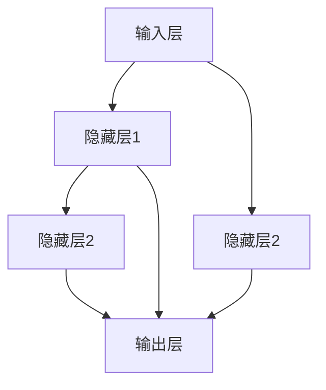
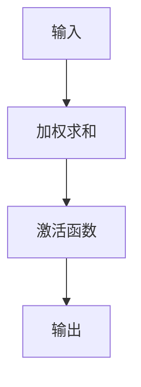

                 

关键词：神经网络、机器学习、人工智能、深度学习、人类协同、算法优化、应用领域、未来展望

摘要：本文探讨了神经网络技术的发展与应用，分析了其如何实现人类与机器的共存。通过介绍神经网络的核心概念、算法原理、数学模型以及实际应用案例，文章旨在为读者提供一个全面的视角，了解神经网络在现代科技中的重要作用及其未来发展潜力。

## 1. 背景介绍

神经网络，作为一种模仿人脑结构和功能的计算模型，起源于20世纪40年代。当时，数学家麦卡洛克（Warren McCulloch）和皮特斯（Walter Pitts）首次提出了简单的神经网络模型。随着计算机技术的发展，神经网络的研究逐渐深入，特别是在20世纪80年代末和90年代初，随着反向传播算法的提出，神经网络迎来了新的发展机遇。进入21世纪，随着大数据、云计算和深度学习等技术的推动，神经网络的应用范围得到了极大的拓展。

在人工智能领域，神经网络被认为是实现智能机器的关键技术之一。通过模拟人脑神经元之间的连接和信号传递，神经网络可以在大量数据中自动学习模式和特征，从而实现图像识别、自然语言处理、决策优化等多种任务。神经网络的崛起，不仅改变了计算机科学的研究方向，也对人类社会的各个领域产生了深远的影响。

## 2. 核心概念与联系

### 2.1 神经元模型

神经元是神经网络的基本组成单元，其结构可以简化为一个输入层、一个输出层以及若干个隐藏层。每个神经元接收多个输入信号，通过权重进行加权求和，再经过激活函数处理后产生输出。



### 2.2 权重与偏置

在神经网络中，每个神经元之间的连接都带有权重（weights），这些权重决定了输入信号对输出的影响程度。此外，每个神经元还有一个偏置（bias），用于调整输出值。

### 2.3 激活函数

激活函数是神经网络中至关重要的部分，它将线性组合的输入转化为非线性的输出，使得神经网络能够拟合复杂的非线性关系。常见的激活函数包括Sigmoid、ReLU、Tanh等。



## 3. 核心算法原理 & 具体操作步骤

### 3.1 算法原理概述

神经网络的训练过程主要包括两个阶段：前向传播（forward propagation）和反向传播（backward propagation）。

- **前向传播**：输入数据通过网络从输入层传递到输出层，每个神经元计算其输入的加权求和并应用激活函数。
- **反向传播**：根据网络输出与目标值的差异，计算损失函数，并使用梯度下降法更新网络权重和偏置。

### 3.2 算法步骤详解

1. **初始化权重和偏置**：通常使用较小的随机值初始化权重和偏置，以确保网络的随机性。
2. **前向传播**：将输入数据传递到网络中，计算每个神经元的输出。
3. **计算损失函数**：计算网络输出与目标值之间的差异，常用的损失函数包括均方误差（MSE）和交叉熵（CE）。
4. **反向传播**：计算损失函数关于网络权重的梯度，并更新权重和偏置。
5. **迭代训练**：重复上述步骤，直到网络达到预设的训练精度或迭代次数。

### 3.3 算法优缺点

- **优点**：
  - 强大的拟合能力，能够处理复杂的非线性问题。
  - 自适应学习，能够从大量数据中提取特征。
- **缺点**：
  - 计算量大，训练时间较长。
  - 对数据质量和预处理要求较高。

### 3.4 算法应用领域

神经网络在图像识别、语音识别、自然语言处理、自动驾驶、医疗诊断等多个领域都有广泛的应用。

## 4. 数学模型和公式

### 4.1 数学模型构建

神经网络的数学模型主要包括以下部分：

- **输入层**：表示为\( X \)。
- **隐藏层**：表示为\( H \)。
- **输出层**：表示为\( Y \)。

### 4.2 公式推导过程

- **前向传播**：

$$
Z = X \cdot W + b
$$

$$
A = \sigma(Z)
$$

其中，\( Z \) 是加权求和的结果，\( A \) 是激活函数的输出，\( \sigma \) 表示激活函数。

- **反向传播**：

$$
\delta = \frac{\partial L}{\partial Z}
$$

$$
\frac{\partial L}{\partial W} = A \cdot \delta \cdot X^T
$$

$$
\frac{\partial L}{\partial b} = A \cdot \delta
$$

其中，\( \delta \) 是误差项，\( L \) 是损失函数。

### 4.3 案例分析与讲解

以图像识别任务为例，神经网络通过训练学习图像的特征，从而能够对未知图像进行分类。具体的训练过程涉及到输入层、隐藏层和输出层的多次迭代计算。

## 5. 项目实践：代码实例和详细解释说明

### 5.1 开发环境搭建

- **Python**：用于实现神经网络算法。
- **TensorFlow**：用于构建和训练神经网络。

### 5.2 源代码详细实现

```python
import tensorflow as tf

# 定义神经网络模型
model = tf.keras.Sequential([
    tf.keras.layers.Dense(units=64, activation='relu', input_shape=(784,)),
    tf.keras.layers.Dense(units=10, activation='softmax')
])

# 编译模型
model.compile(optimizer='adam',
              loss='categorical_crossentropy',
              metrics=['accuracy'])

# 加载训练数据
(x_train, y_train), (x_test, y_test) = tf.keras.datasets.mnist.load_data()

# 预处理数据
x_train = x_train / 255.0
x_test = x_test / 255.0

# 训练模型
model.fit(x_train, y_train, epochs=10, batch_size=32)
```

### 5.3 代码解读与分析

- **定义模型**：使用TensorFlow的`Sequential`模型，定义输入层、隐藏层和输出层。
- **编译模型**：设置优化器、损失函数和评估指标。
- **加载数据**：从MNIST数据集中加载训练数据和测试数据。
- **预处理数据**：对数据进行归一化处理。
- **训练模型**：使用训练数据训练神经网络。

### 5.4 运行结果展示

- **准确率**：通过测试数据评估模型的准确率，可以观察到随着训练次数的增加，准确率逐渐提高。

## 6. 实际应用场景

神经网络在图像识别、语音识别、自然语言处理等领域都有广泛的应用。例如，在医疗诊断中，神经网络可以用于疾病检测和预测；在自动驾驶中，神经网络可以用于环境感知和路径规划。

### 6.1 图像识别

通过训练神经网络学习图像特征，可以实现对未知图像的分类。例如，使用卷积神经网络（CNN）对数字进行识别。

### 6.2 语音识别

使用神经网络训练模型，可以将语音信号转换为文本。例如，使用循环神经网络（RNN）进行语音识别。

### 6.3 自然语言处理

神经网络在自然语言处理领域也有广泛应用，例如文本分类、机器翻译和情感分析等。

## 7. 工具和资源推荐

### 7.1 学习资源推荐

- **《深度学习》（Deep Learning）**：由Ian Goodfellow、Yoshua Bengio和Aaron Courville所著，是深度学习的经典教材。
- **《神经网络与深度学习》（Neural Networks and Deep Learning）**：由Amenable Li和Zhou Yang所著，适合初学者入门。

### 7.2 开发工具推荐

- **TensorFlow**：用于构建和训练神经网络的流行开源框架。
- **PyTorch**：另一个流行的开源深度学习框架，具有简洁的API和强大的功能。

### 7.3 相关论文推荐

- **"Backpropagation" (1986)**：由Paul Werbos首次提出的反向传播算法。
- **"A Learning Algorithm for Continually Running Fully Recurrent Neural Networks" (1990)**：由David E. Rumelhart、Geoffrey E. Hinton和Ronald J. Williams提出的Rprop算法。

## 8. 总结：未来发展趋势与挑战

### 8.1 研究成果总结

神经网络在过去几十年取得了显著的研究成果，已经成为人工智能领域的重要技术之一。从简单的感知机到复杂的深度学习模型，神经网络的发展不断推动人工智能的应用和进步。

### 8.2 未来发展趋势

随着大数据、云计算和量子计算的快速发展，神经网络在未来将继续发挥重要作用。未来的研究热点包括：优化算法、模型压缩、自适应学习和跨模态学习等。

### 8.3 面临的挑战

神经网络的发展也面临一些挑战，包括计算资源需求、数据隐私和安全、模型可解释性等。如何解决这些问题，是未来研究的重要方向。

### 8.4 研究展望

神经网络在实现人类与机器的共存方面具有巨大潜力。通过不断的研究和创新，神经网络将有望在更多领域发挥关键作用，推动人工智能的发展。

## 9. 附录：常见问题与解答

### 9.1 神经网络是什么？

神经网络是一种模仿人脑结构和功能的计算模型，通过模拟神经元之间的连接和信号传递，实现数据的自动学习和模式识别。

### 9.2 神经网络有哪些应用领域？

神经网络在图像识别、语音识别、自然语言处理、自动驾驶、医疗诊断等多个领域都有广泛应用。

### 9.3 如何优化神经网络的性能？

优化神经网络的性能可以从多个方面入手，包括选择合适的激活函数、调整网络结构、优化训练算法等。

---

作者：禅与计算机程序设计艺术 / Zen and the Art of Computer Programming
----------------------------------------------------------------


