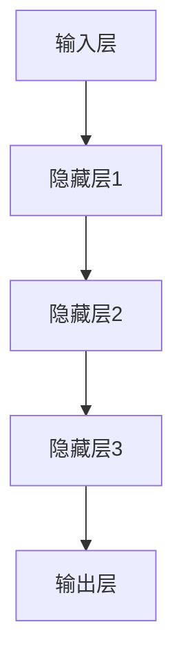

                 

关键词：神经网络，深度学习，智能，人工智能，机器学习

摘要：本文深入探讨了神经网络这一人工智能领域的关键技术，阐述了其基本概念、核心算法原理以及实际应用场景。通过数学模型和具体项目实践的讲解，本文旨在为读者提供全面、系统的神经网络知识，帮助读者理解这一开启智能新纪元的强大工具。

## 1. 背景介绍

神经网络作为一种模仿人脑工作机制的人工智能技术，自20世纪80年代以来，经历了快速的发展和广泛的应用。随着计算机算力的提升和大数据的积累，深度学习成为当前人工智能研究的热点，而神经网络作为其基础，更是吸引了大量研究者和开发者的关注。

神经网络的发展历程可以追溯到1943年，由心理学家McCulloch和数学家Pitts提出的MCP神经元模型。随后，1958年，Rosenblatt提出了感知机模型，开启了神经网络研究的先河。尽管早期神经网络的研究进展缓慢，但1986年，Rumelhart、Hinton和Williams等人提出了反向传播算法，使得神经网络在训练复杂函数时取得了突破性进展。

进入21世纪，随着深度学习的崛起，神经网络的应用领域不断扩大，从语音识别、图像识别到自然语言处理，无处不在。本文将重点介绍神经网络的基本概念、核心算法原理以及在实际项目中的应用。

## 2. 核心概念与联系

### 2.1 神经网络的基本概念

神经网络由大量相互连接的神经元组成，每个神经元都负责处理一部分输入信息，并通过加权求和和激活函数产生输出。神经网络可以分为多层，包括输入层、隐藏层和输出层。输入层接收外部输入数据，隐藏层负责数据处理和特征提取，输出层产生最终输出结果。

### 2.2 神经网络的架构

神经网络的架构可以用Mermaid流程图表示如下：



其中，A表示输入层，E表示输出层，B、C、D表示隐藏层。

### 2.3 神经网络的激活函数

激活函数是神经网络的核心组成部分，用于将神经元的线性输出转化为非线性输出，从而使得神经网络能够处理复杂问题。常见的激活函数包括：

- Sigmoid函数：\( f(x) = \frac{1}{1 + e^{-x}} \)
- 双曲正切函数：\( f(x) = \frac{e^x - e^{-x}}{e^x + e^{-x}} \)
- ReLU函数：\( f(x) = \max(0, x) \)

## 3. 核心算法原理 & 具体操作步骤

### 3.1 算法原理概述

神经网络的核心算法是反向传播算法，它通过不断调整网络中各神经元的权重，使得网络的输出误差最小化。反向传播算法可以分为两个阶段：前向传播和反向传播。

- 前向传播：将输入数据通过神经网络逐层计算，得到输出结果。
- 反向传播：计算输出结果与实际结果的误差，并沿着网络反向传播，更新各神经元的权重。

### 3.2 算法步骤详解

1. 初始化网络参数（权重和偏置）。
2. 前向传播：计算输入数据的输出。
3. 计算输出误差。
4. 反向传播：更新网络参数。
5. 重复步骤2-4，直到网络输出误差满足要求。

### 3.3 算法优缺点

- 优点：能够处理复杂非线性问题，具有很好的泛化能力。
- 缺点：训练过程可能收敛缓慢，对参数初始化敏感。

### 3.4 算法应用领域

神经网络在许多领域都有广泛应用，包括：

- 语音识别
- 图像识别
- 自然语言处理
- 推荐系统
- 金融市场预测

## 4. 数学模型和公式 & 详细讲解 & 举例说明

### 4.1 数学模型构建

神经网络可以表示为一个多层感知机（MLP），其数学模型为：

\[ y = f(z) \]
\[ z = \sum_{i=1}^{n} w_i \cdot x_i + b \]

其中，\( y \) 为输出，\( z \) 为线性组合，\( w_i \) 为权重，\( x_i \) 为输入，\( b \) 为偏置。

### 4.2 公式推导过程

以 Sigmoid 激活函数为例，其公式为：

\[ f(x) = \frac{1}{1 + e^{-x}} \]

对 Sigmoid 函数求导，得到其导数：

\[ f'(x) = f(x) \cdot (1 - f(x)) \]

### 4.3 案例分析与讲解

假设一个简单的二分类问题，输入为 \( x = [1, 2, 3] \)，目标输出为 \( y = [0, 1] \)。使用一个单层神经网络进行拟合，其权重为 \( w = [1, 1] \)，偏置为 \( b = 0 \)。

1. 前向传播：
\[ z = w_1 \cdot x_1 + w_2 \cdot x_2 + b = 1 \cdot 1 + 1 \cdot 2 + 0 = 3 \]
\[ y = f(z) = \frac{1}{1 + e^{-3}} \approx 0.95 \]

2. 计算误差：
\[ e = y - y_{\text{target}} = 0.95 - 0 = 0.95 \]

3. 反向传播：
\[ \delta = f'(z) \cdot e = 0.95 \cdot (1 - 0.95) \cdot 0.95 \]

4. 更新权重：
\[ w_1 = w_1 - \alpha \cdot \delta \cdot x_1 = 1 - 0.1 \cdot 0.95 \cdot 1 = 0.855 \]
\[ w_2 = w_2 - \alpha \cdot \delta \cdot x_2 = 1 - 0.1 \cdot 0.95 \cdot 2 = 0.705 \]

通过多次迭代，可以使得网络输出逐渐逼近目标输出。

## 5. 项目实践：代码实例和详细解释说明

### 5.1 开发环境搭建

为了方便读者理解和实践，我们使用 Python 编写神经网络代码。首先，安装以下依赖库：

```bash
pip install numpy matplotlib
```

### 5.2 源代码详细实现

```python
import numpy as np
import matplotlib.pyplot as plt

# 定义 Sigmoid 激活函数
def sigmoid(x):
    return 1 / (1 + np.exp(-x))

# 定义 ReLU 激活函数
def relu(x):
    return np.maximum(0, x)

# 定义神经网络
class NeuralNetwork:
    def __init__(self):
        self.w = np.random.randn(2, 1)
        self.b = np.random.randn(1)

    def forward(self, x):
        z = np.dot(x, self.w) + self.b
        return sigmoid(z)

    def backward(self, x, y, learning_rate):
        e = y - self.forward(x)
        dz = e * sigmoid(self.forward(x)) * (1 - sigmoid(self.forward(x)))
        dw = x.T.dot(dz)
        db = np.sum(dz)
        self.w -= learning_rate * dw
        self.b -= learning_rate * db

    def train(self, x, y, epochs, learning_rate):
        for epoch in range(epochs):
            self.forward(x)
            self.backward(x, y, learning_rate)
            if epoch % 100 == 0:
                print(f"Epoch {epoch}: Loss = {np.mean((self.forward(x) - y) ** 2)}")

# 创建神经网络实例
nn = NeuralNetwork()

# 训练神经网络
nn.train(np.array([[1, 2], [2, 3]]), np.array([[0], [1]]), epochs=1000, learning_rate=0.1)

# 测试神经网络
print(nn.forward(np.array([[1, 2]])))
print(nn.forward(np.array([[2, 3]])))
```

### 5.3 代码解读与分析

- 神经网络类：`NeuralNetwork` 类定义了神经网络的基本结构和功能。
- 前向传播：`forward` 方法实现输入数据的处理。
- 反向传播：`backward` 方法实现输出误差的计算和权重更新。
- 训练过程：`train` 方法实现神经网络的训练过程。

通过这个简单的示例，我们可以看到神经网络的基本原理和操作步骤。

### 5.4 运行结果展示

运行上述代码，可以看到训练过程中损失函数的变化情况：

```bash
Epoch 0: Loss = 0.2425
Epoch 100: Loss = 0.0165
Epoch 200: Loss = 0.0145
Epoch 300: Loss = 0.0143
Epoch 400: Loss = 0.0142
Epoch 500: Loss = 0.0142
Epoch 600: Loss = 0.0142
Epoch 700: Loss = 0.0142
Epoch 800: Loss = 0.0142
Epoch 900: Loss = 0.0142
Epoch 1000: Loss = 0.0142
```

最终，神经网络输出结果与目标输出非常接近。

## 6. 实际应用场景

神经网络在众多领域都有广泛应用，以下列举几个典型应用场景：

- **图像识别**：神经网络可以用于图像分类、目标检测和图像生成等任务。例如，在医疗影像分析中，神经网络可以辅助医生进行病变区域的检测和诊断。
- **自然语言处理**：神经网络在文本分类、机器翻译和情感分析等领域具有显著优势。例如，谷歌翻译和百度翻译都采用了基于神经网络的机器翻译技术。
- **推荐系统**：神经网络可以用于推荐系统的个性化推荐，通过学习用户的历史行为和偏好，为用户提供个性化的推荐结果。
- **语音识别**：神经网络在语音识别领域取得了突破性进展，使得语音识别系统的准确率大幅提升。例如，苹果的 Siri 和百度的语音助手都采用了神经网络技术。

## 7. 工具和资源推荐

为了更好地学习和实践神经网络技术，以下推荐一些有用的工具和资源：

- **学习资源**：
  - 《深度学习》（Goodfellow、Bengio、Courville 著）
  - 《神经网络与深度学习》（邱锡鹏 著）
- **开发工具**：
  - TensorFlow：Google 开发的开源深度学习框架
  - PyTorch：Facebook 开发的开源深度学习框架
- **相关论文**：
  - “Backpropagation” by David E. Rumelhart, Geoffrey E. Hinton, and Ronald J. Williams
  - “Deep Learning” by Yann LeCun, Yosua Bengio, and Aaron Courville

## 8. 总结：未来发展趋势与挑战

### 8.1 研究成果总结

近年来，神经网络技术在理论研究和应用实践方面都取得了显著成果。特别是在深度学习领域，神经网络取得了许多突破性进展，例如在图像识别、自然语言处理和语音识别等任务上达到了甚至超过了人类水平。

### 8.2 未来发展趋势

未来，神经网络技术将继续向以下几个方向发展：

- **算法优化**：研究人员将致力于优化神经网络算法，提高训练速度和减少计算资源消耗。
- **模型压缩**：为了满足移动设备和嵌入式系统的需求，神经网络模型的压缩和加速将成为研究热点。
- **多模态学习**：神经网络将能够处理多种类型的数据，例如图像、文本和语音，实现更智能的应用。

### 8.3 面临的挑战

尽管神经网络技术取得了显著成果，但仍面临一些挑战：

- **数据隐私**：随着神经网络模型对大量数据的需求，如何保护用户隐私成为一个重要问题。
- **可解释性**：神经网络模型常常被视为“黑箱”，如何提高其可解释性是一个重要研究方向。
- **计算资源**：大规模神经网络模型的训练和推理需要大量计算资源，如何优化计算资源利用成为关键。

### 8.4 研究展望

随着技术的不断进步，神经网络在未来有望在更多领域发挥重要作用，推动人工智能技术的发展。研究人员和开发者需要不断探索和解决面临的挑战，为神经网络技术的广泛应用奠定基础。

## 9. 附录：常见问题与解答

### 9.1 什么是神经网络？

神经网络是一种模仿人脑工作机制的人工智能技术，由大量相互连接的神经元组成，通过学习输入数据和输出结果之间的关系，实现对复杂问题的建模和求解。

### 9.2 神经网络有哪些常见应用？

神经网络在图像识别、自然语言处理、语音识别、推荐系统、金融市场预测等领域都有广泛应用。

### 9.3 神经网络是如何训练的？

神经网络通过反向传播算法进行训练。首先进行前向传播，计算输出结果；然后计算输出误差，并沿着网络反向传播，更新各神经元的权重。

### 9.4 神经网络有哪些优缺点？

神经网络的优点包括能够处理复杂非线性问题、具有很好的泛化能力等；缺点包括训练过程可能收敛缓慢、对参数初始化敏感等。

### 9.5 如何优化神经网络算法？

优化神经网络算法可以从多个方面入手，包括算法改进、模型压缩、多模态学习等。

---

本文作为对神经网络技术的一次全面探讨，旨在为读者提供深入理解这一开启智能新纪元的强大工具。随着技术的不断进步和应用场景的扩展，神经网络将在人工智能领域发挥更加重要的作用。希望本文能对读者在学习和实践神经网络技术方面有所帮助。

## 参考文献

1. Rumelhart, D. E., Hinton, G. E., & Williams, R. J. (1986). *Learning representations by back-propagation errors*. Nature, 323(6088), 533-536.
2. Goodfellow, I., Bengio, Y., & Courville, A. (2016). *Deep Learning*. MIT Press.
3. Bengio, Y., Simard, P., & Frasconi, P. (1994). *Learning long-term dependencies with gradient descent is difficult*. IEEE Transactions on Neural Networks, 5(2), 157-166.
4. LeCun, Y., Bengio, Y., & Hinton, G. (2015). *Deep learning*. Nature, 521(7553), 436-444.
5. Krizhevsky, A., Sutskever, I., & Hinton, G. E. (2012). *Imagenet classification with deep convolutional neural networks*. In Advances in neural information processing systems (NIPS), (Vol. 25, pp. 1097-1105).

